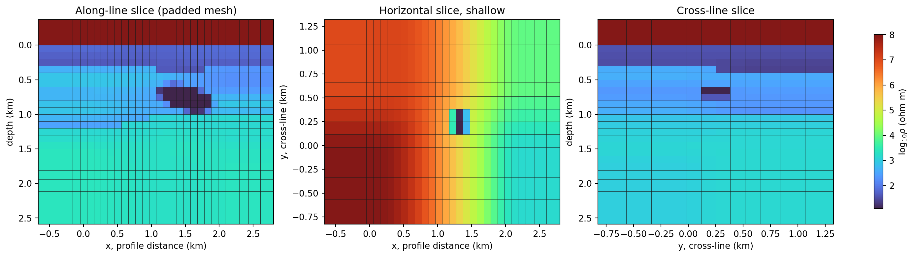
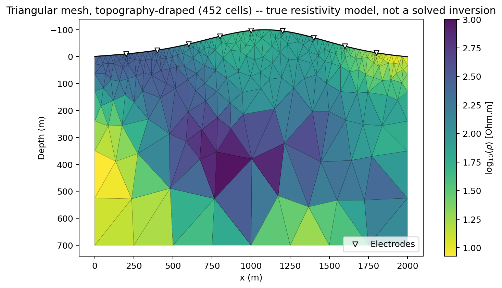
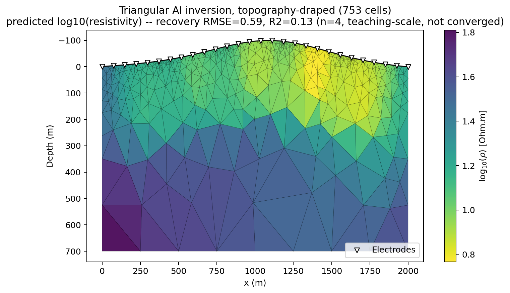

.. _api-mesh:

Mesh Display
============

:mod:`pycsamt.api.mesh` is the shared drawing layer for every computational
or inversion mesh pyCSAMT renders -- resistivity sections, AI-inversion
priors, solver meshes, and triangular MARE2DEM/in-house-FEM geometry alike.
It centralizes how a mesh looks so that switching between mesh *families* or
between quick-look and QC figures never means switching drawing code.

Two mesh families share one preset system:

* a **structured (rectilinear)** tensor grid --
  :class:`~pycsamt.forward.maxwell.contracts.MaxwellMesh` or
  :class:`~pycsamt.ai.geology.fields.GeologyGrid` -- drawn by
  :func:`~pycsamt.api.draw_mesh` from 1-D cell-boundary arrays;
* an **unstructured triangular** mesh --
  :class:`~pycsamt.forward.maxwell.contracts_tri.TriMesh` -- drawn by
  :func:`~pycsamt.api.draw_tri_mesh` from its node/triangle connectivity.

Both follow the same ``configure_*``/``reset_*``/``PYCSAMT_<FAMILY>`` pattern
every other :mod:`pycsamt.api` family uses -- see :doc:`overview` if that
convention is new to you.

.. code-block:: pycon

   >>> from pycsamt.api import PYCSAMT_MESH
   >>> print(PYCSAMT_MESH)
   PyCSAMTMesh
     diagram: fill=False, edge=True, edge_alpha=0.9
     filled: fill=True, edge=False, edge_alpha=0.6
     review: fill=True, edge=True, edge_alpha=0.55

Three Presets, Shared By Both Families
--------------------------------------

.. list-table::
   :header-rows: 1
   :widths: 18 22 60

   * - Preset
     - Layers
     - Use it for
   * - ``"filled"`` (default)
     - color fill only
     - the historical look -- identical to a bare ``pcolormesh``/
       ``tripcolor`` call. Publication figures, quick looks.
   * - ``"review"``
     - color fill + cell edges
     - quality control: seeing exactly where cell boundaries fall relative
       to a resistivity anomaly, a receiver, or a topography break.
   * - ``"diagram"``
     - cell edges only, no fill
     - inspecting a solver mesh's discretization *before* running an
       inversion -- resolution near receivers, padding extent, triangle
       shape quality.

Structured (Rectilinear) Meshes
-------------------------------

:func:`~pycsamt.api.draw_mesh` takes 1-D, strictly monotonic cell-boundary
arrays -- not centres. Build them directly, or convert from a mesh contract
object with :func:`~pycsamt.api.edges_from_maxwell_mesh` (for a
:class:`~pycsamt.forward.maxwell.contracts.MaxwellMesh`, which already
stores edges) or :func:`~pycsamt.api.edges_from_geology_grid` (for a
:class:`~pycsamt.ai.geology.fields.GeologyGrid`, which stores centres and
needs :func:`~pycsamt.api.cell_edges_from_centres` under the hood):

.. code-block:: pycon

   >>> import numpy as np
   >>> from pycsamt.forward.maxwell import MaxwellMesh
   >>> from pycsamt.api import draw_mesh, edges_from_maxwell_mesh

   >>> x_edges = np.linspace(0.0, 1000.0, 11)
   >>> z_edges = np.linspace(0.0, 500.0, 6)
   >>> mesh = MaxwellMesh(x_edges, z_edges)
   >>> mesh.shape
   (5, 10)

   >>> resistivity = np.full(mesh.shape, 100.0)
   >>> resistivity[1:3, 3:6] = 10.0  # a shallow conductive block

   >>> x_e2, z_e2 = edges_from_maxwell_mesh(mesh)
   >>> np.array_equal(x_e2, x_edges), np.array_equal(z_e2, z_edges)
   (True, True)

Draw the plain, filled default -- no ``preset`` needed:

.. code-block:: pycon

   >>> import matplotlib.pyplot as plt
   >>> fig, ax = plt.subplots(figsize=(6, 3))
   >>> fill, edges = draw_mesh(ax, x_edges, z_edges, resistivity, cmap="turbo_r")
   >>> fill is not None, edges is None
   (True, True)

Add a colorbar the same way any pyCSAMT figure does:

.. code-block:: pycon

   >>> from pycsamt.api.plot import add_colorbar
   >>> cbar = add_colorbar(fill, ax=ax, label="Resistivity (Ohm.m)")
   >>> type(cbar).__name__
   'Colorbar'

Switch to ``"review"`` to see the mesh boundaries drawn on top of the same
fill -- useful right after building a solver mesh, to confirm the anomaly
sits inside the cells you expect it to:

.. code-block:: pycon

   >>> fig, ax = plt.subplots(figsize=(6, 3))
   >>> fill, edges = draw_mesh(
   ...     ax, x_edges, z_edges, resistivity, preset="review", cmap="turbo_r"
   ... )
   >>> fill is not None, edges is not None
   (True, True)

Or drop the fill entirely with ``"diagram"`` to inspect discretization alone
-- ``values`` is not required (and is ignored if passed) when the fill layer
is off:

.. code-block:: pycon

   >>> fig, ax = plt.subplots(figsize=(6, 3))
   >>> fill, edges = draw_mesh(ax, x_edges, z_edges, preset="diagram")
   >>> fill is None, edges is not None
   (True, True)

   ``draw_mesh(..., preset="review")`` in real use: mesh cell boundaries
   drawn over a 3-D geological prior and padded solver mesh, from
   :doc:`the porphyry-mineralization tutorial
   </tutorials/map_porphyry_mineralization_from_noisy_amt>`. The same
   overlay works whether the mesh underneath is a training prior or a
   converged inversion result -- ``draw_mesh`` only cares about edges and
   cell values, not what produced them.

Triangular Meshes
-----------------

:func:`~pycsamt.api.draw_tri_mesh` is the unstructured counterpart, sharing
the exact same preset objects so ``"filled"``/``"review"``/``"diagram"``
behave identically. It takes per-*triangle* values (not per-node) and
builds a :class:`matplotlib.tri.Triangulation` internally via
:func:`~pycsamt.api.triangulation_from_tri_mesh`:

.. code-block:: pycon

   >>> from scipy.spatial import Delaunay
   >>> from pycsamt.forward.maxwell import TriMesh
   >>> from pycsamt.api import draw_tri_mesh

   >>> xs = np.linspace(0.0, 1000.0, 6)
   >>> zs = np.linspace(0.0, 500.0, 4)
   >>> xx, zz = np.meshgrid(xs, zs)
   >>> points = np.column_stack([xx.ravel(), zz.ravel()])
   >>> tri = Delaunay(points)
   >>> tri_mesh = TriMesh(points, tri.simplices, boundary_segments=tri.convex_hull)
   >>> tri_mesh.n_nodes, tri_mesh.n_triangles
   (24, 30)

   >>> tri_values = np.full(tri_mesh.n_triangles, 100.0)
   >>> cx = tri_mesh.triangle_centroids_m[:, 0]
   >>> cz = tri_mesh.triangle_centroids_m[:, 1]
   >>> tri_values[(cx > 300) & (cx < 700) & (cz < 250)] = 10.0  # same block

   >>> fig, ax = plt.subplots(figsize=(6, 3))
   >>> fill, edges = draw_tri_mesh(
   ...     ax, tri_mesh, tri_values, preset="review", cmap="turbo_r"
   ... )
   >>> fill is not None, edges is not None
   (True, True)
   >>> ax.invert_yaxis()  # depth positive down, matching the rectilinear path

A :class:`~pycsamt.forward.maxwell.contracts_tri.TriMesh` built by
:func:`~pycsamt.models.mare2dem.tri_mesh.build_survey_mesh` already has its
node *z*-coordinates following real topography -- the mesh's own top
boundary *is* the topo line. Unlike the rectilinear
:func:`~pycsamt.topo.section.build_topo_section` path, which warps a flat
regular grid onto a terrain surface by interpolation, ``draw_tri_mesh``
needs no separate drape step: plotting the mesh's own coordinates on a
depth-positive-down axis already shows a topography-draped section.

   ``draw_tri_mesh`` with a real topography-following triangulation, a
   correlated resistivity field, and electrode markers (from
   :func:`~pycsamt.api.station.StationMarkerStyle`) -- the filled section
   look every triangular-mesh AI-inversion figure in :doc:`the ai_inversion
   guide </user_guide/ai_inversion/roadmap>` shares.

That true-model figure only paints the target field; the same call
renders a genuinely **solved** AI inversion just as directly, since
``draw_tri_mesh`` never distinguishes "true" from "predicted" -- both are
just a per-triangle array:

   A genuine ``Inv2DAgent(physics="mt2d_tri", topo_x_m=..., topo_z_m=...)``
   run -- real WILLY station geometry, synthetic training topography and
   geology, teaching-scale (not converged, recovery metrics reported
   plainly in the title) -- on the same topography-draped mesh style.
   Receivers sitting on real, non-flat terrain needed a real fix first,
   not just a mesh change: see
   :class:`~pycsamt.forward.maxwell.tri_fem2d.TriFEM2DAdapter`'s own
   module docstring for the surface-detection generalization this
   required.

Configuring Mesh Styles
-----------------------

Every mesh-display attribute follows the same dotted-path convention as
every other :mod:`pycsamt.api` family (see :doc:`configuration`):
``preset__layer__attribute``.

.. code-block:: pycon

   >>> from pycsamt.api import configure_mesh, reset_mesh

   >>> configure_mesh(review__edge__alpha=0.4, review__edge__linewidth=0.25)
   >>> PYCSAMT_MESH.style_for("review").edge.alpha
   0.4
   >>> PYCSAMT_MESH.style_for("review").edge.linewidth
   0.25

   >>> reset_mesh()
   >>> PYCSAMT_MESH.style_for("review").edge.alpha
   0.55

Use :meth:`PYCSAMT_MESH.context() <pycsamt.api.mesh.PyCSAMTMesh.context>`
when only one figure needs a different style -- the previous configuration
is restored afterward even if the block raises:

.. code-block:: pycon

   >>> with PYCSAMT_MESH.context(review__edge__alpha=0.3):
   ...     PYCSAMT_MESH.style_for("review").edge.alpha
   0.3
   >>> PYCSAMT_MESH.style_for("review").edge.alpha
   0.55

An explicit :class:`~pycsamt.api.mesh.MeshStyle` passed as ``style=`` always
overrides ``preset`` for a single call, without touching global
configuration at all:

.. code-block:: pycon

   >>> from pycsamt.api import MeshStyle, MeshEdgeStyle
   >>> custom = MeshStyle(edge=MeshEdgeStyle(show=True, color="white", linewidth=0.2))
   >>> fig, ax = plt.subplots(figsize=(6, 3))
   >>> fill, edges = draw_mesh(ax, x_edges, z_edges, resistivity, style=custom)
   >>> fill is not None, edges is not None
   (True, True)

Next Steps
----------

* :doc:`overview` for how the mesh family fits alongside every other
  :mod:`pycsamt.api` configuration family.
* :doc:`configuration` for the dotted-path convention shared by all
  families, and recommended session setups.
* :doc:`/user_guide/ai_inversion/roadmap` for where meshes come from in an
  AI-inversion workflow -- :class:`~pycsamt.forward.maxwell.contracts.MaxwellMesh`
  and :class:`~pycsamt.forward.maxwell.contracts_tri.TriMesh` are both
  solver-neutral contracts built well before any figure is drawn.
* :doc:`/user_guide/models/mare2dem` for :func:`~pycsamt.models.mare2dem.tri_mesh.build_survey_mesh`,
  the real topography-following triangulation behind the gallery figure
  above.
* :doc:`/api/api` for the full generated reference, including every
  :class:`~pycsamt.api.mesh.MeshStyle` field.
