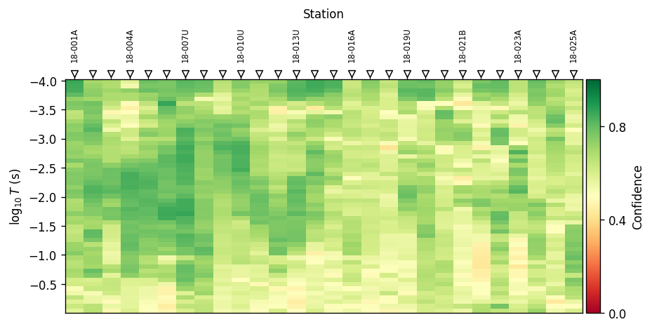

.. _api-section:

Section Plot Layout
===================

:mod:`pycsamt.api.section` is the shared layout system behind every 2-D
station-by-depth or station-by-period plot pyCSAMT draws: :term:`Pseudosection`
QC panels, inversion sections, and compact dashboard tiles alike. It
answers three questions the same way for all of them -- how big should the
figure be, how should the axes behave, and how should the colourbar look
-- through :data:`~pycsamt.api.section.PYCSAMT_SECTION`, one singleton
following the same pattern as :doc:`style` and :doc:`interpretation`.

Every demonstration below uses the same real WILLY AMT line as
:doc:`style`:

.. code-block:: pycon

   >>> from pathlib import Path
   >>> from pycsamt.emtools import ensure_sites
   >>> from pycsamt.emtools.qc import plot_frequency_confidence_psection
   >>> from pycsamt.api.section import PYCSAMT_SECTION

   >>> edi_dir = Path("data/AMT/WILLY_DATA/L18PLT")
   >>> sites = ensure_sites(
   ...     edi_dir,
   ...     recursive=True,
   ...     on_dup="replace",
   ...     strict=False,
   ...     verbose=0,
   ... )
   >>> len(sites)
   28

The full science behind the confidence metric itself --
:func:`~pycsamt.emtools.qc.plot_frequency_confidence_psection`'s
``method``/``metric`` arguments and what "confidence" means -- is covered
in :doc:`../user_guide/emtools/qc`; this page only uses it as a real,
data-driven anchor for the layout system.

Six presets ship with the package -- ``"pseudosection"`` (the default),
``"inversion"``, ``"publication"``, ``"compact"``, ``"dashboard"``, and
``"dynamic"`` -- each bundling three leaf dataclasses:
:class:`~pycsamt.api.section.SectionFigureStyle` (size and margins),
:class:`~pycsamt.api.section.SectionAxisStyle` (labels, y-axis direction,
aspect, and what the y-axis physically represents), and
:class:`~pycsamt.api.section.SectionColorbarStyle` (placement and tick
density). Printing the singleton summarises all six at once:

.. code-block:: pycon

   >>> print(PYCSAMT_SECTION)
   PyCSAMTSection
     compact: figsize=(7.0, 3.1), y='down', stations='pseudosection', cbar_ticks<=4
     dashboard: figsize=(6.0, 3.0), y='down', stations='pseudosection', cbar_ticks<=4
     dynamic: figsize='dynamic', y='down', stations='pseudosection', cbar_ticks<=6
     inversion: figsize=(10.5, 5.2), y='down', stations='inversion', cbar_ticks<=6
     pseudosection: figsize=(9.5, 4.4), y='down', stations='pseudosection', cbar_ticks<=6
     publication: figsize=(8.2, 3.6), y='down', stations='pseudosection', cbar_ticks<=5

Figure Sizing: Static Vs. Dynamic
---------------------------------

Every preset except ``"dynamic"`` uses a fixed ``figsize`` regardless of
how much data is plotted -- appropriate for a consistent grid of
comparison figures, but a 200-station line and a 6-station line get the
same width:

.. code-block:: pycon

   >>> pub = PYCSAMT_SECTION.style_for("publication")
   >>> pub.figure.figsize
   (8.2, 3.6)
   >>> pub.figsize_for(n_stations=6, n_y=20)
   (8.2, 3.6)
   >>> pub.figsize_for(n_stations=120, n_y=20)
   (8.2, 3.6)

``"dynamic"`` instead computes a width and height from the actual station
count, period/depth sample count, and longest station label, then clamps
the result between ``min_width``/``max_width`` and
``min_height``/``max_height``:

.. code-block:: pycon

   >>> dyn = PYCSAMT_SECTION.style_for("dynamic")
   >>> tuple(round(v, 2) for v in dyn.figsize_for(n_stations=6, n_y=20))
   (7.5, 3.4)
   >>> tuple(round(v, 2) for v in dyn.figsize_for(n_stations=28, n_y=40))
   (7.5, 3.48)
   >>> tuple(round(v, 2) for v in dyn.figsize_for(n_stations=200, n_y=40))
   (15.0, 3.48)

The 200-station call hits ``max_width=15.0`` and stops growing -- a
deliberate ceiling so a very long line still produces a figure that fits
on a page or slide rather than growing without bound.
:meth:`~pycsamt.api.section.SectionStyle.figsize_for` is what every
section-plotting function calls internally when ``figsize=None`` (the
default); passing an explicit ``figsize=`` to any of them always wins over
both the fixed and the dynamic calculation.

Named Presets In Practice
-------------------------

.. code-block:: pycon

   >>> for preset in ["dynamic", "publication", "compact"]:
   ...     ax = plot_frequency_confidence_psection(sites, section=preset, verbose=0)

.. grid:: 3
   :gutter: 2

   .. grid-item::

      .. image:: ../images/api_guide/section_presets_dynamic.png
         :width: 100%

   .. grid-item::

      .. image:: ../images/api_guide/section_presets_publication.png
         :width: 100%

   .. grid-item::

      .. image:: ../images/api_guide/section_presets_compact.png
         :width: 100%

``"dynamic"`` widens slightly for 28 real stations and keeps its own
figure title; ``"publication"`` and ``"compact"`` both suppress the title
(``SectionAxisStyle(title=False)``) and shrink progressively, trading
station-label legibility for a smaller footprint -- exactly the tradeoff
to make deliberately rather than by trimming a figure after the fact.

Axis Direction And Topography Awareness
---------------------------------------

:class:`~pycsamt.api.section.SectionAxisStyle` carries a ``y_type`` tag --
``"period"``/``"frequency"`` for pseudosections, ``"depth"``/``"elevation"``
for inversion sections -- that
:meth:`~pycsamt.api.section.SectionStyle.topo_active` checks against the
package-wide :data:`~pycsamt.topo.config.PYCSAMT_TOPO` setting. A period
pseudosection carries no real elevation information, so :term:`Topography`
rendering is silently skipped there even when it is globally enabled --
only depth-like sections pick it up:

.. code-block:: pycon

   >>> from pycsamt.topo.config import PYCSAMT_TOPO

   >>> pseudo = PYCSAMT_SECTION.style_for("pseudosection")
   >>> inv = PYCSAMT_SECTION.style_for("inversion")
   >>> pseudo.axis.y_type, inv.axis.y_type
   ('period', 'depth')
   >>> pseudo.topo_active(), inv.topo_active()
   (False, False)

   >>> _ = PYCSAMT_TOPO.configure(enabled=True)
   >>> pseudo.topo_active(), inv.topo_active()
   (False, True)

   >>> PYCSAMT_TOPO.reset()

``y_direction="down"`` (the default on every preset) inverts the y-axis so
shallow/high-frequency values plot at the top, matching how a geologist
reads a cross-section; set it to ``"up"`` or ``"normal"`` only for
non-depth y-axes where that convention would be misleading.

Colorbar Controls
-----------------

:class:`~pycsamt.api.section.SectionColorbarStyle` controls placement,
width, and -- most often tuned -- tick density via ``max_ticks``. Fewer
ticks read better on a small multi-panel figure than the default:

.. code-block:: pycon

   >>> from pycsamt.api.section import configure_section, reset_section

   >>> pub.colorbar.max_ticks
   5
   >>> configure_section(publication__colorbar__max_ticks=3)
   >>> PYCSAMT_SECTION.publication.colorbar.max_ticks
   3

   >>> ax = plot_frequency_confidence_psection(sites, section="publication", verbose=0)

   Same data and preset as the publication panel above, after lowering
   ``max_ticks`` to ``3`` -- fewer labels, same underlying colour scale.

.. code-block:: pycon

   >>> reset_section()
   >>> PYCSAMT_SECTION.publication.colorbar.max_ticks
   5

Configuring And Sharing Styles
------------------------------

The same dotted-path :func:`~pycsamt.api.section.configure_section` and
:meth:`PYCSAMT_SECTION.context() <pycsamt.api.section.PyCSAMTSection.context>`
entry points used above apply to every field on every preset -- figure,
axis, or colorbar -- and the context manager restores all six presets
exactly as they were, even if the block raises:

.. code-block:: pycon

   >>> PYCSAMT_SECTION.pseudosection.figure.figsize
   (9.5, 4.4)

   >>> with PYCSAMT_SECTION.context("compact", pseudosection__axis__grid=True):
   ...     PYCSAMT_SECTION.pseudosection.figure.figsize, PYCSAMT_SECTION.pseudosection.axis.grid
   ((7.0, 3.1), True)

   >>> PYCSAMT_SECTION.pseudosection.figure.figsize, PYCSAMT_SECTION.pseudosection.axis.grid
   ((9.5, 4.4), False)

``PYCSAMT_SECTION.context(preset, ...)`` copies *preset* into the
``pseudosection`` slot for the duration of the block (mirroring
:meth:`~pycsamt.api.section.PyCSAMTSection.use_preset`), applies any
dotted-path overrides on top, then restores every preset -- not only
``pseudosection`` -- to its prior state on exit.

Each :class:`~pycsamt.api.section.SectionStyle` also carries a
``station_preset`` field (``"pseudosection"`` or ``"inversion"`` by
default) that
:meth:`~pycsamt.api.section.SectionStyle.apply_stations` uses to pull the
matching station-marker style from :mod:`pycsamt.api.station` --
station ticks, markers, and label rotation are configured separately from
everything on this page, but every section preset already points at a
sensible default for its own use case.

Next Steps
----------

* :doc:`overview` for how the section family fits alongside every other
  :mod:`pycsamt.api` configuration family.
* :doc:`../user_guide/emtools/qc` for the frequency-confidence metric used
  as this page's data anchor, and the rest of the QC pseudosection family.
* :doc:`style` and :doc:`interpretation` for the other two
  singleton-preset-context systems that follow this same pattern.
* :doc:`mesh` for the layout system computational and inversion mesh
  figures use instead of station/period pseudosections.
