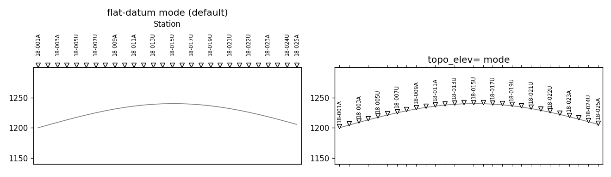

.. _api-station-rendering:

Station Rendering
=================

:mod:`pycsamt.api.station` draws the station axis on every 2-D section
figure: the tick marks, thinned labels, and marker glyphs along the
profile edge. :doc:`section` already introduced how
:meth:`~pycsamt.api.section.SectionStyle.apply_stations` looks up a
station style by name through this module's own singleton,
:data:`~pycsamt.api.station.PYCSAMT_STATION_RENDERING`; this page covers
that singleton directly -- its three presets, the adaptive label-thinning
algorithm, and the terrain-following marker mode.

.. code-block:: pycon

   >>> from pathlib import Path
   >>> import numpy as np
   >>> from pycsamt.emtools import ensure_sites
   >>> from pycsamt.api.station import PYCSAMT_STATION_RENDERING

   >>> edi_dir = Path("data/AMT/WILLY_DATA/L18PLT")
   >>> sites = ensure_sites(
   ...     edi_dir,
   ...     recursive=True,
   ...     on_dup="replace",
   ...     strict=False,
   ...     verbose=0,
   ... )
   >>> names = [s.name for s in sites]
   >>> x = np.arange(len(names)) * 200.0
   >>> len(names)
   28

Three presets ship with the package -- ``"pseudosection"`` (hollow white
triangles, top axis), ``"inversion"`` (filled black triangles, top axis),
and ``"survey"`` (hollow white circles, bottom axis, diagonal labels).
Each pairs a :class:`~pycsamt.api.station.StationAxisStyle` (ticks,
labels, side) with its own :class:`~pycsamt.api.station.StationMarkerStyle`
(glyph, size, colours):

.. code-block:: pycon

   >>> print(PYCSAMT_STATION_RENDERING)
   PyCSAMTStationRendering
     pseudosection: side='top', marker='v', face='white', labels<=14
     inversion: side='top', marker='v', face='black', labels<=14
     survey: side='bottom', marker='o', face='white', labels<=14

:meth:`~pycsamt.api.station.PyCSAMTStationRendering.apply` draws directly
onto any axes given station positions and labels -- no section plot
required:

.. code-block:: pycon

   >>> import matplotlib.pyplot as plt
   >>> for preset in ["pseudosection", "inversion", "survey"]:
   ...     fig, ax = plt.subplots(figsize=(7.5, 1.9))
   ...     _ = ax.set_xlim(x.min() - 100, x.max() + 100)
   ...     _ = ax.set_ylim(0, 1)
   ...     _ = ax.set_yticks([])
   ...     idx = PYCSAMT_STATION_RENDERING.apply(ax, x, names, preset=preset)

.. grid:: 3
   :gutter: 2

   .. grid-item::

      .. image:: ../images/api_guide/station_preset_pseudosection.png
         :width: 100%

   .. grid-item::

      .. image:: ../images/api_guide/station_preset_inversion.png
         :width: 100%

   .. grid-item::

      .. image:: ../images/api_guide/station_preset_survey.png
         :width: 100%

Adaptive Label Thinning
-----------------------

Only 28 stations fit their names comfortably in a 7.5-inch figure -- every
third label above -- but :meth:`~pycsamt.api.station.StationAxisStyle.compute_every`
scales the same decision to any station count and figure width, always
returning a "nice" step (1, 2, 3, 4, 5, 8, 10, 12, 15, 20, 25, 50, 100, ...)
rather than an arbitrary number:

.. code-block:: pycon

   >>> pseudo = PYCSAMT_STATION_RENDERING.style_for("pseudosection")
   >>> pseudo.compute_every(28)
   2
   >>> pseudo.compute_every(100)
   8
   >>> pseudo.compute_every(500)
   50
   >>> pseudo.compute_every(500, figwidth_in=15)
   25

A wider figure earns a smaller step -- 500 stations at the default
10-inch reference width thin to every 50th label, but the same 500
stations on a 15-inch figure fit every 25th. ``every`` defaults to
``"auto"`` (this algorithm); set it to a fixed integer on any preset to
bypass the computation entirely, e.g.
``configure_station_rendering(pseudosection__every=5)``.
:meth:`~pycsamt.api.station.StationAxisStyle.label_indices` runs the same
computation and returns the actual visible indices, always including the
last station regardless of step, which is why the demo above ends on
index ``27`` rather than stopping wherever the step last landed.

Note that ``compute_every`` alone uses whatever ``figwidth_in`` is passed
to it (``10.0`` by default), while :meth:`~pycsamt.api.station.StationAxisStyle.apply`
-- what every real plot call goes through -- reads the actual figure's
width automatically, which is why the three-preset figures above (7.5
inches wide) thinned to every third label rather than every second.

Topography-Aware Marker Placement
---------------------------------

By default, station markers sit at a flat position along the axis edge
regardless of what the section shows underneath -- appropriate for
:term:`Pseudosection` panels, which have no real elevation information
either (see :doc:`section`'s topography-awareness gate). Pass
``topo_elev=`` to :meth:`~pycsamt.api.station.StationAxisStyle.apply` and
markers instead ride the real terrain surface, with labels drawn inline
above each one instead of as axis tick labels:

.. code-block:: pycon

   >>> elev = 1200.0 + 40.0 * np.sin(np.linspace(0, 3.0, len(names)))
   >>> fig, axes = plt.subplots(1, 2, figsize=(11, 3.2))

   >>> ax0 = axes[0]
   >>> _ = ax0.plot(x, elev, color="0.5", lw=1)
   >>> _ = ax0.set_ylim(elev.min() - 60, elev.max() + 60)
   >>> _ = pseudo.apply(ax0, x, names, xlim=(x.min() - 100, x.max() + 100))
   >>> _ = ax0.set_title("flat-datum mode (default)")

   >>> ax1 = axes[1]
   >>> _ = ax1.plot(x, elev, color="0.5", lw=1)
   >>> _ = ax1.set_ylim(elev.min() - 60, elev.max() + 60)
   >>> _ = pseudo.apply(
   ...     ax1, x, names, xlim=(x.min() - 100, x.max() + 100), topo_elev=elev,
   ... )
   >>> _ = ax1.set_title("topo_elev= mode")

   ``elev`` here is an illustrative sine curve, not real WILLY terrain --
   the point is the mechanic, not the geology. In practice ``topo_elev``
   comes from :data:`~pycsamt.topo.config.PYCSAMT_TOPO`'s elevation
   source once :meth:`~pycsamt.api.section.SectionStyle.topo_active`
   is ``True`` for a depth-like section; :doc:`section` covers that gate.

Configuring And Sharing Styles
------------------------------

The same dotted-path :func:`~pycsamt.api.station.configure_station_rendering`
and :meth:`PYCSAMT_STATION_RENDERING.context() <pycsamt.api.station.PyCSAMTStationRendering.context>`
entry points from every other :mod:`pycsamt.api` family apply here too.
The context manager copies a named preset into the ``pseudosection`` slot
for the block (mirroring
:meth:`~pycsamt.api.station.PyCSAMTStationRendering.use_preset`) and
restores all three presets afterward:

.. code-block:: pycon

   >>> from pycsamt.api.station import configure_station_rendering, reset_station_rendering

   >>> PYCSAMT_STATION_RENDERING.pseudosection.side, PYCSAMT_STATION_RENDERING.pseudosection.marker.marker
   ('top', 'v')

   >>> with PYCSAMT_STATION_RENDERING.context("survey", pseudosection__rotation=30.0):
   ...     (
   ...         PYCSAMT_STATION_RENDERING.pseudosection.side,
   ...         PYCSAMT_STATION_RENDERING.pseudosection.marker.marker,
   ...         PYCSAMT_STATION_RENDERING.pseudosection.rotation,
   ...     )
   ('bottom', 'o', 30.0)

   >>> (
   ...     PYCSAMT_STATION_RENDERING.pseudosection.side,
   ...     PYCSAMT_STATION_RENDERING.pseudosection.marker.marker,
   ...     PYCSAMT_STATION_RENDERING.pseudosection.rotation,
   ... )
   ('top', 'v', 90.0)

A dotted path descends into the nested ``marker`` dataclass the same way
it descends into any other family's leaf styles:

.. code-block:: pycon

   >>> configure_station_rendering(
   ...     inversion__marker__facecolor="crimson",
   ...     inversion__max_labels=20,
   ... )
   >>> PYCSAMT_STATION_RENDERING.inversion.marker.facecolor
   'crimson'

   >>> reset_station_rendering()
   >>> PYCSAMT_STATION_RENDERING.inversion.marker.facecolor
   'black'

Next Steps
----------

* :doc:`section` for how ``station_preset`` on a
  :class:`~pycsamt.api.section.SectionStyle` selects one of these three
  presets automatically, and for the topography-awareness gate that
  decides when ``topo_elev`` is actually available.
* :doc:`overview` for how the station-rendering family fits alongside
  every other :mod:`pycsamt.api` configuration family.
* :doc:`style` and :doc:`interpretation` for the other singleton-preset
  systems that follow the same configuration pattern.
