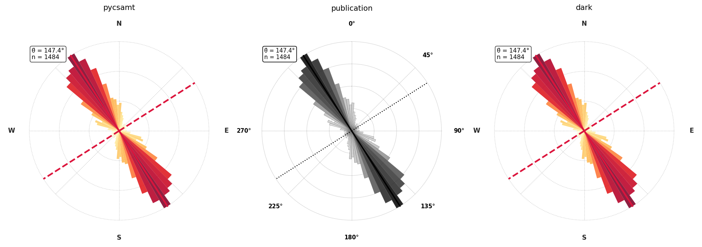
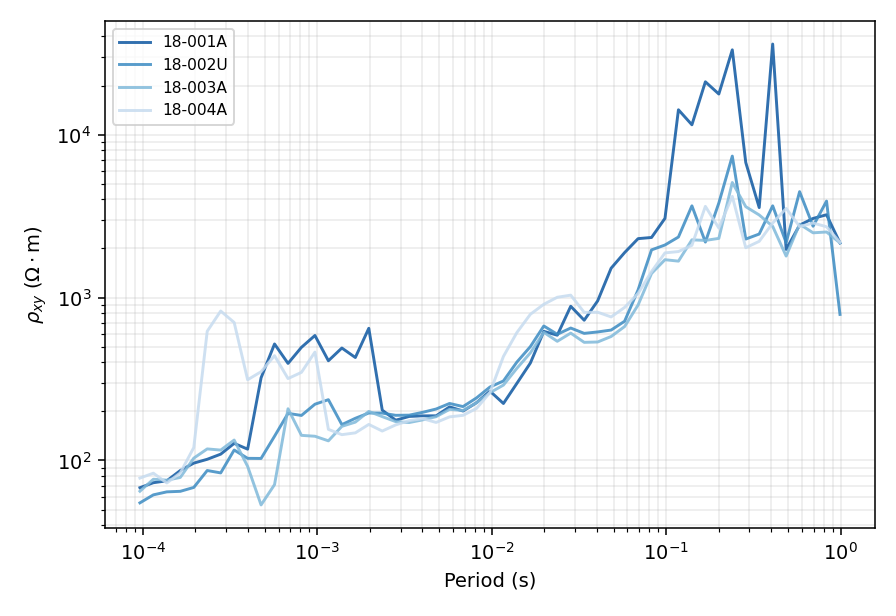
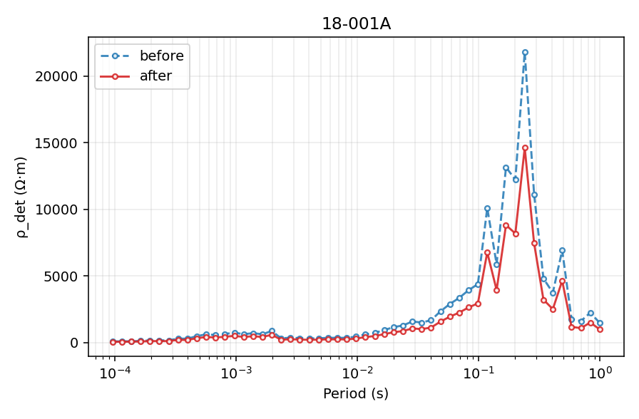
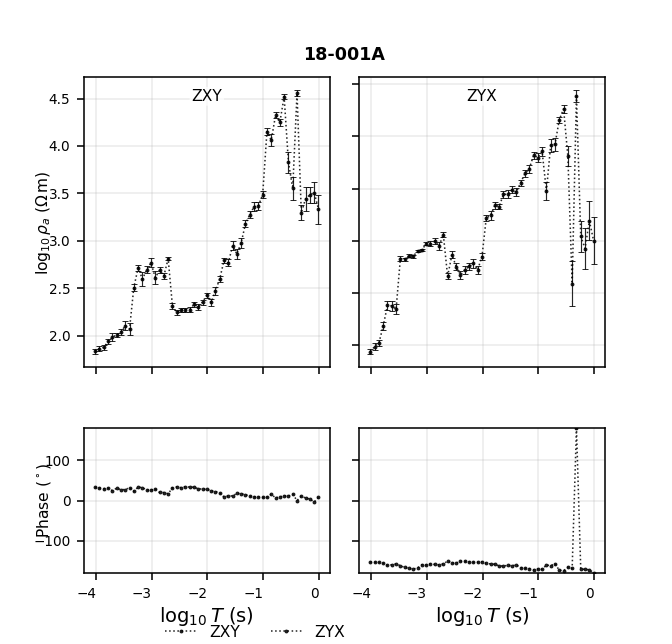
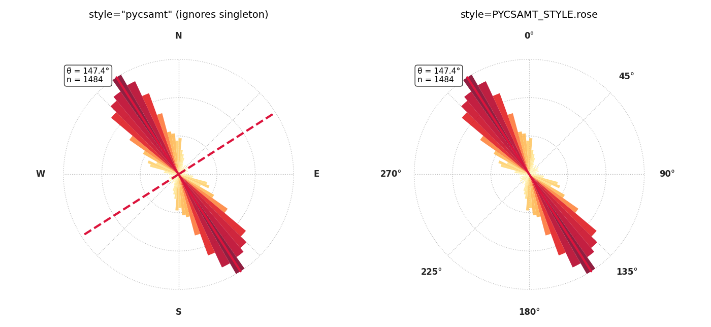

.. _api-style:

Plot Styles
===========

:mod:`pycsamt.api.style` is the single visual-style layer behind every
:mod:`pycsamt.emtools` figure -- impedance response curves, multi-station
overlays, static-shift before/after pairs, raw-data traces, phase-tensor
ellipses, and rose diagrams alike. A plot function never hard-codes a
colour: it reads from the package-level :data:`~pycsamt.api.style.PYCSAMT_STYLE`
singleton unless the caller overrides it, so changing one setting once
changes how every subsequent figure looks.

This page walks through each of the six style families the singleton
holds, the named presets that switch all of them at once, and the
dotted-path convention (shared with every other :mod:`pycsamt.api` family;
see :doc:`overview`) used to tune individual attributes. All figures below
come from the real WILLY AMT line (``data/AMT/WILLY_DATA/L18PLT``):

.. code-block:: pycon

   >>> from pathlib import Path
   >>> from pycsamt.emtools import ensure_sites
   >>> from pycsamt.api.style import PYCSAMT_STYLE

   >>> edi_dir = Path("data/AMT/WILLY_DATA/L18PLT")
   >>> sites = ensure_sites(
   ...     edi_dir,
   ...     recursive=True,
   ...     on_dup="replace",
   ...     strict=False,
   ...     verbose=0,
   ... )
   >>> len(sites)
   28

The singleton prints as a compact, one-attribute-per-line summary --
useful both for a sanity check after configuring it and as a map of what
follows on this page:

.. code-block:: pycon

   >>> print(PYCSAMT_STYLE)
   PyCSAMTStyle
     rose.bar_style          = 'gradient'
     rose.cmap               = 'YlOrRd'
     rose.compass_labels     = 'NESW'
     rose.show_mean          = True
     rose.show_secondary     = True
     multiline.mode          = 'gradient'
     multiline.base_color    = 'blue'
     multiline.dark/light    = 0.85/0.25
     mt.xy  color='#1f77b4'  marker='o'
     mt.yx  color='#d62728'  marker='s'
     mt.te  color='#1f77b4'  ls='-'
     mt.tm  color='#d62728'  ls='-'
     correction.before  color='#1f77b4'  ls='--'  label='before'
     correction.after   color='#d62728'  ls='-'  label='after'
     raw  color='black'  marker='.'  ls=':'  lw=0.8
     pt_ellipse  normalise_by='cell'  scale=0.85  c_by='skew'  cmap='RdBu_r'
     pt_ellipse  edgecolor='k'  lw=0.2  alpha=0.92  mark_3d=True  skew_thresh=3.0

Six sections, one singleton: ``rose`` (:class:`~pycsamt.api._rose_style.RoseStyle`),
``multiline`` (:class:`~pycsamt.api.style.MultilineStyle`), ``mt``
(:class:`~pycsamt.api.style.MTComponentStyle`), ``correction``
(:class:`~pycsamt.api.style.CorrectionStyle`), ``raw``
(:class:`~pycsamt.api.style.RawDataStyle`), and ``pt_ellipse``
(:class:`~pycsamt.api.style.PhaseTensorEllipseStyle`).

Named Presets
-------------

Four presets are registered out of the box: ``"pycsamt"`` (the default --
gradient rose bars, blue/red MT colours), ``"publication"`` (grayscale,
open/filled-marker contrast for print), ``"dark"`` (brighter hues for a
dark-background notebook or slide), and ``"modem"`` (the ModEM colour
convention -- pure blue/red observed, green/magenta dotted predicted).
:meth:`PYCSAMT_STYLE.use() <pycsamt.api.style.PyCSAMTStyle.use>` (or the
module-level :func:`~pycsamt.api.style.use_style` shortcut) swaps every
section that a preset defines in one call:

.. code-block:: pycon

   >>> from pycsamt.api.style import use_style, reset_style
   >>> from pycsamt.emtools.tensor import plot_phase_tensor_rose
   >>> import matplotlib.pyplot as plt

   >>> fig, axes = plt.subplots(
   ...     1, 3, figsize=(13, 4.6), subplot_kw={"projection": "polar"}
   ... )
   >>> for ax, preset in zip(axes, ["pycsamt", "publication", "dark"]):
   ...     use_style(preset)
   ...     _ = plot_phase_tensor_rose(
   ...         sites, style=PYCSAMT_STYLE.rose, ax=ax, title=preset, verbose=0
   ...     )
   >>> reset_style()
   >>> fig.tight_layout()

   One dataset, three presets: ``"pycsamt"`` (gradient red/orange, NESW
   compass), ``"publication"`` (grayscale, degree compass, dotted
   conjugate line), and ``"dark"`` (same rose preset as ``"pycsamt"`` here,
   since ``"dark"`` only overrides MT and multiline colours).

``"modem"`` is deliberately partial: its preset spec only defines an
``"mt"`` section, so calling :func:`~pycsamt.api.style.use_style` with it
leaves whatever rose, multiline, correction, raw, and phase-tensor
settings were already active untouched. Applying presets is therefore
compounding, not a full reset to that preset's own defaults:

.. code-block:: pycon

   >>> reset_style()
   >>> use_style("dark")
   >>> PYCSAMT_STYLE.rose.cmap, PYCSAMT_STYLE.mt.xy.color
   ('YlOrRd', '#74b9ff')

   >>> use_style("modem")
   >>> PYCSAMT_STYLE.rose.cmap, PYCSAMT_STYLE.mt.xy.color
   ('YlOrRd', '#0000FF')

The rose colormap carries over from ``"dark"`` (which reuses the
``"pycsamt"`` rose) because ``"modem"`` never touches it; only ``mt.xy``
changed, to the ModEM blue. Call :meth:`PYCSAMT_STYLE.reset()
<pycsamt.api.style.PyCSAMTStyle.reset>` first if a clean, fully-defined
preset is what's actually wanted:

.. code-block:: pycon

   >>> reset_style()
   >>> PYCSAMT_STYLE.rose.cmap, PYCSAMT_STYLE.mt.xy.color
   ('YlOrRd', '#1f77b4')

MT Component Colours
--------------------

:class:`~pycsamt.api.style.MTComponentStyle` gives every impedance
component or mode (``xy``, ``yx``, ``xx``, ``yy``, ``te``, ``tm``, ``det``)
a consistent colour, marker, and line style, exposed through
:meth:`plot_kwargs() <pycsamt.api.style._MTComp.plot_kwargs>` and
:meth:`errorbar_kwargs() <pycsamt.api.style._MTComp.errorbar_kwargs>`.
:func:`~pycsamt.emtools.plot.plot_response_tipper` uses it automatically
for every component it draws:

.. code-block:: pycon

   >>> from pycsamt.emtools.plot import plot_response_tipper

   >>> use_style("pycsamt")
   >>> fig_a = plot_response_tipper(
   ...     sites,
   ...     stations=["18-001A"],
   ...     components=("xy", "yx"),
   ...     tipper_components=(),
   ...     ncols_groups=1,
   ...     verbose=0,
   ... )

   >>> use_style("publication")
   >>> fig_b = plot_response_tipper(
   ...     sites,
   ...     stations=["18-001A"],
   ...     components=("xy", "yx"),
   ...     tipper_components=(),
   ...     ncols_groups=1,
   ...     verbose=0,
   ... )
   >>> reset_style()

``tipper_components=()`` is passed because L18PLT is an AMT line with no
vertical-field channel; ``ncols_groups=1`` keeps the figure sized for a
single station instead of the function's default three-wide grouping.

.. grid:: 1 1 2 2

   .. grid-item::

      .. image:: ../images/api_guide/style_mt_component_colours_pycsamt.png
         :width: 100%

   .. grid-item::

      .. image:: ../images/api_guide/style_mt_component_colours_publication.png
         :width: 100%

The two panels are the same station and the same data; only
``PYCSAMT_STYLE.mt`` changed between the calls. ``"pycsamt"`` keeps the
package's blue-XY/red-YX convention with hollow markers on both; the
grayscale ``"publication"`` preset instead distinguishes XY from YX by
marker fill (hollow circles vs. solid squares) so the two components
still read apart once colour is unavailable.

Reach for a single component's kwargs directly when writing a custom
plot function rather than calling a package one:

.. code-block:: pycon

   >>> PYCSAMT_STYLE.mt.xy.plot_kwargs()
   {'color': '#1f77b4', 'ls': '-', 'lw': 1.5, 'marker': 'o', 'ms': 4.0, 'mfc': 'white', 'mew': 1.2, 'alpha': 0.9, 'label': 'XY'}

Multiline Gradient Colours
--------------------------

:class:`~pycsamt.api.style.MultilineStyle` colours a group of related
lines -- typically one per station along a profile -- as shades of one
hue running from dark (line 0) to light (the last line), so the group
reads as one coherent family without needing a categorical colour cycle.
:meth:`colors(n) <pycsamt.api.style.MultilineStyle.colors>` returns the
*n* RGBA shades directly; :meth:`line_kwargs(idx, n)
<pycsamt.api.style.MultilineStyle.line_kwargs>` is the convenience form
for a loop, combining colour with the style's default line width and
alpha:

.. code-block:: pycon

   >>> ms = PYCSAMT_STYLE.multiline
   >>> [round(float(c), 3) for c in ms.colors(4)[0]]
   [0.05, 0.342, 0.631, 1.0]
   >>> ms.line_kwargs(0, 4)["lw"], ms.line_kwargs(0, 4)["alpha"]
   (1.5, 0.85)

Overlaying four real WILLY stations' XY apparent resistivity shows the
gradient in practice -- darkest line first, lightest last, regardless of
plotting order:

.. code-block:: pycon

   >>> import numpy as np

   >>> stations = ["18-001A", "18-002U", "18-003A", "18-004A"]
   >>> n = len(stations)
   >>> fig, ax = plt.subplots(figsize=(6.4, 4.4))
   >>> for idx, name in enumerate(stations):
   ...     st = sites[name]
   ...     period = 1.0 / st.freq
   ...     rho_xy = st.rho[:, 0, 1]
   ...     order = np.argsort(period)
   ...     _ = ax.plot(
   ...         period[order], rho_xy[order], **ms.line_kwargs(idx, n, label=name)
   ...     )
   >>> _ = ax.set_xscale("log")
   >>> _ = ax.set_yscale("log")
   >>> _ = ax.legend(fontsize=8)

   Station ``18-001A`` (plotted first, darkest) through ``18-004A``
   (plotted last, lightest). The gradient is keyed to *plotting* order,
   not to any property of the data -- reorder the ``stations`` list to
   change which curve is darkest.

Switch the base hue, or select an explicit colormap, with
:meth:`~pycsamt.api.style.PyCSAMTStyle.configure`:

.. code-block:: pycon

   >>> from pycsamt.api.style import configure_style
   >>> configure_style(multiline__base_color="red")
   >>> PYCSAMT_STYLE.multiline.cmap is None
   True
   >>> reset_style()

Leaving ``cmap`` unset lets *base_color* drive an automatic colormap
lookup (``"red"`` -> a red sequential colormap); setting ``cmap``
explicitly takes precedence over that lookup.

Before/After Correction Pairs
-----------------------------

Every 1-D correction workflow in pyCSAMT -- :term:`static shift`, near-field,
noise removal -- draws its uncorrected and corrected curves with the same
:class:`~pycsamt.api.style.CorrectionStyle` pair: blue dashed for
``before``, red solid for ``after``, deliberately reusing the ``mt.xy``
and ``mt.yx`` colours so the whole package stays visually coherent.
:func:`~pycsamt.emtools.ss.plot_ss_station_curves` reads it directly:

.. code-block:: pycon

   >>> from pycsamt.emtools.ss import correct_ss_ama, plot_ss_station_curves

   >>> corrected = correct_ss_ama(sites, verbose=0)
   >>> fig, ax = plt.subplots(figsize=(6.4, 4.2))
   >>> _ = plot_ss_station_curves(sites, corrected, station="18-001A", ax=ax)

   :func:`~pycsamt.emtools.ss.correct_ss_ama`'s real spatial-trend
   correction applied to ``18-001A`` -- the AMA method estimated this
   station's determinant resistivity as offset high relative to its
   neighbours and scaled it down accordingly. See :doc:`../user_guide/emtools/ss`
   for the correction method itself; this page is only about the pairing
   convention.

Change both curves' colours together, or just one, with the same dotted
paths used everywhere else:

.. code-block:: pycon

   >>> configure_style(
   ...     correction__before__color="#444444",
   ...     correction__after__color="#000000",
   ... )
   >>> PYCSAMT_STYLE.correction.before.color, PYCSAMT_STYLE.correction.after.color
   ('#444444', '#000000')
   >>> reset_style()

Raw Data Style
--------------

:class:`~pycsamt.api.style.RawDataStyle` is the package's convention for
unprocessed observations: a restrained black, thin, dotted trace with
small markers, visually distinct from any processed-data colour so a raw
curve can never be mistaken for a modelled or QC-passed one.
:func:`~pycsamt.emtools.plot.plot_response_tipper` switches to it
automatically whenever it is called with ``raw=True`` (unless
``force_style=True`` asks it to keep the component colours instead):

.. code-block:: pycon

   >>> use_style("pycsamt")
   >>> fig_raw = plot_response_tipper(
   ...     sites,
   ...     stations=["18-001A"],
   ...     components=("xy", "yx"),
   ...     tipper_components=(),
   ...     raw=True,
   ...     ncols_groups=1,
   ...     verbose=0,
   ... )
   >>> reset_style()

   The same station and components as the MT-colours figure above,
   drawn with ``raw=True``. Colour alone now tells a reader whether a
   given panel is showing raw or component-styled data, without reading
   any title or legend text.

Phase-Tensor Ellipse Style
--------------------------

:class:`~pycsamt.api.style.PhaseTensorEllipseStyle` controls how
:func:`~pycsamt.emtools.tensor.plot_phase_tensor_psection` and its
sibling phase-tensor figures encode five quantities at once per ellipse
-- size, aspect ratio, rotation, fill colour, and a 3-D border flag. The
parameter-by-parameter tour of that encoding, including real WILLY
pseudo-sections, lives in :doc:`../user_guide/emtools/tensor`; this page
only covers the persistent-configuration angle.

``c_by`` selects which scalar drives the fill colour, and
:meth:`resolve_cmap() <pycsamt.api.style.PhaseTensorEllipseStyle.resolve_cmap>`
looks up a sensible default colormap for it when ``cmap`` itself is left
unset -- a diverging map for signed quantities like :term:`skew`, a
sequential one for magnitudes like ellipticity:

.. code-block:: pycon

   >>> es = PYCSAMT_STYLE.pt_ellipse
   >>> es.normalise_by, es.scale, es.c_by, es.resolve_cmap()
   ('cell', 0.85, 'skew', 'RdBu_r')

   >>> configure_style(pt_ellipse__c_by="ellipt", pt_ellipse__cmap=None)
   >>> PYCSAMT_STYLE.pt_ellipse.resolve_cmap()
   'viridis'

   >>> reset_style()

Any plot call can still override ``cmap`` explicitly, in which case the
``c_by``-based lookup above never runs -- the explicit value always wins.

Rose Diagrams
-------------

:func:`~pycsamt.emtools.tensor.plot_phase_tensor_rose` and
:func:`~pycsamt.emtools.strike.plot_strike_rose` share
:class:`~pycsamt.api._rose_style.RoseStyle` through their own ``style``
keyword, which is resolved by
:func:`~pycsamt.api._rose_style.resolve_rose_style`. That keyword
defaults to the literal string ``"pycsamt"`` rather than to
``None``/the package singleton, which matters as soon as
:data:`PYCSAMT_STYLE.rose <pycsamt.api.style.PYCSAMT_STYLE>` has been
configured: a bare call still resolves the *named* ``"pycsamt"`` preset
from ``resolve_rose_style``'s own table, ignoring whatever the singleton
currently holds. Passing ``style=PYCSAMT_STYLE.rose`` explicitly is what
makes a rose figure track global configuration:

.. code-block:: pycon

   >>> configure_style(rose__compass_labels="degrees", rose__show_secondary=False)
   >>> fig, axes = plt.subplots(
   ...     1, 2, figsize=(10, 4.6), subplot_kw={"projection": "polar"}
   ... )
   >>> _ = plot_phase_tensor_rose(
   ...     sites,
   ...     style="pycsamt",
   ...     ax=axes[0],
   ...     title='style="pycsamt" (ignores singleton)',
   ...     verbose=0,
   ... )
   >>> _ = plot_phase_tensor_rose(
   ...     sites,
   ...     style=PYCSAMT_STYLE.rose,
   ...     ax=axes[1],
   ...     title="style=PYCSAMT_STYLE.rose",
   ...     verbose=0,
   ... )
   >>> reset_style()

   Both panels come from calls made *after* ``configure_style(rose__compass_labels="degrees",
   rose__show_secondary=False)``. The left panel still shows a NESW
   compass and the dashed conjugate line because ``style="pycsamt"``
   re-resolves the named preset from scratch; the right panel shows the
   degree compass and no conjugate line, because it was handed the
   singleton itself.

The three named-preset strings (``"pycsamt"``/``"pycsamt-rose"``,
``"minimal"``, ``"publication"``) documented on
:class:`~pycsamt.api._rose_style.RoseStyle` remain available as ``style=``
values regardless of what ``PYCSAMT_STYLE.rose`` currently holds, since
they are resolved independently of the singleton in the same way.

Contour And Station-Guide Overlays
----------------------------------

Raster and pseudosection overlays use a separate configuration family because
they describe spatial structure rather than data-series identity. The live
:data:`pycsamt.api.PYCSAMT_CONTOUR` configuration supplies contour levels,
colour, width, line style, opacity, and optional labels to compatible plots.
For example, :func:`pycsamt.emtools.plot_survey_fingerprint` uses the visible
``"review"`` contour preset by default:

.. code-block:: pycon

   >>> from pycsamt.api import configure_contour
   >>> configure_contour(linewidths=0.9, colors="#202020", alpha=0.85)
   >>> fig = plot_survey_fingerprint(
   ...     sites,
   ...     render="imshow",
   ...     station_grid=True,
   ...     station_grid_kws={
   ...         "color": "white",
   ...         "linewidth": 0.65,
   ...         "linestyle": ":",
   ...         "alpha": 0.75,
   ...     },
   ... )

The contour configuration is persistent; ``station_grid_kws`` is deliberately
local to the plot call. This keeps survey-dependent station density from
silently changing unrelated figures. See :doc:`contour` for presets, temporary
contexts, labels, override precedence, and interpretation guidance.

Configuring And Sharing Styles
------------------------------

Every section above is reachable through the same three entry points as
every other :mod:`pycsamt.api` family (see :doc:`overview` for the
general pattern): :meth:`PYCSAMT_STYLE.configure()
<pycsamt.api.style.PyCSAMTStyle.configure>` (or the module-level
:func:`~pycsamt.api.style.configure_style`) for dotted-path edits,
direct attribute assignment for a single value, and
:meth:`PYCSAMT_STYLE.context() <pycsamt.api.style.PyCSAMTStyle.context>`
for a temporary change scoped to one block:

.. code-block:: pycon

   >>> PYCSAMT_STYLE.mt.xy.color
   '#1f77b4'

   >>> with PYCSAMT_STYLE.context("publication", mt__xy__lw=2.5):
   ...     PYCSAMT_STYLE.mt.xy.color, PYCSAMT_STYLE.mt.xy.lw
   ('black', 2.5)

   >>> PYCSAMT_STYLE.mt.xy.color, PYCSAMT_STYLE.mt.xy.lw
   ('#1f77b4', 1.5)

The context manager restores every section (not just the ones the
``preset``/``kw`` arguments touched) to exactly what it held before the
``with`` block, even if the block raises -- the same restore-on-exit
contract as :meth:`PYCSAMT_MESH.context() <pycsamt.api.mesh.PyCSAMTMesh.context>`
on :doc:`mesh`. It is the right tool for a single figure that needs a
different look without disturbing the rest of a script or notebook
session. For a change meant to last the whole process -- a batch run
producing only publication figures, for instance -- call
:func:`~pycsamt.api.style.use_style` or
:func:`~pycsamt.api.style.configure_style` once near the top of the
script instead, and reset with :func:`~pycsamt.api.style.reset_style`
only if a later cell or step needs package defaults back.

Next Steps
----------

* :doc:`overview` for how the style family fits alongside every other
  :mod:`pycsamt.api` configuration family.
* :doc:`contour` for persistent contour presets, per-call overrides, and
  station-aligned vertical guides. Contours describe equal-value structure;
  station guides identify the shared sampling column across stacked panels.
* :doc:`../user_guide/emtools/tensor` for the phase-tensor ellipse
  encoding itself, independent of styling.
* :doc:`../user_guide/emtools/ss` for the static-shift correction methods
  behind the before/after figure on this page.
* :doc:`mesh` for the equivalent preset system used by computational and
  inversion mesh figures.
