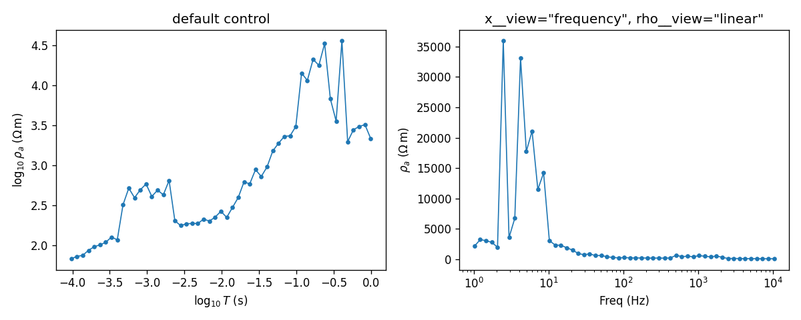

.. _api-view-controls:

View Controls
=============

:mod:`pycsamt.api.control` is the smallest of the display-configuration
families, and the only one with no named presets: it holds three leaf
controls -- phase wrapping, :term:`apparent resistivity` scale, and the
frequency/period axis convention -- that most :mod:`pycsamt.emtools`
plotting functions read by default through
:data:`~pycsamt.api.control.PYCSAMT_CONTROL`. :doc:`../user_guide/emtools/plot`
already shows it wired into a real function call end to end; this page
covers what each control actually computes.

.. code-block:: pycon

   >>> from pathlib import Path
   >>> from pycsamt.emtools import ensure_sites
   >>> from pycsamt.api.control import PYCSAMT_CONTROL

   >>> edi_dir = Path("data/AMT/WILLY_DATA/L18PLT")
   >>> sites = ensure_sites(
   ...     edi_dir,
   ...     recursive=True,
   ...     on_dup="replace",
   ...     strict=False,
   ...     verbose=0,
   ... )
   >>> st = sites["18-001A"]
   >>> freq = st.freq
   >>> rho_xy = st.rho[:, 0, 1]

   >>> print(PYCSAMT_CONTROL)
   PyCSAMTControl
     phase.range = (-180.0, 180.0)
     phase.unit  = 'degree'
     phase.wrap  = True
     rho.view    = 'log10'
     x.view      = 'log10_period'

Phase View Control
------------------

:class:`~pycsamt.api.control.PhaseViewControl` wraps phase values into a
configurable interval -- ``(-180, 180)`` by default -- using
:func:`~pycsamt.api.control.wrap_phase`, a plain modulo:

.. math::
   :label: eq-wrap-phase

   \phi_{\text{wrapped}} = \bigl(\phi - \phi_{\min}\bigr) \bmod
   \bigl(\phi_{\max} - \phi_{\min}\bigr) + \phi_{\min}

Values already inside the interval pass through unchanged; values outside
it fold back in, which is what makes it useful for XY/YX components whose
raw phase can sit anywhere depending on sign convention:

.. code-block:: pycon

   >>> import numpy as np
   >>> from pycsamt.api.control import wrap_phase

   >>> phase_xy = st.phase[:, 0, 1]
   >>> pushed_out = phase_xy[:5] + 300.0
   >>> wrap_phase(pushed_out)
   array([-27.30686798, -28.55123941, -30.19796304, -29.03020381,
          -34.79770965])
   >>> wrap_phase(pushed_out, (0.0, 360.0))
   array([332.69313202, 331.44876059, 329.80203696, 330.96979619,
          325.20229035])

``PYCSAMT_CONTROL.phase.transform()`` applies the currently configured
range (and unit) automatically -- values already inside ``(-180, 180)``
here pass through untouched:

.. code-block:: pycon

   >>> PYCSAMT_CONTROL.phase.transform(phase_xy[:3])
   array([32.69313202, 31.44876059, 29.80203696])

``unit="radian"`` converts to degrees internally for the wrap, then back
to radians on the way out, so the same ``range`` always means degrees
regardless of the configured unit -- set ``range`` in degrees even when
plotting in radians.

Resistivity View Control
------------------------

:class:`~pycsamt.api.control.RhoViewControl` switches every apparent
resistivity axis between ``"log10"`` (the default) and ``"linear"``, and
propagates errors correctly for either:

.. code-block:: pycon

   >>> PYCSAMT_CONTROL.rho.transform(rho_xy[:3])
   array([1.83277228, 1.86341277, 1.87527882])

   >>> from pycsamt.api.control import configure_control, reset_control
   >>> configure_control(rho__view="linear")
   >>> PYCSAMT_CONTROL.rho.transform(rho_xy[:3])
   array([68.04125   , 73.01511519, 75.03758019])
   >>> reset_control()

A log10 error is not the same number as a linear error scaled down --
:meth:`~pycsamt.api.control.RhoViewControl.error` applies the correct
propagation, :math:`\sigma_{\log_{10}\rho} = \sigma_\rho /
(|\rho|\ln 10)`, automatically whenever ``view="log10"``:

.. code-block:: pycon

   >>> rho_err = np.array([5.0, 8.0, 12.0])
   >>> PYCSAMT_CONTROL.rho.error(rho_xy[:3], rho_err)
   array([0.03191406, 0.04758406, 0.06945232])

Switching to ``"linear"`` is not purely cosmetic: apparent resistivity
routinely spans several orders of magnitude across a sounding, and a
linear axis compresses everything except the largest peaks into the
bottom few pixels. The same station, same data, plotted both ways:

.. code-block:: pycon

   >>> import matplotlib.pyplot as plt
   >>> from pycsamt.api.control import PYCSAMT_CONTROL as ctl

   >>> def panel(ax, title):
   ...     x = ctl.x.transform(freq)
   ...     y = ctl.rho.transform(rho_xy)
   ...     _ = ax.plot(x, y, marker="o", ms=3, lw=1)
   ...     if ctl.x.use_log_scale():
   ...         _ = ax.set_xscale("log")
   ...     _ = ax.set_xlabel(ctl.x.label())
   ...     _ = ax.set_ylabel(ctl.rho.label())
   ...     _ = ax.set_title(title)

   >>> fig, axes = plt.subplots(1, 2, figsize=(10, 4))
   >>> panel(axes[0], "default control")

   >>> configure_control(x__view="frequency", rho__view="linear")
   >>> panel(axes[1], 'x__view="frequency", rho__view="linear"')
   >>> reset_control()

   Same station, same 40-odd points either way. The left panel's log-log
   view makes the whole sounding's frequency dependence legible; the
   right panel's linear resistivity axis makes only the two highest
   peaks visible and flattens everything below about 5000 Ω·m into a
   thin band along the bottom. Use ``"linear"`` deliberately -- when a
   collaborator specifically expects it -- not as a default.

Frequency Axis Control
----------------------

:class:`~pycsamt.api.control.FrequencyAxisControl` picks what the x-axis
of a 1-D sounding plot actually shows -- period or frequency, log10 or
raw -- and separately reports whether the *axis itself* should use log
scaling:

.. code-block:: pycon

   >>> PYCSAMT_CONTROL.x.transform(freq[:3])
   array([-4.01703334, -3.93986854, -3.86266795])
   >>> PYCSAMT_CONTROL.x.label()
   '$\\log_{10}T$ (s)'
   >>> PYCSAMT_CONTROL.x.use_log_scale()
   False

   >>> configure_control(x__view="frequency")
   >>> PYCSAMT_CONTROL.x.transform(freq[:3])
   array([10400.,  8707.,  7289.])
   >>> PYCSAMT_CONTROL.x.label()
   'Freq (Hz)'
   >>> PYCSAMT_CONTROL.x.use_log_scale()
   True
   >>> reset_control()

That last pair is the detail easy to get wrong writing a custom plot
function: ``"log10_period"`` and ``"log10_frequency"`` already return
log10-transformed values, so
:meth:`~pycsamt.api.control.FrequencyAxisControl.use_log_scale` reports
``False`` for them -- calling ``ax.set_xscale("log")`` on top of
already-logged data would log it twice. ``"period"`` and ``"frequency"``
return raw values instead, so ``use_log_scale()`` reports ``True`` for
those -- the axis needs the log scale because the data itself is not
pre-transformed. Always call ``use_log_scale()`` rather than assuming an
axis needs (or doesn't need) log scaling from the view name alone.

Configuring And Sharing Styles
------------------------------

:func:`~pycsamt.api.control.configure_control` and
:meth:`PYCSAMT_CONTROL.context() <pycsamt.api.control.PyCSAMTControl.context>`
follow the same dotted-path pattern as every other family on this page --
``phase__range``, ``rho__view``, ``x__view`` -- and the context manager
restores all three controls together on exit, even if the block raises:

.. code-block:: pycon

   >>> PYCSAMT_CONTROL.rho.view, PYCSAMT_CONTROL.x.view
   ('log10', 'log10_period')

   >>> with PYCSAMT_CONTROL.context(rho__view="linear", x__view="frequency"):
   ...     PYCSAMT_CONTROL.rho.view, PYCSAMT_CONTROL.x.view
   ('linear', 'frequency')

   >>> PYCSAMT_CONTROL.rho.view, PYCSAMT_CONTROL.x.view
   ('log10', 'log10_period')

:doc:`../user_guide/emtools/plot`'s "Use Display Control" section shows
this same context manager wrapped around a real
:func:`~pycsamt.emtools.plot.plot_raw_sites_1d` call, reading back the
resulting axis labels and limits -- the version of this pattern to reach
for when the control should apply to an existing plotting function rather
than a hand-written one like the panel above.

Next Steps
----------

* :doc:`../user_guide/emtools/plot` for ``PYCSAMT_CONTROL`` wired into a
  real, complete plotting function call.
* :doc:`overview` for how the view-controls family fits alongside every
  other :mod:`pycsamt.api` configuration family.
* :doc:`style` for the colour and marker side of the same figures --
  view controls decide what values are shown, :doc:`style` decides how
  they look.
