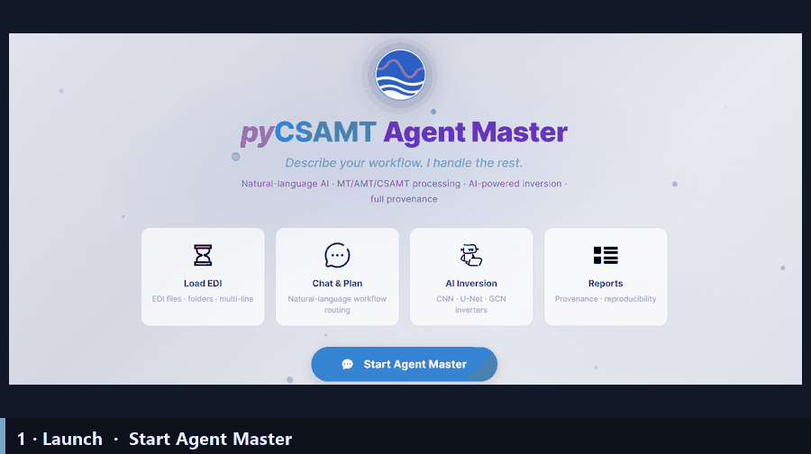

.. _applications-agent-master:

Agent Master
============

Agent Master is the **conversational** application of pyCSAMT.  You describe a
CSAMT / AMT / MT task in plain language and it plans the workflow, asks for any
parameters it needs, runs the right pyCSAMT agents, and returns figures,
reports, reproducible code, and a full provenance trace.  Its tagline says it
plainly: *describe your workflow — I handle the rest.*

It complements the other surfaces rather than replacing them.  The
:doc:`desktop GUI <../desktop/index>`, :doc:`web app <../web/index>`, and
:doc:`MapView <../mapview/index>` are point-and-click; Agent Master is the
chat-driven front end over the same agents and the same scientific core, for
when it is faster to *say* what you want than to click through to it.

A Two-Minute Walkthrough
------------------------

   A full Agent Master session at a glance: launch, configure the LLM, load
   EDI data, ask *what can you do?*, run a workflow (with line selection and
   generated figures), generate a validated script, and get a report with a
   sensitivity analysis.  Each step below is documented in detail on the
   following pages.

Explore the Guide
-----------------

Pick a page to dive in.  A good first pass, in order, is **Installation →
LLM Configuration → Welcome & Chat → Workflows & Agents → Tools, Memory &
Outputs → Agent Master & Other Apps → Troubleshooting**.

.. grid:: 1 1 2 3
   :gutter: 3
   :class-container: cta-tiles

   .. grid-item-card:: Installation
      :link: installation
      :link-type: doc
      :img-top: ../../_static/icons/launch.svg
      :class-card: pycsamt-card sd-text-center

      Install the ``app`` extra and launch ``pycsamt-agent``.

   .. grid-item-card:: Welcome & Chat
      :link: welcome_and_chat
      :link-type: doc
      :img-top: ../../_static/icons/welcome.svg
      :class-card: pycsamt-card sd-text-center

      The welcome screen, the main window, loading EDI data, and how the chat
      works.

   .. grid-item-card:: Workflows & Agents
      :link: workflows_and_agents
      :link-type: doc
      :img-top: ../../_static/icons/workflow.svg
      :class-card: pycsamt-card sd-text-center

      The workflows it runs, orchestrator routing, line selection, and
      parameter forms.

   .. grid-item-card:: LLM Configuration
      :link: llm_configuration
      :link-type: doc
      :img-top: ../../_static/icons/ai.svg
      :class-card: pycsamt-card sd-text-center

      Choose Claude, OpenAI, Gemini, or DeepSeek, add an API key, and pick a
      model.

   .. grid-item-card:: Tools, Memory & Outputs
      :link: tools_memory_outputs
      :link-type: doc
      :img-top: ../../_static/icons/model.svg
      :class-card: pycsamt-card sd-text-center

      Step traces, the Figures panel, validated generated code, sessions, and
      cost.

   .. grid-item-card:: Agent Master & Other Apps
      :link: handoff_from_apps
      :link-type: doc
      :img-top: ../../_static/icons/chat.svg
      :class-card: pycsamt-card sd-text-center

      How it relates to the web app's AI Agents page and the desktop GUI.

   .. grid-item-card:: Troubleshooting
      :link: troubleshooting
      :link-type: doc
      :img-top: ../../_static/icons/troubleshoot.svg
      :class-card: pycsamt-card sd-text-center

      Launch, model provider, data/workflow, and session problems.

What Agent Master Does
----------------------

* **Understands plain-language requests** and routes them to the correct
  workflow — QC, static-shift, denoising, phase/strike analysis, tipper,
  rotation, frequency decimation, sensitivity, inversion prep, full pipelines,
  reports, and code generation.
* **Asks for parameters** when a workflow needs them, through small in-chat
  forms, and **asks which lines** to process when several are loaded.
* **Runs the real pyCSAMT agents** — the same code as the GUI and web app — and
  streams progress step by step.
* **Returns products**: figures (collected in a Figures panel), reports,
  validated standalone Python scripts, and a step-by-step trace with timing and
  cost for provenance.
* **Uses your choice of LLM** — Claude, OpenAI, Gemini, or DeepSeek — with the
  API key kept on your machine.

When To Use It
--------------

Reach for Agent Master when:

* you want to run a multi-step workflow by describing the goal, not by
  operating each page;
* you want a **reproducible script** for a workflow you just ran;
* you want a quick **report** or a guided **inversion preparation**;
* you are learning what pyCSAMT can do and want to ask it directly.

For dense manual review — station-by-station QC, correction previews, map and
3-D inspection — the :doc:`desktop <../desktop/index>`, :doc:`web
<../web/index>`, and :doc:`MapView <../mapview/index>` surfaces are still the
right tools.  Results are interchangeable across all of them.

Run Agent Master
----------------

.. code-block:: bash

   pycsamt-agent

The launcher starts a local server on ``http://127.0.0.1:8765`` and opens the
app in your browser.  The module form works everywhere the package is
importable:

.. code-block:: bash

   python -m pycsamt.app.agent_master

See :doc:`installation` for host, port, and browser options, and
:doc:`llm_configuration` for connecting a model.

The Interface At A Glance
-------------------------

.. figure:: ../../_static/applications/agent_master/agent-master-interface.png
   :alt: The Agent Master interface: top bar, history sidebar, chat area, input
   :class: pycsamt-screenshot

   The main window: the command bar (**Load EDI**, **Save**, theme, help,
   **Settings**), the **History** sidebar (Chat / Session tabs, pinned prompts,
   and a Figures panel), the chat area with suggestion chips, and the
   natural-language input at the bottom.

.. seealso::

   :doc:`/user_guide/agents/orchestrator`
       How the orchestrating agent behind this app plans and runs
       multi-step workflows — the guide to the brain, while this section
       documents the app surface.

.. toctree::
   :maxdepth: 1
   :hidden:

   installation
   welcome_and_chat
   workflows_and_agents
   llm_configuration
   tools_memory_outputs
   handoff_from_apps
   troubleshooting
