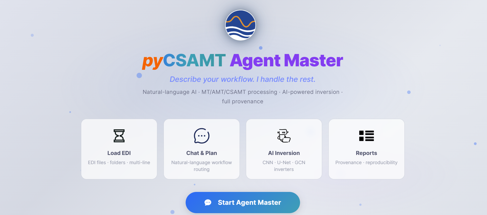

.. _applications-agent-master-installation:

Installation And Launch
=======================

Agent Master is installed from the same pyCSAMT package as the command-line
tools and the scientific library. What changes is the dependency layer: the
application needs the optional :term:`app extra`, which adds the :term:`Dash`
and :term:`Plotly` components used to render the browser interface. Installing
that extra once is enough for Agent Master, the desktop GUI, the web app, and
MapView.

The launch model is deliberately simple. Agent Master starts a
:term:`local server`, your browser connects to that server, and all survey
files continue to be read from the machine where the command is running.
Workflows run immediately in the deterministic Offline mode with no
:term:`LLM provider` or :term:`API key` required; configuring a provider only
adds fluent, LLM-assisted understanding and prose on top of the same
workflows (see :doc:`llm_configuration`).

.. tip::

   Want to try Agent Master without installing anything? A hosted
   instance is linked from :ref:`applications-hosted`.

Install The App Extra
---------------------

For a normal user installation, ask ``pip`` for the application dependencies:

.. code-block:: console

   $ pip install "pycsamt[app]"

That command installs the base pyCSAMT package together with the extra packages
needed by the graphical applications. It is the right choice when you want to
use Agent Master rather than edit its source code.

From a source checkout, install in editable mode so Python imports the working
tree directly:

.. code-block:: console

   $ pip install -e ".[app,dev]"

Editable installation keeps the package linked to the checkout while adding
the ``app`` dependencies and the ``dev`` tools used by tests and documentation
builds. In either case, install inside the Python environment you intend to use
for pyCSAMT. If two Python installations are present, verify with
``python -m pip`` so the package and launcher land in the same environment.

Once the package is available, the :term:`console script` can be inspected
without starting the server:

.. code-block:: console

   $ python -m pycsamt.app.agent_master --help
   usage: pycsamt-agent-master [-h] [--host HOST] [--port PORT] [--debug]
                               [--no-browser]

   Launch the pyCSAMT Agent Master GUI.

   optional arguments:
     -h, --help    show this help message and exit
     --host HOST   Bind address (default 127.0.0.1)
     --port PORT   HTTP port (default 8765)
     --debug       Enable Dash debug / hot-reload
     --no-browser  Do not open browser automatically

Seeing those options confirms that Python can import Agent Master and reach its
entry point. The console command installed by the package is shorter
(``pycsamt-agent``), but the module form above is useful because it always runs
through the selected ``python`` executable.

Launch
------

Start Agent Master with the installed launcher:

.. code-block:: console

   $ pycsamt-agent

By default the launcher binds to ``127.0.0.1`` on port ``8765`` and opens
``http://127.0.0.1:8765`` in your default browser after a short delay. The
address ``127.0.0.1`` means local-only: other machines on the network cannot
reach the app unless you explicitly choose a different host. This default is
the safest setting for ordinary interpretation work because the browser UI,
loaded EDI paths, generated scripts, exported figures, and model-provider
settings remain attached to the local workstation.

The module form starts the same application and is often clearer in notebooks,
temporary environments, or source checkouts:

.. code-block:: console

   $ python -m pycsamt.app.agent_master

Leave the terminal open while you work; it is the process hosting the
:term:`Dash` app. Press ``Ctrl+C`` in that terminal to stop the server and
release the port. Closing only the browser tab does not stop the Python
process.

Options
-------

The same options can be passed to ``pycsamt-agent`` or to
``python -m pycsamt.app.agent_master``. They control the network bind, the HTTP
port, browser opening, and development behaviour.

.. list-table::
   :header-rows: 1
   :widths: 28 72

   * - Option
     - Effect
   * - ``--host HOST``
     - Bind address (default ``127.0.0.1``, local-only). Use ``0.0.0.0`` to
       reach the app from another machine on a trusted network, and only when
       your firewall and data-handling policy allow it.
   * - ``--port PORT``
     - HTTP port (default ``8765``). Choose another value when that port is
       already occupied by a previous Agent Master session or another service.
   * - ``--no-browser``
     - Start the server without opening a browser tab. Use this on headless
       machines, remote sessions, or when you prefer to copy the URL manually.
   * - ``--debug``
     - Enable :term:`Dash debug mode`, including development diagnostics and
       hot reload. Use it only while developing Agent Master itself.

Here are the common launch patterns:

.. code-block:: console

   $ pycsamt-agent --port 8770

Use a different port when ``8765`` is busy. The URL becomes
``http://127.0.0.1:8770``.

.. code-block:: console

   $ pycsamt-agent --no-browser

Use this when the command is running in a terminal that cannot open a browser.
Copy the printed URL into a browser that can reach the same host.

.. code-block:: console

   $ pycsamt-agent --host 0.0.0.0 --port 8770 --no-browser

This binds the server to all network interfaces on the machine. It is useful
for a trusted LAN or a controlled remote workstation, but it also makes the
interface reachable beyond ``localhost``. Treat that setting as a deployment
decision, especially if prompts, paths, reports, or :term:`secret` values may
be visible in the session.

The Welcome Screen
------------------

On first load, before any survey is attached, Agent Master shows a welcome
screen with a single call to action.

   The welcome screen summarises the four things Agent Master does - **Load
   EDI**, **Chat & Plan**, **AI Inversion**, and **Reports** - and starts the
   session with **Start Agent Master**.

The screen is intentionally sparse. **Load EDI** is where the session becomes
data-aware; **Chat & Plan** is where natural-language requests are routed into
pyCSAMT workflows; **AI Inversion** prepares or runs inversion-oriented tasks;
and **Reports** collects narrative output, generated scripts, and figures.
That order is also the usual work rhythm: load the survey, inspect what was
read, let the assistant plan a reproducible action, then export the products
that explain the result.

Verify
------

After launch, confirm that:

* the terminal reports the server is running on ``http://127.0.0.1:8765``;
* the browser opens to the welcome screen (or copy the URL manually on a
  headless host);
* **Settings** (the gear icon) opens and shows the :term:`LLM provider`
  options;
* **Default figure export** is set to the format you want before running
  workflows that produce figures.

If the browser does not open, the page is blank, or the port is busy, see
:doc:`troubleshooting`. If the interface opens but chat or planning requests
ask for a model, finish :doc:`llm_configuration` before retrying the request.

Next Steps
----------

* :doc:`llm_configuration` -- connect Claude, OpenAI, Gemini, DeepSeek, or
  MiniMax, or run fully offline.
* :doc:`welcome_and_chat` -- the interface, loading data, and chatting.
