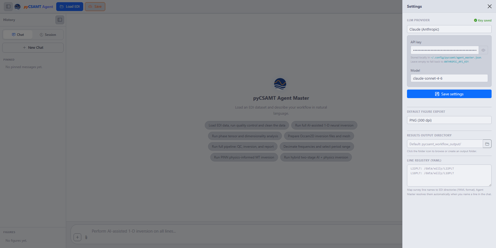
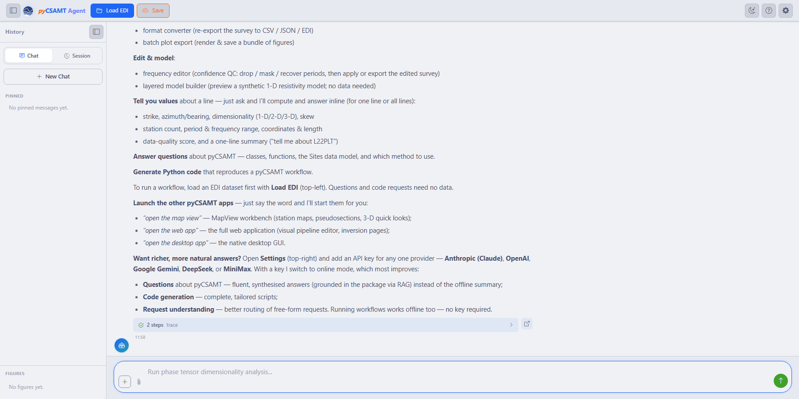

.. _applications-agent-master-llm:

LLM Configuration
=================

Agent Master's :term:`agent` layer runs in two modes: **offline**, where a
deterministic rule-based engine parses your request at zero cost, and
**LLM-assisted**, where a configured provider adds fluent understanding, RAG
answers, and generated prose on top of the same underlying agents. You choose
the mode from the **Settings** gear on the command bar, and nothing about the
workflows themselves changes between the two — only how well Agent Master
understands free-form phrasing and how it writes back to you.

The Settings Drawer
-------------------

   **Settings** with **Claude (Anthropic)** selected: the status badge reads
   **Key saved**, the API key field is masked, and the model defaults to
   ``claude-sonnet-4-6``. Below the provider block sit the **Default figure
   export** format, the **Results output directory**, and a **Line registry**
   for pre-mapping survey line names to EDI folders.

**LLM Provider** is a single selector rather than separate provider and
"active provider" controls — whichever entry you pick both configures and
activates that provider in one step:

.. list-table::
   :header-rows: 1
   :widths: 24 20 56

   * - Provider
     - Default model
     - Falls back to
   * - Claude (Anthropic)
     - ``claude-sonnet-4-6``
     - ``ANTHROPIC_API_KEY``
   * - OpenAI
     - ``gpt-4o``
     - ``OPENAI_API_KEY``
   * - Gemini (Google)
     - ``gemini-2.0-flash``
     - ``GOOGLE_API_KEY``
   * - DeepSeek
     - ``deepseek-chat``
     - ``DEEPSEEK_API_KEY``
   * - MiniMax
     - ``MiniMax-M3``
     - ``MINIMAX_API_KEY``
   * - Offline (rule-based, no key)
     - --
     - nothing to configure

The badge beside **LLM Provider** reports what Agent Master already knows
about the selected entry before you type anything: **Key saved** when a key
is stored in ``~/.config/pycsamt/agent_master.json``, **From environment**
when no stored key exists but the fallback environment variable above does,
**No key** when neither is present, and **Zero cost** for Offline, where the
question does not apply. The library-level rules behind that resolution —
including the additional environment variable names pycsamt checks per
provider — are documented in full in
:doc:`/user_guide/agents/llm_configuration`.

Once a provider other than Offline is selected, three more fields appear:

* **API key** — paste the key for that provider; the eye icon reveals it, and
  leaving the field empty falls back to the environment variable above rather
  than clearing a previously saved key.
* **Model** — the model id Agent Master will call; a capable default is
  pre-filled, but you can pick another from the list.
* **Save settings** — writes the provider, key, and model to the local config
  file so they persist across launches.

Two further fields sit below the provider block regardless of mode: the
**results output directory** the orchestrator writes reports, figures, and
checkpoints into (defaulting to ``pycsamt_workflow_output/``), and a **line
registry** that maps survey line names to EDI folders in YAML so a request
naming a line — *process L22PLT* — resolves without asking; see
:doc:`workflows_and_agents` for the in-chat line-selection panel this
registry complements.

Choosing A Provider And Model
------------------------------

1. Open **Settings** and pick a **provider** from the **LLM Provider** list.
2. Paste its **API key**, or leave it blank if the fallback environment
   variable is already set on the machine running the server.
3. Adjust the **model** id if the pre-filled default is not the one you want.
4. **Save settings**.

Selecting a different provider later switches the active one immediately —
there is no separate step to "activate" a provider you have already
configured. You can save keys for more than one provider and switch between
them freely; only the currently selected provider is used for the next
request. When building on top of pyCSAMT programmatically, prefer the latest
and most capable model each provider offers, the same guidance the library
layer gives in :doc:`/user_guide/agents/llm_configuration`.

Privacy And Keys
----------------

* API keys are kept **on your machine**, saved to
  ``~/.config/pycsamt/agent_master.json``, and used only to call the provider
  you selected.
* Requests sent to an LLM-assisted provider are processed under that
  provider's own terms — treat prompts and any pasted survey details
  accordingly.
* No key is required to browse the interface, load data, or run workflows —
  Offline mode covers all of that at zero cost. A key only changes how well
  Agent Master understands free-form phrasing and how richly it writes back;
  see below.

Running Without A Model
------------------------

Offline is not a degraded fallback bolted onto an LLM-first app — it is a
full deterministic mode, and it is what a fresh install runs in until you add
a key. Asking *what can you do?* while Offline is selected returns the
complete capability list and, at the end, explains exactly what a key would
change:

   The tail of an offline *what can you do?* response. Every workflow, plot,
   and per-line query in the list above it already ran through the
   deterministic engine; a key would only make questions about pyCSAMT more
   fluent (:term:`RAG`-grounded rather than the offline summary), code
   generation more tailored, and free-form request routing more forgiving.

In practice this means the keyword-based orchestrator described in
:doc:`/user_guide/agents/orchestrator` still resolves *run QC on the data* or
*prepare ModEM files* correctly without any provider configured — it is only
the more conversational features, such as open-ended questions about pyCSAMT
internals or narrated report prose, that read noticeably better once a
provider is active. If a specific request seems to need richer understanding
than the offline summary gives it, that is the signal to open **Settings**
and add a key, not a sign that the request itself requires one.

.. seealso::

   :doc:`/user_guide/agents/llm_configuration`
       Provider and model configuration for the agents at the library level,
       including environment variables, deterministic mode, and programmatic
       setup.

Next Steps
----------

* :doc:`workflows_and_agents` -- what the configured model then lets you run.
* :doc:`troubleshooting` -- provider connection and key problems.
