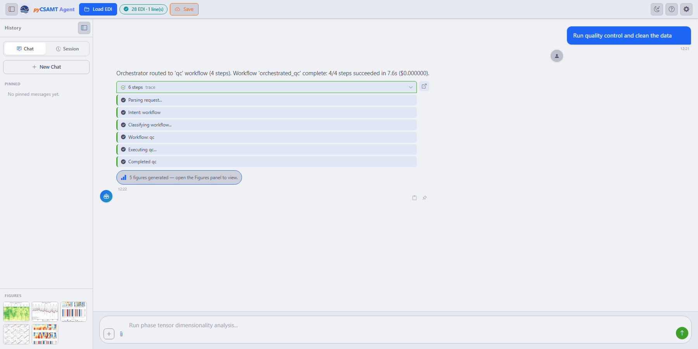

.. _applications_agent_master_overview:

Overview
========

What Agent Master Does
--------------------------

Underneath the conversation sits an orchestrator that turns a plain-language
request into a concrete, auditable run rather than a one-off chat reply:

* **Understands plain-language requests** and routes them to the correct
  workflow — QC, static-shift, denoising, phase/strike analysis, tipper,
  rotation, frequency decimation, sensitivity, inversion prep, full pipelines,
  reports, and code generation.
* **Asks for parameters** when a workflow needs them, through small in-chat
  forms, and **asks which lines** to process when several are loaded.
* **Runs the real pyCSAMT :term:`agent`\ s** — the same code as the GUI and
  web app — and streams progress step by step.
* **Returns products**: figures (collected in a Figures panel), reports,
  validated standalone Python scripts, and a step-by-step trace with timing
  and cost for provenance.
* **Works with or without an LLM** — Offline mode runs every workflow through
  a deterministic rule-based engine at zero cost, and adding a key for
  Claude, OpenAI, Gemini, DeepSeek, or MiniMax layers on fluent understanding
  and richer prose (see :doc:`llm_configuration`).

Because every one of these runs through the same agents and the same
orchestrator described in :doc:`/user_guide/agents/orchestrator`, what you see
in the chat is not a summary of the science — it is the science, narrated as
it happens.

A Complete Request, Start To Finish
------------------------------------

The bullets above describe capabilities in the abstract; a single real
request shows how they fit together. With one survey line loaded (28 EDI
files from ``L18PLT``, badged ``28 EDI · 1 line(s)`` on the :term:`command bar`)
and no LLM provider configured, typing *Run quality control and clean
the data* and pressing enter produces this, unedited:

   A finished ``qc`` run: the reply, the expanded **steps trace**, the
   generated-figures note, and the **Figures** panel filled with five
   thumbnails in the sidebar.

Reading the reply against the bullets above makes the mapping explicit.
*Understands plain-language requests and routes them* is the first line —
*Orchestrator routed to 'qc' workflow (4 steps)*. *Runs the real agents and
streams progress* is the expanded trace: **Parsing request** → **Intent:
workflow** → **Classifying workflow** → **Workflow: qc** → **Executing qc** →
**Completed qc**, each step ticking green as it completes rather than
appearing all at once. *Returns products* is the outcome line — *4/4 steps
succeeded in 7.6s* — plus the five figures now sitting in the sidebar and a
follow-up choice between **Apply to session** and **Export to folder**, so a
QC pass never silently overwrites the survey you loaded. And *works with or
without an LLM* is the number in parentheses at the end of the outcome line:
``($0.000000)``, because Offline mode ran the whole thing without a configured
provider. Nothing about this trace would read differently with a key
configured — only the assistant's prose around it would.

When To Use It
------------------

Reach for Agent Master when:

* you want to run a multi-step workflow by describing the goal, not by
  operating each page;
* you want a **reproducible script** for a workflow you just ran;
* you want a quick **report** or a guided **inversion preparation**;
* you are learning what pyCSAMT can do and want to ask it directly.

For dense manual review — station-by-station QC, correction previews, map and
3-D inspection — the :doc:`desktop <../desktop/index>`, :doc:`web
<../web/index>`, and :doc:`MapView <../mapview/index>` surfaces are still the
right tools, and nothing is lost by moving between them: see
:doc:`handoff_from_apps` for how results carry across.

Run Agent Master
--------------------

Nothing above needs an account or a key to try — launch the app and it opens
straight into Offline mode, ready to load data and run workflows immediately.

.. code-block:: bash

   pycsamt-agent

The launcher starts a local server on ``http://127.0.0.1:8765`` and opens the
app in your browser. The module form works everywhere the package is
importable, which is convenient when the console-script entry point is not on
``PATH`` or when launching from inside another Python environment:

.. code-block:: bash

   python -m pycsamt.app.agent_master

See :doc:`installation` for host, port, and browser options, and
:doc:`llm_configuration` for connecting a model when you want richer,
LLM-assisted answers on top of the offline default.

The Interface At A Glance
-----------------------------

The window that opens keeps everything a session needs on one screen, so a
long conversation never crowds out the record of what it produced:

.. figure:: ../../_static/applications/agent_master/agent-master-interface.png
   :alt: The Agent Master interface: top bar, history sidebar, chat area, input
   :class: pycsamt-screenshot

   The main window: the command bar (**Load EDI**, **Save**, theme, help,
   **Settings**), the **History** sidebar (Chat / Session tabs, pinned prompts,
   and a Figures panel), the chat area with suggestion chips, and the
   natural-language input at the bottom.

The :term:`suggestion chip`\ s in the chat area are not decorative — each is a
complete, runnable request, so a new user can produce a first result by
clicking rather than composing a prompt from scratch. From here, the natural
next steps are loading data and sending a first request, covered in
:doc:`welcome_and_chat`.

.. seealso::

   :doc:`/user_guide/agents/orchestrator`
       How the orchestrating agent behind this app plans and runs
       multi-step workflows — the guide to the brain, while this section
       documents the app surface.
