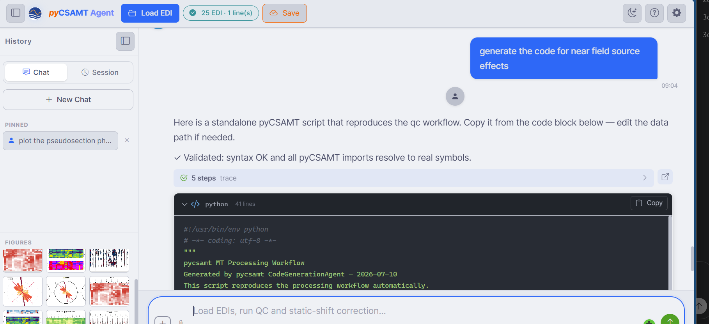

.. _applications-agent-master-tools-memory:

Tools, Memory, And Outputs
==========================

Agent Master is built to be **auditable and reproducible**: every run leaves a
trace, figures are collected in one place, generated code is validated before
it is shown, and sessions can be saved and restored.  This page covers those
outputs.

Step Traces And Provenance
--------------------------

Each completed request carries a **steps trace** — an expandable record of the
steps the workflow ran, with timing and the LLM **cost** of the request (often
``$0.000000`` for local processing).  The response also states the routing
decision and the outcome, for example *Workflow 'orchestrated_report' complete:
3/3 steps succeeded in 3.3 s*.  Together these make a run reproducible and
reviewable rather than a black box — you can see exactly what was done.

The Figures Panel
-----------------

Figures produced by any workflow are collected as thumbnails in the **Figures**
panel of the History sidebar, and each response notes how many were produced
(*5 figures generated — open the Figures panel to view*).  The panel
accumulates across the session, so a survey's pseudosections, strike roses,
phase-tensor plots, and QC images build up in one place as you work.  (The
sidebar Figures panel is visible in the workflow screenshots in
:doc:`workflows_and_agents`.)

Figures are saved in the format set by **Default figure export** in
:doc:`Settings <llm_configuration>` — for example ``PNG (300 dpi)``.

Generated Code
--------------

Ask Agent Master to *generate the code* for a workflow and it returns a
standalone, runnable pyCSAMT script — the reproducible counterpart of the
interactive run.

   A code-generation request returns a standalone script that reproduces the
   workflow, with a **Copy** button and a validation note — *Validated: syntax
   OK and all pyCSAMT imports resolve to real symbols*.

Two things make this trustworthy:

* the script is **validated** before it is shown — the syntax is checked and
  every pyCSAMT import is confirmed to resolve to a real symbol, so it is not
  hallucinated API;
* it is **self-contained** — a header records that it was generated by the
  pyCSAMT ``CodeGenerationAgent`` and how to run it, and you edit only the data
  path.

Copy it out and run it to reproduce the workflow headlessly or fold it into a
larger script.

Sessions And Pinned Prompts
---------------------------

The History sidebar keeps your work:

* **Chat** / **Session** tabs switch between the current message history and
  saved sessions; **Save** on the command bar persists the session.
* **New Chat** starts a fresh conversation without unloading the survey.
* **Pinned** prompts are kept for reuse across chats — handy for a request you
  run often (for example *plot the pseudosection phase*).

Because loaded data, figures, and traces live in the session, saving and
restoring gives you the whole context back, not just the text.

What To Keep
------------

For a reproducible record of a session, keep together:

* the original **EDI survey folder**;
* the **saved session** (conversation, traces, and figure references);
* any **generated scripts** you exported;
* the **figures** you exported from the Figures panel.

Next Steps
----------

* :doc:`handoff_from_apps` -- reaching Agent Master from the GUI and web app.
* :doc:`workflows_and_agents` -- the runs that produce these outputs.
