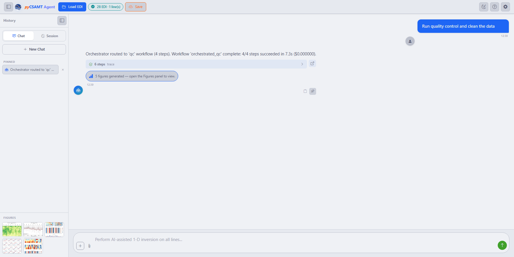
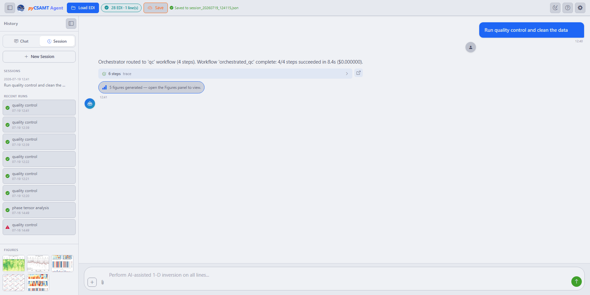

.. _applications-agent-master-tools-memory:

Tools, Memory, And Outputs
==========================

Agent Master is designed so an interactive conversation can still leave a
reviewable record. A request does not disappear into the chat: it returns an
:term:`AgentResult`, exposes a :term:`steps trace`, collects generated figures,
tracks any :term:`LLM cost`, and can produce a :term:`generated script` when
you want the same workflow outside the browser. This page explains how those
pieces fit together and what to keep when a session needs to be reproduced.

Step Traces And Provenance
--------------------------

Each completed request carries a **steps trace**, an expandable record of the
workflow steps that actually ran. A typical response states the routing
decision, the outcome, elapsed time, and cost, for example *Workflow
'orchestrated_report' complete: 3/3 steps succeeded in 3.3 s*. The trace is the
bridge between the friendly chat message and the underlying pyCSAMT execution:
it shows the named steps, which ones succeeded, which ones produced warnings,
and how long the request took.

Internally, every agent reports through the same :term:`AgentResult` shape:
``status`` says whether the run succeeded, failed, or needs review;
``summary`` gives the human-readable result; ``data`` holds workflow-specific
products such as tables, figures, and file paths; ``warnings`` records
non-fatal issues; and ``elapsed_seconds`` and ``cost_estimate_usd`` preserve
run metadata. That common structure is what lets Agent Master combine a loader,
QC agent, plotting agent, report agent, or code-generation agent without
turning the chat into a black box.

When a provider is used, cost is estimated from token counts and the configured
model rate. In compact form,

.. math::

   C =
   \frac{n_{\mathrm{in}} r_{\mathrm{in}}
       + n_{\mathrm{out}} r_{\mathrm{out}}}{10^6},

where :math:`C` is the estimated cost in USD, :math:`n_{\mathrm{in}}` and
:math:`n_{\mathrm{out}}` are the input and output token counts, and
:math:`r_{\mathrm{in}}` and :math:`r_{\mathrm{out}}` are the provider's USD per
million-token rates for the selected model. A purely local workflow, or a run
in Offline mode, naturally reports ``$0.000000`` because no provider call was
made. The number is a cost estimate, not a scientific quality score; the
scientific review still comes from the trace, figures, warnings, and exported
data.

The Figures Panel
-----------------

Figures produced by a workflow are collected as thumbnails in the **Figures**
panel of the History sidebar, and each response states how many were produced,
for example *5 figures generated - open the Figures panel to view*. The panel
accumulates across the :term:`chat session`, so a survey can build up
pseudosections, strike roses, phase-tensor plots, QC images, and report figures
as the interpretation develops. The sidebar Figures panel is visible in the
workflow screenshots in :doc:`workflows_and_agents`.

This is more than a convenience panel. A figure is the visual evidence attached
to a run, while the trace tells you how that evidence was produced. Read them
together: a QC figure may reveal missing frequencies or noisy stations, a
phase-tensor plot may motivate a dimensionality decision, and a sensitivity
figure may tell you which parts of a model deserve cautious interpretation.
When you export a figure, the available output types follow the app's figure
export controls: PNG directly, or converted static outputs such as SVG, EPS,
and PDF when requested. The default format is set under **Default figure
export** in :doc:`Settings <llm_configuration>`.

Generated Code
--------------

Ask Agent Master to *generate the code* for a workflow and it returns a
standalone, runnable pyCSAMT script: the reproducible counterpart of the
interactive run.

.. figure:: ../../_static/applications/agent_master/generate-code-for-near-field-effect.png
   :alt: Agent Master returning a validated standalone pyCSAMT script in a code block
   :class: pycsamt-screenshot

   A code-generation request returns a standalone script that reproduces the
   workflow, with a **Copy** button and a validation note: *Validated: syntax
   OK and all pyCSAMT imports resolve to real symbols*.

The script is generated by ``CodeGenerationAgent`` from the workflow
configuration and execution context. It imports public pyCSAMT APIs directly,
loads the survey path, repeats the processing steps, and writes outputs such as
figures or tables without needing Agent Master to be open. The only value a
user normally edits is the input or output path, because those depend on where
the survey is stored on the machine that will rerun the script.

Before the script is shown, Agent Master runs a deterministic validation pass.
The validation checks whether the script is syntactically valid and whether
the referenced pyCSAMT imports resolve to real package symbols. That does not
prove the interpretation is correct, and it does not replace running the
script on the archived data, but it catches the most damaging reproducibility
failure: a script that names an API that does not exist.

Sessions And Pinned Prompts
---------------------------

The History sidebar keeps the conversation usable over time. **Chat** and
**Session** switch between the active message history and saved sessions,
**New Chat** starts another conversation, and **Pinned** keeps prompts you run
often, such as *plot the pseudosection phase* or *run QC on the selected line*.
Pinning a completed exchange takes one click on the pin icon beneath it; the
prompt then reappears under **Pinned** for one-click reuse in a later chat.
Pinned prompts are best treated as reusable instructions, not as saved data.

   A pinned request sitting above the **Figures** panel in the same sidebar:
   the pin captures the prompt text only, while the five thumbnails below it
   are the actual evidence from the run that produced them.

When you press **Save**, Agent Master writes a session JSON record under the
user session directory and confirms it inline, for example *Saved to
session_20260719_124115.json*. The saved payload includes the save time,
loaded EDI context, non-secret settings, and message count; settings whose
keys begin with ``key_`` are excluded so API keys are not written into the
session file. That separation is deliberate. A saved session helps
reconstruct the working state, while the survey folder, exported figures,
generated scripts, and any report files remain the durable scientific record.

   The **Session** tab after **Save**: the sidebar switches to a **Sessions**
   list plus a **Recent Runs** history, each entry stamped with its workflow
   name, timestamp, and status icon — a green check for a completed run,
   a warning triangle for one that needs review. **New Chat** becomes **New
   Session** while this tab is active, since starting fresh here means
   detaching from the saved session rather than only clearing the visible
   conversation.

Recent Runs is a quicker way to answer *what did I already try* than reading
back through the trace of a long conversation: the per-run status icon flags
which past attempts are worth revisiting before you repeat a request that
already failed once.

What To Keep
------------

For a reproducible record of a session, keep the original **EDI survey
folder**, the **saved session** JSON, any **generated scripts**, the **figures**
exported from the Figures panel, and reports or tables written by the workflow.
If a workflow used a model provider, also keep the provider name and model id
from the non-secret settings. Do not archive raw API keys; the saved session is
designed to avoid that, and any credential needed to rerun the workflow should
be supplied again through the normal configuration path.

The safest handoff is therefore a small package: source data, session context,
code, figures, and report outputs. With those pieces together, another user
can inspect what Agent Master did, rerun the generated script, compare the
figures, and decide whether the result is scientifically acceptable.

Next Steps
----------

* :doc:`handoff_from_apps` -- reaching Agent Master from the GUI and web app.
* :doc:`workflows_and_agents` -- the runs that produce these outputs.
