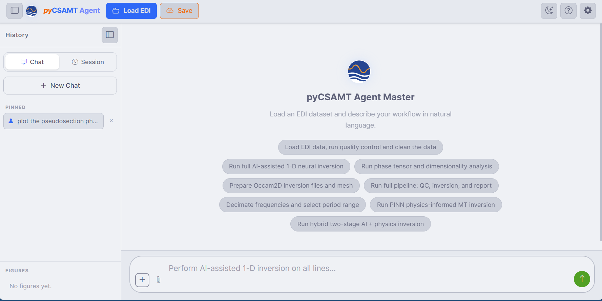
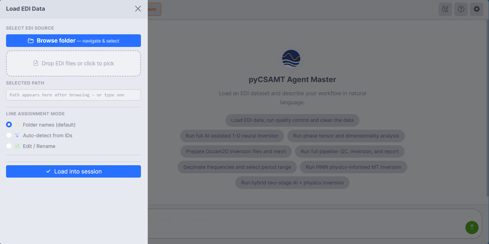
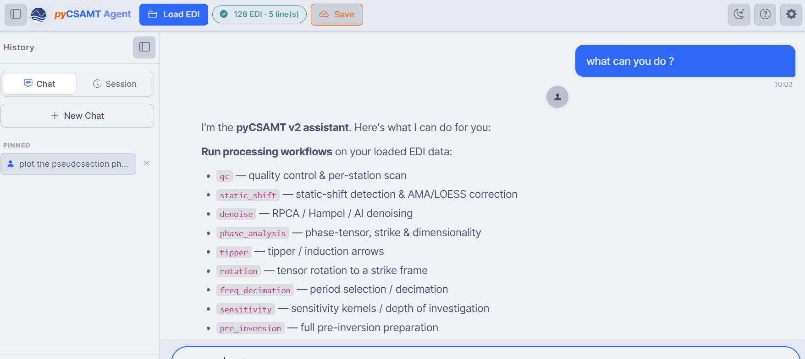

.. _applications-agent-master-welcome-chat:

Welcome Screen And Chat
=======================

This page covers the Agent Master surface itself — the welcome screen, the main
window, how to load data, and how the chat works — so the later pages can focus
on workflows, configuration, and outputs.

Welcome Screen
--------------

Agent Master opens on a welcome screen (see :ref:`installation
<applications-agent-master-installation>`) with four capability cards — **Load
EDI**, **Chat & Plan**, **AI Inversion**, **Reports** — and a **Start Agent
Master** button that takes you into the main window.

The Main Window
---------------

   The main window before the first message: command bar on top, **History**
   sidebar on the left, the chat area with suggestion chips in the centre, and
   the natural-language input at the bottom.

**Command bar** (top)

* **Load EDI** — open the data loader (below).
* **Save** — save the current session.
* a **theme** toggle, **Help**, and **Settings** (the gear — the LLM
  configuration, see :doc:`llm_configuration`).
* Once data is loaded, a status badge shows the survey size, e.g.
  ``128 EDI · 5 line(s)``.

**History sidebar** (left)

* **Chat** / **Session** tabs switch between the message history and saved
  sessions.
* **New Chat** starts a fresh conversation.
* **Pinned** keeps prompts you want to reuse.
* **Figures** collects every figure the agents generate, as thumbnails, during
  the session.

**Chat area** (centre)

Before the first message, the chat area shows suggestion chips — ready-made
requests such as *Load EDI data, run quality control and clean the data*, *Run
full AI-assisted 1-D neural inversion*, *Run phase tensor and dimensionality
analysis*, or *Run full pipeline: QC, inversion, and report*.  Click one to
send it, or type your own.

**Input bar** (bottom)

Type a request in plain language.  The **+** and paperclip let you attach
context, and the send button submits; while a workflow runs, the send button
becomes a **stop** control.

Loading EDI Data
----------------

Everything Agent Master does operates on a loaded survey.  Open the loader with
**Load EDI** on the command bar.

   The **Load EDI Data** drawer: browse to a folder or drop files, then choose
   how stations are grouped into lines.

* **Select EDI source** — **Browse folder** to a survey directory, or drop
  EDI files (or a folder) onto the drop zone; the chosen path appears under
  **Selected path**.
* **Line assignment mode** — group stations into survey lines by **Folder
  names** (default), **Auto-detect from IDs**, or **Edit / Rename**.
* **Load into session** brings the survey in.

When you point at a multi-line survey, the loader reports the lines it found —
for example five lines ``L18PLT`` (28 EDI), ``L22PLT``, ``L26PLT``, ``L30PLT``,
and ``L34PLT`` (25 EDI each).  After loading, the command-bar badge shows the
total (``128 EDI · 5 line(s)``), and the survey is available to every request
you make.

Chatting
--------

Once data is loaded, describe what you want.  Agent Master replies in a chat
thread of alternating bubbles — your requests on the right, the assistant's
responses on the left.

   Asking *what can you do?* lists the workflows Agent Master can run on the
   loaded data — ``qc``, ``static_shift``, ``denoise``, ``phase_analysis``,
   ``tipper``, ``rotation``, ``freq_decimation``, ``sensitivity``,
   ``pre_inversion``, and more.

A good first message is simply *what can you do?* — the assistant introduces
itself as the pyCSAMT assistant and lists the workflows it can run.  From there
you can ask for any of them in plain language; how those requests are planned
and executed is covered in :doc:`workflows_and_agents`.

Sessions And History
--------------------

* **New Chat** starts over without losing loaded data.
* **Pinned** prompts are kept in the sidebar for reuse across chats.
* **Save** (command bar) and the **Session** tab persist and restore
  conversations; generated figures and traces are covered in
  :doc:`tools_memory_outputs`.

Next Steps
----------

* :doc:`workflows_and_agents` -- what the assistant can run, and how requests
  become workflows.
* :doc:`llm_configuration` -- connect a model provider.
