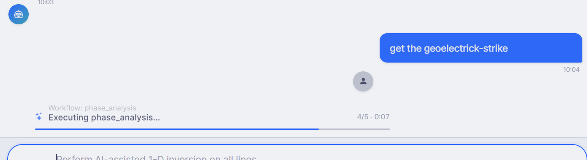
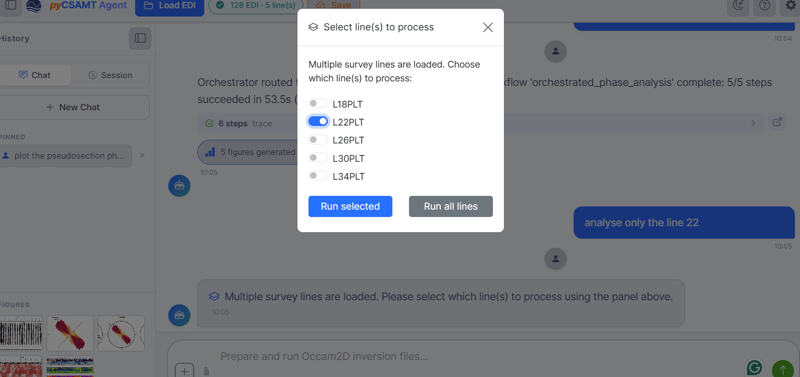
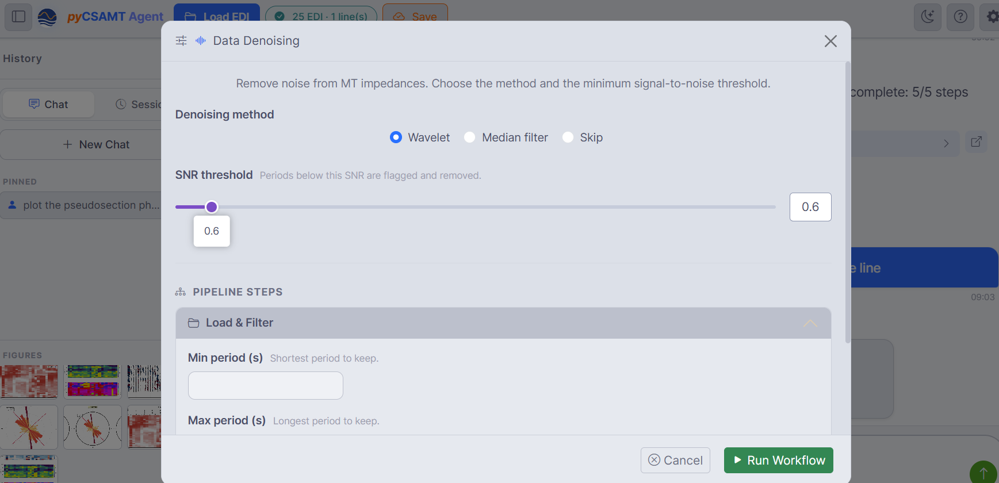
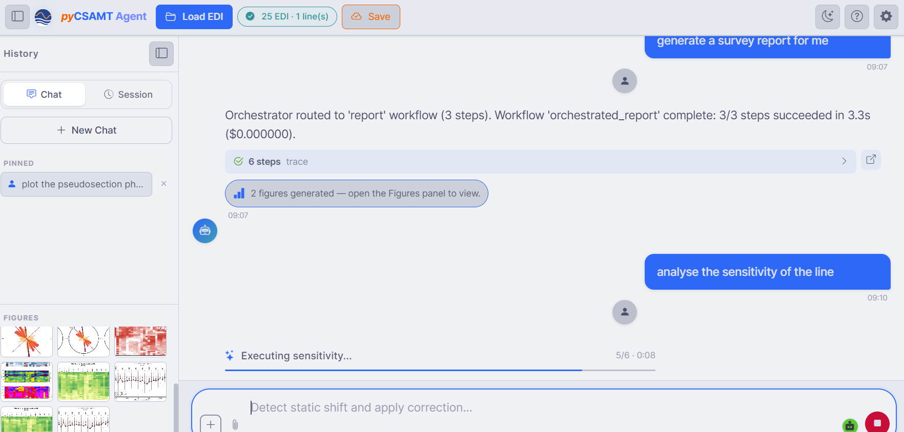

.. _applications-agent-master-workflows:

Workflows And Agents
====================

When you send a request, Agent Master does not answer from the language model
alone.  An **orchestrator** interprets the request, chooses the matching
pyCSAMT workflow, collects any parameters it needs, runs the real agents, and
returns the products with a provenance trace.  This page describes that loop.

The Workflow Catalogue
----------------------

Asking *what can you do?* lists the workflows available on the loaded data.
The core set is:

.. list-table::
   :header-rows: 1
   :widths: 26 74

   * - Workflow
     - What it does
   * - ``qc``
     - Quality control and per-station scan.
   * - ``static_shift``
     - Static-shift detection and AMA / LOESS correction.
   * - ``denoise``
     - RPCA / Hampel / AI denoising.
   * - ``phase_analysis``
     - Phase-tensor, strike, and dimensionality analysis.
   * - ``tipper``
     - Tipper / induction arrows.
   * - ``rotation``
     - Tensor rotation to a strike frame.
   * - ``freq_decimation``
     - Period selection / frequency decimation.
   * - ``sensitivity``
     - Sensitivity kernels / depth of investigation.
   * - ``pre_inversion``
     - Full pre-inversion preparation.

Beyond these, the orchestrator can run **inversion** (AI-neural, PINN, hybrid,
and classic solver preparation such as Occam2D), **report** generation, and
**code generation** (below).  You do not call these by name — you describe the
goal and the orchestrator routes to the right one.

Making A Request
----------------

Describe the task in plain language, for example *get the geoelectric strike*.
The orchestrator matches it to a workflow and starts running, streaming
progress in the chat.

   A request routed to ``phase_analysis``, executing with a live progress bar
   (*Executing phase_analysis… 4/5*).  Each workflow reports its step count and
   elapsed time as it runs.

Choosing Lines
--------------

When several survey lines are loaded, a workflow that acts per line first asks
which lines to process — so a request like *analyse only the line 22* is
resolved explicitly rather than guessed.

   The **Select line(s) to process** panel: toggle the lines you want and
   **Run selected**, or **Run all lines**.  Behind it, a completed run reports
   *Orchestrator routed … workflow 'orchestrated_phase_analysis' complete: 5/5
   steps succeeded*, with a **steps trace** and *5 figures generated*.

Providing Parameters
--------------------

When a workflow needs settings, Agent Master opens a small in-chat form instead
of guessing — you stay in control of the science.

   A denoising request opens a **Data Denoising** form: pick the method
   (Wavelet / Median filter / Skip), set the **SNR threshold**, expand the
   **Pipeline steps** for period limits, then **Run Workflow**.

These forms expose exactly the parameters the underlying agent accepts, with
sensible defaults, so you can accept the defaults or tune them before the run
starts.

Orchestration, Traces, And Cost
-------------------------------

Every completed request reports what happened:

* the **routing** decision — for example *Orchestrator routed to 'report'
  workflow (3 steps)*;
* the **outcome** — *Workflow 'orchestrated_report' complete: 3/3 steps
  succeeded in 3.3 s*;
* the **cost** of any LLM calls (often ``$0.000000`` for local processing
  steps);
* an expandable **steps trace** and a count of **figures generated**.

   A ``report`` workflow completes (3/3 steps, with a trace and two figures),
   then a *analyse the sensitivity of the line* request runs the
   ``sensitivity`` workflow — while the **Figures** panel fills with the
   thumbnails produced along the way.

Chaining Requests
-----------------

Because the survey and the conversation persist, you can build up a session
naturally — QC, then correction, then phase analysis, then a report — each
request acting on the current state.  You can also ask for a **full pipeline**
in one message (*run full pipeline: QC, inversion, and report*) and let the
orchestrator sequence the steps.

The agents Agent Master drives are the same ones documented in the
:doc:`agents user guide </user_guide/agents/index>`; the orchestrator that plans
and sequences them is described in
:doc:`/user_guide/agents/orchestrator`.

Next Steps
----------

* :doc:`tools_memory_outputs` -- traces, figures, generated code, and cost in
  depth.
* :doc:`llm_configuration` -- the model that powers request understanding.
