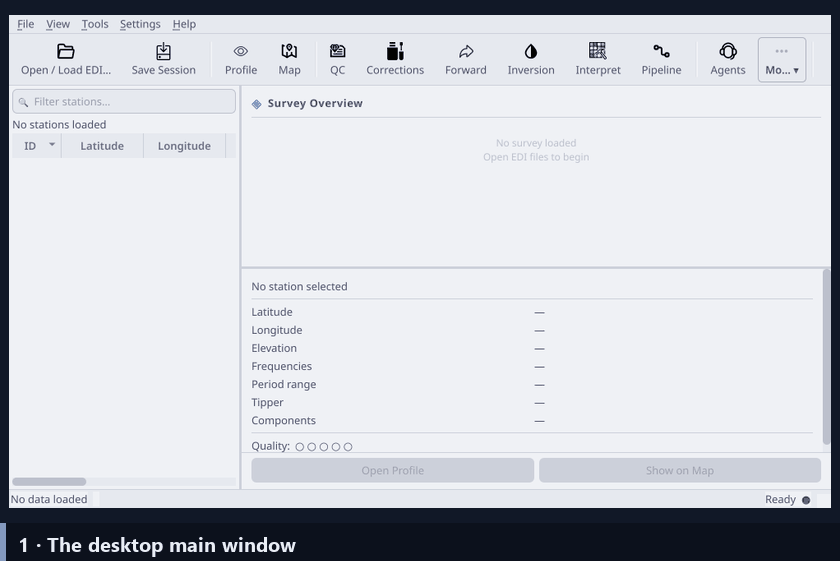

.. _applications-desktop:

Desktop GUI
===========

The pyCSAMT desktop GUI is the local application for interactive CSAMT, AMT,
and MT survey work.  It is designed for the day-to-day workflow of loading EDI
data, checking station geometry, inspecting profiles and maps, running QC,
testing corrections, preparing forward and inversion models, exporting figures
and processed EDIs, and documenting the processing chain.

The desktop app uses the same scientific package as the Python API.  The GUI
is not a separate science layer; it is an interactive surface over pyCSAMT
loaders, ``Sites`` objects, processing functions, plotting tools, inversion
builders, and export helpers.

   An animated tour of the desktop app: launch the main window, load EDI survey
   lines, inspect the station map and per-station responses, run quality
   control, correct static shift, and build a forward model.  Each step is
   documented on the pages below.

Explore the Guide
-----------------

Pick a page to dive in.  A good first pass, in order, is **Installation →
Loading & Sessions → Workspace → Maps & Profiles → Processing Workflows →
Exports → Troubleshooting**.

.. grid:: 1 1 2 3
   :gutter: 3
   :class-container: cta-tiles

   .. grid-item-card:: Installation
      :link: installation
      :link-type: doc
      :img-top: ../../_static/icons/launch.svg
      :class-card: pycsamt-card sd-text-center

      Install dependencies, launch the desktop, and confirm the console
      commands.

   .. grid-item-card:: Loading & Sessions
      :link: loading_and_sessions
      :link-type: doc
      :img-top: ../../_static/icons/loading.svg
      :class-card: pycsamt-card sd-text-center

      Load EDI/AVG/J files, understand the active ``Sites`` object, and save
      session state.

   .. grid-item-card:: Workspace
      :link: workspace
      :link-type: doc
      :img-top: ../../_static/icons/controls.svg
      :class-card: pycsamt-card sd-text-center

      The main window, station table, toolbar, floating panels, log dock,
      theme, and preferences.

   .. grid-item-card:: Maps & Profiles
      :link: maps_and_profiles
      :link-type: doc
      :img-top: ../../_static/icons/map-and-profile.svg
      :class-card: pycsamt-card sd-text-center

      Station geometry, contours, response curves, pseudosections, topography,
      and phase tensors.

   .. grid-item-card:: Processing Workflows
      :link: processing_workflows
      :link-type: doc
      :img-top: ../../_static/icons/processing.svg
      :class-card: pycsamt-card sd-text-center

      Evidence-based QC, corrections, advanced diagnostics, forward modelling,
      inversion prep, and the pipeline.

   .. grid-item-card:: Exports
      :link: exports
      :link-type: doc
      :img-top: ../../_static/icons/export.svg
      :class-card: pycsamt-card sd-text-center

      Save figures, metadata, EDIs, pipeline JSON, inversion outputs, and
      reproducibility notes.

   .. grid-item-card:: Troubleshooting
      :link: troubleshooting
      :link-type: doc
      :img-top: ../../_static/icons/troubleshoot.svg
      :class-card: pycsamt-card sd-text-center

      Diagnose launch, loading, plotting, export, correction, pipeline, and
      inversion problems.

When To Use The Desktop
-----------------------

Use the desktop GUI when you need to:

* inspect a survey line station by station;
* compare maps, profiles, QC plots, and correction previews side by side;
* decide whether static shift, frequency editing, source-effect handling, or
  tensor rotation is justified;
* build visual evidence for reports and reproducible processing notes;
* prepare forward models and inversion input folders;
* export corrected EDIs, figures, pipeline settings, and interpretation files.

For automated scripts, batch jobs, or notebooks, use the Python API directly.
For browser-based demonstrations or shared dashboards, use the web
application.  For guided workflow reasoning, use Agent Master.

Run The Desktop GUI
-------------------

.. code-block:: bash

   pycsamt-desktop

The shorter historical alias still launches the same desktop app:

.. code-block:: bash

   pycsamt-gui

From a source checkout, the module entry point is also available:

.. code-block:: bash

   python -m pycsamt.app.desktop

Workflow Map
------------

The desktop workflow is intentionally conservative:

.. code-block:: text

   load -> inspect -> QC -> preview correction -> commit -> recheck -> model
        -> prepare inversion -> export -> document

The map/profile viewers should be used before and after any state-changing
operation.  **Apply**, **Commit to Main**, **Run All**, and inversion **Run**
are not routine navigation buttons; they change data state or generate new
products.  Use them only when the current diagnostics explain what should
happen next.

Main Concepts
-------------

.. list-table::
   :header-rows: 1
   :widths: 24 76

   * - Concept
     - Meaning In The Desktop
   * - Active survey
     - The currently loaded ``Sites`` object shared by the station table,
       map/profile viewers, QC, corrections, modelling, inversion, and agents.
   * - Panel windows
     - Independent floating windows such as Profile, Map, QC, Corrections,
       Forward, Inversion, Interpretation, Pipeline, Advanced Tools, and
       Agent Master.
   * - Correction stack
     - Non-destructive correction steps previewed and applied locally before
       **Commit to Main** replaces the active survey.
   * - Pipeline configuration
     - JSON record of processing methods and parameters for repeatable
       load/QC/edit/correct/rotate/export workflows.
   * - Session state
     - Convenience state stored under ``~/.pycsamt/session.json``: theme,
       recent files, selected station, geometry, solver paths, and preferences.
   * - Exported product
     - A file or folder meant to be reused outside the current GUI state:
       figures, corrected EDIs, metadata tables, solver inputs, inversion
       results, interpretation exports, or reports.

Screenshots
-----------

Screenshots are embedded inside the workflow pages where they explain a real
decision or user action.  There is no separate screenshot gallery for the
desktop app.  For example:

* loader and launch screenshots are in :doc:`installation` and
  :doc:`loading_and_sessions`;
* map/profile screenshots are in :doc:`maps_and_profiles`;
* QC, correction, forward, inversion, pipeline, and agent screenshots are in
  :doc:`processing_workflows`.

.. toctree::
   :maxdepth: 1
   :hidden:

   installation
   loading_and_sessions
   workspace
   maps_and_profiles
   processing_workflows
   exports
   troubleshooting
