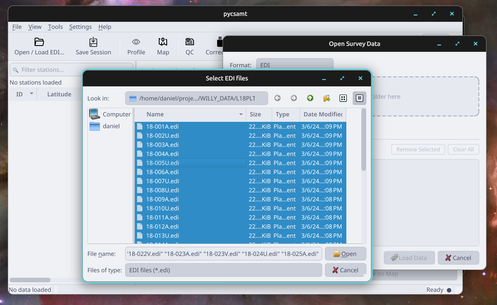

.. _applications-desktop-installation:

Installation And Launch
=======================

The desktop application is the local Qt interface for pyCSAMT.  It is meant
for interactive work: loading EDI surveys, inspecting station metadata,
opening map and profile views, running quality-control and correction tools,
and preparing forward or inversion workflows from one workspace.

Why Installation Matters
------------------------

The desktop app depends on both scientific libraries and interface libraries.
A successful installation is not only about opening a window; it is about
making sure the same environment can load survey data, draw maps, render
profiles, write exports, and prepare inversion files without switching
Python installations halfway through a project.

Use a dedicated environment when possible.  Qt, plotting, geospatial, and
solver-related packages are common sources of version conflicts in scientific
Python projects.  Keeping the desktop app in its own environment makes later
troubleshooting much easier because every command, export, and log message
comes from the same package set.

Choose An Installation Path
---------------------------

Most users should choose one of these paths:

.. list-table::
   :header-rows: 1
   :widths: 24 38 38

   * - Situation
     - Install Command
     - Why Choose It
   * - You want only the desktop GUI
     - ``pip install "pycsamt[desktop]"``
     - Installs the Qt interface and desktop plotting dependencies without
       the web application stack.
   * - You want all application surfaces
     - ``pip install "pycsamt[app]"``
     - Installs the desktop GUI and browser-based application dependencies in
       one environment.
   * - You are working from this repository
     - ``pip install -e ".[desktop,docs]"``
     - Keeps source edits live and includes documentation tools for local
       guide development.
   * - You are preparing development builds
     - ``pip install -e ".[full]"``
     - Installs the broader optional stack used for apps, agents, geospatial
       workflows, tests, and documentation.

If you are unsure, start with ``pycsamt[desktop]``.  Add the broader extras
only when you know you need the web app, documentation build, agents, or full
development stack.

Install The Desktop Extra
-------------------------

From a released package, install the desktop extra:

.. code-block:: bash

   pip install "pycsamt[desktop]"

If you also want the Dash web app in the same environment, install the
application extra instead:

.. code-block:: bash

   pip install "pycsamt[app]"

For development from a source checkout, install the package in editable mode
with the desktop and documentation dependencies:

.. code-block:: bash

   git clone https://github.com/earthai-tech/pycsamt.git
   cd pycsamt
   pip install -e ".[desktop,docs]"

The desktop extra installs the Qt runtime and plotting dependencies used by
the GUI:

.. list-table::
   :header-rows: 1
   :widths: 28 72

   * - Dependency
     - Used for
   * - ``PySide6``
     - the desktop windowing toolkit, dialogs, menus, and toolbar controls
   * - ``pyqtgraph``
     - responsive station and signal views
   * - ``contextily``
     - optional map tile support for geospatial views

The app extra includes the desktop extra plus the Dash web application stack.
It is convenient for training, demonstrations, and users who switch between
the local GUI and browser workflows.

Launch The Application
----------------------

After installation, start the desktop GUI from the active environment:

.. code-block:: bash

   pycsamt-desktop

The older command remains available as an alias:

.. code-block:: bash

   pycsamt-gui

From a source checkout, the module entry point is equivalent:

.. code-block:: bash

   python -m pycsamt.app.desktop

Use the module entry point when a console script is not yet visible on
``PATH``.  If the module entry point works but ``pycsamt-desktop`` does not,
the installation is usually fine and the shell simply cannot find the
environment's script directory.

On first launch the application opens with an empty survey workspace.  The
left panel is reserved for stations, the center panel summarizes the survey,
and the toolbar exposes the main workflow windows.

.. figure:: ../../_static/applications/desktop/home.png
   :alt: Empty pyCSAMT desktop workspace
   :class: pycsamt-screenshot

   Empty desktop workspace before survey data are loaded.

Load A First EDI Survey
-----------------------

Use **Open / Load EDI...** to load one or more EDI files.  The loader accepts
individual files or a folder containing a survey line.  For the sample WILLY
data, a typical folder is one of the ``L18PLT``, ``L22PLT``, ``L26PLT``,
``L30PLT``, or ``L34PLT`` line folders under ``data/AMT/WILLY_DATA``.

For a first launch, prefer a small known line folder instead of a large
campaign directory.  A small input makes it easier to tell whether an issue is
caused by installation, file selection, or the data themselves.  After the
loader succeeds, the station table should show one row per station and the
overview card should show frequency and coordinate information.

   Loading a line by selecting multiple ``.edi`` files from the survey folder.

After loading, the station table, overview panel, profile view, map view, QC
tools, correction tools, forward modelling, inversion, interpretation, and
agent windows operate on the active session.

What Success Looks Like
-----------------------

The installation is ready for real work when these checks pass:

.. list-table::
   :header-rows: 1
   :widths: 30 35 35

   * - Check
     - Expected Result
     - What It Proves
   * - ``pycsamt-desktop --help``
     - The command prints help or exits cleanly.
     - The console script is installed in the active environment.
   * - Empty GUI launch
     - The main window opens with no Qt import or display error.
     - Qt and desktop resources are available.
   * - Load a small EDI folder
     - Station rows appear in the main table.
     - File readers and the ``Sites`` data model are working.
   * - Open **Map**
     - Station markers draw without a plotting error.
     - Map plotting dependencies are usable.
   * - Open **Profile**
     - Response curves or profile tabs render for a selected station.
     - Scientific plotting and station selection are connected.
   * - Save Session
     - ``~/.pycsamt/session.json`` is written.
     - The app can save user preferences and layout state.

These checks are deliberately simple.  They do not prove that every survey
file is valid, but they confirm the desktop stack is healthy enough to begin
normal loading and QC work.

First-Launch Checklist
----------------------

After installing and launching the desktop, do this short check before using
the app for real project work:

* launch from the same environment where pyCSAMT was installed;
* confirm the empty workspace appears without Qt or display errors;
* load a small known EDI set rather than a full survey campaign;
* verify that station count, coordinates, and frequency coverage appear;
* open the profile and map views once to confirm plotting dependencies work;
* save the session so the application can write ``~/.pycsamt/session.json``;
* close and relaunch the app to confirm preferences and recent files restore.

This check separates installation problems from data problems.  If the sample
or known-good survey works, later failures are more likely to come from a
specific input folder, missing metadata, or an unsupported file variation.

Recommended Environment
-----------------------

Use a dedicated environment for the desktop app so Qt and geospatial packages
do not conflict with other Python projects:

.. code-block:: bash

   conda create -n pycsamt-v2 python=3.12
   conda activate pycsamt-v2
   pip install -e ".[desktop,docs]"

For day-to-day work in this repository, activate the environment before
launching or building documentation:

.. code-block:: bash

   conda activate pycsamt-v2
   pycsamt-desktop

Platform Notes
--------------

Windows users should run the command from Anaconda Prompt, PowerShell, or Git
Bash after activating the environment.  If the command is not found, verify
that the environment's ``Scripts`` directory is on ``PATH``.

Linux users may need system Qt/OpenGL libraries in minimal containers or
headless servers.  The desktop app is intended for an interactive display; use
the Python API, CLI, or web app for non-interactive runs.

macOS users should launch from a terminal attached to the active environment.
If a gatekeeper prompt appears for local Python or Qt components, approve the
environment that owns the installed dependencies.

Common Installation Problems
----------------------------

``pycsamt-desktop`` is not found
    Activate the environment where pyCSAMT was installed.  If the command is
    still missing, try ``python -m pycsamt.app.desktop`` from the same shell.
    When the module command works, the issue is usually ``PATH`` rather than
    the package itself.

``ModuleNotFoundError: PySide6``
    The desktop extra was not installed in the active environment.  Reinstall
    with ``pip install "pycsamt[desktop]"`` for a released package, or
    ``pip install -e ".[desktop]"`` from a source checkout.

The window opens but plots are blank
    Confirm that the selected files actually loaded and that a station is
    selected.  If the station table is empty, the problem is loading rather
    than plotting.  If the table has stations but plots fail, check the log
    dock and reinstall the desktop extra.

Basemap tiles do not appear
    Basemaps are optional and depend on geospatial packages and network tile
    access.  The desktop can still inspect station geometry, contours,
    profiles, QC, and exports without basemap tiles.

External inversion engines are unavailable
    The desktop can prepare input files without every external solver binary
    being installed.  Configure solver paths later in **Preferences** when you
    are ready to run Occam2D, ModEM, MARE2DEM, or another external engine.

Quick Verification
------------------

Check that the command is available:

.. code-block:: bash

   pycsamt-desktop --help
   pycsamt-gui --help

Then launch the GUI:

.. code-block:: bash

   pycsamt-desktop

If the application reports that ``PySide6`` is missing, reinstall with the
desktop extra:

.. code-block:: bash

   pip install -e ".[desktop]"
