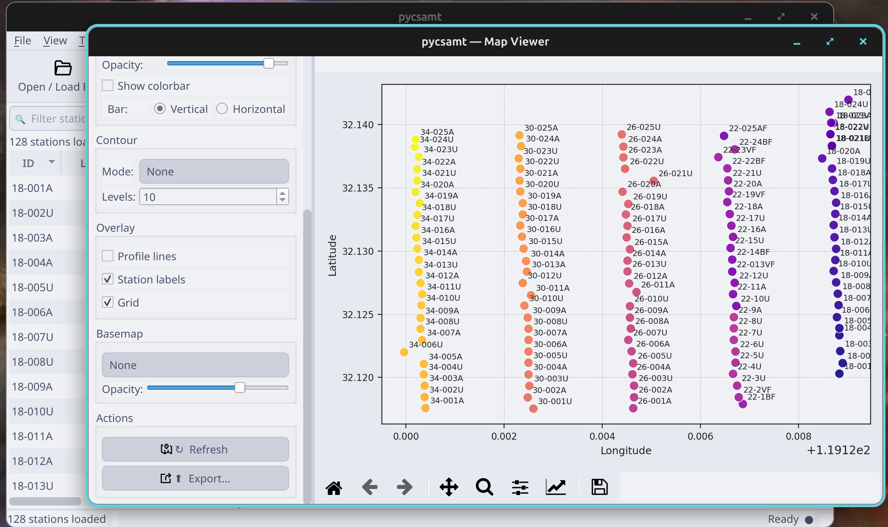
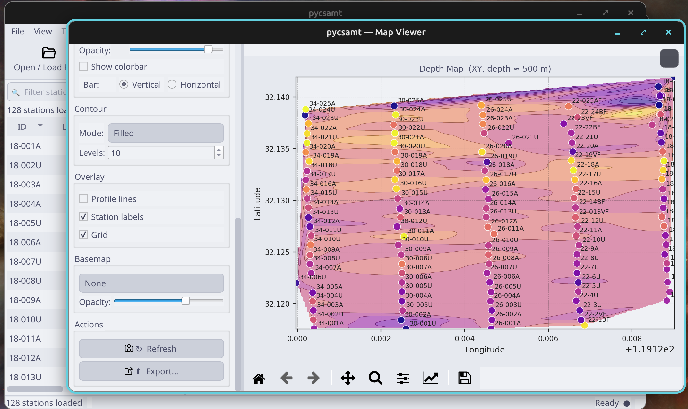
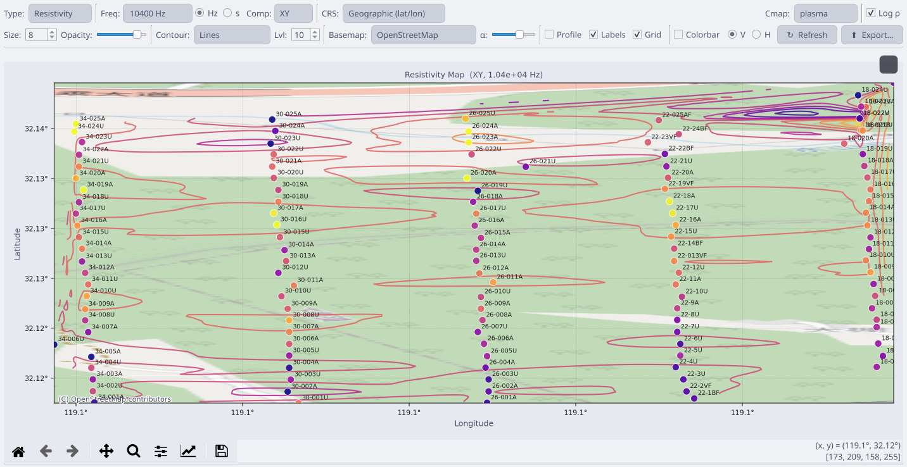
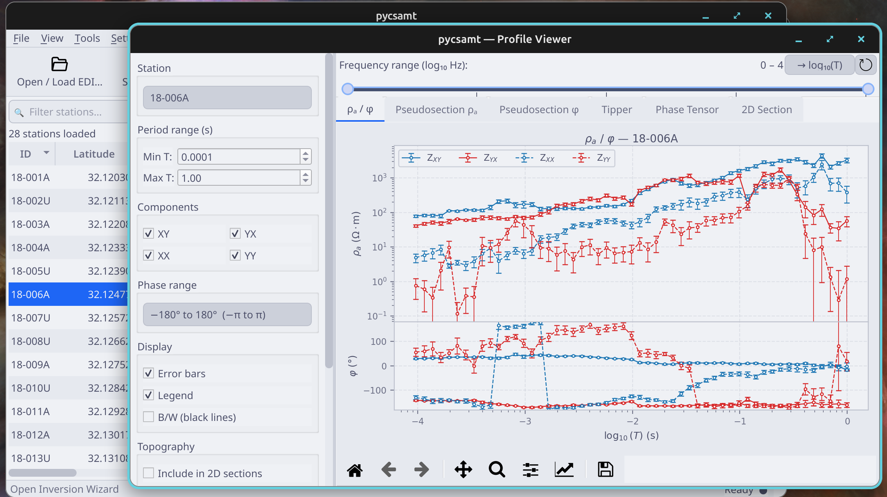

.. _applications-desktop-maps-profiles:

Maps And Profiles
=================

The desktop map and profile viewers are the two fastest ways to check whether
a loaded survey is spatially coherent and physically plausible.  Use the map
viewer to inspect station geometry, coordinate systems, elevation, apparent
resistivity, and depth slices.  Use the profile viewer to inspect station
responses, pseudosections, tipper behaviour, phase tensors, and 2-D sections.

Both viewers use the active survey loaded in the main desktop session.  They
do not open a separate copy of the data; station selections and loaded
``Sites`` objects are shared with the station table and downstream workflow
windows.

What These Viewers Help You Decide
----------------------------------

Maps and profiles are inspection tools.  They should help you decide whether
the loaded survey is ready for QC, correction, modelling, or export.

.. list-table::
   :header-rows: 1
   :widths: 26 36 38

   * - Question
     - Best View
     - What A Good Answer Looks Like
   * - Did I load the right line?
     - Station map and station labels
     - Stations appear in the expected area, order, and grouping.
   * - Are coordinates and elevation usable?
     - Station map, elevation map, and grid overlay
     - Coordinates fall in range and elevation varies plausibly.
   * - Is one station suspicious?
     - Single-station profile and neighbouring pseudosection
     - The station either matches neighbours or has a clear reason to review.
   * - Is a feature line-wide?
     - Apparent-resistivity and phase pseudosections
     - The feature persists across stations and is not only one bad trace.
   * - Is a map pattern trustworthy?
     - Station map plus resistivity/depth map
     - The pattern is supported by station coverage and not only
       interpolation.
   * - Should I consider strike or dimensionality analysis?
     - Phase tensor, tipper, and pseudosection tabs
     - Directional behaviour is visible enough to justify deeper diagnostics.

Do not use a map or profile as final proof by itself.  Use it to decide which
diagnostic page, correction tool, or export should come next.

Recommended Inspection Order
----------------------------

Use the viewers in a fixed order when opening a new line.  It keeps visual
interpretation from running ahead of basic data checks:

1. **Station map** -- confirm that station positions and labels are sensible.
2. **Elevation map** -- check whether elevation metadata are present and
   continuous along the line.
3. **Single-station profile** -- inspect ``rho_a`` and phase curves for a few
   representative stations.
4. **Pseudosections** -- look for line-scale continuity and frequency gaps.
5. **Depth or resistivity maps** -- use interpolated maps only after station
   geometry and response curves look credible.
6. **Phase tensor and tipper tabs** -- check dimensionality and directionality
   before strike analysis or 2-D inversion assumptions.

This order is intentionally conservative.  A filled contour map can look
convincing even when a coordinate system, station order, or component selection
is wrong.

Open The Viewers
----------------

After loading EDI data, open the viewers from the main toolbar:

* **Map** opens the station and spatial-property map viewer.
* **Profile** opens the per-station response and profile-section viewer.
* Selecting a station in the main station table also updates the viewers when
  they are open.
* Double-clicking or using **Open Profile** from the station detail card is a
  convenient way to jump directly to one station response.

The viewers remember their window geometry in the desktop session, so a saved
session can restore a familiar inspection layout.

Viewer State And Active Survey
------------------------------

The map and profile windows are listeners on the desktop session.  When new
data are loaded, the main window sends the loaded ``Sites`` object and station
summary table to open panel windows.  This means:

* reloading data replaces the viewer content;
* station selections are synchronized across the main table, map, profile
  viewer, and station detail card;
* exported figures reflect the current viewer settings, not a separate saved
  analysis state;
* saving the desktop session remembers layout and preferences, while the EDI
  files remain the source of scientific data.

Because the viewers follow the active survey, check the main status bar when a
plot does not match your expectation.  A profile may look different because
the survey was reloaded, corrected, recomputed, or committed from another
panel.  When in doubt, return to the main window and confirm the active data
state before interpreting the figure.

Map Viewer Overview
-------------------

The map viewer starts with station geometry.  This is the first map to inspect
after loading a survey because it shows whether station order, line grouping,
and coordinates make sense before any interpolation or geophysical colouring is
applied.

   Station map with labels and grid enabled for a multi-line survey.

Use the **Map Type** control to switch between:

.. list-table::
   :header-rows: 1
   :widths: 24 76

   * - Map type
     - Purpose
   * - ``Station``
     - Shows station locations, labels, profile lines, and coordinate sanity.
   * - ``Elevation``
     - Colours stations by elevation and can reveal topographic breaks.
   * - ``Depth``
     - Builds a depth-oriented view from loaded impedance data.
   * - ``Resistivity``
     - Maps apparent resistivity at a chosen frequency or period.

The left-side controls set display style, coordinate interpretation, and
overlays.  **Refresh** redraws the map with the current settings, and
**Export...** writes the current figure through the shared export dialog.

Map Review Checklist
--------------------

Use this checklist before relying on any interpolated depth or resistivity
map:

* station labels match the expected survey naming pattern;
* the station cloud is in the expected geographic or projected coordinate
  range;
* line direction and station spacing are plausible;
* duplicated or overlapping stations have been investigated;
* elevation is present when topography will matter later;
* the selected CRS matches the coordinate values;
* station markers are visible on top of any contour or basemap layer;
* edge contours are not being interpreted as mapped geology.

Only after those checks should you use colour-filled maps for geological
interpretation or report figures.

Map Type Details
----------------

The map type controls what quantity is drawn and which parameter groups become
relevant.

``Station``
    Draws station locations and labels.  Use this view to verify station
    spacing, duplicated locations, reversed lines, missing coordinates, and
    line grouping.  It is the safest view for the first check because it does
    not interpolate a geophysical attribute.

``Elevation``
    Colours stations by elevation.  Use it to detect missing elevation fields,
    unrealistic jumps, or a coordinate system mismatch.  Elevation problems
    matter later because profile pseudosections and 2-D sections can include
    topography.

``Depth``
    Produces a depth-oriented spatial view using the loaded impedance response
    and a target depth.  The depth-to-period relation is a practical guide for
    inspection; it is not a substitute for inversion.

``Resistivity``
    Maps apparent resistivity for the selected component at the selected
    frequency or period.  Use this to find outlier stations and broad lateral
    contrasts before running correction or inversion workflows.

Reading Map Evidence
--------------------

Different map views support different decisions:

.. list-table::
   :header-rows: 1
   :widths: 24 38 38

   * - View
     - Strong Evidence
     - Weak Or Risky Evidence
   * - ``Station``
     - Correct line geometry, sensible spacing, labels that match the survey
       plan.
     - Missing labels, duplicated points, reversed order, or unexpected
       clusters.
   * - ``Elevation``
     - Smooth terrain trend or explainable topographic breaks.
     - Zero-filled elevation, spikes, or jumps that follow file problems
       rather than terrain.
   * - ``Resistivity``
     - Lateral contrasts supported by neighbouring stations and profile
       curves.
     - Isolated colour patches caused by one station or sparse interpolation.
   * - ``Depth``
     - Broad exploratory pattern consistent with station coverage and period
       range.
     - Treated as an inversion result or interpreted beyond the station
       aperture.

If the station map is questionable, every derived map is questionable.  Fix
geometry before asking whether the geophysical colour pattern is meaningful.

Coordinate System
-----------------

The map viewer assumes standard EDI station coordinates are geographic
latitude and longitude.  If the survey uses projected coordinates, change
**Input CRS** before drawing:

* **Geographic (lat/lon)** for normal EDI latitude/longitude metadata.
* **UTM Zone** when station coordinates are in a UTM grid.
* **Custom EPSG** for national grids or project-specific coordinate systems.

Choosing the right CRS matters before enabling basemap tiles or comparing line
geometry to external maps.  If the station cloud looks stretched, mirrored, or
far from its expected area, check the CRS mode before interpreting any
geophysical pattern.

Coordinate checks should happen before enabling basemap tiles.  Basemaps can
make a wrong CRS look obviously wrong, but they can also distract from the
station metadata problem.  First confirm that longitude/latitude or projected
coordinates fall in the expected numeric range; then add external map context.

Frequency, Period, And Component
--------------------------------

Depth and resistivity maps use the loaded frequency axis.  The viewer lets you
work in either frequency or period:

* choose **Hz** for frequency-domain inspection;
* choose **s (period)** when thinking in skin-depth or profile-section terms;
* use **XY**, **YX**, or **Det** to select the response component.

For depth maps, the **Target depth** control estimates the period associated
with the requested depth from the loaded data.  Treat this as an exploration
aid rather than a formal inversion depth; use it to guide visual checks and
then move to inversion or interpretation pages for modelling.

Component choice is part of the interpretation.  ``XY`` and ``YX`` often carry
the main off-diagonal MT/AMT response.  ``Det`` is useful as a compact
component when you want a quick scalar map, but it can hide directional
differences that matter for strike, dimensionality, or static-shift checks.

Choosing A Component For Inspection
-----------------------------------

Use component choice to test whether an anomaly is robust:

* start with ``XY`` and ``YX`` because they usually carry the main
  off-diagonal response;
* compare ``XY`` and ``YX`` before treating a map anomaly as geology;
* use ``Det`` for a compact overview, not as a replacement for component
  review;
* inspect diagonal components in the profile viewer when distortion,
  rotation, leakage, or 3-D behaviour is suspected;
* document the component in exported filenames and captions.

An anomaly that appears only in one component may be important, but it needs
more context before correction or inversion settings are changed.

Contours And Spatial Overlays
-----------------------------

Contours are useful only after the basic station geometry looks correct.
The contour controls support line contours, filled contours, and filled
contours with labels.  Increase the number of levels when a smooth grid hides
small structure; reduce it when interpolation artifacts dominate.

   Depth-style map with filled contours, station labels, and the survey grid.

Available overlays include:

* **Profile lines** to connect stations by survey-line geometry.
* **Station labels** for station-by-station checking.
* **Grid** for quick coordinate inspection.
* **Basemap** for optional tile context when ``contextily`` is available.

Basemap opacity is separate from marker opacity so you can keep map context
visible without hiding the station markers.  If ``contextily`` is not
installed, basemap selection remains optional; the station and contour maps
still work without web tiles.

   The same map can be redrawn with different contour, label, grid, opacity,
   basemap, and export settings without reloading the survey.

Contour Interpretation Rules
----------------------------

Contours are an interpolation over station locations.  They are useful for
inspection, but they should be read with the station layout in mind:

* do not interpret closed contour patches outside station coverage as mapped
  geology;
* compare filled contours with the station markers before trusting gradients;
* reduce contour levels when noise creates striping between adjacent stations;
* use line contours when colour fill hides station-to-station jumps;
* switch back to the station map if the contour shape is dominated by edge
  effects.

For sparse or irregular station spacing, a profile pseudosection is often more
honest than a 2-D-looking filled map.

Selecting Stations From Maps
----------------------------

Clicking a station in the map emits the same station selection used by the
main window.  This keeps the map, station table, station detail card, and
profile viewer in sync.  A practical inspection loop is:

1. Open the station map.
2. Click a station that looks spatially suspicious or geologically important.
3. Open the profile viewer for that station.
4. Check apparent resistivity, phase, tipper, and pseudosection context.
5. Return to the map and continue along the line.

This loop is especially useful before static-shift correction.  A station that
looks anomalous on the map should be checked in the profile viewer before it is
treated as a real lateral feature.

Map-To-Profile Investigation Loop
---------------------------------

When a map reveals an anomaly, use this loop before deciding what it means:

1. Click the anomalous station or nearest station group on the map.
2. Open the profile viewer for the selected station.
3. Compare apparent resistivity and phase for ``XY`` and ``YX``.
4. Check whether neighbouring stations show the same behaviour.
5. Open the pseudosection tab to see whether the feature is line-wide.
6. Return to the map and test another frequency, period, or component.
7. Save a figure only after the feature survives this comparison.

This prevents a common failure mode: interpreting a smooth contour artifact as
a subsurface feature without checking the station response that created it.

Profile Viewer Overview
-----------------------

The profile viewer is the station-response workbench.  It starts with
apparent resistivity and phase curves for the selected station, then exposes
tabs for pseudosections, tipper, phase tensor, and 2-D section views.

   Profile viewer focused on one station with component, period, and display
   controls on the left.

The station selector is searchable, which is useful for large surveys.  The
station selected in the main window is also propagated to the profile viewer.

Use the profile viewer to answer two different questions:

* **Is this station healthy?**  Check response curves, error bars, components,
  tipper availability, and phase behaviour.
* **Does this station make sense in the line?**  Compare the station with
  pseudosections, neighbouring stations, and phase-tensor or tipper patterns.

Profile Review Checklist
------------------------

Before using a station profile to support processing or interpretation, check:

* station ID and selected component are the ones you intended to inspect;
* period or frequency range covers the target depth or modelling question;
* apparent resistivity curves are not dominated by obvious dead bands;
* phase values are plausible and not only wrapped or sign-confused;
* error bars are visible when available and do not overwhelm the signal;
* neighbouring stations show whether the feature is isolated or continuous;
* pseudosections agree with the station-level observation;
* tipper and phase tensor views are inspected before strike or dimensionality
  assumptions are made.

Response Controls
-----------------

Use the left-side controls to focus the response plot:

* **Period range** limits the visible ``T`` interval.
* **Components** toggles ``XY``, ``YX``, ``XX``, and ``YY`` curves.
* **Phase range** can be automatic or fixed to common intervals such as
  ``-180`` to ``180`` degrees.
* **Error bars** shows uncertainty where available.
* **Legend** controls curve labels.
* **B/W (black lines)** prepares monochrome-style plots for reports.

The quick toggle from frequency to ``log10(T)`` helps compare station curves
with map depth settings and profile sections.

The default component set emphasizes ``XY`` and ``YX``.  Enable ``XX`` and
``YY`` when diagnosing diagonal leakage, distortion, rotation issues, or
unexpected 3-D behaviour.  If diagonal components dominate the response, move
carefully before assuming a simple 2-D interpretation.

The phase range presets are not cosmetic only.  They help distinguish wrapped
or sign-convention issues from ordinary high-noise scatter.  Use the automatic
range for exploration, then fix the range when comparing multiple stations for
reports.

Reading Response Curves
-----------------------

Response curves are strongest when apparent resistivity and phase tell a
consistent story:

.. list-table::
   :header-rows: 1
   :widths: 28 36 36

   * - Pattern
     - Possible Meaning
     - Next Check
   * - Smooth ``rho_a`` and phase in both off-diagonal components
     - Station is likely stable over the visible band.
     - Compare with neighbouring stations and pseudosections.
   * - ``rho_a`` jump without matching phase behaviour
     - Possible static shift or local amplitude effect.
     - Use QC and correction preview before committing changes.
   * - Strong noise in a narrow band
     - Cultural noise, acquisition issue, or weak signal band.
     - Check SNR/coverage diagnostics before filtering.
   * - Diagonal components dominate
     - Distortion, rotation issue, or 3-D behaviour may be present.
     - Inspect phase tensor, tipper, strike, and dimensionality tools.
   * - Long-period scatter grows strongly
     - Deep response may be weakly constrained.
     - Narrow target bands or treat deep inversion results cautiously.

Do not judge a station from a single curve style.  Change component, period
range, and error-bar visibility before deciding what the plot means.

Profile Tabs
------------

The profile viewer uses tabs to keep related diagnostics together:

.. list-table::
   :header-rows: 1
   :widths: 28 72

   * - Tab
     - Use it for
   * - ``rho_a / phi``
     - Per-station apparent resistivity and phase response curves.
   * - ``Pseudosection rho_a``
     - Along-line apparent resistivity structure by period.
   * - ``Pseudosection phi``
     - Along-line phase structure by period.
   * - ``Tipper``
     - Tipper magnitude/direction checks where tipper data exist.
   * - ``Phase Tensor``
     - Phase-tensor inspection for dimensionality and strike context.
   * - ``2D Section``
     - Section-style view for profile or inversion-oriented interpretation.

Topography can be included in pseudosections and 2-D sections when station
elevation is available.  The **Exaggeration** control changes terrain
emphasis for visual inspection; it does not alter the underlying data.

Which Profile Tab To Use First
------------------------------

Choose the tab from the question you are asking:

.. list-table::
   :header-rows: 1
   :widths: 30 34 36

   * - Question
     - Start With
     - Then Check
   * - Is this one station reliable?
     - ``rho_a / phi``
     - Error bars, components, neighbours, QC.
   * - Is an anomaly local or line-wide?
     - ``Pseudosection rho_a``
     - ``Pseudosection phi`` and station profiles.
   * - Could apparent resistivity be shifted?
     - ``rho_a / phi``
     - Phase pseudosection and correction preview.
   * - Is a 2-D assumption reasonable?
     - ``Phase Tensor``
     - Tipper, strike, dimensionality diagnostics.
   * - Does topography affect interpretation?
     - ``2D Section``
     - Elevation map and topography preview.

Per-Tab Guidance
----------------

``rho_a / phi``
    Start here for every suspicious station.  Look for discontinuities, noisy
    bands, component swaps, missing error bars, and phase values that sit
    outside the expected range.

``Pseudosection rho_a``
    Use this to see whether an apparent resistivity anomaly is isolated to one
    station or continues along the line.  Isolated vertical bands often deserve
    QC or static-shift attention before interpretation.

``Pseudosection phi``
    Phase is less sensitive to static-shift amplitude effects than apparent
    resistivity.  A resistivity anomaly without a phase counterpart should be
    checked carefully before treating it as structure.

``Tipper``
    Tipper views require tipper data in the EDI files.  Use them to inspect
    directional changes and possible lateral conductivity contrasts.

``Phase Tensor``
    Use this before strike and dimensionality decisions.  Strong beta changes,
    inconsistent ellipses, or abrupt rotations can signal 3-D effects or local
    data problems.

``2D Section``
    This tab is the bridge to model and inversion review.  It is most useful
    after an inversion result or section-style product has been loaded into
    the desktop session.

Publication View
----------------

The profile viewer includes a **Publication...** action for a standalone
multi-panel station view.  Use it when a station has passed basic QC and you
want a cleaner figure for a report or manuscript.  Publication view does not
change the active station data; it creates a separate figure-oriented view from
the current station and display settings.

For publication-style figures:

* fix the period and phase ranges before comparing stations;
* decide whether colour or black-line mode is appropriate;
* keep error bars visible unless the figure is explicitly schematic;
* export figures from the viewer rather than taking screen captures.

Map And Profile Checks Before Processing
----------------------------------------

Before running QC, correction, or inversion setup, use the two viewers as a
short preflight:

* station map: station count, line order, labels, coordinate range;
* elevation map: missing elevations or unrealistic topographic jumps;
* resistivity/depth map: obvious outliers or interpolation artifacts;
* response curves: dead channels, swapped components, extreme error bars;
* pseudosections: line continuity and frequency coverage;
* phase tensor/tipper: directional behaviour that may affect strike or
  dimensionality assumptions.

The practical goal is to separate data-health problems from geological
signals.  If a feature appears in one station response but not in neighbouring
stations or phase-sensitive views, investigate it through QC and correction
before using it to guide inversion.

Hand-Off To Other Desktop Workflows
-----------------------------------

The map and profile viewers do not perform correction or inversion themselves;
they help you decide what to do next.

Use **QC** after the viewers reveal:

* missing or sparse frequency coverage;
* erratic error bars;
* unusual component behaviour;
* isolated stations that look unreliable.

Use **Corrections** after the viewers suggest:

* static-shift-like amplitude offsets;
* coordinate or elevation issues;
* source-effect or rotation problems;
* stations that need recomputed EDI output.

Use **Forward** or **Inversion** after:

* station geometry and CRS are correct;
* key components are usable;
* pseudosections are continuous enough for modelling;
* the interpretation target is clear.

Export Figures
--------------

Both map and profile viewers use **Export...** for the current figure.  The
export dialog is shared with other desktop plots, so figure output uses the
same desktop conventions as QC, correction, forward modelling, and
interpretation windows.

Use exports for reports and documentation, but keep the project data and
session file alongside exported figures so the view can be regenerated later.

Suggested filenames make later review easier:

.. code-block:: text

   L18_station_map.png
   L18_resistivity_xy_10hz.png
   L18_depth_500m_filled_contours.png
   L18_station_18-006A_rhoa_phase.png
   L18_phase_tensor_pseudosection.png

Common Issues
-------------

No stations appear
    Confirm that EDI files were loaded successfully and that the station table
    is populated.  If the main table is empty, return to
    :doc:`loading_and_sessions`.

Stations plot in the wrong place
    Check **Input CRS**.  Standard EDI files are usually geographic
    latitude/longitude, but some project files may use UTM or another EPSG
    coordinate system.

Contours look blocky or misleading
    Reduce contour levels, switch back to the station map, and confirm that
    station spacing supports interpolation.  Sparse or uneven profiles should
    be interpreted with caution.

Basemap tiles do not appear
    Basemap support requires optional geospatial dependencies and network tile
    access.  The geophysical station maps still work without basemap tiles.

Profile tabs are empty
    Select a station with valid impedance data and enough frequency samples.
    Some diagnostics, such as tipper views, require the corresponding data to
    exist in the loaded EDI files.
