.. _applications-desktop-processing:

Processing Workflows
====================

The desktop processing workflow is built around one active ``Sites`` object.
The main window loads the survey, the diagnostic windows inspect it, and the
processing windows can return corrected or converted data back to the active
session.  This keeps the desktop consistent with the Python API: GUI actions
are wrappers around the same pyCSAMT data model and processing routines.

Use this page after :doc:`loading_and_sessions` and
:doc:`maps_and_profiles`.  The goal is not to click every tool in sequence.
The goal is to move through a set of decision gates: first prove that the data
are loaded correctly, then prove that the data quality is adequate, then apply
only the corrections that are justified by diagnostics, and only then prepare
forward models, inversion inputs, or repeatable processing pipelines.

Recommended Order
-----------------

Process a new survey in this order:

1. **Inspect** the station table, map viewer, and profile viewer.
2. **Screen** the data in **QC Dashboard** before editing or correcting.
3. **Correct** only the issues that are visible in QC or profile diagnostics.
4. **Recheck** the corrected data in map/profile/QC windows.
5. **Model** with Forward Modelling when you need a starting model or
   synthetic response comparison.
6. **Prepare inversion** only after the data, static-shift handling, and strike
   assumptions are documented.
7. **Run Pipeline** when the manual choices are clear and need to be repeated.
8. **Export** corrected EDIs, figures, logs, and the saved desktop session.

The safest habit is to keep the raw survey loaded until a correction has been
previewed, applied to the correction stack, and committed intentionally.  Every
processing choice should answer three questions:

* **What evidence shows this step is needed?**
* **What changed after the step?**
* **Where did I save the parameters or figure that justify the change?**

Active Data Flow
----------------

Most processing panels are floating windows, but they are not isolated copies
of the project.  They receive the current survey from the main window and can
send results back:

* **QC Dashboard** renders diagnostics from the active ``Sites`` object.
* **Data Corrections** keeps a non-destructive correction stack until
  **Commit to Main** replaces the active survey with the corrected ``Sites``.
* **Advanced Tools** can run additional diagnostics, configure topography, and
  convert AVG/J/Spectra files to EDI.
* **Forward Modelling** can send a starting-model payload to the inversion
  window.
* **Processing Pipeline** chains its step outputs and emits the final processed
  ``Sites`` collection when the run finishes.

If a window has changed the active survey, revisit the map/profile viewers
before continuing.  This catches station-order, coordinate, and response-shape
mistakes early.  In practice, the desktop workflow is a loop:

.. code-block:: text

   inspect -> diagnose -> preview -> apply -> recheck -> export

Do not treat **Apply**, **Commit to Main**, or **Run All** as routine buttons.
They are state-changing actions.  Use them only after the current figure tells
you what will change and why.

Processing Stage Gates
----------------------

Use the workflow as a sequence of gates.  A gate is not a button; it is the
minimum evidence needed before moving to the next kind of work.

.. list-table::
   :header-rows: 1
   :widths: 20 34 24 22

   * - Gate
     - Continue When
     - Stop When
     - Save
   * - Loaded survey
     - Station count, coordinates, and frequency coverage match the intended
       line or station group.
     - The wrong folder, mixed data states, or missing metadata are visible.
     - Load notes or station inventory.
   * - First QC
     - Coverage and SNR are good enough for the target band and method.
     - Bands or stations are too weak to support correction or inversion.
     - Coverage and SNR figures.
   * - Correction preview
     - The preview reduces a diagnosed artifact without hiding real structure.
     - The correction is only cosmetic or affects unexpected stations.
     - Before/after and parameter notes.
   * - Commit to main
     - The correction stack is understood and the output data state is named.
     - You cannot explain what changed or why.
     - Corrected EDIs or manifest.
   * - Model/inversion prep
     - Geometry, bands, dimensionality, and starting model are documented.
     - Strike, errors, station selection, or workdir are still uncertain.
     - Input files and setup figure.
   * - Pipeline run
     - Manual choices have already been tested and encoded.
     - The pipeline is being used to discover parameters for the first time.
     - Pipeline JSON and log.

If a gate fails, go back to the previous inspection view.  This is not wasted
time; it prevents a weak early assumption from becoming a polished but
unreliable output.

Quality Control
---------------

Open **QC Dashboard** from the main toolbar after loading EDI data.  The left
panel selects the diagnostic family and plot; the right panel renders one
focused matplotlib view at a time.  Use it as a decision window, not just as a
figure viewer.

The dashboard groups diagnostics into overview, coverage, noise/SNR,
skew/dimensionality, static shift, and distortion/source-effect checks.  Start
with coverage and SNR because missing frequencies or unstable stations can
mislead later static-shift and strike interpretation.

The QC pass answers this question: "Is the survey complete and stable enough
to correct or model?"  It is deliberately upstream of corrections.  If a
station has no usable band coverage, a correction method can create a smoother
plot, but it cannot create trustworthy information.

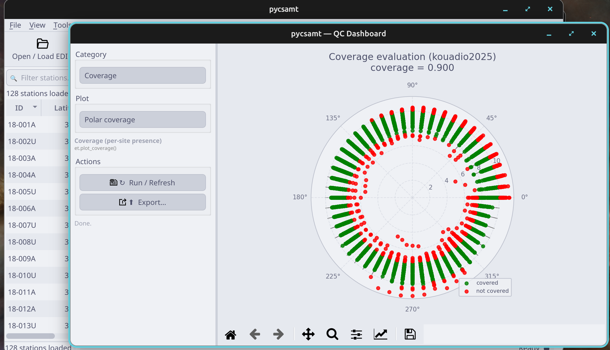

   Coverage diagnostics show whether stations and frequency bands are present
   enough to support downstream corrections and inversion preparation.

Read this figure from left to right.  First identify whether station coverage
is continuous along the profile; abrupt vertical gaps usually point to missing
or rejected bands at one station.  Then inspect the frequency or period axis;
horizontal gaps mean a band is missing across many stations and will affect
any pseudosection or inversion mesh that expects continuous sampling.  Finally,
look for isolated weak stations.  Those are candidates for station-level
review in the profile viewer before any line-wide correction is attempted.

Use the coverage figure to decide:

* whether the loaded files represent one coherent line;
* whether all expected stations are present;
* whether the usable frequency range should be narrowed;
* whether a station should be flagged before inversion preparation;
* whether a later contour, pseudosection, or depth slice is visually credible.

Do not use this figure to decide static shift by itself.  Coverage tells you
whether data exist; it does not tell you whether apparent resistivity is
shifted by near-surface structure.

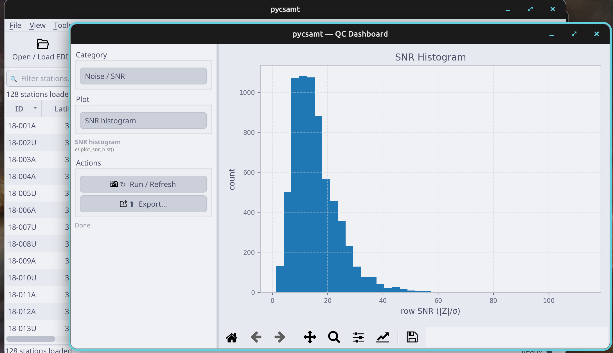

   Noise and SNR diagnostics help decide whether to drop, mask, or smooth
   frequency bands before interpreting geoelectric structure.

Read the SNR figure as a stability diagnostic.  A line-wide low-SNR band can
justify frequency editing or denoising.  A single station with poor SNR should
first be checked in the profile viewer, because the issue may be a bad station,
missing component, local cultural noise, or import problem.  Good SNR at short
periods but poor SNR at long periods often means the deep part of the model
will be weakly constrained.

Use the SNR figure to decide:

* which frequency bands can be trusted in later phase-tensor and strike plots;
* whether the noise-removal step should be station-specific or line-wide;
* whether smoothing would hide a local problem rather than fix it;
* whether inversion target bands should be reduced before input files are
  generated.

After any frequency edit or noise removal, return to this QC view.  The goal is
not to make the figure look clean at any cost; the goal is to remove bands that
would otherwise dominate later interpretation with poor-quality evidence.

Practical QC checks:

* Use coverage plots to find missing stations, missing bands, and line breaks.
* Use SNR diagnostics before noise removal; do not smooth a whole line because
  one station has a local issue.
* Use skew and dimensionality plots before assuming a 1-D, 2-D, or 3-D model.
* Use static-shift and source-effect diagnostics to decide whether correction
  is justified.
* Export figures that justify processing choices, especially for reports.

When QC Is Enough
-----------------

QC does not need to make the data perfect.  It needs to make the next decision
defensible.

.. list-table::
   :header-rows: 1
   :widths: 30 35 35

   * - Next Step
     - QC Is Enough When
     - QC Is Not Enough When
   * - Map/profile interpretation
     - Station coverage and response bands are sufficient for visual
       comparison.
     - Key stations or frequency bands are missing without explanation.
   * - Static-shift preview
     - Apparent-resistivity offsets are visible and phase behaviour suggests
       an amplitude-style issue.
     - The anomaly is only one noisy station or the phase also changes
       strongly.
   * - Noise removal
     - Low-SNR bands or stations are localized enough to target.
     - The entire survey is unstable or the source of noise is unknown.
   * - Strike/dimensionality
     - Useful periods are present and the profile is coherent enough to
       compare stations.
     - Band coverage is too sparse to support directional interpretation.
   * - Inversion preparation
     - Station selection, bands, errors, and assumptions can be written down.
     - You are still guessing which data are trustworthy.

Use this table to decide whether to proceed or return to the profile and map
viewers.  A QC figure should either open a path forward or explain why the
workflow should pause.

Data Corrections
----------------

Open **Data Corrections** when QC shows a specific problem that should be
handled before interpretation or inversion.  The correction window is
non-destructive: raw data stay available, previews are temporary, and applied
steps live in a correction stack until they are committed.

The main correction families are static shift, noise removal, source effects,
tensor rotation, coordinates, and Stratagem workflows.  For impedance data,
use **Preview** first, then **Apply** to add the result to the stack.  Use
**Before / After**, **Overlay**, **Diff**, and **2D Section** views to compare
the effect before committing.

Corrections are intentionally staged.  **Preview** lets you see the result
without changing the stack.  **Apply** records one correction step in the local
stack.  **Commit to Main** is the state change that replaces the active survey
for the rest of the desktop.  Keep those three stages separate in your mind.

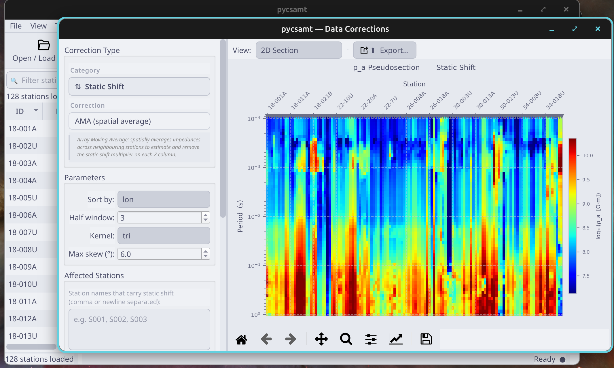

   Static-shift correction should be reviewed station by station and on a
   pseudosection before it is committed to the active survey.

This figure shows the correction window in its most important mode: a selected
correction family on the left, parameters and affected stations below it, and
before/after visual evidence on the right.  Static shift changes apparent
resistivity level without changing phase in the same way a true structural
change would.  That means the correction can be physically helpful when it is
well justified, but dangerous when it is used only to make curves line up.

Read the static-shift figure in four passes:

1. Check the selected correction method and parameters.  For AMA-style methods,
   the station half-window controls how local or smooth the correction is.
2. Compare the **Before** and **After / Preview** panels.  Corrected curves
   should reduce station-to-station offsets without erasing real lateral
   geological contrasts.
3. Switch to **Overlay** or **Diff** when the change is subtle.  Overlay shows
   shape preservation; Diff shows whether a correction is concentrated where
   you expected.
4. Use **2D Section** for static shift because pseudosections reveal whether
   the corrected profile is more coherent along the line.

Commit this correction only when the factor is finite, positive, and supported
by QC/static-shift diagnostics.  If a strongly 3-D area causes the method to
decline or return no useful factors, treat that as information rather than a
failure to force through.

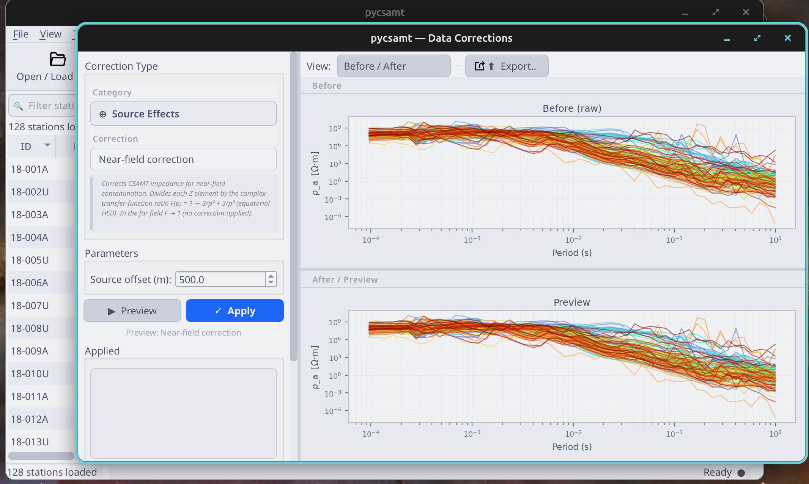

   Source-effect diagnostics are useful when response shape changes are tied
   to acquisition geometry or transmitter coupling rather than geology.

This figure belongs later in the correction logic than static shift.  Source
effects can bias CSAMT responses when transmitter geometry, near-field
behaviour, or acquisition coupling contaminates the response.  The important
visual clue is not simply that curves move; it is whether the movement follows
a physically explainable source-effect pattern rather than arbitrary smoothing.

Use this figure to check:

* whether the selected source-offset or source-effect parameters match the
  survey acquisition notes;
* whether the strongest change occurs where the source-effect diagnostic
  predicted it;
* whether phase and apparent-resistivity behaviour remain physically
  consistent after correction;
* whether the correction should be exported as a separate product rather than
  silently replacing the normal corrected EDIs.

If the acquisition geometry is uncertain, save a figure and keep the output
folder name explicit, for example ``corrected_source_effect_test``.  That makes
it clear later that the output is conditional on a source-effect assumption.

Use **Commit to Main** only after the corrected curves and sections are
credible.  Committing sends the corrected ``Sites`` object back to the main
desktop session, so the map viewer, profile viewer, QC dashboard, forward
modelling, and inversion windows will work from the corrected data.

After committing any correction, immediately re-open the profile and QC views.
The check is simple: the intended artifact should be reduced, and no new
station-order, component, or response-shape problem should appear.

Correction Decision Rules
-------------------------

Before committing a correction, write down or export enough evidence to answer
these questions:

.. list-table::
   :header-rows: 1
   :widths: 28 36 36

   * - Question
     - Good Answer
     - Warning Sign
   * - What problem is being corrected?
     - A QC or profile figure shows a specific artifact.
     - The correction is being tried because a plot "looks nicer."
   * - Which stations or bands are affected?
     - Affected stations and period/frequency ranges are visible.
     - The correction changes unexpected areas of the survey.
   * - Does phase support the interpretation?
     - Phase behaviour is consistent with the proposed correction type.
     - Phase changes suggest structure or noise rather than static shift.
   * - Is the method parameter defensible?
     - Window size, reference, rotation, or filter choice has a reason.
     - Defaults are accepted without comparing before/after evidence.
   * - What is the new data state called?
     - Output folder and notes name the correction clearly.
     - Corrected EDIs overwrite or mix with raw inputs.

When the warning signs dominate, keep the raw survey active and return to QC
or map/profile inspection.  A correction that cannot be explained should not
become the main data state.

Advanced Diagnostics
--------------------

Open **Advanced Tools** when QC indicates that the survey needs deeper
interpretation before correction or inversion.  This window collects analyses
that are useful but too specialized for the first-pass dashboard: strike
analysis, dimensionality views, topography preview, sensitivity checks, and
format conversion tools.

Advanced diagnostics are used to defend assumptions.  They should answer
questions such as: "Can I rotate to a single regional strike?", "Is a 2-D
profile assumption reasonable?", "Does topography need to be carried into the
model?", and "Is this converted data set spatially coherent?"

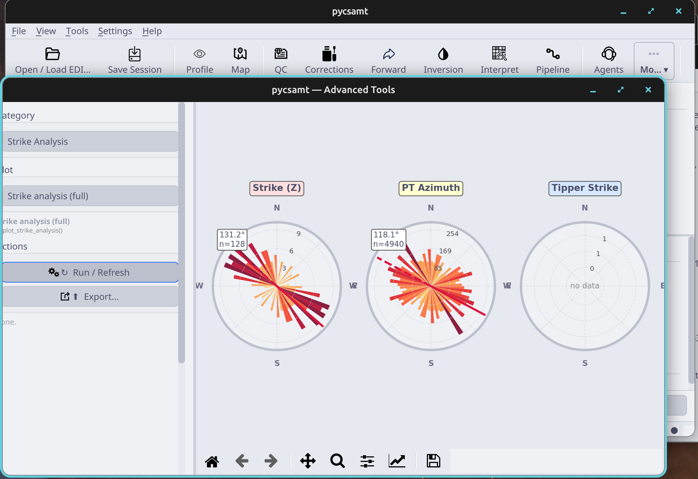

   Strike analysis compares direction estimates across stations and periods so
   a rotation angle is not chosen from a single noisy diagnostic.

The full strike-analysis figure is the high-level strike summary.  It brings
together rose-style direction statistics and stability information so you can
see whether a dominant direction is persistent or only appears in one station
or period band.  A strong strike decision should appear as a stable cluster,
not as a scattered set of unrelated azimuths.

Use this figure before tensor rotation or 2-D inversion setup.  If the strike
direction is stable over the period band that matters for the target depth,
then a rotation step can be justified.  If the strike is unstable, multi-modal,
or changes strongly along the profile, document that uncertainty and avoid
pretending that one angle is a survey-wide truth.

Questions to ask while reading it:

* Is there one dominant azimuth or several competing directions?
* Does the preferred direction persist across the useful period band?
* Are outlier stations controlling the summary?
* Does the strike agree with map-view line direction and known geology?

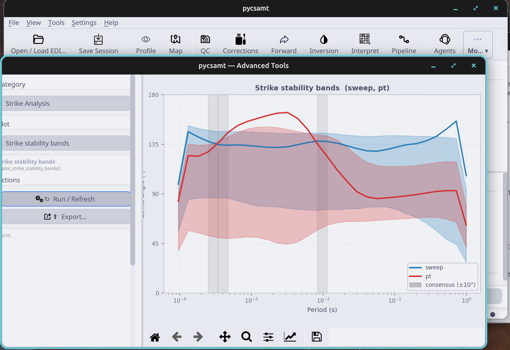

   Stability bands highlight whether a strike estimate is persistent across
   the frequency or period range used for interpretation.

The stability-band figure is more diagnostic than decorative.  It shows where
strike estimates are stable enough to trust and where they become ambiguous.
Stable bands support choosing a rotation angle for a selected period range.
Unstable bands warn you that the data may be 3-D, noisy, or affected by local
near-surface structure.

Use this figure to choose the period interval that feeds the rotation or
inversion assumption.  Do not average all periods blindly.  A shallow stable
band may support near-surface interpretation, while a deeper band may need a
different assumption or no rotation at all.

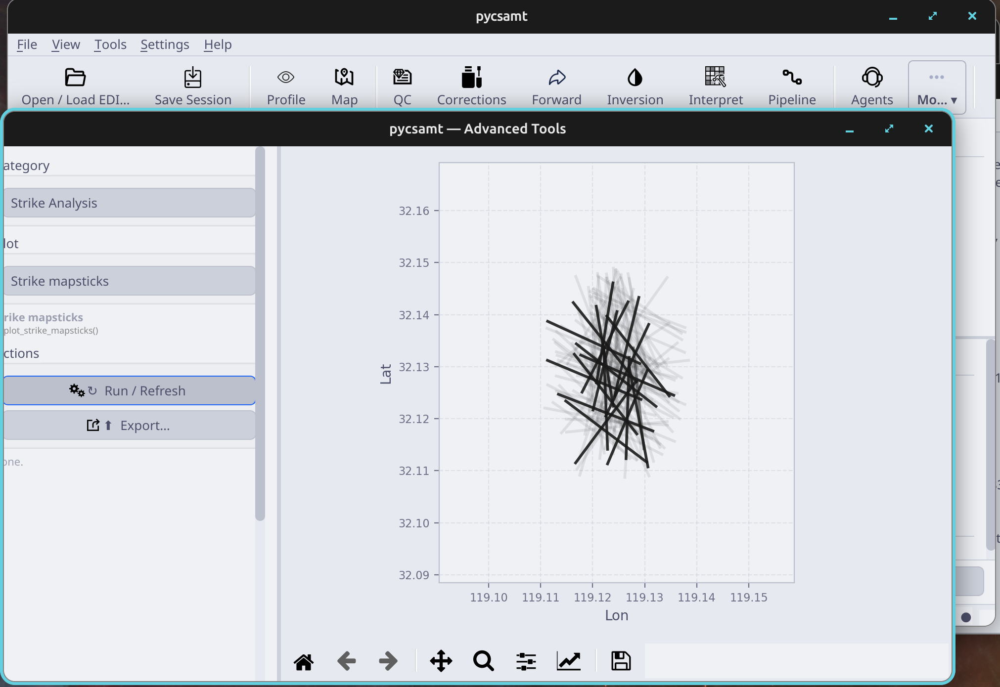

   Mapsticks make it easier to see whether station-level strike directions
   change with location along the survey line.

Mapsticks translate strike estimates into spatial context.  Each station-level
stick should be read against the station geometry and profile direction.  A
smooth spatial trend may indicate changing geology; a single station with a
very different stick may indicate a local data issue or distortion.

Use this figure when the rose summary looks plausible but you need to know
whether the direction is line-wide.  If the mapsticks rotate progressively
along the line, consider segmenting the interpretation or documenting a
spatially varying strike.  If they are random, do not use a single rotation
angle without further QC.

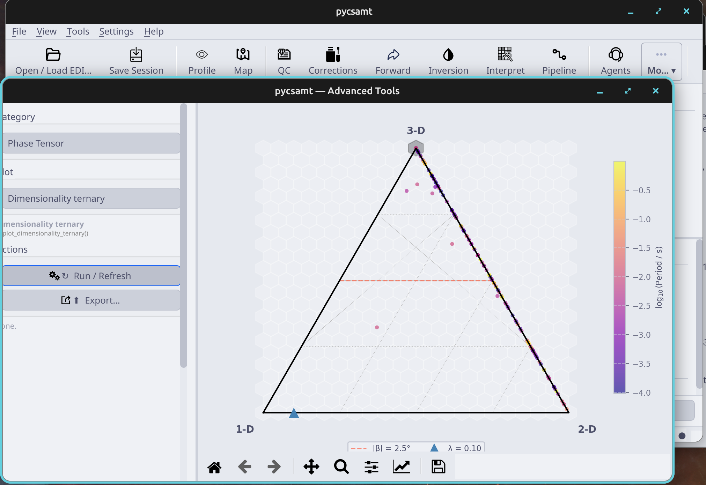

   Dimensionality diagnostics help decide whether a 1-D assumption is still
   defensible, or whether 2-D/3-D interpretation should be used.

The ternary dimensionality figure summarizes whether stations and period bands
behave more like 1-D, 2-D, or 3-D responses.  Treat it as an assumption check
before modelling.  A strong 1-D cluster supports 1-D forward tests and simple
layered inversions.  A strong 2-D signal supports profile interpretation with
strike care.  A broad or 3-D-heavy spread means the inversion and correction
strategy should be more cautious.

This figure is especially important when a smooth profile plot tempts you into
a simple model.  Smooth apparent-resistivity curves do not prove 1-D geology;
phase tensor and dimensionality diagnostics provide the stronger evidence.

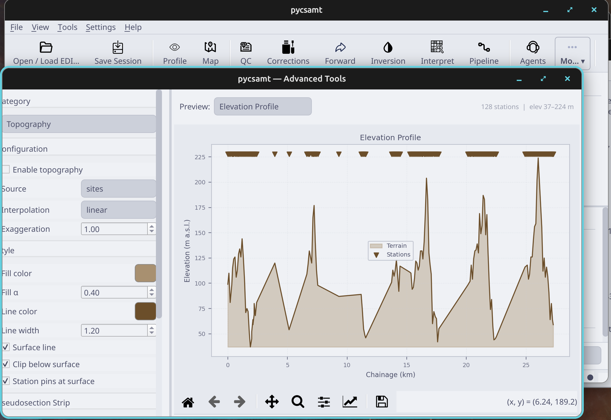

   Topography preview checks elevation and station-position information before
   those values are written into converted or corrected products.

The topography figure checks whether elevation and profile geometry are safe
to carry into conversion, forward modelling, or inversion input files.  Look
for missing elevations, unrealistic spikes, reversed station order, and
coordinate jumps.  These issues can make a physically reasonable model appear
wrong because the survey geometry is wrong.

Use topography preview before exporting converted EDIs or building inversion
inputs.  If elevation has been corrected or imported from an external source,
save the preview figure with the converted output so the geometry decision is
traceable.

Advanced Tools can also convert AVG, J, and Spectra files to EDI.  When using
conversion, preview the station profile and topography first, write EDIs to a
dedicated output folder, then reload the exported EDIs as a normal survey.

When Advanced Diagnostics Are Required
--------------------------------------

Use advanced diagnostics when a later workflow depends on an assumption that
the basic QC page cannot defend:

.. list-table::
   :header-rows: 1
   :widths: 28 36 36

   * - Assumption
     - Diagnostic Evidence Needed
     - If Evidence Is Weak
   * - One regional strike angle
     - Strike summary, stability bands, and mapsticks agree over the target
       band.
     - Avoid one survey-wide rotation or document segmented/uncertain strike.
   * - 1-D modelling is adequate
     - Dimensionality diagnostics cluster near 1-D for the relevant band.
     - Treat 1-D results as exploratory and compare with 2-D/3-D indicators.
   * - 2-D profile inversion is defensible
     - Profile geometry, phase tensor, tipper, and strike are broadly
       consistent.
     - Use cautious interpretation and document 3-D or local distortion risk.
   * - Topography should be carried forward
     - Elevation is populated, ordered, and plausible along the profile.
     - Fix metadata or exclude topography until the geometry is trustworthy.
   * - Converted EDIs are ready for processing
     - Converted station profiles and topography match the source survey.
     - Keep converted data separate and reload only after inspection.

Advanced diagnostics are not extra decoration.  They are the evidence that
turns modelling assumptions into documented choices.

Forward Modelling
-----------------

Open **Forward Modelling** when you need synthetic responses, a conceptual
starting model, or a controlled comparison before inversion.  The window has a
model builder, result tabs, and a small library/preset panel.  It supports 1-D,
2-D, and 3-D forward configurations, with 1-D model saving and geological
presets for quick starts.

Forward modelling is not the inversion result.  It is a controlled experiment:
change the model, compute the response, and learn which features of the data
could plausibly come from which resistivity structures.

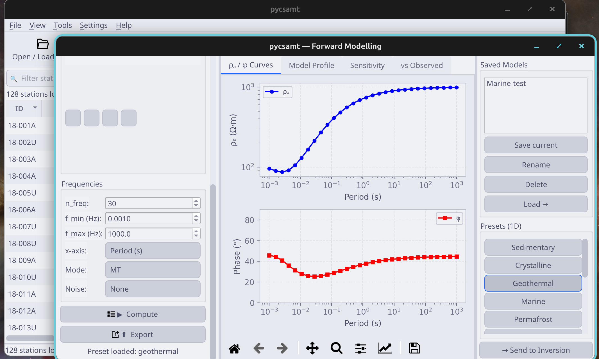

   Geological presets provide quick initial models that can be edited before
   computing synthetic responses.

This figure shows the model-builder side of the workflow.  A preset loads a
geologically plausible starting resistivity structure, but it is only a prior.
Edit the layer values, thicknesses, grid size, anomaly parameters, and
frequency sampling so the forward model matches the question you are asking.

Use presets for:

* a fast first model when the target setting is known;
* teaching the inversion window a reasonable starting structure;
* comparing how different geological scenarios change the response;
* creating a reproducible baseline before manual model edits.

Do not treat a preset name as interpretation proof.  The synthetic response
must still be compared with observed station profiles and QC constraints.

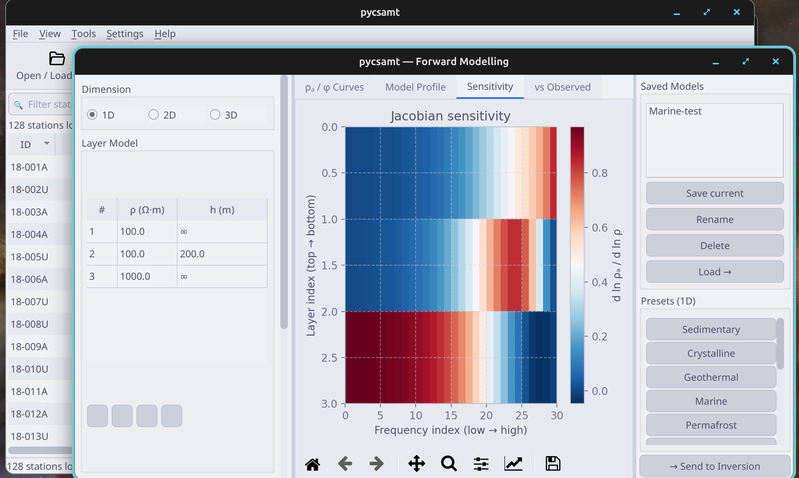

   Sensitivity views show which layers and frequencies control the response.

The 1-D sensitivity figure answers a practical question: which layers are
actually constrained by the selected frequency band?  Strong sensitivity means
the response changes when that layer changes.  Weak sensitivity means inversion
may fit the data while leaving that part of the model poorly resolved.

Use this figure before trusting deep layers.  If the frequency coverage has
little sensitivity to the depth interval of interest, the inversion may still
produce a model, but the deep structure should be reported with caution.  This
is also where QC and forward modelling meet: if SNR removed long periods, the
deep sensitivity may be reduced.

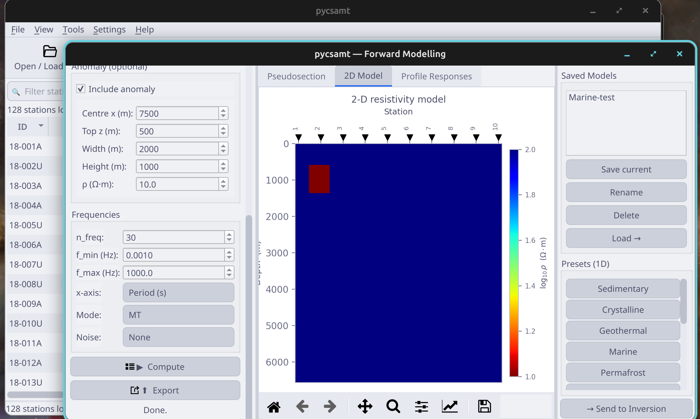

   A 2-D model view makes the geometry of background resistivity and anomalies
   explicit before response plots are interpreted.

The 2-D model figure is the physical hypothesis.  Read the axes, background
resistivity, anomaly geometry, and station placement before looking at the
response.  A synthetic response is meaningful only if the model geometry is
geologically plausible and sampled by stations in a way that resembles the
real survey.

Use this figure to check:

* whether the anomaly is inside the station aperture;
* whether padding and grid spacing are large enough for stable responses;
* whether the model depth range covers the period band being interpreted;
* whether topography or station spacing should be represented more carefully.

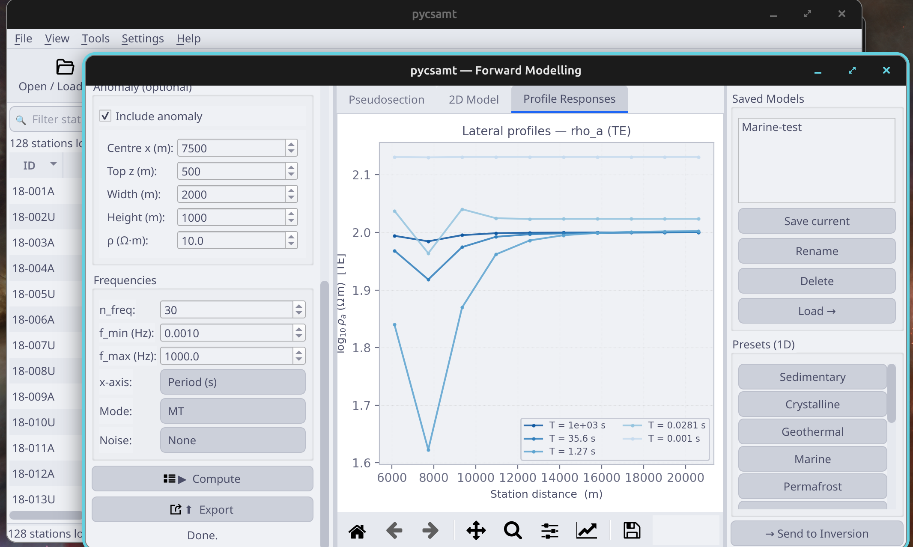

   Profile responses are useful for comparing synthetic station behaviour with
   the observed profile viewer.

The 2-D profile-response figure is the bridge between hypothesis and data.
It shows how the model would appear as station responses along the profile.
Compare broad patterns rather than forcing exact agreement: where does the
response rise or fall, where are gradients strongest, and which stations carry
the anomaly signature?

Use this figure before sending a model to inversion.  A good starting model
does not need to fit perfectly, but it should put resistive and conductive
features in reasonable places and should not contradict the strongest observed
profile trends.

Use **Send to Inversion** when the forward model should seed the inversion
panel.  The handoff carries the model parameters, and the inversion window can
load them as the starting model.

Forward Model Readiness
-----------------------

Use forward modelling when you can state the question being tested.  Examples:

* "Could a shallow conductive layer create this profile response?"
* "Which periods are sensitive to the target depth?"
* "Is this starting model reasonable before inversion?"
* "Would the station spacing see this anomaly at all?"

Do not use forward modelling to force an interpretation after QC has already
shown that the data are too weak.  A synthetic model can explain many shapes;
the useful model is the one constrained by the loaded survey, period band,
station geometry, and geological context.

Inversion Preparation
---------------------

Open **Inversion Wizard** after QC, correction, and strike decisions are
stable.  The desktop inversion panel includes traditional engines such as
Occam2D, ModEM, and MARE2DEM, plus AI inversion modes for supported
dimensions.  External solver binaries are optional paths; pyCSAMT can still
build input files in the selected working directory.

The inversion window is where earlier uncertainty becomes configuration.  A
poor QC decision becomes a bad frequency band.  An uncertain strike decision
becomes a questionable rotation.  An undocumented static-shift correction
becomes an output that cannot be audited.  Use the window only after those
choices are visible in saved figures or notes.

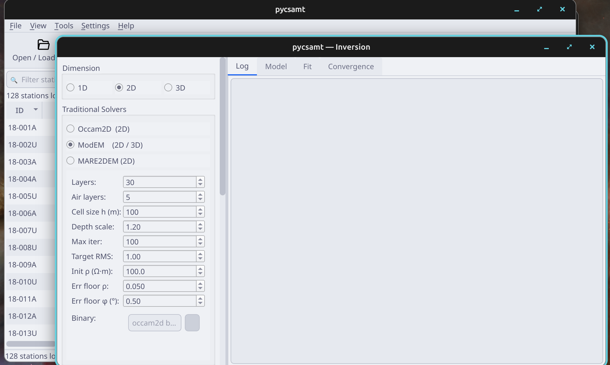

   The inversion window collects engine choice, dimensionality, starting model,
   data options, output directory, and run logs in one place.

Read this figure as a checklist, not just a launch screen.  The left side of
the inversion panel controls the scientific setup: dimensionality, engine,
starting model, and solver-specific parameters.  The working directory and log
area define the reproducibility boundary: every generated input file, solver
log, and result should belong to one named run folder.

Use the inversion figure to verify:

* **Engine** -- Occam2D, ModEM, MARE2DEM, or AI inversion matches the data
  assumption and available solver environment.
* **Dimension** -- the selected dimension is supported by QC, strike, and
  dimensionality diagnostics.
* **Starting model** -- the model is imported from Forward Modelling or built
  intentionally, not accepted by accident.
* **Workdir** -- the folder name identifies survey line, data state, engine,
  and run attempt.
* **Logs** -- input-building messages are read before a long solver run starts.

For traditional external solvers, building input files successfully is a useful
milestone even if the binary is not run immediately.  Review those files before
committing compute time to an inversion.

Before pressing **Run**, check:

* the active survey is the intended raw or corrected data set;
* the working directory is specific to this run;
* the dimensionality matches QC and strike diagnostics;
* the starting model is documented or imported from Forward Modelling;
* external binary paths are set for solver runs that need them;
* generated input files are reviewed before long external inversions.

Ready For Inversion Checklist
-----------------------------

The desktop data state is ready for inversion preparation when:

* the active survey state is named: raw, corrected, recomputed, or pipeline
  output;
* station selection is intentional and matches the profile being modelled;
* frequency or period bands were chosen from QC evidence;
* static shift, noise removal, and rotation choices are documented;
* dimensionality and strike assumptions are supported or explicitly marked
  uncertain;
* topography and coordinates have been checked;
* starting model or prior is documented;
* the working directory is unique for this run attempt;
* generated input files can be inspected before solver execution.

If one item is missing, the inversion panel can still build files, but the run
will be harder to audit.  Fix the missing evidence before spending compute
time or sharing the result.

Processing Pipeline
-------------------

Use **Processing Pipeline** after the manual workflow is understood.  The
pipeline is for repeatability: it applies a known sequence with saved
parameters, logs each step, previews diagnostics, and can export the final EDI
collection.

The pipeline is not the place to discover the right processing choices for the
first time.  Use the manual panels to learn what a survey needs; then encode
those choices into the pipeline so the same line, or a similar line, can be
processed consistently.

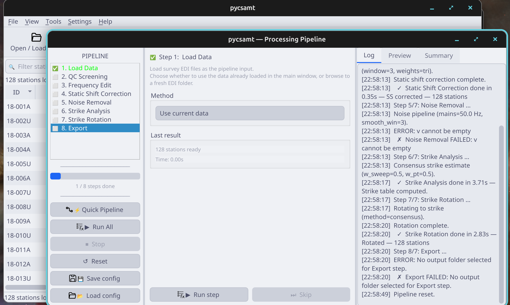

   The pipeline window uses a stepper on the left, method and parameter
   controls in the centre, and log/preview/summary tabs on the right.

This figure has three functional regions.  The left stepper tells you where
the run is in the eight-step chain and whether each step is pending, running,
done, skipped, or errored.  The centre panel is the contract for the selected
step: method choice plus parameters.  The right tabs are the evidence trail:
the log records what happened, the preview shows a diagnostic for the selected
step, and the summary captures the final status.

Read the pipeline figure before pressing **Run All**:

* If step 1 is **Use current data**, confirm the main window is showing the
  intended raw or corrected survey.
* If a step is skipped, write down why it is skipped.  A skipped rotation is a
  scientific decision when strike is unstable.
* If a step has parameters, compare them with the manual correction or QC
  settings that were already tested.
* If a preview plot looks worse than the manual result, stop and run that step
  alone with adjusted parameters.
* If export is the final step, choose a new output folder for that pipeline
  attempt.

The pipeline gives you repeatability, but it also multiplies mistakes quickly.
Run one step at a time while tuning, then use **Run All** only when the chain
has already produced acceptable intermediate diagnostics.

The built-in sequence is:

1. **Load Data** -- use the current survey or browse to an EDI folder.
2. **QC Screening** -- flag or drop low-confidence frequencies.
3. **Frequency Edit** -- edit, close gaps, or regrid frequency bands.
4. **Static Shift Correction** -- apply AMA, LOESS, bilateral, or reference
   median correction.
5. **Noise Removal** -- run automatic filtering, EMAP, or robust PCA denoising.
6. **Strike Analysis** -- estimate regional strike by consensus, phase tensor,
   or sweep methods.
7. **Strike Rotation** -- rotate tensors to strike or intentionally skip.
8. **Export** -- write processed EDI files to the chosen output folder.

Run a single step when tuning parameters.  Use **Quick Pipeline** only after
the default choices are acceptable for that survey family.  Save the pipeline
configuration beside the exported EDIs so the processing can be reproduced.

Suggested pipeline naming:

.. code-block:: text

   pipeline/
     L30_raw_to_qc_ss_rotate_2026-07-02.json
     L30_raw_to_qc_ss_rotate_2026-07-02.log
     exported_edi/

The name should describe the input state and the main processing choices.  A
generic name such as ``run1`` is hard to audit later.

When To Use The Pipeline
------------------------

Use the pipeline for repeatability, not discovery:

.. list-table::
   :header-rows: 1
   :widths: 32 34 34

   * - Use Pipeline When
     - Avoid Pipeline When
     - Safer Alternative
   * - The same choices need to be repeated for several lines.
     - You have not manually checked the first line yet.
     - Run map/profile/QC/correction panels by hand first.
   * - Parameters are already justified by figures.
     - Defaults are being used because they are convenient.
     - Tune one step at a time and compare previews.
   * - You need JSON and logs for reproducibility.
     - You only need a quick visual inspection.
     - Export figures and notes instead of processed EDIs.
   * - A processed EDI set must be regenerated later.
     - Raw and corrected states are mixed or unclear.
     - Reload the intended input state before running the pipeline.

When a pipeline result differs from the manual result, trust neither
automatically.  Compare logs, parameters, active input state, and preview
figures until the difference is understood.

Agent-Assisted Review
---------------------

The desktop agent panels can help explain QC or inversion results after the
scientific checks are visible.  Use them as a review layer, not as a
replacement for diagnostic plots.

Agent review is most useful after figures exist.  Ask the agent to summarize
patterns, compare diagnostics, or explain why a workflow step might be risky.
Do not ask it to decide corrections without the QC and profile evidence open.

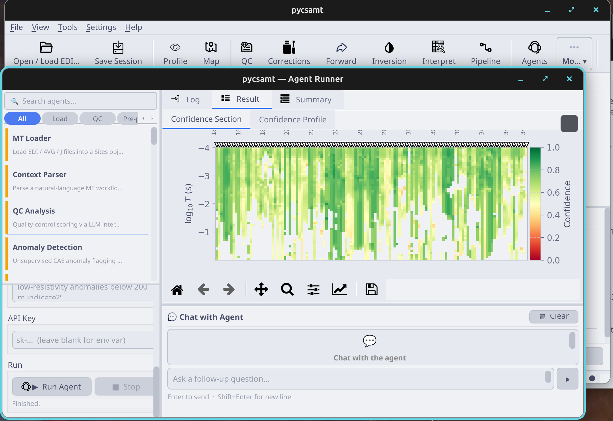

   Confidence summaries are useful for documenting which stations or bands need
   closer review.

The confidence figure is a triage view.  It helps identify which stations,
frequency bands, or workflow areas deserve human attention.  High confidence
does not prove a model is correct; it means the available checks agree more
strongly.  Low confidence should trigger a return to QC, profile, map, or
correction views.

Use this figure to write review notes:

* which stations need inspection;
* which bands were weak or removed;
* which correction assumptions were strong or uncertain;
* which later inversion decisions should be treated cautiously.

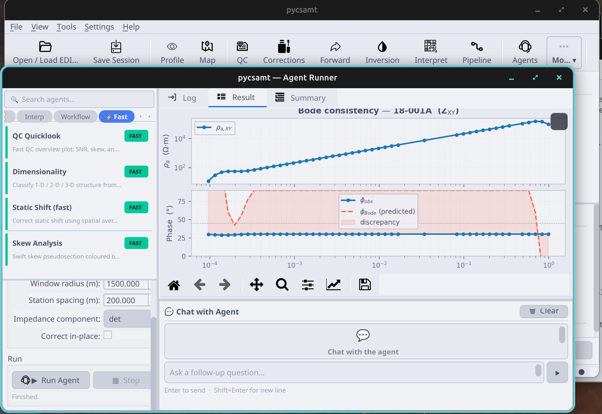

   Consistency checks should be compared with the profile and QC windows before
   changing data or inversion settings.

The Bode-consistency figure checks whether apparent resistivity and phase
behaviour are mutually plausible.  It is a useful warning system for component
issues, noisy bands, or responses that need station-level review.  Treat it as
an explanation aid: when it flags a station, go back to the profile viewer and
look at the underlying curves.

Do not apply a correction only because an agent panel marks a concern.  Use
the concern to navigate to the relevant diagnostic, then make the processing
decision from the data view.

Outputs And Reproducibility
---------------------------

Keep each processing attempt in its own output folder.  A practical layout is:

* ``raw/`` for untouched source EDI files;
* ``qc/`` for first-pass figures and tables;
* ``corrected_edi/`` for committed correction outputs;
* ``pipeline/`` for saved pipeline JSON, logs, and final EDIs;
* ``forward/`` for synthetic models and exported figures;
* ``inversion/<run_name>/`` for solver input files, logs, and results;
* ``session/`` for the saved desktop session file.

The important rule is simple: every exported data product should have the
figures and parameters that explain how it was produced.

For each processing stage, save one evidence figure and one machine-readable
configuration when available:

.. list-table::
   :header-rows: 1
   :widths: 22 39 39

   * - Stage
     - Save
     - Why It Matters
   * - QC
     - Coverage, SNR, skew/dimensionality figures
     - Shows which data were trusted or rejected.
   * - Corrections
     - Before/after or diff figures plus corrected EDIs
     - Proves what changed before the active survey was replaced.
   * - Advanced diagnostics
     - Strike, dimensionality, and topography figures
     - Documents rotation, model dimension, and geometry assumptions.
   * - Forward modelling
     - Model plots, responses, and starting-model parameters
     - Explains the prior used for inversion.
   * - Inversion
     - Input files, run logs, result figures
     - Makes the solver run auditable and repeatable.
   * - Pipeline
     - Pipeline JSON, log, preview/summary figures
     - Recreates the exact automated processing chain.

When a result is shared, the output folder should let another user reconstruct
the chain without relying on memory or screenshots alone.
