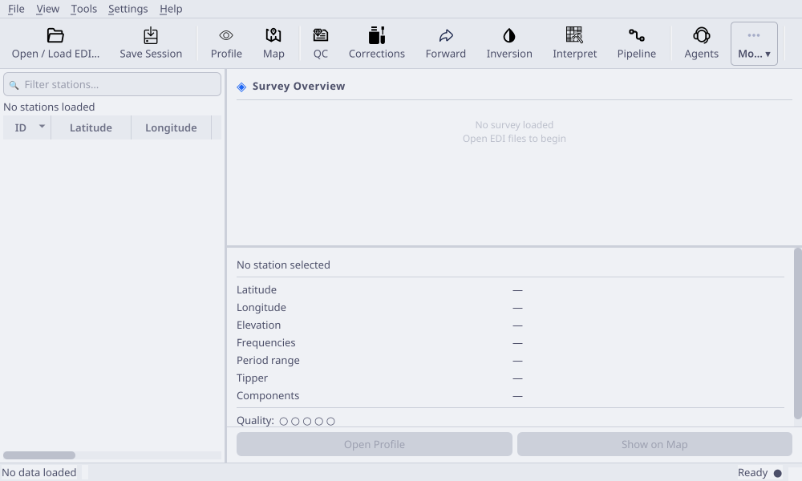

.. _applications-desktop-workspace:

Workspace And Navigation
========================

The pyCSAMT desktop workspace is deliberately lean.  The main window keeps the
loaded survey visible, while maps, profiles, QC, corrections, modelling, and
agents open as independent panel windows.  This lets you keep the station list
anchored on one screen and move the scientific views around it.

Why The Workspace Is Split Into Panels
--------------------------------------

Desktop processing is an evidence-building workflow.  A user often needs to
compare a station table, a response curve, a map, a QC metric, and a
correction preview before deciding what to do.  Separate panels make that
comparison possible without forcing every view into one crowded tab stack.

The main window should remain the reference point for the active survey:

* it shows which station is selected;
* it exposes the current data-state label;
* it records messages in the log dock;
* it keeps the toolbar and menus available while scientific panels are open.

Use the floating panels as working views around that reference point.  When a
plot looks surprising, return to the station list, detail card, status bar,
and log before changing the data state.

   The main workspace is the command centre: toolbar at the top, station list
   on the left, survey and station summaries on the right, and a compact log
   dock at the bottom.

Main Window Regions
-------------------

The main window has four persistent regions:

* **Toolbar** -- one-click access to loading, saving, viewers, processing, and
  export tools.
* **Station list** -- searchable table of loaded stations.
* **Survey overview and station detail** -- summary cards for the whole line
  and the currently selected station.
* **Log and status areas** -- loading messages, processing messages, progress,
  and the current data-state label.

The main window owns the active survey.  When data are loaded or replaced by a
committed correction, the station list and open panel windows are refreshed
from that active survey.

Orientation After Loading
-------------------------

After a survey loads, pause for a short orientation pass before opening many
tools.  The goal is to answer, "What data state am I looking at right now?"

1. Read the status bar and confirm that data are loaded.
2. Check the survey overview for station count, frequency range, and basic
   metadata.
3. Select one station and read the station detail card.
4. Open **Profile** for that station and confirm curves render.
5. Open **Map** and confirm the station cloud is plausible.
6. Return to the main window and save the session if the workspace is arranged
   correctly.

This small habit prevents a common desktop mistake: interpreting a map,
profile, or QC figure without being sure whether the active survey is raw,
corrected, recomputed, or reloaded from a different folder.

Station List
------------

The station list is the primary navigation surface after loading EDI files.
Use the search field above the table to filter station IDs while keeping the
loaded survey unchanged.  Selecting a station updates the detail card and also
notifies open profile/map windows.

Normal station-list workflow:

1. Load one survey line or a focused folder of EDI files.
2. Use the search field to isolate a station or station prefix.
3. Select a row to inspect its metadata in the detail card.
4. Open **Profile** or **Map** from the toolbar to inspect the selected station
   in context.
5. Clear the search text before checking line-wide coverage or profile trends.

Filtering is only a view operation.  It does not remove stations from the
active ``Sites`` object and it does not affect export or processing windows.

Use the station list for navigation, not data editing.  If a station needs to
be removed, flagged, corrected, or excluded from inversion, make that decision
in the relevant QC, correction, pipeline, or inversion workflow so the choice
is recorded.  A search filter only changes what is visible on screen.

Survey Overview
---------------

The survey overview card summarizes the loaded data set.  Use it immediately
after loading to confirm that the number of stations, file set, and frequency
coverage look plausible before opening heavier processing tools.

If the overview does not match the line you intended to load, stop and reload
the data.  It is better to fix a folder-selection mistake before QC, maps, or
corrections start producing convincing figures from the wrong input.

Use the overview as a gate before deeper work:

* station count should match the expected line or selected folder;
* frequency coverage should be plausible for the method and instrument;
* coordinate ranges should not imply a misplaced station or wrong hemisphere;
* tipper availability should match the processing or inversion plan;
* the active data-state label should match what you believe is loaded.

Do not start a correction workflow simply because the controls are available.
Start it after the overview and first plots show a specific problem that a
correction can address.

Station Detail Card
-------------------

The station detail card shows metadata for the selected station.  It is the
fastest way to check whether a row has the expected station ID, coordinates,
elevation, and data availability.

Use the detail card before opening a station-specific profile:

* confirm the station name and location;
* check that coordinates and elevation are populated;
* use the profile action to jump directly into the profile viewer;
* compare neighbouring stations when a response curve looks unusual.

When a station looks suspicious, do not decide from the detail card alone.
Use it as a pointer into the profile, map, and QC windows.  The detail card
answers "which station is this?" while the scientific panels answer "what does
this station mean in context?"

Panel Windows
-------------

Most scientific tools are independent floating windows.  Opening a tool from
the toolbar or **View** menu shows the same persistent window; closing a panel
normally hides it and preserves its geometry for the session.

Core panel windows:

.. list-table::
   :header-rows: 1
   :widths: 22 34 44

   * - Panel
     - Opens From
     - Use It For
   * - **Profile**
     - Toolbar, **View > Profile Viewer**, ``Ctrl+P``
     - Station curves, pseudosections, phase tensors, and profile sections.
   * - **Map**
     - Toolbar, **View > Map Viewer**, ``Ctrl+M``
     - Station geometry, contours, map editing, and spatial context.
   * - **QC**
     - Toolbar, **View > QC Dashboard**, ``Ctrl+Q``
     - Coverage, SNR, skew, dimensionality, static-shift, and distortion checks.
   * - **Corrections**
     - Toolbar, **View > Data Corrections**, ``Ctrl+R``
     - Previewing, stacking, and committing data corrections.
   * - **Forward**
     - Toolbar, **View > Forward Modelling**, ``Ctrl+F``
     - 1-D/2-D/3-D synthetic models and inversion starting models.
   * - **Inversion**
     - Toolbar, **View > Inversion Wizard**, ``Ctrl+I``
     - Solver setup, input-file generation, AI inversion, and run logs.
   * - **Interpret**
     - Toolbar, **View > Interpretation Studio**, ``Ctrl+Shift+I``
     - Interpreting inversion results and exporting interpretation products.
   * - **Pipeline**
     - Toolbar, **View > Processing Pipeline**, ``Ctrl+Shift+P``
     - Repeatable load/QC/edit/correct/rotate/export processing chains.
   * - **Agents**
     - Toolbar, **View > Agent Master**, ``Ctrl+Shift+A``
     - Agent-assisted review, explanations, and guided workflow checks.

The **More** toolbar menu contains secondary tools such as **TDEM Analysis**,
**Advanced Tools**, and **Export Figure**.  The same tools are also available
from the menu bar.

Secondary And Advanced Tools
----------------------------

The **More** and **Tools** menus contain specialized actions that are useful
after the basic survey state is understood:

.. list-table::
   :header-rows: 1
   :widths: 28 32 40

   * - Tool
     - Shortcut
     - Use It When
   * - **TDEM Analysis**
     - ``Ctrl+T``
     - You are working with time-domain EM data or comparing TDEM-style
       diagnostics.
   * - **Advanced Tools**
     - ``Ctrl+Shift+T``
     - You need strike, dimensionality, topography, conversion, or deeper
       diagnostic workflows.
   * - **Data Quality Checklist**
     - ``Ctrl+Shift+V``
     - You want a station-level validation pass before processing.
   * - **Recompute EDIs**
     - ``Ctrl+Shift+X``
     - You need to write a transformed EDI set after a documented rotation,
       frequency trim, or recomputation.
   * - **Format Converter**
     - ``Ctrl+Shift+C``
     - You need EDI, CSV, or JSON exports from the active survey.
   * - **Batch Export Plots**
     - ``Ctrl+Shift+E``
     - You want to save all open matplotlib figures after a review pass.
   * - **Coordinate Converter**
     - ``Ctrl+Shift+G``
     - You need to convert between UTM and latitude/longitude coordinates.

Treat these tools as task-specific workbenches.  They are powerful, but they
should usually come after loading, station review, map/profile inspection, and
first-pass QC.

Suggested Panel Combinations
----------------------------

The desktop is most useful when related panels are open together:

.. list-table::
   :header-rows: 1
   :widths: 26 36 38

   * - Goal
     - Open Panels
     - What To Compare
   * - Check a newly loaded line
     - Main window, Profile, Map
     - Station order, coordinate sanity, response continuity, and obvious
       missing metadata.
   * - Review noisy stations
     - Main window, Profile, QC
     - Frequency coverage, response shape, QC flags, and neighbouring station
       behaviour.
   * - Decide on a correction
     - Profile, Map, QC, Corrections
     - Before/after curves, spatial consistency, metric improvement, and
       whether the change is physically reasonable.
   * - Prepare inversion input
     - Profile, Map, QC, Inversion, Export
     - Selected stations, modes, errors, frequency bands, geometry, and
       destination folders.
   * - Build a report figure
     - Profile or Map, Export, Log
     - Figure settings, active data state, output path, and processing notes.

This pattern helps users explain why a step was taken.  A correction or export
is easier to defend when the supporting plots and metrics were visible at the
same time.

Toolbar And Menus
-----------------

The toolbar is optimized for the normal survey workflow:

1. **Open** and **Save** manage the survey session.
2. **Profile** and **Map** inspect loaded data.
3. **QC** and **Corrections** diagnose and condition the data.
4. **Forward**, **Inversion**, and **Interpret** move from modelling to
   interpretation.
5. **Pipeline** repeats a known processing chain.
6. **Agents** opens the conversational workflow layer.
7. **More** exposes secondary tools and figure export.
8. **Theme** toggles dark and light appearances.

The menu bar mirrors these actions and adds recent files, preferences, help,
documentation, GitHub, and about dialogs.  If a toolbar button is hidden by a
small screen, use the menu bar as the complete command list.

Read Toolbar Actions As Workflow Stages
---------------------------------------

The toolbar order follows the intended desktop rhythm:

.. code-block:: text

   open -> inspect -> diagnose -> correct -> model -> invert -> interpret
        -> automate -> explain -> export

This does not mean every survey needs every stage.  It means the left side of
the toolbar is generally safer and more observational, while the later tools
are more likely to change data state, create output folders, or encode
scientific assumptions.  When in doubt, move left in the toolbar: inspect the
station table, map, profile, and QC before using a state-changing action.

Log Dock And Status Bar
-----------------------

The log dock is the compact message area at the bottom of the main window.  It
records load events, session saves, errors, and messages emitted by workflows.
Use **View > Log** to hide or restore it.

The status bar provides the fastest state check:

* the left label reports whether data are loaded, corrected, or converted;
* the frequency label shows frequency-range context when available;
* the progress bar appears while background loading or processing is running;
* the readiness label changes when loading or errors occur;
* short status messages appear temporarily after actions such as saving.

When something looks wrong, read the status bar first and then the log dock.
Most load failures and missing-data messages are visible there before they are
visible in a plot.

Status And Log Interpretation
-----------------------------

Use this quick interpretation guide while working:

.. list-table::
   :header-rows: 1
   :widths: 26 36 38

   * - Message Area
     - What To Look For
     - User Action
   * - Status data-state label
     - Whether the active survey is loaded, corrected, converted, or empty.
     - Confirm the state before exporting, correcting, or preparing inversion.
   * - Frequency label
     - Current frequency or period context when a survey exposes it.
     - Check it before comparing plots that depend on frequency range.
   * - Progress bar
     - Background loading, processing, export, or solver preparation.
     - Wait for completion before trusting downstream panels.
   * - Log dock
     - File paths, warnings, skipped files, errors, and session events.
     - Read it after failed loads, blank plots, correction issues, or exports.
   * - Panel-specific log tabs
     - Pipeline, inversion, and agent messages for a single workflow.
     - Use them with the main log to reconstruct what happened.

Do not ignore warnings because a figure still appeared.  A plot can render
from incomplete data.  The log explains whether files were skipped, defaults
were used, or a workflow silently fell back to a simpler path.

Recent Files
------------

Use **File > Recent Files** to reload one of the last opened inputs.  Recent
files are stored in the desktop session and capped by the ``max_recent_files``
preference.  Choosing a recent entry starts the normal loading path, so open
panels refresh the same way they do after a manual file selection.

Theme And Preferences
---------------------

Use the theme button on the toolbar, or **View > Theme**, to switch between
dark and light mode.  The selected theme is saved in the desktop session and
is reapplied on the next launch.

Open **File > Preferences...** for persistent application settings such as
solver paths, default inversion working directory, logging level, map tile
provider, API key storage, and recent-file limits.

Preferences That Affect Scientific Work
---------------------------------------

Some preferences are cosmetic, but others affect reproducibility and workflow
behaviour:

.. list-table::
   :header-rows: 1
   :widths: 28 34 38

   * - Preference
     - Why It Matters
     - Good Habit
   * - Solver paths
     - External engines cannot run unless their binaries are configured.
     - Set them before starting a long inversion session.
   * - Default inversion work directory
     - Determines where generated input files and logs are written.
     - Use a project-specific folder, not a temporary directory.
   * - Logging level
     - Controls how much detail appears when workflows run.
     - Use a more verbose level when debugging loading or solver issues.
   * - Map tile provider
     - Affects basemap context in map views.
     - Keep station geometry interpretable even when tiles are unavailable.
   * - Recent-file limit
     - Controls how much past loading history appears.
     - Use recent files for convenience, but reload folders for final work.
   * - API key storage
     - Supports agent or provider-backed workflows when configured.
     - Treat stored keys as local machine settings, not project files.

Saved Session State
-------------------

The desktop stores its session at ``~/.pycsamt/session.json``.  The file is
written when you save the session and when the application closes normally.

The session remembers:

* selected theme;
* recent files and last data directory;
* selected station;
* preferred frequency range and map overlay;
* main-window geometry and dock state;
* floating-panel geometries;
* solver paths and default inversion work directory;
* logging, map-tile, API-key, and recent-file preferences.

The session does not replace exported project files.  Save corrected EDIs,
pipeline JSON, figures, inversion inputs, and reports into the project output
folders described in :doc:`processing_workflows`.

Workspace Habits
----------------

For steady desktop work:

* keep the main window visible as the station and state reference;
* open profile and map viewers before processing windows;
* keep the log dock visible during loading, correction, inversion, and export;
* save the session after arranging panel windows on a multi-monitor setup;
* reload from exported EDIs when you need to verify a corrected data product;
* use one survey line per session when preparing inversion inputs.

This workspace style keeps inspection, processing, and export decisions tied
to the same active survey instead of scattering state across disconnected
windows.
