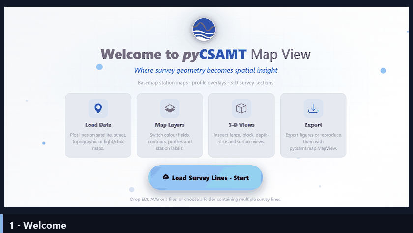

.. _applications-mapview:

MapView
=======

MapView is the dedicated map workbench of pyCSAMT: a Dash/Plotly browser
application focused entirely on **seeing a survey in space** — basemap station
maps, profile overlays, Surfer-style contours, and interactive 3-D resistivity
scenes with fence sections, blocks, depth slices, iso-surfaces, and draped
topography.  It is the point-and-click layer over the :doc:`Python mapping API
</user_guide/map/index>`: everything the app draws comes from the same
:class:`~pycsamt.map.MapView` façade you can drive from code, so a scene you
build here can be reproduced exactly in a script.

   An animated tour of MapView: from the welcome screen to a survey on a
   basemap, Surfer-style contours, interactive 3-D fence and block scenes,
   isolating conductive structure, and an imported ModEM inversion model.
   Each control is documented on the pages below.

Explore the Guide
-----------------

Pick a page to dive in.  A good first pass, in order, is **Installation →
Loading & Sessions → Views & Controls → Exports → Troubleshooting**.

.. grid:: 1 1 2 3
   :gutter: 3
   :class-container: cta-tiles

   .. grid-item-card:: Installation
      :link: installation
      :link-type: doc
      :img-top: ../../_static/icons/launch.svg
      :class-card: pycsamt-card sd-text-center

      Install the ``app`` extra, launch ``pycsamt-mapview``, and learn the
      host/port/data/debug options.

   .. grid-item-card:: Loading & Sessions
      :link: loading_and_sessions
      :link-type: doc
      :img-top: ../../_static/icons/loading.svg
      :class-card: pycsamt-card sd-text-center

      Load EDI survey lines, import ModEM inversion results, and the per-tab
      session cache.

   .. grid-item-card:: Views & Controls
      :link: views
      :link-type: doc
      :img-top: ../../_static/icons/map-and-profile.svg
      :class-card: pycsamt-card sd-text-center

      The Map and 3-D views and every control in the inspector — basemaps,
      contours, fence/block/depth/iso.

   .. grid-item-card:: Exports
      :link: exports
      :link-type: doc
      :img-top: ../../_static/icons/export.svg
      :class-card: pycsamt-card sd-text-center

      Export the current view as interactive HTML, or reproduce it from code
      with ``pycsamt.map``.

   .. grid-item-card:: Troubleshooting
      :link: troubleshooting
      :link-type: doc
      :img-top: ../../_static/icons/troubleshoot.svg
      :class-card: pycsamt-card sd-text-center

      Ports, blank 3-D scenes, coordinate systems, and large-survey
      performance.

When To Use MapView
-------------------

MapView is the right surface when the **spatial picture** is the point:

* place a multi-line survey on a satellite, street, topographic, or light/dark
  basemap and confirm its geometry;
* colour stations by index, elevation, apparent resistivity, phase, or skin
  depth, and drape a Surfer-style contour over the basemap;
* build an interactive 3-D scene — fence panels along each line, a filled
  block, depth slices, or iso-surfaces — with topography and a resistivity
  visibility band to isolate conductive or resistive structure;
* drop a ModEM 3-D **inversion result** into the same scene as the survey
  geometry and inspect the model in place.

For per-station response curves, pseudosections, QC, corrections, and
modelling, use the :doc:`web app <../web/index>` or the :doc:`desktop GUI
<../desktop/index>`.  MapView deliberately does one thing — space — and does it
well.

The Two Views
-------------

Everything in MapView lives under **two views**, switched from the left rail:

* **Map** — the 2-D basemap view: stations, profile lines, contour overlay,
  basemap, and coordinate system.
* **3-D** — the interactive resistivity scene: fence, block, depth-slice, and
  iso-surface renderings with topography and depth/resistivity filters.

Both views read the same loaded survey and the same line selection, so
switching between them never changes *what* is selected — only how it is drawn.

Run MapView
-----------

.. code-block:: bash

   pycsamt-mapview

The launcher starts a local Dash server on ``http://127.0.0.1:8770`` and opens
the app in the default browser.  The module form works everywhere the package
is importable:

.. code-block:: bash

   python -m pycsamt.app.mapview

Useful launch options:

.. code-block:: bash

   pycsamt-mapview --no-browser
   pycsamt-mapview --port 8780
   pycsamt-mapview --host 0.0.0.0
   pycsamt-mapview --data path/to/edi_folder
   pycsamt-mapview --debug

``--data`` preloads an EDI folder (one or more survey lines) so the app opens
with the survey already on the map.  See :doc:`installation` for the full
option list.

Main Concepts
-------------

.. list-table::
   :header-rows: 1
   :widths: 24 76

   * - Concept
     - Meaning In MapView
   * - Survey lines
     - Named groups of stations (one folder or filename prefix per line),
       toggled from the line picker; the selection applies to both views.
   * - View
     - **Map** (2-D) or **3-D** — the two ways MapView draws the same survey.
   * - Colour field / overlay
     - The quantity drawn on the map: station index, elevation, apparent
       resistivity, phase, or skin depth.
   * - Contour overlay
     - A Surfer-style filled/line contour draped over the basemap.
   * - 3-D mode
     - Fence, Block, Depth slices, or Iso-surface — how the 3-D scene renders
       the resistivity volume.
   * - Resistivity band
     - A ρ visibility window that isolates the conductive or resistive part of
       the 3-D volume.
   * - Inversion result
     - A ModEM 3-D model folder imported and shown in the survey's own scene.
   * - Session cache
     - Loaded data held per browser tab on the server; the app never writes
       into your data folders.

.. toctree::
   :maxdepth: 1
   :hidden:

   installation
   loading_and_sessions
   views
   exports
   troubleshooting

.. seealso::

   :doc:`/user_guide/map/index`
       The Python mapping layer behind the app — build the same figures
       from code.

   :ref:`3-D maps gallery <sphx_glr_examples_map_3d>`
       Executed examples of every station-map and 3-D view, with code.
