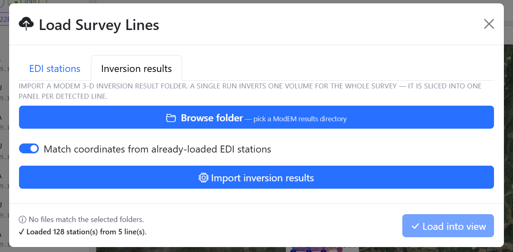
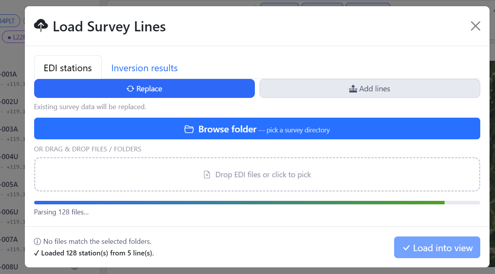

.. _applications-mapview-loading:

Loading Data And Sessions
=========================

MapView reads the same inputs as the rest of pyCSAMT — folders of EDI station
files — plus backend-neutral PCSF inversion results that it can place in the
same scene as the stations that produced them.  Everything is loaded through
one dialog with two tabs.

Open the loader from the welcome screen's **Load Survey Lines - Start** button
or the **Load lines** button on the top bar.  The dialog opens on the
**Inversion results** tab by default; switch to **EDI stations** for station
files.

Inversion Results
------------------

   The **Inversion results** tab imports a backend-neutral PCSF/PCSM result;
   candidates found are labelled by geometry kind, and only the ones this
   view can build a curtain from are selectable.

The **Inversion results** tab imports model output — a ``.pcsf``, ``.pcsm``,
or gzip-compressed ``.pcsm.gz`` file (pyCSAMT's backend-neutral PCSF format,
see :doc:`/user_guide/models/pcsf_format`) — so you can inspect resistivity
structure in the same scene as the survey geometry:

* **Browse folder** to scan a directory for ``.pcsf``/``.pcsm``/``.pcsm.gz``
  files, or drop/browse the file(s) directly onto the box below it — either
  way, every match found is listed, each labelled with its geometry kind;
* every real PCSF geometry kind is selectable and auto-picked when there is
  exactly one candidate: ``grid2d`` (Occam2D), ``multiline`` (a stitched fence
  of profiles), native ``grid3d`` (ModEM 3-D, nearest-cell sampled the same
  way a live ModEM folder is), and ``mesh_unstructured`` (MARE2DEM, sampled by
  point-location on its real triangulation) — only a candidate that could not
  even be read (a corrupt file, or an unrecognised future geometry kind) is
  listed disabled;
* a file's own real coordinates place it on the basemap directly — no
  separate EDI match is required when the PCSF file already carries
  ``stations/lon``/``lat`` (from ``occam2d_to_pcsf(station_lonlat=...)``,
  ``modem3d_to_pcsf``'s own ``GG_Lat``/``GG_Lon`` passthrough, or
  ``build_multiline_pcsf``'s ``sta_lat``/``sta_lon``);
* leave **Match coordinates from already-loaded EDI stations** enabled so a
  matched station's coordinates/elevation take priority over the file's own
  when both are available — load the survey's EDIs first, then the results;
* click **Import inversion results**.

A raw ModEM/Occam2D/MARE2DEM result folder is not read directly here — convert
it to PCSF/PCSM first (``pycsamt.format.adapters``, or an inversion result's
own ``to_pcsf()``-style export). A single ModEM 3-D run inverts one volume for
the whole survey; MapView slices it into one panel per detected line, which
is what you then see in the 3-D fence, block, depth-slice, and iso-surface
renderings (see :doc:`views`).

EDI Stations
------------

   The **EDI stations** tab: replace or add lines, browse to a survey folder or
   drag files in, then **Load into view**.

On the **EDI stations** tab:

* choose **Replace** to load a fresh survey, or **Add lines** to merge more
  lines into the survey already loaded (existing stations are kept);
* use **Browse folder** to pick a survey directory, or drag EDI/AVG/J files (or
  whole folders) onto the drop zone;
* multi-line surveys load in one pass — each subfolder (or filename prefix)
  becomes a survey line;
* a progress bar reports parsing, and the footer confirms the result (for
  example *Loaded 128 station(s) from 5 line(s)*);
* click **Load into view** to place the survey on the map.

The same folder can be preloaded from the command line with
``pycsamt-mapview --data <folder>`` (see :doc:`installation`).

Once loaded, the **line picker** and **station list** in the left panel control
what is drawn.  The line chips (**All**, then one per line) toggle whole lines;
each station row has an eye toggle to show or hide it.  The selection applies to
**both** views — the 2-D map and the 3-D scene alike.

Sites
-----

The **Sites** button on the top bar opens station/sites settings — options that
control how stations are interpreted and displayed.  Use it when station
identifiers, grouping, or geometry need adjusting after loading.

Sessions
--------

Loaded data lives in a **per-browser-tab session cache** on the server:

* you can reload the page without re-uploading the survey;
* two browser tabs do not interfere with each other — a second tab starts
  empty by design;
* the **Session** button on the top bar saves and restores your working state;
* restarting the server clears the cache.

MapView never writes into your data folders, so loading, reloading, and
restarting are always safe.

.. seealso::

   :doc:`/user_guide/data_loading`
       How pyCSAMT reads EDI directories and builds survey containers.
