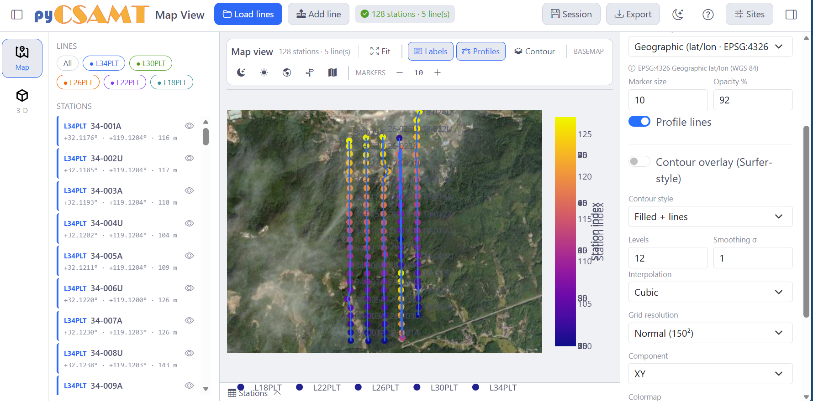
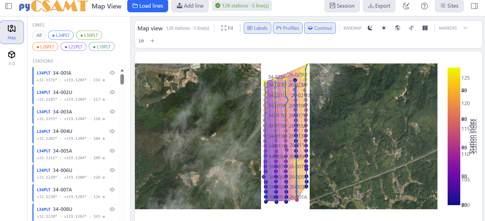
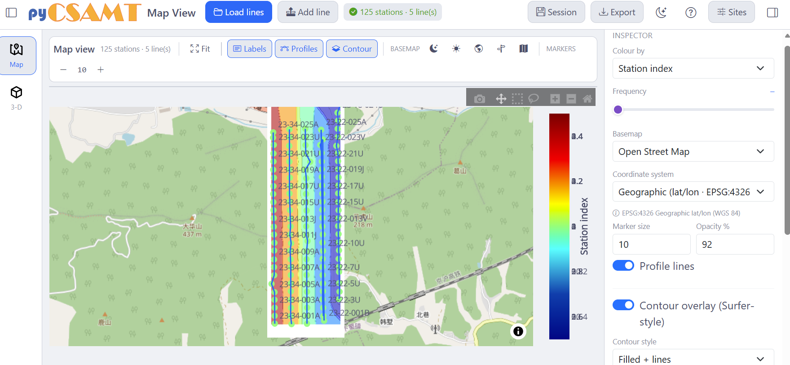
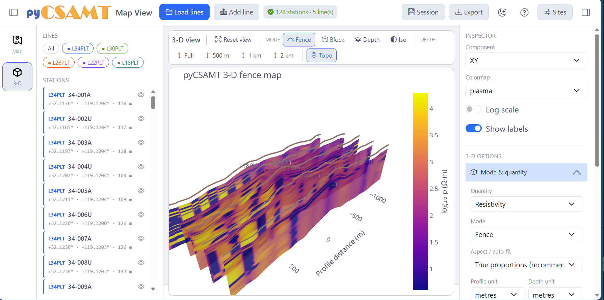
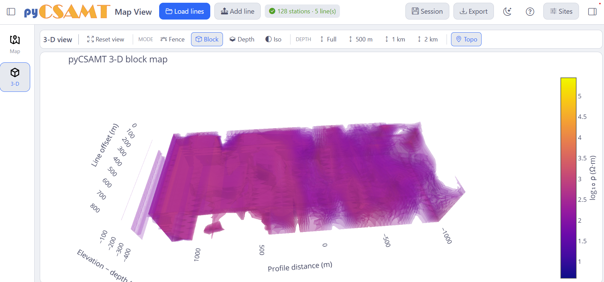
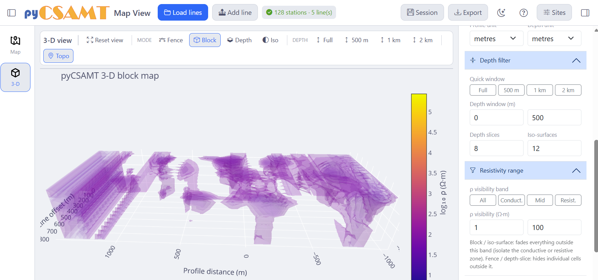
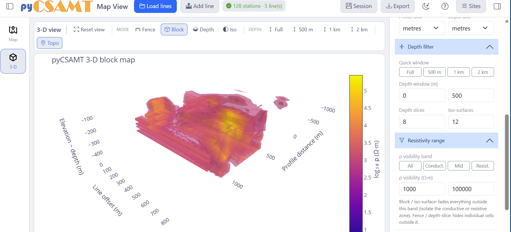
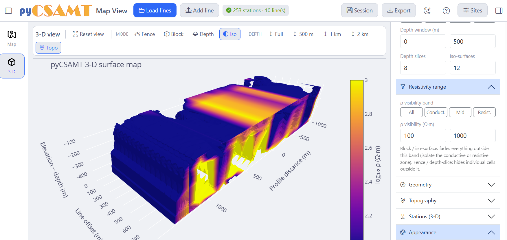
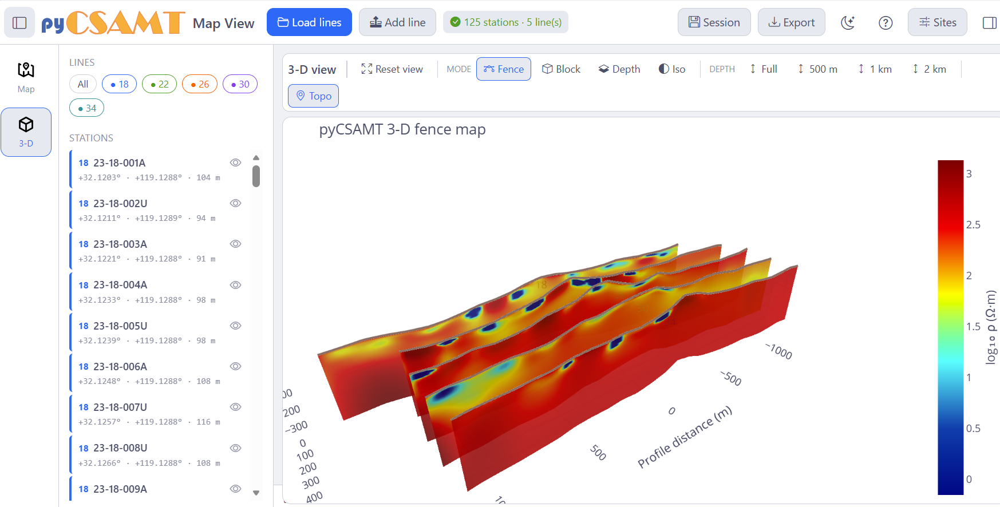
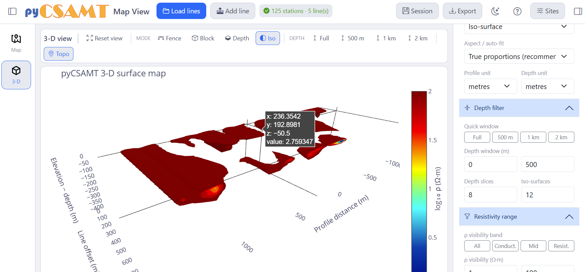

.. _applications-mapview-views:

Views And Controls
==================

MapView organises everything around **two views**, switched from the left
rail: **Map** (2-D) and **3-D**.  Both read the same loaded survey and respect
the line picker, so switching views never changes *what* is selected — only
how it is drawn.

The Shell
---------

Every view shares the same frame:

* **Top bar** — the app title, **Load lines** and **Add line**, a live
  *N stations · M line(s)* status, then **Session**, **Export**, a theme
  toggle, **Help**, **Sites**, and the inspector-panel toggle.
* **Left panel** — the **Lines** picker (an **All** chip plus one per line) and
  the **Stations** list, each row with an eye toggle to show or hide a station.
* **Canvas** — the current view, with a view-specific toolbar along the top.
* **Inspector** — a right-hand panel of controls for the current view; it can
  be collapsed from the top bar to widen the canvas.

Map View
--------

The Map view is the 2-D basemap picture of the survey.

   The Map view: the Lines/Stations panel on the left, the basemap canvas with
   the colour scale, and the inspector on the right.

**Canvas toolbar**

* **Fit** re-frames the map to the survey extent.
* **Labels** toggles station labels.
* **Profiles** toggles the profile lines connecting each line's stations.
* **Contour** toggles the Surfer-style contour overlay.
* **Basemap** selects a tile style — dark, light, satellite, topographic, or
  street.
* **Markers** steps the marker size up or down.

**Inspector controls**

.. list-table::
   :header-rows: 1
   :widths: 26 74

   * - Control
     - Effect
   * - **Colour by**
     - The field drawn on markers: *Station index*, *Elevation*,
       *App. resistivity*, *Phase*, or *Skin depth*.
   * - **Frequency**
     - The frequency at which resistivity/phase/skin-depth fields are
       evaluated (a slider).
   * - **Basemap**
     - The tile provider (for example *Open Street Map*).
   * - **Coordinate system**
     - How station coordinates are interpreted — *Geographic (lat/lon ·
       EPSG:4326)*, a UTM zone, or a custom EPSG.
   * - **Marker size** / **Opacity %**
     - Marker appearance.
   * - **Profile lines**
     - Draw the per-line connectors.
   * - **Contour overlay (Surfer-style)**
     - Draped contours, with **Contour style** (filled, lines, or both),
       **Levels**, **Smoothing σ**, **Interpolation** (for example cubic),
       **Grid resolution**, **Component**, and **Colormap**.

.. tip::

   Set the **Coordinate system** correctly before reading position or contours.
   Standard EDI files are geographic latitude/longitude; project files may use a
   UTM zone or a custom EPSG code.

The Contour Overlay
~~~~~~~~~~~~~~~~~~~~

Turning on **Contour** drapes a Surfer-style interpolated surface over the
basemap — useful for a quick lateral sense of a field before moving to 3-D.

   A filled-and-lines contour overlay of the station-index field, draped over
   the survey lines.  Read contours with the station layout in mind — they are
   an interpolation, not mapped geology.

Basemaps
~~~~~~~~

The basemap can be satellite imagery, a light or dark canvas, a topographic
tileset, or a street map.

   The same survey on an **Open Street Map** basemap, with the full inspector
   showing the colour field, frequency, basemap, coordinate system, marker, and
   contour controls.  The Plotly modebar (top-right of the canvas) gives pan,
   zoom, box/lasso select, and a PNG snapshot.

3-D View
--------

The 3-D view renders the survey's resistivity as an interactive scene.  Switch
to it with **3-D** in the left rail.

   The 3-D view in **Fence** mode with topography: one vertical resistivity
   panel per survey line, a terrain surface draped from station elevations, and
   the log₁₀ ρ colour bar.  The inspector's **3-D options** accordion holds
   mode, depth, resistivity, geometry, topography, station, and appearance
   controls.

**Canvas toolbar**

* **Reset view** returns the camera to its default framing.
* **Mode** — **Fence**, **Block**, **Depth** slices, or **Iso** surface.
* **Depth** — quick vertical windows: **Full**, **500 m**, **1 km**, **2 km**.
* **Topo** toggles the draped topography.

**Render modes**

.. list-table::
   :header-rows: 1
   :widths: 20 80

   * - Mode
     - What it draws
   * - **Fence**
     - A vertical resistivity panel along each survey line — the closest 3-D
       analogue of a pseudosection, seen in place.
   * - **Block**
     - A filled semi-transparent volume interpolated across the survey.
   * - **Depth**
     - Horizontal depth slices through the volume.
   * - **Iso**
     - Iso-surfaces at chosen resistivity levels — good for isolating discrete
       bodies.

   **Block** mode renders the survey as a filled, semi-transparent resistivity
   volume; **Reset view**, the mode buttons, the depth window, and **Topo** are
   all on the canvas toolbar.

**Inspector — 3-D options**

The 3-D inspector groups its controls into an accordion:

* **Mode & quantity** — the **Quantity** (Resistivity), the render **Mode**,
  the **Aspect / auto-fit** (True proportions is recommended), and the
  **Profile** and **Depth** units.
* **Depth filter** — the **Quick window** (Full / 500 m / 1 km / 2 km), an
  explicit **Depth window (m)**, the number of **Depth slices**, and the number
  of **Iso-surfaces**.
* **Resistivity range** — the **ρ visibility band** and window (see below).
* **Geometry**, **Topography**, **Stations (3-D)**, and **Appearance** — scene
  geometry, terrain, in-scene station markers/labels, and styling.

Above the accordion, **Component**, **Colormap**, **Log scale**, and **Show
labels** control the colour axis and labelling.

Isolating Conductive Or Resistive Structure
~~~~~~~~~~~~~~~~~~~~~~~~~~~~~~~~~~~~~~~~~~~~~

The **Resistivity range** section is one of MapView's most useful 3-D tools.
The **ρ visibility band** (**All**, **Conduct.**, **Mid**, **Resist.**) with an
explicit **ρ visibility (Ω·m)** window fades everything outside the chosen band
in Block and Iso-surface modes (and hides individual cells outside it in Fence
and Depth modes), so you can look at just the conductive or just the resistive
part of the volume.

   Block mode with the **Conduct.** band (ρ ≈ 1–100 Ω·m): only the conductive
   structure remains visible.

   The same scene with the **Resist.** band (ρ ≈ 1000–100000 Ω·m): now only the
   resistive bodies show.  Switching the band is the fastest way to separate the
   two.

   **Iso** mode with the **Depth filter** and **Resistivity range** panels
   open: depth window, depth slices, and iso-surface count on the left of the
   panel; ρ visibility band and window below.

Inversion Results In 3-D
------------------------

When you import a ModEM 3-D inversion result (see
:doc:`loading_and_sessions`), the same 3-D view renders the **inverted**
resistivity model instead of an interpolation of the survey response — one
panel per detected line, in the survey's own scene.

   A ModEM inversion result shown as fence panels: conductive pockets (blue)
   embedded in a resistive background (red), sliced to one panel per line, with
   the depth window set to 500 m.

Every 3-D control applies to the imported model — modes, depth windows, the
resistivity band, and topography.  Iso-surface mode with hover read-outs is
especially useful for locating and measuring discrete bodies in the inverted
volume:

   Iso-surfaces of the inverted model, with a hover tooltip reporting the
   position and log₁₀ ρ value at a point — the direct way to interrogate a body
   in the model.

.. note::

   The 3-D scene is WebGL.  If the Map view works but the 3-D canvas stays
   blank, see :doc:`troubleshooting`.

.. seealso::

   :ref:`3-D maps gallery <sphx_glr_examples_map_3d>`
       The same station-map and 3-D figures produced from code, executed
       at build time.
