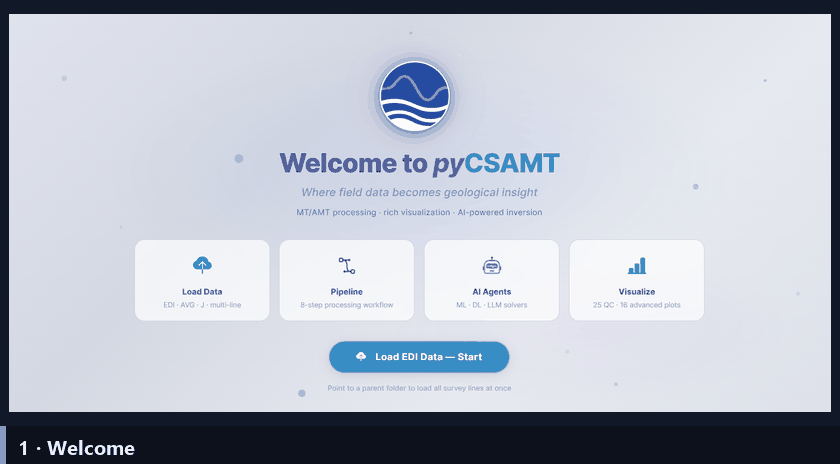

.. _applications-web:

Web Application
===============

The pyCSAMT web application is a browser-based studio for CSAMT, AMT, and MT
survey work. It runs the same scientific package as the Python API and the
desktop GUI, but presents it as a single-page Dash/Plotly application that you
open in a web browser. Use it to load EDI data, inspect maps and profiles,
run quality control, preview and apply corrections, produce advanced
diagnostics, build forward and inversion models, browse inversion results, and
drive the pyCSAMT agents — all without writing code.

The web app is not a separate science layer. Its callbacks delegate to the
same ``pycsamt.app.desktop.controllers`` used by the desktop GUI, so a survey
loaded here behaves exactly as it would in the desktop app or in plain Python.
What differs is the working style: the web app is built for shared servers,
team demonstrations, and cross-platform access from a browser.

   An animated tour of the web studio: welcome, load a survey, inspect the
   interactive station map and profile pseudosections, run quality control and
   corrections, run an AI-assisted inversion, and view the 3-D resistivity
   scene. Each surface is documented on the pages below.

A good first pass, in order, is **Overview → Installation → Navigation →
Loading & Sessions → Maps & Profiles → Processing Pages → Exports →
Deployment → Troubleshooting**.

.. toctree::
   :numbered: 4
   :maxdepth: 1
   :class: pycsamt-guide-toc

   overview
   installation
   navigation
   loading_and_sessions
   maps_and_profiles
   processing_pages
   exports
   deployment
   troubleshooting
