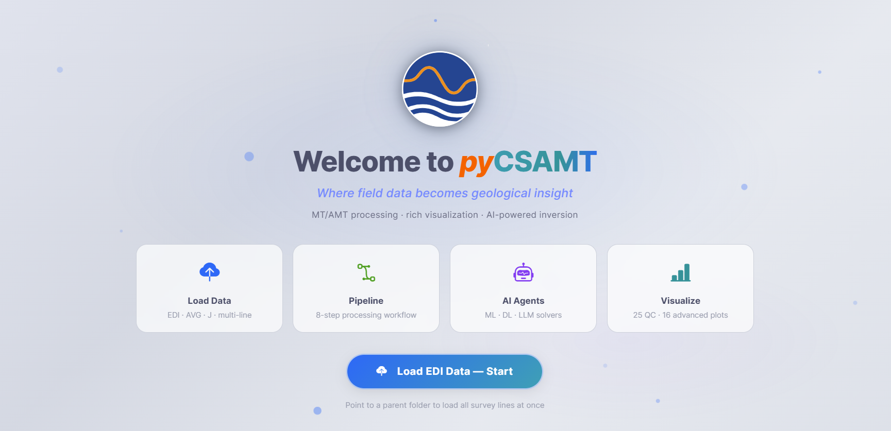

.. _applications-web-installation:

Installation And Launch
=======================

The web application ships with pyCSAMT.  It needs the optional ``app``
dependencies (Dash, Dash Bootstrap Components, and Plotly) in addition to the
scientific core.  This page covers installing those dependencies, launching
the server, and the command-line options that control host, port, browser, and
debug behaviour.

.. tip::

   Want to try the web app without installing anything? A hosted
   instance is linked from :ref:`applications-hosted`.

Install The App Extra
---------------------

Install pyCSAMT with the ``app`` extra to pull in the web and GUI
dependencies:

.. code-block:: bash

   pip install "pycsamt[app]"

For development from a source checkout, install in editable mode with the
``app`` and ``dev`` extras:

.. code-block:: bash

   pip install -e ".[app,dev]"

The web layer builds on **Dash 4**, **Dash Bootstrap Components 2**, and
**Plotly 6**, over the usual scientific stack (NumPy, SciPy, Matplotlib, and
pyproj).  If Dash or Dash Bootstrap Components are missing, the launcher stops
with a clear message telling you to install ``pycsamt[app]``.

Launch The Web App
------------------

Start the server with the console command:

.. code-block:: bash

   pycsamt-web

The launcher binds to ``127.0.0.1:8050`` by default, prints the URL to the
terminal, and opens that URL in your default browser after a short delay.  If
port ``8050`` is already in use, it automatically selects a free port and
prints the substitute::

   pycsamt web app → http://127.0.0.1:8051
   requested port 8050 was busy; using 8051

From a source checkout, the module entry point launches the same application:

.. code-block:: bash

   python -m pycsamt.app.web

Leave the terminal open while you work — it hosts the Dash server.  Press
``Ctrl+C`` in the terminal to stop the app.

The Welcome Screen
------------------

On first load, before any data is present, the app shows a welcome screen with
four capability cards and a single call to action.

   The welcome screen. **Load EDI Data — Start** opens the loader; the hint
   below it reminds you that pointing at a parent folder loads every survey
   line at once.

The four cards summarise what the app does: **Load Data** (EDI, AVG, and J
files, multi-line), **Pipeline** (the eight-step processing workflow),
**AI Agents** (ML, DL, and LLM solvers), and **Visualize** (25 QC plots and
16 advanced plots).  Click **Load EDI Data — Start** to open the loader, or
use **Load Data** on the command bar at any time.  Loading is covered in
:doc:`loading_and_sessions`.

Command-Line Options
--------------------

``pycsamt-web`` accepts the following options.  They can also be passed to
``python -m pycsamt.app.web``.

.. list-table::
   :header-rows: 1
   :widths: 26 74

   * - Option
     - Effect
   * - ``--host HOST``
     - Bind address.  ``127.0.0.1`` (default) is local-only; ``0.0.0.0``
       exposes the app to other machines on the network.
   * - ``--port PORT``
     - Preferred TCP port (default ``8050``).  Use ``0`` to always ask the
       operating system for a free port.
   * - ``--strict-port``
     - Fail immediately if ``--port`` is unavailable instead of selecting a
       different free port.
   * - ``--debug``
     - Enable Dash debug mode: the Dev Tools panel and callback error
       reporting in the browser.
   * - ``--no-browser``
     - Start the server without opening a browser.  ``--browser`` (the
       default) opens one.
   * - ``--browser-delay SECONDS``
     - Seconds to wait before opening the browser (default ``1.0``).

Examples
--------

Run local-only on a fixed port without launching a browser (useful on a
headless machine or when you will open the URL yourself):

.. code-block:: bash

   pycsamt-web --host 127.0.0.1 --port 8060 --no-browser

Let the operating system pick a guaranteed-free port:

.. code-block:: bash

   pycsamt-web --port 0

Fail loudly if the requested port is taken, instead of silently moving to
another one (useful behind a reverse proxy that expects a fixed port):

.. code-block:: bash

   pycsamt-web --port 8050 --strict-port

Enable Dash dev tools while developing callbacks:

.. code-block:: bash

   pycsamt-web --debug

.. note::

   ``--debug`` is intended for development.  It enables hot-reload-style dev
   tools and exposes callback tracebacks in the browser.  Do not use it for
   shared or exposed deployments; see :doc:`deployment`.

Verify The Launch
-----------------

After launching, confirm that:

* the terminal prints ``pycsamt web app → http://…`` with a reachable URL;
* the browser opens to the welcome screen (or your last view);
* the command bar shows **Tools**, **Settings**, and **Help** on the left and
  the survey actions on the right.

If the browser does not open automatically, copy the URL from the terminal.
If the page is blank or the port is busy, see :doc:`troubleshooting`.

Next Steps
----------

* :doc:`navigation` -- the command bar, navigation rail, and home dashboard.
* :doc:`loading_and_sessions` -- load EDI folders and manage survey lines.
* :doc:`deployment` -- host, port, and network considerations for shared use.
