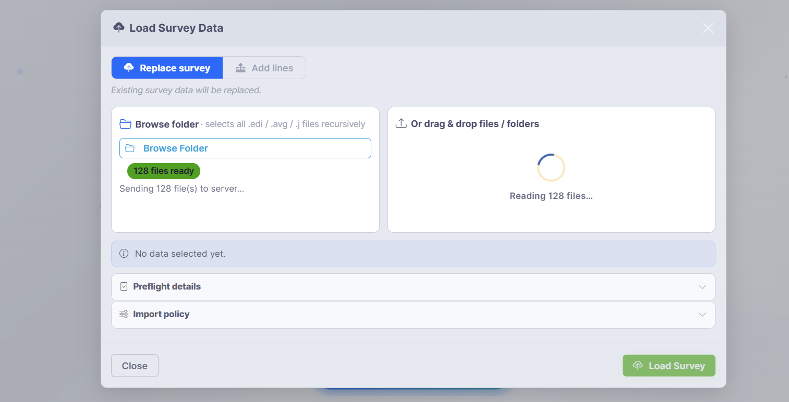
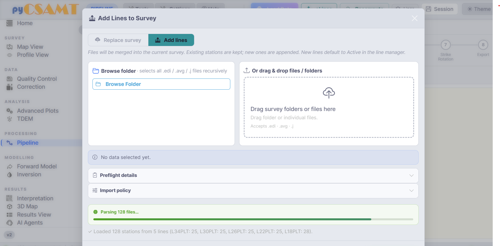
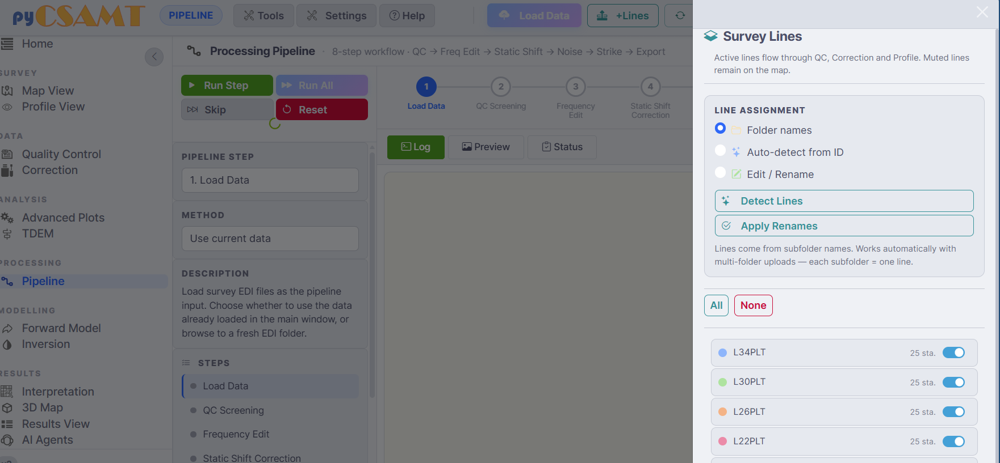
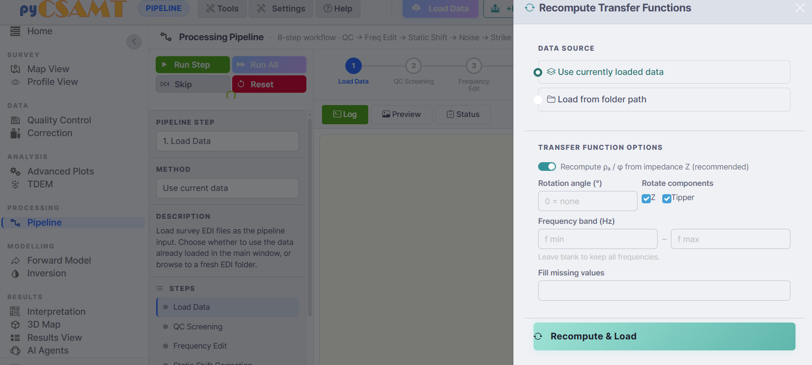
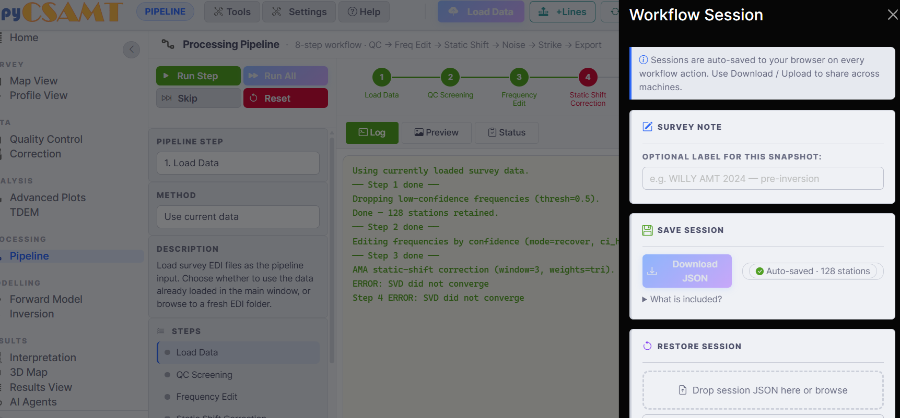

.. _applications-web-loading:

Loading Data And Sessions
=========================

Everything in the web app operates on one **active survey**.  This page covers
how to load that survey from a browser, how to organise it into survey lines,
how to recompute transfer functions, and how to save and restore browser
sessions.

Loading A Survey
----------------

Open the loader with **Load Data** on the command bar (or **Load EDI Data —
Start** on the welcome screen).  The loader is a modal with two tabs.

   The loader in *Replace survey* mode.  Browse to a folder or drag files in,
   review the preflight, then click **Load Survey**.

* **Replace survey** loads a new survey and replaces whatever is currently
  loaded.
* **Add lines** merges additional lines into the current survey (covered
  below).

You provide data in one of two ways:

* **Browse folder** -- pick a parent folder.  The loader selects all ``.edi``,
  ``.avg``, and ``.j`` files it finds **recursively**, so pointing at a survey
  root loads every line at once.
* **Drag & drop** -- drop files or whole folders onto the drop zone.  The same
  file types are accepted.

Two collapsible sections give you control and confidence before committing:

* **Preflight details** -- a summary of what was found (file counts, detected
  lines, station totals) so you can confirm the selection before loading.
* **Import policy** -- options that govern how files are interpreted and
  merged.

Click **Load Survey** to load.  The status area reports progress
(*Reading … files*, *Parsing … files*) and finishes with a summary such as
*Loaded 128 stations from 5 lines*.  After loading, the app shows the Home
dashboard with the survey in place.

.. tip::

   Organise field data as **one folder per survey line** before loading.  The
   line manager then picks up each subfolder as a named line automatically,
   which keeps every downstream page (QC, correction, profile, 3-D) line-aware.

Adding Lines To An Existing Survey
----------------------------------

Use **+Lines** on the command bar (or the *Add lines* tab of the loader) to
merge more data into the survey you already have.

   *Add lines* mode.  Existing stations are kept and new ones are appended;
   newly added lines default to **Active** in the line manager.

In *Add lines* mode, existing stations are preserved and new stations are
appended.  Any new lines default to **Active** so they immediately participate
in QC, correction, and profile views.  Use this to bring later field days or
extra profiles into a survey you have already started reviewing.

Managing Survey Lines
---------------------

Open the **Lines** drawer from the command bar to control which lines are
active and how they are named.

   The Survey Lines drawer.  Active lines flow through QC, Correction, and
   Profile; muted lines stay on the map but are excluded from processing.

**Line assignment** decides how stations are grouped into lines:

* **Folder names** -- one line per subfolder (the default; works automatically
  with multi-folder uploads).
* **Auto-detect from ID** -- infer lines from station identifiers with
  **Detect Lines**.
* **Edit / Rename** -- rename lines by hand, then **Apply Renames**.

Below the assignment controls, each line has an **Active** toggle and a station
count.  **All** and **None** activate or mute every line at once.  The key
rule:

    Active lines flow through QC, Correction, and Profile.  Muted lines remain
    visible on the map but are excluded from processing.

Use this to focus a QC or correction pass on a subset of lines without
unloading the rest of the survey.  The line selection is shared by every page,
and many pages also expose their own per-page line and station pickers for
finer control.

Recomputing Transfer Functions
------------------------------

Use **Recompute** on the command bar when you want to regenerate apparent
resistivity and phase from impedance — for example after rotating components or
when you want to work in a restricted frequency band.

   The Recompute drawer.  Choose a data source, then recompute ρₐ/φ from the
   impedance tensor, optionally rotating and restricting the frequency band.

The drawer offers:

* **Data source** -- use the currently loaded data, or load fresh data from a
  folder path.
* **Recompute ρₐ / φ from impedance Z** (recommended) -- rebuild the apparent
  resistivity and phase from the impedance tensor.
* **Rotation angle** and **Rotate components** -- optionally rotate ``Z`` and
  the tipper by a fixed angle.
* **Frequency band** -- restrict to a ``f min``–``f max`` window; leave blank
  to keep all frequencies.
* **Fill missing values** -- optionally fill gaps.

Click **Recompute & Load** to apply.  The result becomes the new active survey.

.. note::

   Recompute rebuilds derived quantities; it does not itself apply a physical
   correction such as static shift.  For evidence-based corrections, use the
   :doc:`Correction page <processing_pages>` with its non-destructive chain.

Browser Sessions
----------------

The web app keeps a **browser session** so your work survives page reloads and
can be shared across machines.  Open it with **Session** on the command bar.

   The Workflow Session drawer.  Sessions auto-save to the browser on every
   workflow action; use **Download JSON** and restore to move a session
   between machines.

* Sessions are **auto-saved to the browser** on every workflow action, so a
  reload does not lose your place.
* **Survey Note** lets you attach an optional label to a snapshot (for example
  ``WILLY AMT 2024 — pre-inversion``).
* **Save Session → Download JSON** writes the session to a file you can archive
  or send to a colleague.  The **What is included?** link lists exactly what
  the file captures.
* **Restore Session** loads a previously downloaded session JSON — drop it on
  the drop zone or browse to it.

Because the browser is the store, sessions are per-browser and per-machine.
The **Download / Restore** cycle is the supported way to move a session to
another computer or another browser.

.. note::

   The session JSON records workflow state and settings, not the raw EDI files
   themselves.  Keep the original survey folder alongside the session file so
   the survey can be reloaded when you restore.

Data Health After Loading
-------------------------

After loading or adding lines, take a moment on the Home dashboard (see
:doc:`navigation`) to confirm:

* the expected number of stations, frequencies, and lines;
* that stations carry coordinates (the dashboard reports how many do);
* that the lines you expect are present and named sensibly.

If any of these look wrong, revisit the **Lines** drawer (line assignment) or
reload with a corrected folder selection before moving into QC, correction, or
modelling.

Next Steps
----------

* :doc:`maps_and_profiles` -- inspect the loaded survey spatially and
  per-station.
* :doc:`processing_pages` -- QC, corrections, modelling, and the pipeline.
* :doc:`exports` -- save figures, corrected EDIs, and session files.
