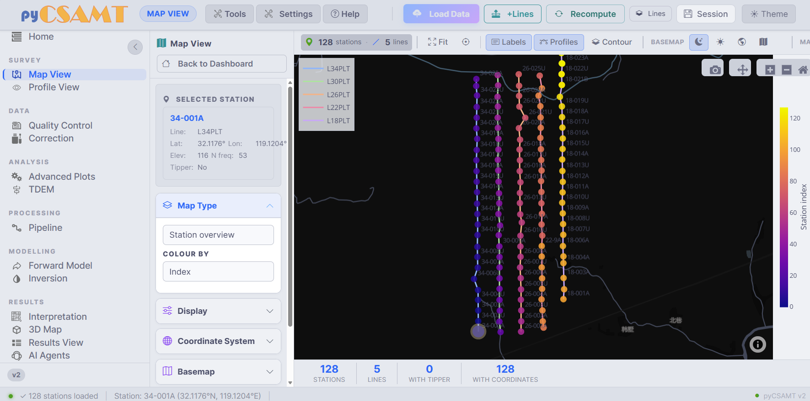
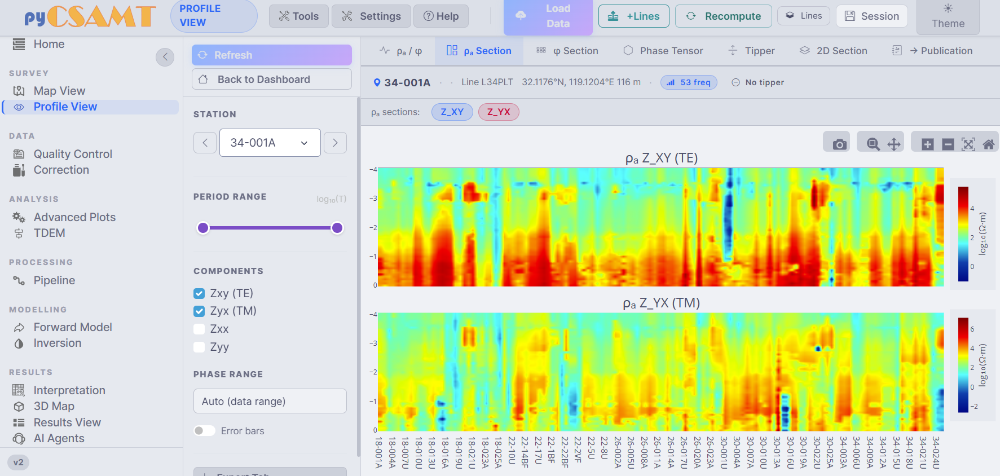
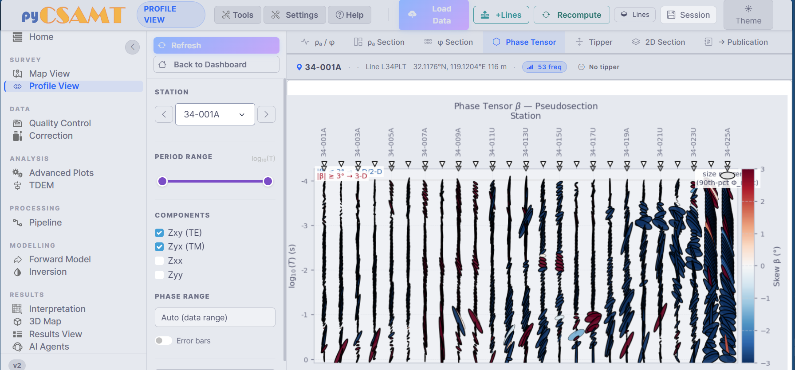
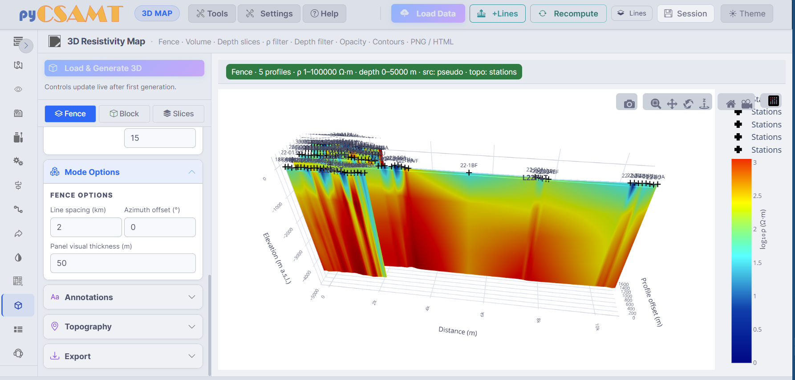

.. _applications-web-maps-profiles:

Maps And Profiles
=================

The web app has three spatial views over the active survey: **Map View** for
station geometry and map-style attributes, **Profile View** for per-station
responses and along-line pseudosections, and the **3D Map** for an interactive
resistivity scene.  Together they are the fastest way to confirm that a loaded
survey is spatially coherent and physically plausible before you run QC,
correction, or inversion.

All three read the same active survey and the same station selection, so a
station picked on the map is the station shown in the profile view.

Recommended Inspection Order
----------------------------

Use the views in a fixed order when opening a survey.  It keeps interpretation
from running ahead of basic data checks:

1. **Map View — station overview** — confirm station positions, line grouping,
   and coordinate sanity.
2. **Map View — colour by elevation / resistivity** — look for missing
   elevations and broad lateral contrasts.
3. **Profile View — ρₐ / φ** — inspect response curves for a few
   representative stations.
4. **Profile View — pseudosections** — check along-line continuity and
   frequency coverage.
5. **Profile View — Phase Tensor / Tipper** — check dimensionality and
   directionality before strike or 2-D assumptions.
6. **3D Map** — only after station geometry and responses look credible.

Map View
--------

Map View opens the interactive :term:`station map`.  It starts with station
geometry, which is the first thing to inspect after loading — it shows whether
station order, line grouping, and coordinates make sense before any
interpolation or colouring.

   Map View.  Left: the selected-station card and the Map Type, Display,
   Coordinate System, and Basemap panels.  Centre: the interactive Plotly map
   with one colour per line.  Footer: station, line, tipper, and coordinate
   counts.

**Left-hand controls**

* **Selected Station** card — the station currently in focus, with its line,
  latitude, longitude, elevation, frequency count, and tipper availability.
* **Map Type** — what the map draws.  *Station overview* shows locations and
  labels; other types colour stations by a :term:`scalar overlay` or draw a
  :term:`density layer`.
* **Colour by** — the quantity used as the :term:`scalar overlay` (for example
  station index, elevation, or apparent resistivity).
* **Display** — marker style, labels, and overlays.
* **Coordinate System** — the :term:`coordinate reference system` used to
  interpret station coordinates (geographic latitude/longitude, a UTM zone,
  or a custom EPSG code).  Set this before enabling basemap tiles.
* **Basemap** — optional map tiles for external context.

**Top toolbar**

* **Fit** re-frames the map to the survey extent.
* **Labels** toggles station labels.
* **Profiles** toggles the survey-line connectors.
* **Contour** draws interpolated contours over the stations.
* **Basemap** selects a tile style.

**Plotly interactions**

The map is a Plotly figure.  Use the modebar (top-right of the figure) to pan,
zoom, and take a **PNG snapshot** with the camera button; double-click to reset
the view.  Clicking a station selects it — the selection syncs to the station
list and to Profile View.

.. tip::

   Check the **Coordinate System** before trusting any geophysical pattern.
   If the station cloud looks stretched, mirrored, or far from its expected
   area, the input :term:`CRS` is usually wrong — fix it before enabling
   basemap tiles or reading contours.

Each :term:`contour overlay` is an interpolation over the finite station
values, not a measured continuous field.  Read it with the station layout in
mind: do not treat closed patches outside station coverage as mapped geology,
and switch back to the station overview if a contour shape is dominated by
edge effects.

Profile View
------------

Profile View is the per-station response workbench.  It starts with
:term:`apparent resistivity` and :term:`phase` for the selected station and
exposes tabs for :term:`pseudosection`\ s, :term:`tipper`, :term:`phase
tensor`, a 2-D section, and a publication view.

   Profile View on the ρₐ Section tab.  Left: station selector, period range,
   component toggles, phase range, and error bars.  Centre: the Z_XY (TE) and
   Z_YX (TM) apparent-resistivity pseudosections along the line.

The ρₐ and φ section tabs grid station (or along-line distance) against
period, so a :term:`pseudosection` is a useful continuity check across a
line — but, like any interpolated display, it is a visual aid rather than a
true depth section, and gaps between widely spaced stations should be read
as missing information rather than as smooth structure.

**Tabs**

.. list-table::
   :header-rows: 1
   :widths: 24 76

   * - Tab
     - Use it for
   * - **ρₐ / φ**
     - Per-station apparent resistivity and phase response curves.
   * - **ρₐ Section**
     - Along-line apparent-resistivity structure by period.
   * - **φ Section**
     - Along-line phase structure by period.
   * - **Phase Tensor**
     - Phase-tensor pseudosection for dimensionality and strike context.
   * - **Tipper**
     - Tipper magnitude and direction where tipper data exist.
   * - **2D Section**
     - Section-style view for profile- or inversion-oriented interpretation.
   * - **Publication**
     - A cleaner, figure-oriented view for reports.

**Left-hand controls**

* **Station** selector — step through stations with the arrows or pick one
  from the dropdown.  The header shows the line, coordinates, elevation,
  frequency count, and tipper status.
* **Period range** — limit the visible period (``log10(T)``) interval.
* **Components** — toggle the :term:`impedance tensor` elements ``Zxy (TE)``,
  ``Zyx (TM)``, ``Zxx``, and ``Zyy``.
* **Phase range** — automatic (data range) or a fixed interval.
* **Error bars** — show uncertainty where available.

The default component set emphasises the :term:`off-diagonal component`\ s
``Zxy`` and ``Zyx``, which usually carry the primary TE/TM information.
Enable ``Zxx`` and ``Zyy`` when diagnosing diagonal leakage, :term:`galvanic
distortion`, or 3-D behaviour — if the diagonal components dominate, be
cautious before assuming a simple 2-D interpretation.

Phase Tensor Pseudosection
--------------------------

The **Phase Tensor** tab draws a station-by-period ellipse pseudosection,
coloured by skew β.  Unlike the raw :term:`impedance tensor`, the
:term:`phase tensor` is built to stay immune to :term:`static shift`, so its
ellipse shape and skew colouring are read as evidence of true earth
structure rather than a near-surface artefact.  Use it before
:term:`strike` and :term:`dimensionality` decisions.

   The phase-tensor β pseudosection.  Small skew β (a few degrees or less)
   suggests 1-D/2-D behaviour; strong or abrupt skew changes flag possible 3-D
   effects or local data problems.

The same phase-tensor and strike diagnostics are also available on the
:doc:`Advanced Plots page <processing_pages>` for whole-survey, multi-line
views.

3D Map
------

The **3D Map** page builds an interactive :term:`3-D quick-look map` from the
survey.  It is a Results-group page, best used after the maps and profiles
look credible, because everything it draws is a projection of the same
station-level ρₐ and period values you have just been reading in Profile
View — there is no constrained inversion model behind it yet.

   The 3-D Resistivity Map in Fence mode: resistivity panels along each line,
   station markers on the terrain, and a resistivity colour bar.

Depth in this scene is a :term:`pseudo-depth`, estimated from each sample's
apparent resistivity and period through the same :term:`skin depth` relation
used elsewhere in pyCSAMT, :math:`z \approx 503\sqrt{\rho_a T}` (metres, with
:math:`\rho_a` in ohm·m and :math:`T` in seconds) — a sampling-scale
coordinate, not a recovered interface depth.

**Modes**

* **Fence** — a :term:`fence view`: vertical resistivity panels along each
  survey line, positioned in 3-D by station offset and line spacing, with
  controls for line spacing, azimuth offset, and panel thickness.
* **Block** — a :term:`block volume` built from the finite pseudo-depth
  samples across every line.
* **Slices** — horizontal :term:`depth slice`\ s through the same
  interpolated point cloud.

Additional panels control **Annotations**, **Topography** (a :term:`topography
overlay` draping the scene on station elevations), and **Export**.  **Load &
Generate 3D** builds the scene; after the first build, the controls update the
view live.  The scene is a Plotly 3-D figure — drag to rotate, scroll to zoom,
and use the modebar camera for a PNG, or export an interactive **HTML** file
from the Export panel.

Figure Export And Code Parity
-----------------------------

Every interactive figure on these pages is a Plotly figure with a modebar:
use the camera button for a quick PNG, and the Export panels (on 3-D and the
results pages) for a :term:`figure export` to PNG or standalone HTML.  See
:doc:`exports` for the full export story.

Because the web app shares controllers with the Python package, the same maps
and 3-D scenes can be reproduced in code with the ``pycsamt.map`` façade, so a
view you build interactively can be regenerated in a script for a report.

Common Issues
-------------

No stations appear
    Confirm that data loaded successfully and that the station list is
    populated.  If it is empty, return to :doc:`loading_and_sessions`.

Stations plot in the wrong place
    Check the **Coordinate System** panel in Map View — the wrong
    :term:`CRS` is the usual cause.  Standard EDI files are usually
    geographic latitude/longitude, but some project files use UTM or another
    EPSG code.

Profile tabs are empty
    Select a station with valid impedance data and enough frequency samples.
    Some tabs — the tipper view in particular — require the corresponding data
    to exist in the loaded files.

Basemap tiles do not appear
    Basemap tiles need optional geospatial dependencies and network access.
    The station and contour maps still work without tiles.

Next Steps
----------

* :doc:`processing_pages` -- QC, correction, modelling, results, and agents.
* :doc:`exports` -- save maps, sections, and 3-D scenes.
