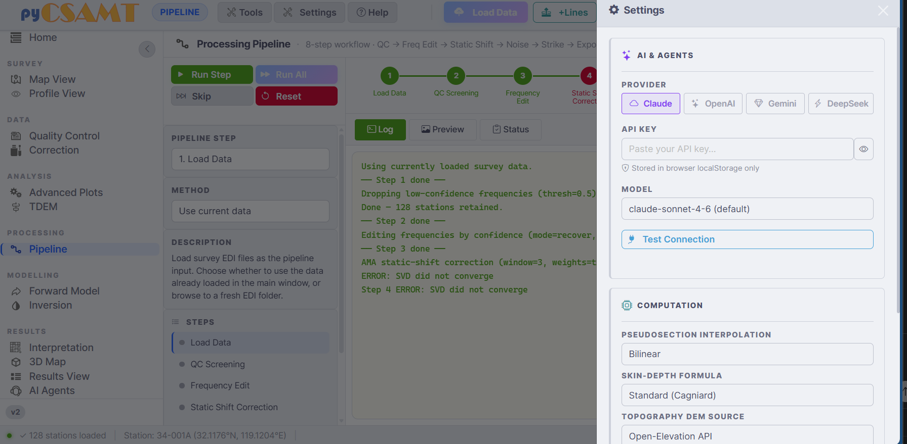
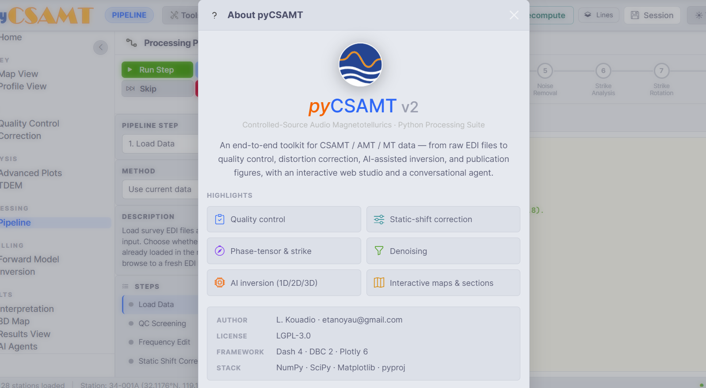

.. _applications-web-navigation:

Navigation And Layout
=====================

The web app is a single-page application.  Every page shares the same shell: a
persistent command bar across the top, a collapsible navigation rail on the
left, and a content body that swaps as you move between pages.  This page
explains the shell, the home dashboard, the theme, and the Settings and Help
drawers so that the rest of the documentation can refer to them by name.

The App Shell
-------------

.. figure:: ../../_static/applications/web/home-dashboard.png
   :alt: The web app shell: command bar, navigation rail, and home dashboard
   :class: pycsamt-screenshot

   The three persistent zones: the command bar (top), the navigation rail
   (left), and the content body (centre and right).  Here the body is showing
   the Home dashboard.

The Command Bar
---------------

The command bar is always visible.  It is split into two groups.

On the left, the current page is named (for example **HOME** or **MAP VIEW**),
followed by three menus that open drawers or dropdowns:

.. list-table::
   :header-rows: 1
   :widths: 20 80

   * - Control
     - Opens
   * - **Tools**
     - A dropdown of standalone utilities — Strike Analyzer, EDI Validator,
       Format Converter, Batch Export Plots, Coordinate Transformer, Elevation
       Enrichment, Station Response Inspector, Strike Profile Viewer, Phase
       Tensor Map, Dimensionality Classifier, Frequency Editor, and more.
       See :doc:`processing_pages`.
   * - **Settings**
     - The Settings drawer: AI provider and API key, model, and computation
       defaults (see below).
   * - **Help**
     - The **About pyCSAMT** dialog with version, license, framework, and
       feature highlights.

On the right are the survey actions that operate on the active survey:

.. list-table::
   :header-rows: 1
   :widths: 20 80

   * - Action
     - Effect
   * - **Load Data**
     - Open the loader modal to replace the survey or start a new one.
   * - **+Lines**
     - Open the loader in *Add lines* mode to merge more lines into the
       current survey.
   * - **Recompute**
     - Recompute apparent resistivity and phase from impedance, optionally
       with rotation and a frequency band.
   * - **Lines**
     - Open the Survey Lines drawer to assign, rename, and toggle active
       lines.
   * - **Session**
     - Open the Workflow Session drawer to download or restore a session JSON.
   * - **Theme**
     - Toggle the colour theme.

All of these survey actions are covered in :doc:`loading_and_sessions`.

The Navigation Rail
-------------------

The left rail routes between pages.  Entries are grouped under short headings
that follow the survey workflow:

.. code-block:: text

   Home
   Survey      → Map View · Profile View
   Data        → Quality Control · Correction
   Analysis    → Advanced Plots · TDEM
   Processing  → Pipeline
   Modelling   → Forward Model · Inversion
   Results     → Interpretation · 3D Map · Results View · AI Agents

The chevron button at the top of the rail collapses it to an icon-only strip,
which widens the plotting area — useful on the map, 3-D, and results pages
where the figure benefits from the extra width.  The active page is
highlighted, and the app version is shown at the bottom of the rail.

Clicking a rail entry swaps the content body to that page.  The active survey,
selected station, and line selection persist across pages, so you can move from
Map View to Quality Control to Correction without reloading data.

The Home Dashboard
------------------

**Home** is the landing page after data is loaded.  It summarises the survey
and offers shortcuts, but does not change any data.

* **KPI cards** across the top report the headline counts: number of
  **stations**, number of **frequencies**, number of **profiles** (lines), and
  the **survey** name or source.
* The **Stations** list on the left shows every station with its line tag,
  coordinates, elevation, and frequency count.  Line chips (for example
  ``L34PLT``, ``L30PLT``) filter the list to one line; **All** clears the
  filter.  Selecting a station here syncs it to the map and profile pages.
* The **Survey Dashboard** in the centre reports data-health checks — how many
  stations have coordinates, the average frequencies per station, tipper
  availability — and a **Station Analytics** carousel of small summary charts.
* **Survey Insights** on the right lists loaded lines and offers **Quick
  Workflows** — one-click shortcuts such as *QC Analysis*, *Static Shift*,
  *Skew / Dim.*, and *Inversion Prep* — plus a **Last Run** area and a shortcut
  to the agents.

Use Home as a preflight: confirm station and frequency counts, that stations
have coordinates, and that the expected lines are present before moving into
maps, QC, or processing.

Theme
-----

The **Theme** button on the command bar toggles the application colour theme.
The choice is remembered in the browser, so it persists between sessions on the
same machine.  Figures follow the app theme where the plotting layer supports
it.

Settings Drawer
---------------

The **Settings** menu opens a right-hand drawer with two groups.

   The Settings drawer: AI provider and API key at the top, computation
   defaults below.

* **AI & Agents** -- choose the LLM **provider** (Claude, OpenAI, Gemini, or
  DeepSeek), paste an **API key**, pick a **model**, and use **Test
  Connection** to verify it.  The API key is stored in the browser's
  ``localStorage`` only — it is not written to disk on the server.  Agent
  configuration is used by the AI Agents page and the in-app chat.
* **Computation** -- defaults that affect how plots and derived quantities are
  computed, including the **pseudosection interpolation** method, the
  **skin-depth formula** (for example *Standard (Cagniard)*), and the
  **topography DEM source** used when elevation enrichment is requested.

Help / About
------------

The **Help** menu opens the **About pyCSAMT** dialog.

   The About dialog. It reports the version, the LGPL-3.0 license, the
   framework (Dash · DBC · Plotly), the underlying stack, and a summary of
   capabilities.

Differences From The Desktop GUI
--------------------------------

The web app and the desktop GUI share the same controllers and produce
interchangeable results, but the surfaces differ in a few ways worth knowing:

* the web app is a **single page** with a routed body, where the desktop app
  uses independent **floating windows**;
* interactive maps and 3-D scenes are **Plotly** figures in the browser, with
  a modebar for pan/zoom and PNG snapshots;
* AI provider settings and sessions live in the **browser**, not in a machine
  profile under ``~/.pycsamt``;
* the web app is designed to be **shared** on a server, so it is the right
  surface for demonstrations and multi-user review.

Next Steps
----------

* :doc:`loading_and_sessions` -- load data and manage lines and sessions.
* :doc:`maps_and_profiles` -- the Map View and Profile View pages.
* :doc:`processing_pages` -- QC, correction, modelling, results, and agents.
