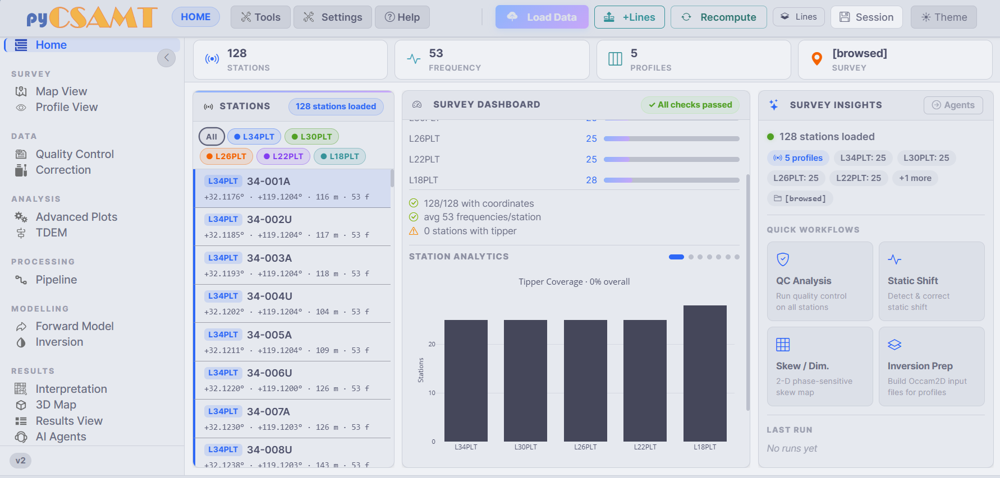

.. _applications_web_overview:

Overview
========

When To Use The Web App
-----------------------

The pyCSAMT web application is the browser surface for the same scientific
core used by the Python API and the desktop GUI. It is most useful when the
work needs to stay interactive but should not depend on every reviewer having
a local Python session open. Use it when you need to:

* run the full :term:`CSAMT`/:term:`AMT`/:term:`MT` workflow from a browser,
  without a local Python environment on every workstation;
* share a running instance on an internal server so several people can review
  the same survey;
* demonstrate loading, :term:`quality control <Quality control>`, correction,
  modelling, and interpretation to a team or class;
* combine interactive :term:`Plotly` maps and sections with
  :term:`Matplotlib figure` outputs on one screen;
* drive the pyCSAMT agents, including :term:`LLM provider`-backed assistants,
  processing agents, and inversion agents, from a chat or a runnable agent
  list.

The web app is not a second implementation of the geophysics. Its
:term:`Dash` callbacks call the same controllers and pyCSAMT objects used by
the desktop application, so the numerical meaning of a station, a response
curve, a correction, or an export is unchanged. What changes is the working
surface: the browser keeps the :term:`active survey <Active survey>` in one
shared application state while each page reads from that state and writes
explicit derived products.

   A loaded survey on the Home dashboard. The command bar controls survey-wide
   actions, the navigation rail moves between workflow pages, and the body
   summarises station coverage before deeper QC, correction, modelling, or
   interpretation.

For scripted or batch work, use the Python API, where every option can be kept
in source-controlled code or configuration. For local, single-user interactive
review with native windows, use the :doc:`desktop GUI <../desktop/index>`.
For a dedicated conversational surface, use
:doc:`Agent Master <../agent_master/index>`.

Run The Web App
---------------

.. code-block:: bash

   pycsamt-web

The launcher starts a local :term:`Dash` server and opens the app in your
default browser. It prefers ``http://127.0.0.1:8050`` and automatically
chooses another free port if that one is busy. Keeping the printed URL with the
terminal log is enough to reproduce how the session was launched: it records
the host, the port actually selected, and whether the server was started in
development mode.

From a source checkout, the module entry point launches the same app:

.. code-block:: bash

   python -m pycsamt.app.web

Common launch options:

.. code-block:: bash

   pycsamt-web --no-browser        # start the server without opening a browser
   pycsamt-web --port 8060         # prefer a specific port
   pycsamt-web --port 0            # always ask the OS for a free port
   pycsamt-web --host 0.0.0.0      # allow access from other machines on the LAN
   pycsamt-web --debug             # enable Dash dev tools and callback debugging

See :doc:`installation` for the full option list and :doc:`deployment` for
host, port, and network guidance. Use ``--host 127.0.0.1`` for a private local
review, ``--host 0.0.0.0`` only when the machine is intentionally serving other
users on a trusted network, and ``--debug`` only while developing callbacks
because :term:`Dash debug mode` exposes development diagnostics.

Navigation Map
--------------

The :term:`navigation rail <Navigation rail>` groups every page under a small
number of headings. The order mirrors a conservative survey workflow: look at
the survey, check the data, analyse it, process it, model it, then review
results. That order matters for reproducibility because later views should be
read as derived from earlier decisions, not as independent screenshots. A
corrected profile, for example, is meaningful only if the loaded lines, QC
flags, and correction steps that produced it can be recovered.

.. list-table::
   :header-rows: 1
   :widths: 18 22 60

   * - Group
     - Page
     - Purpose
   * - (top)
     - Home
     - Survey dashboard, KPIs, station list, and quick workflows.
   * - Survey
     - Map View
     - Interactive station basemap, colouring, :term:`contour overlay`\ s, and
       coordinates.
   * - Survey
     - Profile View
     - Per-station responses, :term:`pseudosection`\ s, tipper, and
       :term:`phase tensor` views.
   * - Data
     - Quality Control
     - Coverage, noise/SNR, skew/:term:`dimensionality <Dimensionality>`,
       :term:`static shift <Static shift>`, and distortion QC.
   * - Data
     - Correction
     - The 25-method non-destructive correction chain with preview and undo.
   * - Analysis
     - Advanced Plots
     - Strike, phase tensor, induction, impedance, and depth diagnostics.
   * - Analysis
     - TDEM
     - :term:`TDEM` decay, section, map, and dashboard plots.
   * - Processing
     - Pipeline
     - The eight-step load -> QC -> edit -> correct -> strike -> export
       workflow.
   * - Modelling
     - Forward Model
     - :term:`1D`, :term:`2D`, and :term:`3D` :term:`forward model` responses.
   * - Modelling
     - Inversion
     - Traditional, AI neural, PINN, and hybrid :term:`inversion model`
       workflows in 1-D, 2-D, and 3-D.
   * - Results
     - Interpretation
     - Geological, hydrological, and diagnostic interpretation workflows.
   * - Results
     - 3D Map
     - :term:`Fence view` sections, volume, and :term:`depth slice`\ s in an
       interactive 3-D scene.
   * - Results
     - Results View
     - Browse :term:`ModEM`, :term:`Occam2D`, and :term:`MARE2DEM` inversion
       result folders.
   * - Results
     - AI Agents
     - Runnable agents and a conversational assistant over the survey.

Main Concepts
-------------

The web app works as one survey state with several views over it. If
:math:`\mathcal{S}` is the loaded station set and :math:`L_{active}` is the
selected line set, most pages operate on the masked survey
:math:`\mathcal{S}_{active}`. That is why changing line activation once can
immediately affect the map, profile, QC, correction, and export pages. The
same idea applies to corrections: each accepted operation is appended to the
correction chain, and the app previews derived responses while preserving the
original survey as the reproducible input.

.. list-table::
   :header-rows: 1
   :widths: 24 76

   * - Concept
     - Meaning In The Web App
   * - :term:`Active survey`
     - The loaded survey shared by every page: station list, maps, QC,
       corrections, modelling, and agents all read the same data.
   * - :term:`Survey lines`
     - Named subgroups of stations, usually one folder per line. Lines can be
       toggled **Active** so a page acts only on the lines you select.
   * - :term:`Command bar`
     - The persistent top bar: page indicator, **Tools**, **Settings**,
       **Help**, and the survey actions **Load Data**, **+Lines**,
       **Recompute**, **Lines**, **Session**, and **Theme**.
   * - :term:`Navigation rail`
     - The collapsible left sidebar that routes between pages; it can be
       collapsed to icons to widen the plotting area.
   * - :term:`Correction chain`
     - A non-destructive stack of correction steps, previewed before
       **Apply**, with per-step **Undo** and full **Reset All**.
   * - :term:`Browser session`
     - Auto-saved state kept in the browser, such as theme, API key, and last
       view, plus a downloadable session JSON for sharing across machines.
   * - :term:`Exported product`
     - A figure, corrected EDI, inversion product, or session file meant to be
       reused outside the current browser state.

Read the exported files with that state model in mind. A map image is not only
a picture; it is a rendering of a selected survey state. A corrected EDI
folder is not raw data; it is the result of applying a documented correction
chain to an active set of stations. This is why the application keeps line
selection, session JSON, figure exports, and result folders close to the same
workflow: together they make the interactive review auditable after the
browser tab is gone.

Screenshots
-----------

Screenshots are embedded inside the pages where they explain a real action or
decision, not collected in a separate gallery. Launch and welcome screens are
in :doc:`installation`; the command bar, rail, and drawers are in
:doc:`navigation`; loading and line management are in
:doc:`loading_and_sessions`; maps and profiles are in :doc:`maps_and_profiles`;
and the processing, modelling, results, and agent surfaces are in
:doc:`processing_pages`.
