.. _applications-web-processing:

Processing Pages
================

The :term:`processing page <Processing page>`\ s are where the web app turns a
loaded survey into scientific products: :term:`quality control <Quality control>`,
corrections, advanced diagnostics, :term:`TDEM` plots, pipeline runs,
:term:`forward model <Forward model>` responses, inversions, interpretation
outputs, result reviews, and agent runs.
Each page is an interactive surface over the same
``pycsamt.app.desktop.controllers`` used by the desktop app. A click in the
browser therefore delegates to the package rather than to a separate web-only
calculation, which is what lets a web session, a desktop session, and a Python
script reproduce the same result when they use the same inputs and options.

Most pages share a practical rhythm. Choose the survey subset, choose the
operation, set the parameters, press the :term:`primary action <Primary action>`,
then inspect the plot, numbers, and :term:`run log <Run log>`. That
rhythm is deliberate. Continuous recalculation would make large surveys feel
busy and would also blur the record of what was actually run; explicit actions
make the page state easier to audit.

.. _web-processing-shared:

Shared Controls
---------------

The recurring controls are small, but they carry scientific meaning. The
:term:`line picker <Line picker>` and :term:`station picker <Station picker>`
define the survey mask. If the loaded survey is
:math:`\mathcal{S}=\{s_i\}_{i=1}^{N_s}`, selecting active lines
:math:`L_{active}` and stations :math:`I_{active}` gives the subset

.. math::

   \mathcal{S}_{page}
   =
   \{s_i : \ell_i \in L_{active},\ i \in I_{active}\}.

Every plot, correction, model, or export produced by the page should be read
as a result on :math:`\mathcal{S}_{page}`, not necessarily on the full loaded
survey. The page-level selection is seeded by the global
:doc:`Lines drawer <loading_and_sessions>`, but it can be narrowed for a
specific diagnostic without changing the whole application state.

The :term:`primary action <Primary action>` is the second important boundary.
Buttons such as **Plot**, **Generate**, **Preview**, **Apply**,
**Run Forward**, and **Run Inversion** are the point where the current controls
become a package call. Modelling and results pages then separate the output
into :term:`result tabs <Result tabs>`: a figure for visual judgement, a
numerical summary for review, and a log for reproducibility. When a page later
shows a blank plot or an unexpected curve, the first thing to inspect is
usually the selected survey mask, then the parameters captured at the last
primary action.

Quality Control
---------------

The **Quality Control** page is the first scientific checkpoint after loading
data. It asks whether the response curves are dense enough, stable enough, and
physically plausible enough to justify correction or modelling. In practical
terms, QC reduces a response collection to interpretable metrics such as
coverage, confidence, coherence, SNR, skew, :term:`dimensionality <Dimensionality>`,
and distortion indicators.

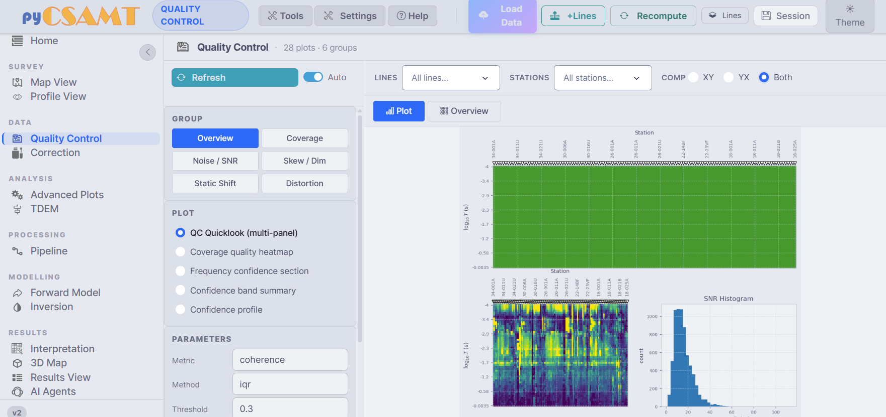

   Quality Control. The group buttons separate survey coverage, noise, skew,
   static-shift, and distortion checks; the plotted panel is where isolated bad
   stations or frequency bands become visible before correction decisions are
   made.

The plotted metrics usually start from a station-frequency response
:math:`d_{i,j,c}`, where :math:`i` indexes station, :math:`j` frequency, and
:math:`c` component. A coverage-style diagnostic counts finite values in that
grid, while confidence-style diagnostics combine noise, error bars, component
consistency, and frequency continuity into a score. A simple threshold then
acts as a mask, for example

.. math::

   M_{i,j,c} =
   \begin{cases}
   1, & q_{i,j,c} \ge q_{min},\\
   0, & q_{i,j,c} < q_{min},
   \end{cases}

where :math:`q_{i,j,c}` is the chosen quality metric. The page does not ask you
to trust the mask blindly: it puts the metric beside the survey structure, so
a low-confidence band that crosses many stations reads differently from one
isolated failing station.

* **Filters** restrict the diagnostic to selected **Lines**, **Stations**, and
  component (``XY``, ``YX``, or ``Both``).
* **Groups** organise the checks into *Overview*, *Coverage*, *Noise / SNR*,
  *Skew / Dim*, *Static Shift*, and *Distortion*.
* **Plot list** entries include *QC Quicklook (multi-panel)*, *Coverage quality
  heatmap*, *Frequency confidence section*, *Confidence band summary*, and
  *Confidence profile*.
* **Parameters** hold plot-specific choices such as metric, outlier method,
  threshold, and redraw behaviour.

QC should be read before correction. Sparse frequency coverage argues for
frequency editing; coherent station-to-station offsets point toward
static-shift review; erratic high-frequency scatter is more naturally a noise
problem. That ordering keeps later corrections from becoming a cosmetic fix
for data that should have been rejected or scoped more carefully.

Correction
----------

The **Correction** page applies pyCSAMT's catalogue of corrections as a
:term:`correction chain <Correction chain>`: 25 methods across 6 categories,
previewed before they are committed, with per-step undo.

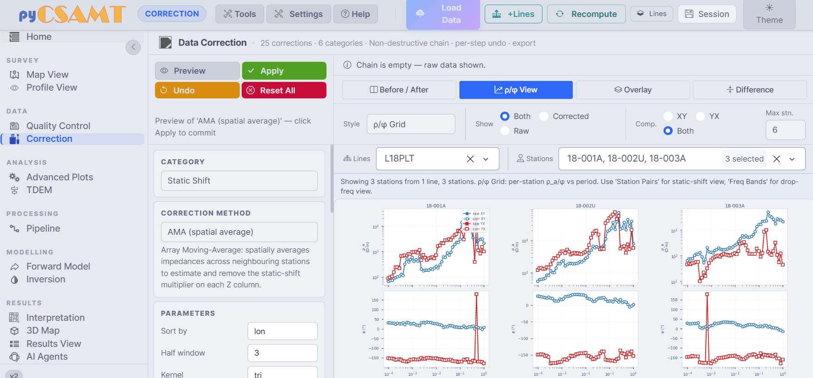

   Correction. The preview panel compares raw and corrected responses before
   the operation is added to the chain; this is the point where a useful
   correction should reduce a systematic artefact without flattening real
   station-to-station structure.

Mathematically, the page keeps the raw response :math:`d_0` separate from the
previewed response. A chain of accepted operations
:math:`C_1,\ldots,C_k` produces

.. math::

   d_k = C_k(C_{k-1}(\cdots C_1(d_0))).

Undo removes an operation from that ordered list; it does not try to reverse
an edited raw file. That distinction matters most for
:term:`static-shift correction <Static-shift correction>`, where apparent
resistivity is rescaled by a station factor while phase should remain
controlled by the inductive response. If
:math:`g_i` is the estimated static-shift factor for station :math:`i`, a
typical correction is

.. math::

   \rho'_{a,i}(f) = \frac{\rho_{a,i}(f)}{g_i}.

The page's **Before / After**, **Overlay**, and **Difference** views help check
whether :math:`g_i` removes a station offset while preserving curve shape. An
:term:`AMA` method, for example, estimates the shift from neighbouring
stations, so it is strongest when the local station is offset but the regional
trend is still shared across the line.

* **Category** and **Correction method** choose the operation, such as
  *Static Shift -> AMA (spatial average)*.
* **Parameters** capture method-specific inputs, for example sort key,
  half-window, and kernel.
* **View modes** compare raw and corrected responses as before/after panels,
  overlays, or differences.
* **Show** and **Comp** choose raw/corrected/both and ``XY``/``YX``/both
  components across a limited station count.
* **Actions** separate **Preview** from **Apply**, with **Undo** and
  **Reset All** preserving a reversible review path.

Corrected EDIs are exported from this page; see :doc:`exports`. Treat them as
derived products, not field originals.

Advanced Plots
--------------

The **Advanced Plots** page gathers survey-scale diagnostics used for
:term:`strike <Strike>`, :term:`dimensionality <Dimensionality>`, and depth
reasoning. These views are not later-stage decoration; they test whether the
assumptions behind a 1-D, 2-D, or 3-D interpretation are defensible.

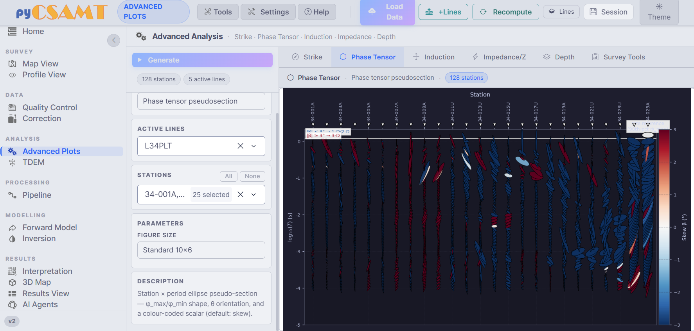

   Advanced Plots on the Phase Tensor tab. The station-by-period ellipse
   section makes skew and orientation changes visible across the line, so a
   smooth 2-D assumption can be compared against the actual survey behaviour.

The :term:`phase tensor <Phase tensor>` is especially useful because it is
insensitive to galvanic :term:`static shift <Static shift>`. If
:math:`\mathbf{Z}=\mathbf{X}+i\mathbf{Y}` is the impedance tensor, the phase
tensor is

.. math::

   \boldsymbol{\Phi} = \mathbf{X}^{-1}\mathbf{Y}.

Its ellipse orientation, ellipticity, and skew summarize how the response
changes with period. Where ellipses rotate coherently along a profile, strike
estimates are easier to defend; where skew is large or orientation changes
abruptly, a simple 2-D rotation may be hiding 3-D structure.

* **Tabs** expose *Strike*, *Phase Tensor*, *Induction*, *Impedance/Z*,
  *Depth*, and *Survey Tools*.
* **Active Lines** and **Stations** scope the diagnostic to the chosen survey
  subset.
* **Parameters** provide plot-specific inputs and figure-size presets.
* **Generate** builds the selected diagnostic and shows a short description of
  the current plot.

These are whole-survey companions to Profile View. Use them when the question
has moved from "is this station usable?" to "does the survey support the
interpretation geometry I am about to use?"

TDEM
----

The **TDEM** page handles time-domain electromagnetic data with its own folder
browser and a fixed tab bar of plot categories. Unlike MT-style frequency
responses, TDEM starts from a transient voltage or field decay after the
transmitter current changes. The interpretation still depends on diffusion:
early times mostly sample shallow structure, while later times reach deeper
but lower-amplitude responses.

* **Tabs** expose *Decay / Rho*, *Survey Section*, *Map & Overview*, and
  *Dashboard*.
* Each tab provides plot choices, figure-size presets, and colour maps.
* The folder browser points to a TDEM dataset before the selected plot is
  generated.

Read TDEM plots as time-domain diagnostics, not as another impedance plot. A
smooth decay with coherent station variation can support section or map views;
late-time oscillation, sign changes, or unstable apparent resistivity usually
needs review before inversion or interpretation.

.. _web-processing-pipeline:

Processing Pipeline
-------------------

The **Pipeline** page turns the interactive processing sequence into an
ordered, inspectable run. It is the repeatable counterpart to manually visiting
QC, frequency editing, correction, strike analysis, rotation, and export pages.
The important object is the sequence itself: if each step is represented as
:math:`P_j`, then the processed survey after :math:`k` steps is

.. math::

   \mathcal{S}^{(k)} = P_k(P_{k-1}(\cdots P_1(\mathcal{S}^{(0)}))).

The page records this chain in the progress track and output log, so the final
export can be tied back to each operation rather than only to a final figure.

.. list-table::
   :header-rows: 1
   :widths: 8 30 62

   * - #
     - Step
     - What it does
   * - 1
     - Load Data
     - Use the loaded survey, or browse to a fresh EDI folder.
   * - 2
     - QC Screening
     - Drop low-confidence frequencies by threshold.
   * - 3
     - :term:`Frequency edit`
     - Recover, trim, or mask frequencies by confidence and coverage.
   * - 4
     - Static Shift Correction
     - Apply a static-shift correction such as AMA.
   * - 5
     - :term:`Noise removal`
     - Denoise the impedance response while preserving interpretable shape.
   * - 6
     - Strike Analysis
     - Estimate geoelectric strike.
   * - 7
     - :term:`Strike rotation`
     - Rotate impedance components to the strike frame.
   * - 8
     - Export
     - Write processed EDIs and products to an export folder.

**Run Step** executes only the current step; **Run All** executes the remaining
steps in order; **Skip** advances without running; and **Reset** returns to the
start. For each step you choose a method and see a description, while the
**Log**, **Preview**, and **Status** result tabs show what happened. A message
such as ``ERROR: SVD did not converge`` is not just a software complaint; it
means the selected method and data subset did not produce a stable solve, so
parameters or prior QC decisions should be revisited before export.

Forward Modelling
-----------------

The **Forward Model** page computes synthetic responses in 1-D, 2-D, and 3-D.
It answers the forward question: if an earth model :math:`m` is assumed, what
data should the survey measure?

.. math::

   d_{pred} = F(m),

where :math:`F` is the :term:`forward operator <Forward operator>`. The page
exposes the model geometry, background resistivity, frequency sampling, and
station layout because all of them affect :math:`d_{pred}`.

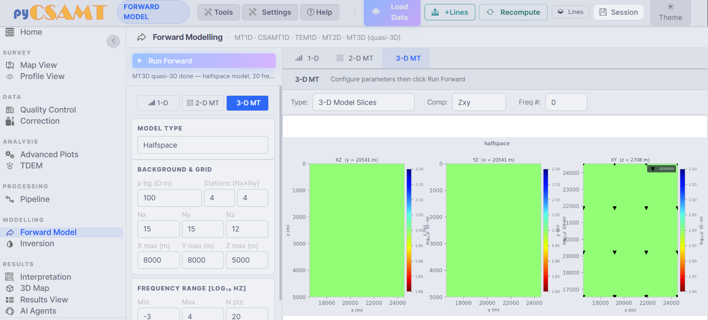

   Forward Model on the 3-D MT tab. The model slices and response controls
   make the modelling assumptions visible before the synthetic response is used
   for intuition, testing, or AI-inversion training.

* **Tabs** separate *1-D*, *2-D MT*, and *3-D MT (quasi-3D)* modelling.
* **Model Type** chooses a halfspace, layered model, or preset structure.
* **Background & Grid** define background resistivity, station layout, grid
  dimensions (``Nx x Ny x Nz``), and extents.
* **Frequency Range** defines ``log10(Hz)`` min/max and the number of sampled
  frequencies.
* **Run Forward** computes the response and draws the model and selected
  component/frequency response.

Use this page to build intuition before inversion. A conductive target,
resistive basement, or shallow layer has a recognisable response only under
the assumptions used to generate it; changing frequency range, station
spacing, or dimensionality changes the synthetic evidence.

Inversion
---------

The **Inversion** page works in the opposite direction: it estimates a model
from observed or synthetic data. All inversion families on the page are trying
to reduce some version of data mismatch while keeping the model plausible, but
they do it with different machinery.

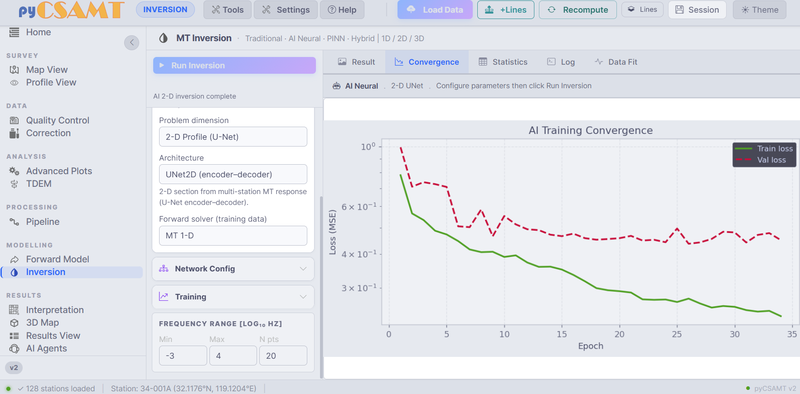

   Inversion configured for a 2-D AI-neural U-Net run. The convergence curve
   shows optimization progress; the model is not accepted until its response
   fit and residual pattern are also reviewed.

A :term:`traditional inversion <Traditional inversion>` minimizes an objective
such as

.. math::

   \Phi(m)
   =
   \|W_d(d_{obs}-F(m))\|_2^2
   +
   \lambda\|W_m(m-m_{ref})\|_2^2,

where :math:`W_d` weights data uncertainty, :math:`W_m` controls roughness or
departure from a reference model, and :math:`\lambda` balances fit against
regularity. An :term:`AI inversion` learns an inverse mapping from training
examples and must be checked against its
:term:`training distribution <Training distribution>` and
:term:`feature contract <Feature contract>`. A :term:`PINN` adds a physics
residual to the neural loss, and a :term:`hybrid inversion <Hybrid inversion>`
uses an AI estimate together with a physics-based refinement.

* **Problem dimension** selects a 1-D, 2-D, or 3-D formulation, such as
  *2-D Profile (U-Net)*.
* **Architecture** chooses the network or solver, for example
  *UNet2D (encoder-decoder)*.
* **Forward solver (training data)** declares the physics used to generate
  training responses.
* **Network Config** and **Training** hold architecture and optimization
  settings.
* **Frequency Range** fixes the band used in the inversion.
* **Result tabs** separate *Result*, *Convergence*, *Statistics*, *Log*, and
  *Data Fit*.
* **Run Inversion** starts the run.

Read :term:`training convergence <Training convergence>` as an optimization
diagnostic, not as final geological proof. A smooth loss curve means the
optimiser found a lower-loss solution under the declared setup. The next
question is :term:`data fit <Data fit>`: do the predicted apparent resistivity
and phase match observations within the assigned errors, and are residuals
random rather than systematic?

Results View
------------

The **Results View** page, labelled *Inversion Results Viewer* in the app,
browses, inspects, and exports outputs from external solvers:
:term:`ModEM`, :term:`Occam2D`, and :term:`MARE2DEM`.

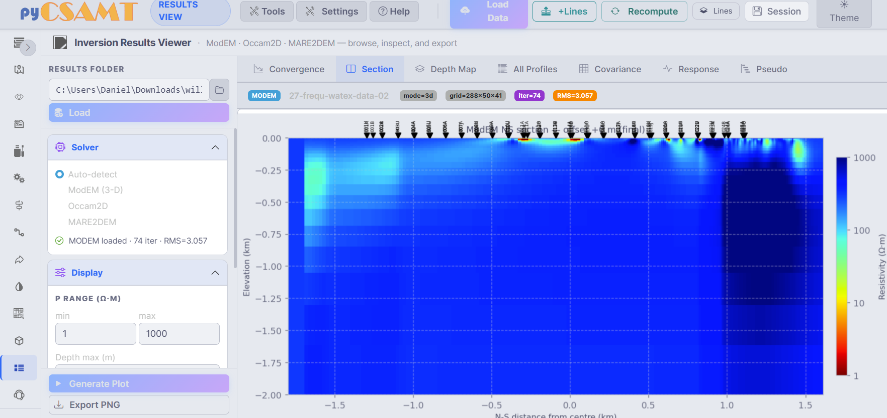

   Results View on the Section tab. The resistivity section is easier to read
   beside the solver metadata because iteration count, RMS, grid, and loaded
   solver all affect how much confidence the section deserves.

* **Results Folder** points to a solver output folder and **Load** imports it.
* **Solver** can auto-detect the engine or force *ModEM (3-D)*, *Occam2D*, or
  *MARE2DEM*.
* **Tabs** expose *Convergence*, *Section*, *Depth Map*, *All Profiles*,
  *Covariance*, *Response*, and *Pseudo*.
* **Display** controls resistivity range and maximum depth.
* **Generate Plot** redraws with the current settings; **Export PNG** saves
  the figure.

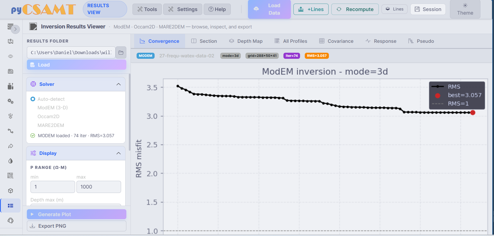

   The Convergence tab shows :term:`RMS misfit` versus iteration. A falling
   curve toward the RMS=1 target suggests the model is fitting within assigned
   uncertainty; a stalled or rising curve usually points to the data errors,
   starting model, regularization, or physics assumptions.

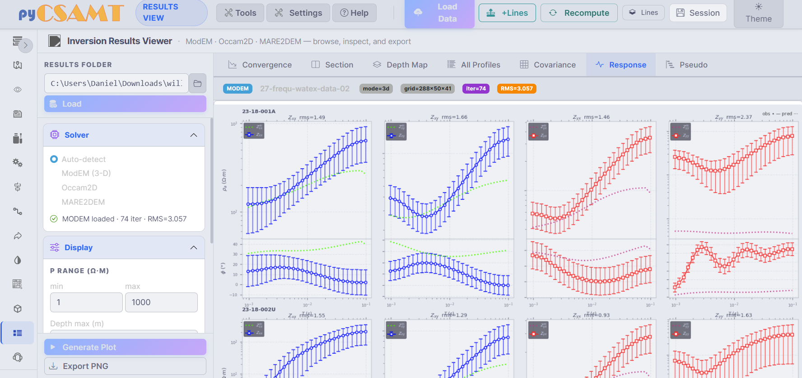

   The Response tab compares observed and predicted apparent resistivity and
   phase. Station-level RMS values are useful, but the curve shapes matter:
   repeated residual structure across frequency or component is stronger
   evidence of model mismatch than one isolated noisy point.

The results viewer is where visual interpretation and numerical fit meet. A
section can look geologically attractive while still fitting one mode poorly;
the convergence and response tabs are there to keep the story honest.

Interpretation
--------------

The **Interpretation** page turns processed data and models into geological,
hydrological, diagnostic, and export products. It contains 42 workflows across
9 categories, but the working logic remains the same: choose the evidence
source, choose the analysis, set display or export options, and generate a
traceable product.

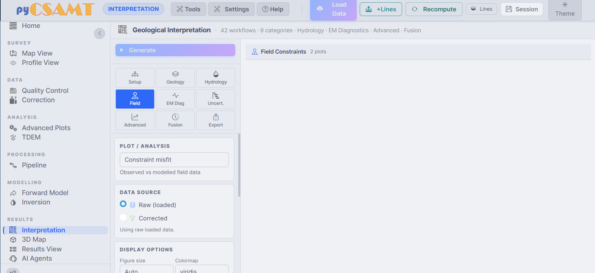

   Interpretation. The page keeps the data source and display controls beside
   the generated view so the reader can tell whether an interpretation was made
   from raw, corrected, modelled, or exported evidence.

* **Categories** include *Setup*, *Geology*, *Hydrology*, *Field*, *EM Diag*,
  *Uncert.*, *Advanced*, *Fusion*, and *Export*.
* **Plot / Analysis** chooses the workflow, for example *Constraint misfit -
  observed vs modelled field data*.
* **Data source** selects *Raw (loaded)* or *Corrected*.
* **Display options** control figure size, colour map, and workflow-specific
  parameters.
* **Generate** builds the product; **Export** saves interpretation outputs.

Interpretation products should remain tied to their inputs. When a workflow
uses a calibrated model, borehole constraint, or uncertainty setting, the
exported product belongs with that evidence and with
:term:`provenance manifest <Provenance manifest>`; otherwise a reviewer cannot
tell whether a geological label came from data, model calibration, or
presentation choice.

AI Agents
---------

The **AI Agents** page exposes pyCSAMT's agents in two modes: a direct
**Agent Runner** and a conversational **Chat** assistant over the loaded
survey. Agents do not replace the processing pages; they orchestrate the same
operations and report the result as a run history, log, summary, and optional
figure.

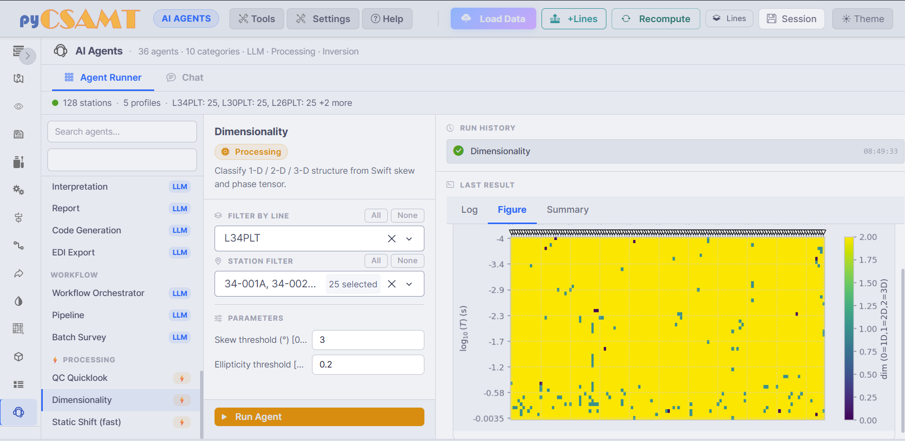

   Agent Runner. Search and pick an agent, scope it by line and station, set
   parameters, and run it; the right-hand panel keeps the latest log, figure,
   and summary together.

The agent list is grouped into LLM agents, workflow agents, and processing
agents. Selecting an :term:`Agent` reveals its description, line and station
filters, and parameters. After **Run Agent**, the run history records what ran
and the last-result panel shows the evidence the agent produced. A
dimensionality agent, for example, should be judged against the same skew,
phase-tensor, and impedance evidence you would inspect manually.

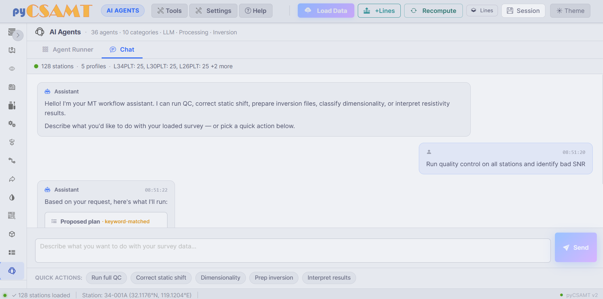

   The Chat tab. Natural-language requests are converted into runnable plans;
   quick actions cover common QC, correction, dimensionality, inversion-prep,
   and interpretation workflows.

Type a request such as ``Run quality control on all stations and identify bad
SNR`` and the assistant proposes a runnable plan. LLM-backed features need an
:term:`LLM provider` and API key configured in the **Settings** drawer; the
non-LLM processing agents can still run deterministic package workflows when
they do not need language-model reasoning. For a dedicated, full-screen
conversational surface, use :doc:`Agent Master <../agent_master/index>`.

Tools
-----

The **Tools** menu on the command bar collects standalone utilities that open
in their own drawer. They are independent of the current page but still read
from the :term:`active survey <Active survey>`.

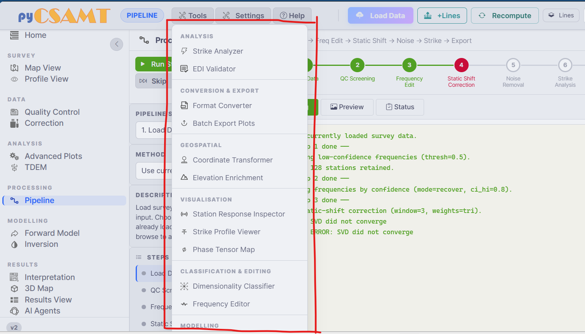

   The Tools menu groups focused utilities by purpose, so quick validation,
   conversion, geospatial, and visualisation tasks can be run without changing
   the main processing page.

.. list-table::
   :header-rows: 1
   :widths: 28 72

   * - Group
     - Tools
   * - Analysis
     - Strike Analyzer, EDI Validator
   * - Conversion & Export
     - Format Converter, Batch Export Plots
   * - Geospatial
     - Coordinate Transformer, Elevation Enrichment
   * - Visualisation
     - Station Response Inspector, Strike Profile Viewer, Phase Tensor Map
   * - Classification & Editing
     - Dimensionality Classifier, Frequency Editor
   * - Modelling
     - Modelling utilities

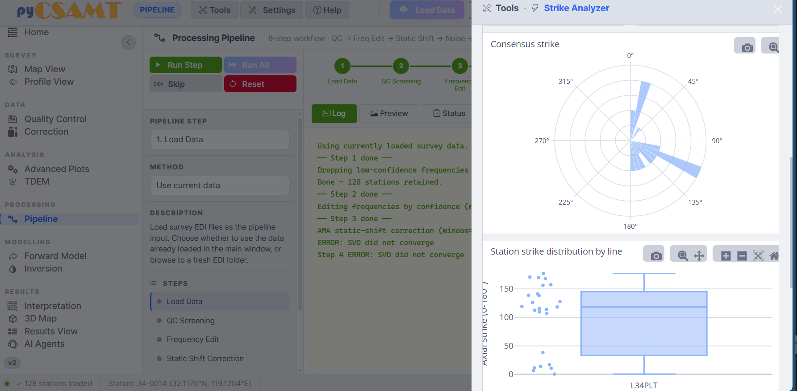

   The Strike Analyzer tool compares consensus strike with per-line
   distributions. Agreement across lines supports a shared rotation; strong
   line-to-line disagreement is a warning to inspect dimensionality before
   applying one strike angle everywhere.

The **Batch Export Plots** tool is the fastest way to export many figures at
once; see :doc:`exports`.

How Pages Delegate To The Package
---------------------------------

None of these pages implement science of their own. A control change updates a
:term:`Dash` store, and the primary-action callback calls the matching
``pycsamt.app.desktop.controllers`` function. In reproducibility terms, the
browser state is only the interface layer; the scientific record is the input
survey, selected mask, method, parameters, package version, output files, and
run log. This is why a survey processed in the web app can be picked up
unchanged in the desktop app or in a script.

Next Steps
----------

* :doc:`exports` -- save figures, corrected EDIs, and inversion products.
* :doc:`maps_and_profiles` -- the spatial views that precede processing.
* :doc:`troubleshooting` -- when a page is blank, a run fails, or an agent
  errors.
