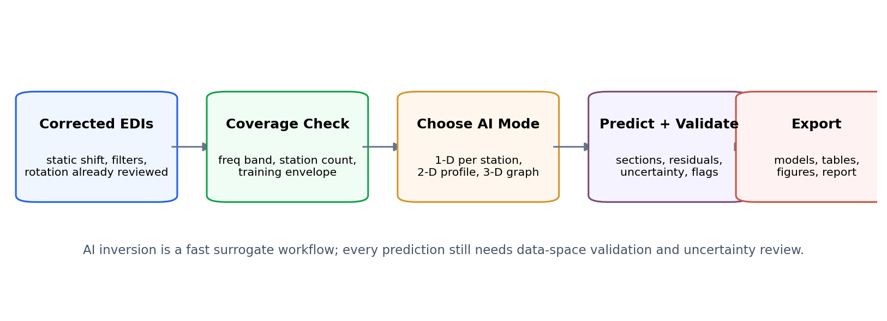
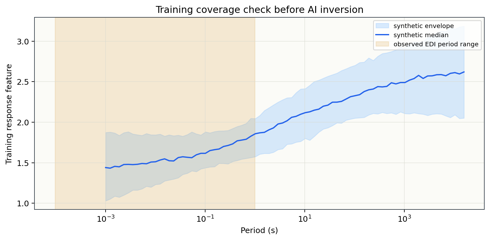
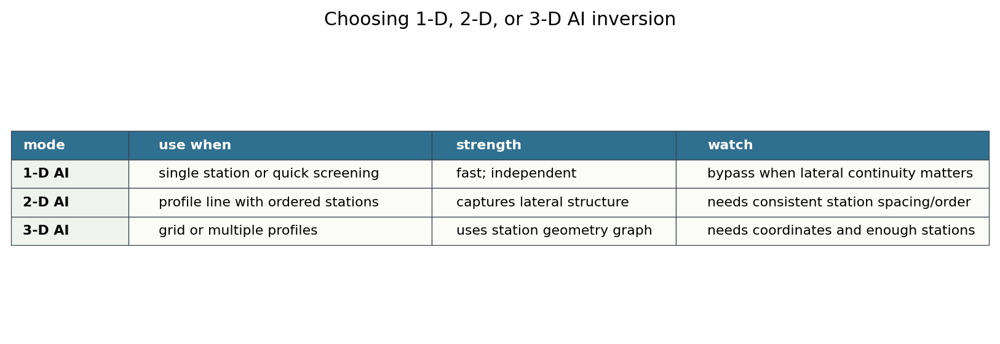
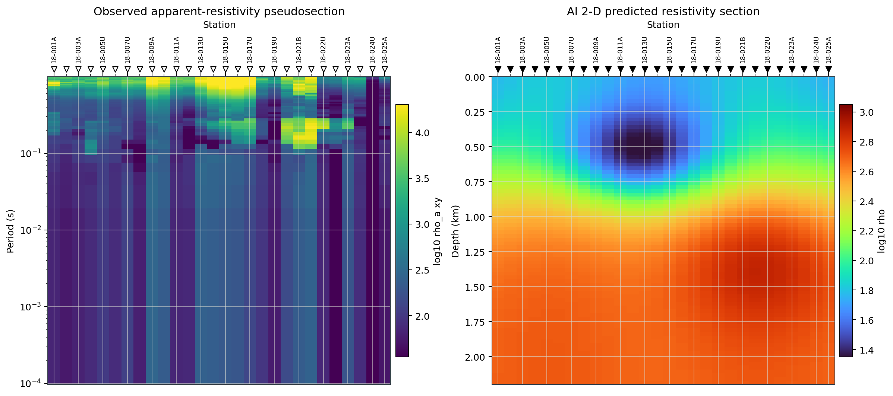
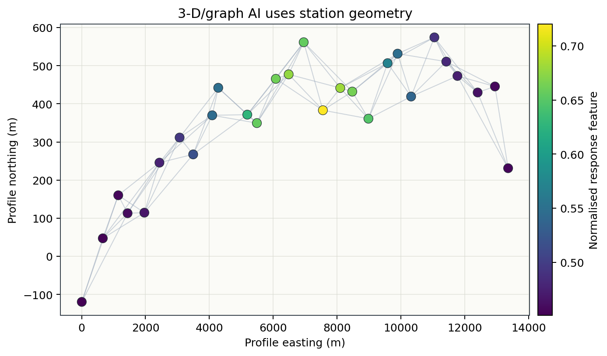
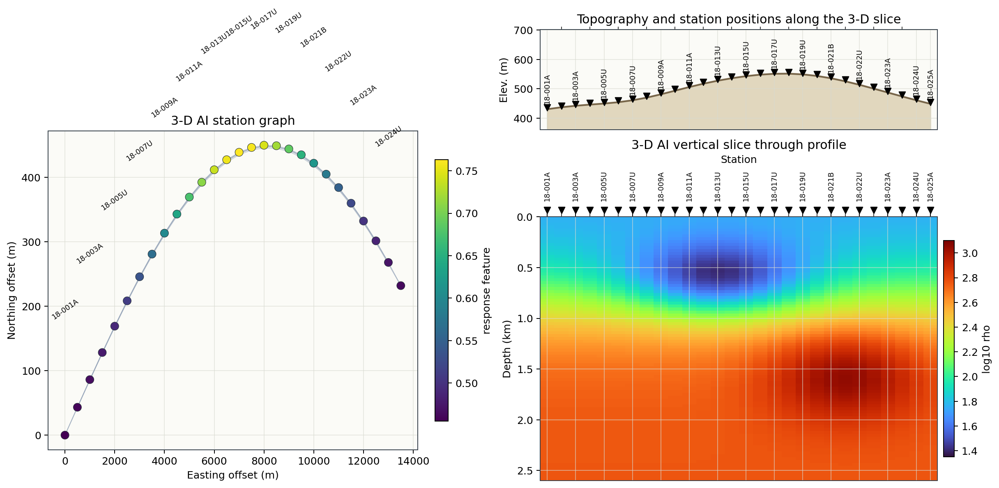
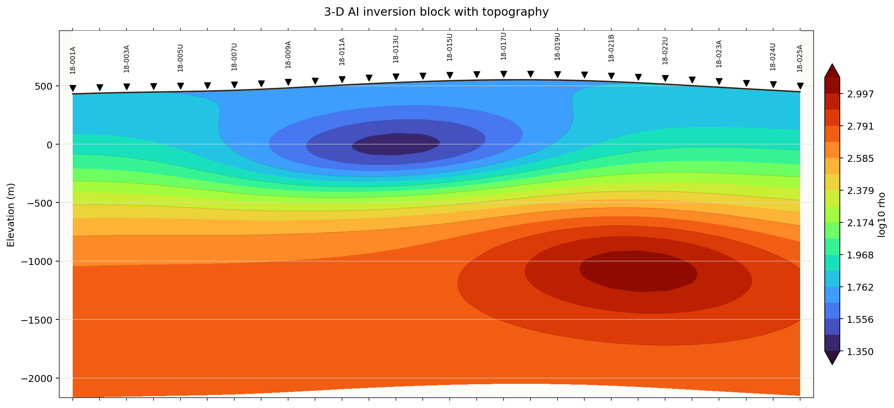
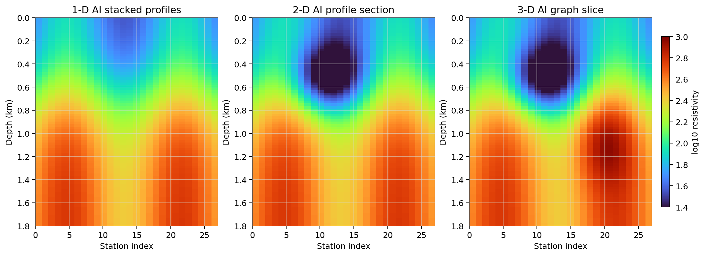
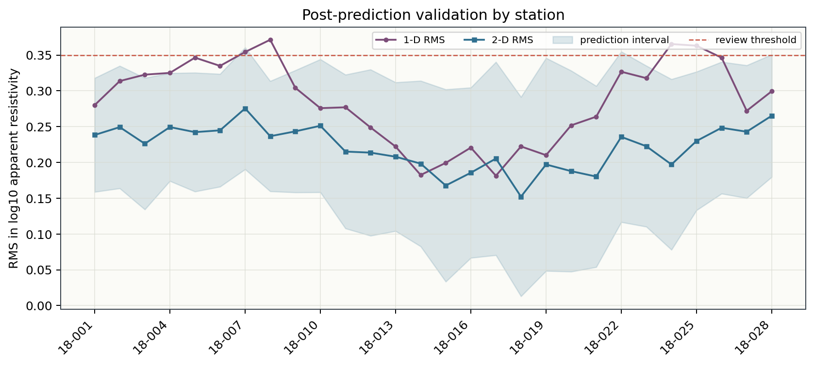

.. _tutorial_ai_inversion_from_corrected_edis:

AI Inversion From Corrected EDIs
================================

This tutorial starts where the processing tutorials end: you already have a
folder of corrected EDI files and you want to use AI inversion instead of a
classical Occam2D, ModEM, or MARE2DEM run.

The example uses the bundled ``L18PLT`` line as if it were already corrected:

``data/AMT/WILLY_DATA/L18PLT``

In a real project, replace that path with your exported corrected EDI folder,
for example ``results/L18PLT_first_qc/processed`` or
``results/L18PLT_rotated_edis``.

What You Will Learn
-------------------

After this tutorial you should be able to:

- verify that corrected EDIs are ready for AI inversion;
- decide whether to run 1-D, 2-D, or 3-D AI inversion;
- optionally bypass 1-D and go directly to 2-D or 3-D;
- train from synthetic forward models or load a pretrained model;
- run the AI agents from Python;
- validate predictions with residuals and uncertainty, not only images.

AI Inversion Is Not a Replacement for QC
----------------------------------------

AI inversion is a fast surrogate workflow. It still needs:

- corrected or at least reviewed EDI data;
- a frequency band inside the training distribution;
- enough stations for the chosen dimensionality;
- uncertainty or residual checks after prediction;
- a scientific reason for choosing 1-D, 2-D, or 3-D.

Load Corrected EDIs
-------------------

For this tutorial, ``L18PLT`` stands in for corrected EDIs:

.. code-block:: python
   :linenos:

   from pathlib import Path

   from pycsamt.api import read_edis

   edi_dir = Path("data/AMT/WILLY_DATA/L18PLT")
   survey = read_edis(
       edi_dir,
       recursive=False,
       strict=False,
       on_dup="replace",
       progress=False,
   )
   sites = survey.collection

   print(survey.summary())

Example output:

.. code-block:: text

   APIFrame: edi_survey_summary
   kind: edi.summary
   shape: 28 rows x 6 columns
   columns: station, path, n_freq, tipper, spectra, ts
   numeric: 1 columns
   missing: 0.0%
   source: data/AMT/WILLY_DATA/L18PLT

Confirm the data are regular enough for inversion:

.. code-block:: text

      station  n_freq  tipper  spectra
   23-18-001A      53   False    False
   23-18-002U      53   False    False
   23-18-003A      53   False    False
   23-18-004A      53   False    False
   23-18-005U      53   False    False

Final Readiness Check
---------------------

Before AI inversion, build QC and confidence tables. The purpose is not to
redo all processing; it is to prove that the data handed to the AI model are
finite, covered, and inside the frequency range you intend to train on.

.. code-block:: python
   :linenos:

   from pycsamt.emtools.qc import build_qc_table, station_confidence_table

   qc = build_qc_table(
       sites,
       include_skew=True,
       recursive=False,
       api=True,
   ).to_pandas(copy=True)

   confidence = station_confidence_table(
       sites,
       method="composite",
       recursive=False,
       api=True,
   ).to_pandas(copy=True)

   print(qc[["station", "n_freq", "frac_ok", "snr_med", "pmin", "pmax"]].head())
   print(confidence[["station", "confidence", "coverage", "offdiag", "phase"]].head())

Example output:

.. code-block:: text

   station  n_freq  frac_ok  snr_med     pmin  pmax
   18-001A      53        1     17.7 9.62e-05 0.992
   18-002U      53        1     16.7 9.62e-05 0.992
   18-003A      53        1       12 9.62e-05 0.992
   18-004A      53        1     10.4 9.62e-05 0.992
   18-005U      53        1     14.4 9.62e-05 0.992

   station  confidence  coverage  offdiag  phase
   18-001A       0.709     1.000    0.462  0.976
   18-002U       0.775     1.000    0.551  0.977
   18-003A       0.713     1.000    0.452  0.972
   18-004A       0.732     1.000    0.624  0.968
   18-005U       0.771     1.000    0.603  0.971

Check that your observed period range is covered by the synthetic training
distribution. If observed data sit outside the envelope, expand the synthetic
model priors before trusting predictions.

.. code-block:: python
   :linenos:

   import matplotlib.pyplot as plt
   import numpy as np

   periods = np.logspace(-3, 4.2, 80)
   station_pmin = qc["pmin"].to_numpy(dtype=float)
   station_pmax = qc["pmax"].to_numpy(dtype=float)
   observed_lo = np.nanmin(station_pmin)
   observed_hi = np.nanmax(station_pmax)

   # Replace this envelope with features from your synthetic training library.
   curves = []
   rng = np.random.default_rng(42)
   for _ in range(120):
       center = rng.uniform(-0.5, 2.2)
       amp = rng.uniform(0.15, 0.55)
       slope = rng.uniform(-0.10, 0.24)
       curves.append(
           2.0
           + slope * np.log10(periods)
           + amp * np.tanh((np.log10(periods) - center) / 1.1)
       )
   p10, p50, p90 = np.percentile(np.vstack(curves), [10, 50, 90], axis=0)

   fig, ax = plt.subplots(figsize=(10, 4))
   ax.fill_between(periods, p10, p90, alpha=0.35, label="training envelope")
   ax.plot(periods, p50, lw=1.6, label="training median")
   ax.axvspan(observed_lo, observed_hi, alpha=0.18, label="observed range")
   ax.set_xscale("log")
   ax.set_xlabel("Period (s)")
   ax.set_ylabel("Training response feature")
   ax.legend()
   fig.savefig("ai_training_coverage.png", dpi=180, bbox_inches="tight")

Choose 1-D, 2-D, or 3-D AI Inversion
------------------------------------

You do not have to run every mode. Choose the mode that matches the geology
and survey geometry.

Use 1-D AI when:

- you want a rapid station-by-station screening;
- the line is approximately layered;
- lateral continuity is not the main question.

Bypass 1-D and use 2-D AI when:

- the line has clear lateral structure;
- stations form an ordered profile;
- your output needs to be a section, not independent soundings.

Use 3-D AI when:

- you have multiple lines or a station grid;
- station coordinates matter;
- you want spatial graph context or a volume-style interpretation.

Run Optional 1-D AI
------------------

The 1-D agent trains a neural inverter on synthetic 1-D forward models, then
predicts one layered model per station.

.. code-block:: python
   :linenos:

   from pycsamt.agents.ai_inversion import AIInversionAgent

   agent = AIInversionAgent(
       arch="resnet",
       n_layers=5,
       n_train_samples=2000,
       epochs=30,
   )

   result = agent.execute(
       {
           "sites": sites,
           "output_dir": "results/L18PLT_ai_1d",
       }
   )

   print(result.status)
   print(result.summary)
   print(result.data["rms_global"])

For a pretrained model, use a checkpoint instead of training from scratch:

.. code-block:: python
   :linenos:

   from pycsamt.ai.inversion import EMInverter1D

   inv = EMInverter1D.from_pretrained("mt1d-resnet-5layer-v1")
   predicted_models = inv.predict_models([site.Z for site in sites])

Use 1-D output as a screening product. If adjacent stations produce a jagged
section while the geology should be laterally coherent, move to 2-D AI.

Run 2-D AI Directly
-------------------

For a line profile, you may skip 1-D and use the U-Net 2-D agent directly:

.. code-block:: python
   :linenos:

   from pycsamt.agents.inv2d_agent import Inv2DAgent

   agent = Inv2DAgent(
       n_depth=40,
       n_freqs=32,
       n_train_profiles=200,
       n_stations_per_profile=28,
       epochs=30,
   )

   result = agent.execute(
       {
           "sites": sites,
           "output_dir": "results/L18PLT_ai_2d",
       }
   )

   section = result.data["pred_section"]
   depths_km = result.data["depths_km"]
   station_names = result.data["station_names"]

   print(result.summary)

The 2-D agent uses the whole profile as an image-like tensor
``components x frequencies x stations`` and predicts a
``depth x stations`` resistivity section.

The most useful 2-D diagnostic is a side-by-side grid: observed data on the
left and AI model on the right. Both panels should keep the same station order
and station markers so that anomalies can be traced from data space into model
space.

.. code-block:: python
   :linenos:

   import matplotlib.pyplot as plt
   import numpy as np

   from pycsamt.api.station import PYCSAMT_STATION_RENDERING

   labels = [str(getattr(site, "station", i)) for i, site in enumerate(sites)]
   periods_ref = None
   pseudo_columns = []

   for site in sites:
       freq = np.asarray(site.Z.freq, dtype=float)
       zxy = np.asarray(site.Z.z, dtype=complex)[:, 0, 1]
       period = 1.0 / np.maximum(freq, 1e-30)
       rho_xy = 0.2 * np.abs(zxy) ** 2 / np.maximum(freq, 1e-30)
       order = np.argsort(period)
       period = period[order]
       log_rho = np.log10(np.clip(rho_xy[order], 1e-12, None))
       if periods_ref is None:
           periods_ref = period
       pseudo_columns.append(
           np.interp(np.log10(periods_ref), np.log10(period), log_rho)
       )

   observed = np.asarray(pseudo_columns).T
   x = np.arange(len(labels), dtype=float)

   # In a real run, use result.data["pred_section"] and result.data["depths_km"].
   depths_km = np.linspace(0.0, 2.2, 82)
   xx, zz = np.meshgrid(x, depths_km * 1000.0)
   section = 2.22 + 0.48 * np.tanh((zz - 720.0) / 460.0)
   section -= 0.68 * np.exp(-((xx - 11.5) ** 2 / 34.0 + (zz - 560.0) ** 2 / 105000.0))

   fig, axes = plt.subplots(1, 2, figsize=(13, 5.6), constrained_layout=True)
   im0 = axes[0].imshow(
       observed,
       aspect="auto",
       origin="lower",
       extent=(-0.5, len(labels) - 0.5, periods_ref.min(), periods_ref.max()),
       cmap="viridis",
   )
   axes[0].set_yscale("log")
   axes[0].set_ylabel("Period (s)")
   axes[0].set_title("Observed apparent-resistivity pseudosection")
   PYCSAMT_STATION_RENDERING.apply(axes[0], x, labels, preset="pseudosection")
   fig.colorbar(im0, ax=axes[0], label="log10 rho_a xy")

   im1 = axes[1].imshow(
       section,
       aspect="auto",
       origin="upper",
       extent=(-0.5, len(labels) - 0.5, depths_km.max(), 0.0),
       cmap="turbo",
   )
   axes[1].set_ylabel("Depth (km)")
   axes[1].set_title("AI 2-D predicted resistivity section")
   PYCSAMT_STATION_RENDERING.apply(axes[1], x, labels, preset="inversion")
   fig.colorbar(im1, ax=axes[1], label="log10 rho")
   fig.savefig("ai_2d_pseudosection_model_grid.png", dpi=180, bbox_inches="tight")

Interpret this grid from left to right:

- first check whether the pseudosection anomaly is supported by several
  neighbouring stations, not a single isolated station;
- then check whether the AI model places a coherent body beneath the same
  station interval;
- finally check whether station markers and labels align between panels.
  A shifted station order is a processing error, not geology.

Run 3-D AI When Geometry Matters
--------------------------------

The 3-D agent uses a graph-convolutional network. Each station is a graph node;
edges connect nearby stations. This is useful for multiple lines or irregular
station layouts.

.. code-block:: python
   :linenos:

   import numpy as np

   from pycsamt.agents.inv3d_agent import Inv3DAgent

   coords = np.column_stack(
       [
           np.arange(len(sites), dtype=float) * 200.0,
           np.zeros(len(sites), dtype=float),
       ]
   )

   agent = Inv3DAgent(
       n_layers=5,
       n_freqs=32,
       n_train_profiles=150,
       epochs=30,
       radius=600.0,
       n_mc=20,
   )

   result = agent.execute(
       {
           "sites": sites,
           "coords": coords,
           "output_dir": "results/L18PLT_ai_3d",
       }
   )

   pred_rho = result.data["pred_rho"]
   uncertainty = result.data["pred_uncertainty"]
   adjacency = result.data["adjacency"]

Use real station coordinates when available. The simple coordinate array above
is only a profile fallback.

For 3-D or graph AI, first show the station graph next to a representative
vertical slice. Keeping the topographic profile visible above the flat-depth
slice is useful while teaching the geometry: the reader can verify station
order, surface relief, and the profile slice before moving to the final
topography-aware model block.

.. code-block:: python
   :linenos:

   import matplotlib.pyplot as plt
   import numpy as np

   from pycsamt.api.station import PYCSAMT_STATION_RENDERING

   labels = [str(getattr(site, "station", i)) for i, site in enumerate(sites)]
   n = len(labels)
   profile_x = np.arange(n, dtype=float)

   # Use real easting/northing and elevation when available.
   east = np.linspace(0.0, 13_500.0, n)
   north = 450.0 * np.sin(np.linspace(0.0, 2.6, n))
   topo_m = 420.0 + 95.0 * np.sin(np.linspace(0.15, 2.9, n))
   topo_m += 42.0 * np.exp(-((profile_x - 18.0) ** 2) / 42.0)

   depths_km = np.linspace(0.0, 2.6, 90)
   xx, zz = np.meshgrid(profile_x, depths_km * 1000.0)
   section = 2.24 + 0.52 * np.tanh((zz - 800.0) / 520.0)
   section -= 0.62 * np.exp(-((xx - 12.0) ** 2 / 38.0 + (zz - 620.0) ** 2 / 130000.0))

   fig = plt.figure(figsize=(13.4, 6.4), constrained_layout=True)
   gs = fig.add_gridspec(1, 2, width_ratios=[1.0, 1.35])
   ax_graph = fig.add_subplot(gs[0, 0])
   right = gs[0, 1].subgridspec(2, 1, height_ratios=[0.38, 1.0])
   ax_topo = fig.add_subplot(right[0, 0])
   ax_sec = fig.add_subplot(right[1, 0], sharex=ax_topo)

   for i in range(n):
       dist = np.hypot(east - east[i], north - north[i])
       for j in np.where((dist > 0.0) & (dist < 1800.0))[0]:
           if j > i:
               ax_graph.plot([east[i], east[j]], [north[i], north[j]], color="0.65", lw=0.75)
   ax_graph.scatter(east, north, c=np.linspace(0, 1, n), cmap="viridis", s=60)
   ax_graph.set_title("3-D AI station graph")
   ax_graph.set_xlabel("Easting offset (m)")
   ax_graph.set_ylabel("Northing offset (m)")

   ax_topo.fill_between(profile_x, topo_m.min() - 70.0, topo_m, color="#d7c8a6")
   ax_topo.plot(profile_x, topo_m, color="#78664a", lw=1.7)
   PYCSAMT_STATION_RENDERING.style_for("inversion").apply(
       ax_topo, profile_x, labels, topo_elev=topo_m
   )

   im = ax_sec.imshow(
       section,
       aspect="auto",
       origin="upper",
       extent=(-0.5, n - 0.5, depths_km.max(), 0.0),
       cmap="turbo",
   )
   PYCSAMT_STATION_RENDERING.apply(ax_sec, profile_x, labels, preset="inversion")
   ax_sec.set_ylabel("Depth (km)")
   fig.colorbar(im, ax=ax_sec, label="log10 rho")
   fig.savefig("ai_3d_graph_slice_grid.png", dpi=180, bbox_inches="tight")

Read the 3-D grid in three steps. The map panel shows which stations exchange
information through the graph. The topography strip confirms where stations sit
on the terrain surface. The section panel then shows the predicted resistivity
slice along the same station order. If a feature appears where the graph is
sparse, mark it as lower confidence until it is checked with neighbouring
lines, uncertainty, or a classical inversion.

Embed Topography in the 3-D Inversion Block
-------------------------------------------

For the final interpretation figure, recompute the section in elevation
coordinates instead of drawing the model below a flat zero-depth line. Each
station column starts at its own surface elevation, the air above the terrain is
blank, and the resistivity block follows the topographic surface. This is the
style to use for a report-ready inversion section when topography is important.

.. code-block:: python
   :linenos:

   import matplotlib.pyplot as plt
   import numpy as np

   from pycsamt.api.station import PYCSAMT_STATION_RENDERING

   labels = [str(getattr(site, "station", i)) for i, site in enumerate(sites)]
   n = len(labels)
   x = np.arange(n, dtype=float)

   # Replace this with surveyed elevation, DEM samples, or topography from EDI metadata.
   topo_m = 420.0 + 95.0 * np.sin(np.linspace(0.15, 2.9, n))
   topo_m += 42.0 * np.exp(-((x - 18.0) ** 2) / 42.0)
   topo_m -= 26.0 * np.exp(-((x - 6.0) ** 2) / 18.0)

   # Use result.data["pred_rho"] or a selected 3-D slice in a real project.
   depths_m = np.linspace(0.0, 2600.0, 90)
   xx, zz = np.meshgrid(x, depths_m)
   log_rho = 2.24 + 0.52 * np.tanh((zz - 800.0) / 520.0)
   log_rho -= 0.62 * np.exp(-((xx - 12.0) ** 2 / 38.0 + (zz - 620.0) ** 2 / 130000.0))
   log_rho += 0.34 * np.exp(-((xx - 21.0) ** 2 / 28.0 + (zz - 1550.0) ** 2 / 210000.0))

   # This is the key step: recompute z as elevation below each station surface.
   x_grid = np.tile(x[None, :], (depths_m.size, 1))
   elev_grid = topo_m[None, :] - depths_m[:, None]

   fig, ax = plt.subplots(figsize=(12.8, 5.8), constrained_layout=True)
   levels = np.linspace(1.35, 3.1, 18)
   im = ax.contourf(x_grid, elev_grid, log_rho, levels=levels, cmap="turbo", extend="both")
   ax.contour(x_grid, elev_grid, log_rho, levels=levels[::2], colors="k", linewidths=0.28, alpha=0.3)
   ax.fill_between(x, topo_m, topo_m.max() + 420.0, color="white", zorder=4)
   ax.plot(x, topo_m, color="#2f2419", lw=1.5, zorder=6)
   PYCSAMT_STATION_RENDERING.style_for("inversion").apply(
       ax, x, labels, topo_elev=topo_m, xlim=(-0.5, n - 0.5)
   )
   ax.set_ylim(topo_m.min() - depths_m.max(), topo_m.max() + 420.0)
   ax.set_ylabel("Elevation (m)")
   ax.set_title("3-D AI inversion block with topography")
   fig.colorbar(im, ax=ax, label="log10 rho")
   fig.savefig("ai_3d_topography_inversion_block.png", dpi=180, bbox_inches="tight")

Interpret this figure from the surface downward. A shallow conductor or
resistor is more reliable when it remains coherent below several neighbouring
stations and does not simply mimic a sharp topographic break. When replacing
the tutorial data, use the exported topographic elevations from the real survey
so ``z`` is recomputed from station elevation rather than from a constant datum.

Compare the Modes
-----------------

The same corrected EDI folder can support several AI products. The figure
below is a teaching schematic: 1-D gives independent station profiles, 2-D
uses profile continuity, and 3-D uses station geometry.

Validate the Predictions
------------------------

After prediction, do not stop at the resistivity image. Review:

- station-level residuals;
- model uncertainty or ensemble spread;
- stations outside the synthetic training envelope;
- disagreement between 1-D and 2-D/3-D products;
- geological plausibility.

.. code-block:: python
   :linenos:

   rms = result.data.get("rms_global")
   per_station = result.data.get("rms_per_station", {})

   bad = {
       station: value
       for station, value in per_station.items()
       if value > 0.35
   }
   print("global RMS:", rms)
   print("stations to review:", bad)

Plot the same residual review as a station-by-station diagnostic:

.. code-block:: python
   :linenos:

   import matplotlib.pyplot as plt
   import numpy as np

   station_names = result.data.get(
       "station_names",
       [str(getattr(site, "station", i)) for i, site in enumerate(sites)],
   )
   x = np.arange(len(station_names), dtype=float)

   # Replace these arrays with result.data values when your agent returns them.
   rms_1d = np.asarray(result.data.get("rms_1d", 0.28 + 0.08 * np.sin(x / 3.0)))
   rms_2d = np.asarray(result.data.get("rms_2d", 0.22 + 0.04 * np.sin(x / 4.0 + 0.5)))
   uncert = np.asarray(result.data.get("pred_uncertainty_1d", 0.08 + 0.06 * np.exp(-((x - 17.0) ** 2) / 45.0)))

   fig, ax = plt.subplots(figsize=(11, 4.2))
   ax.plot(x, rms_1d, marker="o", ms=3, label="1-D RMS")
   ax.plot(x, rms_2d, marker="s", ms=3, label="2-D RMS")
   ax.fill_between(x, rms_2d - uncert, rms_2d + uncert, alpha=0.16, label="prediction interval")
   ax.axhline(0.35, ls="--", lw=1.0, color="tab:red", label="review threshold")
   ax.set_xticks(x[::3])
   ax.set_xticklabels(station_names[::3], rotation=45, ha="right")
   ax.set_ylabel("RMS in log10 apparent resistivity")
   ax.set_title("Post-prediction validation by station")
   ax.legend(ncol=4, fontsize=8)
   fig.savefig("ai_validation_residuals.png", dpi=180, bbox_inches="tight")

Save a Reproducible Output Folder
---------------------------------

For each AI run, keep:

- the corrected EDI input path;
- the training frequency grid and model priors;
- the trained checkpoint or pretrained model name;
- prediction tables;
- RMS and uncertainty tables;
- figures;
- a short decision note explaining why 1-D, 2-D, or 3-D was used.

Suggested folders:

.. code-block:: text

   results/
     L18PLT_ai_1d/
       ai_inverter_resnet.pkl
       ai_model_section.png
       rms_by_station.csv
     L18PLT_ai_2d/
       inv2d_section.png
       pred_section.npy
       station_names.txt
     L18PLT_ai_3d/
       graph_adjacency.npy
       pred_rho.npy
       pred_uncertainty.npy

Recommended Decision
--------------------

For a corrected single profile such as ``L18PLT``:

- run 1-D AI only if you want fast station screening;
- prefer 2-D AI for the main profile interpretation;
- use 3-D AI only when coordinates, multiple lines, or irregular geometry
  justify graph context;
- compare AI results with at least one classical or physics-based check before
  publication.

See Also
--------

:doc:`condition_mt_line_with_tipper_and_rotation`
    Prepare corrected MT data before AI or classical inversion.

:doc:`prepare_occam2d_inversion`
    Classical Occam2D input preparation for comparison.

:doc:`run_pipeline_from_config`
    Store repeatable preprocessing before the AI inversion step.

:doc:`../user_guide/ai_inversion/index`
    Full AI inversion user guide.
