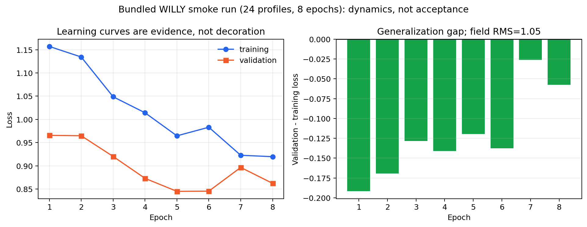
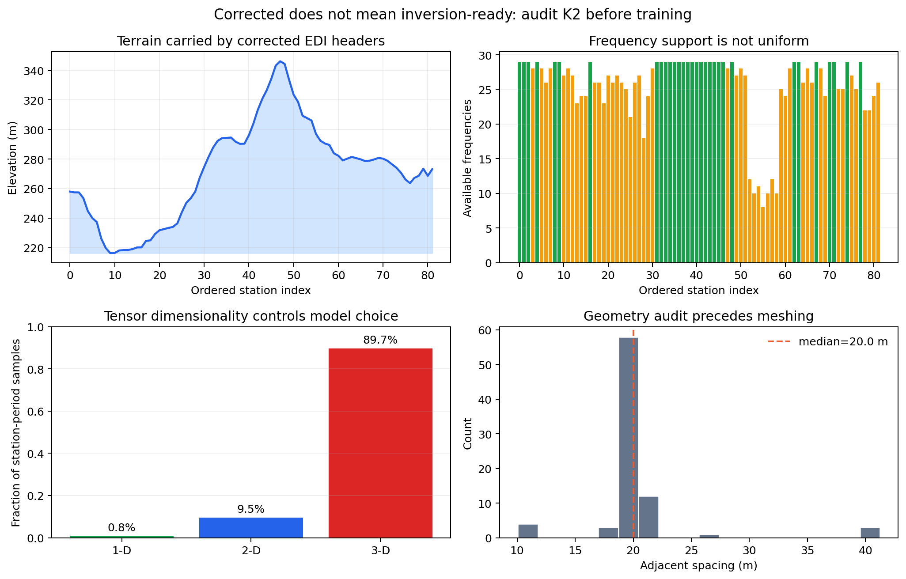
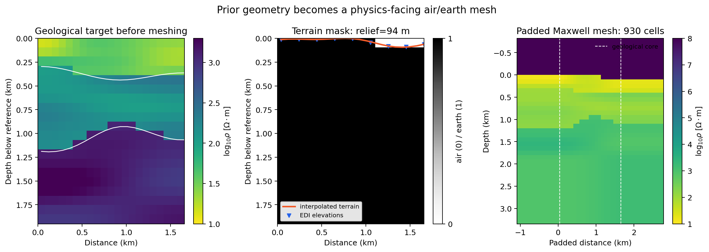
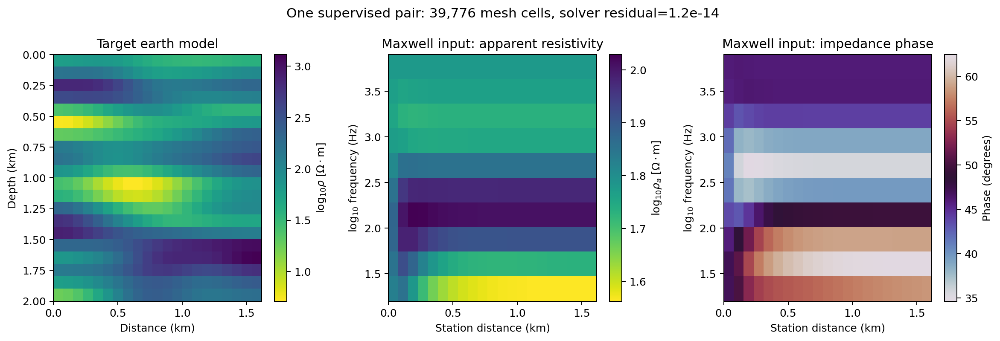
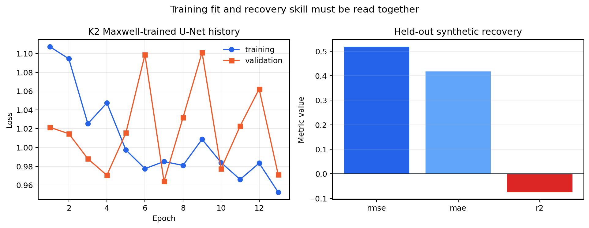
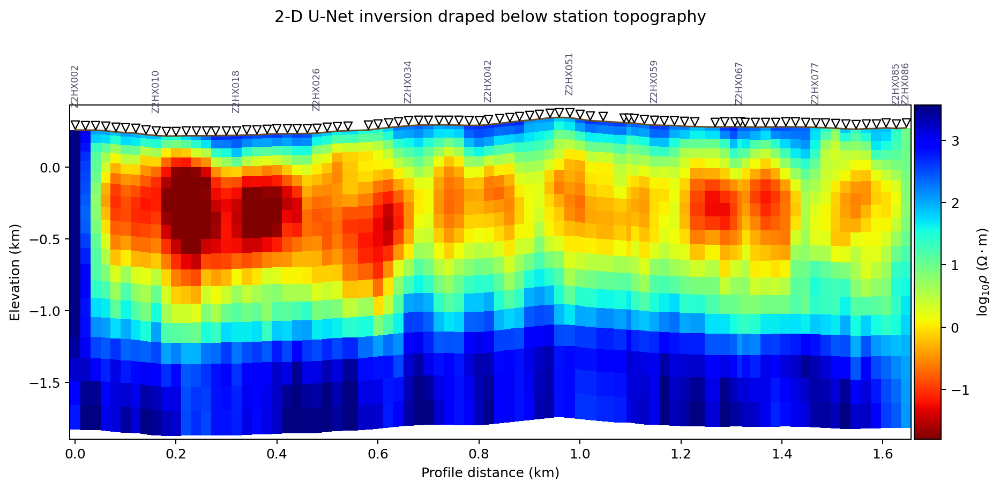
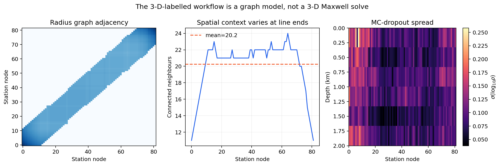
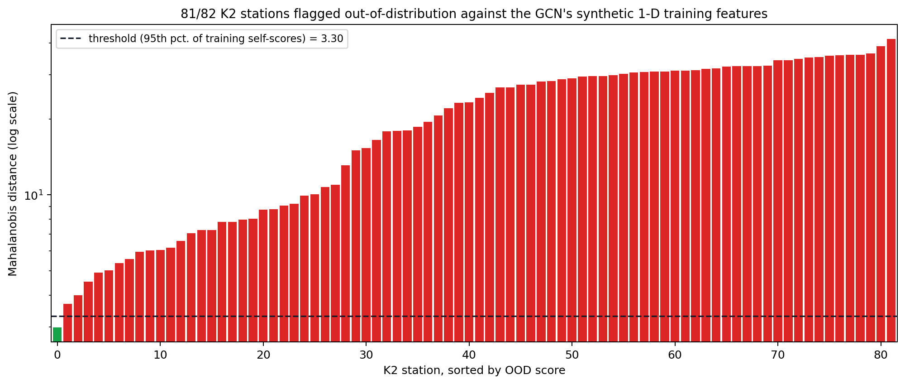

.. _tutorial_ai_inversion_from_corrected_edis:

AI Inversion From Corrected EDIs
================================

This tutorial starts where the processing tutorials end: you already have a
folder of corrected EDI files and you want to use AI inversion instead of, or
alongside, a classical Occam2D, ModEM, or MARE2DEM run. It runs the complete,
real pipeline end to end on one survey — loading, auditing, a geological
prior, a 2-D Maxwell training mesh, a 2-D AI inversion, a 3-D AI inversion,
real station topography, and an out-of-distribution check — and reports what
actually came out, including the parts that did not work well.

The survey is **K2**: Line 2 of a real Chinese CSAMT exploration line
(station prefix ``Z2HX``), 86 corrected EDI files, a magnetotelluric
acquisition with a cross-sounding array at 20 m station spacing per its own
field log, 29 frequencies per station spanning 15.8 Hz–10 kHz, and real
station coordinates and elevation:

``k2_corrected/``

Static shift, near-field, and coordinate corrections of the kind
:doc:`../user_guide/emtools/index`'s diagnostics pages cover are assumed
already applied. K2 is intentionally **not bundled with pyCSAMT** — replace
the path with your own exported corrected EDI folder, for example
``results/L18PLT_first_qc/processed``, to repeat every step here on your own
survey.

What You Will Learn
-------------------

After this tutorial you should be able to:

- audit a corrected survey's dimensionality, geoelectric strike consistency,
  frequency-grid, and station-coordinate quality before choosing an
  inversion path, not after;
- ground a geological prior's resistivity range in the survey's own
  apparent resistivity instead of guessing one;
- build a real 2-D Maxwell training mesh and dataset sized to the survey's
  actual station spacing and extent;
- run :class:`~pycsamt.agents.Inv2DAgent`'s ``physics="mt2d"`` 2-D AI
  inversion and read its automatic held-out recovery check;
- run :class:`~pycsamt.agents.Inv3DAgent`'s graph-convolutional 3-D AI
  inversion from real station coordinates, with Monte Carlo dropout
  uncertainty;
- drape a prediction below real station topography, and know that this is a
  display correction, not new forward physics;
- catch a confidently wrong prediction with an out-of-distribution screen
  before a plausible-looking figure is mistaken for a validated one.

Reproducibility before the private case study
---------------------------------------------

K2 is not distributed with pyCSAMT, so the figure generator separates
portable and survey-specific work. Geological composition, mesh construction,
the Maxwell training pair, and the following learning audit run without K2.
The audit uses eight stations from bundled ``data/AMT/WILLY_data/L18PLT`` and
the same :class:`~pycsamt.agents.Inv2DAgent` API. It is deliberately small—24
profiles and eight epochs—so it verifies installation and exposes the result
contract; it is not a scientifically accepted inversion.

   Executed, portable learning audit on bundled corrected EDIs.

Validation loss below training loss in this short run is possible because the
training objective sees augmentation and mini-batch variability while a tiny
validation split can be easier by chance. It is not evidence that the model
generalizes unusually well. The important observations are that both curves
are retained, neither has stabilized convincingly in eight epochs, and the
field RMS is reported independently. A production decision requires repeated
seeds and held-out recovery, not a preferred curve shape from one smoke run.

.. code-dropdown:: ../../scripts/generate_tutorial_ai_inversion.py
   :language: python
   :pyobject: make_training_convergence_smoke
   :linenos:
   :title: View and copy the bundled smoke-run code

Run the complete generator with

.. code-block:: console

   python docs/scripts/generate_tutorial_ai_inversion.py

When ``k2_corrected`` is absent, it writes the portable figures and explicitly
skips only the K2 audit and inversion figures. Replace ``K2_DIR`` with your
corrected EDI directory to execute the survey-specific path.

Load and Audit the Survey
--------------------------------

Loading a corrected EDI folder is one call:

.. code-block:: pycon

   >>> from pycsamt.emtools._core import ensure_sites
   >>> sites = ensure_sites(
   ...     "k2_corrected", recursive=False, verbose=0
   ... ).ordered()
   >>> print("stations:", len(sites))
   stations: 86
   >>> print("ordering applied:", sites.ordering["applied"])
   ordering applied: chainage
   >>> print("profile linearity:", round(sites.ordering["linearity"], 5))
   profile linearity: 0.99998
   >>> print("profile span (m):", round(sites.ordering["span_m"], 1))
   profile span (m): 1635.7

:meth:`~pycsamt.site.Sites.ordered` confirms K2 is a clean, nearly perfectly
linear 1636 m profile before anything else runs — but a linear profile is
not the same as a survey ready for a fixed-axis 2-D or per-station AI
inversion. :func:`~pycsamt.ai.domain_gap.audit.audit_survey` checks that
directly:

.. code-block:: pycon

   >>> from pycsamt.ai.domain_gap import audit_survey
   >>> report = audit_survey(sites, verbose=0)
   >>> print("frequency grid matched:", report.frequency_grid.matched)
   frequency grid matched: False
   >>> print(
   ...     "stations with a different grid:",
   ...     len(report.frequency_grid.mismatched_stations),
   ... )
   stations with a different grid: 53
   >>> print(
   ...     "station spacing (m):",
   ...     {k: round(v, 2) for k, v in report.station_spacing_m.items()},
   ... )
   station spacing (m): {'min': 0.0, 'median': 19.94, 'max': 41.32}
   >>> dim = report.dimensionality
   >>> print("dimensionality samples:", dim.n_samples)
   dimensionality samples: 2208
   >>> print(
   ...     "fraction 1-D / 2-D / 3-D:",
   ...     round(dim.frac_1d, 4), round(dim.frac_2d, 4), round(dim.frac_3d, 4),
   ... )
   fraction 1-D / 2-D / 3-D: 0.0082 0.0942 0.8976
   >>> print(
   ...     "strike consensus / IQR (deg):",
   ...     round(dim.strike_consensus_deg, 2),
   ...     round(dim.strike_consensus_iqr_deg, 2),
   ... )
   strike consensus / IQR (deg): -9.36 84.39
   >>> print(
   ...     "stations recommending 3-D review:",
   ...     len(dim.stations_recommending_3d_review),
   ... )
   stations recommending 3-D review: 86
   >>> print("static shift log10 sigma:", round(report.static_shift_log10_sigma, 4))
   static shift log10 sigma: 0.3943
   >>> print(
   ...     "distortion twist sigma (deg):",
   ...     round(report.distortion_twist_deg_sigma, 2),
   ... )
   distortion twist sigma (deg): 35.03

Four real findings come out of this before a single inversion has run:

- The median 19.94 m station spacing matches the field log's declared 20 m
  point spacing almost exactly — a genuine, independent confirmation that
  the corrected coordinates are trustworthy.
- The **minimum** spacing of 0.0 m is not trustworthy: at least one pair of
  stations shares an identical coordinate. K2 turns out to have four —
  ``Z2HX042``/``Z2HX043``, ``Z2HX068``/``Z2HX069``, ``Z2HX074``/``Z2HX075``,
  and ``Z2HX086``/``Z2HX087`` — most likely a repeat occupation recorded
  under two station names.
- 53 of 86 stations do not share the reference station's exact frequency
  set; :class:`~pycsamt.ai.domain_gap.audit.FrequencyGridReport`'s
  per-station counts range from 8 to 29 across the line, so a workflow that
  assumes one common frequency axis (as the sections below do) is already
  resampling, not just reading, most of this survey.
- Nearly 90% of K2's station-period samples classify as :term:`dimensionality`
  3-D, barely 1% as 1-D, and every one of the 86 stations is flagged for a
  3-D review by :func:`~pycsamt.emtools.dimensionality.pre2d_inversion_assessment`.
  The :term:`geoelectric strike` estimate is not a clean, sharp azimuth
  either: a median of ``-9.36°`` sounds precise until its 84° interquartile
  spread shows individual stations disagreeing with each other almost as
  much as they possibly could.

   Four pre-inversion checks computed from the corrected EDI collection.

The panels make the decision problem visible. Elevation is smooth enough to
define a credible terrain profile, whereas frequency support changes sharply
near stations 50--60 and must be resampled with masks retained. The dominant
3-D classification is not a small minority of suspect periods; it controls
the dimensionality decision. Finally, the tight spacing peak verifies the
nominal acquisition interval after duplicate coordinates have been removed.
No model architecture can repair these issues after training: they determine
the data contract and admissible physics before training begins.

.. code-dropdown:: ../../scripts/generate_tutorial_ai_inversion.py
   :language: python
   :pyobject: make_survey_audit
   :linenos:
   :title: View and copy the survey-audit figure code

None of the sections below rotate the tensor into that (barely consistent)
strike frame — ``zxy`` and ``zyx`` are used exactly as the EDI files store
them, which is also what :class:`~pycsamt.agents.Inv2DAgent` and
:class:`~pycsamt.agents.Inv3DAgent` do internally. :term:`Strike rotation`
is what would normally separate a clean TE response from a clean TM
response at a station whose local strike differs from the survey's nominal
direction; skip it, and a component literally named ``zxy`` is under no
obligation to behave like the "TE-like" curve either agent's training data
was built to expect. That single sentence is the mechanical explanation for
most of what the rest of this tutorial finds. The duplicate stations are
dropped before anything downstream needs a strictly increasing chainage:

.. code-block:: pycon

   >>> lat = [s.coords[0] for s in sites]
   >>> lon = [s.coords[1] for s in sites]
   >>> names = [s.name for s in sites]
   >>> keep = [names[0]]
   >>> last = (lat[0], lon[0])
   >>> for i in range(1, len(names)):
   ...     if (lat[i], lon[i]) == last:
   ...         continue
   ...     keep.append(names[i])
   ...     last = (lat[i], lon[i])
   ...
   >>> clean = sites.select(names=keep).ordered()
   >>> print("clean stations:", len(clean))
   clean stations: 82

Ground a Geological Prior in the Survey
--------------------------------------------

:doc:`../user_guide/ai_inversion/geology_priors` and
:doc:`../user_guide/ai_inversion/dataset2d` need a
``log_resistivity_mean``/``log_resistivity_std`` pair for the synthetic
training realizations. Guessing one is not necessary when the survey itself
already reports an apparent resistivity:

.. code-block:: pycon

   >>> import numpy as np
   >>> rho_xy = np.concatenate([s.rho[:, 0, 1] for s in sites])
   >>> rho_yx = np.concatenate([s.rho[:, 1, 0] for s in sites])
   >>> rho_all = np.concatenate([rho_xy, rho_yx])
   >>> rho_all = rho_all[np.isfinite(rho_all) & (rho_all > 0)]
   >>> print(
   ...     "median apparent resistivity (ohm.m):",
   ...     round(float(np.median(rho_all)), 1),
   ... )
   median apparent resistivity (ohm.m): 117.3
   >>> print(
   ...     "log10 mean / std:",
   ...     round(float(np.log10(rho_all).mean()), 4),
   ...     round(float(np.log10(rho_all).std()), 4),
   ... )
   log10 mean / std: 1.9456 1.2342

The survey's own median apparent resistivity of 117 Ω·m puts
``log_resistivity_mean=2.0`` (100 Ω·m) within a few percent of the data,
rather than an arbitrary round number. Its raw log-spread of 1.23 decades
is *not* copied directly into ``log_resistivity_std``, though: apparent
resistivity smears every depth and every local distortion into one
frequency-indexed curve, so its spread always overstates the true
resistivity variability a geological prior should target.
``log_resistivity_std=0.5`` — roughly half the raw spread — is the
conservative choice used for both inversions below.

That statistical range still does not define geology. A robust prior must
state which units occupy which depths, how interfaces vary laterally, and how
terrain divides air from earth. The complete figure code below constructs
three electrical units, correlated interface relief, an interpolated
:class:`~pycsamt.ai.geology.TopographicSurface`, and a padded solver mesh.

   The same model at three successive contracts: geological target, terrain
   mask, and physics-facing padded mesh.

The left panel is the supervised target, not a prediction: its white curves
are stochastic interfaces and its within-unit variation follows declared
correlation lengths. In the middle panel, station elevations become a
continuous surface and a Boolean air/earth mask; interpolation is therefore a
modelling choice with provenance, not merely a plotting option. The right
panel adds five air, five bottom-padding, and five padding cells on each side.
The dark air is assigned a small numerical conductivity rather than rock
resistivity.

The mesh is intentionally diagnostic. Its 930 cells resolve the smallest
skin depth with only 0.298 core cells, while
:class:`~pycsamt.forward.maxwell.mesh.MeshDesign` requests four. Therefore
``solver.quality.acceptable`` is false and its warning must not be ignored.
The dataset builder used for the figure below refines this geometry to 39,776
cells; the separately seeded sample in the executable block reaches 58,052.
The padded count can change with the realization's resistivity extrema because
they change the skin-depth requirement. This is why geological-grid resolution
and Maxwell-solver resolution are related but not interchangeable.

.. code-dropdown:: ../../scripts/generate_tutorial_ai_inversion.py
   :language: python
   :pyobject: make_geology_topography_mesh
   :linenos:
   :title: View and copy the geology, topography, and mesh code

Build the Training Mesh and 2-D Maxwell Dataset
------------------------------------------------------

:class:`~pycsamt.ai.training.dataset2d.Maxwell2DDatasetConfig` turns a
:class:`~pycsamt.ai.geology.GeologyGrid` sized to the real profile — 82
clean stations span 1616 m, a 2 km depth target is more than generous for a
15.8 Hz–10 kHz CSAMT band — into a mesh and a batch of solved realizations,
exactly as :doc:`../user_guide/ai_inversion/dataset2d` describes:

.. code-block:: pycon

   >>> from pycsamt.ai.geology import GeologyGrid
   >>> from pycsamt.ai.training.dataset2d import (
   ...     Maxwell2DDatasetConfig,
   ...     generate_2d_maxwell_dataset,
   ... )
   >>> grid = GeologyGrid.regular_2d(
   ...     nx=21, nz=20, dx_m=1616.36 / 20, dz_m=2000.0 / 20
   ... )
   >>> config = Maxwell2DDatasetConfig(
   ...     dataset_id="k2-tutorial",
   ...     grid=grid,
   ...     correlation_length_x_m=(200.0, 600.0),
   ...     correlation_length_z_m=(50.0, 200.0),
   ...     frequencies_hz=[
   ...         15.8, 31.6, 63.1, 126.0, 251.0,
   ...         501.0, 1000.0, 2000.0, 3980.0, 7940.0,
   ...     ],
   ...     station_x_m=grid.x_m,
   ...     n_realizations=1,
   ...     seed=0,
   ...     log_resistivity_mean=2.0,
   ...     log_resistivity_std=0.5,
   ...     components=("zxy",),
   ...     validation_fraction=0.0,
   ...     test_fraction=0.0,
   ... )
   >>> dataset = generate_2d_maxwell_dataset(config)
   >>> sample = dataset.samples[0]
   >>> print("mesh cells:", sample.mesh_cells)
   mesh cells: 58052
   >>> print("relative residual:", round(sample.relative_residual, 12))
   relative residual: 0.0
   >>> print(
   ...     "resistivity range (ohm.m):",
   ...     round(float(sample.resistivity_ohm_m.min()), 1),
   ...     round(float(sample.resistivity_ohm_m.max()), 1),
   ... )
   resistivity range (ohm.m): 4.6 2534.0

The single training-pair diagnostic above uses ten frequencies and a
21-station geometry so its mesh can be inspected quickly. The inversion
below keeps the same ten-frequency teaching band but regenerates the Maxwell
dataset for all 82 unique-coordinate stations. These remain
:doc:`../user_guide/ai_inversion/forward_physics` and
:doc:`../user_guide/ai_inversion/dataset2d` demonstration settings, not a
claim that ten frequencies or 24 realizations are sufficient for production.
The single realization above already exercises the real pipeline: 58,052 mesh
cells, a relative residual essentially at floating-point zero, and a
resistivity range that comfortably contains the survey's own 117 Ω·m
median.

Before generating hundreds of realizations, inspect one complete supervised
pair. The target is the earth model on the left; apparent resistivity and
phase on the right are derived from the solved complex impedance and become
the network input. They are not alternative images of the target: Maxwell
physics smooths and mixes subsurface structure in a frequency-dependent way.

   One deterministic 2-D Maxwell training pair using the tutorial geometry
   and frequency band.

The conductive body near 1.1 km depth produces a broad response rather than a
cell-for-cell copy, while high frequencies are dominated by shallower
structure. Phase contributes information that apparent resistivity alone
does not preserve. The reported residual of approximately
:math:`1.2\times10^{-14}` is the linear-solver residual; it demonstrates that
the discrete system converged, not that the mesh is free from discretization
or boundary error. Those require the independent benchmarks described in
:doc:`../user_guide/ai_inversion/forward_physics`.

.. code-dropdown:: ../../scripts/generate_tutorial_ai_inversion.py
   :language: python
   :pyobject: make_maxwell_training_pair
   :linenos:
   :title: View and copy the solved training-pair code

Run 2-D AI Inversion
---------------------------

:class:`~pycsamt.agents.Inv2DAgent` wraps exactly the steps above — build
the mesh, generate realizations, train, predict on the real pseudosection —
behind the ``physics="mt2d"`` execution contract introduced in
:doc:`../user_guide/ai_inversion/roadmap`:

.. code-block:: pycon

   >>> import numpy as np
   >>> from pycsamt.agents import Inv2DAgent
   >>> print("raw EDI sites / unique-coordinate sites:", len(sites), len(clean))
   raw EDI sites / unique-coordinate sites: 86 82
   >>> freqs = np.array([
   ...     15.8, 31.6, 63.1, 126.0, 251.0,
   ...     501.0, 1000.0, 2000.0, 3980.0, 7940.0,
   ... ])
   >>> agent = Inv2DAgent(
   ...     physics="mt2d",
   ...     n_depth=20,
   ...     n_stations_per_profile=len(clean),
   ...     n_train_profiles=24,
   ...     epochs=30,
   ...     depth_max=2000.0,
   ...     station_spacing_m=20.2,
   ...     correlation_length_x_m=(200.0, 600.0),
   ...     correlation_length_z_m=(50.0, 200.0),
   ...     log_resistivity_mean=2.0,
   ...     log_resistivity_std=0.5,
   ...     lambda_x=0.01,
   ...     lambda_z=0.005,
   ...     lambda_tv=0.002,
   ...     mesh_safety_factor=4.0,
   ... )
   >>> result = agent.execute({
   ...     "sites": clean,
   ...     "freqs": freqs,
   ...     "topography": True,
   ... })
   >>> print("status:", result.status)
   status: success
   >>> print("global RMS:", round(result.data["rms_global"], 3))
   global RMS: 2.106
   >>> recovery = {
   ...     key: round(value, 3) if isinstance(value, float) else value
   ...     for key, value in result.data["mt2d_recovery"].items()
   ... }
   >>> print("held-out recovery:", recovery)
   held-out recovery: {'rmse': 0.518, 'mae': 0.418, 'r2': -0.075, 'n_samples': 2}

``station_spacing_m=20.2`` is the median spacing of the 82 distinct station
coordinates. The directory currently contains 86 EDI files, but four pairs
occupy identical coordinates; retaining both members of a pair would create
zero-length cells and duplicate observations at one abscissa. The earlier
demonstration selected every fourth clean station and therefore showed only
21 markers. That decimation has been removed from the primary result.
``mesh_safety_factor=4`` keeps this
executed tutorial near a three-minute runtime; it reduces the lateral domain
margin from the package default of eight and is not a production choice until
the mesh-sensitivity benchmark passes for the survey band. For a full run,
generate and cache the larger Maxwell dataset offline with the default safety
factor, then train repeatedly without resolving every realization.

Training loss must be inspected before the predicted section. The fitted
inverter remains available in the result, so the numerical history is not
hidden inside the agent:

.. code-block:: pycon

   >>> history = result.data["inverter"]._history
   >>> sorted(history)
   ['train_loss', 'val_loss']
   >>> len(history["train_loss"]), len(history["val_loss"])
   (13, 13)

Early stopping ended this captured run after thirteen of the requested thirty
epochs. Requesting thirty epochs is an upper bound, not evidence that thirty
updates were useful. The exact curves change because the agent does not yet
expose a training seed; the executed figure and held-out verdict must be
archived together for each run.

   Executed K2 learning curves and held-out synthetic recovery from the same
   ``physics="mt2d"`` run.

Training loss trends downward while validation loss oscillates strongly after
the fourth epoch. That gap is the onset of memorizing a tiny 24-realization
training set. The right panel reaches the more important conclusion: on all
82 unique-coordinate stations, field RMS rises to 2.106 and the prediction
extends from -2.47 to 5.25 in log-resistivity. Held-out
:math:`R^2=-0.075` is worse than predicting the target mean. The full-line
result is therefore a transparent demonstration-scale failure, not an
accepted interpretation. Increasing epochs alone would deepen the gap. Cache
a larger set of independent Maxwell realizations, repeat seeds, and
re-evaluate an untouched test partition.

.. code-dropdown:: ../../scripts/generate_tutorial_ai_inversion.py
   :language: python
   :pyobject: make_inv2d_topography
   :linenos:
   :title: View the complete 2-D run and diagnostic-figure code

   ``physics="mt2d"`` U-Net section for all 82 unique-coordinate K2
   stations, draped below the line's own elevation.

Every inverted station is represented by a downward triangle. Only a
readable subset of station names is printed by the shared station-rendering
preset; those labels are ticks for orientation, not the list of stations used
by the inversion. Thus 82 markers and model columns are present even though
only about a dozen names are visible.

The section visibly follows the real terrain — the drape comes from
``topography=True`` resolving each station's own elevation and chainage,
exactly as :func:`~pycsamt.agents._topography.resolve_agent_topography`
documents. What the numbers say is more sobering than the figure alone.
``mt2d_recovery`` is :func:`~pycsamt.ai.validation.recovery.recovery_report`
run on a held-out *synthetic* realization with known truth — see
:doc:`../user_guide/ai_inversion/scientific_validation` for what this check
computes and why ``Inv2DAgent`` already calls it automatically whenever
``physics="mt2d"`` has a held-out split to check against — and at only 24
training realizations its :math:`R^2` is negative: worse than predicting the
mean, on a sample of two held-out realizations too small to
be conclusive on its own but entirely consistent with training on two dozen
realizations rather than the "hundreds to thousands... a training dataset
needs" that :doc:`../user_guide/ai_inversion/roadmap` states plainly is the
realistic scale for a genuine Maxwell-solved training set. This is exactly
the number :func:`~pycsamt.ai.validation.recovery.recovery_report` exists
to surface before a fast section is mistaken for a validated one.
Re-running this exact block will not reproduce these digits bit for bit —
neither agent pins a training seed. The corrected full-line geometry exposes
rather than repairs the weak recovery: negative :math:`R^2`, an RMS above two
log decades, and extreme resistivities are rejection evidence. This section
is a diagnostic candidate, not a released earth model.

Run 3-D AI Inversion
---------------------------

:class:`~pycsamt.agents.Inv3DAgent` takes a structurally different path:
rather than a genuinely 2-D Maxwell solve, it tiles independent 1-D forward
models across every station and lets a graph convolutional network share
information between neighbours within a configurable radius, as
:doc:`../user_guide/ai_inversion/agents` describes. It reads real
per-station coordinates from the EDI headers directly, so the full
82-station clean line can be used at once:

.. code-block:: pycon

   >>> import numpy as np
   >>> from pycsamt.agents import Inv3DAgent
   >>> lat = np.array([s.coords[0] for s in clean])
   >>> lon = np.array([s.coords[1] for s in clean])
   >>> elevation_m = np.array([s.coords[2] for s in clean])
   >>> lat0 = np.radians(lat[0])
   >>> x_m = (lon - lon[0]) * 111_320.0 * np.cos(lat0)
   >>> y_m = (lat - lat[0]) * 110_574.0
   >>> seg_m = np.sqrt(np.diff(x_m) ** 2 + np.diff(y_m) ** 2)
   >>> chainage_km = np.concatenate([[0.0], np.cumsum(seg_m)]) / 1000.0
   >>> freqs_full = np.array([
   ...     15.8, 20.0, 25.1, 31.6, 39.8, 50.1, 63.1, 79.4, 100.0,
   ...     126.0, 158.0, 200.0, 251.0, 316.0, 398.0, 501.0, 631.0,
   ...     794.0, 1000.0, 1260.0, 1580.0, 2000.0, 2510.0, 3160.0,
   ...     3980.0, 5010.0, 6310.0, 7940.0, 10000.0,
   ... ])
   >>> agent3d = Inv3DAgent(
   ...     n_layers=6,
   ...     epochs=30,
   ...     n_train_profiles=150,
   ...     n_mc=20,
   ...     radius=300.0,
   ...     depth_max=2000.0,
   ... )
   >>> result3d = agent3d.execute({
   ...     "sites": clean,
   ...     "freqs": freqs_full,
   ...     "topography": {
   ...         "elevation_m": elevation_m,
   ...         "chainage_km": chainage_km,
   ...     },
   ... })
   >>> off_diag = (result3d.data["adjacency"] > 0).sum(axis=1) - 1
   >>> print("status:", result3d.status)
   status: success
   >>> print(
   ...     "mean / min / max neighbours:",
   ...     round(float(off_diag.mean()), 2),
   ...     int(off_diag.min()),
   ...     int(off_diag.max()),
   ... )
   mean / min / max neighbours: 20.24 11 24
   >>> print("global RMS:", round(result3d.data["rms_global"], 3))
   global RMS: 8.02

``freqs_full`` is all 29 real K2 frequencies here — the tiled 1-D solves an
``Inv3DAgent`` run needs are far cheaper per realization than a 2-D Maxwell
mesh, so the full band is affordable. ``elevation_m`` and ``chainage_km``
are supplied explicitly (computed from ``clean``'s own ordered coordinates)
rather than left to the default ``sites``-derived extraction, because that
extraction requires a strictly increasing chainage and would otherwise
refuse to render on the same duplicate-coordinate stations already dropped
above. A radius of 300 m against a ~20 m median spacing connects each
station to roughly twenty neighbours on either side — dense enough for the
GCN to average across real local noise, not so dense that the graph
collapses to one node.

   Internal spatial graph and predictive spread from the executed
   ``Inv3DAgent`` run.

The banded adjacency matrix confirms that information travels along nearby
stations, while end stations have fewer neighbours and therefore a different
context from central nodes. The uncertainty panel is smooth and small, but it
is conditional on this graph model and its tiled 1-D training physics. It
does not turn the workflow into a 3-D Maxwell inversion. Calling this output
"3-D" describes the spatial graph and output organization; the forward model
remains the limitation stated in :doc:`../user_guide/ai_inversion/roadmap`.

.. code-dropdown:: ../../scripts/generate_tutorial_ai_inversion.py
   :language: python
   :pyobject: make_inv3d_graph_diagnostic
   :linenos:
   :title: View the complete graph and uncertainty diagnostic code

No subsurface section is published for this run. A software status of
``"success"`` says that execution completed; it does not certify a geological
model. The scientific gate is therefore applied to the unmodified prediction
*before* any section is rendered:

.. code-block:: pycon

   >>> log10_rho = result3d.data["pred_rho"]
   >>> unc = result3d.data["pred_uncertainty"]
   >>> print(
   ...     "log10 resistivity min / max:",
   ...     round(float(log10_rho.min()), 2),
   ...     round(float(log10_rho.max()), 2),
   ... )
   log10 resistivity min / max: -16.80 2.79
   >>> print(
   ...     "MC-dropout sigma min / max:",
   ...     round(float(np.nanmin(unc)), 3),
   ...     round(float(np.nanmax(unc)), 3),
   ... )
   MC-dropout sigma min / max: 0.040 0.210

``result3d.data["rms_global"]`` — a real forward-modelled misfit in
log₁₀(Ω·m), from :func:`~pycsamt.forward.em1d.MT1DForward` run on the
predicted layered model at each station's own observed frequencies — is
8.02, meaning the reconstructed response misses the observed apparent
resistivity by an average of eight orders of magnitude. The predicted
log-resistivity itself ranges from ``-16.80`` to ``2.79``, i.e. roughly
:math:`10^{-17}` to :math:`6\times10^2\ \Omega\,\mathrm{m}`: no rock
produces the lower end of that range. This is a network
extrapolating far outside anything it saw during training, not a subtle
fitting problem. The exact exponents are, again, seed dependent — every
run observed while building this tutorial has landed somewhere between
roughly :math:`10^{-30}` and :math:`10^{13}\ \Omega\,\mathrm{m}` — but
``rms_global`` staying pinned at 8.02 across those very different
extremes is itself telling: a forward-modelled misfit this severe is not
sensitive to exactly which implausible value the network lands on.

In addition, 83.3% of the cells lie outside the declared
:math:`1`--:math:`10^5\ \Omega\,\mathrm{m}` interval. This is why the
tutorial stops at diagnostics. Clipping, masking, or rescaling the candidate
would change its appearance, not its scientific validity.

Run the Experimental Candidate Outside the Tutorial
----------------------------------------------------

Readers who want to reproduce or test the current graph workflow should run
it in a quarantine directory, separate from accepted models and report
figures. From the repository root:

.. code-block:: console

   python docs/scripts/run_ai_inv3d_candidate.py k2_corrected --output runs/k2_graph_candidate --epochs 30 --profiles 150 --radius 300 --depth-max 2000

The command finishes with exit status ``2`` by design and prints paths such
as:

.. code-block:: text

   candidate directory: .../runs/k2_graph_candidate
   gate report: .../runs/k2_graph_candidate/candidate_gate.json
   scientific release: rejected

Open ``candidate_gate.json`` first. It records the raw RMS, resistivity range,
fraction outside physical bounds, uncertainty range, thresholds, and each
numerical decision. Even if those numerical checks pass on another survey,
``physics_gate`` remains ``false`` because the present backend does not solve
the 3-D Maxwell equations. Keep the directory for method development and
comparison, but do not copy a candidate section into documentation, a client
report, or an interpretation project. Promotion requires a validated 3-D
forward operator, response-space hold-out tests, acceptable OOD scores, and
survey-specific thresholds chosen before inspecting the prediction.

.. code-dropdown:: ../../scripts/run_ai_inv3d_candidate.py
   :language: python
   :linenos:
   :title: View and copy the external candidate runner

The genuinely uncomfortable part is the MC-dropout spread above:
:meth:`~pycsamt.ai.inversion.inv3d.GCNInverter3D.predict_with_uncertainty`'s
:term:`Monte Carlo dropout` spread is a small fraction of a
log₁₀-resistivity decade everywhere — the network is, by this measure,
*confident*. :term:`Epistemic uncertainty` from dropout only describes how
much the network's own learned weights disagree with each other near the
point it already landed on; it says nothing about whether that point is
anywhere near the training distribution in the first place. A
catastrophically wrong prediction with a small declared error bar is the
single most dangerous failure mode this whole tutorial's validation
apparatus exists to catch, and MC-dropout alone — as this real run
demonstrates — does not catch it.

Catch a Confidently Wrong Prediction
------------------------------------------

:doc:`../user_guide/ai_inversion/scientific_validation`'s
:func:`~pycsamt.ai.validation.ood.flag_out_of_distribution` is built for
exactly this gap. Summarizing each station's observed
``[log₁₀(apparent resistivity), phase]`` curve as one small feature vector
(mean and spread of each) and comparing it against the same summary
computed from 300 samples of the synthetic 1-D curves ``Inv3DAgent``
actually trains on gives a direct, quantitative answer to "does this
station look like anything the network learned from":

.. code-block:: pycon

   >>> from pycsamt.agents.ai_inversion import _z_to_features
   >>> from pycsamt.emtools._core import _get_z_block
   >>> from pycsamt.forward.batch import generate_dataset
   >>> from pycsamt.ai.validation import flag_out_of_distribution
   >>> n = freqs_full.size
   >>> def summarize(X):
   ...     rho, pha = X[:, :n], X[:, n : 2 * n]
   ...     return np.stack(
   ...         [rho.mean(1), rho.std(1), pha.mean(1), pha.std(1)], axis=1
   ...     )
   ...
   >>> x_obs = []
   >>> for site in clean:
   ...     z_obj, z, fr = _get_z_block(site)
   ...     feat = _z_to_features(z_obj, z, fr, freqs_full)
   ...     x_obs.append(feat[: 2 * n])
   ...
   >>> feat_obs = summarize(np.array(x_obs))
   >>> ds = generate_dataset(
   ...     solver="mt1d",
   ...     n_samples=300,
   ...     freqs=freqs_full,
   ...     n_layers=6,
   ...     noise_level=0.03,
   ...     seed=1,
   ...     n_jobs=1,
   ...     verbose=False,
   ... )
   >>> feat_train = summarize(ds.X[:, : 2 * n])
   >>> report_ood = flag_out_of_distribution(
   ...     feat_obs,
   ...     feat_train,
   ...     method="mahalanobis",
   ...     quantile=0.95,
   ... )
   >>> print(
   ...     "flagged / total:",
   ...     int(report_ood.flagged.sum()),
   ...     "/",
   ...     len(report_ood.flagged),
   ... )
   flagged / total: 81 / 82
   >>> print("threshold:", round(report_ood.threshold, 2))
   threshold: 3.3
   >>> print(
   ...     "score min / max:",
   ...     round(float(report_ood.scores.min()), 2),
   ...     round(float(report_ood.scores.max()), 2),
   ... )
   score min / max: 2.99 41.57

   Every K2 station's Mahalanobis distance from the GCN's training-feature
   distribution, sorted, against the threshold
   :func:`~pycsamt.ai.validation.ood.flag_out_of_distribution` derived from
   the training set's own self-scores.

Eighty-one of eighty-two stations exceed a threshold set from the training
data's own internal spread — only ``Z2HX051``, the station sitting at the
profile's topographic high point, scores inside it. This is the
quantitative version of the audit's opening finding: a survey that is
89.8% classified 3-D, with an 84° strike disagreement between stations,
does not resemble a population of independent 1-D layered soundings, which
is precisely what ``Inv3DAgent``'s training data is built from. The OOD
screen would have flagged this before a single figure was drawn, using
nothing but the observed data and the training configuration — no
synthetic truth, no field ground truth, and no dependence on whether the
final prediction happened to look plausible.

Recommended Decision
---------------------------

Three real, independently obtained pieces of evidence agree with each
other on K2: the dimensionality audit (89.8% 3-D, 84° strike spread), the
forward-modelled RMS (8.02 log₁₀ decades on the GCN path versus a
physically plausible range on the Maxwell-based path), and the
out-of-distribution screen (81 of 82 stations flagged). None of them
required the field truth K2 does not have. Four conclusions carry over
directly to your own corrected EDI directory:

- **Audit before inverting.** ``audit_survey``'s dimensionality, strike,
  frequency-grid, and station-spacing checks are cheap and survey-agnostic;
  run them first, exactly as this tutorial did, before choosing which
  inversion path — or whether either — is appropriate.
- **Prefer the physics-grounded path when the survey allows it.**
  ``physics="mt2d"``'s Maxwell-solved training data degraded gracefully
  here (a demonstration-scale recovery failure, but physically sensible
  output); the tiled-1-D GCN path degraded catastrophically on the same
  survey's real strike complexity. Neither result should be trusted at
  this training scale, but they are not equally wrong.
- **A low uncertainty is not evidence of a correct prediction.**
  MC-dropout answered "how sure is the network of its own weights," not
  "does this input resemble training data." Pair it with an
  out-of-distribution screen rather than reading a small σ as a green
  light on its own.
- **Topography here is a display correction, not new physics.** Both
  figures drape a prediction below real station elevation; neither solver
  used a topographic mesh to produce it (``affects_forward_physics`` is
  always ``False`` in the returned metadata).
  :func:`~pycsamt.forward.maxwell.mesh.build_solver_mesh` already builds
  genuinely topographic meshes with air cells — it is simply not yet wired
  into ``generate_2d_maxwell_dataset`` or either agent, so relief this size
  is corrected for interpretation, not solved for.

Scaling the settings used in this tutorial up to a production run —
hundreds to thousands of realizations, tens to hundreds of training
epochs, and the survey's full frequency band rather than the ten-frequency
teaching grid — is exactly what
:doc:`../user_guide/ai_inversion/roadmap`'s M0–M10 milestones and
:doc:`../user_guide/ai_inversion/experiments`'s frozen, gated
configuration exist to make reproducible. Once a result clears its
declared acceptance criteria on held-out data,
:doc:`../user_guide/ai_inversion/reporting` is where it turns into a
package a reviewer who did not run this tutorial can actually check.

See Also
--------

:doc:`condition_mt_line_with_tipper_and_rotation`
    Prepare corrected MT data before AI or classical inversion.

:doc:`prepare_occam2d_inversion`
    Classical Occam2D input preparation for comparison.

:doc:`run_pipeline_from_config`
    Store repeatable preprocessing before the AI inversion step.

:doc:`essential_3d_ai_inversion`
    A focused 3-D-plus-topography AI inversion walkthrough on the bundled
    L18PLT line.

:doc:`../user_guide/ai_inversion/scientific_validation`
    Recovery, response-residual, calibration, and out-of-distribution
    diagnostics in full.

:doc:`../user_guide/ai_inversion/domain_gap`
    Why field surveys differ from synthetic training data, and how to
    quantify the gap.

:doc:`../user_guide/ai_inversion/index`
    Full AI inversion user guide.
