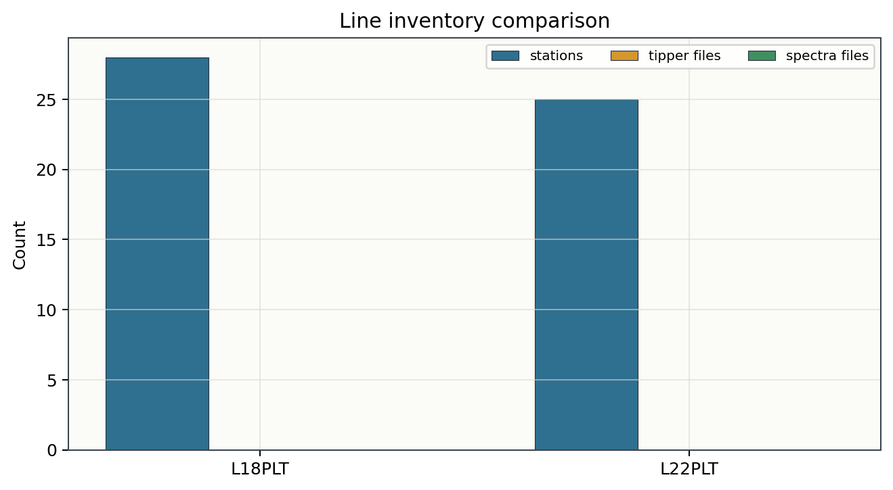
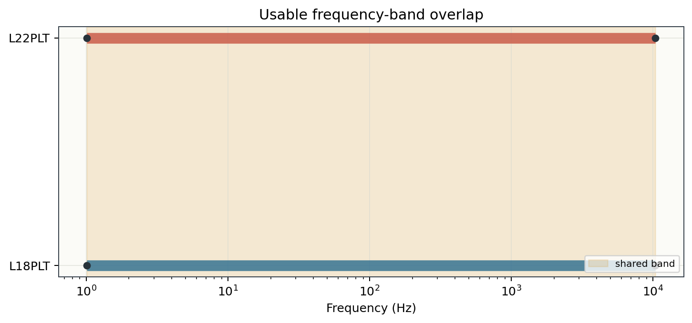
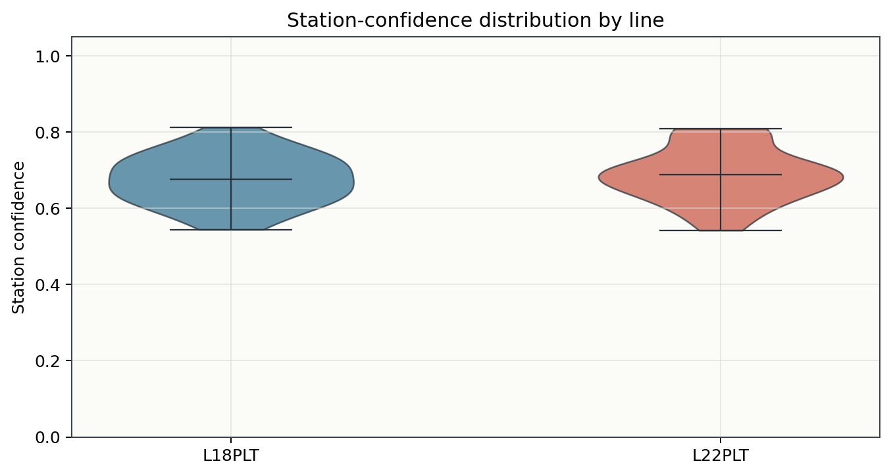
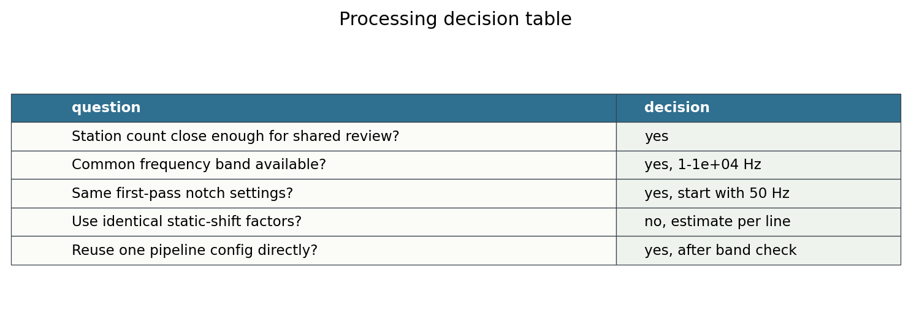

.. _tutorial_compare_survey_lines_for_qc:

Compare Survey Lines for QC
===========================

This tutorial shows how to compare two EDI survey lines before applying the
same processing workflow to both. It is useful when a project has several
parallel lines, adjacent profiles, or repeat surveys and you need to decide
whether one first-pass QC configuration is defensible.

The example uses the bundled ``L18PLT`` and ``L22PLT`` lines:

- ``data/AMT/WILLY_DATA/L18PLT``
- ``data/AMT/WILLY_DATA/L22PLT``

The goal is not to prove that the two lines are geologically identical. The
goal is more practical: check whether the input structure, frequency coverage,
and first-pass quality metrics are similar enough to start with the same QC
pipeline, while still estimating line-specific corrections later.

What You Will Learn
-------------------

After this tutorial you should be able to:

- load two EDI line folders;
- build comparable station inventories;
- compare station count, frequency rows, and optional EDI sections;
- compare frequency-band overlap;
- compute QC and confidence summaries by line;
- decide whether one first-pass config can be reused;
- adapt the same pattern to your own EDI data.

Input Assumptions
-----------------

The examples below assume that the two line folders are available in the
repository sample data:

.. code-block:: text

   data/
     AMT/
       WILLY_DATA/
         L18PLT/
           18-001A.edi
           ...
         L22PLT/
           22-10U.edi
           ...

For your own project, replace these two paths with your line directories. Keep
the line labels short, because they will be used in tables and plot legends.

Load Both Lines
---------------

Start with :func:`pycsamt.api.read_edis` for each line:

.. code-block:: python
   :linenos:

   from pathlib import Path

   from pycsamt.api import read_edis

   lines = {
       "L18PLT": Path("data/AMT/WILLY_DATA/L18PLT"),
       "L22PLT": Path("data/AMT/WILLY_DATA/L22PLT"),
   }

   surveys = {
       name: read_edis(
           path,
           recursive=False,
           strict=False,
           on_dup="replace",
           progress=False,
       )
       for name, path in lines.items()
   }

   for name, survey in surveys.items():
       print(name, survey.summary())

The survey object keeps the public loading summary, while
``survey.collection`` is the lower-level object used by the QC functions.

Build Comparable Inventory Tables
---------------------------------

The first check is structural: number of stations, number of frequency rows,
and whether optional EDI sections such as tipper or spectra are present.

.. code-block:: python
   :linenos:

   import pandas as pd

   inventories = []
   for name, survey in surveys.items():
       table = survey.summary().to_pandas(copy=True)
       table["line"] = name
       inventories.append(table)

   inventory = pd.concat(inventories, ignore_index=True)
   print(inventory[["line", "station", "n_freq", "tipper", "spectra"]].head())

Example output:

.. code-block:: text

     line    station  n_freq  tipper  spectra
   L18PLT 23-18-001A      53   False    False
   L18PLT 23-18-002U      53   False    False
   L18PLT 23-18-003A      53   False    False
   L18PLT 23-18-004A      53   False    False
   L18PLT 23-18-005U      53   False    False

For the bundled data, both lines have a regular EDI structure and the same
median number of frequency rows.

Compare Frequency Coverage
--------------------------

Before reusing a frequency-band parameter, compare the effective frequency
range. The QC table contains period limits, so frequency limits can be derived
from ``pmax`` and ``pmin``:

.. code-block:: python
   :linenos:

   from pycsamt.emtools.qc import build_qc_table

   qc_tables = []
   for name, survey in surveys.items():
       qc = build_qc_table(
           survey.collection,
           include_skew=True,
           recursive=False,
           api=True,
       ).to_pandas(copy=True)
       qc["line"] = name
       qc_tables.append(qc)

   qc = pd.concat(qc_tables, ignore_index=True)
   frequency_summary = qc.groupby("line").agg(
       min_freq_hz=("pmax", lambda value: 1.0 / value.max()),
       max_freq_hz=("pmin", lambda value: 1.0 / value.min()),
       median_frac_ok=("frac_ok", "median"),
   )
   print(frequency_summary)

The two bundled lines share essentially the same first-pass band:

.. code-block:: text

           min_freq_hz  max_freq_hz  median_frac_ok
   line
   L18PLT        1.01     1.04e+04           1.000
   L22PLT        1.01     1.04e+04           1.000

This supports using the same initial ``select_band`` setting for both lines,
for example ``band_hz: [1.0, 10000.0]``.

Compare QC and Confidence Metrics
---------------------------------

Frequency coverage is necessary, but not sufficient. Compare station-level
quality metrics before deciding that a shared workflow is reasonable:

.. code-block:: python
   :linenos:

   from pycsamt.emtools.qc import station_confidence_table

   confidence_tables = []
   for name, survey in surveys.items():
       confidence = station_confidence_table(
           survey.collection,
           method="composite",
           relerr_threshold=0.20,
           offdiag_tolerance_log10=0.35,
           diagonal_leakage_max=0.35,
           phase_jump_tolerance_deg=90.0,
           spatial_tolerance_log10=0.60,
           spacing_m=200.0,
           recursive=False,
           api=True,
       ).to_pandas(copy=True)
       confidence["line"] = name
       confidence_tables.append(confidence)

   confidence = pd.concat(confidence_tables, ignore_index=True)
   print(
       confidence.groupby("line").agg(
           stations=("station", "count"),
           confidence_min=("confidence", "min"),
           confidence_median=("confidence", "median"),
           confidence_max=("confidence", "max"),
       )
   )

Example output:

.. code-block:: text

           stations  confidence_min  confidence_median  confidence_max
   line
   L18PLT        28           0.544              0.672           0.812
   L22PLT        25           0.542              0.691           0.809

The medians are close, but they are not identical. That is the useful answer:
the same first-pass QC config is reasonable, but any station rejection,
static-shift correction, or inversion weighting should still be reviewed per
line.

Make the Processing Decision
----------------------------

Summarise the comparison as a decision table. This is the part worth keeping
in a project note or reviewer response, because it explains why you reused a
workflow or why you did not.

.. code-block:: python
   :linenos:

   line_summary = pd.DataFrame(
       [
           {
               "line": name,
               "stations": len(surveys[name].summary().to_pandas()),
               "median_n_freq": inventory.loc[
                   inventory["line"] == name, "n_freq"
               ].median(),
               "median_frac_ok": qc.loc[
                   qc["line"] == name, "frac_ok"
               ].median(),
               "median_confidence": confidence.loc[
                   confidence["line"] == name, "confidence"
               ].median(),
           }
           for name in surveys
       ]
   )
   print(line_summary)

Example output:

.. code-block:: text

     line  stations  median_n_freq  median_frac_ok  median_confidence
   L18PLT        28             53           1.000              0.672
   L22PLT        25             53           1.000              0.691

For these two lines, a practical decision is:

- reuse the same first-pass QC and frequency-band config;
- keep the line labels separate in all outputs;
- estimate static-shift factors separately for each line;
- review stations with low confidence before inversion preparation;
- do not merge the lines unless the modelling objective requires it.

Recommended Next Step
---------------------

Once the comparison supports a shared first-pass workflow, run the config
pipeline separately for each line:

.. code-block:: bash
   :linenos:

   pycsamt pipe run \
       --config config/l18_first_qc.yaml \
       --survey data/AMT/WILLY_DATA/L18PLT \
       --out results/L18PLT_first_qc

   pycsamt pipe run \
       --config config/l18_first_qc.yaml \
       --survey data/AMT/WILLY_DATA/L22PLT \
       --out results/L22PLT_first_qc

Using the same config does not mean mixing the outputs. Keep one output folder
per line so that plots, processed EDIs, reports, and later inversion files stay
traceable.

Adapting This Tutorial
----------------------

For your own data, replace only the ``lines`` dictionary:

.. code-block:: python
   :linenos:

   lines = {
       "Line_A": Path("path/to/line_a_edis"),
       "Line_B": Path("path/to/line_b_edis"),
   }

Then rerun the same inventory, QC, confidence, and decision-table steps. If the
frequency bands differ, use separate ``select_band`` parameters. If confidence
distributions differ strongly, inspect the weaker line before applying
corrections or preparing inversion input.

See Also
--------

:doc:`read_edi_survey`
    Load EDI surveys and inspect the public survey object.

:doc:`inspect_and_qc_survey`
    Build detailed QC tables and diagnostic plots for one line.

:doc:`run_pipeline_from_config`
    Store the resulting first-pass workflow in a reusable config file.

:doc:`correct_static_shift`
    Estimate static-shift factors after the QC decision is understood.
