.. _tutorial_condition_mt_line_with_tipper_and_rotation:

Condition an MT Line With Tipper and Rotation
=============================================

This tutorial builds an auditable pre-inversion workflow for the KAP03
long-period MT line, which has both full impedance tensors and tipper data.
The 26 sites form the southwest--northeast KAP03 profile of the Southern
African Magnetotelluric Experiment (SAMTEX):

``data/MT/kap03lmt_edis``

The `MTNet KAP03 data page <https://www.mtnet.info/data/kap03/kap03.html>`_
documents the acquisition and contamination from the DC railway and mine
power around KAP127--KAP145. Users must acknowledge the SAMTEX Consortium as
required by the `SAMTEX distribution page
<https://www.mtnet.info/data/samtex/samtex.html>`_. Regional context and
inversion sensitivity are discussed by `Evans et al. (2011)
<https://doi.org/10.1029/2010JB007883>`_ and the ModEM/jif3D comparison of
`Moorkamp et al. (2022) <https://doi.org/10.1029/2021JB023117>`_.

The aim is to make the processing decisions visible before inversion:

- inspect raw tensor curves and tipper response;
- identify weak frequency rows;
- drop demonstrably weak rows and repair only isolated outliers;
- inspect static-shift factors without automatically applying them;
- estimate strike and plot phase tensors;
- rotate impedance and tipper into a consistent frame.

This is an advanced tutorial. It deliberately avoids a single "automatic clean"
button because MT conditioning is interpretive: every destructive or scaling
operation should leave a trace in a table or figure.

Recommended Order
-----------------

The processing order used here is:

1. load the KP EDI line;
2. promote ``DEFINEMEAS`` coordinates and attach sourced DEM elevations;
3. plot raw ``Zxx``, ``Zxy``, ``Zyx``, ``Zyy`` apparent resistivity and phase;
4. plot raw tipper components;
5. build station and frequency confidence tables;
6. drop low-confidence frequency rows from impedance and tipper together;
7. apply a conservative Hampel outlier filter;
8. estimate static-shift factors as a diagnostic and decide whether to use them;
9. estimate strike and plot phase tensor ellipses;
10. rotate impedance and tipper, export, reload, and validate.

Load the KP Line
----------------

.. code-block:: pycon

   >>> from pathlib import Path
   >>> from pycsamt.api import read_edis
   >>> edi_dir = Path("data/MT/kap03lmt_edis")
   >>> survey = read_edis(edi_dir, recursive=False, strict=True, progress=False)
   >>> sites = survey.collection
   >>> print(survey.summary())

   APIFrame: edi_survey_summary
   kind: edi.summary
   shape: 26 rows x 6 columns
   columns: station, path, n_freq, tipper, spectra, ts
   numeric: 1 columns
   missing: 0.0%
   source: data/MT/kap03lmt_edis

Every loaded KP station has tipper rows in this sample:

.. code-block:: pycon

   >>> print(survey.summary().to_pandas()[["station", "n_freq", "tipper", "spectra"]].head(6).to_string(index=False))
   station  n_freq  tipper  spectra
    kap103      20    True    False
    kap106      20    True    False
    kap109      18    True    False
    kap112      20    True    False
    kap115      20    True    False
    kap118      20    True    False

Recover Coordinates and Add Sourced Topography
-----------------------------------------------

The EDI ``HEAD`` locations are empty and the original elevation values are
zero, but each ``DEFINEMEAS`` block carries ``REFLAT`` and ``REFLONG``. The
generator promotes those coordinates and joins the cached
``data/MT/kap03_topography_open_meteo.csv`` table. It was queried on
2026-08-03 with the `Open-Meteo elevation API
<https://open-meteo.com/en/docs/elevation-api>`_ and records the service URL,
retrieval date, coordinate source, and elevation for every station.

.. code-block:: pycon

   >>> from pycsamt.site.utils import set_coords
   >>> topo = pd.read_csv("data/MT/kap03_topography_open_meteo.csv").set_index("station")
   >>> for site in sites:
   ...     dm = site.get_section("definemeas")
   ...     row = topo.loc[site.station]
   ...     assert abs(float(dm.reflat) - row.latitude) < 1e-5
   ...     assert abs(float(dm.reflong) - row.longitude) < 1e-5
   ...     set_coords(site, lat=dm.reflat, lon=dm.reflong,
   ...                elev=row.elevation_m, inplace=True)
   >>> print(len(topo), topo.elevation_m.min(), topo.elevation_m.max())
   26 473 1535

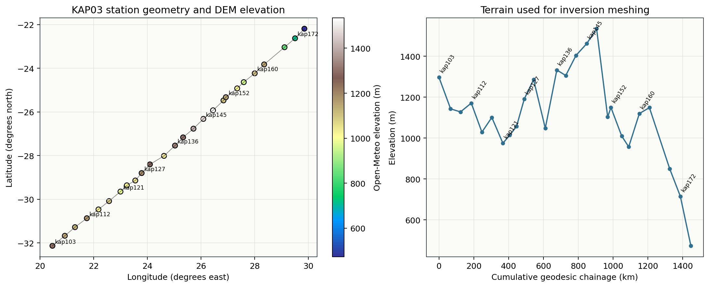

   The recovered profile is approximately 1,447 km long. DEM elevation rises
   from 1,298 m at KAP103 to 1,535 m at KAP148 before falling to 473 m at
   KAP175. These remotely sampled elevations are not field differential-GNSS
   observations; terrain resolution and vertical-datum uncertainty belong in
   the near-surface mesh sensitivity analysis.

.. code-dropdown:: ../../scripts/generate_tutorial_kp_mt_conditioning.py
   :language: python
   :pyobject: _inject_coordinates_topography
   :linenos:
   :title: View coordinate validation and topography injection code

.. code-dropdown:: ../../scripts/generate_tutorial_kp_mt_conditioning.py
   :language: python
   :pyobject: _plot_topography
   :linenos:
   :title: View the executed map and terrain-profile plotting code

Plot Raw Tensor Curves
----------------------

Before removing frequencies or scaling tensors, plot the raw components. The
off-diagonal components ``Zxy`` and ``Zyx`` normally carry the TE/TM response,
while the diagonal components ``Zxx`` and ``Zyy`` reveal 3-D effects, noise,
or rotation issues.

For angular frequency :math:`\omega=2\pi f`, the plotted quantities are
:math:`\rho_{a,ij}=|Z_{ij}|^2/(\mu_0\omega)` and
:math:`\phi_{ij}=\operatorname{atan2}(\Im Z_{ij},\Re Z_{ij})`.  Thus the
:term:`apparent resistivity` is amplitude-sensitive, whereas phase describes
the complex response angle.  The helper evaluates these expressions without
changing the EDI objects:

.. code-block:: pycon

   >>> stations_to_plot = ["kap103", "kap112", "kap136", "kap169"]
   >>> [(s.station, len(s.Z.freq)) for s in sites if s.station in stations_to_plot]
   [('kap103', 20), ('kap112', 20), ('kap136', 20), ('kap169', 20)]

The generated figures show that this line is not a simple two-component data
set; diagonal terms and phase behavior need to be reviewed before rotation.

.. code-block:: pycon

   >>> from pycsamt.emtools import plot_response_tipper
   >>> fig = plot_response_tipper(
   ...     sites, stations=stations_to_plot, components=("xy", "yx"),
   ...     raw=True, ncols_groups=2, show_error_bars=True,
   ...     show_tipper_error_bars=True, recursive=False,
   ... )
   >>> len(fig.axes)
   32

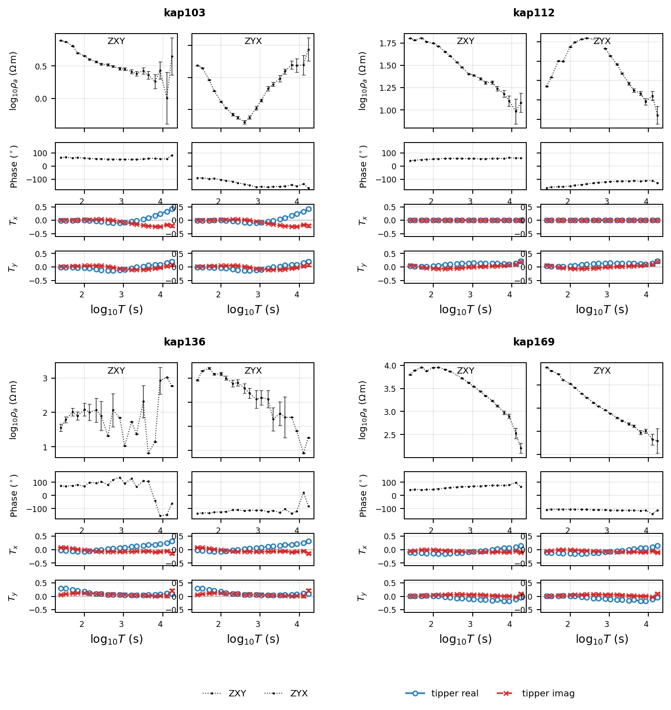

KAP136 lies within the railway/mine-power interval identified by MTNet and is
therefore retained as a deliberately difficult example. Its irregular curves
must not be smoothed merely to resemble its neighbours.

.. code-dropdown:: ../../scripts/generate_tutorial_kp_mt_conditioning.py
   :language: python
   :pyobject: _plot_raw_tensor
   :linenos:
   :title: View the executed plot_response_tipper wrapper

Plot Tipper Components
----------------------

Tipper data help identify lateral conductivity gradients and 3-D structure.
The KP EDI files store the tipper container as ``site.Tip``:

.. code-block:: pycon

   >>> site = next(s for s in sites if s.station == "kap103")
   >>> site.Tip.tipper.shape, site.Tip.freq[[0, -1]]
   ((20, 1, 2), array([4.00000e-02, 5.85938e-05]))

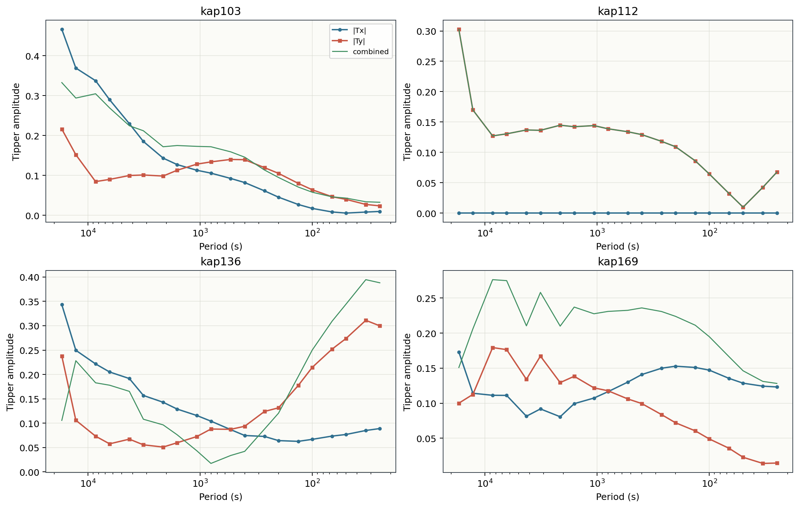

The :term:`tipper` is a complex horizontal vector relating vertical to
horizontal magnetic field. Large or rapidly changing amplitudes point to
lateral conductivity gradients, but may also expose cultural noise. Because
tipper and impedance share frequencies here, every later row rejection and
rotation is applied to both.

.. code-dropdown:: ../../scripts/generate_tutorial_kp_mt_conditioning.py
   :language: python
   :pyobject: _plot_tipper
   :linenos:
   :title: View the executed raw tipper plotting code

Build QC Tables
---------------

Use station-level and frequency-level tables before deciding what to suppress:

.. code-block:: pycon

   >>> from pycsamt.emtools import (
   ...     build_qc_table,
   ...     frequency_confidence_table,
   ...     station_confidence_table,
   ... )

   >>> qc = build_qc_table(
   ...     sites,
   ...     include_skew=True,
   ...     recursive=False,
   ...     api=True,
   ... ).to_pandas(copy=True)

   >>> station_ci = station_confidence_table(
   ...     sites,
   ...     method="composite",
   ...     recursive=False,
   ...     api=True,
   ... ).to_pandas(copy=True)

   >>> freq_ci = frequency_confidence_table(
   ...     sites,
   ...     method="composite",
   ...     ci_hi=0.9,
   ...     ci_lo=0.5,
   ...     recursive=False,
   ...     api=True,
   ... ).to_pandas(copy=True)
   >>> len(freq_ci), int((freq_ci.confidence < 0.5).sum())
   (518, 30)

Example station QC:

.. code-block:: text

   station  n_freq  n_tip  frac_ok  snr_med  skew_med
    kap103      20     20    1.000   36.494     2.435
    kap106      20     20    1.000   33.926     4.761
    kap109      18     18    1.000   65.851     1.705

The frequency screen found 518 station-frequency rows and 30 weak rows
(``confidence < 0.5``), about 5.8 percent of the line.

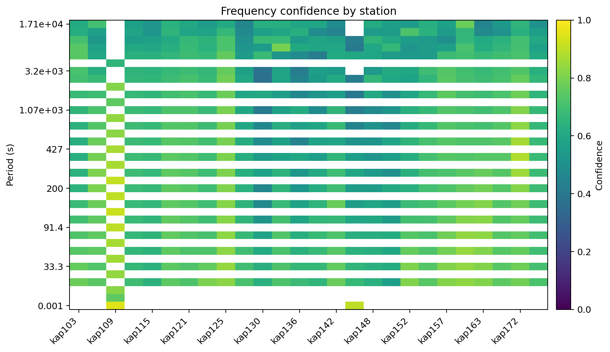

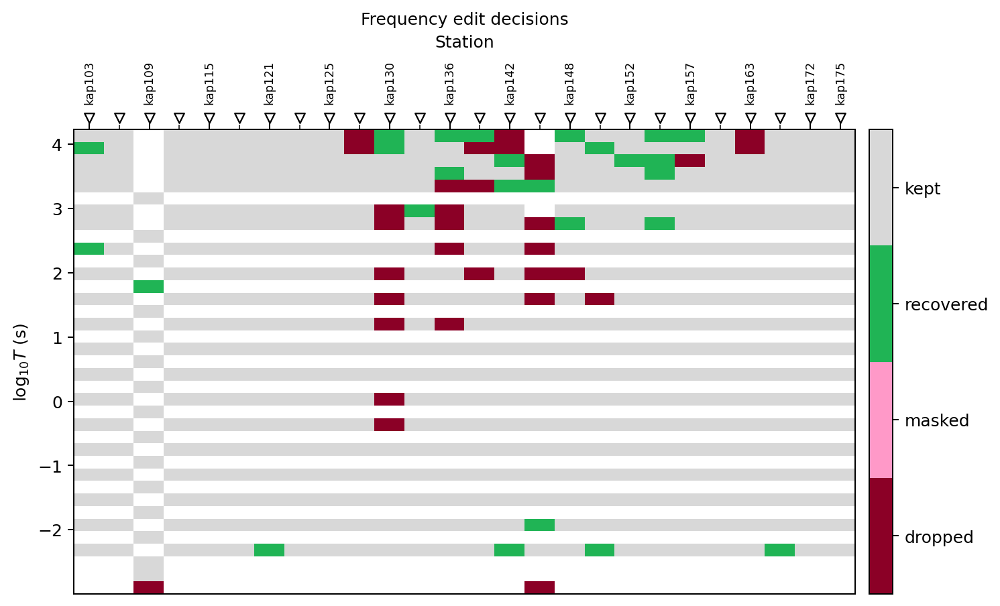

Drop Weak Rows and Filter Conservatively
----------------------------------------

For this data set, the useful operation is row rejection rather than recovery.
The measured range ends at 0.04 Hz, so a 50/60 Hz power-line notch cannot act
on any sample and is intentionally omitted. Interpolation and polynomial
smoothing are also omitted: they would manufacture inversion input. The
composite confidence rule drops 30 of 518 station-frequency rows (5.8%) from
the :term:`impedance tensor` and tipper together. A survey-support check then
rejects two duplicate 999 Hz rows found only at KAP109; they are incompatible
with the common long-period band. Finally, a two-neighbour Hampel filter
repairs only isolated magnitude/phase outliers.

.. code-block:: pycon

   >>> conditioned = _processing_chain(functions, sites)
   >>> sum(len(s.Z.freq) for s in sites), sum(len(s.Z.freq) for s in conditioned)
   (518, 486)

.. code-dropdown:: ../../scripts/generate_tutorial_kp_mt_conditioning.py
   :language: python
   :pyobject: _processing_chain
   :linenos:
   :title: View the executed frequency rejection and Hampel filtering code

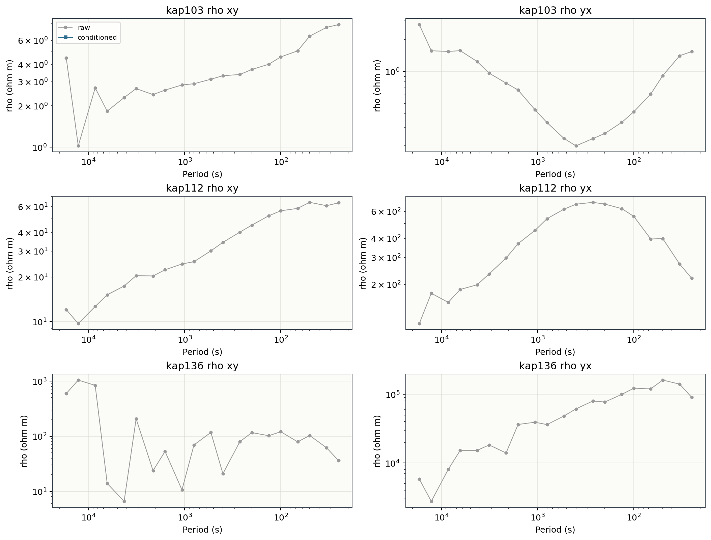

This pseudosection is produced by
:func:`~pycsamt.emtools.plot_frequency_confidence_psection`; the edit panel
below is produced by :func:`~pycsamt.emtools.plot_frequency_edit_decisions`.
Consequently the displayed decisions use the same confidence implementation
as ``drop_low_confidence_frequencies`` rather than a separately coded mask.

.. code-block:: pycon

   >>> from pycsamt.emtools import plot_frequency_edit_decisions
   >>> ax = plot_frequency_edit_decisions(
   ...     sites, conditioned, method="composite", ci_hi=0.9, ci_lo=0.5,
   ...     station_label_step=2,
   ... )
   >>> ax.get_title()
   'Frequency edit decisions'

The next matched figures use ``plot_response_tipper`` twice, first on the raw
collection and then on the conditioned, rotated collection. KAP103 samples the
southwest, KAP136 the documented cultural-noise corridor, and KAP169 the
northeast. Keeping the panels separate preserves the package's error bars and
avoids obscuring rejected samples with an overlay.

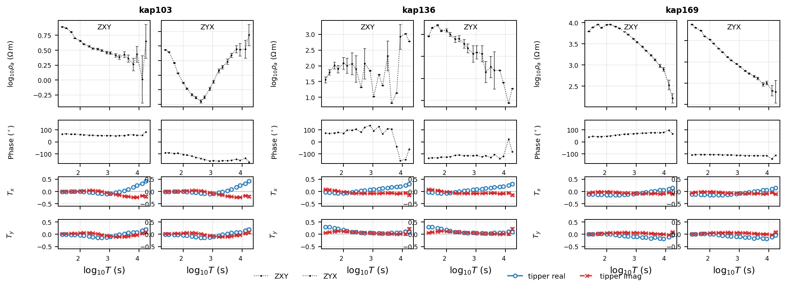

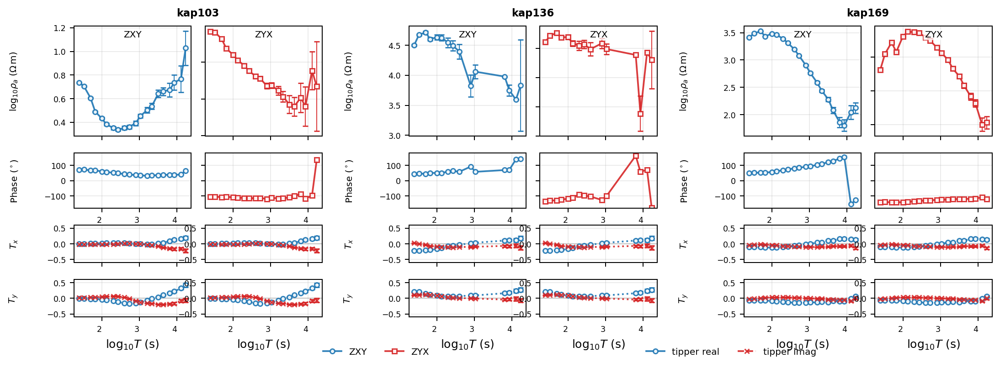

.. code-dropdown:: ../../scripts/generate_tutorial_kp_mt_conditioning.py
   :language: python
   :pyobject: _plot_three_station_raw_corrected
   :linenos:
   :title: View the executed three-station comparison code

Check Dimensionality and Induction Vectors
------------------------------------------

Frequency confidence says whether a row is usable; it does not establish that
the Earth is 2-D. The public dimensionality and ellipticity pseudosections add
that geological test after conditioning and before selecting a rotation:

.. code-block:: pycon

   >>> from pycsamt.emtools import (
   ...     plot_dimensionality_psection,
   ...     plot_ellipticity_psection,
   ... )
   >>> dim_ax = plot_dimensionality_psection(
   ...     conditioned, skew_th=3.0, ellipt_th=0.2, recursive=False,
   ... )
   >>> ell_ax = plot_ellipticity_psection(
   ...     conditioned, agg="median", recursive=False,
   ... )
   >>> dim_ax.get_ylabel(), ell_ax.get_ylabel()
   ('$\\log_{10}(T)$ (s)', '$\\log_{10}(T)$ (s)')

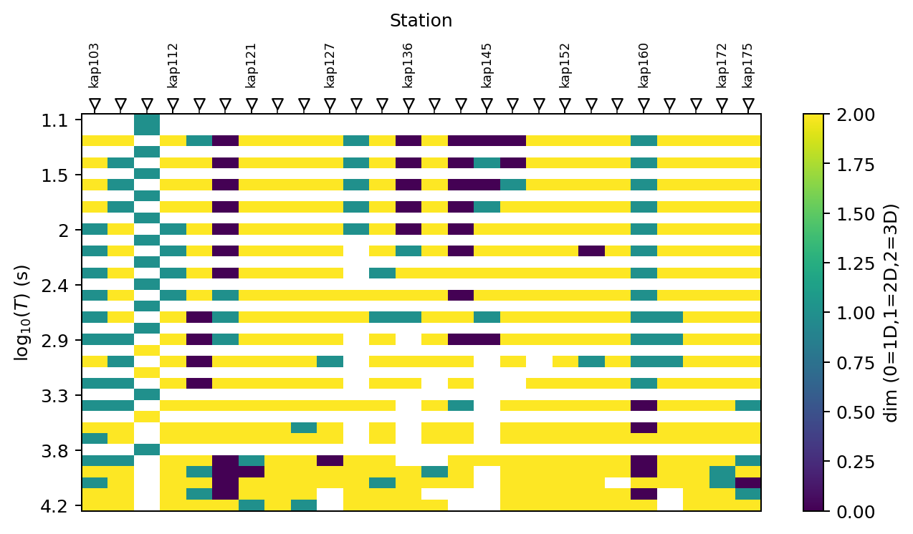

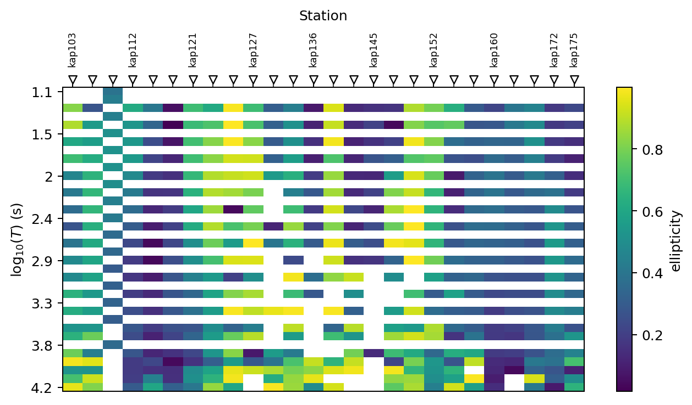

Class 2 (3-D) cells prevail across broad period ranges, and ellipticity varies
strongly along the line. This argues against reducing the survey to a uniform
2-D TE/TM problem. White cells are missing or rejected observations, not a
fourth dimensionality class.

Tipper amplitude and direction provide an independent view of lateral current
deflection. The section locates strong responses in station--period space; the
map shows their directions near 653.2 s using the Parkinson convention.

.. code-block:: pycon

   >>> from pycsamt.emtools import plot_induction_map, plot_induction_section
   >>> section_ax = plot_induction_section(
   ...     conditioned, component="abs", n_periods=18, recursive=False,
   ... )
   >>> map_ax = plot_induction_map(
   ...     conditioned, period=653.2, convention="park",
   ...     show_real=True, show_imag=True, station_labels=True,
   ...     recursive=False,
   ... )
   >>> len(map_ax.patches) > 0
   True

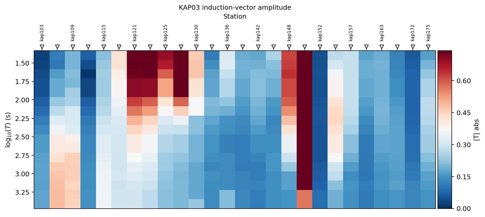

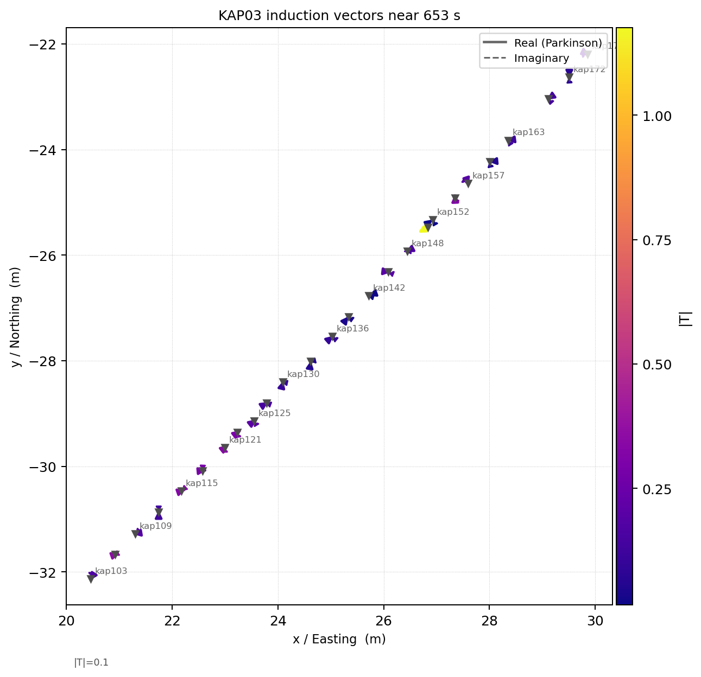

A single target period can conceal reversals or rotations of the induction
vector. The multi-period API repeats the real Parkinson arrows over the
station-derived topographic surface at four representative penetration
scales:

.. code-block:: pycon

   >>> from pycsamt.emtools import plot_induction_multiperiod_map
   >>> fig, axes = plot_induction_multiperiod_map(
   ...     conditioned, periods=(30.0, 200.0, 1000.0, 8000.0),
   ...     convention="park", background=dem,
   ...     background_extent=extent, background_cmap="terrain",
   ...     xlabel="Longitude (degrees east)",
   ...     ylabel="Latitude (degrees north)",
   ...     recursive=False,
   ... )
   >>> len(axes)
   4

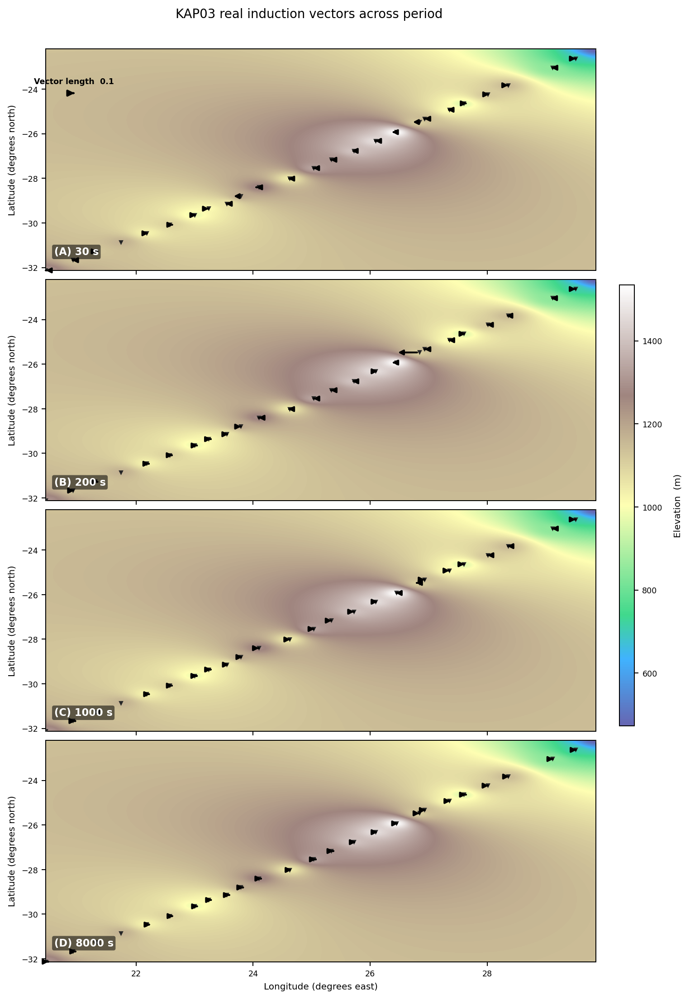

The same transfer function can be inspected in the complex plane. A tipper
hodogram plots real against imaginary response separately for :math:`T_x` and
:math:`T_y`; curvature, clustering, and changes between period bands expose
frequency-dependent induction behavior that a magnitude section alone can
hide. Here ``normalize=True`` expands the small measured response relative to
the reference circle for shape comparison; use ``False`` when absolute tipper
magnitude must remain visible.

.. code-block:: pycon

   >>> from pycsamt.emtools import plot_tipper_hodograms
   >>> fig = plot_tipper_hodograms(
   ...     conditioned, station="kap136", n_bands=4,
   ...     normalize=True, ms=2.5, lw=1.15,
   ...     unit_circle=True, recursive=False,
   ... )
   >>> [ax.get_title() for ax in fig.axes]
   ['kap136 • Tx', 'kap136 • Ty']

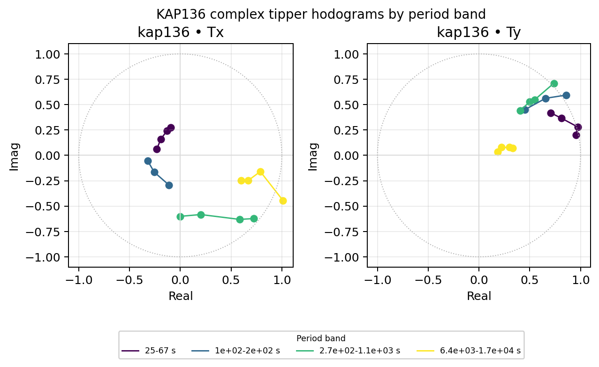

The amplitude section highlights strong lateral responses around KAP121--130,
KAP148, and KAP157 over different period bands. Coherent map arrows confirm
that the vertical magnetic response carries directional information. Under
the adopted convention, Parkinson arrows point toward conductive anomalies;
they must be interpreted with phase tensors and topography rather than used as
stand-alone strike estimates.

.. code-dropdown:: ../../scripts/generate_tutorial_kp_mt_conditioning.py
   :language: python
   :pyobject: _plot_dimensionality_and_induction
   :linenos:
   :title: View the dimensionality and induction-vector plotting code

Test, Then Reject, Automatic Static Shift
-----------------------------------------

The :term:`static shift` diagnostic estimates a frequency-independent
impedance factor. It changes apparent-resistivity scale but not phase. Here we
calculate a *trial* only; it is not passed to strike analysis, rotation, or
export.

.. code-block:: pycon

   >>> factors, shifted_trial = _static_shift(functions, sites, sites)
   >>> factors[["station", "fac_z"]].head(6).round(3).to_dict("records")
   [{'station': 'kap103', 'fac_z': 1.91}, {'station': 'kap106', 'fac_z': 1.61}, {'station': 'kap109', 'fac_z': 0.529}, {'station': 'kap112', 'fac_z': 0.237}, {'station': 'kap115', 'fac_z': 3.17}, {'station': 'kap118', 'fac_z': 0.289}]

.. code-block:: text

   station  fac_z  fac_z_reviewed  n_used
    kap103   1.91            1.91      20
    kap106   1.61            1.61      20
    kap109  0.529           0.529      18
    kap112  0.237            0.35      20
    kap115   3.17            2.85      20
    kap118  0.289            0.35      20
    kap121  0.578           0.578      20
    kap123   1.35            1.35      20

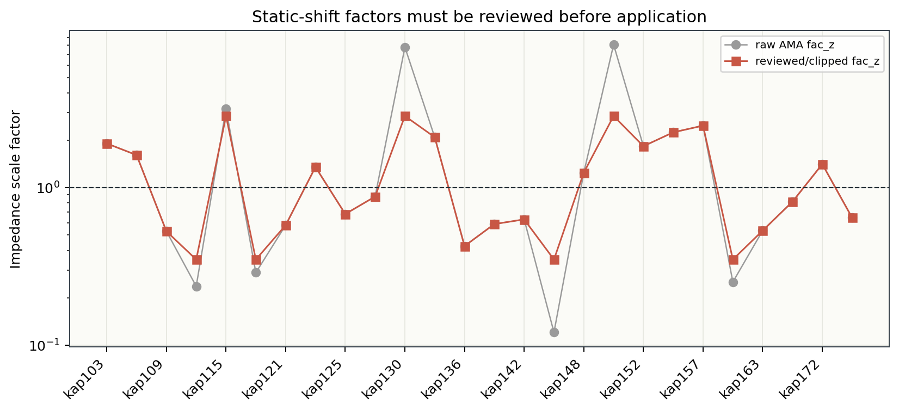

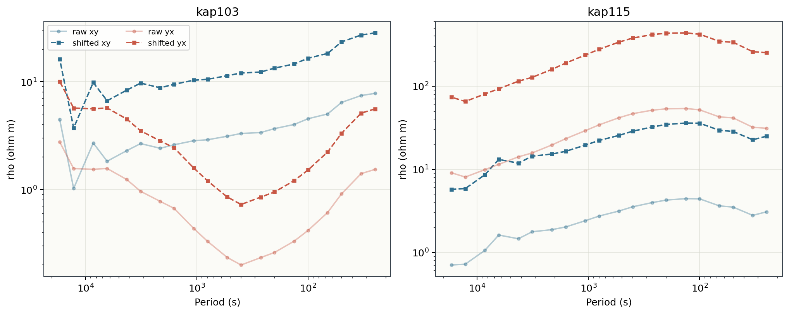

Factors from 0.237 to 3.17 in only the first six sites imply large amplitude
changes. With approximately 60 km station spacing, strong 3-D structure, and
known cultural contamination, neighbour-based amplitude leveling is not
sufficiently constrained. Clipping those values would conceal the diagnostic
failure. We therefore reject the trial and keep ``conditioned`` downstream.
Static shift can be revisited with independent near-surface constraints or a
justified distortion model.

.. code-dropdown:: ../../scripts/generate_tutorial_kp_mt_conditioning.py
   :language: python
   :pyobject: _static_shift
   :linenos:
   :title: View the diagnostic static-shift trial code

Estimate Strike and Plot Phase Tensors
--------------------------------------

After QC and rejection of the static-shift trial, estimate a dominant
:term:`geoelectric strike` direction from ``conditioned``. The public
``estimate_strike_consensus`` API combines the impedance sweep and
phase-tensor estimates. We then use an inverse-IQR-weighted axial mean and map
the 180-degree-equivalent result into the signed rotation interval:

.. code-block:: pycon

   >>> dominant, strike_detail = _dominant_strike(functions, conditioned)
   >>> print(f"dominant_strike_deg={dominant:.2f}")
   dominant_strike_deg=-39.69

The equivalent axial direction is 140.31 degrees. The broad rose remains
evidence of period-dependent or 3-D behaviour, so -39.69 degrees is a
pragmatic common frame rather than proof that the whole profile is 2-D.

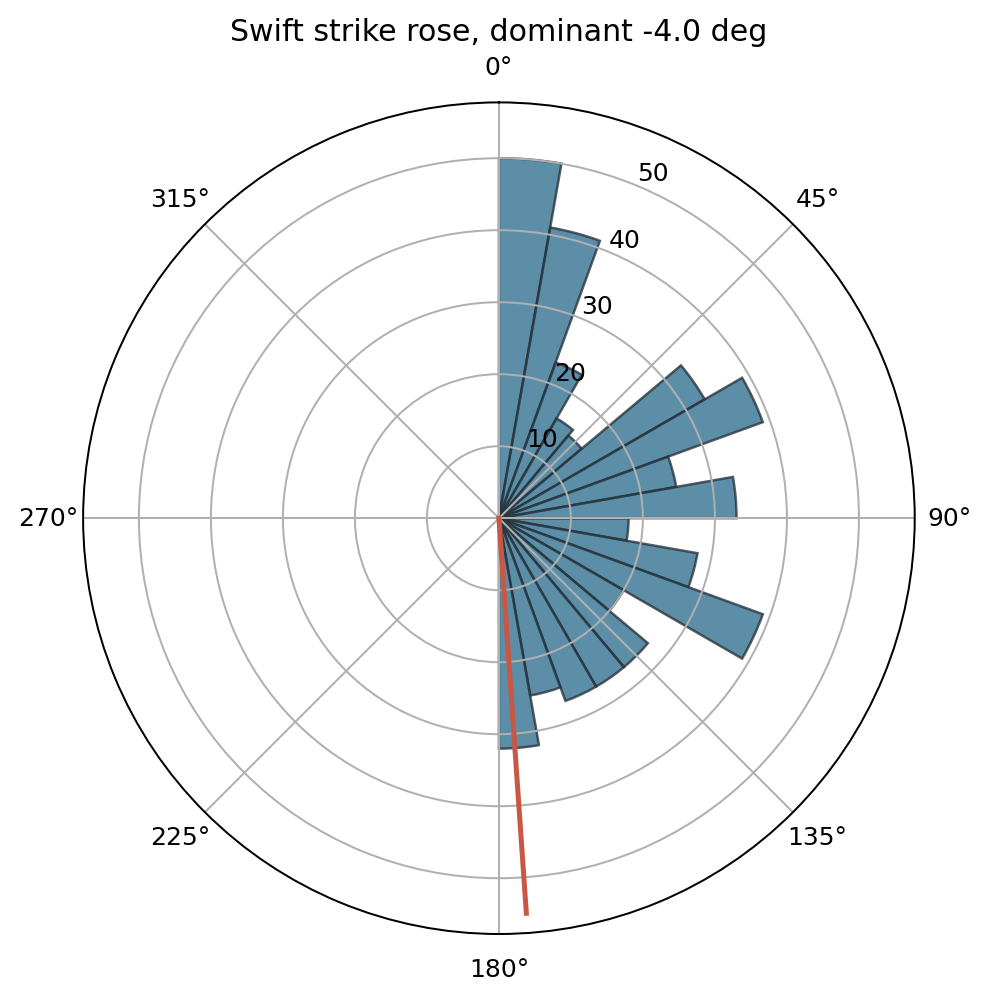

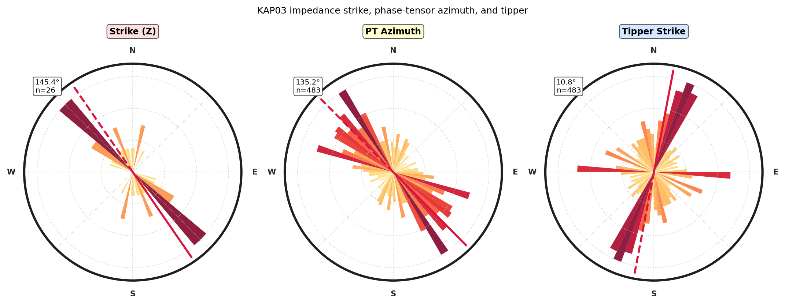

.. code-block:: pycon

   >>> from pycsamt.emtools import plot_strike_analysis, plot_strike_rose
   >>> rose = plot_strike_rose(conditioned, method="consensus", recursive=False)
   >>> comparison = plot_strike_analysis(
   ...     conditioned, method="consensus", recursive=False,
   ... )
   >>> len(comparison.axes)
   3

The package comparison is especially useful here: impedance and phase-tensor
azimuth occupy similar northwest--southeast axial quadrants, whereas the real
tipper direction clusters nearer north--south. That disagreement supports
retaining full-tensor plus tipper data for 3-D inversion instead of claiming a
clean two-dimensional TE/TM decomposition.

.. code-dropdown:: ../../scripts/generate_tutorial_kp_mt_conditioning.py
   :language: python
   :pyobject: _dominant_strike
   :linenos:
   :title: View the axial circular-mean strike calculation

Phase tensor ellipses show orientation, ellipticity, and skew-like behavior
without relying on static-shift-sensitive amplitudes:

.. code-block:: pycon

   >>> pt = _plot_phase_tensor_grid(functions, conditioned)
   >>> len(pt), pt.station.nunique()
   (483, 26)

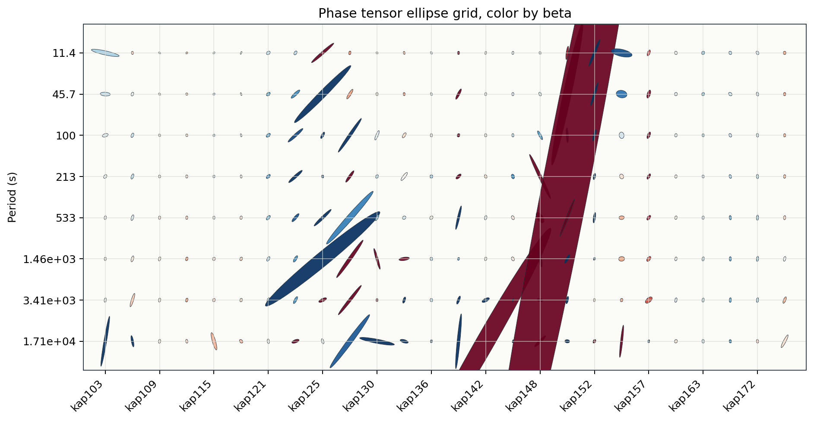

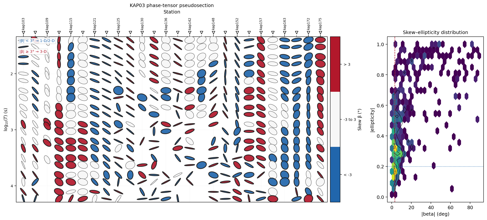

.. code-block:: pycon

   >>> from pycsamt.emtools import plot_phase_tensor_psection
   >>> ax = plot_phase_tensor_psection(
   ...     conditioned, axis_y="logperiod", period_up=False,
   ...     c_by="beta", normalise_by="shape", min_aspect=0.12,
   ...     clim=(-3.0, 3.0), color_mode="segmented",
   ...     ellipse_kws={"edgecolor": "#202020", "linewidth": 0.55},
   ...     cb_kws={"size": "3.2%", "pad": 0.08}, recursive=False,
   ... )
   >>> ax.get_title()
   ''

The first grid is retained as the compact tutorial-specific colour-by-data
view. The second is the reusable
:func:`~pycsamt.emtools.plot_phase_tensor_psection` output, with short periods
(high frequencies and shallower sensitivity) at the top. Its visible frame
uses robust finite-data percentiles. Following the common MTpy presentation,
``normalise_by="shape"`` gives every ellipse the same displayed major-axis
length and uses :math:`|\phi_{\min}/\phi_{\max}|` for its aspect ratio. The
``min_aspect`` floor prevents unstable near-zero minor axes from becoming
invisible lines; it is a display safeguard and does not alter the tensor.

The segmented colour scale assigns one colour below :math:`-3^\circ`, a
neutral colour from :math:`-3^\circ` to :math:`+3^\circ`, and one colour above
:math:`+3^\circ`. This is the compact MTpy-style dimensionality view. Set
``color_mode="continuous"`` to recover a continuous gradient, and customize
the class boundaries and colours with ``segment_bounds`` and
``segment_colors``. The scale is deliberately saturated at :math:`\beta=\pm3^\circ`, a
widely used dimensionality threshold. Values beyond that interval remain
unchanged in ``pt`` and are mapped to the end colours; the plot is therefore a
classification view, not evidence that the raw beta values were clipped.
Pass ``frame_pct=None`` for the absolute recorded range,
``period_range=(T_min, T_max)`` for an explicit range, or ``clim=(lo, hi)`` for
another fixed cross-survey colour comparison. Omit ``clim`` when the purpose is
to inspect the full robust beta distribution instead.

The two-column pseudosection is paired with the compact distribution panel in
column three. The dashed :math:`|\beta|=3^\circ` and dotted ellipticity
:math:`=0.2` guides show whether the survey is concentrated in the nominally
1-D/2-D region or contains a substantial distorted/3-D population; they do
not reject observations.

Representative station strips provide a less crowded check of how ellipse
shape and orientation evolve with period:

.. code-block:: pycon

   >>> from pycsamt.emtools import plot_phase_tensor_strip_grid
   >>> fig = plot_phase_tensor_strip_grid(
   ...     conditioned,
   ...     profiles={"KAP03": ["kap103", "kap121", "kap148", "kap175"]},
   ...     c_by="beta", clim=(-3.0, 3.0), normalise_by="cell",
   ...     min_aspect=0.12, recursive=False,
   ... )
   >>> len(fig.axes) >= 4
   True

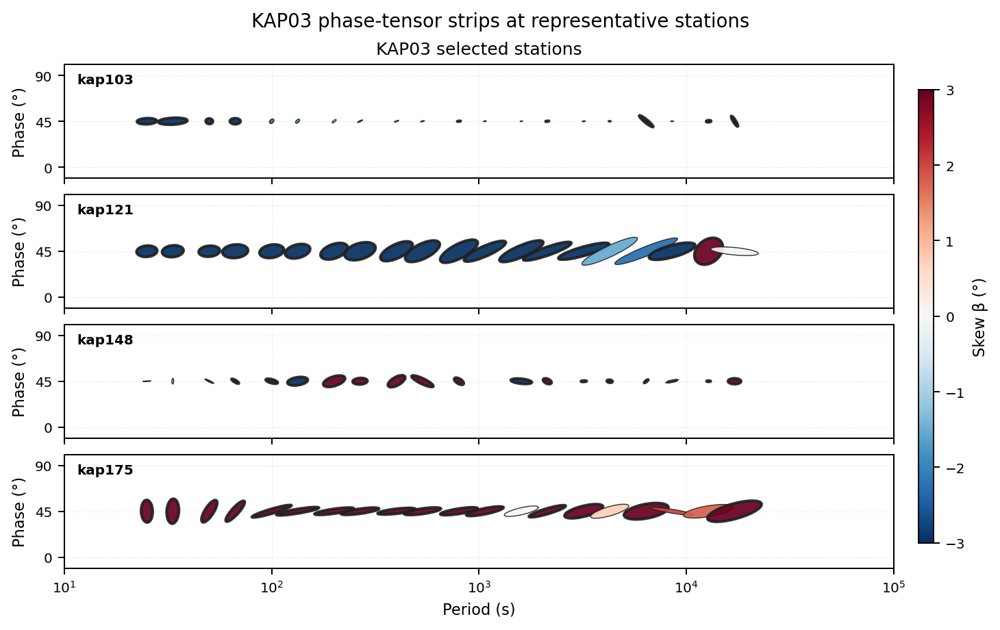

Ellipse orientation changes along the line and across period, while non-zero
``beta`` colours mark departures from an ideal 2-D response. The common
rotation should therefore be accompanied by full-tensor and tipper errors in a
3-D inversion rather than being treated as a guaranteed TE/TM separation.

.. code-dropdown:: ../../scripts/generate_tutorial_kp_mt_conditioning.py
   :language: python
   :pyobject: _plot_phase_tensor_grid
   :linenos:
   :title: View the executed phase-tensor ellipse-grid code

Rotate Impedance and Tipper
---------------------------

Rotate both impedance and tipper into the selected coordinate frame before
exporting inversion-ready EDIs:

.. code-block:: pycon

   >>> rotated = _rotate_sites(conditioned, dominant)
   >>> len(rotated), all(getattr(s, "Tip", None) is not None for s in rotated)
   (26, True)

The goal of rotation is not to make the data look perfect. It should reduce
coordinate-frame mixing and make TE/TM separation more interpretable when the
strike estimate is stable enough.

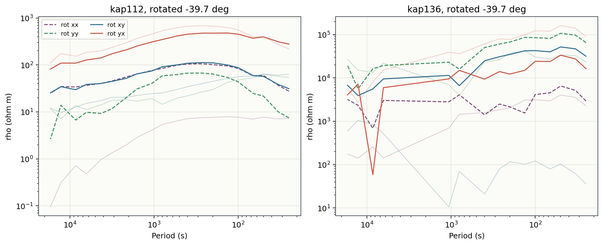

.. code-dropdown:: ../../scripts/generate_tutorial_kp_mt_conditioning.py
   :language: python
   :pyobject: _rotate_sites
   :linenos:
   :title: View the impedance-and-tipper rotation code

Export and Prove the EDI Round Trip
-----------------------------------

Write only the ``rotated`` collection: it contains sourced coordinates and
topography, synchronized impedance and tipper rows, the conservative filter,
and the documented -39.69-degree rotation. Reloading the files is part of the
workflow, because a successful write alone does not prove that metadata and
transfer functions survived serialization.

.. code-block:: pycon

   >>> written, checked, elevations = _export_and_validate(functions, rotated)
   >>> len(written), len(checked), sum(s.Tip is not None for s in checked)
   (26, 26, 26)
   >>> float(elevations.min()), float(elevations.max())
   (473.0, 1535.0)

The inversion-ready files and their manifest are written to
``results/kap03_mt_tutorial/edi_conditioned_rotated``. These checked EDIs--not
the raw files or the rejected static-shift trial--are the input for later ModEM
mesh, error-floor, and inversion examples.

.. code-dropdown:: ../../scripts/generate_tutorial_kp_mt_conditioning.py
   :language: python
   :pyobject: _export_and_validate
   :linenos:
   :title: View the executed EDI export and round-trip validation code

Prepare the Classical 3-D ModEM Inversion
-----------------------------------------

The round-tripped EDIs are now the sole input to the classical branch. ModEM
minimizes a regularized objective of the form

.. math::

   \Psi(\mathbf m)
   = \left\|\mathbf W_d\left[
       \mathbf d_{\mathrm{obs}}-\mathbf F(\mathbf m)
     \right]\right\|_2^2
     + \lambda\left\|\mathbf W_m
       (\mathbf m-\mathbf m_{\mathrm{ref}})\right\|_2^2,

where :math:`\mathbf F` is the 3-D forward operator,
:math:`\mathbf W_d` contains inverse data uncertainties,
:math:`\mathbf W_m` implements model smoothness, and :math:`\lambda` controls
the fit--roughness trade-off. Consequently, the error floor and
:term:`covariance` file are part of the scientific model, not merely file
format settings.

For KAP03 we use all four impedance components, an 8% impedance error floor,
six air layers, 28 earth layers, and a 100 :math:`\Omega\,\mathrm m`
half-space. The 25 km horizontal core scale reflects this unusually long
regional transect; copying that value to a compact AMT survey would be a
mistake.

.. code-block:: pycon

   >>> from pycsamt.models.modem import InputBuilder, ModEmConfig
   >>> cfg = ModEmConfig(
   ...     mode="3d", component_type="Full_Impedance",
   ...     error_floor_z=0.08, freq_min=5e-5, freq_max=0.04,
   ...     cell_size_h=25_000.0, n_padding_xy=5,
   ...     nz=28, n_airlayers=6, cell_size_v_top=250.0,
   ...     depth_scale=1.25, initial_rho=100.0,
   ...     smooth_x=0.3, smooth_y=0.3, smooth_z=0.2,
   ...     max_iterations=100, target_rms=1.05,
   ...     use_mpi=True, n_procs=8,
   ... )
   >>> builder = InputBuilder(config=cfg)
   >>> files = builder.build(
   ...     checked, workdir="results/kap03_mt_tutorial/inversion/modem3d",
   ...     data_filename="KAP03_ModEM.dat",
   ...     model_filename="KAP03_m0.ws",
   ...     cov_filename="KAP03.cov", ctrl_filename="KAP03.inv",
   ... )
   >>> sorted(files)
   ['control', 'covariance', 'data', 'model']
   >>> builder.model.shape, builder.model.n_air
   ((34, 49, 58), 6)

The executed build reaches 515,988 m cumulative earth depth. That is a mesh
boundary, not a claim that every cell is resolved. Deep padding reduces
boundary influence; sensitivity and resolution must still be assessed from
the recovered model and response residuals.

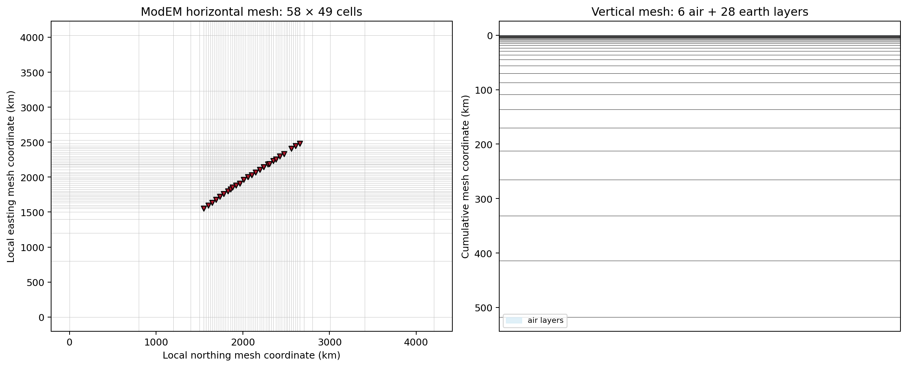

The dense central cells cover the station footprint while geometric padding
moves the numerical boundaries away from it. The vertical panel makes the
rapid depth growth explicit. The current ModEM builder writes full impedance
but not the EDI tipper block, so the conditioned tipper is retained for
independent directional QC rather than silently claimed as inverted data.

.. code-dropdown:: ../../scripts/generate_tutorial_kp_mt_inversion.py
   :language: python
   :pyobject: build_modem_inputs
   :linenos:
   :title: View the executed ModEM input-builder code

Compile and Run ModEM
---------------------

pyCSAMT prepares inputs and launches a licensed user-supplied executable; it
does not redistribute ModEM. Follow :ref:`modem_compilation` for compiler,
MPI, and executable-placement details, then print the command before starting
a potentially long run:

.. code-block:: pycon

   >>> from pycsamt.models.modem import ModEmRunner
   >>> runner = ModEmRunner(
   ...     "results/kap03_mt_tutorial/inversion/modem3d", config=cfg,
   ... )
   >>> runner.command(
   ...     "KAP03_m0.ws", "KAP03_ModEM.dat", "KAP03.inv",
   ...     covariance="KAP03.cov",
   ... )
   'mpirun -np 8 Mod3DMT -I NLCG KAP03_m0.ws KAP03_ModEM.dat KAP03.inv KAP03.cov'

After checking MPI allocation and disk space, the corresponding execution is:

.. code-block:: pycon

   >>> result = runner.run(
   ...     "KAP03_m0.ws",
   ...     "KAP03_ModEM.dat",
   ...     "KAP03.inv",
   ...     covariance="KAP03.cov",
   ...     timeout=None,
   ... )

The external inversion is intentionally not launched while building this
documentation. Once complete, inspect RMS by iteration, component-wise
residuals, boundary cells, covariance sensitivity, and whether topographic
air cells match the intended terrain before interpreting conductors. The full
result-loading workflow is developed in :doc:`prepare_modem_inversion` and
:doc:`run_classical_inversions`.

Build an Optional Triangular Profile Mesh
-----------------------------------------

A :term:`mesh` need not be rectilinear, but solver compatibility matters.
The following topography-following mesh is a genuine quality triangular mesh
with 288 nodes and 495 elements. Both axes are expressed in kilometres; the
lower panel enlarges the upper 5 km so the measured 1.06 km elevation range is
not flattened by the full 300 km MT domain:

.. code-block:: pycon

   >>> mesh = build_profile_triangle_mesh()
   triangle_nodes=288 triangle_elements=495
   >>> mesh.n_nodes, mesh.n_triangles
   (288, 495)

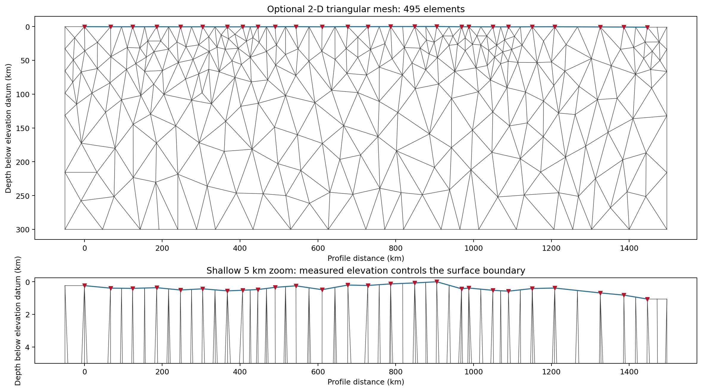

This is an optional **2-D** realization for
``TriFEM2DAdapter``/``physics="mt2d_tri"``. It cannot be passed to ModEM or
``MT3DAdapter``: both current 3-D engines require a structured mesh. Keeping
that distinction explicit prevents a visually attractive triangulation from
being misreported as the mesh used by a 3-D forward solve.

.. code-dropdown:: ../../scripts/generate_tutorial_kp_mt_inversion.py
   :language: python
   :pyobject: build_profile_triangle_mesh
   :linenos:
   :title: View the executed topographic triangular-mesh code

Configure the MT3D AI Inversion
-------------------------------

The AI branch uses the same corrected EDIs and real station geometry, but its
training pairs come from genuine small-grid 3-D Maxwell simulations through
``physics="mt3d"``. For realization :math:`i`, the network receives synthetic
responses :math:`\mathbf x^{(i)}` and learns the known gridded
log-resistivity :math:`\mathbf y^{(i)}` by minimizing

.. math::

   \mathcal L(\boldsymbol\theta)
   = \frac{1}{N}\sum_{i=1}^{N}
     \left\|g_{\boldsymbol\theta}(\mathbf x^{(i)},\mathbf A)
     -\mathbf y^{(i)}\right\|_2^2,

where :math:`\mathbf A` is the station adjacency graph. The field prediction
is an inference from this synthetic distribution; it is not a replacement for
the ModEM objective above and it has no field ground-truth resistivity.

The comparison uses two independent branches. ``physics="mt2d_tri"`` learns
on a topography-following triangular mesh, whereas ``physics="mt3d"`` learns
on a structured 3-D mesh. Each requests 100 epochs, enables :term:`early
stopping` with patience 15, uses 200 geological realizations and eight
frequencies inside the measured band. Both meshes stop at 100 km depth
rather than 250 km, and use roughly half the cell resolution of the first
pass at this tutorial -- KAP03's own 5e-5-0.04 Hz band does not resolve
structure near 250 km with useful confidence in the first place, and
coarsening plus shallowing is what makes 200 realizations (double the
original count) finish in a comparable wall-clock budget. The MT2D
configuration is concise:

.. code-block:: pycon

   >>> from pycsamt.agents import Inv2DAgent
   >>> from pycsamt.forward.maxwell.tri_fem2d import TriFEM2DAdapter
   >>> chainage_m, surface_depth_m = profile_geometry()
   >>> profile_length_m = chainage_m[-1]
   >>> mt2d = Inv2DAgent(
   ...     physics="mt2d_tri", depth_max=100_000.0,
   ...     n_train_profiles=200, epochs=100, patience=15,
   ...     n_freqs=8, n_stations_per_profile=26,
   ...     station_spacing_m=profile_length_m / 25,
   ...     mesh_target_cell_m=45_000.0,
   ...     field_grid_cell_m=22_500.0,
   ...     topo_x_m=chainage_m, topo_z_m=surface_depth_m,
   ...     mare2dem_adapter=TriFEM2DAdapter(),
   ... )

The measured elevations therefore enter the MT2D forward mesh. The MT3D
branch adds dropout uncertainty and a bounded structured solver-cell budget,
cut roughly 20x (100,000 to 5,000 cells) alongside the shallower domain and
fewer depth layers (10 to 6) to keep 200 realizations of a genuine 3-D
Maxwell solve tractable:

.. code-block:: pycon

   >>> from pycsamt.agents import Inv3DAgent
   >>> agent = Inv3DAgent(
   ...     physics="mt3d", n_layers=6,
   ...     freqs=np.geomspace(5e-5, 0.04, 8),
   ...     depth_max=100_000.0,
   ...     n_train_profiles=200, epochs=100, patience=15,
   ...     radius=120_000.0, hidden=(128, 64, 32),
   ...     dropout=0.1, n_mc=20,
   ...     correlation_length_x_m=(40_000.0, 180_000.0),
   ...     correlation_length_y_m=(40_000.0, 150_000.0),
   ...     correlation_length_z_m=(5_000.0, 25_000.0),
   ...     geology_grid_nx_ny=3, geology_grid_nz=3,
   ...     mesh_safety_factor=8.0, max_mesh_cells=5_000,
   ... )

Run the branches explicitly because every realization invokes a Maxwell
solve. They may be started in separate processes on a machine with sufficient
memory, but the captured Windows run was serialized to avoid competing OpenMP
runtimes:

.. code-block:: console

   python docs/scripts/generate_tutorial_kp_mt_inversion.py --run-ai2d \
       --n-train-profiles 200 --epochs 100 --patience 15
   python docs/scripts/generate_tutorial_kp_mt_inversion.py --run-ai \
       --n-train-profiles 200 --epochs 100 --patience 15

On this Windows build, SciPy and the installed AI backend otherwise load
competing OpenMP runtimes. The executed run used the safe sequential MKL mode
(not the unsafe duplicate-runtime override):

.. code-block:: powershell

   $env:MKL_THREADING_LAYER='SEQUENTIAL'
   $env:OMP_NUM_THREADS='1'
   python docs/scripts/generate_tutorial_kp_mt_inversion.py --run-ai2d `
       --n-train-profiles 200 --epochs 100 --patience 15
   python docs/scripts/generate_tutorial_kp_mt_inversion.py --run-ai `
       --n-train-profiles 200 --epochs 100 --patience 15

The 200-realization MT2D run completed in 1,184 seconds (about 20 minutes)
and stopped at epoch 58. MT3D completed in 3,347 seconds (about 56 minutes)
and stopped at epoch 50 -- both well short of the 100 requested, and both
substantially faster than a naive (uncoarsened, un-shallowed) 200-realization
rerun would have been:

.. code-block:: text

   MT2D: epochs=58/100, best_epoch=43, best_val_loss=0.6002
          held_out_rmse=0.3818, held_out_r2=0.3963, n=20
   MT3D: epochs=50/100, best_epoch=35, best_val_loss=0.0863
          field_rms=1.5181, held_out_rmse=0.8467,
          held_out_r2=-3.5310, n=20

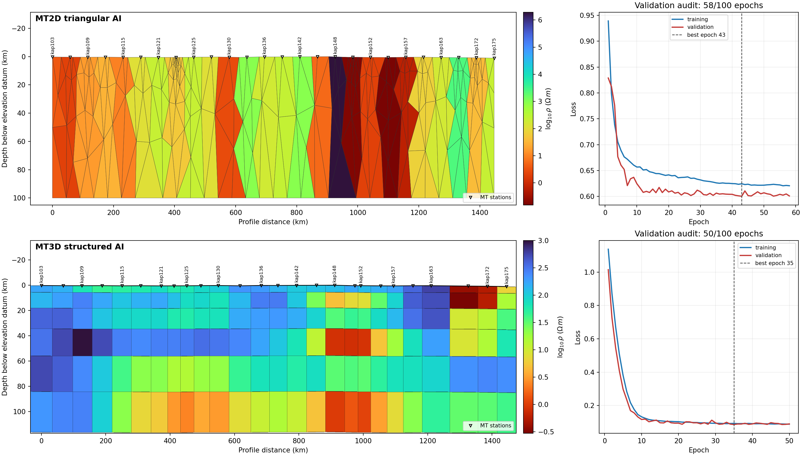

The first two columns of each row contain the inversion and the third contains
its actual epoch history. ``tripcolor`` preserves every MT2D triangle and its
edge, while ``pcolormesh`` exposes the station-by-depth cells of the MT3D
profile slice instead of smoothing them. The latter is a section through the
3-D prediction, not a claim that the full 3-D forward mesh is two-dimensional.
MT2D reaches its validation minimum at epoch 43 and stops after 15 further
non-improving epochs. MT3D reaches its minimum at epoch 35 and likewise stops
at epoch 50. Early stopping is active in both cases and restores the best
checkpoint rather than retaining the final, more overfit weights.

The models are successful computational realizations, not yet defensible
geological sections. Large adjacent resistivity contrasts and vertically
coherent bands are more consistent with an underconstrained network and
synthetic-to-field mismatch than with resolved lithosphere. The almost linear
survey also supports only a narrow 3-D corridor, so off-profile structure is
not resolved.

.. grid:: 1 1 2 2
   :gutter: 2

   .. grid-item::

      .. figure:: ../images/tutorials/condition_mt_line_with_tipper_and_rotation/kp_ai_mt3d_topography_section.png
         :alt: KAP03 AI prediction draped beneath measured station elevation
         :width: 100%

   .. grid-item::

      .. figure:: ../images/tutorials/condition_mt_line_with_tipper_and_rotation/kp_ai_mt3d_uncertainty.png
         :alt: KAP03 MC-dropout uncertainty versus profile distance and depth
         :width: 100%

The topographic rendering places station markers at their EDI elevations, but
the relief remains visually small compared with 100 km depth and still does
not enter MT3D forward physics. MC-dropout uncertainty is typically
0.10-0.20 log-resistivity units across the section, reaching about 0.27 in
the most uncertain patches, so many apparent boundaries are not stable
enough for geological picking.

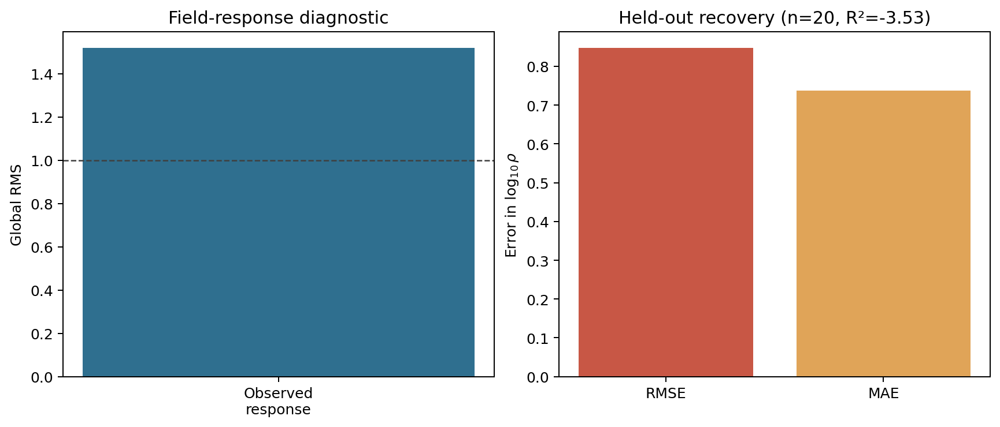

The MT3D observed-response RMS is 1.518, still above the unit-error target.
Its held-out RMSE is 0.847 log units and :math:`R^2=-3.531` over twenty
held-out realizations -- worse than MT2D's, and not meaningfully improved by
doubling the realization count to 200: the strongly negative :math:`R^2`
means the predictor is worse than the held-out mean regardless. MT2D reaches
RMSE 0.382 and :math:`R^2=0.396` over the same twenty held-out realizations,
a real improvement over the first 100-realization pass (:math:`R^2=0.337`)
-- a larger ensemble that MT2D's simpler 2-D physics was actually able to
use, unlike MT3D's. That asymmetry -- more data and a coarser, shallower
domain helping MT2D but not MT3D -- is itself informative: MT3D's difficulty
here is not primarily a training-budget problem this tutorial's own scale
can fix.
More geological realizations, a larger validation/test allocation, bounded
target resistivities, and repeated seeds are still required before either
branch supports interpretation.

The runner stores its manifest under
``results/kap03_mt_tutorial/inversion/ai_mt3d``. Accept an AI result only when
the validation minimum precedes or coincides with the restored checkpoint,
held-out synthetic recovery is credible, observed-response RMS is reported,
and uncertainty does not dominate the interpreted target. A rising validation
curve followed by early stopping is expected evidence of overfitting control;
continuing to epoch 50 despite that rise would be the problematic behavior.

``topography=True`` drapes the reported prediction and station markers over
the EDI elevations, but it does **not** change the present MT3D forward solve.
``MT3DAdapter`` currently advertises ``supports_topography=False``. The
triangular 2-D branch above is therefore the only mesh in this tutorial whose
forward-compatible surface actually follows elevation; claiming otherwise
would confuse visualization geometry with forward physics.

.. code-dropdown:: ../../scripts/generate_tutorial_kp_mt_inversion.py
   :language: python
   :pyobject: run_ai_mt2d_tri
   :linenos:
   :title: View the 100-epoch triangular MT2D execution code

.. code-dropdown:: ../../scripts/generate_tutorial_kp_mt_inversion.py
   :language: python
   :pyobject: run_ai_mt3d
   :linenos:
   :title: View the 100-epoch MT3D AI configuration and execution code

.. code-dropdown:: ../../scripts/generate_tutorial_kp_mt_inversion.py
   :language: python
   :pyobject: plot_ai_comparison
   :linenos:
   :title: View the two-row inversion and validation-grid code

Processing Decision Table
-------------------------

Summarise the choices before writing processed EDIs:

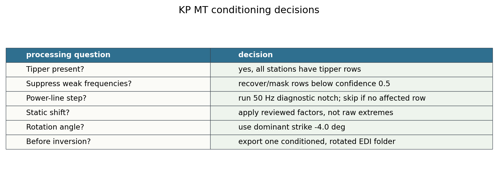

For a production run, save:

- the raw QC tables;
- the weak-frequency table;
- the rejected static-shift trial and its rationale;
- the strike estimate and rotation angle;
- the processed EDI folder;
- a short note explaining any rejected stations or frequency bands.

Adapting This Tutorial
----------------------

For your own MT data, change only the input folder and representative station
names first:

.. code-block:: pycon

   >>> edi_dir = Path("path/to/your/mt_edis")
   >>> stations_to_plot = ["S001", "S010", "S020", "S030"]

Then rerun the same sequence. If the survey lacks tipper, skip the tipper
plots but keep the tensor, QC, static-shift, phase-tensor, and rotation steps.
If the strike rose is broad or multimodal, do not force a single rotation
angle; split the line into domains or keep the original coordinate frame.

See Also
--------

:doc:`inspect_and_qc_survey`
    One-line QC tables and confidence diagnostics.

:doc:`correct_static_shift`
    Conservative static-shift correction workflow.

:doc:`prepare_occam2d_inversion`
    Prepare inversion files after the line has been conditioned.

:doc:`prepare_modem_inversion`
    Detailed ModEM file, mesh, covariance, execution, and result checks.

:doc:`ai_inversion_from_corrected_edis`
    Expanded AI geology, training, validation, uncertainty, and plotting guide.

:doc:`run_pipeline_from_config`
    Move stable processing decisions into a reusable config file.
