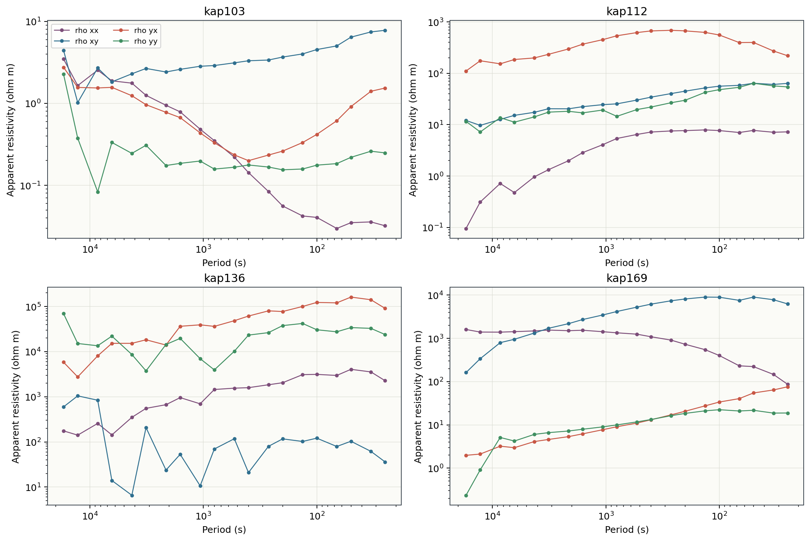
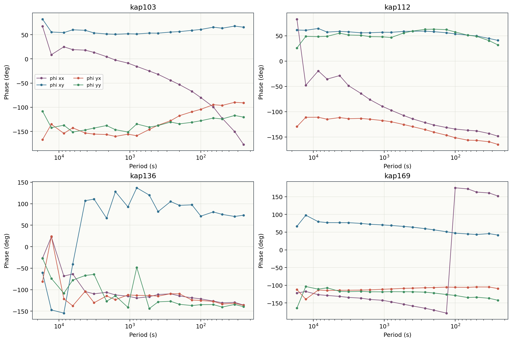

.. _tutorial_condition_mt_line_with_tipper_and_rotation:

Condition an MT Line With Tipper and Rotation
=============================================

This tutorial shows a pre-inversion conditioning workflow for an MT line
that has both full impedance tensors and tipper data. It uses the bundled KP
sample line:

``data/MT/kap03lmt_edis``

The aim is to make the processing decisions visible before inversion:

- inspect raw tensor curves and tipper response;
- identify weak frequency rows;
- apply conservative recovery/filtering;
- inspect static-shift factors before applying them;
- estimate strike and plot phase tensors;
- rotate impedance and tipper into a consistent frame.

This is an advanced tutorial. It deliberately avoids a single "automatic clean"
button because MT conditioning is interpretive: every destructive or scaling
operation should leave a trace in a table or figure.

Recommended Order
-----------------

The processing order used here is:

1. load the KP EDI line;
2. plot raw ``Zxx``, ``Zxy``, ``Zyx``, ``Zyy`` apparent resistivity and phase;
3. plot raw tipper components;
4. build station and frequency confidence tables;
5. recover or suppress low-confidence frequency rows;
6. apply power-line notching and conservative outlier filtering;
7. estimate and review static-shift factors;
8. apply reviewed static-shift factors;
9. estimate strike and plot phase tensor ellipses;
10. rotate impedance and tipper before inversion export.

Load the KP Line
----------------

.. code-block:: python
   :linenos:

   from pathlib import Path

   from pycsamt.api import read_edis

   edi_dir = Path("data/MT/kap03lmt_edis")
   survey = read_edis(
       edi_dir,
       recursive=False,
       strict=False,
       on_dup="replace",
       progress=False,
   )
   sites = survey.collection

   print(survey.summary())

Example output:

.. code-block:: text

   APIFrame: edi_survey_summary
   kind: edi.summary
   shape: 26 rows x 6 columns
   columns: station, path, n_freq, tipper, spectra, ts
   numeric: 1 columns
   missing: 0.0%
   source: data/MT/kap03lmt_edis

Every loaded KP station has tipper rows in this sample:

.. code-block:: text

   station  n_freq  tipper  spectra
    kap103      20    True    False
    kap106      20    True    False
    kap109      18    True    False
    kap112      20    True    False
    kap115      20    True    False
    kap118      20    True    False

Plot Raw Tensor Curves
----------------------

Before removing frequencies or scaling tensors, plot the raw components. The
off-diagonal components ``Zxy`` and ``Zyx`` normally carry the TE/TM response,
while the diagonal components ``Zxx`` and ``Zyy`` reveal 3-D effects, noise,
or rotation issues.

.. code-block:: python
   :linenos:

   import numpy as np

   def rho_phase(site, comp):
       freq = np.asarray(site.Z.freq, dtype=float)
       z = np.asarray(site.Z.z, dtype=complex)[:, comp[0], comp[1]]
       rho = 0.2 * np.abs(z) ** 2 / np.maximum(freq, 1e-30)
       phase = np.angle(z, deg=True)
       return freq, rho, phase

   for station in ["kap103", "kap112", "kap136", "kap169"]:
       site = next(site for site in sites if site.station == station)
       freq, rho_xy, phi_xy = rho_phase(site, (0, 1))
       freq, rho_yx, phi_yx = rho_phase(site, (1, 0))

The generated figures show that this line is not a simple two-component data
set; diagonal terms and phase behavior need to be reviewed before rotation.

Plot Tipper Components
----------------------

Tipper data help identify lateral conductivity gradients and 3-D structure.
The KP EDI files store the tipper container as ``site.Tip``:

.. code-block:: python
   :linenos:

   site = next(site for site in sites if site.station == "kap103")
   tip = site.Tip

   freq = tip.freq
   tx = tip.tipper[:, 0, 0]
   ty = tip.tipper[:, 0, 1]

   tx_amp = abs(tx)
   ty_amp = abs(ty)

.. figure:: ../images/tutorials/condition_mt_line_with_tipper_and_rotation/kp_raw_tipper_components.png
   :alt: Raw KP tipper amplitudes
   :width: 100%

Build QC Tables
---------------

Use station-level and frequency-level tables before deciding what to suppress:

.. code-block:: python
   :linenos:

   from pycsamt.emtools import (
       build_qc_table,
       frequency_confidence_table,
       station_confidence_table,
   )

   qc = build_qc_table(
       sites,
       include_skew=True,
       recursive=False,
       api=True,
   ).to_pandas(copy=True)

   station_ci = station_confidence_table(
       sites,
       method="composite",
       recursive=False,
       api=True,
   ).to_pandas(copy=True)

   freq_ci = frequency_confidence_table(
       sites,
       method="composite",
       ci_hi=0.9,
       ci_lo=0.5,
       recursive=False,
       api=True,
   ).to_pandas(copy=True)

Example station QC:

.. code-block:: text

   station  n_freq  n_tip  frac_ok  snr_med  skew_med
    kap103      20     20    1.000   36.494    50.912
    kap106      20     20    1.000   33.926    54.898
    kap109      18     18    1.000   65.851    70.845
    kap112      20     20    1.000  174.211    62.911
    kap115      20     20    1.000  208.660    46.219
    kap118      20     20    1.000  203.016    25.692

The frequency screen found 518 station-frequency rows and 30 weak rows
(``confidence < 0.5``), about 5.8 percent of the line.

.. figure:: ../images/tutorials/condition_mt_line_with_tipper_and_rotation/kp_qc_frequency_confidence.png
   :alt: KP frequency confidence by station
   :width: 100%

.. figure:: ../images/tutorials/condition_mt_line_with_tipper_and_rotation/kp_bad_frequency_mask.png
   :alt: KP bad-frequency screening summary
   :width: 90%

Recover, Suppress, and Filter Conservatively
--------------------------------------------

For first-pass conditioning, do not invent a full new response. Use a narrow
sequence that preserves the trend and marks weak rows:

.. code-block:: python
   :linenos:

   from pycsamt.emtools import (
       hampel_filter_freq,
       notch_powerline,
       recover_low_confidence_frequencies,
       smooth_rho_phase,
   )

   notched = notch_powerline(
       sites,
       mains_hz=50.0,
       n_harm=20,
       tol_hz=0.06,
       recursive=False,
   )

   recovered = recover_low_confidence_frequencies(
       notched,
       method="composite",
       ci_hi=0.9,
       ci_lo=0.5,
       interpolation="linear",
       recursive=False,
   )

   filtered = hampel_filter_freq(
       recovered,
       win=3,
       nsig=3.0,
       recursive=False,
   )

   conditioned = smooth_rho_phase(
       filtered,
       components="offdiag",
       degree=3,
       smooth_rho=True,
       smooth_phase=True,
       recursive=False,
   )

Power-line notching is included as a diagnostic conditioning step. If your
survey has no rows near the local mains harmonics, the step should have little
or no effect; keep the figure or report that proves that.

.. figure:: ../images/tutorials/condition_mt_line_with_tipper_and_rotation/kp_filter_before_after.png
   :alt: KP raw and conditioned apparent resistivity curves
   :width: 100%

Review and Apply Static Shift
-----------------------------

Static shift changes apparent resistivity scale. It should not change phase.
Estimate factors, review them, then apply only defensible values:

.. code-block:: python
   :linenos:

   from pycsamt.emtools import apply_ss_factors, estimate_ss_ama

   factors = estimate_ss_ama(
       sites,
       sort_by="name",
       half_window=3,
       max_skew=None,
       recursive=False,
       api=True,
   ).to_pandas(copy=True)

   factors["fac_z_reviewed"] = factors["fac_z"].clip(
       lower=0.35,
       upper=2.85,
   )

   reviewed = factors[["station", "fac_z_reviewed"]].rename(
       columns={"fac_z_reviewed": "fac_z"}
   )

   shifted = apply_ss_factors(
       sites,
       reviewed,
       key="fac_z",
       inplace=False,
       recursive=False,
   )

The clipping in this example is not a universal rule. It is a teaching guard:
large factors should be inspected, justified, or rejected before they are
allowed to rescale impedance.

.. code-block:: text

   station  fac_z  fac_z_reviewed  n_used
    kap103   1.91            1.91      20
    kap106   1.61            1.61      20
    kap109  0.529           0.529      18
    kap112  0.237            0.35      20
    kap115   3.17            2.85      20
    kap118  0.289            0.35      20
    kap121  0.578           0.578      20
    kap123   1.35            1.35      20

.. figure:: ../images/tutorials/condition_mt_line_with_tipper_and_rotation/kp_static_shift_factors.png
   :alt: KP static-shift factors before and after review clipping
   :width: 100%

.. figure:: ../images/tutorials/condition_mt_line_with_tipper_and_rotation/kp_static_shift_before_after.png
   :alt: KP static-shift before and after apparent resistivity
   :width: 100%

Estimate Strike and Plot Phase Tensors
--------------------------------------

After QC and static-shift review, estimate a dominant strike direction. The
example uses Swift-style strike values from the anisotropy table and a circular
mean with 180-degree periodicity:

.. code-block:: python
   :linenos:

   import numpy as np

   from pycsamt.emtools.anisotropy import analyze_anisotropy

   detail = analyze_anisotropy(shifted, recursive=False)
   strikes = detail["strike_deg"].dropna().to_numpy()

   doubled = np.deg2rad(2.0 * strikes)
   dominant = 0.5 * np.rad2deg(
       np.arctan2(np.sin(doubled).mean(), np.cos(doubled).mean())
   )
   print(dominant)

For this run the dominant strike is about ``-3.97`` degrees. The rose diagram
also shows the spread, which matters more than a single number.

.. figure:: ../images/tutorials/condition_mt_line_with_tipper_and_rotation/kp_strike_rose.png
   :alt: KP strike rose diagram
   :width: 70%

Phase tensor ellipses show orientation, ellipticity, and skew-like behavior
without relying on static-shift-sensitive amplitudes:

.. code-block:: python
   :linenos:

   from pycsamt.emtools.tensor import build_phase_tensor_table

   pt = build_phase_tensor_table(shifted, recursive=False)
   print(pt[["station", "period", "theta", "beta", "ellipt"]].head())

.. figure:: ../images/tutorials/condition_mt_line_with_tipper_and_rotation/kp_phase_tensor_grid.png
   :alt: KP phase tensor ellipse grid
   :width: 100%

Rotate Impedance and Tipper
---------------------------

Rotate both impedance and tipper into the selected coordinate frame before
exporting inversion-ready EDIs:

.. code-block:: python
   :linenos:

   import copy

   rotated = copy.deepcopy(shifted)
   for site in rotated:
       site.Z.rotate(dominant)
       if getattr(site, "Tip", None) is not None:
           site.Tip.rotate(dominant)

The goal of rotation is not to make the data look perfect. It should reduce
coordinate-frame mixing and make TE/TM separation more interpretable when the
strike estimate is stable enough.

.. figure:: ../images/tutorials/condition_mt_line_with_tipper_and_rotation/kp_rotation_before_after.png
   :alt: KP impedance before and after rotation
   :width: 100%

Processing Decision Table
-------------------------

Summarise the choices before writing processed EDIs:

.. figure:: ../images/tutorials/condition_mt_line_with_tipper_and_rotation/kp_processing_decision_table.png
   :alt: KP MT conditioning decision table
   :width: 100%

For a production run, save:

- the raw QC tables;
- the weak-frequency table;
- the static-shift factor table before and after review;
- the strike estimate and rotation angle;
- the processed EDI folder;
- a short note explaining any rejected stations or frequency bands.

Adapting This Tutorial
----------------------

For your own MT data, change only the input folder and representative station
names first:

.. code-block:: python
   :linenos:

   edi_dir = Path("path/to/your/mt_edis")
   stations_to_plot = ["S001", "S010", "S020", "S030"]

Then rerun the same sequence. If the survey lacks tipper, skip the tipper
plots but keep the tensor, QC, static-shift, phase-tensor, and rotation steps.
If the strike rose is broad or multimodal, do not force a single rotation
angle; split the line into domains or keep the original coordinate frame.

See Also
--------

:doc:`inspect_and_qc_survey`
    One-line QC tables and confidence diagnostics.

:doc:`correct_static_shift`
    Conservative static-shift correction workflow.

:doc:`prepare_occam2d_inversion`
    Prepare inversion files after the line has been conditioned.

:doc:`run_pipeline_from_config`
    Move stable processing decisions into a reusable config file.
