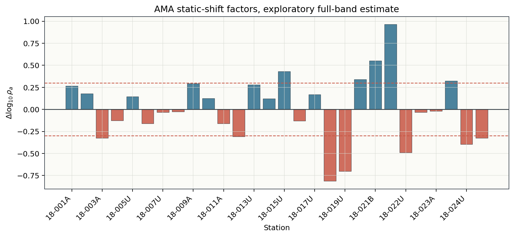
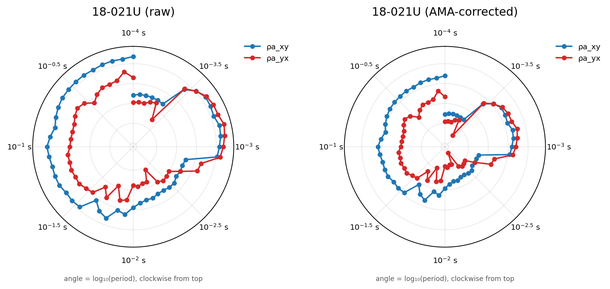
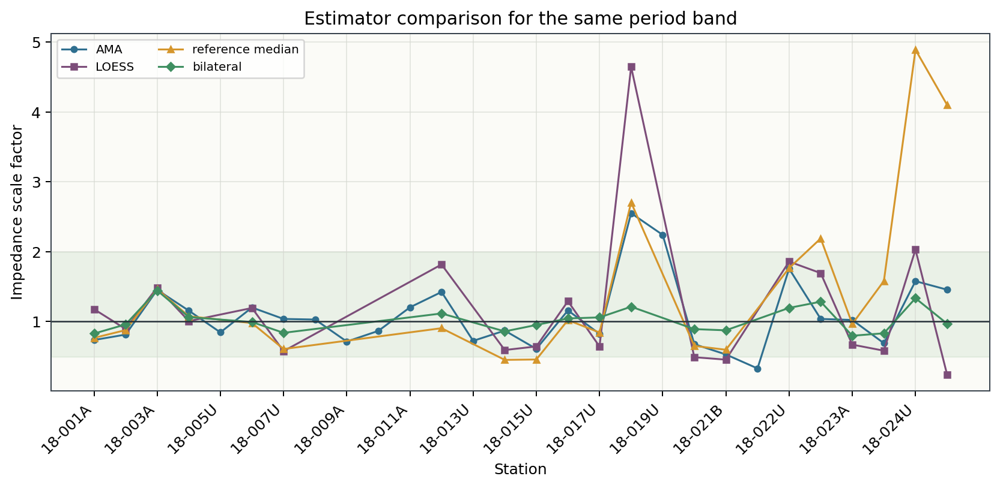
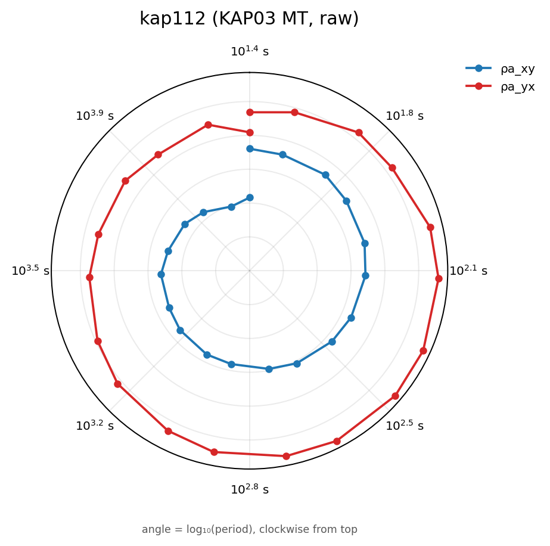
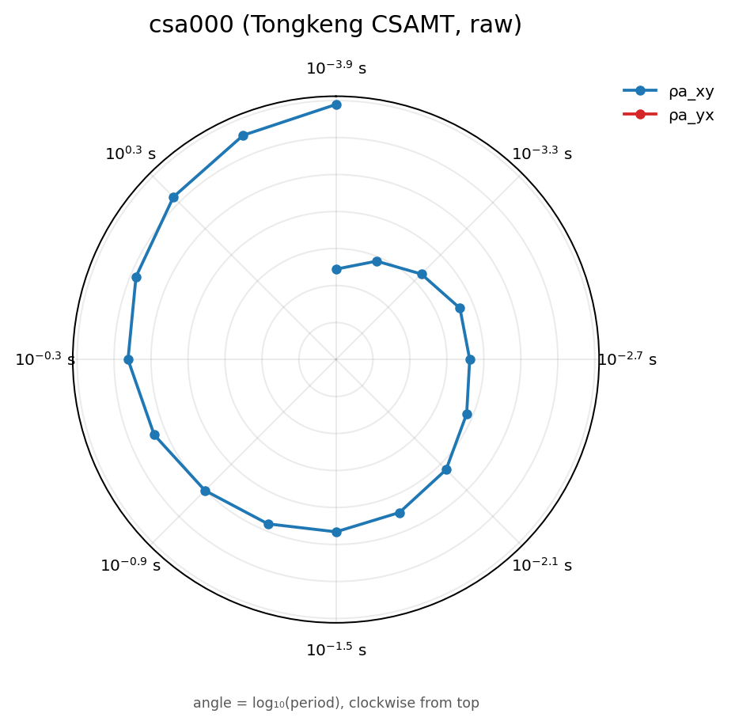

.. _tutorial_correct_static_shift:

Correct Static Shift
====================

This tutorial shows a conservative static-shift correction workflow for EDI
surveys. It is written for the common profile-processing case: you have already
loaded and inspected a survey, you suspect that some apparent-resistivity
curves are shifted vertically, and you want to estimate station-level
correction factors before preparing inversion files.

Static-shift correction should be handled carefully. It changes impedance
amplitudes and apparent-resistivity levels. It does not fix bad phases,
frequency-dependent source effects, wrong station coordinates, incorrect
component orientation, or a poorly converted EDI file. Always inspect before
and after correction.

This tutorial deliberately works through three real survey types --
:term:`AMT`, :term:`MT`, and :term:`CSAMT` -- because static shift does not
behave the same way on all three. AMT gives a clean, worked "apply a
correction" example. A long-period MT line shows large, real factors that
should still not be trusted blindly because the station spacing cannot
constrain them. A CSAMT line shows that per-station factors and
:func:`~pycsamt.emtools.ss.detect_near_surface` classification can disagree
station by station, so a single average factor is not automatically the
right answer. Seeing all three outcomes -- correct, question, and
investigate further -- is the point, not just the mechanics of one function
call.

What You Will Learn
-------------------

After this tutorial you should be able to:

- diagnose when static-shift correction is worth trying
- estimate station-level correction factors with AMA
- inspect the meaning of ``delta_log10_rho``, ``fac_rho``, and ``fac_z``
- apply the correction without mutating the original survey
- compare before and after correction using static-shift QC plots
- read the static-shift radar diagnostic and interpret its period/frequency
  axis correctly
- export corrected EDI files and a correction manifest
- choose between AMA, LOESS, reference-median, and bilateral correction styles
- run static-shift correction from a pipeline configuration when needed
- recognize when a survey's own geometry or distortion mix means the
  correction should be treated with more caution than the AMT case

Prerequisites
-------------

Run first-pass survey inspection before correcting static shift:

.. code-block:: pycon

   >>> from pycsamt.api import read_edis
   >>> from pycsamt.emtools.qc import build_qc_table, station_confidence_table
   >>> survey = read_edis(
   ...     "data/AMT/WILLY_DATA/L18PLT",
   ...     recursive=False,
   ...     strict=False,
   ...     progress=False,
   ... )
   >>> sites = survey.collection
   >>> qc = build_qc_table(sites, api=True)
   >>> confidence = station_confidence_table(sites, method="composite", api=True)
   >>> print(qc)
   >>> print(confidence)

Static-shift correction is usually a second step. If the survey did not pass
basic loading, station-order, frequency-coverage, and quality checks, solve
those problems first. See :doc:`inspect_and_qc_survey`.

This tutorial uses the bundled WILLY ``L18PLT`` line so the printed output and
figures are reproducible. Replace the path with your own EDI directory when
you repeat the workflow on another survey.

When Static Shift Is a Good Candidate
-------------------------------------

Static shift is plausible when:

- one station is shifted up or down relative to neighboring stations;
- the apparent-resistivity curve shape is similar to neighboring curves;
- phase does not show an equivalent anomaly;
- the offset is approximately frequency independent over the selected band;
- the station belongs to a profile where neighboring stations can define a
  local spatial trend.

Static-shift correction is risky when:

- the anomaly is frequency dependent;
- phase changes strongly at the same station;
- the station order or coordinates are wrong;
- several neighboring stations are shifted together because the geology is
  genuinely different;
- the data contain strong CSAMT source effects or near-field behavior;
- the EDI file came from another software package and still needs
  recomputation or component normalization.

For the scientific background, read :doc:`../theory/static_shift`.

Three Real Surveys, Three Different Pictures
---------------------------------------------

Every number and figure in this tutorial comes from one of three bundled,
real field surveys:

``data/AMT/WILLY_DATA/L18PLT``
    28-station AMT line, 53 frequencies per station. This is the deep-dive
    dataset: it is used for the full estimate/inspect/apply/compare
    workflow below because it has a station spacing and a frequency band
    that make AMA's neighbour-trend assumption reasonable.

``data/MT/kap03lmt_edis``
    26-station KAP03 long-period MT profile from the Southern African
    Magnetotelluric Experiment (SAMTEX), roughly 60 km long, 18-20
    frequencies per station spanning periods from about 25 s to nearly 5
    hours. It reappears later in this tutorial as a survey where AMA
    returns large, real factors that are still not safe to apply without
    independent constraints -- see
    :doc:`condition_mt_line_with_tipper_and_rotation` for the fuller
    conditioning workflow this line goes through.

``data/CSAMT``
    10-station Tongkeng CSAMT line, 50 m station spacing, a real grounded-
    dipole controlled-source survey. It reappears later as a survey where
    the AMA factors and the near-surface/static-shift classifier disagree
    from station to station, which is itself the useful CSAMT lesson --
    see :doc:`map_groundwater_geology_from_csamt` for the fuller
    single-component processing workflow.

.. warning::

   Static-shift factors are numeric output from a real estimator running on
   real data, not fixed constants. They depend on the installed pyCSAMT
   version, the exact ordering and windowing parameters, and the data
   itself. Regenerate the numbers on your own installation rather than
   trusting cached values copied from another environment or an older
   documentation build.

Create a Review Folder
----------------------

Keep factors, plots, and corrected files together.

.. code-block:: pycon

   >>> from pathlib import Path
   >>> review_dir = Path("static_shift_review")
   >>> plot_dir = review_dir / "plots"
   >>> corrected_dir = review_dir / "corrected_edis"
   >>> plot_dir.mkdir(parents=True, exist_ok=True)
   >>> corrected_dir.mkdir(parents=True, exist_ok=True)

Estimate AMA Correction Factors
-------------------------------

The standard interactive correction path uses
:func:`pycsamt.emtools.ss.estimate_ss_ama`. AMA means adaptive moving average:
each station is compared with its neighbors in log apparent-resistivity space.

.. code-block:: pycon

   >>> from pycsamt.emtools.ss import estimate_ss_ama
   >>> factors = estimate_ss_ama(
   ...     sites,
   ...     half_window=3,
   ...     weights="tri",
   ...     pband=None,
   ...     max_skew=6.0,
   ...     robust_freq="median",
   ...     robust_overall="median",
   ...     recursive=False,
   ...     api=True,
   ... )
   >>> factor_df = factors.to_pandas(copy=True)
   >>> factor_df.to_csv(review_dir / "static_shift_factors_ama.csv", index=False)
   >>> print(factor_df.head(5).to_string(index=False))
   station  delta_log10_rho  fac_rho    fac_z  n_used
   18-001A         0.174137 0.669673 0.818336      28
   18-002U         0.172052 0.672895 0.820302      25
   18-003A        -0.195724 1.569366 1.252743      19
   18-004A         0.017444 0.960630 0.980117      16
   18-005U         0.072309 0.846625 0.920122      18
   >>> print(factor_df["n_used"].describe().to_string())
   count    28.000000
   mean     14.178571
   std       6.543606
   min       3.000000
   25%       8.750000
   50%      16.000000
   75%      18.250000
   max      28.000000

On ``L18PLT``, the conservative skew filter still returns a factor for every
station, but the number of surviving frequency samples varies a lot from
station to station. ``n_used`` drops as low as 3 out of
53 frequencies at some stations, which means the skew mask
(``max_skew=6.0``) is rejecting most of the band there. For this line, the
first-pass QC tutorial already showed high skew across the profile. A strict
skew mask leaves too few samples at the weakest stations for a comfortable
automatic correction, so the factors above should be treated as review
evidence, not applied blindly.

The factor table contains:

``station``
    Station identifier used to match the factor back to the EDI object.

``delta_log10_rho``
    Estimated log10 apparent-resistivity offset before correction. Positive
    values mean the station is high relative to its local trend. Negative
    values mean it is low.

``fac_rho``
    Apparent-resistivity scale factor. This is the multiplicative correction
    for apparent resistivity.

``fac_z``
    Impedance scale factor. pyCSAMT applies this to the impedance tensor
    because apparent resistivity is proportional to impedance amplitude
    squared.

``n_used``
    Number of frequency samples used to estimate the station factor.

Choose the Spatial Order
------------------------

AMA needs the profile order to make physical sense: it compares each station
against its ``half_window`` nearest *neighbours in that order*, so a wrong
order makes the algorithm compare stations that are not actually adjacent in
the field. The ``sort_by`` parameter controls that order, and leaving it at
its default, ``sort_by=None``, is normally the right choice.

``sort_by=None`` (default)
    Inherit whatever ordering :func:`~pycsamt.emtools.ensure_sites`
    already applied while loading ``sites`` -- by default,
    :data:`pycsamt.api.PYCSAMT_ORDERING`'s ``mode="auto"`` policy, which
    computes a coordinate-derived profile **chainage** and uses it only when
    the station coordinates pass a conservative single-line geometry check
    (linearity and cross-track thresholds); otherwise it falls back to input
    order rather than guessing. This robust chainage handles oblique and
    gently curved lines correctly, unlike a raw longitude or latitude sort.
    This tutorial does **not** override ``sort_by`` for exactly this reason.

``sort_by="lon"`` / ``sort_by="lat"``
    Force a raw longitude or latitude sort, bypassing the chainage check.
    Only reach for these when you have specifically verified the line is
    nearly due east-west or north-south -- on an oblique line they can
    silently reorder stations incorrectly, which is why they are no longer
    the default as of pyCSAMT 2.2.

``sort_by="name"``
    Use station name order. Useful when station names already encode line
    order and coordinates are missing or unreliable.

If you are unsure which order was actually used, inspect the coordinates (or
call :func:`~pycsamt.emtools.ensure_sites` yourself with an explicit
``order_by``) before trusting a large correction factor.

Use a Period Band
-----------------

Sometimes only part of the spectrum is appropriate for estimating static
shift. Use ``pband=(min_period, max_period)`` in seconds to restrict the
factor estimate.

.. code-block:: pycon

   >>> factors_mid_band = estimate_ss_ama(
   ...     sites,
   ...     sort_by="name",
   ...     half_window=3,
   ...     weights="tri",
   ...     pband=(0.01, 10.0),
   ...     max_skew=6.0,
   ...     recursive=False,
   ...     api=True,
   ... )
   >>> factors_mid_band.to_pandas(copy=True).to_csv(
   ...     review_dir / "static_shift_factors_ama_0p01s_10s.csv",
   ...     index=False,
   ... )

Choose a band where the curves appear shifted but not strongly distorted. Avoid
using a band dominated by dead-band noise, transmitter source effects, or
obvious phase jumps.

For the remaining figures in this tutorial, we use ``max_skew=None`` as an
exploratory setting so every frequency contributes to the demonstration. In a
production workflow, keep the stricter setting unless your dimensionality
review justifies relaxing it.

.. code-block:: pycon

   >>> factors_full_band = estimate_ss_ama(
   ...     sites,
   ...     sort_by="name",
   ...     half_window=3,
   ...     weights="tri",
   ...     pband=None,
   ...     max_skew=None,
   ...     recursive=False,
   ...     api=True,
   ... )
   >>> factor_df = factors_full_band.to_pandas(copy=True)
   >>> print(factor_df.head(6).to_string(index=False))
   station  delta_log10_rho  fac_rho    fac_z  n_used
   18-001A         0.265869 0.542164 0.736318      53
   18-002U         0.178793 0.662532 0.813961      53
   18-003A        -0.324956 2.113273 1.453710      53
   18-004A        -0.126610 1.338473 1.156924      53
   18-005U         0.145856 0.714734 0.845419      53
   18-006A        -0.159680 1.444375 1.201822      53
   >>> print(factor_df[["fac_rho", "fac_z", "n_used"]].describe().to_string())
            fac_rho      fac_z  n_used
   count  28.000000  28.000000    28.0
   mean    1.430922   1.091054    53.0
   std     1.434726   0.499430     0.0
   min     0.108562   0.329488    53.0
   25%     0.537734   0.733285    53.0
   50%     1.053300   1.026299    53.0
   75%     1.594623   1.259177    53.0
   max     6.514305   2.552314    53.0

With every frequency contributing (``max_skew=None``), every station reaches
``n_used=53``, and the fitted offsets range from ``fac_rho=0.109`` to
``fac_rho=6.514`` across the line.

The tutorial figures are generated by
``docs/scripts/generate_tutorial_static_shift.py``. The first figure shows the
estimated station offsets. Blue bars have positive
``delta_log10_rho`` and therefore receive a downward resistivity correction;
red bars move upward.

Inspect Large Corrections
-------------------------

Large static-shift factors should be reviewed before they are applied.

.. code-block:: pycon

   >>> large = factor_df[
   ...     (factor_df["fac_rho"] < 0.5)
   ...     | (factor_df["fac_rho"] > 2.0)
   ...     | (factor_df["n_used"] < 5)
   ... ]
   >>> print("stations requiring manual review")
   stations requiring manual review
   >>> print(large[["station", "delta_log10_rho", "fac_rho", "fac_z", "n_used"]].to_string(index=False))
   station  delta_log10_rho  fac_rho    fac_z  n_used
   18-003A        -0.324956 2.113273 1.453710      53
   18-012A        -0.307242 2.028811 1.424364      53
   18-015U         0.430200 0.371364 0.609397      53
   18-018A        -0.813868 6.514305 2.552314      53
   18-019U        -0.701074 5.024286 2.241492      53
   18-020A         0.339255 0.457873 0.676663      53
   18-021B         0.552005 0.280540 0.529661      53
   18-021U         0.964321 0.108562 0.329488      53
   18-022U        -0.489865 3.089337 1.757651      53
   18-023V         0.321711 0.476748 0.690470      53
   18-024U        -0.396803 2.493463 1.579070      53
   18-025A        -0.326893 2.122723 1.456957      53

12 of the 28 stations fall outside the ``0.5``-``2.0`` band or have too few
usable samples. A factor outside that range is not automatically wrong, but
it should make you ask why the station is so different from its neighbors.
``18-021U`` is the most extreme case on this line (``fac_rho=0.109``, nearly
a factor of 9), and it reappears below as the worked before/after example.

Apply Factors Manually
----------------------

The safest workflow is to estimate factors first, inspect them, then apply
them to a copy of the site collection with
:func:`pycsamt.emtools.ss.apply_ss_factors`.

.. code-block:: pycon

   >>> from pycsamt.emtools.ss import apply_ss_factors
   >>> corrected = apply_ss_factors(
   ...     sites,
   ...     factors_full_band,
   ...     key="fac_z",
   ...     inplace=False,
   ...     recursive=False,
   ...     verbose=1,
   ... )
   >>> applied_delta = (-factor_df.set_index("station")["delta_log10_rho"]).round(6)
   >>> print(applied_delta.head(6).to_string())
   station
   18-001A   -0.265869
   18-002U   -0.178793
   18-003A    0.324956
   18-004A    0.126610
   18-005U   -0.145856
   18-006A    0.159680

Because apparent resistivity is proportional to ``|Z|^2``, applying
``fac_z`` changes determinant apparent resistivity by approximately
``-delta_log10_rho`` in log10 space, confirmed directly above rather than
merely asserted.

Use ``inplace=False`` during exploration. This returns a corrected copy and
keeps ``sites`` unchanged for comparison. Use ``inplace=True`` only inside a
controlled pipeline or after you have saved the original state.

Apply AMA in One Step
---------------------

For routine processing, :func:`pycsamt.emtools.ss.correct_ss_ama` combines
factor estimation and application:

.. code-block:: pycon

   >>> from pycsamt.emtools.ss import correct_ss_ama
   >>> corrected = correct_ss_ama(
   ...     sites,
   ...     sort_by="name",
   ...     half_window=3,
   ...     weights="tri",
   ...     pband=None,
   ...     max_skew=None,
   ...     robust_freq="median",
   ...     robust_overall="median",
   ...     inplace=False,
   ...     recursive=False,
   ...     verbose=1,
   ... )
   >>> type(corrected).__name__
   'Sites'

The one-step call returns a corrected ``Sites`` collection directly.
The one-step function is convenient, but the two-step factor workflow is better
when you are still learning the dataset.

Compare Before and After
------------------------

After correction, compare the original and corrected collections. A good
correction should reduce station-level vertical jumps without creating
frequency-dependent artifacts.

.. code-block:: pycon

   >>> import matplotlib.pyplot as plt
   >>> from pycsamt.emtools.ss import (
   ...     plot_ss_delta_profile,
   ...     plot_ss_delta_psection,
   ...     plot_ss_station_curves,
   ... )
   >>> ax = plot_ss_delta_profile(
   ...     sites,
   ...     corrected,
   ...     pband=None,
   ...     robust="median",
   ... )
   >>> ax.figure.savefig(plot_dir / "delta_profile.png", dpi=200, bbox_inches="tight")
   >>> plt.close(ax.figure)
   >>> ax = plot_ss_delta_psection(
   ...     sites,
   ...     corrected,
   ...     axis_y="logperiod",
   ...     pband=None,
   ... )
   >>> ax.figure.savefig(plot_dir / "delta_psection.png", dpi=200, bbox_inches="tight")
   >>> plt.close(ax.figure)
   >>> worst_station = str(
   ...     factor_df.loc[factor_df["delta_log10_rho"].abs().idxmax(), "station"]
   ... )
   >>> worst_station
   '18-021U'
   >>> ax = plot_ss_station_curves(
   ...     sites,
   ...     corrected,
   ...     station=worst_station,
   ...     pband=None,
   ... )
   >>> ax.figure.savefig(plot_dir / "station_curve_before_after.png", dpi=200)
   >>> plt.close(ax.figure)

The generated determinant-resistivity comparison below is intentionally simple:
the top panel reduces the correction to one median value per station, and the
bottom panel shows that the applied static-shift factor is period independent.

.. grid:: 1 1 2 2
   :gutter: 2

   .. grid-item::

      .. image:: ../images/tutorials/correct_static_shift/before_after_delta_grid.png
         :alt: Static-shift correction by station and by period for the L18PLT line.
         :width: 100%

   .. grid-item::

      .. image:: ../images/tutorials/correct_static_shift/station_curve_before_after.png
         :alt: Before and after apparent-resistivity curve for the largest corrected station.
         :width: 100%

The profile plot shows one correction value per station. The pseudo-section
shows whether the correction is approximately uniform across period. The
station-curve plot is useful for manual review of individual stations.
``worst_station`` here is ``18-021U``, the most extreme station already
flagged above (``fac_rho=0.109``): its raw determinant apparent resistivity
spikes to about 25,000 :math:`\Omega\cdot`\ m near :math:`10^{-3}` s, roughly
20 times the level of the surrounding periods, and the correction pulls that
spike back down to a curve shape consistent with its neighbours -- exactly
the frequency-independent-offset signature described in
:doc:`../theory/static_shift`.

Read the Static-Shift Radar
----------------------------

The profile and pseudo-section above summarize the correction numerically.
:func:`pycsamt.emtools.ss.plot_ss_radar` gives a complementary, single-station
view: apparent resistivity plotted on a polar axis, where the **radius** is
:math:`\log_{10}\rho_a` (or :math:`\rho_a` with ``radial="rho"``) and the
**angle** encodes period or frequency rather than a compass direction. The
``xy`` and ``yx`` off-diagonal components are drawn as two separate curves
that trace out roughly one revolution per decade of period.

.. code-block:: pycon

   >>> import numpy as np
   >>> import matplotlib.pyplot as plt
   >>> from pycsamt.emtools.ss import plot_ss_radar
   >>> fig, axes = plt.subplots(1, 2, figsize=(9.6, 4.8), subplot_kw={"polar": True})
   >>> _ = plot_ss_radar(sites, station=worst_station, rotate="none", ax=axes[0])
   >>> _ = axes[0].set_title(f"{worst_station} (raw)")
   >>> _ = plot_ss_radar(corrected, station=worst_station, rotate="none", ax=axes[1])
   >>> _ = axes[1].set_title(f"{worst_station} (AMA-corrected)")
   >>> r_all = np.concatenate([line.get_ydata() for ax in axes for line in ax.lines])
   >>> r_all = r_all[np.isfinite(r_all)]
   >>> for ax in axes:
   ...     _ = ax.set_ylim(r_all.min(), r_all.max())

Because the angle in this plot is period, not direction, its tick labels are
period values (``$10^{-3}$ s``, ``$10^{-2}$ s``, ...) rather than compass
degrees, and a short caption under the plot states the convention explicitly
(``angle = log10(period), clockwise from top``). ``rotate="none"`` is used
here so the ``xy``/``yx`` comparison is not also confounded by a phase-tensor
rotation; the default ``rotate="pt"`` is usually more informative when
inspecting dimensionality rather than static shift specifically. The shared
``set_ylim`` call matters: matplotlib polar axes otherwise autoscale each
panel's radius independently, which would visually hide a uniform shift by
letting both panels fill their own frame the same way.

Both panels share one radial scale, so the shift is visible directly: the
raw curve (left) sits at a systematically larger radius than the corrected
curve (right) at almost every angle, which is exactly what a
frequency-independent multiplicative offset should look like -- a uniform
inward pull at every period, not a change of shape. Compare this against
:eq:`eq-ss-factor-relation` and :eq:`eq-ss-phase-invariance` in
:doc:`../theory/static_shift`: the radial contraction here is the same
``fac_rho``/``fac_z`` relationship shown algebraically there, just viewed
across the full period band at once instead of at one frequency.

Use One-Call QC Wrappers
------------------------

The ``ss_qc_*`` helpers estimate, apply, and plot in one call. They are useful
for fast experiments. Use ``return_sites=True`` when you want the corrected
collection returned with the plot.

.. code-block:: pycon

   >>> from pycsamt.emtools.ss import ss_qc_psection, ss_qc_profile
   >>> ax, corrected_preview = ss_qc_profile(
   ...     sites,
   ...     method="ama",
   ...     return_sites=True,
   ...     half_window=3,
   ...     max_skew=6.0,
   ... )
   >>> ax.figure.savefig(plot_dir / "ama_preview_profile.png", dpi=200)
   >>> plt.close(ax.figure)
   >>> ax = ss_qc_psection(
   ...     sites,
   ...     method="ama",
   ...     half_window=3,
   ...     max_skew=6.0,
   ...     axis_y="logperiod",
   ... )
   >>> ax.figure.savefig(plot_dir / "ama_preview_psection.png", dpi=200)
   >>> plt.close(ax.figure)

These wrappers are excellent for exploration. For a formal processing record,
also save the factor table produced by ``estimate_ss_ama``.

Try Alternative Estimators
--------------------------

AMA is the recommended starting point, but pyCSAMT also exposes other factor
estimators:

.. code-block:: pycon

   >>> from pycsamt.emtools.ss import (
   ...     estimate_ss_bilateral,
   ...     estimate_ss_loess,
   ...     estimate_ss_refmedian,
   ... )
   >>> loess = estimate_ss_loess(
   ...     sites,
   ...     half_window=3,
   ...     poly=1,
   ...     it=2,
   ...     pband=(0.01, 10.0),
   ...     max_skew=6.0,
   ...     api=True,
   ... )
   >>> bilateral = estimate_ss_bilateral(
   ...     sites,
   ...     half_window=4,
   ...     pband=(0.01, 10.0),
   ...     max_skew=6.0,
   ...     summary="median",
   ...     api=True,
   ... )
   >>> refmedian = estimate_ss_refmedian(
   ...     sites,
   ...     pband=(0.01, 10.0),
   ...     max_skew=6.0,
   ...     api=True,
   ... )
   >>> loess.to_pandas(copy=True).to_csv(review_dir / "factors_loess.csv", index=False)
   >>> bilateral.to_pandas(copy=True).to_csv(
   ...     review_dir / "factors_bilateral.csv",
   ...     index=False,
   ... )
   >>> refmedian.to_pandas(copy=True).to_csv(
   ...     review_dir / "factors_refmedian.csv",
   ...     index=False,
   ... )
   >>> comparison = factor_df[["station", "fac_z"]].rename(columns={"fac_z": "ama"})
   >>> comparison = comparison.merge(
   ...     loess.to_pandas(copy=True)[["station", "fac_z"]].rename(columns={"fac_z": "loess"})
   ... )
   >>> comparison = comparison.merge(
   ...     refmedian.to_pandas(copy=True)[["station", "fac_z"]].rename(columns={"fac_z": "refmedian"})
   ... )
   >>> comparison = comparison.merge(
   ...     bilateral.to_pandas(copy=True)[["station", "fac_z"]].rename(columns={"fac_z": "bilateral"})
   ... )
   >>> print(comparison.head(6).to_string(index=False))
   station      ama    loess  refmedian  bilateral
   18-001A 0.736318 1.178057   0.766587   0.828447
   18-002U 0.813961 0.894079   0.877973   0.959148
   18-003A 1.453710 1.488648   1.463350   1.445438
   18-004A 1.156924 1.007281   1.076534   1.064187
   18-006A 1.201822 1.194864   0.978901   0.993871
   18-007U 1.037921 0.577156   0.607560   0.839317
   >>> len(comparison), len(factor_df)
   (20, 28)

Notice ``18-005U`` is missing from ``comparison.head(6)`` even though it was
present two rows up in ``factor_df.head(6)``: the ``merge`` calls above are
inner joins, so a station has to survive ``max_skew=6.0`` masking in *every*
one of AMA, LOESS, reference-median, and bilateral to appear at all.
``18-021U`` -- this tutorial's own worked before/after example -- is one of
the eight stations dropped entirely from this particular comparison. That is
the same masking behaviour already seen in the factor table above, just
compounded across four estimators instead of one; always check
``len(comparison)`` against ``len(factor_df)`` before concluding that four
methods "agree," since disagreement can also look like silent absence.

Use the alternatives as checks:

``estimate_ss_loess``
    Useful when you want a local smooth trend rather than a simple moving
    neighbor median.

``estimate_ss_refmedian``
    Useful when the whole profile can be compared to a survey-wide reference.

``estimate_ss_bilateral``
    Useful when you want spatial weighting that also respects value similarity.

If all methods point to the same shifted stations, confidence in the correction
increases. If the methods disagree strongly -- or drop out entirely -- inspect
the data before applying a large correction.

A Long-Period MT Line Where Large Factors Are Not Enough (KAP03)
-------------------------------------------------------------------

``L18PLT`` has a station spacing and profile geometry where a 3-station
neighbourhood is a physically reasonable proxy for "the regional trend near
this station." That assumption gets much weaker on ``data/MT/kap03lmt_edis``:
KAP03 spans roughly 60 km with only 26 stations, so each AMA neighbourhood
covers many kilometres, not tens of metres.

.. code-block:: pycon

   >>> from pycsamt.api import read_edis
   >>> from pycsamt.emtools.ss import estimate_ss_ama
   >>> kap_survey = read_edis("data/MT/kap03lmt_edis", recursive=False, strict=True, progress=False)
   >>> kap_sites = kap_survey.collection
   >>> kap_factors = estimate_ss_ama(
   ...     kap_sites, sort_by="name", half_window=3, max_skew=None,
   ...     recursive=False, api=True,
   ... ).to_pandas(copy=True)
   >>> cols = ["station", "delta_log10_rho", "fac_rho", "fac_z", "n_used"]
   >>> print(kap_factors[cols].head(8).to_string(index=False))
   station  delta_log10_rho   fac_rho    fac_z  n_used
   kap103        -0.538979  3.459229 1.859900      20
   kap106        -0.427549  2.676388 1.635967      20
   kap109        -0.078186  1.197253 1.094191      16
   kap112         1.096054  0.080158 0.283122      20
   kap115        -1.125988 13.365590 3.655898      20
   kap118         0.968727  0.107466 0.327821      20
   kap121         0.418260  0.381715 0.617831      20
   kap123        -0.430698  2.695864 1.641909      20
   >>> print(kap_factors["fac_z"].describe().to_string())
   count    26.000000
   mean      2.964259
   std       7.395291
   min       0.255704
   25%       0.637926
   50%       1.031243
   75%       1.941398
   max      38.308807

These factors are real numbers produced by the same AMA implementation used
above, and they are large: ``fac_z`` ranges from about 0.26 to over 38 across
just 26 stations, with a station-to-station standard deviation larger than
the mean. The radar view of one of them, ``kap112`` (``fac_z=0.283``, i.e.
AMA thinks this station's impedance needs to shrink by roughly a factor of
3.5), shows a textbook-looking, roughly period-independent gap between the
``xy`` and ``yx`` curves:

.. code-block:: pycon

   >>> from pycsamt.emtools.ss import plot_ss_radar
   >>> ax = plot_ss_radar(kap_sites, station="kap112", rotate="none")
   >>> _ = ax.set_title("kap112 (KAP03 MT, raw)")

Notice the angular ticks now span roughly :math:`10^{1.4}` s to
:math:`10^{3.9}` s -- three orders of magnitude further out in period than
the AMT radar above, because KAP03's frequencies extend to nearly 5 hours.
Reading the same kind of plot across such a different band is exactly why
the redesigned ticks show physical units instead of degrees: a fixed
"0-360 degrees" label would give no hint that this station's period range is
completely different from ``18-021U``'s.

The shape looks like a plausible static-shift candidate on its own. It is
still not something to correct automatically here, for reasons the radar
cannot show: :doc:`condition_mt_line_with_tipper_and_rotation` runs this same
diagnostic as part of a fuller KAP03 conditioning workflow and explicitly
rejects applying it, because the ~60 km spacing and known DC-railway/mine
cultural-noise contamination around the middle of the line mean the
"neighbouring stations" AMA is trending against are not a trustworthy
regional reference. A large, well-behaved-looking factor is necessary but
not sufficient justification for a correction -- the spatial-constraint
question has to be asked separately, and answered with independent evidence
(remote reference processing, known geology, or a documented decision to
exclude the trial) rather than with the factor table alone.

A CSAMT Line Where Factors And Classification Disagree (Tongkeng)
----------------------------------------------------------------------

The Tongkeng CSAMT line (:doc:`map_groundwater_geology_from_csamt`) is a
single-line, grounded-dipole survey with only 10 stations at 50 m spacing.
Its impedance tensor is effectively single-component: the ``xy`` term
carries the real signal, while ``yx`` and the diagonal terms are governed by
that page's documented rank-1 degeneracy rather than an independent
measurement. AMA and :func:`~pycsamt.emtools.ss.detect_near_surface` still
run on the ``xy``/determinant response without any tensor inversion, so both
diagnostics remain valid here.

.. code-block:: pycon

   >>> tk_survey = read_edis("data/CSAMT", recursive=False, strict=False, progress=False)
   >>> tk_sites = tk_survey.collection
   >>> tk_factors = estimate_ss_ama(tk_sites, recursive=False, api=True).to_pandas(copy=True)
   >>> cols = ["station", "delta_log10_rho", "fac_rho", "fac_z", "n_used"]
   >>> print(tk_factors[cols].to_string(index=False))
   station  delta_log10_rho  fac_rho    fac_z  n_used
    csa000         0.085430 0.821429 0.906327       9
    csa050        -0.006867 1.015936 1.007937      11
    csa100         0.032394 0.928125 0.963392      13
    csa150        -0.327626 2.126307 1.458186      14
    csa200        -0.230850 1.701571 1.304443      15
    csa250        -0.048445 1.118008 1.057359      15
    csa300        -0.000545 1.001255 1.000627      11
    csa350         0.198267 0.633480 0.795915      12
    csa400         0.083238 0.825585 0.908617      12
    csa450        -0.079181 1.200000 1.095445      13

Every station gets a different, non-trivial factor here (``fac_rho`` from
0.63 to 2.13) -- AMA does not refuse to produce numbers just because the
survey is short and near-field-dominated. Whether those numbers represent
real galvanic static shift is a separate question, and
:func:`~pycsamt.emtools.ss.detect_near_surface`, tuned to this survey's own
0.125-8196.7 Hz band with ``f_split=32.0`` (the default ``f_split=1.0``
assumes a broadband MT-style survey and leaves most stations' low-frequency
group empty here), gives a station-by-station answer instead of one summary
number:

.. code-block:: pycon

   >>> from pycsamt.emtools.ss import detect_near_surface
   >>> tk_ns = detect_near_surface(tk_sites, f_split=32.0, recursive=False)
   >>> ns_cols = ["station", "n_hf", "n_lf", "ns_index", "ss_delta_log10", "ns_flag", "ss_flag", "distortion_type"]
   >>> print(tk_ns[ns_cols].to_string(index=False))
   station  n_hf  n_lf  ns_index  ss_delta_log10  ns_flag  ss_flag distortion_type
    csa000     5     4  4.147385        0.085430     True    False    near_surface
    csa050     7     4  1.070355       -0.006867    False    False           clean
    csa100     7     6  0.314632        0.032394    False    False           clean
    csa150     8     6  5.047407       -0.327626     True     True           mixed
    csa200     9     6  7.209748       -0.230850     True     True           mixed
    csa250     9     6  1.620579       -0.048445    False    False           clean
    csa300     7     4  4.717898       -0.000545     True    False    near_surface
    csa350     6     6  0.642146        0.198267    False     True          static
    csa400     6     6  0.622055        0.083238    False    False           clean
    csa450     7     6  1.435197       -0.079181    False    False           clean

Only ``csa350`` classifies as pure ``static``. ``csa000`` and ``csa300``
have real AMA offsets but classify ``near_surface`` (frequency-dependent
high/low-frequency slope mismatch dominates); ``csa150`` and ``csa200``
classify ``mixed`` -- both effects present together. Five stations, more
than half the line, come back ``clean`` despite AMA still reporting a
non-unity factor for every one of them, because a small AMA offset within
the classifier's ``ss_threshold=0.1`` tolerance is not treated as a flagged
static shift. This is the practical CSAMT lesson from
:doc:`../theory/static_shift`'s CSAMT-specific cautions made concrete: a
CSAMT line close to a grounded-dipole transmitter can show near-field and
source-related, frequency-dependent effects that a single static-shift
factor should not be used to "fix," and the right response depends on which
distortion type a station actually has, not on the AMA factor alone.

.. code-block:: pycon

   >>> ax = plot_ss_radar(tk_sites, station="csa000", rotate="none")
   >>> _ = ax.set_title("csa000 (Tongkeng CSAMT, raw)")

The ``ρa_yx`` entry is present in the legend but not visible as a curve:
``csa000``'s ``yx`` amplitude is at or near the numerical floor described
above, so :math:`\log_{10}(\text{near-zero})` falls far below the plotted
range rather than tracing a second, comparable curve. That is the same
single-component degeneracy documented in
:doc:`map_groundwater_geology_from_csamt`, visible here on the radar rather
than hidden by it -- not a plotting bug, and not evidence about static
shift specifically, since ``plot_ss_radar`` only ever compares ``xy`` against
``yx`` on one station, and this survey does not have two independent
horizontal components to compare in the first place.

Export Corrected EDI Files
--------------------------

Once the correction is accepted, export the corrected collection as new EDI
files. Do not overwrite the raw EDI directory during tutorial or exploratory
work.

.. code-block:: pycon

   >>> from pycsamt.site.export import write_sites
   >>> written = write_sites(
   ...     corrected,
   ...     corrected_dir,
   ...     template="{station}_static_shift_corrected.edi",
   ...     exist_ok=True,
   ...     manifest_csv=review_dir / "corrected_edi_manifest.csv",
   ... )
   >>> print(f"wrote {len(written)} corrected EDI files")

The manifest records which station was written to which file. Keep it with the
factor table and QC plots.

Run Through a Pipeline
----------------------

For repeatable production work, put static-shift correction in a pipeline
configuration. ``SS001`` is the AMA correction step.

.. code-block:: yaml
   :linenos:

   name: static_shift_review
   input: data/AMT/WILLY_DATA/L18PLT
   output_dir: results/static_shift_review

   steps:
     - name: qc_before
       code: QC001
     - name: static_shift
       code: SS001
       params:
         half_window: 3
         weights: tri
         max_skew: 6.0
     - name: qc_after
       code: QC001

Inspect the registered static-shift steps from the command line:

.. code-block:: bash
   :linenos:

   pycsamt pipe steps --category static_shift

The pipeline registry currently includes:

``SS001``
    AMA correction with :func:`pycsamt.emtools.ss.correct_ss_ama`.

``SS002``
    LOESS factor estimation followed by factor application.

``SS003``
    Reference-median factor estimation followed by factor application.

``SS004``
    Bilateral factor estimation followed by factor application.

Use the pipeline when the same correction recipe must be shared, reviewed, or
re-run on several lines.

Checklist Before Inversion
--------------------------

Before using corrected data for inversion preparation, confirm that:

- the original EDI files are still available;
- the factor table has been saved;
- large correction factors have been manually reviewed;
- phase behavior is still geologically reasonable;
- correction plots show station-level offsets, not frequency-dependent
  distortion;
- corrected EDI files were exported into a separate directory;
- the inversion input preparation step points to the corrected directory, not
  the raw directory by accident;
- if correction was rejected, deferred, or applied only to some stations
  (as in the MT and CSAMT cases above), the reason is written down alongside
  the factor table, not left implicit.

Troubleshooting
---------------

All factors are exactly one
    The selected band may not contain usable samples, all stations may already
    be aligned, or the estimator could not build a neighbor trend.

One station receives an extreme factor
    Check whether it has enough frequencies, whether its coordinates are
    correct, and whether the station is an actual geologic outlier.

The pseudo-section correction is not period independent
    The problem may not be static shift. Inspect source effects, dead-band
    behavior, phase jumps, and frequency-dependent noise.

Corrected curves look worse
    Revisit station order, period band, ``half_window``, and skew threshold.
    The default ``sort_by=None`` already applies a robust, coordinate-checked
    chainage order ("Choose the Spatial Order" above); do not override it
    with a raw ``sort_by="lon"``/``"lat"`` sort unless you have verified the
    line is genuinely close to due east-west or north-south. Try
    ``sort_by="name"`` only when coordinates themselves are missing or
    unreliable.

Correction changes interpretation too strongly
    Treat the correction as provisional. Run one inversion with raw data and
    one with corrected data, then compare residuals and geologic plausibility.

See Also
--------

:doc:`inspect_and_qc_survey`
    Inspect station quality before correction.

:doc:`condition_mt_line_with_tipper_and_rotation`
    Fuller KAP03 MT conditioning workflow, including the static-shift trial
    referenced above and why it is rejected.

:doc:`map_groundwater_geology_from_csamt`
    Fuller Tongkeng CSAMT processing workflow, including the single-component
    tensor degeneracy referenced above.

:doc:`prepare_occam2d_inversion`
    Prepare corrected data for inversion.

:doc:`../theory/static_shift`
    Scientific background and interpretation cautions.

:doc:`../user_guide/pipeline/steps`
    Pipeline static-shift step catalogue.

:doc:`../user_guide/site/recompute`
    Recompute and rewrite EDI files before correction when imports are
    inconsistent.

:doc:`../api/emtools`
    EMTools API reference.
