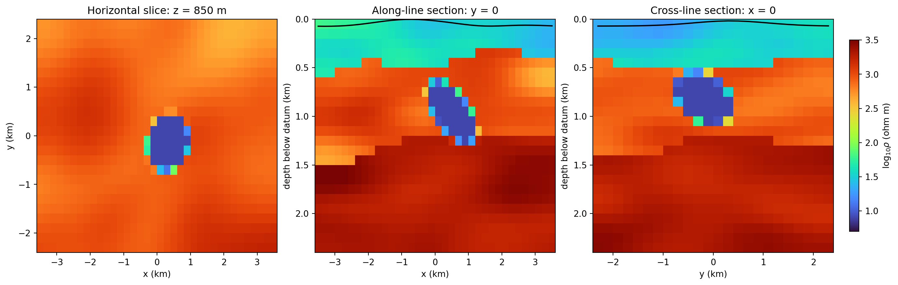
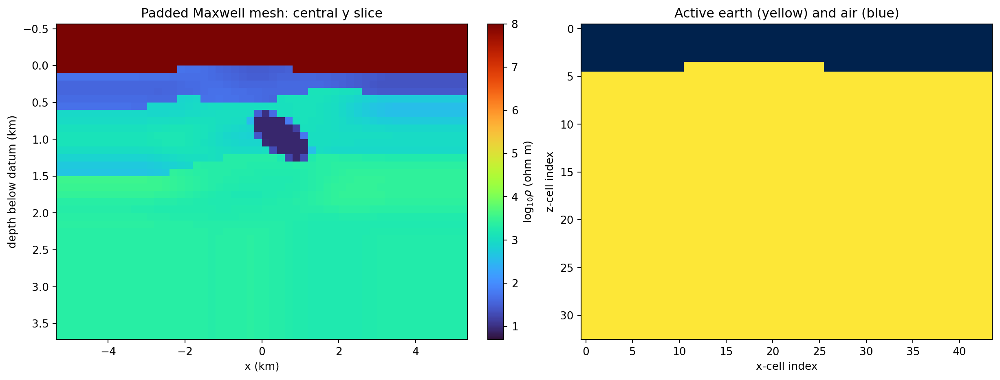
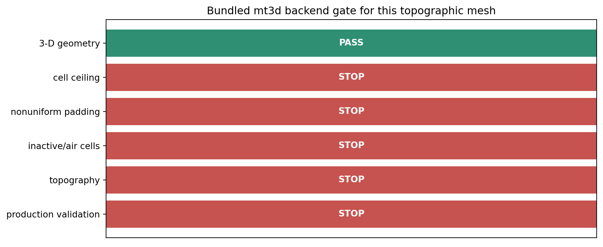

.. _tutorial_essential_3d_ai_inversion:

Building a Defensible 3-D AI Inversion Problem
===============================================

A 3-D resistivity array is not automatically a 3-D inversion.  A defensible
result needs three connected objects: a geological volume, a Maxwell mesh that
honours the acquisition and topography, and an optimizer whose predicted
impedances reproduce observations not used to construct the model.  This
tutorial builds and inspects the first two with the current ``pycsamt.ai`` and
``pycsamt.forward.maxwell`` APIs, then applies the solver gate before training.

The distinction matters for the bundled ``L18PLT`` example.  It is one profile,
so all receiver coordinates lie close to a line.  It can constrain an
along-line section, but it cannot by itself identify arbitrary cross-line
structure.  Moreover, :class:`pycsamt.agents.Inv3DAgent` currently returns a
``(station, layer)`` graph prediction.  That object is useful for research and
workflow testing; it is **not** a voxelwise, topographic 3-D Maxwell inversion.
Consequently this page does not publish the former synthetic
``l18_ai3d_topography_block.png`` as an inversion result.

Start with the survey geometry
------------------------------

Load corrected EDIs through the canonical site contract and retain every
station.  Down-sampling may be useful for a quick software test, but station
markers on a scientific figure must describe the data actually inverted.

.. code-block:: pycon

   >>> from pathlib import Path
   >>> from pycsamt.emtools import ensure_sites
   >>> from pycsamt.topo import extract_chainage, extract_elevation
   >>> edi_dir = Path("data/AMT/WILLY_DATA/L18PLT")
   >>> sites = ensure_sites(edi_dir, recursive=False, verbose=0).ordered()
   >>> chain_km = extract_chainage(sites)
   >>> elevation_m = extract_elevation(sites)
   >>> len(sites), round(float(chain_km[-1]), 3)
   (25, 4.029)
   >>> (round(float(elevation_m.min()), 1), round(float(elevation_m.max()), 1))
   (224.0, 274.0)

.. figure:: ../images/tutorials/essential_3d_ai_inversion/l18_station_topography.png
   :alt: L18 station positions and elevations read from EDI headers
   :width: 100%

The clustered but nonuniform station spacing controls lateral resolution.  The
50 m elevation range is also large enough that replacing the surface by a flat
datum can move near-surface cells and receivers into the wrong physical region.
Before attempting 3-D work, inspect the response curves, static-shift review,
phase tensors, and corrected pseudosection exactly as described in
:doc:`ai_inversion_from_corrected_edis`.  Those diagnostics decide whether the
data justify a 2-D approximation and reveal errors that no neural network can
repair.

Define the 3-D geological hypothesis
------------------------------------

The model below is a **prior realization**, not an inferred image of L18.  It
shows how the updated geology package expresses reproducible stratigraphy,
spatially correlated heterogeneity, a dipping conductive body, and a terrain
surface on one canonical ``(nz, ny, nx)`` grid.

.. code-block:: pycon

   >>> from pycsamt.ai.geology import (
   ...     ElectricalLayer, EllipsoidalLens, GaussianCorrelation,
   ...     GeologyGrid, TopographicSurface,
   ...     generate_layered_geology, insert_lenses,
   ... )
   >>> grid = GeologyGrid.regular_3d(
   ...     nx=36, ny=24, nz=24,
   ...     dx_m=200, dy_m=200, dz_m=100,
   ...     x_origin_m=-3600, y_origin_m=-2400,
   ... )
   >>> correlation = GaussianCorrelation(
   ...     1200, 180, length_y_m=800, azimuth_deg=25,
   ... )
   >>> units = [
   ...     ElectricalLayer("weathered cover", 35, .10, correlation),
   ...     ElectricalLayer("resistive host", 900, .12, correlation),
   ...     ElectricalLayer("deep basement", 2200, .08, correlation),
   ... ]
   >>> base = generate_layered_geology(
   ...     grid, units, [450, 1350], seed=41,
   ...     interface_relief_std_m=[70, 130],
   ...     interface_correlation=correlation,
   ...     minimum_thickness_m=150,
   ... )
   >>> conductor = EllipsoidalLens(
   ...     "dipping conductor", 400, 900, 1100, 300, 8,
   ...     center_y_m=-100, radius_y_m=650,
   ...     azimuth_deg=30, dip_deg=18, transition_fraction=.20,
   ... )
   >>> geology = insert_lenses(base, [conductor])
   >>> grid.shape
   (24, 24, 36)
   >>> tuple(round(v, 1) for v in (
   ...     geology.resistivity_ohm_m.min(),
   ...     geology.resistivity_ohm_m.max(),
   ... ))
   (8.0, 3878.7)

With :math:`\mathbf{x}=(x,y,z)` and unit index :math:`k(\mathbf{x})`, the
layer field is sampled in log-resistivity space,

.. math::
   :label: tutorial-3d-layer-prior

   \log_{10}\rho(\mathbf{x}) =
   \log_{10}\bar{\rho}_{k(\mathbf{x})}
   + \sigma_{k(\mathbf{x})}\,g_{k(\mathbf{x})}(\mathbf{x}),
   \qquad
   C(\mathbf{h})=
   \exp\!\left[-\frac{1}{2}\sum_{q\in\{x,y,z\}}
   \left(\frac{h_q}{\ell_q}\right)^2\right].

Here the seed fixes each correlated field, while the correlation lengths
:math:`\ell_q` encode continuity rather than certainty.  The lens then replaces
or blends cells inside its rotated ellipsoidal support.  Different plausible
seeds, interfaces, and bodies should become an ensemble of priors; selecting
only the realization that resembles the desired answer would bias validation.

The central panel shows the expected along-line conductor, while the horizontal
and cross-line panels expose information a single profile cannot determine.
That unobserved cross-line extent is a prior assumption and must be reported as
such.  The black curves are the terrain depth relative to the highest surface
point; cells above them belong to air, not geology.

The complete figure generator is exposed in the reproducibility section at the
end of this tutorial, where it can be opened, copied, and run as one script.

Build the terrain-aware Maxwell mesh
------------------------------------

The geology grid describes the core hypothesis.  A forward solver additionally
needs air cells, lateral and basal padding, conductivity, frequencies, and a
terrain mask.  :func:`pycsamt.forward.maxwell.build_solver_mesh` constructs
that numerical model without silently changing the canonical array order.

.. code-block:: pycon

   >>> import numpy as np
   >>> from pycsamt.forward.maxwell import MeshDesign, build_solver_mesh
   >>> xx, yy = np.meshgrid(grid.x_m, grid.y_m)
   >>> elevation = (
   ...     620 + 85 * np.exp(-((xx + 900) / 1500) ** 2
   ...                       - ((yy - 300) / 1100) ** 2)
   ...     - 45 * np.exp(-((xx - 1500) / 900) ** 2
   ...                       - ((yy + 500) / 700) ** 2)
   ...     + 18 * np.sin(xx / 1200)
   ... )
   >>> topography = TopographicSurface(
   ...     grid, elevation, float(elevation.max()),
   ...     source="deterministic tutorial surface",
   ... )
   >>> design = MeshDesign(
   ...     horizontal_padding_cells=4,
   ...     bottom_padding_cells=5,
   ...     air_layers=4,
   ...     padding_expansion=1.35,
   ... )
   >>> solver_model = build_solver_mesh(
   ...     grid,
   ...     resistivity_ohm_m=geology.resistivity_ohm_m,
   ...     frequencies_hz=[100, 10, 1, .1],
   ...     topography=topography,
   ...     design=design,
   ... )
   >>> solver_model.mesh.shape
   (33, 32, 44)
   >>> solver_model.quality.cell_count
   46464
   >>> len(solver_model.quality.warnings)
   1

The executed topographic relief is ``97.6 m``.  The mesh quality
diagnostic uses the electromagnetic skin depth

.. math::
   :label: tutorial-3d-skin-depth

   \delta(\rho,f)=\sqrt{\frac{\rho}{\pi\mu_0 f}},

and compares the smallest :math:`\delta` over the requested frequency/model
range with the largest core-cell width.  A warning is not a cosmetic message:
refine the affected direction or justify a backend-specific convergence study.

The left panel makes padding and highly resistive numerical air visible.  The
right panel verifies that the irregular surface becomes an explicit earth/air
classification.  Receivers must be placed consistently with that same datum;
merely draping a finished image after inversion does not include topography in
Maxwell's equations.

Apply the backend gate before inversion
---------------------------------------

Compatibility is checked before expensive training because a physics loss is
meaningful only if its forward operator supports the proposed problem.  The
bundled :class:`pycsamt.forward.maxwell.MT3DAdapter` is deliberately labelled
research-only.  It supports a small uniform 3-D domain, but not nonuniform
padding, inactive terrain cells, or this mesh size.

.. code-block:: pycon

   >>> from pycsamt.forward.maxwell import MT3DAdapter
   >>> capability = MT3DAdapter().capabilities
   >>> capability.dimensions
   (3,)
   >>> capability.maximum_cells
   6000
   >>> capability.supports_nonuniform_mesh, capability.supports_topography
   (False, False)
   >>> solver_model.quality.cell_count <= capability.maximum_cells
   False

Only dimensionality passes for the proposed problem.  Red ``STOP`` bars mean
the solver must not be run by deleting padding, flattening terrain, or shrinking
the mesh until it happens to fit.  Instead, connect a validated external 3-D
backend through :class:`pycsamt.forward.maxwell.ModEm3DAdapter`, assess the
exact :class:`pycsamt.forward.maxwell.MaxwellProblem`, and preserve the
compatibility report with the experiment.

What a complete external run must demonstrate
---------------------------------------------

For observed impedance vector :math:`\mathbf{d}_{obs}`, model parameters
:math:`\mathbf{m}` (normally log conductivity), and a validated 3-D forward
operator :math:`\mathcal{F}_{3D}`, training should minimize a declared objective
such as

.. math::
   :label: tutorial-3d-objective

   \mathcal{J}(\mathbf{m}) =
   \left\|\mathbf{W}_d
   \left[\mathcal{F}_{3D}(\mathbf{m})-\mathbf{d}_{obs}\right]\right\|_2^2
   +\lambda_s\|\mathbf{W}_s(\mathbf{m}-\mathbf{m}_{ref})\|_2^2
   +\lambda_g\,\Phi_g(\mathbf{m}).

The first term is complex-impedance data misfit weighted by reported errors;
the second controls spatial/model-reference departure; and
:math:`\Phi_g` expresses geological information without overriding data.  A
neural parameterization changes how :math:`\mathbf{m}` is represented, not the
need to evaluate :math:`\mathcal{F}_{3D}` and its residuals.

Before promoting a volume, save and review all of the following:

* backend name/version, capability report, mesh and topography hashes;
* observed versus predicted impedance by station, frequency, and component;
* convergence histories for total and individual loss terms;
* synthetic recovery on held-out geological realizations;
* sensitivity or uncertainty maps, especially off the receiver line;
* comparison with a simpler 2-D/classical result and explicit failure cases.

The experimental graph command remains available in
``docs/scripts/run_ai_inv3d_candidate.py`` for software research.  Run it in a
separate output directory and treat ``pred_rho`` as a station-by-layer candidate,
not as the geological volume built above.  No candidate should be plotted as a
3-D inversion until the Maxwell and validation gates pass.

Reproduce the tutorial assets
-----------------------------

Open the complete generator below to inspect or copy every operation used to
construct the geology, topography, Maxwell mesh, capability gate, and figures.
The panel is collapsed initially so the scientific narrative remains readable.

.. code-dropdown:: ../../scripts/generate_tutorial_essential_3d_ai_inversion.py
   :language: python
   :linenos:
   :title: View and copy the complete tutorial-asset generator

Run the copied repository script from the project root:

.. code-block:: console

   python docs/scripts/generate_tutorial_essential_3d_ai_inversion.py

Executed output:

.. code-block:: text

   geology shape: (24, 24, 36)
   resistivity range (ohm m): 8.0 3878.7
   topographic relief (m): 97.6
   Maxwell mesh shape: (33, 32, 44)
   Maxwell cells: 46464
   mesh warnings: 1
   mt3d maximum cells: 6000

Continue with :doc:`../user_guide/ai_inversion/forward_physics` for backend
contracts, :doc:`../user_guide/ai_inversion/geology_priors` for richer prior
ensembles, :doc:`../user_guide/ai_inversion/training` for experiment control,
and :doc:`../user_guide/ai_inversion/scientific_validation` before reporting a
scientific inversion.
