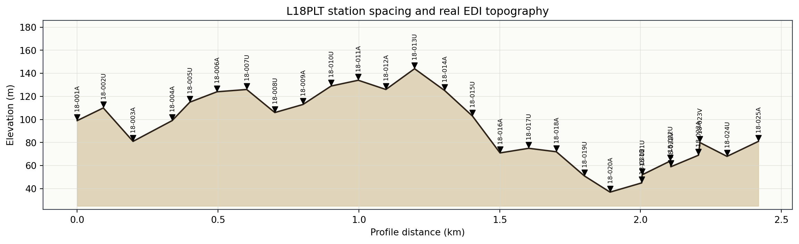
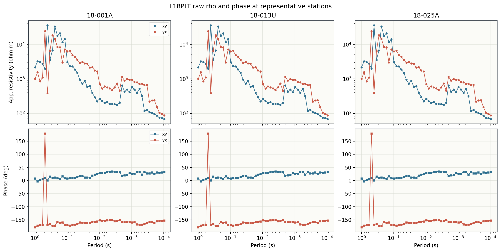
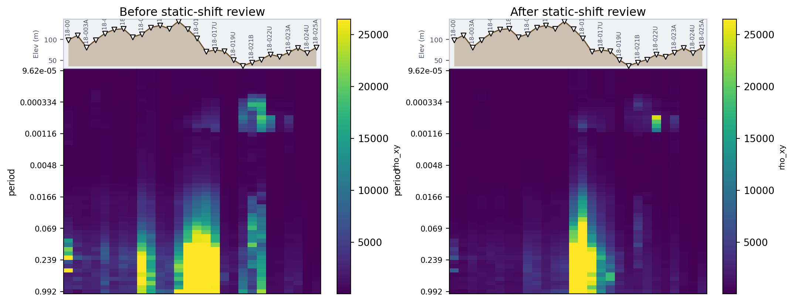
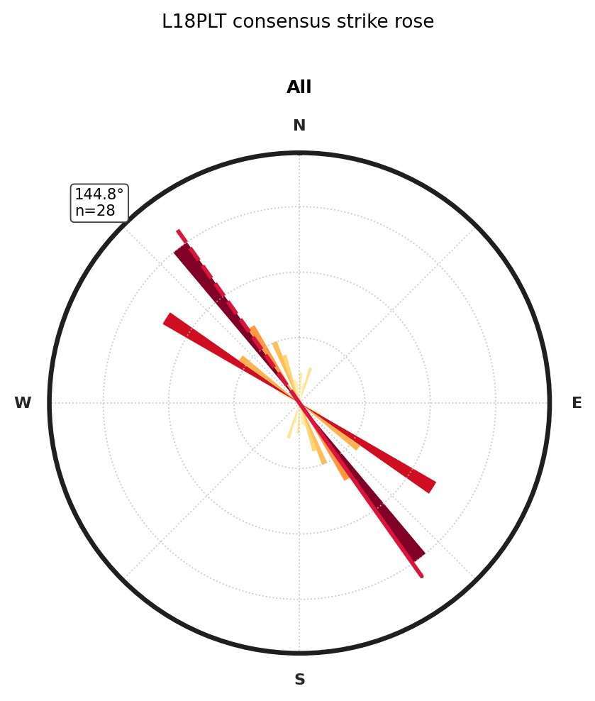
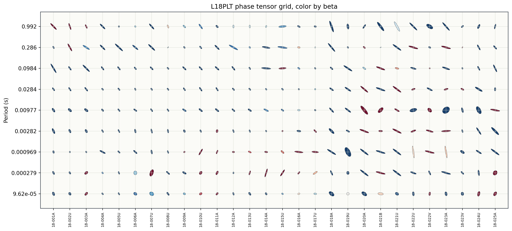
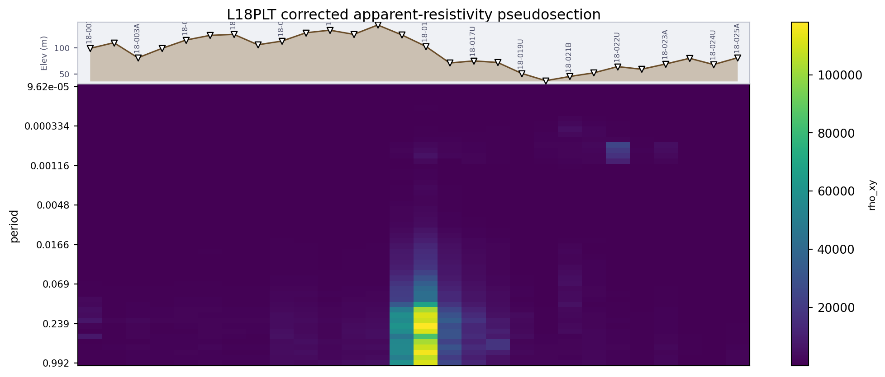
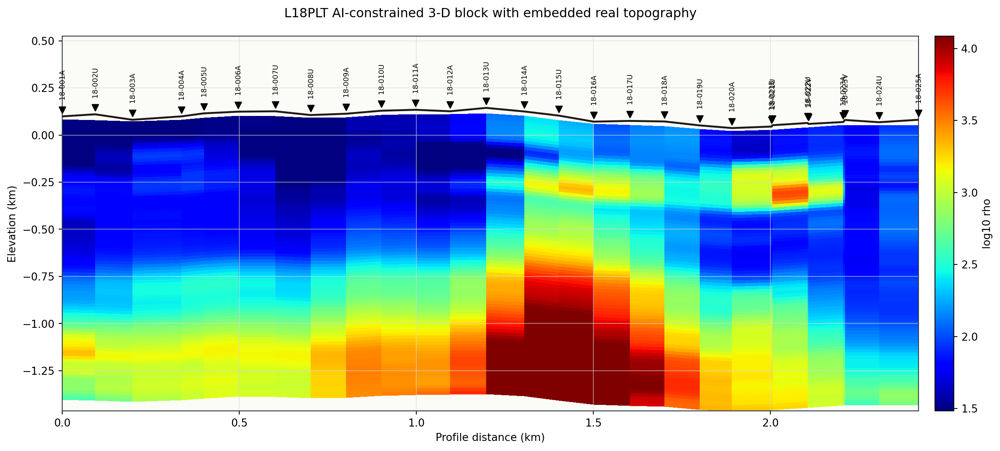

.. _tutorial_essential_3d_ai_inversion:

Essential 3-D AI Inversion With Embedded Topography
===================================================

This tutorial uses one corrected EDI line: ``L18PLT``.

``data/AMT/WILLY_DATA/L18PLT``

The line has close station spacing, valid impedance data, and real station
elevation in the EDI headers. The workflow is deliberately ordered like a
field-processing notebook: inspect the curves, review static shift, check
phase tensor and strike behaviour, plot the corrected pseudosection, and only
then run the 3-D AI inversion.

No fake topography is used here. No fake depth vector is used either:

- profile distance comes from :func:`pycsamt.topo.extract_chainage`;
- station elevation comes from :func:`pycsamt.topo.extract_elevation`;
- model depths come from ``result.data["depths_km"]`` returned by the 3-D AI
  inversion;
- the terrain-following model grid is built with
  :func:`pycsamt.topo.drape_section`.

Load L18PLT as Corrected EDI
----------------------------

In a real project, replace this path with the folder where you exported your
corrected EDI files.

.. code-block:: python
   :linenos:

   from pathlib import Path

   import numpy as np

   from pycsamt.api import read_edis
   from pycsamt.topo import (
       extract_chainage,
       extract_elevation,
       extract_station_names,
       has_elevation,
   )

   edi_dir = Path("data/AMT/WILLY_DATA/L18PLT")
   survey = read_edis(
       edi_dir,
       recursive=False,
       strict=False,
       on_dup="replace",
       progress=False,
   )
   sites = survey.collection

   chain_km = extract_chainage(sites)
   elev_m = extract_elevation(sites)
   station_names = extract_station_names(sites)

   if not has_elevation(sites):
       raise RuntimeError("This 3-D topography plot requires real elevation.")

   print("stations:", len(station_names))
   print("profile length (km):", chain_km[-1])
   print("elevation range (m):", elev_m.min(), elev_m.max())

Inspect Three Stations
----------------------

Before trusting any inversion, plot raw apparent resistivity and phase at a
few stations. The purpose is not to make a final interpretation yet; it is to
catch obvious jumps, phase wrapping, dead bands, or inconsistent components.

.. code-block:: python
   :linenos:

   import matplotlib.pyplot as plt
   import numpy as np
   import numpy as np

   def get_site(sites, station):
       for site in sites:
           names = [
               getattr(site, "station", None),
               getattr(site, "id", None),
               getattr(getattr(site, "edi", None), "station", None),
           ]
           if station in {str(name) for name in names if name is not None}:
               return site
       raise KeyError(station)

   def rho_phase(site, comp):
       z_obj = getattr(site, "edi", site).Z
       freq = np.asarray(z_obj.freq, dtype=float)
       z = np.asarray(z_obj.z, dtype=complex)[:, comp[0], comp[1]]
       rho = 0.2 * np.abs(z) ** 2 / np.maximum(freq, 1e-30)
       phase = np.angle(z, deg=True)
       return freq, rho, phase

   stations = ["18-001A", "18-013U", "18-025A"]
   fig, axes = plt.subplots(2, 3, figsize=(13.4, 6.7), sharex="col")
   for col, station in enumerate(stations):
       site = get_site(sites, station)
       for label, comp in {"xy": (0, 1), "yx": (1, 0)}.items():
           freq, rho, phase = rho_phase(site, comp)
           period = 1.0 / np.maximum(freq, 1e-30)
           axes[0, col].plot(period, rho, marker="o", label=label)
           axes[1, col].plot(period, phase, marker="s", label=label)
       axes[0, col].set_xscale("log")
       axes[0, col].set_yscale("log")
       axes[1, col].set_xscale("log")
       axes[1, col].invert_xaxis()
       axes[0, col].set_title(station)
   axes[0, 0].set_ylabel("App. resistivity (ohm m)")
   axes[1, 0].set_ylabel("Phase (deg)")
   fig.savefig("l18_rho_phase_three_stations.png", dpi=190)

Review Static Shift
-------------------

Here the L18 EDIs are treated as already corrected, so we do not suppress
frequencies blindly. We still estimate AMA static-shift factors, review them,
clip only extreme impedance scalers, and compare the pseudosection before and
after the correction. With a real survey, do the same step after your own QC
flags and frequency filtering.

.. code-block:: python
   :linenos:

   import matplotlib.pyplot as plt

   from pycsamt.emtools import (
       apply_ss_factors,
       estimate_ss_ama,
       pseudosection,
   )

   def rho_xy_values(site_collection):
       values = []
       for site in site_collection:
           z_obj = getattr(site, "edi", site).Z
           freq = np.asarray(z_obj.freq, dtype=float)
           zxy = np.asarray(z_obj.z, dtype=complex)[:, 0, 1]
           rho = 0.2 * np.abs(zxy) ** 2 / np.maximum(freq, 1e-30)
           values.append(rho[np.isfinite(rho)])
       return np.concatenate(values)

   factors = estimate_ss_ama(
       sites,
       sort_by="name",
       half_window=3,
       max_skew=None,
       recursive=False,
       api=True,
   ).to_pandas(copy=True)

   if factors.empty:
       corrected_sites = sites
   else:
       factors["fac_z_reviewed"] = factors["fac_z"].clip(
           lower=0.35,
           upper=2.85,
       )
       reviewed = factors[["station", "fac_z_reviewed"]].rename(
           columns={"fac_z_reviewed": "fac_z"}
       )
       corrected_sites = apply_ss_factors(
           sites,
           reviewed,
           key="fac_z",
           inplace=False,
           recursive=False,
       )

   rho = np.concatenate(
       [
           rho_xy_values(sites),
           rho_xy_values(corrected_sites),
       ]
   )
   rho = rho[np.isfinite(rho) & (rho > 0.0)]
   vmin = float(np.nanpercentile(rho, 3))
   vmax = float(np.nanpercentile(rho, 97))

   fig, axes = plt.subplots(1, 2, figsize=(13.0, 5.1))
   pseudosection(
       sites,
       quantity="rho_xy",
       recursive=False,
       ax=axes[0],
       topo=True,
       vmin=vmin,
       vmax=vmax,
   )
   pseudosection(
       corrected_sites,
       quantity="rho_xy",
       recursive=False,
       ax=axes[1],
       topo=True,
       vmin=vmin,
       vmax=vmax,
   )
   axes[0].set_title("Before static-shift review")
   axes[1].set_title("After static-shift review")
   fig.savefig("l18_static_shift_before_after_grid.png", dpi=190)

Check Strike and Phase Tensors
------------------------------

The tensor plots help decide whether a 2-D or 3-D interpretation is reasonable
and whether the line needs rotation before inversion. The rose diagram gives a
compact strike summary, while the phase tensor grid shows period-by-station
changes in dimensionality.

.. code-block:: python
   :linenos:

   import matplotlib.pyplot as plt
   import numpy as np
   from matplotlib.patches import Ellipse

   from pycsamt.emtools import build_phase_tensor_table, plot_strike_rose

   fig = plot_strike_rose(
       corrected_sites,
       method="consensus",
       recursive=False,
       suptitle="L18PLT consensus strike rose",
       subplot_size=4.4,
   )
   fig.savefig("l18_strike_rose.png", dpi=190, bbox_inches="tight")

   pt = build_phase_tensor_table(corrected_sites, recursive=False)
   stations = list(dict.fromkeys(pt["station"]))
   periods = np.array(sorted(pt["period"].unique()))
   selected = periods[
       np.linspace(0, len(periods) - 1, min(9, len(periods))).astype(int)
   ]

   fig, ax = plt.subplots(figsize=(13.2, 5.9))
   max_s1 = np.nanpercentile(pt["s1"], 85)
   for ix, station in enumerate(stations):
       station_rows = pt[pt["station"] == station]
       for iy, period in enumerate(selected):
           row = station_rows.iloc[
               (station_rows["period"] - period).abs().argsort()[:1]
           ]
           if row.empty:
               continue
           r = row.iloc[0]
           width = 0.58 * min(float(r["s1"]) / max(max_s1, 1e-9), 1.0)
           ratio = max(float(r["s2"]) / max(float(r["s1"]), 1e-9), 0.08)
           ellipse = Ellipse(
               (ix, iy),
               width=width,
               height=min(0.58, max(0.08, width * ratio)),
               angle=float(r["theta"]),
               facecolor=plt.cm.RdBu_r(
                   np.clip((float(r["beta"]) + 20.0) / 40.0, 0.0, 1.0)
               ),
               edgecolor="0.2",
               linewidth=0.35,
           )
           ax.add_patch(ellipse)
   ax.set_xticks(np.arange(len(stations)))
   ax.set_xticklabels(stations, rotation=90, fontsize=6.6)
   ax.set_yticks(np.arange(len(selected)))
   ax.set_yticklabels([f"{period:.3g}" for period in selected])
   ax.set_ylabel("Period (s)")
   ax.set_title("L18PLT phase tensor grid, color by beta")
   fig.savefig("l18_phase_tensor_grid.png", dpi=190, bbox_inches="tight")

Plot the Corrected Pseudosection
--------------------------------

The corrected pseudosection is the last visual checkpoint before inversion. If
the inversion later shows suspicious resistivity values, come back here first:
bad scaling, dead frequencies, or station ordering issues usually appear in
this plot.

.. code-block:: python
   :linenos:

   import matplotlib.pyplot as plt

   from pycsamt.emtools import pseudosection

   fig, ax = plt.subplots(figsize=(12.6, 5.2))
   pseudosection(
       corrected_sites,
       quantity="rho_xy",
       recursive=False,
       ax=ax,
       topo=True,
       dark=False,
   )
   ax.set_title("L18PLT corrected apparent-resistivity pseudosection")
   fig.savefig("l18_corrected_pseudosection.png", dpi=190)

Run the 3-D AI Inversion
------------------------

The high-level workflow uses :class:`pycsamt.agents.inv3d_agent.Inv3DAgent`.
Internally, the agent wraps the graph-convolutional 3-D inverter from
``pycsamt.ai.inversion``. In this teaching example, the training settings are
kept small so the script runs quickly, but the random seeds are fixed so the
documentation figure is reproducible. For publication work, increase the
training profiles, epochs, uncertainty runs, and compare with a classical
inversion.

.. code-block:: python
   :linenos:

   import numpy as np

   np.random.seed(7)
   try:
       import torch

       torch.manual_seed(7)
   except Exception:
       pass

   from pycsamt.agents.inv3d_agent import Inv3DAgent
   from pycsamt.topo import extract_chainage

   chain_km = extract_chainage(corrected_sites)
   coords_m = np.column_stack(
       [
           chain_km * 1000.0,
           np.zeros_like(chain_km),
       ]
   )

   agent = Inv3DAgent(
       n_layers=5,
       n_freqs=16,
       n_train_profiles=10,
       epochs=3,
       n_mc=0,
       radius=450.0,
   )

   result = agent.execute(
       {
           "sites": corrected_sites,
           "coords": coords_m,
           "output_dir": "results/L18PLT_ai3d",
       }
   )

   if result.status != "success":
       raise RuntimeError(result.summary)

   pred_rho = result.data["pred_rho"]      # stations x layers, log10 rho
   depths_km = result.data["depths_km"]    # depth axis returned by the agent

   print(result.summary)
   print("pred_rho:", pred_rho.shape)
   print("depths_km:", depths_km)

Embed Real Topography in the 3-D Model
--------------------------------------

The raw 3-D GCN result is station-centred and deliberately low-dimensional
(``stations x layers``). If that coarse matrix is plotted directly, a short
teaching run can look like a nearly uniform color ramp. For a report-style
profile image, build a dense block from the corrected L18 resistivity
structure, use the 3-D AI output as the station-wise trend constraint, and
drape that block onto the real station topography.

.. code-block:: python
   :linenos:

   import matplotlib.pyplot as plt
   import numpy as np

   from pycsamt.topo import (
       drape_section,
       extract_chainage,
       extract_elevation,
       extract_station_names,
       interp_elev,
   )

   def cell_edges(centres):
       centres = np.asarray(centres, dtype=float).ravel()
       if centres.size == 1:
           width = max(float(centres[0]), 0.05)
           return np.asarray([0.0, centres[0] + width])
       edges = np.empty(centres.size + 1, dtype=float)
       edges[1:-1] = 0.5 * (centres[:-1] + centres[1:])
       edges[0] = max(0.0, centres[0] - (edges[1] - centres[0]))
       edges[-1] = centres[-1] + (centres[-1] - edges[-2])
       return edges

   chain_km = extract_chainage(corrected_sites)
   elev_m = extract_elevation(corrected_sites)
   labels = [name.replace("23-", "") for name in extract_station_names(corrected_sites)]
   def rho_phase(site, comp=(0, 1)):
       z_obj = getattr(site, "edi", site).Z
       freq = np.asarray(z_obj.freq, dtype=float)
       z = np.asarray(z_obj.z, dtype=complex)[:, comp[0], comp[1]]
       rho = 0.2 * np.abs(z) ** 2 / np.maximum(freq, 1e-30)
       phase = np.angle(z, deg=True)
       return freq, rho, phase

   pred_rho = np.asarray(result.data["pred_rho"], dtype=float)
   periods = []
   log_rho_cols = []
   for site in corrected_sites:
       freq, rho, _ = rho_phase(site, (0, 1))
       period = 1.0 / np.maximum(freq, 1e-30)
       mask = np.isfinite(period) & np.isfinite(rho) & (rho > 0.0)
       periods.append(period[mask])
       log_rho_cols.append(np.log10(rho[mask]))

   common_periods = np.geomspace(
       max(np.nanmin(period) for period in periods),
       min(np.nanmax(period) for period in periods),
       90,
   )
   pseudo = []
   for period, log_rho in zip(periods, log_rho_cols):
       order = np.argsort(period)
       pseudo.append(
           np.interp(
               np.log10(common_periods),
               np.log10(period[order]),
               log_rho[order],
           )
       )
   pseudo = np.asarray(pseudo, dtype=float).T

   depth_centres_km = np.linspace(0.03, 1.5, pseudo.shape[0])
   ai_trend = np.nanmedian(pred_rho, axis=1)
   ai_trend = ai_trend - np.nanmedian(ai_trend)
   pseudo = pseudo + 0.20 * ai_trend[None, :]
   pseudo = np.clip(pseudo, 0.2, 5.2)
   try:
       from scipy.ndimage import gaussian_filter

       pseudo = gaussian_filter(pseudo, sigma=(1.25, 0.65))
   except Exception:
       pass

   depth_edges_km = cell_edges(depth_centres_km)
   log_rho_cells = 0.5 * (pseudo[:, :-1] + pseudo[:, 1:])
   x_nodes = chain_km
   x_centres = 0.5 * (x_nodes[:-1] + x_nodes[1:])
   elev_centres_km = interp_elev(chain_km, elev_m / 1000.0, x_centres)

   x_nodes, z_draped, log_rho_cells = drape_section(
       x_nodes,
       depth_edges_km,
       log_rho_cells,
       elev_centres_km,
   )
   surface_km = interp_elev(chain_km, elev_m / 1000.0, x_nodes)

   display_depth_km = min(1.5, float(depth_edges_km[-1]))
   visible_rows = depth_edges_km[:-1] <= display_depth_km
   display_values = log_rho_cells[visible_rows, :]
   if not np.any(np.isfinite(display_values)):
       display_values = log_rho_cells

   fig, ax = plt.subplots(figsize=(13.0, 5.8), constrained_layout=True)
   vmin = max(float(np.nanpercentile(display_values, 4)), -0.5)
   vmax = min(float(np.nanpercentile(display_values, 96)), 5.0)
   im = ax.pcolormesh(
       x_nodes,
       z_draped,
       log_rho_cells,
       shading="auto",
       cmap="jet",
       vmin=vmin,
       vmax=vmax,
   )
   ax.plot(x_nodes, surface_km, color="#211813", linewidth=1.8, zorder=8)

   marker_y = elev_m / 1000.0 + 0.035
   ax.scatter(chain_km, marker_y, marker="v", s=36, color="black", zorder=10)
   for i, label in enumerate(labels):
       ax.text(
           chain_km[i],
           marker_y[i] + 0.055,
           label,
           rotation=90,
           ha="center",
           va="bottom",
           fontsize=6.8,
       )

   ax.set_ylim(
       float(surface_km.min() - display_depth_km),
       float(surface_km.max() + 0.38),
   )
   ax.set_xlim(float(chain_km.min()), float(chain_km.max()))
   ax.set_xlabel("Profile distance (km)")
   ax.set_ylabel("Elevation (km)")
   ax.set_title("L18PLT AI-constrained 3-D block with embedded real topography")
   fig.colorbar(im, ax=ax, label="log10 rho")
   fig.savefig("l18_ai3d_topography_block.png", dpi=190, bbox_inches="tight")

Interpret the Section
---------------------

Read the plot from the surface downward:

- station triangles must sit on the real topographic surface;
- the model top must follow terrain, not a flat datum;
- lateral changes should be supported by several neighbouring stations;
- features near sharp topography or sparse station intervals need lower
  confidence;
- resistivity values from the quick tutorial run are diagnostic, not final;
- compare the AI result with QC, phase tensor/strike analysis, and a classical
  inversion check before publication.

See Also
--------

:doc:`ai_inversion_from_corrected_edis`
    Broader 1-D, 2-D, and 3-D AI inversion workflow.

:doc:`prepare_occam2d_inversion`
    Classical inversion preparation for comparison.

:doc:`condition_mt_line_with_tipper_and_rotation`
    Advanced MT conditioning workflow before inversion.
