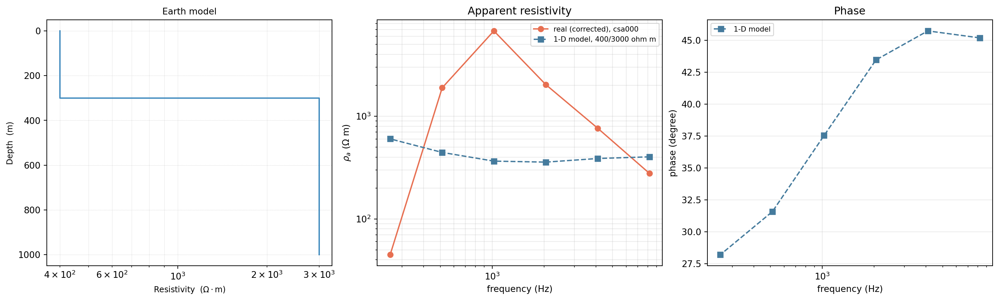
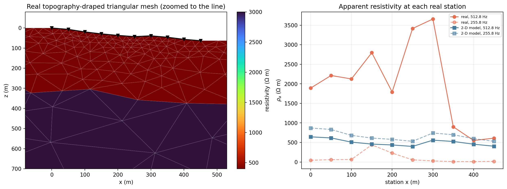
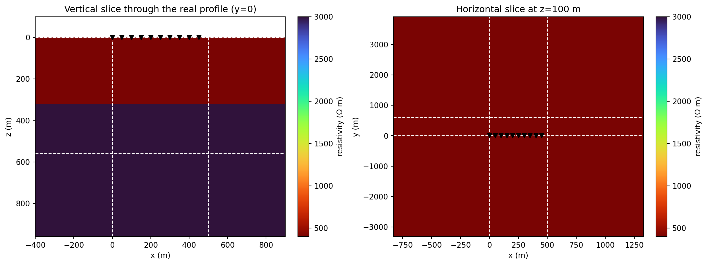
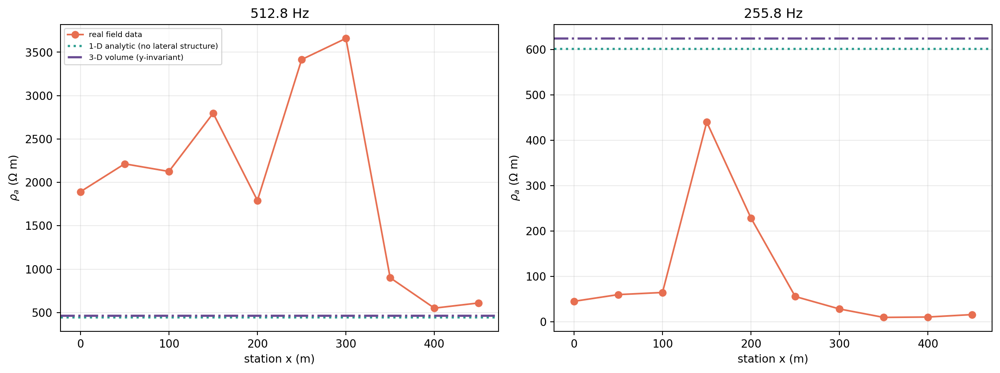

.. _tutorial_forward_model_1d_to_3d:

Forward Model One Real Line In 1-D, 2-D, And 3-D
================================================

The Tongkeng CSAMT line -- the same ten-station, 50 m-spaced, real field
survey :doc:`map_groundwater_geology_from_csamt` uses -- is small enough to
carry through every dimensionality pyCSAMT's forward layer offers without
substituting a single synthetic value. This tutorial does exactly that:

1. load the line and re-establish the trustworthy far/transition frequency
   band :doc:`map_groundwater_geology_from_csamt` already derives for this
   survey, rather than re-deriving it;
2. build a real, Bostick-informed 1-D layered guess and forward model it
   with the legacy :class:`~pycsamt.forward.MT1DForward`, against the real
   corrected sounding at one station;
3. benchmark the in-house triangular solver against that same layered model
   *before* trusting it on real geometry -- and use what that benchmark
   finds to choose which frequencies the rest of this tutorial can honestly
   use;
4. drape that same layered guess over the line's real station elevations
   with a real graded :class:`~pycsamt.forward.maxwell.contracts_tri.TriMesh`,
   solve it, and compare the modelled response with the real corrected data
   at all ten stations;
5. embed the same real profile in a 3-D volume and solve it with a real
   compiled ModEM binary, closing the loop back to the 1-D analytic answer.

Unlike :doc:`map_groundwater_geology_from_csamt`, nothing here trains a
model or maps geology -- the question this tutorial answers is narrower and
more mechanical: *what does each extra dimension actually buy, on this one
real line, checked against this one real line's own data at every step.*
See that tutorial for the AI-inversion and groundwater-mapping application
built on the same survey.

What You Will Learn
-------------------

After this tutorial you should be able to:

- reuse an already-established real near-field correction and trustworthy
  frequency band rather than re-deriving survey-specific corrections inside
  a forward-modelling exercise;
- turn a real corrected sounding into a depth-resistivity curve with
  :func:`~pycsamt.emtools.csumt.bostick_depth_from_rho`, and know why the
  sites-based :func:`~pycsamt.emtools.csumt.bostick_depth` is the wrong tool
  for a single-component (Ex-Hy only) CSAMT survey specifically;
- benchmark :class:`~pycsamt.forward.maxwell.tri_fem2d.TriFEM2DAdapter`
  against an exact analytic answer *before* trusting it on real data, and
  use a failed benchmark to choose a defensible frequency subset rather than
  discovering the problem downstream;
- build a real :func:`~pycsamt.forward.maxwell.build_graded_tri_mesh` from a
  line's own real station elevations, not a synthetic ridge;
- build a real 3-D :func:`~pycsamt.forward.maxwell.build_solver_mesh` around
  the same profile and solve it with
  :class:`~pycsamt.forward.maxwell.modem3d.ModEm3DAdapter` against a real
  compiled ``Mod3DMT``;
- read a mismatch between a simple model and real data as evidence, not
  failure -- and know which dimension's assumptions that evidence points at.

When To Do This
---------------

Every ``prepare_*_inversion`` tutorial in this section builds a mesh for a
specific external inversion engine and stops before running it. This
tutorial answers a question that belongs *before* any of those: does the
simplest defensible earth model -- one layered guess, honestly built from
this line's own real data -- already explain what was actually measured, or
does the real data's own along-line behaviour already rule that out? Doing
this forward-only check first is cheap, and it is exactly what turns "we
need a 2-D or 3-D inversion" from an assumption into a conclusion supported
by the data.

Load The Line And Establish A Trustworthy Band
----------------------------------------------

:doc:`../theory/field_zones` and :doc:`map_groundwater_geology_from_csamt`
already establish, in full, why roughly two-thirds of this survey's raw
band sits in the :term:`near field` of its own CSAMT transmitter and cannot
be used as if it were a plane-wave MT response. Reproduce their conclusion
rather than re-deriving it:

.. code-block:: pycon

   >>> import numpy as np
   >>> from pycsamt.api import read_edis
   >>> from pycsamt.site import Sites
   >>> from pycsamt.topo.extract import extract_elevation
   >>> from pycsamt.emtools.source_effects import correct_near_field
   >>> from pycsamt.site.edit import select_freq_all

   >>> survey = read_edis("data/CSAMT", recursive=False, strict=False, progress=False)
   >>> sites = Sites(survey.collection).ordered("station")
   >>> elevation = extract_elevation(sites)
   >>> elevation
   array([573.4, 566.8, 554. , 544.4, 536.7, 530.7, 534.6, 527.5, 517.2,
          510.3])

   >>> corrected = correct_near_field(sites, source_offset=1000.0, inplace=False)
   >>> usable = list(select_freq_all(corrected, fmin=255.0))
   >>> usable[0].name, usable[0].freq
   ('csa000', array([8196.722 , 4098.361 , 2049.18  , 1023.541 ,  512.8206,  255.7545]))

Ten real station elevations spanning 63.1 m of relief over 450 m, and six of
the original seventeen frequencies -- the same far-and-transition band
:doc:`map_groundwater_geology_from_csamt` keeps for everything downstream
that is depth- or frequency-sensitive. Both numbers are used directly below,
not re-derived.

A Real 1-D Sounding
-------------------

:func:`~pycsamt.emtools.csumt.bostick_depth_from_rho` turns apparent
resistivity and frequency into an approximate depth, one station at a time.
The *sites*-based :func:`~pycsamt.emtools.csumt.bostick_depth` looks like
the more convenient entry point, but is the wrong tool here: it forms a
geometric-mean apparent resistivity from *both* off-diagonal impedance
components, and this survey -- Ex and Hy only -- has :math:`Z_{yx}\equiv 0`
by construction, which collapses that geometric mean to numerically zero
rather than raising an error:

.. code-block:: pycon

   >>> from pycsamt.emtools.csumt import bostick_depth_from_rho

   >>> s0 = usable[0]
   >>> rho_xy = s0.rho[:, 0, 1]
   >>> np.round(rho_xy, 1)
   array([ 277.3,  764.6, 2031.1, 6774.7, 1892.2,   44.8])
   >>> depth_m = bostick_depth_from_rho(rho_xy, s0.freq)
   >>> np.round(depth_m, 1)
   array([ 65.5, 153.8, 354.4, 915.9, 683.8, 149. ])

Read that curve honestly before building anything from it. The first three
points rise smoothly -- 277, 765, 2031 :math:`\Omega\cdot`\ m by 65 to
354 m -- consistent with resistivity genuinely increasing with depth. The
fourth point peaks at 6775 :math:`\Omega\cdot`\ m, and the fifth and sixth
*fall*, with the sixth landing both shallower in apparent depth and far
lower in resistivity than the point above it -- a real, visible sign that
the near-field correction is stretched thin at the lowest trustworthy
frequency, exactly as flagged when that correction was first applied. A
simple monotonic layered guess cannot, and should not be built to,
reproduce that peak. What it can capture honestly is the broad character of
the upper band: resistivity in the few-hundred-ohm-metre range near the
surface, rising toward a few thousand within a few hundred metres.

.. code-block:: pycon

   >>> from pycsamt.forward import LayeredModel, MT1DForward

   >>> model = LayeredModel(resistivity=[400.0, 3000.0], thickness=[300.0])
   >>> response = MT1DForward(s0.freq).run(model)
   >>> np.round(response.rho_a, 1)
   array([402.1, 387.4, 357.2, 365.3, 444. , 601.4])

.. code-dropdown:: ../../scripts/generate_tutorial_forward_meshes_1d_to_3d.py
   :language: python
   :pyobject: make_1d_sounding
   :linenos:
   :title: View 1-D sounding source code

   Left: the model itself, :func:`~pycsamt.forward.plot.plot_model_1d`'s own
   resistivity-depth staircase -- 400 :math:`\Omega\cdot`\ m to 300 m, then
   3000 :math:`\Omega\cdot`\ m below, nothing more. Middle: that model's
   apparent resistivity against the real corrected sounding. Right: the
   model's phase (no real phase overlay -- the correction was defined on
   :math:`\rho_a` alone). The model sits close to the real curve at the two
   ends of the band and misses the middle peak entirely.

That mismatch is the finding, not a failure to fix. A single depth-only
layer sequence, honestly built from this station's own real data, already
cannot explain this one sounding by itself -- which is exactly the question
worth asking again with a second and third station once real lateral
geometry enters the picture below.

Choose Frequencies The Triangular Solver Can Trust
--------------------------------------------------

:doc:`../user_guide/forward/maxwell_benchmarks` makes the general case for
benchmarking a backend before trusting it. Do that here, concretely, before
draping anything real over a triangular mesh. A pure half-space at the
highest CSAMT frequency in this band, meshed exactly as
:mod:`~pycsamt.forward.maxwell.tri_fem2d`'s own benchmark recommends
(:math:`0.04\times` the skin depth for the near-station cell size,
:math:`8\times` the skin depth for the domain half-width):

.. code-block:: pycon

   >>> from pycsamt.forward.maxwell import ReceiverSet, skin_depth_m
   >>> from pycsamt.forward.maxwell.contracts_tri import TriProblem
   >>> from pycsamt.forward.maxwell.tri_fem2d import TriFEM2DAdapter
   >>> from pycsamt.forward.maxwell.tri_mesh_gen import build_graded_tri_mesh

   >>> station_x = [50.0 * i for i in range(10)]
   >>> receivers = ReceiverSet([[x, 0.0] for x in station_x], [f"S{i:02d}" for i in range(10)])

   >>> def half_space_check(rho, freq):
   ...     surface_cell_m = 0.04 * float(skin_depth_m(rho, freq))
   ...     half_width = 8.0 * float(skin_depth_m(rho, freq))
   ...     mesh = build_graded_tri_mesh(
   ...         (-half_width, 450.0 + half_width), (0.0, half_width), station_x,
   ...         surface_cell_m=surface_cell_m, growth_rate=1.3, max_cell_m=half_width / 5.0,
   ...     )
   ...     problem = TriProblem(mesh, np.full(mesh.n_triangles, 1.0 / rho), [freq], receivers)
   ...     result = TriFEM2DAdapter().solve(problem)
   ...     mu0 = 4e-7 * np.pi
   ...     rhoa = float(np.abs(result.impedance_v_a[0, 0, 0]) ** 2 / (mu0 * 2 * np.pi * freq))
   ...     return rhoa

   >>> round(half_space_check(400.0, 8196.722), 1)
   601.7
   >>> round(half_space_check(400.0, 255.7545), 1)
   433.8

A backend that is correct by definition on a uniform half-space --
:doc:`../user_guide/forward/maxwell_benchmarks` builds exactly this case for
every adapter -- comes back 50% high at 8196.7 Hz and 8.5% high at
255.7545 Hz, on this survey's own real 50 m station spacing. That is not
this solver failing in general; :doc:`../user_guide/forward/maxwell_adapters`
already calls ``TriFEM2DAdapter`` research-only for exactly this reason.
Skin depth at 400 :math:`\Omega\cdot`\ m and 8196.7 Hz is only about 111 m --
barely twice the station spacing -- while at 255.7545 Hz it is about
629 m, comfortably larger. The two-layer model built above, benchmarked the
same way at the two lowest trustworthy frequencies:

.. code-block:: pycon

   >>> from pycsamt.forward.maxwell.benchmarks import layered_earth_impedance

   >>> solver_freqs = np.array([512.8206, 255.7545])
   >>> surface_cell_m = 0.04 * float(skin_depth_m(400.0, solver_freqs.max()))
   >>> half_width = 8.0 * float(skin_depth_m(3000.0, solver_freqs.min()))
   >>> mesh = build_graded_tri_mesh(
   ...     (-half_width, 450.0 + half_width), (0.0, half_width), station_x,
   ...     surface_cell_m=surface_cell_m, growth_rate=1.3, max_cell_m=half_width / 6.0,
   ... )
   >>> depth = mesh.triangle_centroids_m[:, 1]
   >>> resistivity = np.where(depth < 300.0, 400.0, 3000.0)
   >>> problem = TriProblem(mesh, 1.0 / resistivity, list(solver_freqs), receivers)
   >>> result = TriFEM2DAdapter().solve(problem)
   >>> mu0 = 4e-7 * np.pi
   >>> rhoa_tri = np.abs(result.impedance_v_a[0, :, 0]) ** 2 / (mu0 * 2 * np.pi * solver_freqs)
   >>> np.round(rhoa_tri, 1)
   array([497. , 665.4])
   >>> from pycsamt.forward import LayeredModel, MT1DForward
   >>> np.round(MT1DForward(solver_freqs).run(model).rho_a, 1)
   array([444. , 601.4])

11.9% and 10.6% high -- larger than the 5% :doc:`../user_guide/forward/maxwell_benchmarks`
treats as a clean pass, but small enough to proceed with open eyes, and far better
than the 50% seen at the top of the band. The rest of this tutorial uses
only ``512.8206`` and ``255.7545`` Hz for exactly this reason: not because
the real data at higher frequencies is uninteresting, but because this
particular solver, on this particular station spacing, has not earned trust
there yet.

A Real 2-D Triangular Mesh
--------------------------

Drape the same two-layer guess over the line's real station elevations --
not a synthetic ridge, the actual 63.1 m of relief already read from these
EDI files -- and solve it at the two frequencies just cleared:

.. code-dropdown:: ../../scripts/generate_tutorial_forward_meshes_1d_to_3d.py
   :language: python
   :pyobject: make_2d_triangular
   :linenos:
   :title: View 2-D triangular mesh source code

   Left: the graded triangular mesh, real station elevations followed
   exactly at the surface, the two-layer guess draped by depth below local
   terrain. Right: the draped model's response (blue) against the real
   corrected data (orange) at all ten stations, both frequencies.

The model curve moves -- topography alone shifts it from about 640
:math:`\Omega\cdot`\ m near ``csa000`` down to about 400 near ``csa250``,
purely from following real terrain rather than a flat datum -- but it moves
gently, staying within roughly 400-650 :math:`\Omega\cdot`\ m at 512.8 Hz
the whole line. The real data over the same ten stations swings from about
550 to 3660 :math:`\Omega\cdot`\ m, more than six times wider than anything
topography draped over a depth-only model can produce. That is the honest
answer to what a 2-D forward check adds here: real terrain explains a real,
visible part of the along-line behaviour, but nowhere near enough of it --
the rest has to be real lateral resistivity structure this single layered
guess, draped or not, was never going to contain.

A 3-D Volume Mesh, Real Profile Embedded
----------------------------------------

Tongkeng is one profile line with no real cross-line coverage, so a genuine
3-D inversion is not this survey's to give. What is checkable honestly is
narrower and still useful: embed the same real station positions, at
:math:`y=0`, in a synthetic volume that repeats the identical two-layer
structure along strike, solve it with a real compiled external solver, and
confirm the production 3-D backend agrees with the 1-D analytic answer it
should reduce to for a laterally uniform earth -- a real, meaningful
consistency check, not a demonstration for its own sake.

Before trusting any response from that volume, look at the mesh itself --
the same discipline :doc:`../user_guide/forward/maxwell_meshing` argues for
on synthetic models applies just as much once real station coordinates are
embedded in it.

.. code-dropdown:: ../../scripts/generate_tutorial_forward_meshes_1d_to_3d.py
   :language: python
   :pyobject: make_3d_mesh
   :linenos:
   :title: View 3-D mesh source code

   The real 3-D volume behind the response comparison below. Left: a
   vertical slice at :math:`y=0`, through the real station line (black
   triangles), showing the same 400 / 3000 :math:`\Omega\cdot`\ m,
   300 m-deep interface used throughout this exercise. Right: a horizontal
   slice at 100 m depth, showing the line's real along-strike extent
   against the padded volume around it. Dashed white lines mark the
   boundary between the core region -- built directly from the station
   geometry -- and the padding cells added so the volume's edges do not
   leak into the solution.

This is a 20 x 15 x 22 cell mesh (:math:`z \times y \times x`), coarse by
design: 14 real earth layers at 40 m plus padding, enough to check that the
production solver reduces to the 1-D answer for a laterally uniform earth,
not to resolve fine structure. The mesh's own quality diagnostics say so
honestly -- a cell-width ratio of 24.1 (target under 20) and only 2.2 core
cells per minimum skin depth (target 4) are both flagged as advisory
warnings, the same kind of self-reported limitation the triangular mesh
carried into the previous section.

.. code-dropdown:: ../../scripts/generate_tutorial_forward_meshes_1d_to_3d.py
   :language: python
   :pyobject: make_dimension_comparison
   :linenos:
   :title: View dimension-comparison source code

   Real data (orange) at all ten stations against two dimension-blind
   predictions: the 1-D analytic answer for the two-layer model (teal,
   dotted) and the 3-D, laterally-uniform volume solved with a real
   compiled ``Mod3DMT`` (purple, dash-dot). The two flat lines sit close
   together and close to the 1-D value already computed above -- and both
   sit far below almost every real station.

``ModEm3DAdapter``'s response is 467.5 and 624.1 :math:`\Omega\cdot`\ m at
the two frequencies -- within about 5% of the exact 1-D analytic answer
(444.0, 601.4), a production solver reproducing plane-layered physics far
more tightly than the research-grade triangular solver managed on the same
model two sections ago. That agreement is the useful result on its own: it
confirms the 3-D mesh and solver are set up correctly, entirely independent
of whether this particular earth model explains Tongkeng. It does not.
Every real station away from the flattest stretch of the line sits well
above both flat predictions, several of them by a factor of five or more --
the same conclusion the 2-D section reached from a different direction, now
confirmed from a third, independently validated solver rather than resting
on one triangular mesh's word alone.

What Each Dimension Added
-------------------------

.. list-table::
   :header-rows: 1
   :widths: 16 42 42

   * - Step
     - What it answered
     - What it could not
   * - 1-D
     - A depth-only guess, honestly built from one real sounding's rise
       from 277 to a few thousand :math:`\Omega\cdot`\ m
     - The real mid-band peak at that same station, or anything about
       the other nine
   * - 2-D triangular
     - How much of the real along-line swing is explained by real
       topography alone (some, at 512.8 Hz roughly a 250
       :math:`\Omega\cdot`\ m range out of a real 3100 range)
     - The remaining, much larger swing -- real lateral resistivity
       structure this exercise never modelled
   * - 3-D volume
     - Whether a production solver reproduces the exact 1-D answer for a
       laterally uniform earth (yes, within about 5%)
     - Genuine 3-D structure -- this survey has no cross-line data to
       constrain it honestly

None of the three steps produces a model of Tongkeng worth reporting --
that was never the goal. Each one produces a specific, falsifiable
statement about what a specific class of assumption can and cannot explain
on this real line, checked against this line's own real data rather than
assumed from the method's name.

Troubleshooting
---------------

``bostick_depth(sites)`` returns rho_a_ohmm == 0.0 for every row
    Expected for a single-component (Ex-Hy only) survey. Its geometric-mean
    formula needs both :math:`Z_{xy}` and :math:`Z_{yx}`; use
    :func:`~pycsamt.emtools.csumt.bostick_depth_from_rho` directly on
    ``site.rho[:, 0, 1]`` instead.

``TriFEM2DAdapter``'s half-space check is far more than 5% off
    Expected at CSAMT frequencies close to or above the point where skin
    depth approaches the real station spacing. Drop to lower frequencies in
    the trustworthy band, or accept a larger, explicitly stated error bar
    before using the result quantitatively.

``ModEm3DAdapter`` raises "requires the mesh's top z edge at 0"
    Build the 3-D :class:`~pycsamt.forward.maxwell.MeshDesign` with
    ``air_layers=0`` for this adapter specifically -- ModEM writes its own
    air layers and refuses a mesh that already has some, exactly as
    :doc:`../user_guide/forward/maxwell_meshing` describes for the
    rectilinear mesh contract in general.

See Also
--------

:doc:`map_groundwater_geology_from_csamt`
    The full near-field correction derivation for this exact survey, and
    the AI-inversion/groundwater-mapping application this tutorial
    deliberately does not repeat.

:doc:`../theory/field_zones`
    Field-zone classification and the near-field correction formula this
    tutorial reuses rather than re-derives.

:doc:`../user_guide/forward/maxwell_meshing`
    The synthetic, systematically-varied companion to this tutorial's real
    2-D and 3-D meshes -- padding, skin-depth resolution, and mesh
    convergence in full.

:doc:`../user_guide/forward/maxwell_benchmarks`
    The general case for benchmarking a backend before trusting it, applied
    concretely to a real survey's own station spacing here.

:doc:`../user_guide/forward/maxwell_adapters`
    Full adapter-by-adapter coverage, including why ``TriFEM2DAdapter`` is
    research-only and ``ModEm3DAdapter`` is production-grade.

:doc:`prepare_mare2dem_inversion`
    Builds a triangular mesh for a real profile through the classical
    MARE2DEM route instead -- native ``.poly`` files and an external
    executable, rather than this tutorial's in-process solve.
