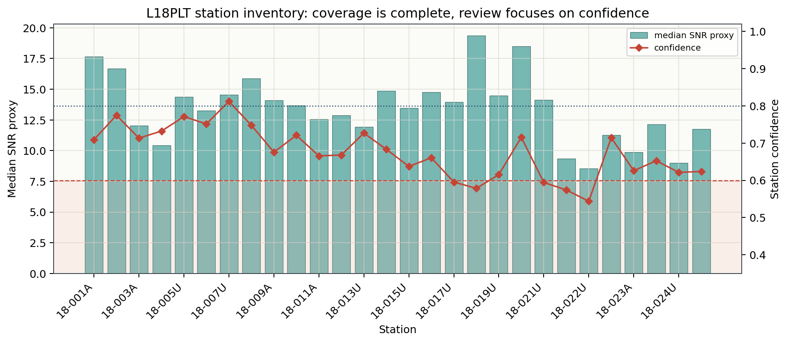

.. _tutorial_inspect_and_qc_survey:

Inspect and QC a Survey
=======================

This tutorial shows how to perform a first-pass quality-control review of an
EDI survey before correction, recomputation, modelling, or inversion. The goal
is not to decide the final geophysical interpretation. The goal is to answer a
more practical question:

*Which stations and frequency bands are reliable enough to use first, and which
ones need manual review?*

The workflow follows the style used throughout pyCSAMT v2:

- read the survey once
- inspect the station inventory
- build compact station-level QC tables
- compute confidence scores
- identify stations and frequency bands that need attention
- save review tables and diagnostic plots
- use CLI commands for quick checks where they are available

What You Will Learn
-------------------

After this tutorial you should be able to:

- load one EDI file, one survey directory, or a recursive survey tree
- inspect station names, frequency coverage, and missing transfer functions
- create a station-level quality-control table with
  :func:`pycsamt.emtools.qc.build_qc_table`
- generate simple flags with :func:`pycsamt.emtools.qc.qc_flags`
- compute station and frequency confidence tables
- export QC results for a field notebook, spreadsheet, or processing report
- choose which stations to keep, review, recompute, or remove from the first
  inversion trial

Input Assumptions
-----------------

The examples below use the bundled WILLY ``L18PLT`` line:

.. code-block:: text

   data/AMT/WILLY_DATA/L18PLT

Replace that path with your own EDI directory when you repeat the workflow on
student, field, or project data. The path can be:

- a single ``.edi`` file
- a directory containing EDI files
- a survey directory with line subdirectories

For example:

.. code-block:: text

   my_project/
     edis/
       line_01/
         S001.edi
         S002.edi
       line_02/
         S101.edi
         S102.edi

When a directory contains several lines, use ``recursive=True`` so pyCSAMT
discovers EDI files below the top-level folder.

Load the Survey
---------------

Start by reading the EDI survey through the public API. ``strict=False`` is
useful during the first inspection because it allows the reader to continue
past recoverable metadata issues.

.. code-block:: pycon

   >>> from pycsamt.api import read_edis
   >>> edi_dir = "data/AMT/WILLY_DATA/L18PLT"
   >>> survey = read_edis(
   ...     edi_dir,
   ...     recursive=False,
   ...     strict=False,
   ...     progress=False,
   ... )
   >>> sites = survey.collection
   >>> print(survey.summary())
   APIFrame: edi_survey_summary
   kind: edi.summary
   shape: 28 rows x 6 columns
   columns: station, path, n_freq, tipper, spectra, ts
   numeric: 1 columns
   missing: 0.0%
   source: data/AMT/WILLY_DATA/L18PLT

``survey`` is the public survey object returned by the API. ``sites`` is the
site collection used by most station editing, computation, and QC helpers.
The summary confirms all 28 stations were loaded, with no missing values and
a single ``numeric`` column (``n_freq``) -- a first, coarse signal that
loading itself did not silently drop or corrupt anything.

If you only need a pandas-friendly station inventory, inspect the survey
summary table:

.. code-block:: pycon

   >>> inventory = survey.df.to_pandas(copy=True)
   >>> print(inventory.columns.tolist())
   ['station', 'path', 'n_freq', 'tipper', 'spectra', 'ts']
   >>> other_cols = ["station", "n_freq", "tipper", "spectra", "ts"]
   >>> print(inventory[other_cols].head(3).to_string(index=False))
      station  n_freq  tipper  spectra    ts
   23-18-001A      53   False    False False
   23-18-002U      53   False    False False
   23-18-003A      53   False    False False

``inventory["path"]`` is omitted from the printed table above because it
resolves to an absolute filesystem path, which differs by machine; inspect
it directly (``inventory["path"].iloc[0]``) to confirm each row points at
the EDI file you expect.

The ``23-`` prefix on every ``station`` value here is not a typo: the raw EDI
header's own ``DATAID`` field is ``"23-18-001A"`` (``grep DATAID
18-001A.edi``), encoding the 2023 acquisition year ahead of the line/station
code, and ``survey.df`` reports that field as-is. The QC and confidence
tables built below instead key on the file-stem-derived ``18-001A`` form, so
the two identifiers must be matched by their common ``18-NNNx`` suffix, not
assumed identical -- a real, worth-noticing detail rather than a
display quirk. At this stage, also check that the number of stations is what
you expected, that station names are not duplicated unintentionally, and
that the frequency count (``53`` here, for every row) is consistent across
the line -- a ragged ``n_freq`` column would mean some stations lost
frequencies during acquisition or parsing.

Create an Output Folder
-----------------------

QC usually produces several small tables and plots. Put them in one folder so
the review is reproducible.

.. code-block:: pycon

   >>> from pathlib import Path
   >>> qc_dir = Path("qc_review")
   >>> qc_dir.mkdir(exist_ok=True)

Build the Station QC Table
--------------------------

The first compact table is produced by
:func:`pycsamt.emtools.qc.build_qc_table`. It summarizes the usable impedance
rows per station and, when possible, adds simple phase-tensor skew diagnostics.

.. code-block:: pycon

   >>> from pycsamt.emtools.qc import build_qc_table
   >>> qc = build_qc_table(
   ...     sites,
   ...     include_skew=True,
   ...     recursive=False,
   ...     api=True,
   ... )
   >>> qc_df = qc.to_pandas(copy=True)
   >>> cols = ["station", "n_freq", "frac_ok", "snr_med", "skew_med", "pmin", "pmax"]
   >>> print(qc_df[cols].head(5).to_string(index=False))
   station  n_freq  frac_ok   snr_med  skew_med     pmin     pmax
   18-001A      53      1.0 17.658396  4.809977 0.000096 0.992063
   18-002U      53      1.0 16.687366  6.596544 0.000096 0.992063
   18-003A      53      1.0 12.031672 11.018588 0.000096 0.992063
   18-004A      53      1.0 10.430580 14.509282 0.000096 0.992063
   18-005U      53      1.0 14.360341  9.171151 0.000096 0.992063

The important teaching point is that complete coverage does not mean the data
are automatically ready for inversion. This line has ``frac_ok = 1.0`` at
every station shown, but ``skew_med`` already varies by a factor of three
across just these five stations (``4.8`` to ``14.5`` degrees), which is
enough on its own to justify the dimensionality review in
:doc:`../theory/dimensionality` before trusting a 1-D/2-D interpretation
anywhere on this line.

The most useful columns are:

``station``
    Station name inferred from the EDI object.

``n_freq``
    Number of frequency rows available at the station.

``n_ok``
    Number of rows where the impedance tensor is finite enough for QC.

``frac_ok``
    Fraction of usable impedance rows, from ``0`` to ``1``.

``n_tip`` and ``n_tip_ok``
    Number of tipper rows and usable tipper rows when tipper data are present.

``snr_med``
    Median signal-to-noise proxy derived from impedance values and impedance
    errors when error tensors are available.

``pmin`` and ``pmax``
    Shortest and longest periods represented by the station.

``skew_med`` and ``skew_iqr``
    Median absolute phase-tensor skew and its interquartile spread. These
    columns are only added when ``include_skew=True``.

Export the table:

.. code-block:: pycon

   >>> qc_df.to_csv(qc_dir / "station_qc.csv", index=False)

Sort Stations by Review Priority
--------------------------------

A practical first review is to sort stations by coverage and signal quality.

.. code-block:: pycon

   >>> review_order = qc_df.sort_values(
   ...     by=["frac_ok", "snr_med"],
   ...     ascending=[True, True],
   ... )
   >>> print(review_order[cols].head(15).to_string(index=False))
   station  n_freq  frac_ok   snr_med  skew_med     pmin     pmax
   18-022U      53      1.0  8.557456 49.751057 0.000096 0.992063
   18-024U      53      1.0  8.987776 11.482211 0.000096 0.992063
   18-021B      53      1.0  9.339868 47.235914 0.000096 0.992063
   18-023A      53      1.0  9.854384 54.529465 0.000096 0.992063
   18-004A      53      1.0 10.430580 14.509282 0.000096 0.992063
   18-022V      53      1.0 11.268011 36.986632 0.000096 0.992063
   18-025A      53      1.0 11.770850 24.634843 0.000096 0.992063
   18-013U      53      1.0 11.944265 12.025504 0.000096 0.992063
   18-003A      53      1.0 12.031672 11.018588 0.000096 0.992063
   18-023V      53      1.0 12.137127 14.611436 0.000096 0.992063
   18-011A      53      1.0 12.575896  9.310687 0.000096 0.992063
   18-012A      53      1.0 12.873938  9.052529 0.000096 0.992063
   18-006A      53      1.0 13.272516 12.375357 0.000096 0.992063
   18-015U      53      1.0 13.456819 14.242493 0.000096 0.992063
   18-010U      53      1.0 13.677553  9.242375 0.000096 0.992063

Stations near the top of this sorted table should be checked before automated
static-shift correction, dimensionality analysis, or inversion preparation.
In this line, the sort mostly separates stations by signal-quality proxy
because the frequency coverage is complete at every station -- but note that
sorting by ``snr_med`` alone does not track ``skew_med``: ``18-022U`` (lowest
SNR) has ``skew_med=49.8``, comparable to ``18-023A`` further down the list
(``skew_med=54.5``, the highest of these 15), while ``18-024U`` sits second
from the bottom on SNR yet has one of the lowest skew values shown
(``11.5``). Low SNR and high skew are different failure modes -- a station
can have either, both, or neither -- so a single sort column is a starting
point for review, not a complete ranking.

Create Simple QC Flags
----------------------

Use :func:`pycsamt.emtools.qc.qc_flags` to attach simple rule-based labels.
The thresholds below are intentionally conservative for a first review. Adjust
them for local data quality, acquisition style, and survey objectives.

.. code-block:: pycon

   >>> from pycsamt.emtools.qc import qc_flags
   >>> flagged = qc_flags(
   ...     sites,
   ...     min_frac_ok=0.75,
   ...     min_snr_med=3.0,
   ...     max_skew_med=6.0,
   ...     recursive=False,
   ... )
   >>> flagged.to_csv(qc_dir / "station_qc_flags.csv", index=False)
   >>> print(flagged[["station", "frac_ok", "snr_med", "flags"]].head(5).to_string(index=False))
   station  frac_ok   snr_med     flags
   18-001A      1.0 17.658396
   18-002U      1.0 16.687366 high_skew
   18-003A      1.0 12.031672 high_skew
   18-004A      1.0 10.430580 high_skew
   18-005U      1.0 14.360341 high_skew
   >>> print(flagged["flags"].value_counts().to_string())
   flags
   high_skew    27
                 1

With this conservative ``max_skew_med=6.0`` threshold, 27 of the 28 stations
receive ``high_skew``. That is not an instruction to remove the whole line.
It is a clear sign that the next review should include phase-tensor, strike,
geology, and inversion residual diagnostics before trusting a simple 1-D/2-D
model anywhere on this profile. The sole exception, ``18-001A``
(``skew_med=4.8``, visible in the table above), is worth remembering as a
reference point precisely because it is the outlier: if a later diagnostic
disagrees with it specifically, that disagreement is more informative than
one more station agreeing with the crowd.

Typical flags are:

``low_coverage``
    Too few usable impedance rows. This can indicate incomplete spectra,
    parsing problems, bad frequency windows, or severe masking.

``low_snr``
    The median signal-to-noise proxy is below the selected threshold.

``high_skew``
    Phase-tensor skew is high enough to deserve dimensionality review.

A flag is not a deletion instruction. It is a review instruction. In field
datasets, low confidence can be caused by a real local conductor, poor electrode
contact, cultural noise, incorrect coordinate metadata, a rotation mismatch, or
format conversion from another software package.

Compute Station Confidence
--------------------------

The QC table is compact. The confidence table is more diagnostic. It combines
several indicators into a normalized confidence score between ``0`` and ``1``.

.. code-block:: pycon

   >>> from pycsamt.emtools.qc import station_confidence_table
   >>> station_ci = station_confidence_table(
   ...     sites,
   ...     method="composite",
   ...     relerr_threshold=0.20,
   ...     offdiag_tolerance_log10=0.35,
   ...     diagonal_leakage_max=0.35,
   ...     phase_jump_tolerance_deg=90.0,
   ...     spatial_tolerance_log10=0.60,
   ...     spacing_m=200.0,
   ...     recursive=False,
   ...     api=True,
   ... )
   >>> station_ci_df = station_ci.to_pandas(copy=True)
   >>> station_ci_df.to_csv(qc_dir / "station_confidence.csv", index=False)
   >>> ci_cols = ["station", "distance_m", "confidence", "confidence_err",
   ...            "coverage", "uncertainty", "offdiag", "diagonal", "phase", "spatial"]
   >>> print(station_ci_df[ci_cols].head(3).to_string(index=False))
   station  distance_m  confidence  confidence_err  coverage  uncertainty  offdiag  diagonal    phase  spatial
   18-001A         0.0    0.709038        0.342984       1.0     0.716714 0.462176  0.000000 0.975510 0.488179
   18-002U       200.0    0.774634        0.265434       1.0     0.561796 0.551179  0.328771 0.976991 0.990216
   18-003A       400.0    0.713303        0.247746       1.0     0.551732 0.452082  0.387056 0.971592 0.492792

The confidence score is lower than the coverage score because it includes
tensor consistency, diagonal leakage, phase continuity, and spatial
coherence. ``18-001A`` makes the point concretely: ``coverage=1.0`` (every
impedance row is usable) but ``confidence=0.709``, dragged down mainly by
``diagonal=0.0`` -- the diagonal-leakage check fails outright at this
station even though the earlier QC table showed it as the one station
*without* a ``high_skew`` flag. Coverage, skew, and diagonal leakage are
measuring different things, and a station can pass one check while failing
another.

Important confidence columns include:

``confidence``
    Composite score. Values close to ``1`` are usually safer for first-pass
    modelling. Values near ``0`` need review.

``confidence_err``
    Uncertainty proxy for the confidence score.

``coverage``
    Fraction of finite impedance rows.

``uncertainty``
    Score derived from impedance error tensors when available.

``offdiag``
    Consistency score between the two off-diagonal impedance components.

``diagonal``
    Score based on diagonal leakage relative to the off-diagonal components.

``phase``
    Score based on abrupt phase jumps.

``spatial``
    Neighbor-coherence score along the station profile.

Review Low-Confidence Stations
------------------------------

For first-pass work, a common pattern is to review stations below ``0.6`` and
start inversion tests with stations above ``0.8``. These are practical defaults,
not universal geophysical laws.

.. code-block:: pycon

   >>> low_ci = station_ci_df[station_ci_df["confidence"] < 0.60]
   >>> high_ci = station_ci_df[station_ci_df["confidence"] >= 0.80]
   >>> print("stations to review")
   stations to review
   >>> print(low_ci[["station", "confidence", "coverage", "phase", "spatial"]].to_string(index=False))
   station  confidence  coverage    phase  spatial
   18-017U    0.595479       1.0 0.969783 0.038160
   18-018A    0.578410       1.0 0.957546 0.000000
   18-021U    0.594344       1.0 0.938165 0.233576
   18-021B    0.574114       1.0 0.937891 0.232771
   18-022U    0.544020       1.0 0.941638 0.000000
   >>> print("stations suitable for first trials")
   stations suitable for first trials
   >>> print(high_ci[["station", "confidence", "coverage"]].to_string(index=False))
   station  confidence  coverage
   18-007U    0.811922       1.0
   >>> low_ci.to_csv(qc_dir / "stations_to_review.csv", index=False)

Five stations fall below ``0.60`` and exactly one, ``18-007U``, clears the
``0.80`` bar -- 22 of the 28 stations sit in the wide middle ground between
those thresholds, which is a routine outcome for a real field line, not a
survey failure. ``18-021U`` and ``18-021B`` sit next to each other in station
order and both land in the review group with nearly identical ``spatial``
scores (``0.234`` and ``0.233``); their ``spatial`` score is well above the
``18-018A``/``18-022U`` pair, whose ``spatial=0.0`` means each disagrees
sharply with its immediate neighbours rather than sharing a trend with them.
That distinction matters for the next step: a shared low score across
adjacent stations points toward a regional cause (cultural noise, a real
geologic contact, a survey-wide processing choice), while an isolated
``spatial=0.0`` station points toward something local to that one station --
acquisition metadata, electrode layout, orientation, or file conversion
history.

Inspect Frequency-Level Confidence
----------------------------------

Station averages can hide narrow-band problems. Use
:func:`pycsamt.emtools.qc.frequency_confidence_table` to inspect every
station-frequency sample.

.. code-block:: pycon

   >>> from pycsamt.emtools.qc import frequency_confidence_table
   >>> freq_ci = frequency_confidence_table(
   ...     sites,
   ...     method="composite",
   ...     ci_hi=0.95,
   ...     ci_lo=0.50,
   ...     recursive=False,
   ...     api=True,
   ... )
   >>> freq_ci_df = freq_ci.to_pandas(copy=True)
   >>> freq_ci_df.to_csv(qc_dir / "frequency_confidence.csv", index=False)
   >>> weak_freq = freq_ci_df[freq_ci_df["confidence"] < 0.50]
   >>> len(weak_freq), len(freq_ci_df)
   (68, 1484)
   >>> weak_cols = ["station", "frequency_hz", "period_s", "confidence", "flags"]
   >>> print(weak_freq[weak_cols].head(6).to_string(index=False))
   station  frequency_hz  period_s  confidence                                                               flags
   18-003A      2997.000  0.000334    0.480450                  reject,high_error,offdiag_mismatch,spatial_outlier
   18-003A         1.438  0.695410    0.485396 reject,high_error,offdiag_mismatch,diagonal_leakage,spatial_outlier
   18-003A         1.008  0.992063    0.477361 reject,high_error,offdiag_mismatch,diagonal_leakage,spatial_outlier
   18-004A      4277.000  0.000234    0.490229 reject,high_error,offdiag_mismatch,diagonal_leakage,spatial_outlier
   18-004A      3580.000  0.000279    0.456718 reject,high_error,offdiag_mismatch,diagonal_leakage,spatial_outlier
   18-004A      2997.000  0.000334    0.496109 reject,high_error,offdiag_mismatch,diagonal_leakage,spatial_outlier

The line has 68 station-frequency rows below ``0.50`` confidence out of
1,484 total (28 stations x 53 frequencies) -- under 5% of the whole survey,
concentrated rather than spread evenly:

.. code-block:: pycon

   >>> weak_freq["station"].nunique()
   19
   >>> print(weak_freq["station"].value_counts().head(5).to_string())
   station
   18-022U    12
   18-023A    12
   18-006A     6
   18-021B     5
   18-013U     5

Nineteen of the 28 stations contribute at least one weak frequency row, but
the counts are uneven, and comparing this list against the station-level
confidence table above is the useful step. ``18-022U`` was already flagged
there (``confidence=0.544``), so 12 weak frequency rows are consistent with
its low station average. ``18-023A`` was *not* flagged -- its station-level
confidence is comfortably above the ``0.60`` review threshold -- yet it ties
``18-022U`` for the most weak frequency rows on the whole line. That is
exactly the failure mode this section opened with: a station average can
hide a narrow-band problem. ``18-023A`` deserves a frequency-level look even
though the station-level table alone would not have flagged it. The
``flags`` column also shows *why* each row is weak (``high_error``,
``offdiag_mismatch``, ``diagonal_leakage``, ``spatial_outlier``): a row
flagged only ``spatial_outlier`` calls for a different response (compare
with neighbours, check coordinates) than one also flagged
``diagonal_leakage`` (revisit component orientation or genuine 3-D structure
at that frequency).

The frequency table is useful when you want to:

- mask a narrow noisy band rather than remove a whole station
- compare confidence between short-period and long-period data
- find stations with repeated phase jumps
- identify frequencies that may be affected by source-field instability,
  dead-band behavior, or cultural noise

Create a Confidence Profile Plot
--------------------------------

A line plot helps decide whether poor confidence is isolated, clustered, or
profile-wide.

.. code-block:: pycon

   >>> import matplotlib.pyplot as plt
   >>> from pycsamt.emtools.qc import plot_confidence_profile
   >>> ax = plot_confidence_profile(
   ...     sites,
   ...     method="composite",
   ...     ci_hi=0.95,
   ...     ci_lo=0.50,
   ...     station_labels=True,
   ...     spacing_m=200.0,
   ...     recursive=False,
   ... )
   >>> ax.figure.savefig(
   ...     qc_dir / "station_confidence_profile.png",
   ...     dpi=200,
   ...     bbox_inches="tight",
   ... )
   >>> plt.close(ax.figure)

The tutorial figures are generated by
``docs/scripts/generate_tutorial_inspect_qc.py`` from the same code path. The
first figure compares the station-level SNR proxy with the composite
confidence score:

The SNR bars and the confidence line do not track each other station by
station: the two tallest SNR bars on the line (around ``18-019U`` and
``18-021U``) sit next to confidence dips, not peaks, while the single
confidence value that clears the ``0.80`` line (``18-007U``, the only
station in ``high_ci`` above) has an unremarkable, mid-range SNR bar. A
higher SNR proxy describes signal strength relative to noise; it says
nothing about tensor consistency, diagonal leakage, or spatial coherence, so
it is not a substitute for the composite score.

The next two views show the same confidence logic in profile and
period-frequency space:

.. grid:: 1 1 2 2
   :gutter: 2

   .. grid-item::

      .. image:: ../images/tutorials/inspect_and_qc_survey/confidence_review_grid.png
         :alt: Station confidence profile and period-band confidence summary.
         :width: 100%

   .. grid-item::

      .. image:: ../images/tutorials/inspect_and_qc_survey/frequency_confidence_psection.png
         :alt: Frequency-level confidence pseudosection for the L18PLT tutorial line.
         :width: 100%

In the top-left panel, every station's confidence marker falls in the pink
``0.50``-``0.95`` band -- none reaches the green ``>= 0.95`` tier anywhere
along the 5.4 km profile, consistent with ``high_ci`` containing only one
station. The bottom-left panel shows median and mean confidence declining
gradually from about ``0.75`` at the shortest periods to about ``0.55``-``0.6``
at the longest, with the rejected-fraction band spiking at several scattered
periods rather than one contiguous interval -- a pattern more consistent
with narrow-band noise recurring across the line than with a single missing
or corrupted acquisition window. The right-hand pseudosection makes the same
point spatially: confidence (viridis, yellow = high) is mostly uniform
green-yellow, with the weak spots concentrated in vertical streaks at
specific stations and short periods rather than smeared across the whole
section -- the same station-localized pattern already identified numerically
above (``18-021U``, ``18-013U``, ``18-021B``, ``18-022U``, ``18-023A``), now
visible directly rather than only in a table.

Use this plot to distinguish three common cases:

- one or two isolated low-confidence stations, often worth manual repair
- a continuous low-confidence interval, often worth comparing with geology,
  topography, and acquisition notes
- profile-wide low confidence, often caused by import, rotation, unit, or
  configuration problems

``L18PLT`` matches the first case: confidence problems cluster at a handful
of identifiable stations and scattered periods rather than spreading evenly
across the whole line, which is why this tutorial's next steps (station
lists, then :doc:`correct_static_shift`) target specific stations instead of
reprocessing the survey wholesale.

Select Stations for the Next Step
---------------------------------

After QC, create explicit station lists. This makes later correction and
inversion runs easier to reproduce.

.. code-block:: pycon

   >>> keep_stations = (
   ...     station_ci_df.loc[station_ci_df["confidence"] >= 0.60, "station"]
   ...     .astype(str)
   ...     .tolist()
   ... )
   >>> review_stations = (
   ...     station_ci_df.loc[station_ci_df["confidence"] < 0.60, "station"]
   ...     .astype(str)
   ...     .tolist()
   ... )
   >>> len(keep_stations), len(review_stations)
   (23, 5)
   >>> _ = (qc_dir / "keep_stations.txt").write_text(
   ...     "\n".join(keep_stations) + "\n",
   ...     encoding="utf-8",
   ... )
   >>> _ = (qc_dir / "review_stations.txt").write_text(
   ...     "\n".join(review_stations) + "\n",
   ...     encoding="utf-8",
   ... )

23 stations keep a confidence at or above the ``0.60`` review threshold and
5 fall below it -- the same 5 stations identified in ``low_ci`` above. These
lists can be used by later site selection, recomputation, static-shift
correction, or inversion preparation steps.

CLI Quick Checks
----------------

The Python API gives the richest QC tables. The CLI is useful for quick
terminal checks before opening a notebook.

.. code-block:: bash
   :linenos:

   pycsamt edi info data/AMT/WILLY_DATA/L18PLT
   pycsamt edi validate data/AMT/WILLY_DATA/L18PLT --deep
   pycsamt site info data/AMT/WILLY_DATA/L18PLT --format csv > qc_review/site_inventory.csv
   pycsamt site compute strike data/AMT/WILLY_DATA/L18PLT --format csv > qc_review/strike.csv
   pycsamt site compute tipper data/AMT/WILLY_DATA/L18PLT --format csv > qc_review/tipper.csv

Use the CLI outputs as supporting diagnostics. Use the Python QC tables when
you need confidence thresholds, frequency-level masking, or custom reporting.

What to Do With Poor Stations
-----------------------------

The QC result should lead to a processing decision. Common decisions are:

``keep``
    The station has high confidence and acceptable frequency coverage.

``review``
    The station has local problems but may be recoverable after frequency
    masking, component rotation, or static-shift analysis.

``recompute``
    The station was exported by another program or has inconsistent component
    orientation, naming, or metadata. Use pyCSAMT site recomputation before
    modelling.

``exclude from first trial``
    The station is too incomplete or unstable for the first inversion run.
    Keep it documented so it can be revisited after the first model explains
    the main survey response.

Troubleshooting
---------------

No stations are loaded
    Check the input path, file extension, and ``recursive=True`` when EDI files
    are inside line subdirectories.

All stations have low coverage
    Inspect the EDI format and component names. The files may need
    recomputation or conversion before QC.

Confidence is low only at long periods
    This may indicate noise, weak source field, dead-band behavior, or a real
    long-period response. Compare neighboring stations before masking.

Confidence is low only for one station
    Check station coordinates, orientation, contact resistance notes, and
    whether the station was exported differently from the rest of the line.

Skew is high across a profile segment
    Do not automatically delete those stations. Compare with structural
    geology, dimensionality diagnostics, and inversion residuals.

See Also
--------

:doc:`read_edi_survey`
    Load EDI files and inspect the survey object.

:doc:`correct_static_shift`
    Apply a common first correction after QC.

:doc:`../theory/dimensionality`
    Interpret high phase-tensor skew before assuming a 1-D/2-D structure.

:doc:`../user_guide/site/recompute`
    Recompute and rewrite EDI files imported from external software.

:doc:`../user_guide/site/computed_diagnostics`
    Compute strike, resistivity, phase-slope, and tipper diagnostics.

:doc:`../api/emtools`
    EMTools API reference.
