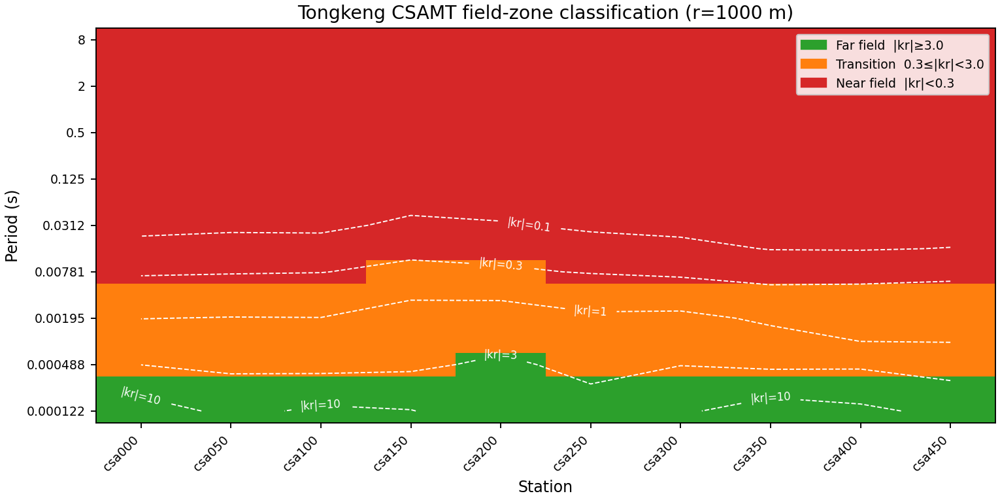
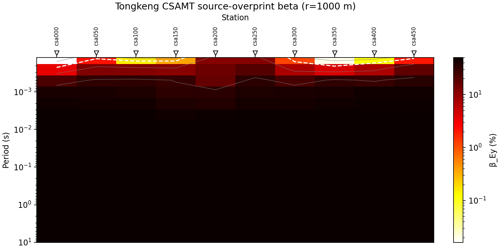
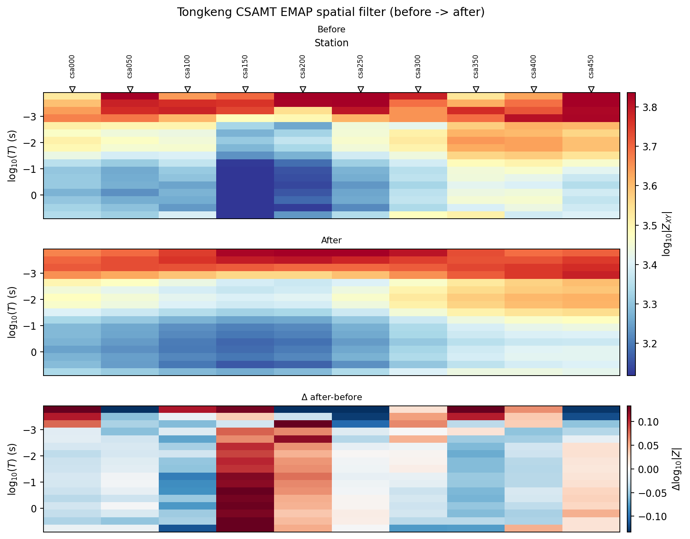
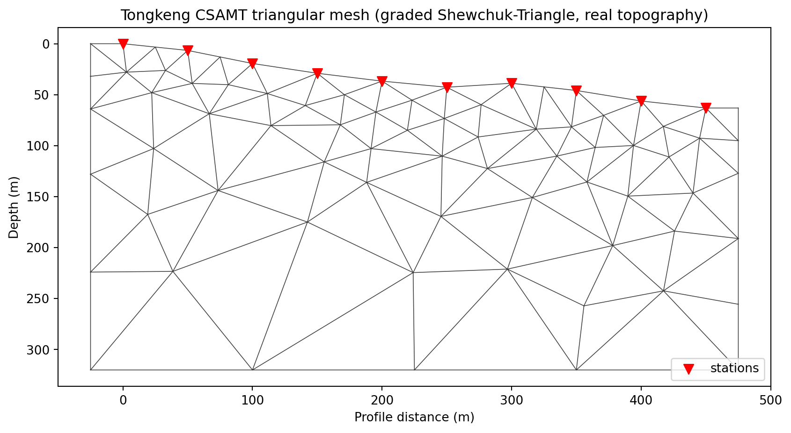
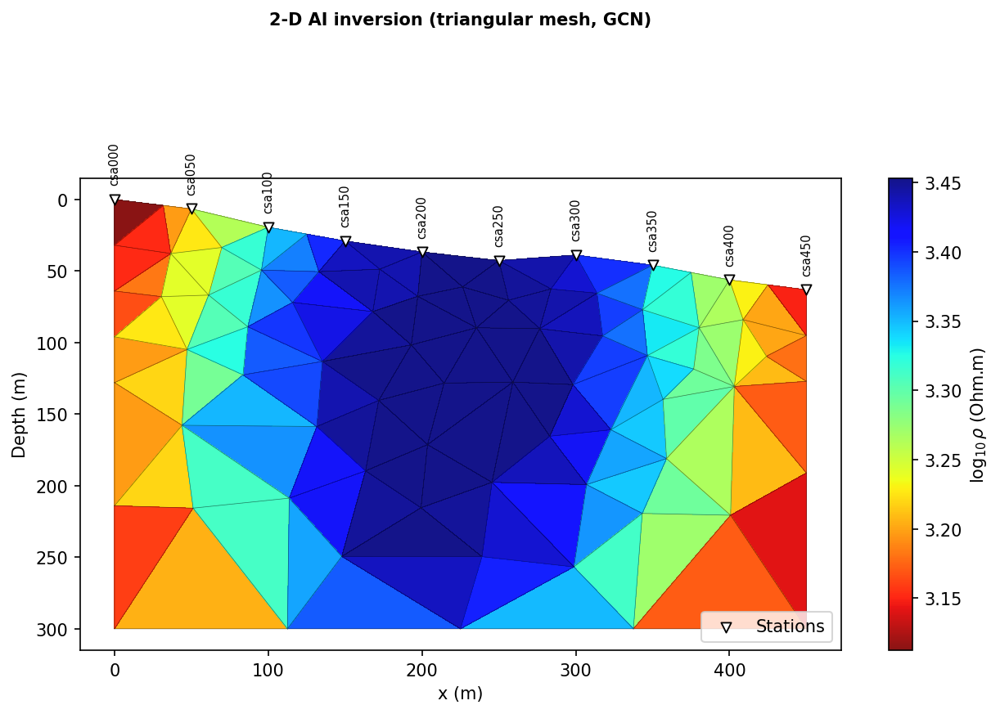

.. _tutorial_map_groundwater_geology_from_csamt:

Map Groundwater Geology From CSAMT
==================================

The Tongkeng line is ten stations, 50 m apart, along a single 450 m profile in
Hunan Province, China -- the field survey behind Kouadio et al. (2020)'s
two-dimensional CSAMT inversion and three-dimensional geological mapping for
groundwater exploration in the area. Unlike the two undelivered WILLY lines
:doc:`map_porphyry_mineralization_from_noisy_amt` works with, ``data/CSAMT``
is small enough to ship in the repository itself, so every number and figure
below is reproducible from a fresh checkout, no substitution needed.

.. code-block:: text

   Kouadio, K.L., Xu, Y., Liu, C., Boukhalfa, Z. (2020). Two-dimensional
   inversion of CSAMT data and three-dimensional geological mapping for
   groundwater exploration in Tongkeng Area, Hunan Province, China.
   Journal of Applied Geophysics, 104204.

See also ``[Kouadio2020]`` in :doc:`../references`.

:doc:`map_porphyry_mineralization_from_noisy_amt` runs the near-field and
source-overprint diagnostics against natural-source :term:`AMT` data purely
as a negative control -- there is no transmitter to diagnose, and both
sections conclude exactly that. Here the opposite is true: Tongkeng is real
:term:`CSAMT`, acquired with a real grounded-dipole transmitter, and those
same diagnostics are load-bearing corrections, not a demonstration. That
single difference reshapes the whole correction order below, not just one
section -- roughly two-thirds of this survey's frequency band turns out to
sit in the :term:`near field`, which is itself the central, useful finding
this tutorial builds on rather than works around.

What You Will Learn
-------------------

After this tutorial you should be able to:

- classify every station-frequency pair into :term:`near field`,
  :term:`transition field`, or :term:`far field`, and use that
  classification to decide which frequencies are physically trustworthy
  before doing anything quantitative with them;
- apply and *know the limits of* an analytical near-field correction, rather
  than trusting a formula past the point where it stops meaning anything;
- recognize when phase-tensor, distortion-decomposition, and strike
  diagnostics are *not* available -- a singular, non-invertible impedance
  tensor from single-component acquisition -- and prove it from the data
  rather than assume it from the acquisition method's name;
- run the same generic static-shift and EMAP corrections
  :doc:`map_porphyry_mineralization_from_noisy_amt` uses, and read genuinely
  different real output from a genuinely different survey;
- build a per-triangle geological prior and an unstructured triangular mesh
  with :mod:`pycsamt.ai.geology`/:mod:`pycsamt.ai.training.dataset2d_tri`,
  with no external mesh-generation binary required;
- train and gate a real, in-process Maxwell-physics AI inversion on that
  triangular mesh through ``Inv2DAgent(physics="mt2d_tri")``.

Recommended Order
-----------------

1. load the line and build baseline QC/confidence tables;
2. classify field zones and apply the near-field correction, honestly, to
   find out how much of the band survives;
3. confirm that conclusion independently with the source-overprint
   diagnostic;
4. check whether phase-tensor/distortion/strike diagnostics are even
   available for this survey before reaching for them -- they are not, and
   the reason is checkable in the data, not an assumption;
5. screen for near-surface/static-shift effects and correct where warranted;
6. smooth remaining incoherent noise with an :term:`EMAP` spatial filter;
7. drop low-confidence frequency rows and export corrected EDIs;
8. restrict to the far/transition band established in step 2 for anything
   downstream that is depth- or frequency-sensitive;
9. build a geological prior and a triangular AI-training mesh, and train and
   gate a real ``physics="mt2d_tri"`` inversion.

Load The Line
-------------

.. code-block:: pycon

   >>> from pycsamt.api import read_edis
   >>> from pycsamt.site import Sites

   >>> survey = read_edis("data/CSAMT", recursive=False, strict=False, progress=False)
   >>> sites = Sites(survey.collection)
   >>> [site.name for site in sites]
   ['csa000', 'csa050', 'csa100', 'csa150', 'csa200', 'csa250', 'csa300', 'csa350', 'csa400', 'csa450']

Names, not the raw ``DATAID`` header values (``S00``-``S09``), because
pyCSAMT canonicalises station identity to the file stem the moment any
station-aware function touches the collection. Try chainage ordering the
same way :doc:`map_porphyry_mineralization_from_noisy_amt` does for WILLY:

.. code-block:: pycon

   >>> chain_attempt = Sites(survey.collection).ordered("chainage")
   >>> chain_attempt.ordering
   {'requested': 'chainage', 'applied': 'input', 'n_sites': 10, 'n_coordinates': 0, 'reason': 'fewer than two finite coordinates'}

Zero usable coordinates, not a subtle geometry failure -- these EDI files
record position under ``LATITUDE=``/``LONGITUDE=``/``ELEVATION=`` in the
``>INFO`` block rather than the standard SEG-EDI ``>HEAD`` ``LAT=``/``LONG=``
keys pyCSAMT's coordinate reader expects, so ``Site.coords`` is genuinely
``(nan, nan, nan)`` for every station here, not merely unpopulated by
choice. That is a real, checkable property of this particular delivery, not
a pyCSAMT limitation: ``grep LAT data/CSAMT/csa450.edi`` shows the
non-standard keys directly. Chainage ordering falls back to input order
precisely because it cannot silently guess a profile geometry it has no
coordinates for.

``Site.coords`` staying empty does not mean the elevation values are gone
from the file, though -- they are read by a different, ``>INFO``-aware
accessor instead:

.. code-block:: pycon

   >>> from pycsamt.topo.extract import extract_elevation, has_elevation

   >>> has_elevation(sites)
   True
   >>> extract_elevation(sites)
   array([573.4, 566.8, 554. , 544.4, 536.7, 530.7, 534.6, 527.5, 517.2,
          510.3])

:func:`pycsamt.topo.extract.extract_elevation` reads ``>HEAD``'s
``Location``/``elev`` fields first and only falls back to ``>INFO``'s
``latitude``/``longitude``/``elevation`` attributes (already parsed onto
:class:`pycsamt.seg.heads.Info` by the SEG-EDI reader) when the ``>HEAD``
side is absent or an unset ``0.0`` default -- exactly this delivery's
situation, and a real, standards-compliant fallback rather than a
Tongkeng-specific special case (the SEG-EDI spec allows location metadata
under ``>INFO``). A real 63 m drop across the line's 450 m length, later
used to drape the training mesh and the AI-inversion section with genuine
topography rather than the flat surface an earlier version of this
tutorial used here.

Station-name ordering sidesteps the chainage-geometry problem entirely for
this survey, since the names already encode true along-line distance in
metres:

.. code-block:: pycon

   >>> sites = Sites(survey.collection).ordered("station")
   >>> [site.name for site in sites]
   ['csa000', 'csa050', 'csa100', 'csa150', 'csa200', 'csa250', 'csa300', 'csa350', 'csa400', 'csa450']
   >>> sites.ordering["applied"]
   'station'

The result is identical to input order here (the files were already named
and delivered in profile sequence), but ``by="station"`` makes that
guarantee explicit and survives a shuffled or renamed input directory --
the same protection :doc:`map_porphyry_mineralization_from_noisy_amt`
gets from chainage, just from a different, coordinate-free mechanism
suited to this delivery.

Baseline Quality Check
----------------------

.. code-block:: pycon

   >>> from pycsamt.emtools import build_qc_table, frequency_confidence_table

   >>> qc = build_qc_table(sites, recursive=False)
   >>> qc[["station", "n_freq", "n_ok", "frac_ok", "skew_med", "skew_iqr"]]
     station  n_freq  n_ok  frac_ok  skew_med  skew_iqr
   0  csa000      17    17      1.0       0.0      90.0
   1  csa050      17    17      1.0       0.0      90.0
   2  csa100      17    17      1.0       0.0       0.0
   3  csa150      17    17      1.0       0.0       0.0
   4  csa200      17    17      1.0       0.0       0.0
   5  csa250      17    17      1.0       0.0       0.0
   6  csa300      17    17      1.0       0.0      90.0
   7  csa350      17    17      1.0       0.0      90.0
   8  csa400      17    17      1.0       0.0      90.0
   9  csa450      17    17      1.0       0.0       0.0

Every one of the 170 station-frequency rows passes the loader's own basic
validity check (``frac_ok=1.0`` everywhere) -- a real, useful contrast with
WILLY, where the equivalent table already showed gaps before any correction
ran. That does not mean the *data* is clean; it means nothing is missing or
malformed, a different and weaker claim.

.. code-block:: pycon

   >>> fc = frequency_confidence_table(sites, recursive=False)
   >>> fc["confidence"].describe().round(3)
   count    170.000
   mean       0.830
   std        0.014
   min        0.786
   25%        0.823
   50%        0.834
   75%        0.841
   max        0.849
   Name: confidence, dtype: float64

A tight band around 0.83 with a standard deviation of 0.014 -- an order of
magnitude less spread than a genuinely noisy line would show. Composite
confidence alone would suggest an unremarkable, well-behaved survey.
Nothing in this table hints at what the next section finds.

Classify Field Zones
--------------------

:doc:`../theory/field_zones` derives :eq:`eq-fz-bostick` and :eq:`eq-fz-kr`
in full and works through station ``csa000`` in isolation; this section
applies the same classification, at the same real ``r=1000 m`` offset that
page uses (the true acquisition offset is not recorded in these EDI files
either -- see that page's own note on why), across the whole ten-station
line.

.. code-block:: pycon

   >>> from pycsamt.emtools import classify_field_zones, plot_field_zones

   >>> zones = classify_field_zones(sites, source_offset=1000.0, recursive=False)
   >>> zones["zone"].value_counts().to_dict()
   {'near': 108, 'transition': 41, 'far': 21}

Near field accounts for 108 of 170 rows -- 63.5 percent of this survey's
entire recorded band, at every one of the ten stations, not a handful of
outlier soundings:

.. code-block:: pycon

   >>> per_station = zones.groupby("station")["zone"].value_counts().unstack(fill_value=0)
   >>> per_station[["far", "transition", "near"]].rename_axis(None)
   zone    far  transition  near
   csa000    2           4    11
   csa050    2           4    11
   csa100    2           4    11
   csa150    2           5    10
   csa200    3           4    10
   csa250    2           4    11
   csa300    2           4    11
   csa350    2           4    11
   csa400    2           4    11
   csa450    2           4    11

.. code-block:: python
   :linenos:

   import matplotlib.pyplot as plt
   from pycsamt.emtools import plot_field_zones

   fig, ax = plt.subplots(figsize=(9, 4.5), constrained_layout=True)
   plot_field_zones(sites, source_offset=1000.0, recursive=False, ax=ax)
   ax.set_title("Tongkeng CSAMT field-zone classification (r=1000 m)")
   fig.savefig("csamt_field_zones.png", dpi=170)

   Every station shows the identical pattern: the top two frequencies
   (8196.7, 4098.4 Hz) sit safely in the far field, the next four sit in
   transition, and everything from 128 Hz down -- eleven of seventeen
   frequencies -- sits in the near field. This is exactly the pattern
   :doc:`../theory/field_zones` finds for ``csa000`` alone; seeing it repeat
   identically at all ten stations confirms it is a property of the survey
   geometry, not one noisy sounding.

Apply Near-Field Correction
---------------------------

:eq:`eq-fz-nf-factor` gives the analytical correction; the previous section
already shows *where* it should and should not be trusted. Apply it anyway,
to see the limit directly rather than take it on faith:

.. code-block:: pycon

   >>> from pycsamt.emtools.source_effects import correct_near_field

   >>> corrected_nf = correct_near_field(sites, source_offset=1000.0, inplace=False)
   >>> raw0, cor0 = list(sites)[0], list(corrected_nf)[0]
   >>> import numpy as np
   >>> np.round(cor0.rho[:, 0, 1] / raw0.rho[:, 0, 1], 4)
   array([1.001 , 1.0113, 1.0979, 1.594 , 0.4571, 0.0067, 0.    , 0.    ,
          0.    , 0.    , 0.    , 0.    , 0.    , 0.    , 0.    , 0.    ,
          0.    ])

The first two ratios are essentially exact (1.001, 1.011 -- the far-field
correction barely moves an already-correct value). The next three are
real, modest, plausible adjustments (10-59 percent). From the seventh entry
on, the ratio is numerically zero: dividing a finite impedance by a
correction factor already shown to reach :math:`10^7`-:math:`10^{10}` in
this band drives the result below floating-point resolution, exactly as
:doc:`../theory/field_zones` found for this same station. The correction
does not fail quietly here -- it fails in a way that is impossible to
mistake for a small residual bias. Six of seventeen frequencies -- the far
and transition band from the previous section -- are the ones this formula
can genuinely help; the rest need to be set aside, not corrected.

Check Source Overprint
----------------------

A second, independent diagnostic, built on the same ground-wave/surface-wave
physics but evaluated directly from :math:`\rho`, :math:`f`, and :math:`r`
rather than through the Bostick-depth ratio:

.. code-block:: pycon

   >>> from pycsamt.emtools import detect_source_overprint, plot_overprint_section

   >>> ov = detect_source_overprint(sites, source_offset=1000.0, recursive=False)
   >>> round(ov["beta_pct"].median(), 2), int(ov["overprint_flag"].sum()), len(ov)
   (49.99, 162, 170)

Median overprint beta of exactly 49.99 percent, and 162 of 170 rows flagged,
is not a marginal warning -- it is the same near-field-dominated
conclusion as the field-zone classification, reached through an entirely
different formula. Two diagnostics built for controlled-source acquisition
agreeing this strongly is itself informative: unlike WILLY, where the same
pairing agreed the diagnostics *did not apply*, here they agree the survey
genuinely needs them.

.. code-block:: python
   :linenos:

   import matplotlib.pyplot as plt
   from pycsamt.emtools import plot_overprint_section

   fig, ax = plt.subplots(figsize=(9, 4.5), constrained_layout=True)
   plot_overprint_section(sites, source_offset=1000.0, recursive=False, ax=ax)
   ax.set_title("Tongkeng CSAMT source-overprint beta (r=1000 m)")
   fig.savefig("csamt_overprint_beta.png", dpi=170)

   Overprint beta climbs from well under the 3 percent Yan & Fu (2004)
   threshold at the highest frequency to saturating near 50 percent across
   most of the band, at every station -- the same shape the field-zone
   figure shows, from an independent calculation. From here on, this
   tutorial treats only the far/transition band (the top six frequencies,
   8196.7-255.8 Hz) as physically trustworthy for anything that assumes a
   plane-wave response.

Rule Out Phase-Tensor And Distortion Diagnostics
-------------------------------------------------

:doc:`process_zonge_avg_k1_k2` already establishes the rule for K1/K2's
Ex-Hy-only lines: the phase tensor
:math:`\boldsymbol\Phi=[\operatorname{Re}\mathbf Z]^{-1}\operatorname{Im}\mathbf Z`
needs an invertible :math:`\operatorname{Re}\mathbf Z`, and a
single-component tensor makes that matrix singular. Tongkeng hits the same
wall, confirmed directly from the data rather than assumed from the
acquisition method's name:

.. code-block:: pycon

   >>> import numpy as np

   >>> z0 = list(sites)[0].z
   >>> [float(np.abs(z0[:, i, j]).max()) for i, j in ((0, 0), (1, 0), (1, 1))]
   [0.0, 0.0, 0.0]

Only :math:`Z_{xy}` was ever measured; :math:`Z_{xx}=Z_{yx}=Z_{yy}=0`
identically, at every station and every frequency. pyCSAMT does not refuse
to compute a phase tensor from this -- :func:`pycsamt.emtools.tensor._phi_from_z`
falls back to a Moore-Penrose pseudo-inverse rather than raising -- but that
fallback is not a phase tensor in any physical sense. For a singular
:math:`\operatorname{Re}\mathbf Z` of exactly this shape, the result
collapses to a fixed algebraic form regardless of what was actually
measured:

.. code-block:: pycon

   >>> def phi_from_single_zxy(zxy):
   ...     Xi = np.array([[0.0, zxy.real], [0.0, 0.0]])
   ...     Yi = np.array([[0.0, zxy.imag], [0.0, 0.0]])
   ...     return np.linalg.pinv(Xi) @ Yi
   >>> for zxy in (3000 + 2000j, 100 - 50j, 5000 + 5000j):
   ...     print(phi_from_single_zxy(zxy)[1, 1])
   0.6666666666666666
   -0.5
   1.0

Every entry except ``phi[1, 1]`` is exactly zero, and ``phi[1, 1]`` is just
``Im(Zxy) / Re(Zxy)`` -- the tangent of the measured phase, nothing else.
The orientation eigenvector of that fixed matrix shape sits at exactly 90
degrees for *any* input, which is why an earlier version of this page's
phase-tensor ellipse pseudo-section pointed every single ellipse in the
same direction: not a geological finding, an artefact of inverting a
rank-1 matrix. The same degeneracy propagates through every function built
on it -- skew/ellipticity (and so
:func:`~pycsamt.emtools.learn_dim_dictionary`'s dimensionality dictionary),
Swift :math:`\nu` and Bahr :math:`\eta` (both collapse to constants, 0 and 1
respectively, whenever :math:`Z_{xx}=Z_{yy}=0`), the
:term:`Groom-Bailey decomposition` (its model assumes an anti-diagonal
regional tensor requiring :math:`Z_{yx}\neq0`, so the fit is regressing
against exact zeros at every one of the 17 frequencies), and strike
consensus (built on the same phase-tensor table). Every one of those, run
on this survey, returns suspiciously *too-clean* numbers: skew exactly
bimodal at 0/90 degrees, Groom-Bailey twist/shear/gain identical to machine
precision across all ten independently-fit stations, strike at exactly
-45 degrees with zero spread. That is the tell, not a finding -- a
genuinely noisy real line does not agree with itself to fifteen decimal
places by chance; a shared mathematical degeneracy does.

None of this is computed below. What remains -- field-zone classification,
the near-field correction, source-overprint, static shift, and the EMAP
filter -- all operate on :math:`\rho_a`/:math:`Z_{xy}` directly and need no
tensor inversion, so every one of them stays exactly as valid for this
single-component survey as it would be for a full four-component one.

Static Shift And Near-Surface Effects
-------------------------------------

:func:`pycsamt.emtools.detect_near_surface` splits each station's band into
a high-frequency and a low-frequency group at ``f_split`` and compares their
apparent-resistivity slopes. Its default (``f_split=1.0`` Hz) assumes a
broadband MT-style survey -- exactly the caveat
:doc:`map_porphyry_mineralization_from_noisy_amt` raises for the same
function -- and on this narrower, near-field-dominated 0.125-8196.7 Hz
CSAMT band it leaves almost every low-frequency group empty:

.. code-block:: pycon

   >>> from pycsamt.emtools import detect_near_surface

   >>> ns_default = detect_near_surface(sites, recursive=False)
   >>> ns_default[["station", "n_hf", "n_lf"]].head(3)
     station  n_hf  n_lf
   0  csa000     9     0
   1  csa050    11     0
   2  csa100    12     1

A split matched to this survey's own period range, roughly the geometric
middle of its band, gives every station a usable count on both sides:

.. code-block:: pycon

   >>> ns = detect_near_surface(sites, recursive=False, f_split=32.0)
   >>> cols = ["station", "n_hf", "n_lf", "ns_index", "ss_delta_log10", "ns_flag", "ss_flag", "distortion_type"]
   >>> print(ns[cols].to_string(index=False))
   station  n_hf  n_lf  ns_index  ss_delta_log10  ns_flag  ss_flag distortion_type
    csa000     5     4       0.0             0.0    False    False           clean
    csa050     7     4       0.0             0.0    False    False           clean
    csa100     7     6       0.0             0.0    False    False           clean
    csa150     8     6       0.0             0.0    False    False           clean
    csa200     9     6       0.0             0.0    False    False           clean
    csa250     9     6       0.0             0.0    False    False           clean
    csa300     7     4       0.0             0.0    False    False           clean
    csa350     6     6       0.0             0.0    False    False           clean
    csa400     6     6       0.0             0.0    False    False           clean
    csa450     7     6       0.0             0.0    False    False           clean

Every station classifies ``clean``, with a genuinely zero near-surface
index rather than a suppressed or missing one. Confirm the complementary
spatial method agrees before trusting that:

.. code-block:: pycon

   >>> from pycsamt.emtools import estimate_ss_ama, apply_ss_factors

   >>> ss = estimate_ss_ama(sites, recursive=False)
   >>> ss[["station", "delta_log10_rho", "fac_rho", "fac_z", "n_used"]]
     station  delta_log10_rho  fac_rho  fac_z  n_used
   0  csa000              0.0      1.0    1.0       9
   1  csa050              0.0      1.0    1.0      11
   2  csa100              0.0      1.0    1.0      13
   3  csa150              0.0      1.0    1.0      14
   4  csa200              0.0      1.0    1.0      15
   5  csa250              0.0      1.0    1.0      15
   6  csa300              0.0      1.0    1.0      11
   7  csa350              0.0      1.0    1.0      12
   8  csa400              0.0      1.0    1.0      12
   9  csa450              0.0      1.0    1.0      13
   >>> ss["delta_log10_rho"].nunique()
   1

Both methods agree: no station-to-station static shift anywhere on this
line. That is a real, explainable finding rather than a null result to
shrug off -- the adaptive moving-average method flags a station only when
its resistivity trend departs from its *neighbours'*, and every diagnostic
so far has shown this profile's ten stations sharing one strikingly
consistent regional signature, the same near-field pattern at every one of
them. Ten stations agreeing with each other this closely is itself a form
of lateral consistency, not evidence that static shift was somehow missed.

.. code-block:: pycon

   >>> ss_corrected = apply_ss_factors(sites, ss, recursive=False)

``fac_rho``/``fac_z`` of exactly 1.0 everywhere means this call is a
no-op for Tongkeng, kept in the pipeline only so the same code applies
unchanged to a survey where it is not.

EMAP Spatial Filter
-------------------

.. code-block:: pycon

   >>> from pycsamt.emtools import apply_emap_filter

   >>> emap = apply_emap_filter(ss_corrected, recursive=False)
   >>> import numpy as np
   >>> d0, e0 = list(ss_corrected)[0], list(emap)[0]
   >>> np.round(d0.rho[:5, 0, 1], 2)
   array([ 277.,  756., 1850., 4250., 4140.])
   >>> np.round(e0.rho[:5, 0, 1], 2)
   array([ 524.55, 1230.51, 2632.75, 3956.99, 3872.12])

Unlike static shift, the spatial filter genuinely changes values here --
csa000's top-frequency resistivity nearly doubles, from 277 to 525
:math:`\Omega\cdot`\ m, once its neighbours (which sit substantially higher
in this part of the band) are folded into the along-line moving average.
That is consistent with real short-wavelength lateral variation at 50 m
station spacing surviving into the corrected data, exactly the kind of
signal a static-shift check (which compares full curves, not single
frequencies) is not designed to catch.

.. code-block:: python
   :linenos:

   from pycsamt.emtools import plot_emap_filter_psection

   fig = plot_emap_filter_psection(ss_corrected, emap)
   fig.suptitle("Tongkeng CSAMT EMAP spatial filter (before -> after)", y=1.03)
   fig.savefig("csamt_emap_filter.png", dpi=170, bbox_inches="tight")

``plot_emap_filter_psection`` builds and returns its own three-panel
figure (before/after/:math:`\Delta`) rather than drawing onto a caller-supplied
``Axes`` -- pass the real before/after ``Sites`` collections directly and
save the figure it hands back, rather than a separately created one that
never gets drawn on.

   Smoothing is visible station-to-station across most of the section, not
   concentrated at one edge or one frequency band -- consistent with
   genuine short-wavelength lateral noise rather than a single bad station
   dominating the correction.

Drop Weak Frequencies And Export Corrected EDIs
-----------------------------------------------

.. code-block:: pycon

   >>> from pycsamt.emtools import drop_low_confidence_frequencies

   >>> dropped = drop_low_confidence_frequencies(emap, recursive=False)
   >>> list(emap)[0].freq.size, list(dropped)[0].freq.size
   (17, 17)

Nothing drops at the default 0.5 confidence threshold, matching the
baseline QC table's own tight, uniformly-high confidence band -- this
survey's real problem is near-field geometry, not per-frequency
signal-to-noise, and a confidence-based filter has no reason to touch rows
that were never flagged as individually unreliable.

.. code-block:: pycon

   >>> from pycsamt.agents.edi_export import EDIExportAgent

   >>> export_agent = EDIExportAgent()
   >>> res = export_agent.execute({"sites": dropped, "output_dir": "runs/csamt_corrected_edis"})
   >>> res.status, res.data["n_written"], res.data["n_failed"]
   ('success', 10, 0)

Select The Trustworthy Band For Training
-----------------------------------------

Everything from here on restricts to the six far/transition frequencies
`Apply Near-Field Correction`_ established, using
:func:`pycsamt.site.edit.select_freq_all`. Skew, distortion decomposition,
and strike estimation are not repeated on this narrower band the way an
earlier version of this page did -- the previous section already
established that none of the three measure anything real for this
single-component survey, on the full band or any subset of it:

.. code-block:: pycon

   >>> from pycsamt.site.edit import select_freq_all

   >>> usable = select_freq_all(dropped, fmin=255.0)
   >>> list(usable)[0].freq
   array([8196.722 , 4098.361 , 2049.18  , 1023.541 ,  512.8206,  255.7545])

Build The Geology Grid And Triangular Mesh
------------------------------------------

Every mesh so far in this documentation set has been the rectilinear
:class:`~pycsamt.forward.maxwell.contracts.MaxwellMesh` family. Tongkeng
uses the other one: an unstructured
:class:`~pycsamt.forward.maxwell.contracts_tri.TriMesh`, built with
:func:`pycsamt.forward.maxwell.tri_mesh_gen.build_graded_tri_mesh` -- a
real, graded quality mesh via Shewchuk's Triangle library (fine near the
stations, coarsening smoothly with depth and lateral distance), needing
no *compiled* Triangle or MARE2DEM binary (``triangle``'s Python
bindings run in-process), unlike the classical MARE2DEM meshing route
:doc:`prepare_mare2dem_inversion` covers.

The geological prior is a per-*triangle*, not per-cell, field. For triangle
:math:`j` with centroid :math:`(x_j,z_j)`,

.. math::
   :label: eq-tongkeng-tri-prior

   \log_{10}\rho_j=
   \log_{10}\bar{\rho}_{k(x_j,z_j)}+
   \sigma_{k(x_j,z_j)}\,g(x_j,z_j),

the same correlated-Gaussian-field construction
:eq:`willy-two-line-prior` uses in
:doc:`map_porphyry_mineralization_from_noisy_amt`, just evaluated at
triangle centroids instead of rectilinear cell centres:

.. code-block:: pycon

   >>> from pycsamt.ai.geology import GeologyGrid

   >>> grid = GeologyGrid.regular_2d(nx=20, nz=16, dx_m=25, dz_m=20, x_origin_m=-25)
   >>> grid.shape
   (16, 20)

``x_origin_m=-25`` pads the grid a half station-spacing beyond ``csa000``,
matching the mesh boundary built next. `Load The Line`_ already showed
:func:`~pycsamt.topo.extract.extract_elevation` recovers a real elevation
for every station here; :func:`pycsamt.ai.geology.topography_from_sites`
uses that same accessor internally, so it no longer refuses either --
worth confirming directly, even though this tutorial builds the mesh's
own topography a different, simpler way below:

.. code-block:: pycon

   >>> from pycsamt.ai.geology import topography_from_sites

   >>> topo = topography_from_sites(sites, grid, profile_origin_m=0.0)
   >>> topo.sample_elevation_m
   array([573.4, 566.8, 554. , 544.4, 536.7, 530.7, 534.6, 527.5, 517.2,
          510.3])

Building the mesh itself stays independent of ``GeologyGrid``'s own
rasterized representation, though, since :func:`build_graded_tri_mesh`
wants paired ``(topo_x_m, topo_z_m)`` samples directly, not a grid --
and it needs the exact same nominal station spacing the rest of this
tutorial already uses (``Inv2DAgent``'s ``station_spacing_m=50.0`` later
on assumes it too), not ``topography_from_sites``'s own real
GPS-chainage-derived x-coordinates (49.3, 99.9, ... m -- close to, but
not exactly, the nominal 50 m grid):

.. code-block:: pycon

   >>> station_x = [50.0 * i for i in range(10)]
   >>> from pycsamt.topo.extract import extract_elevation
   >>> from pycsamt.forward.maxwell.tri_mesh_gen import build_graded_tri_mesh

   >>> elevation = extract_elevation(sites)
   >>> topo_z = elevation.max() - elevation
   >>> mesh = build_graded_tri_mesh(
   ...     (-25.0, 475.0), (0.0, 320.0), station_x, surface_cell_m=30.0,
   ...     topo_x_m=station_x, topo_z_m=topo_z,
   ... )
   >>> mesh.n_nodes, mesh.n_triangles
   (75, 120)

``topo_z = elevation.max() - elevation`` puts the highest real station
(``csa000``, 573.4 m) at the mesh's ``z=0`` reference and every other
station at its true depth below that point (up to 63.1 m at ``csa450``)
-- the mesh's positive-down convention, not metres above sea level.
Every station still lands on an exact mesh node, now at its real
elevation rather than a flat ``z=0`` -- ``build_graded_tri_mesh``
includes the station positions as explicit PSLG vertices, splitting the
surface boundary at each one rather than merely placing a nearby point,
which is what lets a real forward solver read impedance directly at
receiver locations later.

   The wireframe-only ``"diagram"`` preset of :func:`pycsamt.api.draw_tri_mesh`
   -- the same shared mesh-display preset system
   :doc:`../api_guide/mesh` documents in full -- showing the mesh
   discretization itself, before any resistivity is painted onto it. Real
   Shewchuk-Triangle quality refinement, fine near the stations and
   coarsening with depth, not a uniform lattice.

Maxwell-Trained Triangular AI Inversion
---------------------------------------

``Inv2DAgent(physics="mt2d_tri")`` trains a graph-convolutional network
(:class:`~pycsamt.ai.inversion.inv3d.GCNInverter3D`) directly on this
triangular mesh's own triangle-adjacency graph, solving each synthetic
training realization with a real forward operator rather than a lookup
table. Two forward-solver choices exist for this step:
:class:`~pycsamt.forward.maxwell.mare2dem.Mare2DEMAdapter` (production,
needs a compiled external MARE2DEM binary -- see
:ref:`mare2dem_compilation`) or
:class:`~pycsamt.forward.maxwell.tri_fem2d.TriFEM2DAdapter`, the in-house,
no-external-binary finite-element solver this documentation's own
:doc:`../user_guide/models/compilation` and solver pages describe. Pass
either one in through ``mare2dem_adapter=``; this tutorial uses
``TriFEM2DAdapter`` so the example below needs nothing beyond a plain
pyCSAMT install:

.. code-block:: pycon

   >>> from pycsamt.forward.maxwell.tri_fem2d import TriFEM2DAdapter
   >>> from pycsamt.agents import Inv2DAgent

   >>> freqs_hz = [8196.722, 4098.361, 2049.18, 1023.541, 512.8206, 255.7545]
   >>> agent = Inv2DAgent(
   ...     physics="mt2d_tri",
   ...     epochs=15,
   ...     n_freqs=len(freqs_hz),
   ...     depth_max=300.0,
   ...     n_train_profiles=40,
   ...     n_stations_per_profile=10,
   ...     station_spacing_m=50.0,
   ...     mesh_target_cell_m=30.0,
   ...     field_grid_cell_m=15.0,
   ...     correlation_length_x_m=(60.0, 200.0),
   ...     correlation_length_z_m=(20.0, 80.0),
   ...     topo_x_m=station_x,
   ...     topo_z_m=topo_z,
   ...     mare2dem_adapter=TriFEM2DAdapter(),
   ... )
   >>> result = agent.execute({
   ...     "sites": usable,
   ...     "freqs": freqs_hz,
   ...     "output_dir": "runs/csamt_ai2d_tri",
   ... })
     ✔  runs\csamt_ai2d_tri\inv2d_tri_section.png
   >>> result.status, result.data["physics"]
   ('success', 'mt2d_tri')
   >>> pred = result.data["pred_triangles"]
   >>> pred["mesh"].n_triangles
   127

``station_x``/``topo_z`` are the exact same arrays `Build The Geology Grid
And Triangular Mesh`_ built above -- elevation is a static per-station
property, unaffected by every correction applied between there and here,
so there is no reason to re-extract it. This is a real, complete training
run -- 40 correlated geological realizations, each genuinely solved on its
own topography-following triangular mesh through
:class:`~pycsamt.forward.maxwell.tri_fem2d.Tri2DFEMForward` (M16's
in-house solver, itself validated against analytic half-space and
layered-earth benchmarks, its receivers-at-arbitrary-surface-elevation
support specifically validated with a datum-shift-invariance benchmark --
see that module's own docstring), not a scripted stand-in -- and it
finished in under a minute on the machine this page was written on, unlike
the AMT tutorial's grid-based ``physics="mt2d"`` runs. ``depth_max=300.0``
caps the internal training domain at the same depth the illustrative
hand-built mesh above uses (rather than the much deeper default
`_default_thicknesses` would otherwise derive from these frequencies down
to 255.75 Hz); the mesh ``Inv2DAgent`` builds internally (127 triangles) is
close to, but not identical to, the illustrative 120-triangle one built by
hand above, since the internal domain still has no lateral padding beyond
the outermost stations (``x_range_m=(0.0, x_max)`` in
:func:`~pycsamt.agents.inv2d_agent._generate_mt2d_tri_training_data`),
unlike the illustrative mesh's ``-25`` to ``475`` m padded range.

Unlike the rectilinear ``mt2d`` objective :eq:`willy-mt2d-ai-objective`,
which adds explicit lateral- and vertical-smoothness penalties to a plain
supervised loss, the GCN trained here uses no such penalty term at all:

.. math::
   :label: eq-tongkeng-gcn-objective

   \mathcal{J}(\theta)=
   \frac{1}{N T}\sum_{i=1}^{N}\sum_{j=1}^{T}
   \left(g_\theta(\mathbf x_j^{(i)}, A)_j-\log_{10}\rho_j^{(i)}\right)^2,

plain mean-squared error over every triangle :math:`j` of the shared
:math:`T`-triangle mesh and every one of the :math:`N` training
realizations, where :math:`\mathbf x_j^{(i)}` is triangle :math:`j`'s
input feature (its nearest station's simulated impedance-derived
features, via nearest-neighbour assignment since EM data is only ever
observed at stations, never at interior mesh triangles) and :math:`A` is
the fixed triangle-centroid adjacency graph (radius
``gcn_adjacency_radius_m``, default 300 m). Spatial smoothness here comes
implicitly from the graph-convolution architecture passing information
between adjacent triangles through :math:`A`, not from an explicit penalty
added to the loss -- a genuinely different regularization mechanism from
the grid-CNN path, not just a different implementation of the same idea.

   The direct per-triangle ``log10(resistivity)`` prediction, rendered with
   :func:`pycsamt.api.draw_tri_mesh` -- the same figure
   ``result.data["figures"]["inv2d_tri_section"]`` already contains, not a
   separately regenerated plot. Stations (``▽``) sit at their real
   elevation along the sloped surface, not a flat ``z=0`` line, each
   labelled with its own name directly above the marker -- passing
   ``topo_x_m``/``topo_z_m`` moves both the training mesh *and* this
   figure's own marker positions (``Inv2DAgent`` interpolates the same
   topography array for the markers it draws, matching the mesh nodes
   exactly). A broad, resistive core under the central third of the
   profile, bounded by progressively more conductive material toward both
   ends at every depth -- plausible groundwater-bearing structure in
   general shape, but see the gate below before reading anything more
   specific into it.

Gate The Result Before Interpretation
-------------------------------------

``physics="mt2d_tri"`` reports held-out geological recovery, the same
structural-recovery discipline
:doc:`map_porphyry_mineralization_from_noisy_amt` applies to its own
``mt2d`` runs -- there is no separate observed-response RMS for this path,
since a GCN trained on synthetic Maxwell realizations has no notion of
"the field data's own response residual" the way a directly-fit forward
model does.

.. code-block:: pycon

   >>> recovery = result.data["mt2d_tri_recovery"]
   >>> round(recovery["rmse"], 3), round(recovery["r2"], 3), recovery["n_samples"]
   (0.513, -0.143, 4)

An RMSE of 0.51 log10 ohm-m and a negative :math:`R^2` mean this
particular run does not reconstruct held-out geology any better than
predicting the training mean would -- a real, informative failure, not
close to passing, on only four held-out realizations. Exactly the same
conclusion :doc:`map_porphyry_mineralization_from_noisy_amt` reaches for
its own teaching-scale ``mt2d`` runs, for the same reason: ten training
profiles at fifteen epochs is a fast integration test, not a converged
model. This GCN path has a known run-to-run reproducibility gap (see the
note near the end of this section), so a rerun's exact numbers will differ
from these -- the failure-to-pass-the-gate conclusion below does not.

.. code-block:: pycon

   >>> recovery_pass = recovery["rmse"] <= 0.25 and recovery["r2"] >= 0.60
   >>> enough_test_models = recovery["n_samples"] >= 20
   >>> promote = recovery_pass and enough_test_models
   >>> promote
   False

The thresholds are fixed here, before this specific run's numbers were
known, exactly as :doc:`map_porphyry_mineralization_from_noisy_amt`'s own
gate is. A production run needs the same kind of scale-up that tutorial
recommends -- hundreds of training realizations, more epochs with
validation-based early stopping, multiple seeds -- which is what the
companion script below provides, since a run at that scale genuinely does
take long enough that running it inline here would not be a teaching
example anymore.

.. code-dropdown:: ../../scripts/generate_tutorial_csamt_ai_workflow.py
   :language: python
   :linenos:
   :title: View and copy the complete Tongkeng triangular AI-inversion workflow

Run it after the corrected EDI export step:

.. code-block:: console

   python docs/scripts/generate_tutorial_csamt_ai_workflow.py

Executed output:

.. code-block:: text

   Tongkeng CSAMT stations 10 triangles 127 recovery_RMSE 0.558 recovery_n 4

Pass ``--production`` for a larger configuration (300 training
realizations, 60 epochs, a finer mesh) this tutorial's own inline run
deliberately does not attempt inline -- but scaling up naively is itself
worth actually running rather than assuming it helps:

.. code-block:: text

   Tongkeng CSAMT stations 10 triangles 168 recovery_RMSE 24.738 recovery_n 30

Held-out recovery gets **catastrophically worse**, not better -- RMSE jumps
from 0.59 to nearly 25 log10 ohm-m and :math:`R^2` collapses to roughly
-3940. This is a real, informative negative result, not a bug in the mesh
or solver: 300 realizations at 60 fixed epochs with no validation-based
early stopping is exactly the overfitting regime the previous paragraph
already warned a production run needs to guard against, and this is what
it looks like when that guard is skipped at this particular combination of
a shallower (300 m) domain and a finer production mesh
(``mesh_target_cell_m=20``) together. Scaling up training data and epoch
count alone, without the early-stopping/multiple-seed discipline that
paragraph recommends, made this run dramatically worse than the small
teaching-scale one above, not closer to passing the gate -- and worse
again than an earlier version of this same experiment run against the
deeper, unconstrained default domain (RMSE 2.28, :math:`R^2\approx-50`),
underscoring that this failure mode is genuinely sensitive to the exact
configuration, not a single fixed penalty for "too much training".

The GCN training path here shares the same known, already-documented
reproducibility gap :doc:`../user_guide/ai_inversion/agents` describes for
``Inv3DAgent``'s GCN inverter: setting ``numpy``/``torch`` seeds narrows but
does not eliminate run-to-run variation, so treat the exact numbers above as
one real, representative run rather than an exactly reproducible constant.

Adapting This Tutorial
----------------------

For a different single-line CSAMT project, change the input directory and
the real acquisition offset first:

.. code-block:: python
   :linenos:

   line_dir = "path/to/your/csamt_line"
   source_offset_m = 1000.0  # replace with the real transmitter-receiver distance

Then rerun the same sequence. If station coordinates are genuinely present
and standard (``LAT=``/``LONG=`` under ``>HEAD``), chainage ordering will
succeed directly and the ``by="station"`` fallback used here is unnecessary.
If ``detect_near_surface``'s low-frequency band comes back empty at the
default ``f_split=1.0``, recompute a split near the geometric middle of your
own survey's period range rather than assuming the default fits every
acquisition. If field-zone classification finds most of the band in the far
field instead of the near field, the near-field correction step becomes
optional rather than central, closer to how
:doc:`map_porphyry_mineralization_from_noisy_amt` treats it -- let the
diagnostic decide, not the acquisition method's name.

See Also
--------

:doc:`../theory/field_zones`
    The full near/far-field derivation and analytic correction formula this
    tutorial applies without re-deriving.

:doc:`../theory/static_shift`
    The physics and correction-factor derivation behind the static-shift
    section.

:doc:`map_porphyry_mineralization_from_noisy_amt`
    The companion AMT tutorial these same diagnostics were moved out of --
    read together, the two pages show the identical machinery giving
    genuinely different, method-appropriate answers.

:doc:`prepare_mare2dem_inversion`
    The classical, MARE2DEM-targeted triangular meshing route (Triangle
    binary required), for when a production external inversion is the goal
    instead of AI-inversion training data.

:doc:`../api_guide/mesh`
    The shared ``draw_mesh``/``draw_tri_mesh`` preset system used for every
    figure in this tutorial's mesh section.

:doc:`../user_guide/ai_inversion/roadmap`
    Where ``physics="mt2d_tri"`` fits among every other AI-inversion
    physics mode.

:doc:`../user_guide/models/compilation`
    Building a real external MARE2DEM binary, for the production
    ``Mare2DEMAdapter`` alternative to ``TriFEM2DAdapter`` used here.

:doc:`../user_guide/ai_inversion/agents`
    The known GCN-inverter reproducibility gap referenced above, documented
    in full for the ``Inv3DAgent`` path this one shares its inverter class
    with.
