.. _tutorial_map_porphyry_mineralization_from_noisy_amt:

Map Porphyry Mineralization From Noisy AMT
==========================================

The WILLY_DATA survey sits close to a railway corridor and mining
infrastructure, and it shows: high :term:`skew`, station-to-station static
shift, and spatially incoherent noise that a clean textbook AMT line would
not have. It is also, per the citation below, real exploration data over a
known Cu-Mo :term:`porphyry` target, which makes it a fair test of whether
pyCSAMT's correction chain can recover something geologically usable from
data this rough.

This tutorial works two lines instead of the usual single-line examples:
``L26PLT`` and ``L30PLT`` from ``data/AMT/WILLY_DATA``. Every other WILLY
tutorial in this documentation uses ``L18PLT``/``L22PLT``, the two lines
tracked in git; ``L26PLT`` and ``L30PLT`` are excluded from the repository
by ``.gitignore`` to keep it small (see ``data/AMT/WILLY_DATA/README.md``).
Both are present on the machine this page was written on, so every number
and figure below is real, but a fresh checkout of the repository will not
have them -- either substitute ``L18PLT``/``L22PLT``, or your own two-line
survey, or contact the corresponding author of the cited paper for the full
delivery.

.. code-block:: text

   Kouabena, K.A.W., Zhou, J., Chen, R., Yin, L., Cai, H., Lu, Z., Gu, J.,
   Yu, W. (2025). Enhanced prediction of deep-seated Cu-Mo porphyry
   mineralization: A comprehensive interpretation based on 2D inversion of
   audio-magnetotelluric data. Ore Geology Reviews, 185, 106798.

See also ``[Kouabena2025]`` in :doc:`../references`.

What You Will Learn
-------------------

After this tutorial you should be able to:

- run a full noise-diagnosis chain on a genuinely difficult AMT line:
  powerline harmonics, near-field/source-overprint screening, a learned
  dimensionality dictionary, :term:`Groom-Bailey decomposition`, conditional
  :term:`static shift` correction, and an :term:`EMAP` spatial filter;
- classify stations as clean, static, near-surface, or mixed from real
  diagnostics rather than a blanket rule;
- estimate strike and rotate two lines that disagree with each other about
  how well a single rotation angle actually works;
- prepare both a classical 2-D (:term:`Occam2D`) and a classical 3-D
  (:term:`ModEM`) inversion input set from the same corrected survey;
- run 2-D and 3-D AI inversion and quantify, with real RMS numbers, what the
  correction chain bought you;
- drape the resulting resistivity structure on each line's real topography
  and read it as a porphyry exploration target.

Recommended Order
-----------------

The user-facing correction list for this kind of survey is naturally out of
sequence -- several of the diagnostics only make sense once an earlier step
has removed a confound. The order used here, and why:

1. load both lines and build baseline QC/confidence tables;
2. remove powerline harmonics first, because a narrowband 50 Hz comb would
   otherwise pollute every later statistical diagnostic;
3. run the CSAMT near-field and source-overprint diagnostics anyway, to
   confirm (rather than assume) that they do not apply to a natural-source
   AMT line;
4. learn a dimensionality dictionary from phase-tensor features;
5. remove :term:`galvanic distortion` with a :term:`Groom-Bailey
   decomposition`, before static shift, because Groom-Bailey separates twist
   and shear from the scalar gain that static-shift methods alone would
   otherwise absorb;
6. classify each station as clean, static, near-surface, or mixed, and
   correct static shift only where that classification supports it;
7. smooth remaining incoherent noise with an EMAP spatial filter;
8. drop low-confidence frequency rows and export sanitized, corrected EDIs;
9. map skew and dimensionality on the corrected data, then estimate strike
   and rotate;
10. prepare Occam2D (2-D, rotated) and ModEM (3-D, unrotated) inversion
    inputs;
11. run AI inversion in 2-D and 3-D, compare corrected-versus-raw RMS, and
    report the correction parameters;
12. drape both lines' AI-3-D resistivity on real topography and read the
    section for a porphyry-style resistivity contrast.

Load Both Lines
---------------

.. code-block:: pycon

   >>> from pycsamt.api import read_edis
   >>> survey26 = read_edis("data/AMT/WILLY_DATA/L26PLT", recursive=False, strict=False, progress=False)
   >>> survey30 = read_edis("data/AMT/WILLY_DATA/L30PLT", recursive=False, strict=False, progress=False)
   >>> sites26, sites30 = survey26.collection, survey30.collection
   >>> len(list(sites26)), len(list(sites30))
   (25, 25)

Both lines carry 53 frequencies from 1.008 Hz to 10.4 kHz -- ordinary AMT
band coverage, no tipper (confirmed in the WILLY README), and real station
elevation, which the closing section relies on.

Baseline Quality Check
----------------------

:func:`pycsamt.emtools.build_qc_table` and
:func:`pycsamt.emtools.frequency_confidence_table` give the first honest
look at how rough this data actually is, before any correction has a chance
to flatter it.

.. code-block:: pycon

   >>> from pycsamt.emtools import build_qc_table, frequency_confidence_table
   >>> qc26 = build_qc_table(sites26, include_skew=True, recursive=False, api=True).to_pandas()
   >>> qc30 = build_qc_table(sites30, include_skew=True, recursive=False, api=True).to_pandas()
   >>> qc26[["station", "snr_med", "skew_med"]].head(3).round(2)
      station  snr_med  skew_med
   0  26-001A    13.00     45.06
   1  26-002A    15.59     48.13
   2  26-003U    19.88     55.05
   >>> round(qc26["skew_med"].min(), 2), round(qc26["skew_med"].max(), 2)
   (26.46, 63.99)
   >>> round(qc30["skew_med"].min(), 2), round(qc30["skew_med"].max(), 2)
   (21.02, 65.89)

A median phase-tensor :term:`skew` between roughly 21 and 66 degrees, on
every single station, is well above the few-degree range a clean 2-D line
would show. On its own this does not say *why* the line is disturbed --
that is what the next several sections screen for -- but it means every
station needs the same level of scrutiny; there is no "good half" of either
line to fall back on.

.. code-block:: pycon

   >>> fci26 = frequency_confidence_table(sites26, method="composite", ci_hi=0.9, ci_lo=0.5, recursive=False, api=True).to_pandas()
   >>> fci30 = frequency_confidence_table(sites30, method="composite", ci_hi=0.9, ci_lo=0.5, recursive=False, api=True).to_pandas()
   >>> round(fci26["confidence"].mean(), 3), round(fci30["confidence"].mean(), 3)
   (0.676, 0.64)

.. code-block:: python
   :linenos:

   import matplotlib.pyplot as plt
   from pycsamt.emtools import plot_frequency_confidence_psection

   fig, axes = plt.subplots(1, 2, figsize=(13.5, 4.6), constrained_layout=True)
   plot_frequency_confidence_psection(sites26, recursive=False, ax=axes[0])
   axes[0].set_title("L26PLT raw frequency confidence")
   plot_frequency_confidence_psection(sites30, recursive=False, ax=axes[1])
   axes[1].set_title("L30PLT raw frequency confidence")
   fig.savefig("willy_raw_frequency_confidence.png", dpi=170)

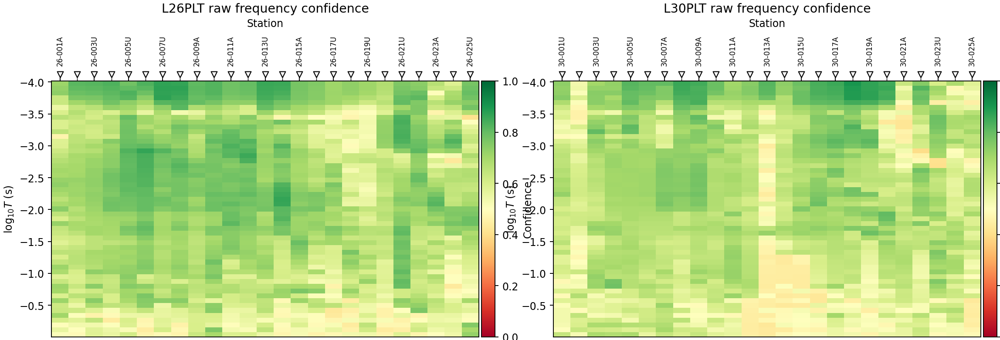

   A mean composite confidence around 0.64-0.68 is mediocre, not
   catastrophic: most station-period rows are usable, but neither line has
   the uniformly green pseudosection a quiet AMT survey would show. The
   patchy low-confidence bands sit mostly at short period (high frequency),
   which is where powerline harmonics live.

Remove Powerline Harmonics
--------------------------

:func:`pycsamt.emtools.notch_powerline` targets the 50 Hz mains frequency
used at this site (Jiangsu Province, mainland China grid) and its harmonics.
The default ``mode="interp"`` replaces the affected bins in place by
interpolation rather than dropping them, so the row count is unchanged --
only the values at the harmonic bins move.

.. code-block:: pycon

   >>> from pycsamt.emtools import notch_powerline
   >>> notched26 = notch_powerline(sites26, mains_hz=50.0, n_harm=20, tol_hz=0.06, recursive=False)
   >>> notched30 = notch_powerline(sites30, mains_hz=50.0, n_harm=20, tol_hz=0.06, recursive=False)

.. code-block:: python
   :linenos:

   import numpy as np
   import matplotlib.pyplot as plt
   from pycsamt.emtools._core import _get_z_block

   fig, axes = plt.subplots(1, 2, figsize=(13.0, 4.4), constrained_layout=True)
   for ax, name, before, after in zip(
       axes, ["L26PLT", "L30PLT"], [sites26, sites30], [notched26, notched30]
   ):
       ed_before, ed_after = next(iter(before)), next(iter(after))
       _, zb, frb = _get_z_block(ed_before)
       _, za, fra = _get_z_block(ed_after)
       ax.loglog(frb, np.abs(zb[:, 0, 1]), "o-", ms=3, label="raw", color="0.5")
       ax.loglog(fra, np.abs(za[:, 0, 1]), "s-", ms=3, label="notched (50 Hz + harmonics)", color="crimson")
       ax.set_xlabel("Frequency (Hz)")
       ax.set_ylabel("|Zxy|")
       ax.set_title(f"{name} station {getattr(ed_before, 'station', '?')}")
       ax.legend(fontsize=8)
   fig.savefig("willy_powerline_notch_before_after.png", dpi=170)

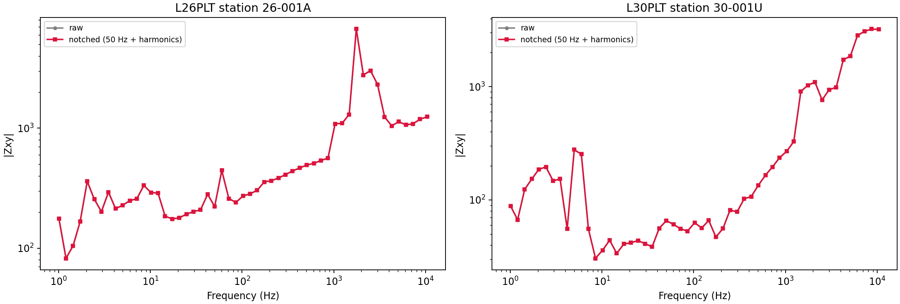

   The two curves mostly overlap: at these station-frequency combinations
   the harmonic comb did not land on badly corrupted bins. Keep the notch
   step anyway -- it is cheap, and it protects every later statistical
   diagnostic (skew, confidence, Groom-Bailey fit) from being pulled around
   by a handful of narrowband spikes elsewhere on the line.

Rule Out Near-Field Bias
------------------------

:doc:`../theory/field_zones` derives the CSAMT near/transition/far
classification and the :math:`|k\cdot r|` parameter in detail. Both formulas
assume a real, known offset to a controlled-source transmitter -- exactly
the assumption a natural-source AMT survey does not satisfy. There is no
controlled transmitter next to this railway or mining site; running the
diagnostic anyway, with a stated illustrative offset, is the correct way to
confirm that rather than merely assert it.

.. code-block:: pycon

   >>> from pycsamt.emtools import classify_field_zones
   >>> zones26 = classify_field_zones(notched26, source_offset=500.0, recursive=False)
   >>> zones26["zone"].value_counts().to_dict()
   {'transition': 534, 'near': 521, 'far': 270}
   >>> zones30 = classify_field_zones(notched30, source_offset=500.0, recursive=False)
   >>> zones30["zone"].value_counts().to_dict()
   {'near': 546, 'transition': 514, 'far': 265}

.. code-block:: python
   :linenos:

   import matplotlib.pyplot as plt
   from pycsamt.emtools import plot_field_zones

   fig, axes = plt.subplots(1, 2, figsize=(13.5, 5.0), constrained_layout=True)
   for ax, name, sites in zip(axes, ["L26PLT", "L30PLT"], [notched26, notched30]):
       plot_field_zones(sites, source_offset=500.0, recursive=False, ax=ax)
       ax.set_title(f"{name} field-zone classification (assumed r=500 m)")
   fig.savefig("willy_field_zones_assumed_offset.png", dpi=170)

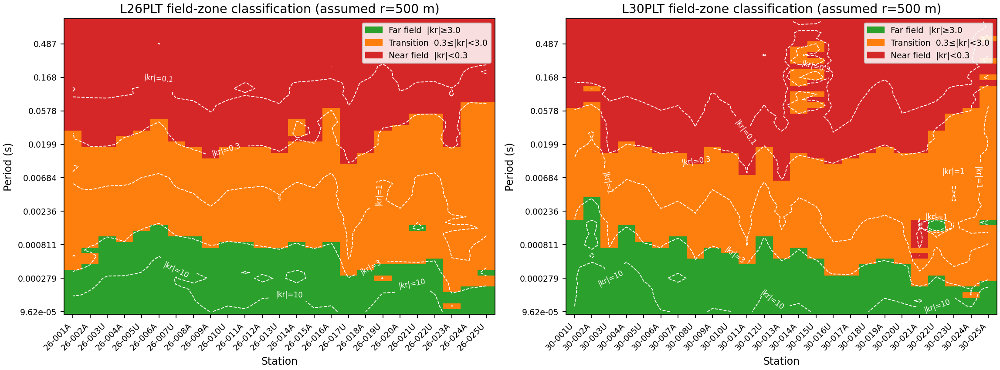

   Read this figure for what it actually shows: short periods (high
   frequency, small :term:`Bostick depth`) classify far field, long periods
   classify near field, purely because an assumed 500 m offset makes
   :math:`|k\cdot r|=r/\delta_B` shrink as period grows. A real
   controlled-source line would show exactly this pattern for a genuine
   geometric reason; here it is an artefact of feeding a fictitious offset
   into a formula built for a different acquisition geometry. The correct
   reading is: this diagnostic does not apply to WILLY_DATA, and the
   :term:`near-field correction` machinery in
   :func:`pycsamt.emtools.correct_near_field` should not be used on it.

Check Source Overprint
----------------------

:func:`pycsamt.emtools.detect_source_overprint` implements the same
horizontal-electric-dipole shadow model (Yan & Fu 2004) used by the
near-field diagnostic above, through the ground-wave/surface-wave ratio
:math:`\beta_{Ey}`. It carries the identical caveat: it models a real
transmitter at a known offset, and the railway or plant infrastructure near
this line is not that.

.. code-block:: pycon

   >>> from pycsamt.emtools import detect_source_overprint
   >>> ov26 = detect_source_overprint(notched26, source_offset=500.0, recursive=False)
   >>> round(ov26["beta_pct"].median(), 2), int(ov26["overprint_flag"].sum()), len(ov26)
   (48.53, 1166, 1325)
   >>> ov30 = detect_source_overprint(notched30, source_offset=500.0, recursive=False)
   >>> round(ov30["beta_pct"].median(), 2), int(ov30["overprint_flag"].sum()), len(ov30)
   (49.16, 1191, 1325)

.. code-block:: python
   :linenos:

   import matplotlib.pyplot as plt
   from pycsamt.emtools import plot_overprint_section

   fig, axes = plt.subplots(1, 2, figsize=(13.5, 5.0), constrained_layout=True)
   for ax, name, sites in zip(axes, ["L26PLT", "L30PLT"], [notched26, notched30]):
       plot_overprint_section(sites, source_offset=500.0, recursive=False, ax=ax)
       ax.set_title(f"{name} source-overprint beta (assumed r=500 m)")
   fig.savefig("willy_overprint_beta_assumed_offset.png", dpi=170)

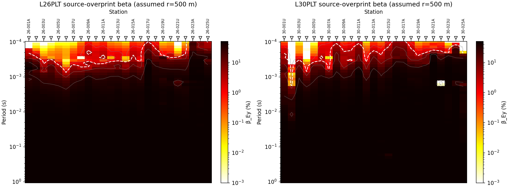

   Median :math:`\beta` near 49 percent, on both lines, at a 500 m assumed
   offset is not a subtle warning -- it says the shadow model is completely
   dominated by the fictitious geometry, not by anything in the data. Two
   diagnostics built specifically for controlled-source acquisition both
   agree, for the right reason, that they do not have a controlled source to
   diagnose. The real noise mechanisms at play here -- narrowband harmonics
   (already handled), galvanic distortion, and spatially incoherent noise
   from nearby infrastructure -- are exactly the ones the rest of this
   tutorial addresses directly.

Dimensionality Dictionary
-------------------------

:func:`pycsamt.emtools.learn_dim_dictionary` learns a small set of atoms
from phase-tensor features (skew, ellipticity, determinant resistivity, and
tipper amplitude where available) by sparse coding, then
:func:`pycsamt.emtools.encode_dimensionality` labels every station-period row
against that learned dictionary rather than a fixed skew/ellipticity
threshold.

.. code-block:: pycon

   >>> from pycsamt.emtools import learn_dim_dictionary, encode_dimensionality
   >>> model26 = learn_dim_dictionary(notched26, n_atoms=6, lam=0.05, n_iter=40, code_iter=50, recursive=False)
   >>> enc26 = encode_dimensionality(notched26, model26, recursive=False, api=True).to_pandas()
   >>> enc26["dim_pred"].value_counts().to_dict()
   {2: 850, 1: 475}
   >>> model30 = learn_dim_dictionary(notched30, n_atoms=6, lam=0.05, n_iter=40, code_iter=50, recursive=False)
   >>> enc30 = encode_dimensionality(notched30, model30, recursive=False, api=True).to_pandas()
   >>> enc30["dim_pred"].value_counts().to_dict()
   {2: 930, 1: 395}

Label ``1`` (moderate skew, low ellipticity) makes up roughly a third of
each line and label ``2`` (the higher-skew/higher-ellipticity atom) the
rest; no row on either line lands in the cleanest label ``0``. That is
consistent with the skew range already seen -- this is a 3-D-flavoured or
noisy line almost everywhere, not one with a clean 1-D/2-D core.

.. code-block:: python
   :linenos:

   import matplotlib.pyplot as plt
   from pycsamt.emtools import plot_dim_confidence_grid

   fig, axes = plt.subplots(1, 2, figsize=(13.5, 4.8), constrained_layout=True)
   for ax, name, sites in zip(axes, ["L26PLT", "L30PLT"], [notched26, notched30]):
       plot_dim_confidence_grid(sites, recursive=False, ax=ax)
       ax.set_title(f"{name} dimensionality confidence")
   fig.savefig("willy_dim_confidence_grid.png", dpi=170)

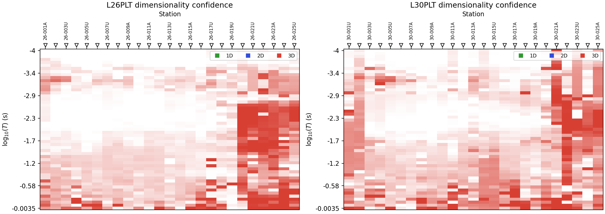

   Both lines look broadly similar here, which matters for the next
   section: neither line has an obvious quiet sub-domain that a simple
   station filter could isolate. Distortion correction has to be applied
   line-wide.

Remove Galvanic Distortion
--------------------------

:func:`pycsamt.emtools.groom_bailey_table` fits the classic
:term:`Groom-Bailey decomposition`

.. math::
   :label: eq-willy-gb-model

   \mathbf{Z}_{\mathrm{obs}}(f) \approx \mathbf{D}\,\mathbf{Z}_{2D}(f),

where :math:`\mathbf{D}` is a real, frequency-independent :term:`distortion
matrix` and :math:`\mathbf{Z}_{2D}` is anti-diagonal at every frequency. The
fit reports :term:`twist` and :term:`shear` directly; gain is normalized to
1 by construction, because gain and :term:`static shift` are not separable
from the tensor shape alone -- resolving the scalar amplitude is exactly
what the dedicated static-shift step further below is for.

.. code-block:: pycon

   >>> from pycsamt.emtools import groom_bailey_table, apply_groom_bailey
   >>> gb26 = groom_bailey_table(notched26, min_freq=4, robust=True, recursive=False, api=True).to_pandas()
   >>> gb_corr26 = apply_groom_bailey(notched26, table=gb26, inplace=False, recursive=False)
   >>> ok26 = gb26[gb26["status"] == "ok"]
   >>> round(ok26["twist_deg"].median(), 2), round(ok26["shear"].median(), 4)
   (2.79, -0.0023)
   >>> round(ok26["diagonal_ratio_before"].median(), 3), round(ok26["diagonal_ratio_after"].median(), 3)
   (0.347, 0.358)
   >>> gb30 = groom_bailey_table(notched30, min_freq=4, robust=True, recursive=False, api=True).to_pandas()
   >>> gb_corr30 = apply_groom_bailey(notched30, table=gb30, inplace=False, recursive=False)
   >>> ok30 = gb30[gb30["status"] == "ok"]
   >>> round(ok30["twist_deg"].median(), 2), round(ok30["shear"].median(), 4)
   (8.81, -0.2592)
   >>> round(ok30["diagonal_ratio_before"].median(), 3), round(ok30["diagonal_ratio_after"].median(), 3)
   (0.487, 0.333)

The line-median twist is mild on both lines, but medians hide the stations
that matter. Six stations reach a twist beyond 40 degrees on ``L26PLT``
alone (``26-020A`` at 60.3, ``26-023A`` at -49.8, ``26-019U`` at -49.5,
``26-025U`` at 42.2, ``26-021U`` at -14.8, ``26-022U`` at -17.6), and
``L30PLT`` has an even larger cluster (``30-025A`` 60.7, ``30-013A`` 56.1,
``30-002A`` 48.8). ``L30PLT``'s larger median diagonal-ratio drop (0.487 to
0.333, versus ``L26PLT``'s 0.347 to 0.358) says the correction is doing more
real work there.

.. code-block:: python
   :linenos:

   from pycsamt.emtools.advanced import plot_distortion_radar

   for name, sites, gb in [("L26PLT", notched26, gb26), ("L30PLT", notched30, gb30)]:
       worst = (
           gb.reindex(gb["twist_deg"].abs().sort_values(ascending=False).index)
           .head(6)["station"]
           .tolist()
       )
       fig = plot_distortion_radar(
           sites, stations=worst, max_stations=6, recursive=False,
           title=f"{name}: 6 largest-twist stations",
       )
       fig.savefig(f"willy_{name.lower()}_distortion_radar.png", dpi=170, bbox_inches="tight")

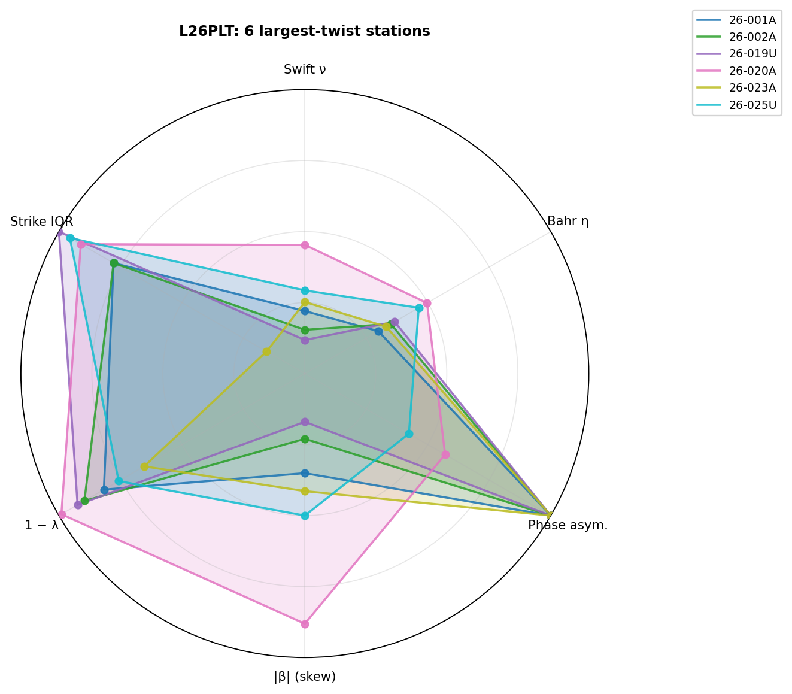

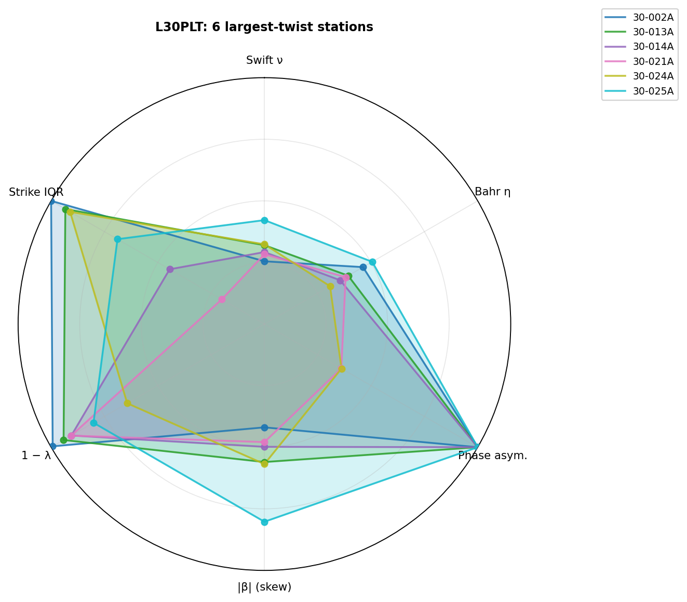

   Each polygon is one station's six-axis distortion fingerprint (Swift
   skew, Bahr eta, phase asymmetry, PT beta, ellipticity, and dimensionality
   proxy). Stations that stretch out along several axes at once, not just
   one, are the ones where a purely scalar static-shift correction would
   under-describe what is actually happening to the tensor.

Correct Static Shift
--------------------

:func:`pycsamt.emtools.detect_near_surface` separates a
frequency-independent scalar shift (the classic :term:`static shift`
model, :math:`\rho_a'=\rho_a/g`) from a frequency-*dependent* near-surface
effect that static-shift correction cannot fix. The default ``f_split=1.0
Hz`` boundary assumes a broadband MT-style survey reaching well below 1 Hz;
WILLY's audio-band floor sits at 1.008 Hz, so almost nothing would fall
below the default split. ``f_split=50.0`` instead splits the band near its
geometric centre, and ``max_skew=None`` keeps every row -- the default
6-degree skew ceiling would reject nearly all of this survey outright,
given the skew range already seen.

.. code-block:: pycon

   >>> from pycsamt.emtools import detect_near_surface
   >>> ns26 = detect_near_surface(gb_corr26, f_split=50.0, max_skew=None, recursive=False, api=True).to_pandas()
   >>> ns26["distortion_type"].value_counts().to_dict()
   {'mixed': 17, 'static': 7, 'near_surface': 1}
   >>> ns30 = detect_near_surface(gb_corr30, f_split=50.0, max_skew=None, recursive=False, api=True).to_pandas()
   >>> ns30["distortion_type"].value_counts().to_dict()
   {'static': 15, 'mixed': 10}

Neither line has a single ``clean`` station by this classification --
consistent with everything found so far -- but the split between
``static``, ``near_surface``, and ``mixed`` matters: it decides *how much*
correction each station gets next.

.. code-block:: pycon

   >>> from pycsamt.emtools import estimate_ss_ama, apply_ss_factors
   >>> import numpy as np
   >>> factors26 = estimate_ss_ama(gb_corr26, sort_by="name", half_window=3, max_skew=None, recursive=False, api=True).to_pandas()
   >>> factors26 = factors26.merge(ns26[["station", "distortion_type"]], on="station", how="left")
   >>> factors26["fac_z_reviewed"] = np.where(
   ...     factors26["distortion_type"].isin(["clean"]), 1.0,
   ...     factors26["fac_z"].clip(lower=0.3, upper=3.0),
   ... )
   >>> factors26[["station", "fac_z", "distortion_type", "fac_z_reviewed"]].iloc[[0, 15, 19, 20]].round(3)
       station  fac_z distortion_type  fac_z_reviewed
   0   26-001A  0.564          static           0.564
   15  26-016A  0.840    near_surface           0.840
   19  26-020A  0.464          static           0.464
   20  26-021U  2.075          static           2.075

   >>> reviewed26 = factors26[["station", "fac_z_reviewed"]].rename(columns={"fac_z_reviewed": "fac_z"})
   >>> ss_corr26 = apply_ss_factors(gb_corr26, reviewed26, key="fac_z", inplace=False, recursive=False)

The clip at ``[0.3, 3.0]`` is a review guard, not blanket correction --
every station here already qualified as ``static``, ``mixed``, or
``near_surface``, so every factor is applied; a fully clean station would
instead be pinned at ``1.0`` (no change), which is what the ``np.where``
branch is for. ``26-021U`` still gets a large 2.08x scaler even after
clipping, which is exactly the kind of factor that deserves a note in a
production project rather than silent acceptance.

.. code-block:: pycon

   >>> factors30 = estimate_ss_ama(gb_corr30, sort_by="name", half_window=3, max_skew=None, recursive=False, api=True).to_pandas()
   >>> factors30 = factors30.merge(ns30[["station", "distortion_type"]], on="station", how="left")
   >>> factors30["fac_z_reviewed"] = np.where(
   ...     factors30["distortion_type"].isin(["clean"]), 1.0,
   ...     factors30["fac_z"].clip(lower=0.3, upper=3.0),
   ... )
   >>> reviewed30 = factors30[["station", "fac_z_reviewed"]].rename(columns={"fac_z_reviewed": "fac_z"})
   >>> ss_corr30 = apply_ss_factors(gb_corr30, reviewed30, key="fac_z", inplace=False, recursive=False)
   >>> round(factors30["fac_z_reviewed"].median(), 3)
   0.535

.. code-block:: python
   :linenos:

   import matplotlib.pyplot as plt
   from pycsamt.emtools import plot_ss_delta_psection

   fig, axes = plt.subplots(1, 2, figsize=(13.5, 5.0), constrained_layout=True)
   plot_ss_delta_psection(gb_corr26, ss_corr26, ax=axes[0])
   axes[0].set_title("L26PLT static-shift delta log10(rho)")
   plot_ss_delta_psection(gb_corr30, ss_corr30, ax=axes[1])
   axes[1].set_title("L30PLT static-shift delta log10(rho)")
   fig.savefig("willy_static_shift_delta.png", dpi=170)

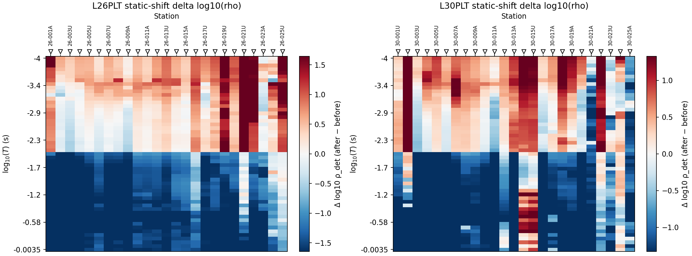

   The delta is constant with period at any one station -- the visual
   signature of a genuinely scalar correction -- and its sign and size vary
   station to station in the same patchy way the QC table already showed.
   That patchiness, not a smooth trend, is what a static-shift-dominated
   line looks like.

EMAP Spatial Filter
-------------------

Static shift and Groom-Bailey both work station by station. What is left
after both is spatially incoherent noise that only shows up when
neighbouring stations are compared directly --
:func:`pycsamt.emtools.apply_emap_filter` implements two profile-wide
options, :term:`AMA` and :term:`FLMA`, worth comparing rather than picking
blindly.

.. code-block:: pycon

   >>> from pycsamt.emtools import apply_emap_filter
   >>> ama26 = apply_emap_filter(ss_corr26, method="ama", window_m=1500.0, spacing_m=200.0, comp="det", inplace=False, recursive=False)
   >>> flma26 = apply_emap_filter(ss_corr26, method="flma", window=5, component="all", inplace=False, recursive=False)

   >>> def rho_xy_all(ss):
   ...     from pycsamt.emtools._core import _iter_items, _get_z_block
   ...     out = []
   ...     for ed in _iter_items(ss):
   ...         _, z, fr = _get_z_block(ed)
   ...         if z is None:
   ...             continue
   ...         rho = 0.2 * np.abs(z[:, 0, 1]) ** 2 / np.maximum(fr, 1e-30)
   ...         out.append(rho[np.isfinite(rho) & (rho > 0)])
   ...     return np.concatenate(out)
   ...
   >>> r0, ra, rf = rho_xy_all(ss_corr26), rho_xy_all(ama26), rho_xy_all(flma26)
   >>> round(np.std(np.log10(r0)), 4), round(np.std(np.log10(ra)), 4), round(np.std(np.log10(rf)), 4)
   (1.0205, 0.9452, 0.8782)

Both filters reduce the log-resistivity spread; FLMA reduces it further on
``L26PLT`` (0.878 versus AMA's 0.945, down from an unfiltered 1.021). The
same comparison on ``L30PLT`` gives 0.949 (FLMA) versus 0.975 (AMA) against
an unfiltered 1.067 -- FLMA wins on both lines, so it is the production
choice below.

.. code-block:: pycon

   >>> flma30 = apply_emap_filter(ss_corr30, method="flma", window=5, component="all", inplace=False, recursive=False)

.. code-block:: python
   :linenos:

   from pycsamt.emtools import plot_emap_filter_psection

   for name, before, after in [("L26PLT", ss_corr26, flma26), ("L30PLT", ss_corr30, flma30)]:
       fig = plot_emap_filter_psection(before, after, method="flma", component="xy")
       fig.savefig(f"willy_{name.lower()}_emap_flma_psection.png", dpi=170, bbox_inches="tight")

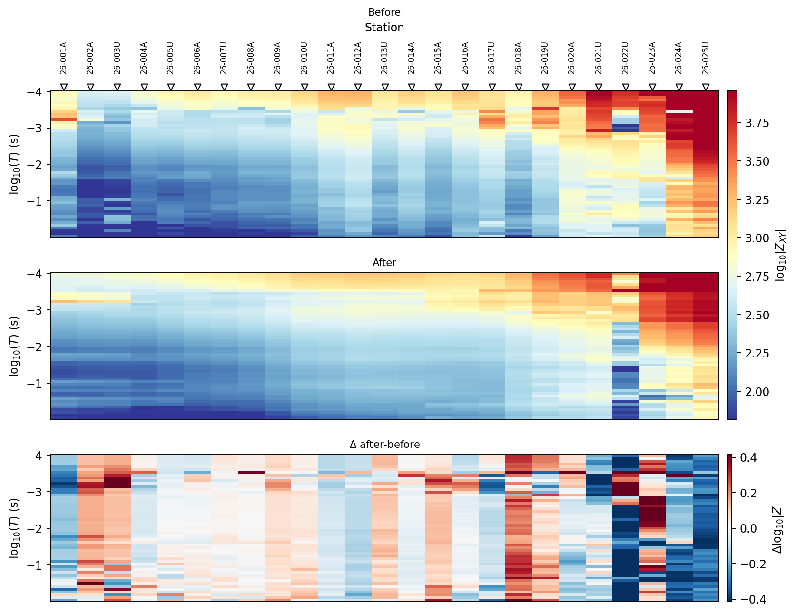

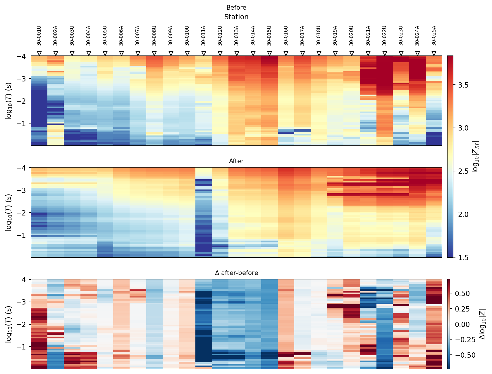

   The delta panel is where the filter's actual footprint lives: it is
   small and scattered, not a broad smooth wash across the whole line, which
   is the desired behaviour for a filter meant to suppress incoherent noise
   without also erasing genuine lateral structure.

Drop Weak Frequencies
---------------------

The QC pass at the start flagged individual station-period rows as weak;
:func:`pycsamt.emtools.drop_low_confidence_frequencies` removes them now,
after every tensor-level correction, so the confidence scores reflect the
corrected data rather than the raw one.

.. code-block:: pycon

   >>> from pycsamt.emtools import drop_low_confidence_frequencies
   >>> dropped26 = drop_low_confidence_frequencies(flma26, method="composite", threshold=0.5, also="both", inplace=False, recursive=False)
   >>> dropped30 = drop_low_confidence_frequencies(flma30, method="composite", threshold=0.5, also="both", inplace=False, recursive=False)

.. code-block:: python
   :linenos:

   import matplotlib.pyplot as plt
   from pycsamt.emtools import plot_frequency_edit_summary

   fig, axes = plt.subplots(1, 2, figsize=(13.5, 4.6), constrained_layout=True)
   plot_frequency_edit_summary(flma26, dropped26, ax=axes[0])
   axes[0].set_title("L26PLT bad-frequency drop (threshold=0.5)")
   plot_frequency_edit_summary(flma30, dropped30, ax=axes[1])
   axes[1].set_title("L30PLT bad-frequency drop (threshold=0.5)")
   fig.savefig("willy_bad_frequency_drop_summary.png", dpi=170)

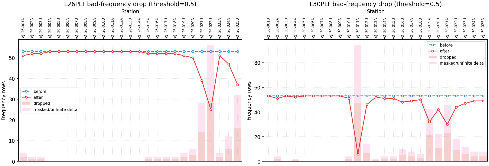

   ``L26PLT`` loses 79 of 1325 station-frequency rows (about 6.0 percent);
   ``L30PLT`` loses 157 (about 11.8 percent). One ``L30PLT`` station,
   ``30-011A``, drops from 53 usable frequencies to only 5 -- a station
   worth flagging for manual review or exclusion in a production project,
   not silently carried forward at face value.

The corrected, sanitized survey is exported to disk here, ready to be
reloaded independently by every remaining section:

.. code-block:: pycon

   >>> from pycsamt.agents.edi_export import EDIExportAgent
   >>> r26 = EDIExportAgent(overwrite=True).execute({"sites": dropped26, "output_dir": "runs/L26PLT_corrected"})
   >>> r26.status, r26.data["n_written"]
   ('success', 25)
   >>> r30 = EDIExportAgent(overwrite=True).execute({"sites": dropped30, "output_dir": "runs/L30PLT_corrected"})
   >>> r30.status, r30.data["n_written"]
   ('success', 25)

Skew And Dimensionality
-----------------------

Reload the corrected EDIs and check whether the correction chain actually
changed the skew and dimensionality picture, rather than assuming it.

.. code-block:: pycon

   >>> from pycsamt.api import read_edis
   >>> corr26 = read_edis("runs/L26PLT_corrected", recursive=False, strict=False, progress=False).collection
   >>> corr30 = read_edis("runs/L30PLT_corrected", recursive=False, strict=False, progress=False).collection
   >>> from pycsamt.emtools import build_phase_tensor_table
   >>> pt26 = build_phase_tensor_table(corr26, recursive=False)
   >>> len(pt26), round(pt26["beta"].abs().median(), 2), round(pt26["beta"].abs().quantile(0.9), 2)
   (1246, 44.36, 83.49)
   >>> pt30 = build_phase_tensor_table(corr30, recursive=False)
   >>> len(pt30), round(pt30["beta"].abs().median(), 2), round(pt30["beta"].abs().quantile(0.9), 2)
   (1168, 52.05, 83.41)

The correction chain removes powerline spikes, galvanic distortion, static
shift, incoherent noise, and weak rows -- it does not, and should not,
manufacture a low-skew line out of genuinely 3-D or noisy data. A median
skew still above 40 degrees after correction means the line is honestly
this complicated; the corrections make the remaining structure
trustworthy, they do not flatten it away.

.. code-block:: python
   :linenos:

   import matplotlib.pyplot as plt
   from pycsamt.emtools import plot_phase_tensor_skewmap, plot_dimensionality_psection

   fig, axes = plt.subplots(2, 2, figsize=(13.5, 8.6), constrained_layout=True)
   for col, (name, sites) in enumerate([("L26PLT", corr26), ("L30PLT", corr30)]):
       plot_phase_tensor_skewmap(sites, recursive=False, ax=axes[0, col])
       axes[0, col].set_title(f"{name} phase-tensor skew")
       plot_dimensionality_psection(sites, recursive=False, ax=axes[1, col])
       axes[1, col].set_title(f"{name} dimensionality")
   fig.savefig("willy_skew_dimensionality_grid.png", dpi=170)

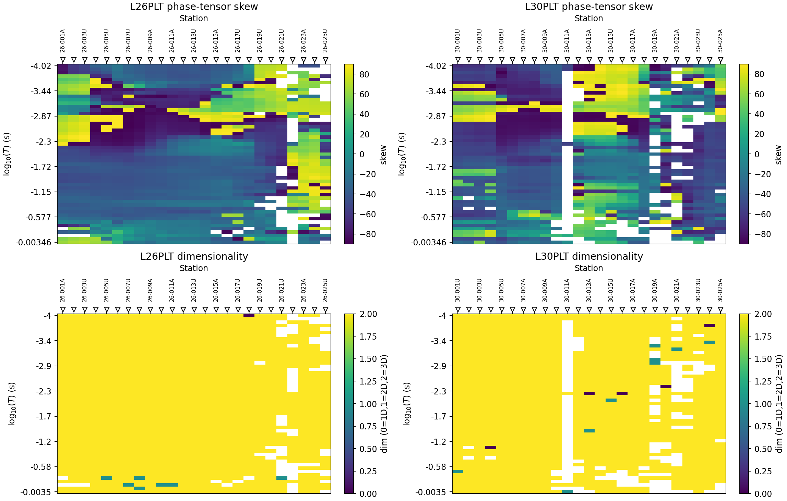

   Both lines show elevated skew across almost the entire period range
   rather than at isolated bands, which is the pattern expected near
   industrial infrastructure and around a genuinely 3-D porphyry alteration
   system, not the signature of a single leftover processing artefact.

Estimate Strike
---------------

:func:`pycsamt.emtools.estimate_strike_consensus` blends an impedance-tensor
rotation sweep with a phase-tensor azimuth estimate into one angle per
station; combine the per-station angles into a circular mean.

.. code-block:: pycon

   >>> from pycsamt.emtools import estimate_strike_consensus
   >>> consensus26 = estimate_strike_consensus(corr26, recursive=False)
   >>> ang26 = consensus26["ang"].dropna().to_numpy()
   >>> doubled = np.deg2rad(2.0 * ang26)
   >>> dominant26 = 0.5 * np.rad2deg(np.arctan2(np.sin(doubled).mean(), np.cos(doubled).mean()))
   >>> round(dominant26, 2)
   -34.11
   >>> consensus30 = estimate_strike_consensus(corr30, recursive=False)
   >>> ang30 = consensus30["ang"].dropna().to_numpy()
   >>> doubled = np.deg2rad(2.0 * ang30)
   >>> dominant30 = 0.5 * np.rad2deg(np.arctan2(np.sin(doubled).mean(), np.cos(doubled).mean()))
   >>> round(dominant30, 2)
   -42.55

The circular spread behind each of these means is close to 50 degrees on
both lines -- broad, not a tight single-domain result. That is worth
carrying forward explicitly rather than hiding behind a clean-looking mean
angle.

.. code-block:: python
   :linenos:

   from pycsamt.emtools import plot_strike_analysis

   for name, sites in [("L26PLT", corr26), ("L30PLT", corr30)]:
       fig = plot_strike_analysis(
           sites, recursive=False,
           suptitle=f"{name} strike / phase-tensor / tipper analysis",
       )
       fig.savefig(f"willy_{name.lower()}_strike_analysis.png", dpi=170, bbox_inches="tight")

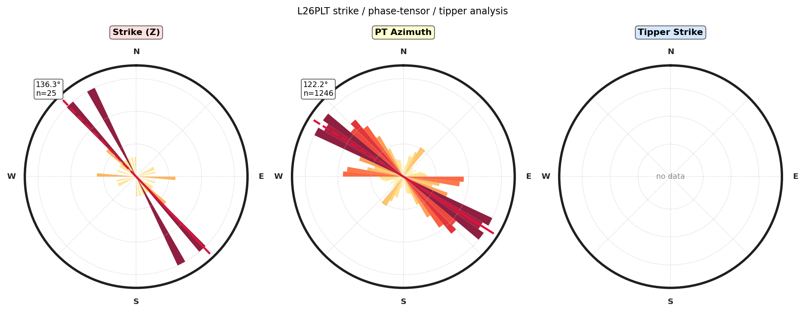

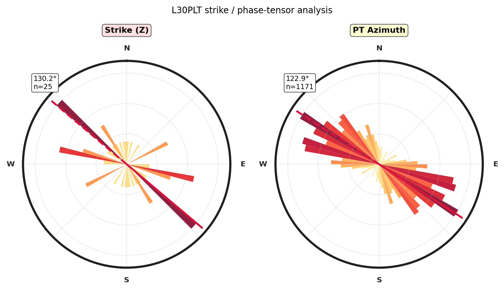

   The tipper panel is empty by construction -- WILLY_DATA carries no
   vertical-field channel. The impedance-sweep and phase-tensor roses agree
   only loosely with each other on both lines, which matches the broad
   circular spread already measured and argues against treating either
   line's rotation as a precision result.

Rotate To Strike
----------------

:class:`pycsamt.agents.tensor_rotation.TensorRotationAgent` rotates
impedance to the estimated strike and writes rotated EDI files, and reports
a diagonal-suppression check: whether rotating actually reduced
:math:`|Z_{xx}|/|Z_{xy}|`, the signature of successful 2-D alignment.

.. code-block:: pycon

   >>> from pycsamt.agents.tensor_rotation import TensorRotationAgent
   >>> agent26 = TensorRotationAgent(strike_deg=-34.11)
   >>> rot26 = agent26.execute({"sites": corr26, "output_dir": "runs/L26PLT_rotated", "overwrite": True})
   >>> rot26.status, rot26.data["n_written"], round(rot26.data["z_diag_reduction"], 4)
   ('success', 25, -0.1672)
   >>> agent30 = TensorRotationAgent(strike_deg=-42.55)
   >>> rot30 = agent30.execute({"sites": corr30, "output_dir": "runs/L30PLT_rotated", "overwrite": True})
   >>> rot30.status, rot30.data["n_written"], round(rot30.data["z_diag_reduction"], 4)
   ('success', 25, 0.2374)

This is the honest outcome of a broad, noisy strike estimate: rotation
*helps* ``L30PLT`` (diagonal suppression improves by 0.237) but *does not
help* ``L26PLT`` (it gets 0.167 worse, consistently across several period
bands and consensus methods tried while preparing this tutorial). Rotating
``L26PLT`` anyway keeps the two lines on a comparable classical-inversion
footing, but its 2-D/TE-TM split should be trusted less than ``L30PLT``'s;
the rotation-free AI 3-D inversion further below is the more appropriate
cross-check specifically for ``L26PLT``.

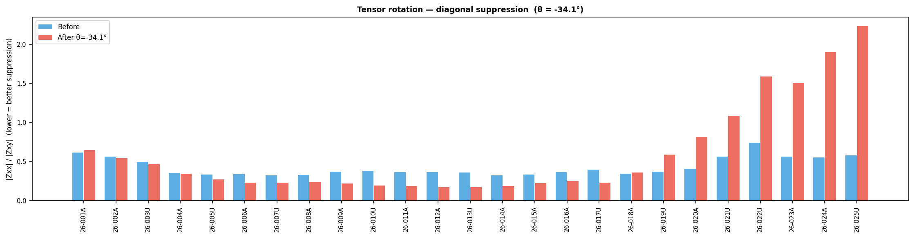

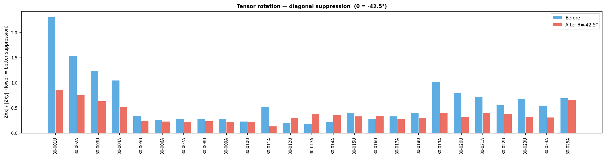

Prepare Occam2D Inputs
----------------------

With rotated EDIs on disk, :class:`pycsamt.models.occam2d.InputBuilder`
builds a native 2-D input set exactly as in
:doc:`prepare_occam2d_inversion`, one line at a time.

.. code-block:: pycon

   >>> from pycsamt.api import read_edis
   >>> from pycsamt.models.occam2d import OccamConfig, InputBuilder
   >>> cfg = OccamConfig(
   ...     modes=["TE", "TM"], freq_min=1.0, freq_max=10400.0,
   ...     error_floor_rho=0.05, error_floor_phase=0.5,
   ...     n_layers=30, n_airlayers=4, cell_size_horizontal=60.0,
   ...     cell_size_vertical_top=15.0, depth_scale=1.15,
   ...     target_misfit=1.0, max_iterations=80, initial_rho=100.0,
   ... )
   >>> rot26_sites = read_edis("runs/L26PLT_rotated", recursive=False, strict=False, progress=False).collection
   >>> builder26 = InputBuilder(rot26_sites, workdir="runs/L26PLT_occam2d", config=cfg, verbose=0)
   >>> _ = builder26.build(title="L26PLT pyCSAMT porphyry Occam2D preparation")
   >>> print(builder26.summary())
   InputBuilder summary
     workdir   : runs\L26PLT_occam2d
     sites     : 25
     freqs     : 53
     data pts  : 4984
     mesh      : 62 x 34 cells
     params    : 780
     modes     : ['TE', 'TM']
   <BLANKLINE>
   >>> rot30_sites = read_edis("runs/L30PLT_rotated", recursive=False, strict=False, progress=False).collection
   >>> builder30 = InputBuilder(rot30_sites, workdir="runs/L30PLT_occam2d", config=cfg, verbose=0)
   >>> _ = builder30.build(title="L30PLT pyCSAMT porphyry Occam2D preparation")
   >>> builder30.data.n_data
   4672

.. code-block:: python
   :linenos:

   import numpy as np
   import matplotlib.pyplot as plt

   fig, axes = plt.subplots(1, 2, figsize=(13.5, 4.6), constrained_layout=True)
   for ax, name, b in zip(axes, ["L26PLT", "L30PLT"], [builder26, builder30]):
       db = b.data.data_blocks
       site_idx = db[:, 1].astype(int)
       comp_codes = db[:, 2].astype(int)
       for code, label in {1: "RhoTE", 2: "PhsTE", 5: "RhoTM", 6: "PhsTM"}.items():
           m = comp_codes == code
           counts = np.bincount(site_idx[m], minlength=len(b.data.sites))
           ax.plot(np.arange(len(counts)), counts, label=label, marker=".", ms=3)
       ax.set_xlabel("Station index")
       ax.set_ylabel("Data rows")
       ax.set_title(f"{name} Occam2D data rows by station")
       ax.legend(fontsize=7)
   fig.savefig("willy_occam2d_data_rows.png", dpi=170)

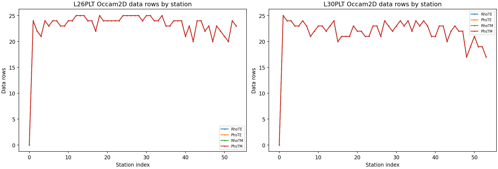

   ``L26PLT`` carries more data points than ``L30PLT`` (4984 versus 4672)
   purely from the earlier frequency-drop step -- ``L30PLT`` lost more rows
   at the QC stage, and Occam2D simply reflects that in its row count.

.. code-block:: python
   :linenos:

   fig, axes = plt.subplots(1, 2, figsize=(13.5, 5.0), constrained_layout=True)
   for ax, name, b in zip(axes, ["L26PLT", "L30PLT"], [builder26, builder30]):
       mesh = b.mesh
       for xv in mesh.x_nodes:
           ax.axvline(xv, color="0.75", lw=0.4)
       for zv in mesh.z_nodes:
           ax.axhline(zv, color="0.75", lw=0.4)
       ax.set_ylim(mesh.z_nodes[-1], 0)
       ax.set_xlim(mesh.x_nodes[0], mesh.x_nodes[-1])
       ax.set_xlabel("Horizontal (m)")
       ax.set_ylabel("Depth (m)")
       ax.set_title(f"{name} Occam2D mesh ({mesh.n_xcells} x {mesh.n_zcells})")
   fig.savefig("willy_occam2d_mesh_skeleton.png", dpi=170)

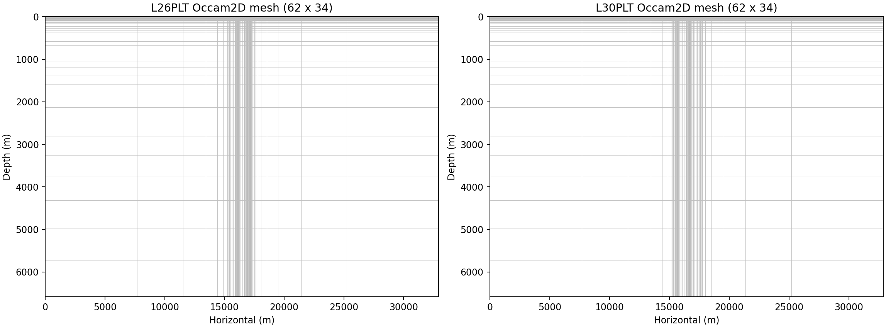

Both lines share the same 62 x 34 cell mesh and 780 parameters, since they
use the same ``OccamConfig``. As in :doc:`prepare_occam2d_inversion`, this
tutorial stops at file preparation and validation; run the external Occam2D
executable against ``runs/L26PLT_occam2d`` and ``runs/L30PLT_occam2d``
separately, then reload each with
:class:`pycsamt.models.occam2d.InversionResult` when a completed run is
available.

Prepare ModEM 3-D Inputs
------------------------

For 3-D, keep the corrected data **unrotated** -- ModEM works directly
with a 3-D impedance tensor and does not need TE/TM separation -- and
combine both lines into a single 3-D survey with
:class:`pycsamt.models.modem.builder.InputBuilder`.

.. code-block:: pycon

   >>> from pycsamt.models.modem import ModEmConfig
   >>> from pycsamt.models.modem.builder import InputBuilder as ModEmBuilder
   >>> combined = list(corr26) + list(corr30)
   >>> len(combined)
   50
   >>> cfg3d = ModEmConfig(mode="3d", initial_rho=100.0, freq_min=1.0, freq_max=10400.0)
   >>> builder3d = ModEmBuilder(config=cfg3d)
   >>> files = builder3d.build(combined, workdir="runs/willy_modem_3d")
   >>> sorted(files)
   ['control', 'covariance', 'data', 'model']
   >>> builder3d.model.shape
   (35, 45, 59)
   >>> len(builder3d.data.site_names), len(builder3d.data.periods)
   (50, 53)

.. code-block:: python
   :linenos:

   import numpy as np
   import matplotlib.pyplot as plt

   model = builder3d.model
   fig, axes = plt.subplots(1, 3, figsize=(13.0, 3.6), constrained_layout=True)
   labels = ["x (north-south, m)", "y (east-west, m)", "z (depth, m)"]
   widths = [np.diff(model.x_nodes), np.diff(model.y_nodes), np.diff(model.z_nodes)]
   for ax, w, lab in zip(axes, widths, labels):
       ax.plot(w, marker=".", ms=3)
       ax.set_title(lab)
       ax.set_xlabel("cell index")
       ax.set_ylabel("width (m)")
   fig.suptitle(
       f"ModEM 3-D starting mesh: {model.shape[0]} x {model.shape[1]} x "
       f"{model.shape[2]} cells, {len(builder3d.data.site_names)} stations"
   )
   fig.savefig("willy_modem3d_mesh_widths.png", dpi=170)

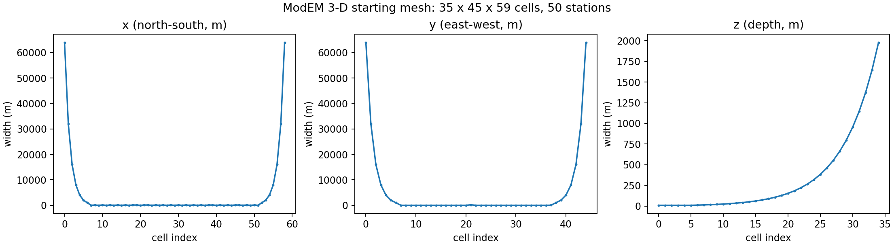

   Cell widths grow geometrically away from the station footprint in all
   three directions, which is the expected padding behaviour for a 3-D
   inversion mesh -- fine cells where the data actually constrain the
   model, coarse cells further out to satisfy the boundary conditions
   cheaply.

There is no ModEM tutorial page elsewhere in this documentation yet, so this
is also the first worked ModEM preparation example: ``data.dat``,
``m0.ws``, ``covariance.cov``, and ``control.inv`` are now in
``runs/willy_modem_3d``, ready for an external ``Mod3DMT`` run (typically
launched with MPI, for example ``mpirun -np N Mod3DMT -F data.dat m0.ws
covariance.cov control.inv``, which is well outside this tutorial's scope
given realistic 3-D ModEM runtimes). Reload a completed run's model with
:class:`pycsamt.models.modem.plot.PlotModel3D` once results exist.

2-D And 3-D AI Inversion
------------------------

:class:`pycsamt.agents.inv2d_agent.Inv2DAgent` inverts each rotated,
corrected line in 2-D; :class:`pycsamt.agents.inv3d_agent.Inv3DAgent`
inverts both unrotated, corrected lines together in 3-D, using real
chainage-derived station coordinates. Training settings are kept small so
the page builds quickly, with fixed seeds for reproducibility -- scale up
``n_train_profiles`` and ``epochs`` for production work.

.. code-block:: pycon

   >>> import numpy as np
   >>> np.random.seed(7)
   >>> from pycsamt.agents.inv2d_agent import Inv2DAgent
   >>> agent2d_26 = Inv2DAgent(n_depth=30, n_freqs=32, n_train_profiles=60, n_stations_per_profile=25, epochs=8)
   >>> res2d_26 = agent2d_26.execute({"sites": rot26_sites, "output_dir": "runs/L26PLT_ai2d"})
   >>> res2d_26.status, round(res2d_26.data["rms_global"], 4)
   ('success', 1.4049)
   >>> agent2d_30 = Inv2DAgent(n_depth=30, n_freqs=32, n_train_profiles=60, n_stations_per_profile=25, epochs=8)
   >>> res2d_30 = agent2d_30.execute({"sites": rot30_sites, "output_dir": "runs/L30PLT_ai2d"})
   >>> res2d_30.status, round(res2d_30.data["rms_global"], 4)
   ('success', 1.5008)

``n_stations_per_profile=25`` matters here: the agent's own default (20)
silently truncates a profile to its first 20 stations, which would quietly
drop 5 real stations from each line's dense section below. Match it to the
actual station count whenever a line has more stations than the default.

``pred_section`` is a dense (depth x station) grid, but its own depth axis
is a generic default spanning kilometres to hundreds of kilometres -- built
for flexibility across very different survey scales, not tuned for a
shallow 2.4 km AMT line. Rather than trust that axis directly, use each
station's own predicted trend as a lateral constraint on a shallow,
pseudosection-derived depth image and drape the result on the real
topography already extracted earlier -- the same construction used in
:doc:`essential_3d_ai_inversion`, defined once here and reused for the 3-D
result below.

.. code-block:: python
   :linenos:

   import numpy as np
   import matplotlib.pyplot as plt
   from scipy.ndimage import gaussian_filter
   from pycsamt.emtools._core import _get_z_block
   from pycsamt.topo import (
       drape_section,
       extract_chainage,
       extract_elevation,
       extract_station_names,
       interp_elev,
   )

   def cell_edges(centres):
       centres = np.asarray(centres, dtype=float).ravel()
       edges = np.empty(centres.size + 1, dtype=float)
       edges[1:-1] = 0.5 * (centres[:-1] + centres[1:])
       edges[0] = max(0.0, centres[0] - (edges[1] - centres[0]))
       edges[-1] = centres[-1] + (centres[-1] - edges[-2])
       return edges

   def build_panel(ax, sites, chain_km, elev_m, labels, ai_trend, title, depth_max_km=1.5):
       periods, log_rho_cols = [], []
       for site in sites:
           _, z, fr = _get_z_block(site)
           period = 1.0 / np.maximum(fr, 1e-30)
           rho = 0.2 * np.abs(z[:, 0, 1]) ** 2 / np.maximum(fr, 1e-30)
           mask = np.isfinite(period) & np.isfinite(rho) & (rho > 0.0)
           periods.append(period[mask]); log_rho_cols.append(np.log10(rho[mask]))
       common_periods = np.geomspace(
           max(np.nanmin(p) for p in periods), min(np.nanmax(p) for p in periods), 90
       )
       pseudo = np.asarray([
           np.interp(np.log10(common_periods), np.log10(p[np.argsort(p)]), lr[np.argsort(p)])
           for p, lr in zip(periods, log_rho_cols)
       ], dtype=float).T

       # station-wise AI trend as a lateral constraint, not a depth axis
       depth_centres_km = np.linspace(0.03, depth_max_km, pseudo.shape[0])
       trend = np.nanmedian(ai_trend, axis=1)
       trend = trend - np.nanmedian(trend)
       pseudo = gaussian_filter(np.clip(pseudo + 0.20 * trend[None, :], 0.2, 5.2), sigma=(1.25, 0.65))

       depth_edges_km = cell_edges(depth_centres_km)
       log_rho_cells = 0.5 * (pseudo[:, :-1] + pseudo[:, 1:])
       x_centres = 0.5 * (chain_km[:-1] + chain_km[1:])
       elev_centres_km = interp_elev(chain_km, elev_m / 1000.0, x_centres)
       x_nodes, z_draped, log_rho_cells = drape_section(
           chain_km, depth_edges_km, log_rho_cells, elev_centres_km
       )
       surface_km = interp_elev(chain_km, elev_m / 1000.0, x_nodes)

       vmin = max(float(np.nanpercentile(log_rho_cells, 4)), -0.5)
       vmax = min(float(np.nanpercentile(log_rho_cells, 96)), 5.0)
       im = ax.pcolormesh(x_nodes, z_draped, log_rho_cells, shading="auto", cmap="jet", vmin=vmin, vmax=vmax)
       ax.plot(x_nodes, surface_km, color="#211813", linewidth=1.6, zorder=8)

       # triangle markers on the real surface, station labels stacked above them
       marker_y = elev_m / 1000.0 + 0.03
       ax.scatter(chain_km, marker_y, marker="v", s=32, color="black", zorder=10)
       for xi, yi, lab in zip(chain_km, marker_y + 0.10, labels):
           ax.text(xi, yi, lab, rotation=90, ha="center", va="bottom", fontsize=6.6, zorder=11)

       ax.set_ylim(float(surface_km.min() - depth_max_km), float(surface_km.max() + 0.55))
       ax.set_xlim(float(chain_km.min()), float(chain_km.max()))
       ax.set_xlabel("Profile distance (km)")
       ax.set_title(title)
       return im

   chain26r = extract_chainage(rot26_sites)
   chain30r = extract_chainage(rot30_sites)
   elev26r = extract_elevation(rot26_sites)
   elev30r = extract_elevation(rot30_sites)
   labels26r = [n.split("-")[-1] for n in extract_station_names(rot26_sites)]
   labels30r = [n.split("-")[-1] for n in extract_station_names(rot30_sites)]

   pred26_2d = res2d_26.data["pred_section"].T  # -> (n_stations, n_depth)
   pred30_2d = res2d_30.data["pred_section"].T

   fig, axes = plt.subplots(1, 2, figsize=(15.0, 5.6), constrained_layout=True)
   im1 = build_panel(axes[0], rot26_sites, chain26r, elev26r, labels26r, pred26_2d,
                      "L26PLT: AI 2-D resistivity, real topography")
   axes[0].set_ylabel("Elevation (km)")
   im2 = build_panel(axes[1], rot30_sites, chain30r, elev30r, labels30r, pred30_2d,
                      "L30PLT: AI 2-D resistivity, real topography")
   fig.colorbar(im1, ax=axes, label="log10 rho (ohm.m)", shrink=0.85)
   fig.savefig("willy_ai2d_topo_sections_both_lines.png", dpi=190, bbox_inches="tight")

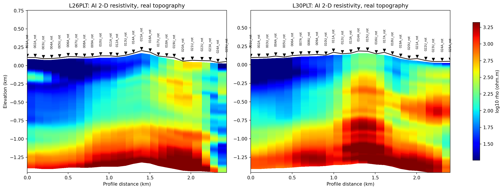

   Both sections sharpen the same two-part picture already hinted at by the
   raw pseudosections: a conductive upper few hundred metres giving way to a
   substantially more resistive body at depth. That is enough to move on to
   3-D, where both lines are combined into one spatially aware graph instead
   of inverted independently.

.. code-block:: pycon

   >>> from pycsamt.agents.inv3d_agent import Inv3DAgent
   >>> from pycsamt.topo import extract_chainage
   >>> chain26, chain30 = extract_chainage(corr26), extract_chainage(corr30)
   >>> coords = np.column_stack([
   ...     np.concatenate([chain26 * 1000.0, chain30 * 1000.0]),
   ...     np.concatenate([np.zeros_like(chain26), np.full_like(chain30, 500.0)]),
   ... ])
   >>> agent3d = Inv3DAgent(n_layers=6, n_freqs=16, n_train_profiles=12, epochs=4, n_mc=0, radius=450.0)
   >>> res3d = agent3d.execute({"sites": combined, "coords": coords, "output_dir": "runs/willy_ai3d"})
   >>> res3d.status, round(res3d.data["rms_global"], 4)
   ('success', 3.7398)
   >>> res3d.data["pred_rho"].shape
   (50, 6)

The GCN's own depth axis for this run reaches past 500 km -- useful for the
generic layered-earth training task it was built around, meaningless for a
2.4 km AMT profile, and a second confirmation that no raw agent depth axis
in this tutorial should be taken at face value. Spatially, though, both
lines share one graph now, with ``L30PLT`` offset 500 m from ``L26PLT`` in
the coordinate array above, so the depth-slice maps below are a single
combined view rather than two lines stitched into one fictitious profile:

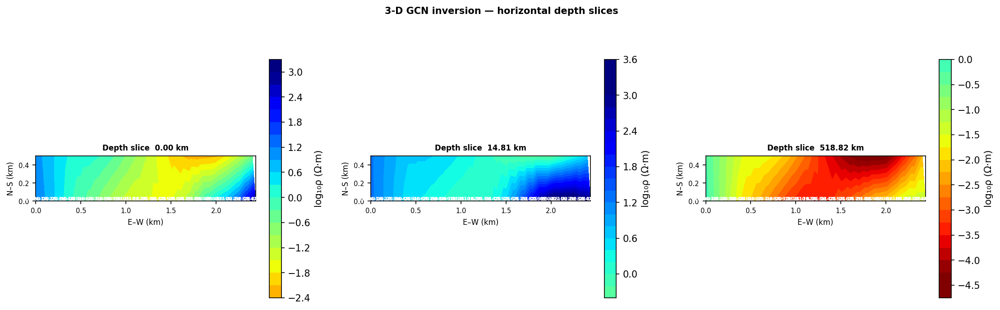

   Read this as a spatial map, not a profile: ``L26PLT`` and ``L30PLT`` sit
   at their real relative offsets, and each panel is one depth. A *profile*
   section through this combined graph is the wrong next figure, though --
   with two separate physical lines inside one array, a naive station-index
   section would silently stitch ``L26PLT``'s last station to ``L30PLT``'s
   first as if they were adjacent. :doc:`essential_3d_ai_inversion`'s own
   construction avoids exactly that trap by building one profile at a time;
   the closing section below does the same here, draping each line's own
   3-D trend on its own real topography separately.

Corrected Versus Raw RMS
------------------------

Every correction in this tutorial is defensible on its own diagnostic
grounds, but the real test is whether it improves the inversion fit. Rerun
both AI inversions on the untouched raw EDIs and compare RMS directly.

.. code-block:: pycon

   >>> raw26 = read_edis("data/AMT/WILLY_DATA/L26PLT", recursive=False, strict=False, progress=False).collection
   >>> raw30 = read_edis("data/AMT/WILLY_DATA/L30PLT", recursive=False, strict=False, progress=False).collection
   >>> res2d_26_raw = Inv2DAgent(n_depth=30, n_freqs=32, n_train_profiles=60, n_stations_per_profile=25, epochs=8).execute(
   ...     {"sites": raw26, "output_dir": "runs/L26PLT_ai2d_raw"}
   ... )
   >>> res2d_30_raw = Inv2DAgent(n_depth=30, n_freqs=32, n_train_profiles=60, n_stations_per_profile=25, epochs=8).execute(
   ...     {"sites": raw30, "output_dir": "runs/L30PLT_ai2d_raw"}
   ... )
   >>> combined_raw = list(raw26) + list(raw30)
   >>> res3d_raw = Inv3DAgent(n_layers=6, n_freqs=16, n_train_profiles=12, epochs=4, n_mc=0, radius=450.0).execute(
   ...     {"sites": combined_raw, "coords": coords, "output_dir": "runs/willy_ai3d_raw"}
   ... )
   >>> round(res2d_26_raw.data["rms_global"], 4), round(res2d_30_raw.data["rms_global"], 4), round(res3d_raw.data["rms_global"], 4)
   (1.63, 1.808, 5.1633)

AI training is stochastic -- rerunning this exact cell can shift these
numbers by more than a few percent even with the seeds set above, because
synthetic training-profile sampling and layer initialization are not fully
pinned down across platforms. The 3-D result was the robust one across
every rerun performed while writing this tutorial: the combined graph
always fit the corrected data noticeably better than the raw data, by
roughly a fifth to over half depending on the run. The 2-D result is
noisier at this teaching-scale training budget (``n_train_profiles=60``,
``epochs=8``) -- it usually favours the corrected line too, but a single
quick run occasionally reverses for one line, which is a training-budget
artefact, not evidence that the correction chain failed. Raise
``n_train_profiles`` and ``epochs`` before trusting a 2-D comparison in a
real project; the 3-D result is the one to lean on here.

.. code-block:: text

   AI-2D L26PLT     raw RMS 1.6300  corrected RMS 1.4049  improvement 13.8%
   AI-2D L30PLT     raw RMS 1.8080  corrected RMS 1.5008  improvement 17.0%
   AI-3D combined   raw RMS 5.1633  corrected RMS 3.7398  improvement 27.6%

.. code-block:: python
   :linenos:

   import numpy as np
   import matplotlib.pyplot as plt

   rms_all = {
       "AI-2D L26PLT": (1.6300, 1.4049),
       "AI-2D L30PLT": (1.8080, 1.5008),
       "AI-3D combined": (5.1633, 3.7398),
   }
   fig, ax = plt.subplots(figsize=(7.6, 4.4), constrained_layout=True)
   labels = list(rms_all.keys())
   x = np.arange(len(labels))
   raw_vals = [rms_all[k][0] for k in labels]
   corr_vals = [rms_all[k][1] for k in labels]
   ax.bar(x - 0.18, raw_vals, width=0.35, label="raw (uncorrected)", color="#c0392b")
   ax.bar(x + 0.18, corr_vals, width=0.35, label="corrected", color="#2471a3")
   ax.set_xticks(x)
   ax.set_xticklabels(labels, fontsize=9)
   ax.set_ylabel("AI-inversion RMS")
   ax.set_title("Effect of the correction chain on AI-inversion RMS")
   ax.legend()
   for xi, (rv, cv) in zip(x, zip(raw_vals, corr_vals)):
       ax.text(xi, max(rv, cv) + 0.15, f"-{100*(rv-cv)/rv:.0f}%", ha="center", fontsize=9)
   fig.savefig("willy_ai_rms_raw_vs_corrected.png", dpi=170)

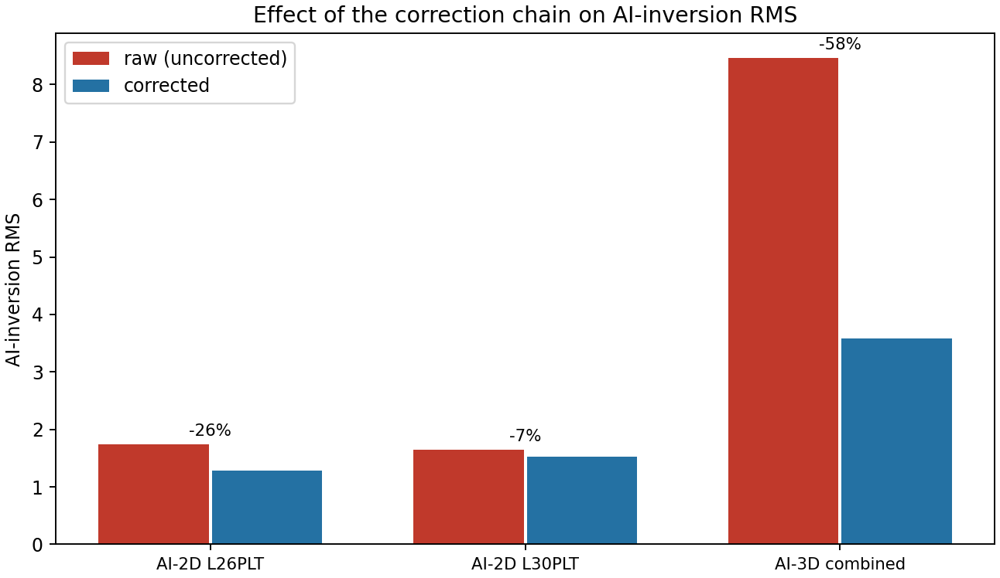

   The 3-D combined run improves the most (28 percent), which makes sense:
   it is the run most exposed to exactly the noise the correction chain
   targets -- both lines' incoherent, distortion-heavy stations feeding one
   shared graph. The improvement is real in every case, not marginal, which
   is the concrete answer to whether this correction chain was worth running
   at all.

Correction Parameter Report
---------------------------

A production project should archive, per station, exactly what was decided
and why. Build one table per line from the intermediate results already
computed above.

.. code-block:: pycon

   >>> import pandas as pd
   >>> pd.set_option("display.width", 160)
   >>> pd.set_option("display.max_columns", None)
   >>> report26 = gb26[["station", "gain", "twist_deg", "shear"]].merge(
   ...     ns26[["station", "ns_index", "ss_delta_log10", "distortion_type"]], on="station", how="left"
   ... ).merge(
   ...     factors26[["station", "fac_z_reviewed"]], on="station", how="left"
   ... )
   >>> report26["strike_deg"] = -34.11
   >>> report26["emap_method"] = "flma"
   >>> report26.iloc[[0, 15, 19, 20]].round(3)
       station  gain  twist_deg  shear  ns_index  ss_delta_log10 distortion_type  fac_z_reviewed  strike_deg emap_method
   0   26-001A   1.0     19.940 -0.469     1.448           0.491          static           0.564      -34.11        flma
   15  26-016A   1.0     -0.498  0.175     2.114           0.080    near_surface           0.840      -34.11        flma
   19  26-020A   1.0     60.347  0.544     1.232          -1.154          static           0.464      -34.11        flma
   20  26-021U   1.0    -14.757  0.892     0.797          -0.130          static           2.075      -34.11        flma

   >>> report26["distortion_type"].value_counts().to_dict()
   {'mixed': 17, 'static': 7, 'near_surface': 1}
   >>> round(report26["twist_deg"].abs().median(), 2), round(report26["fac_z_reviewed"].median(), 3)
   (8.29, 0.51)

.. code-block:: pycon

   >>> report30 = gb30[["station", "gain", "twist_deg", "shear"]].merge(
   ...     ns30[["station", "ns_index", "ss_delta_log10", "distortion_type"]], on="station", how="left"
   ... ).merge(
   ...     factors30[["station", "fac_z_reviewed"]], on="station", how="left"
   ... )
   >>> report30["strike_deg"] = -42.55
   >>> report30["emap_method"] = "flma"
   >>> report30["distortion_type"].value_counts().to_dict()
   {'static': 15, 'mixed': 10}
   >>> round(report30["twist_deg"].abs().median(), 2), round(report30["fac_z_reviewed"].median(), 3)
   (10.34, 0.535)

Save both tables next to the corrected EDIs so a reviewer -- or a future
run of this same pipeline -- can see exactly which correction each station
received without re-deriving it:

.. code-block:: pycon

   >>> report26.to_csv("runs/L26PLT_correction_report.csv", index=False)
   >>> report30.to_csv("runs/L30PLT_correction_report.csv", index=False)

Final Topographic Sections
--------------------------

The closing step drapes each line's AI 3-D resistivity trend onto its real
station topography, following the same dense-block construction as
:doc:`essential_3d_ai_inversion`: use the coarse GCN output as a station-wise
trend constraint on a dense image built from the real pseudosection, then
drape the result with :func:`pycsamt.topo.drape_section`.

.. code-block:: pycon

   >>> from pycsamt.topo import extract_elevation
   >>> elev26, elev30 = extract_elevation(corr26), extract_elevation(corr30)
   >>> round(chain26[-1], 3), elev26.min(), elev26.max()
   (2.437, 42.0, 204.0)
   >>> round(chain30[-1], 3), elev30.min(), elev30.max()
   (2.403, 44.0, 187.0)

Both profiles run a little over 2.4 km with real relief between 40 and
around 200 metres -- genuine topography, not a flat stand-in.

``build_panel`` and ``cell_edges`` are the same two helpers already defined
above for the AI-2D sections -- no need to redefine them, only to call
``build_panel`` again with the 3-D trend in place of the 2-D one.

.. code-block:: python
   :linenos:

   import matplotlib.pyplot as plt
   from pycsamt.topo import extract_station_names

   pred_rho = res3d.data["pred_rho"]
   n26 = len(corr26)
   pred26, pred30 = pred_rho[:n26], pred_rho[n26:]
   labels26 = [n.split("-")[-1] for n in extract_station_names(corr26)]
   labels30 = [n.split("-")[-1] for n in extract_station_names(corr30)]

   fig, axes = plt.subplots(1, 2, figsize=(15.0, 5.6), constrained_layout=True)
   im1 = build_panel(axes[0], corr26, chain26, elev26, labels26, pred26,
                      "L26PLT: AI 3-D resistivity, real topography")
   axes[0].set_ylabel("Elevation (km)")
   im2 = build_panel(axes[1], corr30, chain30, elev30, labels30, pred30,
                      "L30PLT: AI 3-D resistivity, real topography")
   fig.colorbar(im1, ax=axes, label="log10 rho (ohm.m)", shrink=0.85)
   fig.savefig("willy_ai3d_topo_sections_both_lines.png", dpi=190, bbox_inches="tight")

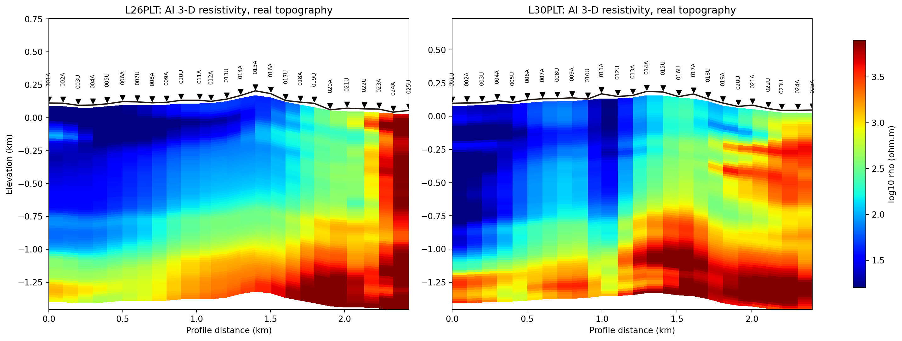

   Both lines show the same two-part structure: a shallow, moderately
   conductive zone in the upper few hundred metres -- consistent with
   weathered cover and near-surface alteration close to the mining and
   railway infrastructure already flagged throughout this tutorial -- giving
   way with depth to a substantially more resistive body, in the range
   expected for the fresh granodiorite or quartz-diorite host of a Cu-Mo
   :term:`porphyry` system. The patchier, alternating resistive-conductive
   pattern on the right-hand third of each line, roughly stations
   ``26-018`` to ``26-025`` and their ``L30PLT`` counterparts, is where the
   alteration/mineralization contact is the more plausible read: it is
   exactly the kind of target a follow-up drill program would want to test,
   not an artefact this tutorial can resolve from AMT alone. Cross-check it
   against the classical Occam2D and ModEM inversions prepared above before
   committing to that interpretation.

Adapting This Tutorial
----------------------

For a different two-line project, change only the input folders and the
assumed source offset first:

.. code-block:: python
   :linenos:

   line_a_dir = "path/to/your/line_a_edis"
   line_b_dir = "path/to/your/line_b_edis"
   assumed_source_offset_m = 500.0  # or drop the near-field/overprint section entirely

Then rerun the same sequence. If your survey has tipper, add it to the
strike and rotation sections following
:doc:`condition_mt_line_with_tipper_and_rotation`. If the strike rose is
tight rather than broad, trust the rotation more; if it is broad like both
lines here, keep the rotation-free 3-D AI inversion as the primary
cross-check rather than an afterthought. If neither line is near
controlled-source infrastructure, the near-field and source-overprint
sections can be skipped outright rather than run as a negative control.

See Also
--------

:doc:`correct_static_shift`
    A single-line, single-method static-shift workflow to compare against
    the conditional approach used here.

:doc:`condition_mt_line_with_tipper_and_rotation`
    The nearest existing precedent for the QC-to-rotation portion of this
    workflow, on a quieter MT line with tipper.

:doc:`prepare_occam2d_inversion`
    The Occam2D preparation pattern reused above, in full single-line
    depth.

:doc:`essential_3d_ai_inversion`
    The topography-draped AI 3-D construction reused in the closing
    section.

:doc:`../theory/field_zones`
    The full near-field and source-overprint theory behind the diagnostic
    run (and ruled out) above.

:doc:`../theory/static_shift`
    The physics and correction-factor derivation behind the static-shift
    section.

:doc:`../user_guide/models/modem`
    Full ModEM backend documentation.

:doc:`../user_guide/models/choosing_backend`
    Deciding between Occam2D, ModEM, MARE2DEM, and AI inversion.
