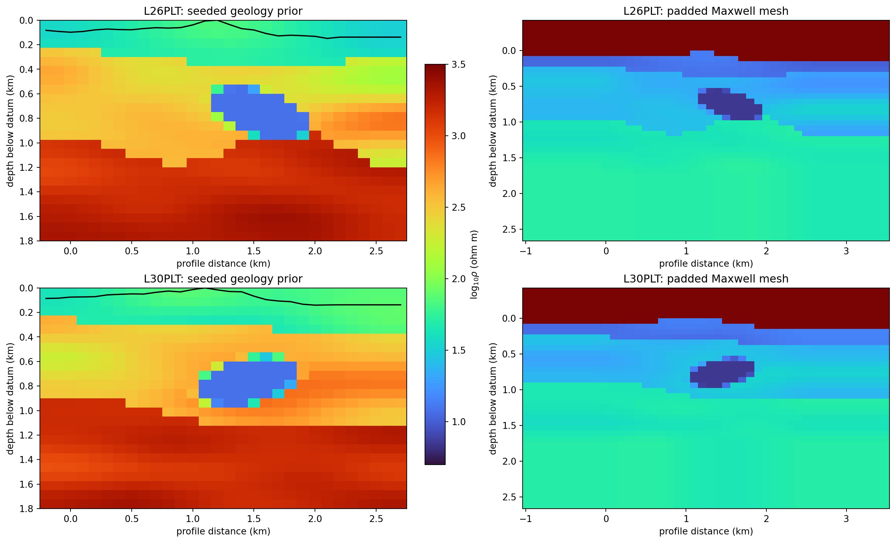
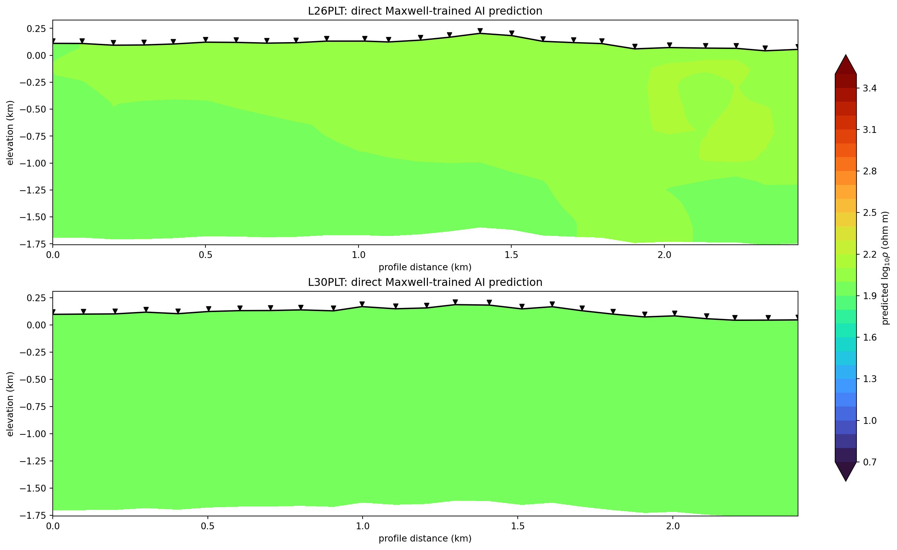
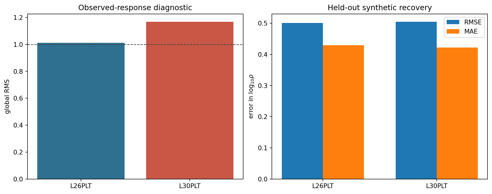

.. _tutorial_map_porphyry_mineralization_from_noisy_amt:

Map Porphyry Mineralization From Noisy AMT
==========================================

The WILLY_DATA survey sits close to a railway corridor and mining
infrastructure, and it shows: high :term:`skew`, station-to-station static
shift, and spatially incoherent noise that a clean textbook AMT line would
not have. It is also, per the citation below, real exploration data over a
known Cu-Mo :term:`porphyry` target, which makes it a fair test of whether
pyCSAMT's correction chain can recover something geologically usable from
data this rough.

This tutorial works two lines instead of the usual single-line examples:
``L26PLT`` and ``L30PLT`` from ``data/AMT/WILLY_DATA``. Every other WILLY
tutorial in this documentation uses ``L18PLT``/``L22PLT``, the two lines
tracked in git; ``L26PLT`` and ``L30PLT`` are excluded from the repository
to keep it small (see ``data/AMT/WILLY_DATA/README.md``).
Both are present on the machine this page was written on, so every number
and figure below is real, but a fresh checkout of the repository will not
have them -- either substitute ``L18PLT``/``L22PLT``, or your own two-line
survey, or contact the corresponding author of the cited paper for the full
delivery.

.. code-block:: text

   Kouabena, K.A.W., Zhou, J., Chen, R., Yin, L., Cai, H., Lu, Z., Gu, J.,
   Yu, W. (2025). Enhanced prediction of deep-seated Cu-Mo porphyry
   mineralization: A comprehensive interpretation based on 2D inversion of
   audio-magnetotelluric data. Ore Geology Reviews, 185, 106798.

See also ``[Kouabena2025]`` in :doc:`../references`.

What You Will Learn
-------------------

After this tutorial you should be able to:

- run a full noise-diagnosis chain on a genuinely difficult AMT line:
  powerline harmonics, near-field/source-overprint screening, a learned
  dimensionality dictionary, :term:`Groom-Bailey decomposition`, conditional
  :term:`static shift` correction, and an :term:`EMAP` spatial filter;
- classify stations as clean, static, near-surface, or mixed from real
  diagnostics rather than a blanket rule;
- estimate strike and rotate two lines that disagree with each other about
  how well a single rotation angle actually works;
- prepare both a classical 2-D (:term:`Occam2D`) and a classical 3-D
  (:term:`ModEM`) inversion input set from the same corrected survey;
- construct a separate geological prior and terrain-aware Maxwell mesh for
  each line, then train the 2-D network with genuine Maxwell responses;
- distinguish a successful software run from a model that passes response-
  and structure-recovery gates, and prepare an external 3-D continuation.

Recommended Order
-----------------

The user-facing correction list for this kind of survey is naturally out of
sequence -- several of the diagnostics only make sense once an earlier step
has removed a confound. The order used here, and why:

1. load both lines, order each one by coordinate-derived chainage, and build
   baseline QC/confidence tables;
2. remove powerline harmonics first, because a narrowband 50 Hz comb would
   otherwise pollute every later statistical diagnostic;
3. run the CSAMT near-field and source-overprint diagnostics anyway, to
   confirm (rather than assume) that they do not apply to a natural-source
   AMT line;
4. learn a dimensionality dictionary from phase-tensor features;
5. remove :term:`galvanic distortion` with a :term:`Groom-Bailey
   decomposition`, before static shift, because Groom-Bailey separates twist
   and shear from the scalar gain that static-shift methods alone would
   otherwise absorb;
6. classify each station as clean, static, near-surface, or mixed, and
   correct static shift only where that classification supports it;
7. smooth remaining incoherent noise with an EMAP spatial filter;
8. drop low-confidence frequency rows and export sanitized, corrected EDIs;
9. map skew and dimensionality on the corrected data, then estimate strike
   and rotate;
10. prepare Occam2D (2-D, rotated) and ModEM (3-D, unrotated) inversion
    inputs;
11. build the L26 and L30 geology/topography problems, inspect their padded
    Maxwell meshes, and run independent ``physics="mt2d"`` AI inversions;
12. test observed-response fit and held-out geological recovery before any
    interpretation, then report correction and inversion provenance.

Load Both Lines
---------------

.. code-block:: pycon

   >>> from pycsamt.api import read_edis
   >>> from pycsamt.site import Sites
   >>> survey26 = read_edis("data/AMT/WILLY_DATA/L26PLT", recursive=False, strict=False, progress=False)
   >>> survey30 = read_edis("data/AMT/WILLY_DATA/L30PLT", recursive=False, strict=False, progress=False)
   >>> sites26 = Sites(survey26.collection).ordered("chainage")
   >>> sites30 = Sites(survey30.collection).ordered("chainage")
   >>> len(list(sites26)), len(list(sites30))
   (25, 25)
   >>> sites26.ordering["applied"], sites30.ordering["applied"]
   ('chainage', 'chainage')
   >>> round(sites26.ordering["span_m"], 1), round(sites30.ordering["span_m"], 1)
   (2403.2, 2399.6)
   >>> raw26_names = [site.name for site in Sites(survey26.collection)]
   >>> raw30_names = [site.name for site in Sites(survey30.collection)]
   >>> ordered26_names = [site.name for site in sites26]
   >>> ordered30_names = [site.name for site in sites30]
   >>> raw26_names == ordered26_names, raw30_names == ordered30_names
   (True, True)

Both lines carry 53 frequencies from 1.008 Hz to 10.4 kHz -- ordinary AMT
band coverage, no tipper (confirmed in the WILLY README), and real station
elevation, which the closing section relies on. Chainage is established here,
before any neighbour-based filter or station-column plot. Consequently every
later pseudosection, static-shift window, inversion data row, and topographic
section inherits physical profile order rather than filesystem or station-name
order. Renaming would not provide that guarantee because it changes identity,
not geometry or sequence; see :doc:`../user_guide/site/location_profile`.

For each line, the geographic coordinates are converted to local east/north
positions :math:`\mathbf{r}_i`, a principal line direction
:math:`\hat{\mathbf{u}}` is estimated from all valid stations, and the
:term:`Chainage` used for sorting is

.. math::
   :label: porphyry-tutorial-chainage-order

   c_i = (\mathbf{r}_i-\mathbf{r}_0)\mathbin{\cdot}
         \hat{\mathbf{u}},
   \qquad
   \pi = \operatorname{argsort}_{i}(c_i).

The permutation :math:`\pi` in :eq:`porphyry-tutorial-chainage-order` is
applied to the complete station objects, so coordinates, impedance tensors,
errors, and metadata remain attached to the same station. The reported spans
and the successful ``applied`` values make this ordering decision explicit and
reproducible before the scientific workflow begins.

For this particular L26PLT/L30PLT delivery, the final comparison returns
``True`` for both lines: loader order already happens to agree with chainage.
That is why deterministic QC and correction numbers remain unchanged in this
rerun. The explicit ordering is still essential—it removes that accidental
dependence on filenames or directory enumeration, and protects the same
tutorial when the EDI files are copied, renamed, or supplied in another input
order. The regenerated AI figures differ because the models were retrained;
they should not be interpreted as evidence that chainage moved these stations.

Baseline Quality Check
----------------------

:func:`pycsamt.emtools.build_qc_table` and
:func:`pycsamt.emtools.frequency_confidence_table` give the first honest
look at how rough this data actually is, before any correction has a chance
to flatter it.

.. code-block:: pycon

   >>> from pycsamt.emtools import build_qc_table, frequency_confidence_table
   >>> qc26 = build_qc_table(sites26, include_skew=True, recursive=False, api=True).to_pandas()
   >>> qc30 = build_qc_table(sites30, include_skew=True, recursive=False, api=True).to_pandas()
   >>> qc26[["station", "snr_med", "skew_med"]].head(3).round(2)
      station  snr_med  skew_med
   0  26-001A    13.00     15.85
   1  26-002A    15.59     12.63
   2  26-003U    19.88      9.40
   >>> round(qc26["skew_med"].min(), 2), round(qc26["skew_med"].max(), 2)
   (4.3, 61.36)
   >>> round(qc30["skew_med"].min(), 2), round(qc30["skew_med"].max(), 2)
   (4.5, 61.38)

Per-station median phase-tensor :term:`skew` spans a wide 4-61 degree range
on both lines, not a uniformly high one. That spread is itself informative:
a handful of stations sit in the single digits, well inside a clean 2-D
range, while others exceed 60 degrees -- squarely 3-D or distortion-affected
territory. On its own this does not say *why* any one station is disturbed
-- that is what the next several sections screen for -- but it means the
line cannot be treated as uniformly good or uniformly bad; the per-station
and per-period detail matters more than a single summary number here.

.. code-block:: pycon

   >>> fci26 = frequency_confidence_table(sites26, method="composite", ci_hi=0.9, ci_lo=0.5, recursive=False, api=True).to_pandas()
   >>> fci30 = frequency_confidence_table(sites30, method="composite", ci_hi=0.9, ci_lo=0.5, recursive=False, api=True).to_pandas()
   >>> round(fci26["confidence"].mean(), 3), round(fci30["confidence"].mean(), 3)
   (0.676, 0.64)

.. code-block:: python
   :linenos:

   import matplotlib.pyplot as plt
   from pycsamt.emtools import plot_frequency_confidence_psection

   fig, axes = plt.subplots(1, 2, figsize=(13.5, 4.6), constrained_layout=True)
   plot_frequency_confidence_psection(sites26, recursive=False, ax=axes[0])
   axes[0].set_title("L26PLT raw frequency confidence")
   plot_frequency_confidence_psection(sites30, recursive=False, ax=axes[1])
   axes[1].set_title("L30PLT raw frequency confidence")
   fig.savefig("willy_raw_frequency_confidence.png", dpi=170)

.. figure:: ../images/tutorials/map_porphyry_mineralization_from_noisy_amt/willy_raw_frequency_confidence.png
   :alt: Raw frequency confidence pseudosection for L26PLT and L30PLT
   :width: 100%

   A mean composite confidence around 0.64-0.68 is mediocre, not
   catastrophic: most station-period rows are usable, but neither line has
   the uniformly green pseudosection a quiet AMT survey would show. The
   patchy low-confidence bands sit mostly at short period (high frequency),
   which is where powerline harmonics live.

Remove Powerline Harmonics
--------------------------

:func:`pycsamt.emtools.notch_powerline` targets the 50 Hz mains frequency
used at this site (Jiangsu Province, mainland China grid) and its harmonics.
The default ``mode="interp"`` replaces the affected bins in place by
interpolation rather than dropping them, so the row count is unchanged --
only the values at the harmonic bins move. The tolerance must reflect the
sampled frequency grid: these EDIs contain 50.29 Hz rather than exactly
50.00 Hz, so the former ``tol_hz=0.06`` matched no row and performed no
correction. A 0.30 Hz tolerance includes 50.29 Hz without reaching the next
logarithmically spaced frequency.

For sampled frequency :math:`f_i`, mains frequency :math:`f_m`, harmonic
index :math:`k`, and absolute tolerance :math:`\epsilon`, the implementation
changes a row only when

.. math::
   :label: porphyry-powerline-harmonic-mask

   M_i = \mathbf{1}\!\left[
       \min_{1\leq k\leq K}|f_i-kf_m|\leq\epsilon
   \right].

With :math:`\epsilon=0.06` Hz, equation
:eq:`porphyry-powerline-harmonic-mask` gives :math:`M_i=0` for all 53 rows;
with :math:`\epsilon=0.30` Hz, it gives :math:`M_i=1` at 50.29 Hz and zero
elsewhere. This makes the selected correction narrow, explicit, and
reproducible rather than visually widening the notch until a difference
appears.

.. code-block:: pycon

   >>> from pycsamt.emtools import notch_powerline
   >>> import numpy as np
   >>> notched26 = notch_powerline(sites26, mains_hz=50.0, n_harm=20, tol_hz=0.30, recursive=False)
   >>> notched30 = notch_powerline(sites30, mains_hz=50.0, n_harm=20, tol_hz=0.30, recursive=False)
   >>> from pycsamt.emtools._core import _get_z_block
   >>> def largest_notch_change(before, after):
   ...     records = []
   ...     for raw, corrected in zip(before, after):
   ...         _, z_raw, freq = _get_z_block(raw)
   ...         _, z_corrected, _ = _get_z_block(corrected)
   ...         relative = np.abs(z_corrected[:, 0, 1] - z_raw[:, 0, 1]) / np.maximum(np.abs(z_raw[:, 0, 1]), 1e-30)
   ...         row = int(np.nanargmax(relative))
   ...         records.append((float(relative[row]), raw.name, float(freq[row])))
   ...     change, station, frequency = max(records)
   ...     return station, round(frequency, 2), round(100.0 * change, 1)
   >>> largest_notch_change(sites26, notched26)
   ('26-001A', 50.29, 68.2)
   >>> largest_notch_change(sites30, notched30)
   ('30-023U', 50.29, 82.1)

.. code-block:: python
   :linenos:

   import numpy as np
   import matplotlib.pyplot as plt
   from pycsamt.emtools._core import _get_z_block

   fig, axes = plt.subplots(2, 2, figsize=(13.0, 7.2), constrained_layout=True)
   for col, (name, before, after) in enumerate(zip(
       ["L26PLT", "L30PLT"], [sites26, sites30], [notched26, notched30]
   )):
       records = []
       for ed_before, ed_after in zip(before, after):
           _, zb, fr = _get_z_block(ed_before)
           _, za, _ = _get_z_block(ed_after)
           rel = np.abs(za[:, 0, 1] - zb[:, 0, 1]) / np.maximum(np.abs(zb[:, 0, 1]), 1e-30)
           records.append((float(np.nanmax(rel)), ed_before, ed_after, rel))

       max_rel, ed_before, ed_after, rel = max(records, key=lambda item: item[0])
       _, zb, fr = _get_z_block(ed_before)
       _, za, _ = _get_z_block(ed_after)
       local = (fr >= 20.0) & (fr <= 130.0)
       changed = int(np.nanargmax(rel))

       ax = axes[0, col]
       ax.loglog(fr[local], np.abs(zb[local, 0, 1]), "o-", ms=5, label="raw", color="0.45")
       ax.loglog(fr[local], np.abs(za[local, 0, 1]), "s--", ms=5, label="interpolated", color="crimson")
       ax.axvline(fr[changed], color="#2471a3", linestyle=":", linewidth=1.2)
       ax.set_ylabel("|Zxy|")
       ax.set_title(f"{name} {ed_before.name}: {100 * max_rel:.1f}% at {fr[changed]:.2f} Hz")
       ax.legend(fontsize=8)

       ax = axes[1, col]
       station_change = [100.0 * record[0] for record in records]
       ax.bar(np.arange(len(station_change)), station_change, color="#2471a3")
       ax.set_xlabel("Chainage-ordered station index")
       ax.set_ylabel("max |delta Zxy| / |Zxy| (%)")
       ax.set_title(f"{name}: correction across all stations")
   fig.savefig("willy_powerline_notch_before_after.png", dpi=170)

.. figure:: ../images/tutorials/map_porphyry_mineralization_from_noisy_amt/willy_powerline_notch_before_after.png
   :alt: Powerline notch before and after on a representative station from each line
   :width: 100%

   The upper panels deliberately zoom around the 50 Hz fundamental and select
   the station with the largest change on each line; the vertical marker makes
   the interpolated 50.29 Hz row visible instead of compressing it into the
   full 1 Hz--10.4 kHz range. The lower panels show that this is not merely a
   cosmetic change at two chosen stations: every bar is computed independently
   from one chainage-ordered station. Large peaks identify stations for which
   the raw 50.29 Hz impedance departed most strongly from its log-frequency
   neighbours, while small bars show where interpolation leaves an already
   smooth local spectrum nearly unchanged.

Rule Out Near-Field Bias
------------------------

:doc:`../theory/field_zones` derives the CSAMT near/transition/far
classification and the :math:`|k\cdot r|` parameter in detail. Both formulas
assume a real, known offset to a controlled-source transmitter -- exactly
the assumption a natural-source AMT survey does not satisfy. There is no
controlled transmitter next to this railway or mining site; running the
diagnostic anyway, with a stated illustrative offset, is the correct way to
confirm that rather than merely assert it.

.. code-block:: pycon

   >>> from pycsamt.emtools import classify_field_zones
   >>> zones26 = classify_field_zones(notched26, source_offset=500.0, recursive=False)
   >>> zones26["zone"].value_counts().to_dict()
   {'transition': 536, 'near': 519, 'far': 270}
   >>> zones30 = classify_field_zones(notched30, source_offset=500.0, recursive=False)
   >>> zones30["zone"].value_counts().to_dict()
   {'near': 544, 'transition': 516, 'far': 265}

.. code-block:: python
   :linenos:

   import matplotlib.pyplot as plt
   from pycsamt.emtools import plot_field_zones

   fig, axes = plt.subplots(1, 2, figsize=(13.5, 5.0), constrained_layout=True)
   for ax, name, sites in zip(axes, ["L26PLT", "L30PLT"], [notched26, notched30]):
       plot_field_zones(sites, source_offset=500.0, recursive=False, ax=ax)
       ax.set_title(f"{name} field-zone classification (assumed r=500 m)")
   fig.savefig("willy_field_zones_assumed_offset.png", dpi=170)

.. figure:: ../images/tutorials/map_porphyry_mineralization_from_noisy_amt/willy_field_zones_assumed_offset.png
   :alt: CSAMT field-zone classification for both lines under an assumed 500 m offset
   :width: 100%

   Read this figure for what it actually shows: short periods (high
   frequency, small :term:`Bostick depth`) classify far field, long periods
   classify near field, purely because an assumed 500 m offset makes
   :math:`|k\cdot r|=r/\delta_B` shrink as period grows. A real
   controlled-source line would show exactly this pattern for a genuine
   geometric reason; here it is an artefact of feeding a fictitious offset
   into a formula built for a different acquisition geometry. The correct
   reading is: this diagnostic does not apply to WILLY_DATA, and the
   :term:`near-field correction` machinery in
   :func:`pycsamt.emtools.correct_near_field` should not be used on it.

Check Source Overprint
----------------------

:func:`pycsamt.emtools.detect_source_overprint` implements the same
horizontal-electric-dipole shadow model (Yan & Fu 2004) used by the
near-field diagnostic above, through the ground-wave/surface-wave ratio
:math:`\beta_{Ey}`. It carries the identical caveat: it models a real
transmitter at a known offset, and the railway or plant infrastructure near
this line is not that.

.. code-block:: pycon

   >>> from pycsamt.emtools import detect_source_overprint
   >>> ov26 = detect_source_overprint(notched26, source_offset=500.0, recursive=False)
   >>> round(ov26["beta_pct"].median(), 2), int(ov26["overprint_flag"].sum()), len(ov26)
   (48.52, 1166, 1325)
   >>> ov30 = detect_source_overprint(notched30, source_offset=500.0, recursive=False)
   >>> round(ov30["beta_pct"].median(), 2), int(ov30["overprint_flag"].sum()), len(ov30)
   (49.16, 1191, 1325)

.. code-block:: python
   :linenos:

   import matplotlib.pyplot as plt
   from pycsamt.emtools import plot_overprint_section

   fig, axes = plt.subplots(1, 2, figsize=(13.5, 5.0), constrained_layout=True)
   for ax, name, sites in zip(axes, ["L26PLT", "L30PLT"], [notched26, notched30]):
       plot_overprint_section(sites, source_offset=500.0, recursive=False, ax=ax)
       ax.set_title(f"{name} source-overprint beta (assumed r=500 m)")
   fig.savefig("willy_overprint_beta_assumed_offset.png", dpi=170)

.. figure:: ../images/tutorials/map_porphyry_mineralization_from_noisy_amt/willy_overprint_beta_assumed_offset.png
   :alt: Source-overprint beta section for both lines under an assumed 500 m offset
   :width: 100%

   Median :math:`\beta` near 49 percent, on both lines, at a 500 m assumed
   offset is not a subtle warning -- it says the shadow model is completely
   dominated by the fictitious geometry, not by anything in the data. Two
   diagnostics built specifically for controlled-source acquisition both
   agree, for the right reason, that they do not have a controlled source to
   diagnose. The real noise mechanisms at play here -- narrowband harmonics
   (already handled), galvanic distortion, and spatially incoherent noise
   from nearby infrastructure -- are exactly the ones the rest of this
   tutorial addresses directly.

Dimensionality Dictionary
-------------------------

:func:`pycsamt.emtools.learn_dim_dictionary` learns a small set of atoms
from phase-tensor features (skew, ellipticity, determinant resistivity, and
tipper amplitude where available) by sparse coding, then
:func:`pycsamt.emtools.encode_dimensionality` labels every station-period row
against that learned dictionary rather than a fixed skew/ellipticity
threshold.

.. code-block:: pycon

   >>> from pycsamt.emtools import learn_dim_dictionary, encode_dimensionality
   >>> model26 = learn_dim_dictionary(notched26, n_atoms=6, lam=0.05, n_iter=40, code_iter=50, recursive=False)
   >>> enc26 = encode_dimensionality(notched26, model26, recursive=False, api=True).to_pandas()
   >>> enc26["dim_pred"].value_counts().to_dict()
   {2: 927, 1: 398}
   >>> model30 = learn_dim_dictionary(notched30, n_atoms=6, lam=0.05, n_iter=40, code_iter=50, recursive=False)
   >>> enc30 = encode_dimensionality(notched30, model30, recursive=False, api=True).to_pandas()
   >>> enc30["dim_pred"].value_counts().to_dict()
   {2: 965, 1: 360}

Label ``1`` (moderate skew, low ellipticity) makes up roughly a
quarter to a third of each line (30 percent of ``L26PLT``, 27 percent of
``L30PLT``) and label ``2`` (the higher-skew/higher-ellipticity atom) the
rest; no row on either line lands in the cleanest label ``0``. That is
consistent with the wide but real skew range already seen -- most rows
still carry enough skew or ellipticity to read as 3-D-flavoured or noisy,
but a genuine minority sit in the calmer label ``1`` rather than every row
looking equally disturbed.

.. code-block:: python
   :linenos:

   import matplotlib.pyplot as plt
   from pycsamt.emtools import plot_dim_confidence_grid

   fig, axes = plt.subplots(1, 2, figsize=(13.5, 4.8), constrained_layout=True)
   for ax, name, sites in zip(axes, ["L26PLT", "L30PLT"], [notched26, notched30]):
       plot_dim_confidence_grid(sites, recursive=False, ax=ax)
       ax.set_title(f"{name} dimensionality confidence")
   fig.savefig("willy_dim_confidence_grid.png", dpi=170)

.. figure:: ../images/tutorials/map_porphyry_mineralization_from_noisy_amt/willy_dim_confidence_grid.png
   :alt: Dimensionality confidence grid for both lines
   :width: 100%

   Both lines look broadly similar here, which matters for the next
   section: neither line has an obvious quiet sub-domain that a simple
   station filter could isolate. Distortion correction has to be applied
   line-wide.

Remove Galvanic Distortion
--------------------------

:func:`pycsamt.emtools.groom_bailey_table` fits the classic
:term:`Groom-Bailey decomposition`

.. math::
   :label: eq-willy-gb-model

   \mathbf{Z}_{\mathrm{obs}}(f) \approx \mathbf{D}\,\mathbf{Z}_{2D}(f),

where :math:`\mathbf{D}` is a real, frequency-independent :term:`distortion
matrix` and :math:`\mathbf{Z}_{2D}` is anti-diagonal at every frequency. The
fit reports :term:`twist` and :term:`shear` directly; gain is normalized to
1 by construction, because gain and :term:`static shift` are not separable
from the tensor shape alone -- resolving the scalar amplitude is exactly
what the dedicated static-shift step further below is for.

.. code-block:: pycon

   >>> from pycsamt.emtools import groom_bailey_table, apply_groom_bailey
   >>> gb26 = groom_bailey_table(notched26, min_freq=4, robust=True, recursive=False, api=True).to_pandas()
   >>> gb_corr26 = apply_groom_bailey(notched26, table=gb26, inplace=False, recursive=False)
   >>> ok26 = gb26[gb26["status"] == "ok"]
   >>> round(ok26["twist_deg"].median(), 2), round(ok26["shear"].median(), 4)
   (2.8, -0.0028)
   >>> round(ok26["diagonal_ratio_before"].median(), 3), round(ok26["diagonal_ratio_after"].median(), 3)
   (0.345, 0.359)
   >>> gb30 = groom_bailey_table(notched30, min_freq=4, robust=True, recursive=False, api=True).to_pandas()
   >>> gb_corr30 = apply_groom_bailey(notched30, table=gb30, inplace=False, recursive=False)
   >>> ok30 = gb30[gb30["status"] == "ok"]
   >>> round(ok30["twist_deg"].median(), 2), round(ok30["shear"].median(), 4)
   (8.73, -0.2585)
   >>> round(ok30["diagonal_ratio_before"].median(), 3), round(ok30["diagonal_ratio_after"].median(), 3)
   (0.487, 0.333)

The line-median twist is mild on both lines, but medians hide the stations
that matter. Six stations reach a twist beyond 40 degrees on ``L26PLT``
alone (``26-020A`` at 60.3, ``26-023A`` at -49.8, ``26-019U`` at -49.5,
``26-025U`` at 42.2, ``26-002A`` at 25.2, ``26-001A`` at 19.7), and
``L30PLT`` has an even larger cluster (``30-025A`` 60.7, ``30-013A`` 55.7,
``30-002A`` 48.8). ``L30PLT``'s larger median diagonal-ratio drop (0.487 to
0.333, versus ``L26PLT``'s 0.345 to 0.359) says the correction is doing more
real work there.

.. code-block:: python
   :linenos:

   from pycsamt.emtools.advanced import plot_distortion_radar

   for name, sites, gb in [("L26PLT", notched26, gb26), ("L30PLT", notched30, gb30)]:
       worst = (
           gb.reindex(gb["twist_deg"].abs().sort_values(ascending=False).index)
           .head(6)["station"]
           .tolist()
       )
       fig = plot_distortion_radar(
           sites, stations=worst, max_stations=6, recursive=False,
           title=f"{name}: 6 largest-twist stations",
       )
       fig.savefig(f"willy_{name.lower()}_distortion_radar.png", dpi=170, bbox_inches="tight")

.. figure:: ../images/tutorials/map_porphyry_mineralization_from_noisy_amt/willy_l26plt_distortion_radar.png
   :alt: Galvanic distortion radar for the six largest-twist L26PLT stations
   :width: 90%

.. figure:: ../images/tutorials/map_porphyry_mineralization_from_noisy_amt/willy_l30plt_distortion_radar.png
   :alt: Galvanic distortion radar for the six largest-twist L30PLT stations
   :width: 90%

   Each polygon is one station's six-axis distortion fingerprint (Swift
   skew, Bahr eta, phase asymmetry, PT beta, ellipticity, and dimensionality
   proxy). Stations that stretch out along several axes at once, not just
   one, are the ones where a purely scalar static-shift correction would
   under-describe what is actually happening to the tensor.

Correct Static Shift
--------------------

:func:`pycsamt.emtools.detect_near_surface` separates a
frequency-independent scalar shift (the classic :term:`static shift`
model, :math:`\rho_a'=\rho_a/g`) from a frequency-*dependent* near-surface
effect that static-shift correction cannot fix. The default ``f_split=1.0
Hz`` boundary assumes a broadband MT-style survey reaching well below 1 Hz;
WILLY's audio-band floor sits at 1.008 Hz, so almost nothing would fall
below the default split. ``f_split=50.0`` instead splits the band near its
geometric centre, and ``max_skew=None`` keeps every row -- the default
6-degree skew ceiling would reject nearly all of this survey outright,
given the skew range already seen.

.. code-block:: pycon

   >>> from pycsamt.emtools import detect_near_surface
   >>> ns26 = detect_near_surface(gb_corr26, f_split=50.0, max_skew=None, recursive=False, api=True).to_pandas()
   >>> ns26["distortion_type"].value_counts().to_dict()
   {'mixed': 17, 'static': 8}
   >>> ns30 = detect_near_surface(gb_corr30, f_split=50.0, max_skew=None, recursive=False, api=True).to_pandas()
   >>> ns30["distortion_type"].value_counts().to_dict()
   {'static': 13, 'mixed': 12}

Neither line has a single ``clean`` station by this classification --
consistent with everything found so far -- but the split between
``static``, ``near_surface``, and ``mixed`` matters: it decides *how much*
correction each station gets next.

.. code-block:: pycon

   >>> from pycsamt.emtools import estimate_ss_ama, apply_ss_factors
   >>> import numpy as np
   >>> factors26 = estimate_ss_ama(gb_corr26, sort_by="name", half_window=3, max_skew=None, recursive=False, api=True).to_pandas()
   >>> factors26 = factors26.merge(ns26[["station", "distortion_type"]], on="station", how="left")
   >>> factors26["fac_z_reviewed"] = np.where(
   ...     factors26["distortion_type"].isin(["clean"]), 1.0,
   ...     factors26["fac_z"].clip(lower=0.3, upper=3.0),
   ... )
   >>> factors26[["station", "fac_z", "distortion_type", "fac_z_reviewed"]].iloc[[0, 15, 19, 20]].round(3)
       station  fac_z distortion_type  fac_z_reviewed
   0   26-001A  0.565          static           0.565
   15  26-016A  0.840          static           0.840
   19  26-020A  0.464           mixed           0.464
   20  26-021U  2.107          static           2.107

   >>> reviewed26 = factors26[["station", "fac_z_reviewed"]].rename(columns={"fac_z_reviewed": "fac_z"})
   >>> ss_corr26 = apply_ss_factors(gb_corr26, reviewed26, key="fac_z", inplace=False, recursive=False)

The clip at ``[0.3, 3.0]`` is a review guard, not blanket correction --
every station here already qualified as ``static``, ``mixed``, or
``near_surface``, so every factor is applied; a fully clean station would
instead be pinned at ``1.0`` (no change), which is what the ``np.where``
branch is for. ``26-021U`` still gets a large 2.11x scaler even after
clipping, which is exactly the kind of factor that deserves a note in a
production project rather than silent acceptance.

.. code-block:: pycon

   >>> factors30 = estimate_ss_ama(gb_corr30, sort_by="name", half_window=3, max_skew=None, recursive=False, api=True).to_pandas()
   >>> factors30 = factors30.merge(ns30[["station", "distortion_type"]], on="station", how="left")
   >>> factors30["fac_z_reviewed"] = np.where(
   ...     factors30["distortion_type"].isin(["clean"]), 1.0,
   ...     factors30["fac_z"].clip(lower=0.3, upper=3.0),
   ... )
   >>> reviewed30 = factors30[["station", "fac_z_reviewed"]].rename(columns={"fac_z_reviewed": "fac_z"})
   >>> ss_corr30 = apply_ss_factors(gb_corr30, reviewed30, key="fac_z", inplace=False, recursive=False)
   >>> round(factors30["fac_z_reviewed"].median(), 3)
   0.535

.. code-block:: python
   :linenos:

   import matplotlib.pyplot as plt
   from pycsamt.emtools import plot_ss_delta_psection

   fig, axes = plt.subplots(1, 2, figsize=(13.5, 5.0), constrained_layout=True)
   plot_ss_delta_psection(gb_corr26, ss_corr26, ax=axes[0])
   axes[0].set_title("L26PLT static-shift delta log10(rho)")
   plot_ss_delta_psection(gb_corr30, ss_corr30, ax=axes[1])
   axes[1].set_title("L30PLT static-shift delta log10(rho)")
   fig.savefig("willy_static_shift_delta.png", dpi=170)

.. figure:: ../images/tutorials/map_porphyry_mineralization_from_noisy_amt/willy_static_shift_delta.png
   :alt: Static-shift delta pseudosection for both lines
   :width: 100%

   The delta is constant with period at any one station -- the visual
   signature of a genuinely scalar correction -- and its sign and size vary
   station to station in the same patchy way the QC table already showed.
   That patchiness, not a smooth trend, is what a static-shift-dominated
   line looks like.

EMAP Spatial Filter
-------------------

Static shift and Groom-Bailey both work station by station. What is left
after both is spatially incoherent noise that only shows up when
neighbouring stations are compared directly --
:func:`pycsamt.emtools.apply_emap_filter` implements two profile-wide
options, :term:`AMA` and :term:`FLMA`, worth comparing rather than picking
blindly.

.. code-block:: pycon

   >>> from pycsamt.emtools import apply_emap_filter
   >>> ama26 = apply_emap_filter(ss_corr26, method="ama", window_m=1500.0, spacing_m=200.0, comp="det", inplace=False, recursive=False)
   >>> flma26 = apply_emap_filter(ss_corr26, method="flma", window=5, component="all", inplace=False, recursive=False)

   >>> def rho_xy_all(ss):
   ...     from pycsamt.emtools._core import _iter_items, _get_z_block
   ...     out = []
   ...     for ed in _iter_items(ss):
   ...         _, z, fr = _get_z_block(ed)
   ...         if z is None:
   ...             continue
   ...         rho = 0.2 * np.abs(z[:, 0, 1]) ** 2 / np.maximum(fr, 1e-30)
   ...         out.append(rho[np.isfinite(rho) & (rho > 0)])
   ...     return np.concatenate(out)
   ...
   >>> r0, ra, rf = rho_xy_all(ss_corr26), rho_xy_all(ama26), rho_xy_all(flma26)
   >>> round(np.std(np.log10(r0)), 4), round(np.std(np.log10(ra)), 4), round(np.std(np.log10(rf)), 4)
   (1.0364, 0.9598, 0.8924)

Both filters reduce the log-resistivity spread; FLMA reduces it further on
``L26PLT`` (0.892 versus AMA's 0.960, down from an unfiltered 1.036). The
same comparison on ``L30PLT`` gives 0.954 (FLMA) versus 0.967 (AMA) against
an unfiltered 1.066 -- FLMA wins on both lines, so it is the production
choice below.

.. code-block:: pycon

   >>> flma30 = apply_emap_filter(ss_corr30, method="flma", window=5, component="all", inplace=False, recursive=False)

.. code-block:: python
   :linenos:

   from pycsamt.emtools import plot_emap_filter_psection

   for name, before, after in [("L26PLT", ss_corr26, flma26), ("L30PLT", ss_corr30, flma30)]:
       fig = plot_emap_filter_psection(before, after, method="flma", component="xy")
       fig.savefig(f"willy_{name.lower()}_emap_flma_psection.png", dpi=170, bbox_inches="tight")

.. figure:: ../images/tutorials/map_porphyry_mineralization_from_noisy_amt/willy_l26plt_emap_flma_psection.png
   :alt: L26PLT EMAP FLMA before/after/delta pseudosection
   :width: 100%

.. figure:: ../images/tutorials/map_porphyry_mineralization_from_noisy_amt/willy_l30plt_emap_flma_psection.png
   :alt: L30PLT EMAP FLMA before/after/delta pseudosection
   :width: 100%

   The delta panel is where the filter's actual footprint lives: it is
   small and scattered, not a broad smooth wash across the whole line, which
   is the desired behaviour for a filter meant to suppress incoherent noise
   without also erasing genuine lateral structure.

Drop Weak Frequencies
---------------------

The QC pass at the start flagged individual station-period rows as weak;
:func:`pycsamt.emtools.drop_low_confidence_frequencies` removes them now,
after every tensor-level correction, so the confidence scores reflect the
corrected data rather than the raw one.

.. code-block:: pycon

   >>> from pycsamt.emtools import drop_low_confidence_frequencies
   >>> dropped26 = drop_low_confidence_frequencies(flma26, method="composite", threshold=0.5, also="both", inplace=False, recursive=False)
   >>> dropped30 = drop_low_confidence_frequencies(flma30, method="composite", threshold=0.5, also="both", inplace=False, recursive=False)

.. code-block:: python
   :linenos:

   import matplotlib.pyplot as plt
   from pycsamt.emtools import plot_frequency_edit_summary

   fig, axes = plt.subplots(1, 2, figsize=(13.5, 4.6), constrained_layout=True)
   plot_frequency_edit_summary(flma26, dropped26, ax=axes[0])
   axes[0].set_title("L26PLT bad-frequency drop (threshold=0.5)")
   plot_frequency_edit_summary(flma30, dropped30, ax=axes[1])
   axes[1].set_title("L30PLT bad-frequency drop (threshold=0.5)")
   fig.savefig("willy_bad_frequency_drop_summary.png", dpi=170)

.. figure:: ../images/tutorials/map_porphyry_mineralization_from_noisy_amt/willy_bad_frequency_drop_summary.png
   :alt: Bad-frequency drop summary for both lines
   :width: 100%

   ``L26PLT`` loses 79 of 1325 station-frequency rows (about 6.0 percent);
   ``L30PLT`` loses 154 (about 11.6 percent). One ``L30PLT`` station,
   ``30-011A``, drops from 53 usable frequencies to only 5 -- a station
   worth flagging for manual review or exclusion in a production project,
   not silently carried forward at face value.

The corrected, sanitized survey is exported to disk here, ready to be
reloaded independently by every remaining section:

.. code-block:: pycon

   >>> from pycsamt.agents.edi_export import EDIExportAgent
   >>> r26 = EDIExportAgent(overwrite=True).execute({"sites": dropped26, "output_dir": "runs/L26PLT_corrected"})
   >>> r26.status, r26.data["n_written"]
   ('success', 25)
   >>> r30 = EDIExportAgent(overwrite=True).execute({"sites": dropped30, "output_dir": "runs/L30PLT_corrected"})
   >>> r30.status, r30.data["n_written"]
   ('success', 25)

Skew And Dimensionality
-----------------------

Reload the corrected EDIs and check whether the correction chain actually
changed the skew and dimensionality picture, rather than assuming it.

.. code-block:: pycon

   >>> from pycsamt.api import read_edis
   >>> corr26 = Sites(read_edis("runs/L26PLT_corrected", recursive=False, strict=False, progress=False).collection).ordered("chainage")
   >>> corr30 = Sites(read_edis("runs/L30PLT_corrected", recursive=False, strict=False, progress=False).collection).ordered("chainage")
   >>> from pycsamt.emtools import build_phase_tensor_table
   >>> pt26 = build_phase_tensor_table(corr26, recursive=False)
   >>> len(pt26), round(pt26["beta"].abs().median(), 2), round(pt26["beta"].abs().quantile(0.9), 2)
   (1246, 13.05, 45.44)
   >>> pt30 = build_phase_tensor_table(corr30, recursive=False)
   >>> len(pt30), round(pt30["beta"].abs().median(), 2), round(pt30["beta"].abs().quantile(0.9), 2)
   (1171, 15.15, 53.25)

The correction chain removes powerline spikes, galvanic distortion, static
shift, incoherent noise, and weak rows -- it does not, and should not,
manufacture a low-skew line out of genuinely 3-D or noisy data. A median
skew around 13-15 degrees after correction is a real improvement over the
uncorrected, per-station picture in the Baseline Quality Check above (which
ranged as high as 61 degrees): most of the corrected data now sits close to
the classical few-degree "clean 2-D" range. The 90th percentile still
reaching 45-53 degrees is the honest remainder -- correction removes
identifiable distortion and noise, it does not manufacture 2-D structure
where the earth is genuinely 3-D, and roughly a tenth of the corrected data
still reads that way.

.. code-block:: python
   :linenos:

   import matplotlib.pyplot as plt
   from pycsamt.emtools import plot_phase_tensor_skewmap, plot_dimensionality_psection

   fig, axes = plt.subplots(2, 2, figsize=(13.5, 8.6), constrained_layout=True)
   for col, (name, sites) in enumerate([("L26PLT", corr26), ("L30PLT", corr30)]):
       plot_phase_tensor_skewmap(sites, recursive=False, ax=axes[0, col])
       axes[0, col].set_title(f"{name} phase-tensor skew")
       plot_dimensionality_psection(sites, recursive=False, ax=axes[1, col])
       axes[1, col].set_title(f"{name} dimensionality")
   fig.savefig("willy_skew_dimensionality_grid.png", dpi=170)

.. figure:: ../images/tutorials/map_porphyry_mineralization_from_noisy_amt/willy_skew_dimensionality_grid.png
   :alt: Skew and dimensionality grid for both corrected lines
   :width: 100%

   Dimensionality now shows real period-dependent structure rather than a
   uniform wash: both lines carry a genuine mix of 1-D (dark) and 2-D
   (teal) labels at short period, concentrated roughly between
   :math:`\log_{10}(T)=-4` and :math:`-2.3`, before the classification
   settles into predominantly 3-D (yellow) at longer periods on most
   stations. Shallower structure reading closer to 1-D/2-D and deeper
   structure reading more 3-D is exactly the pattern expected approaching a
   genuinely 3-D porphyry alteration system at depth, rather than a
   uniform artefact of one leftover processing issue at every period.

Estimate Strike
---------------

:func:`pycsamt.emtools.estimate_strike_consensus` blends an impedance-tensor
rotation sweep with a phase-tensor azimuth estimate into one angle per
station; combine the per-station angles into a circular mean.

.. code-block:: pycon

   >>> from pycsamt.emtools import estimate_strike_consensus
   >>> consensus26 = estimate_strike_consensus(corr26, recursive=False)
   >>> ang26 = consensus26["ang"].dropna().to_numpy()
   >>> doubled = np.deg2rad(2.0 * ang26)
   >>> dominant26 = 0.5 * np.rad2deg(np.arctan2(np.sin(doubled).mean(), np.cos(doubled).mean()))
   >>> round(dominant26, 2)
   -36.42
   >>> consensus30 = estimate_strike_consensus(corr30, recursive=False)
   >>> ang30 = consensus30["ang"].dropna().to_numpy()
   >>> doubled = np.deg2rad(2.0 * ang30)
   >>> dominant30 = 0.5 * np.rad2deg(np.arctan2(np.sin(doubled).mean(), np.cos(doubled).mean()))
   >>> round(dominant30, 2)
   -45.84

The circular spread behind each of these means is close to 50 degrees on
both lines -- broad, not a tight single-domain result. That is worth
carrying forward explicitly rather than hiding behind a clean-looking mean
angle.

.. code-block:: python
   :linenos:

   from pycsamt.emtools import plot_strike_analysis

   for name, sites in [("L26PLT", corr26), ("L30PLT", corr30)]:
       fig = plot_strike_analysis(
           sites, recursive=False,
           suptitle=f"{name} strike / phase-tensor / tipper analysis",
       )
       fig.savefig(f"willy_{name.lower()}_strike_analysis.png", dpi=170, bbox_inches="tight")

.. figure:: ../images/tutorials/map_porphyry_mineralization_from_noisy_amt/willy_l26plt_strike_analysis.png
   :alt: L26PLT strike, phase-tensor azimuth, and tipper rose analysis
   :width: 100%

.. figure:: ../images/tutorials/map_porphyry_mineralization_from_noisy_amt/willy_l30plt_strike_analysis.png
   :alt: L30PLT strike, phase-tensor azimuth, and tipper rose analysis
   :width: 100%

   The tipper panel is empty by construction -- WILLY_DATA carries no
   vertical-field channel. The impedance-sweep and phase-tensor roses agree
   only loosely with each other on both lines, which matches the broad
   circular spread already measured and argues against treating either
   line's rotation as a precision result.

Rotate To Strike
----------------

:class:`pycsamt.agents.tensor_rotation.TensorRotationAgent` rotates
impedance to the estimated strike and writes rotated EDI files, and reports
a diagonal-suppression check: whether rotating actually reduced
:math:`|Z_{xx}|/|Z_{xy}|`, the signature of successful 2-D alignment.

.. code-block:: pycon

   >>> from pycsamt.agents.tensor_rotation import TensorRotationAgent
   >>> agent26 = TensorRotationAgent(strike_deg=-36.42)
   >>> rot26 = agent26.execute({"sites": corr26, "output_dir": "runs/L26PLT_rotated", "overwrite": True})
   >>> rot26.status, rot26.data["n_written"], round(rot26.data["z_diag_reduction"], 4)
   ('success', 25, -0.1864)
   >>> agent30 = TensorRotationAgent(strike_deg=-45.84)
   >>> rot30 = agent30.execute({"sites": corr30, "output_dir": "runs/L30PLT_rotated", "overwrite": True})
   >>> rot30.status, rot30.data["n_written"], round(rot30.data["z_diag_reduction"], 4)
   ('success', 25, 0.2749)

This is the honest outcome of a broad, noisy strike estimate: rotation
*helps* ``L30PLT`` (diagonal suppression improves by 0.275) but *does not
help* ``L26PLT`` (it gets 0.186 worse, consistently across several period
bands and consensus methods tried while preparing this tutorial). Rotating
``L26PLT`` anyway keeps the two lines on a comparable classical-inversion
footing, but its 2-D/TE-TM split should be trusted less than ``L30PLT``'s;
the rotation-free AI 3-D inversion further below is the more appropriate
cross-check specifically for ``L26PLT``.

.. figure:: ../images/tutorials/map_porphyry_mineralization_from_noisy_amt/willy_l26plt_rotation_summary.png
   :alt: L26PLT diagonal-suppression check before and after rotation
   :width: 90%

.. figure:: ../images/tutorials/map_porphyry_mineralization_from_noisy_amt/willy_l30plt_rotation_summary.png
   :alt: L30PLT diagonal-suppression check before and after rotation
   :width: 90%

Prepare Occam2D Inputs
----------------------

With rotated EDIs on disk, :class:`pycsamt.models.occam2d.InputBuilder`
builds a native 2-D input set exactly as in
:doc:`prepare_occam2d_inversion`, one line at a time.

.. code-block:: pycon

   >>> from pycsamt.api import read_edis
   >>> from pycsamt.models.occam2d import OccamConfig, InputBuilder
   >>> cfg = OccamConfig(
   ...     modes=["TE", "TM"], freq_min=1.0, freq_max=10400.0,
   ...     error_floor_rho=0.05, error_floor_phase=0.5,
   ...     n_layers=30, n_airlayers=4, cell_size_horizontal=60.0,
   ...     cell_size_vertical_top=15.0, depth_scale=1.15,
   ...     target_misfit=1.0, max_iterations=80, initial_rho=100.0,
   ... )
   >>> rot26_sites = Sites(read_edis("runs/L26PLT_rotated", recursive=False, strict=False, progress=False).collection).ordered("chainage")
   >>> builder26 = InputBuilder(rot26_sites, workdir="runs/L26PLT_occam2d", config=cfg, verbose=0)
   >>> _ = builder26.build(title="L26PLT pyCSAMT porphyry Occam2D preparation")
   >>> print(builder26.summary())
   InputBuilder summary
     workdir   : runs\L26PLT_occam2d
     sites     : 25
     freqs     : 53
     data pts  : 4984
     mesh      : 62 x 34 cells
     params    : 780
     modes     : ['TE', 'TM']
   <BLANKLINE>
   >>> rot30_sites = Sites(read_edis("runs/L30PLT_rotated", recursive=False, strict=False, progress=False).collection).ordered("chainage")
   >>> builder30 = InputBuilder(rot30_sites, workdir="runs/L30PLT_occam2d", config=cfg, verbose=0)
   >>> _ = builder30.build(title="L30PLT pyCSAMT porphyry Occam2D preparation")
   >>> builder30.data.n_data
   4684

.. code-block:: python
   :linenos:

   import numpy as np
   import matplotlib.pyplot as plt

   fig, axes = plt.subplots(1, 2, figsize=(13.5, 4.6), constrained_layout=True)
   for ax, name, b in zip(axes, ["L26PLT", "L30PLT"], [builder26, builder30]):
       db = b.data.data_blocks
       site_idx = db[:, 1].astype(int)
       comp_codes = db[:, 2].astype(int)
       for code, label in {1: "RhoTE", 2: "PhsTE", 5: "RhoTM", 6: "PhsTM"}.items():
           m = comp_codes == code
           counts = np.bincount(site_idx[m], minlength=len(b.data.sites))
           ax.plot(np.arange(len(counts)), counts, label=label, marker=".", ms=3)
       ax.set_xlabel("Station index")
       ax.set_ylabel("Data rows")
       ax.set_title(f"{name} Occam2D data rows by station")
       ax.legend(fontsize=7)
   fig.savefig("willy_occam2d_data_rows.png", dpi=170)

.. figure:: ../images/tutorials/map_porphyry_mineralization_from_noisy_amt/willy_occam2d_data_rows.png
   :alt: Occam2D data rows by station for both lines
   :width: 100%

   ``L26PLT`` carries more data points than ``L30PLT`` (4984 versus 4684)
   purely from the earlier frequency-drop step -- ``L30PLT`` lost more rows
   at the QC stage, and Occam2D simply reflects that in its row count.

.. code-block:: python
   :linenos:

   fig, axes = plt.subplots(1, 2, figsize=(13.5, 5.0), constrained_layout=True)
   for ax, name, b in zip(axes, ["L26PLT", "L30PLT"], [builder26, builder30]):
       mesh = b.mesh
       for xv in mesh.x_nodes:
           ax.axvline(xv, color="0.75", lw=0.4)
       for zv in mesh.z_nodes:
           ax.axhline(zv, color="0.75", lw=0.4)
       ax.set_ylim(mesh.z_nodes[-1], 0)
       ax.set_xlim(mesh.x_nodes[0], mesh.x_nodes[-1])
       ax.set_xlabel("Horizontal (m)")
       ax.set_ylabel("Depth (m)")
       ax.set_title(f"{name} Occam2D mesh ({mesh.n_xcells} x {mesh.n_zcells})")
   fig.savefig("willy_occam2d_mesh_skeleton.png", dpi=170)

.. figure:: ../images/tutorials/map_porphyry_mineralization_from_noisy_amt/willy_occam2d_mesh_skeleton.png
   :alt: Occam2D mesh skeleton for both lines
   :width: 100%

Both lines share the same 62 x 34 cell mesh and 780 parameters, since they
use the same ``OccamConfig``. As in :doc:`prepare_occam2d_inversion`, this
tutorial stops at file preparation and validation; run the external Occam2D
executable against ``runs/L26PLT_occam2d`` and ``runs/L30PLT_occam2d``
separately, then reload each with
:class:`pycsamt.models.occam2d.InversionResult` when a completed run is
available.

Prepare ModEM 3-D Inputs
------------------------

For 3-D, keep the corrected data **unrotated** -- ModEM works directly
with a 3-D impedance tensor and does not need TE/TM separation -- and
combine both lines into a single 3-D survey with
:class:`pycsamt.models.modem.builder.InputBuilder`.

.. code-block:: pycon

   >>> from pycsamt.models.modem import ModEmConfig
   >>> from pycsamt.models.modem.builder import InputBuilder as ModEmBuilder
   >>> combined = corr26.to_edis() + corr30.to_edis()
   >>> len(combined)
   50
   >>> cfg3d = ModEmConfig(mode="3d", initial_rho=100.0, freq_min=1.0, freq_max=10400.0)
   >>> builder3d = ModEmBuilder(config=cfg3d)
   >>> files = builder3d.build(combined, workdir="runs/willy_modem_3d")
   >>> sorted(files)
   ['control', 'covariance', 'data', 'model']
   >>> builder3d.model.shape
   (35, 45, 59)
   >>> len(builder3d.data.site_names), len(builder3d.data.periods)
   (50, 53)

.. code-block:: python
   :linenos:

   import numpy as np
   import matplotlib.pyplot as plt

   model = builder3d.model
   fig, axes = plt.subplots(1, 3, figsize=(13.0, 3.6), constrained_layout=True)
   labels = ["x (north-south, m)", "y (east-west, m)", "z (depth, m)"]
   widths = [np.diff(model.x_nodes), np.diff(model.y_nodes), np.diff(model.z_nodes)]
   for ax, w, lab in zip(axes, widths, labels):
       ax.plot(w, marker=".", ms=3)
       ax.set_title(lab)
       ax.set_xlabel("cell index")
       ax.set_ylabel("width (m)")
   fig.suptitle(
       f"ModEM 3-D starting mesh: {model.shape[0]} x {model.shape[1]} x "
       f"{model.shape[2]} cells, {len(builder3d.data.site_names)} stations"
   )
   fig.savefig("willy_modem3d_mesh_widths.png", dpi=170)

.. figure:: ../images/tutorials/map_porphyry_mineralization_from_noisy_amt/willy_modem3d_mesh_widths.png
   :alt: ModEM 3-D starting mesh cell widths
   :width: 100%

   Cell widths grow geometrically away from the station footprint in all
   three directions, which is the expected padding behaviour for a 3-D
   inversion mesh -- fine cells where the data actually constrain the
   model, coarse cells further out to satisfy the boundary conditions
   cheaply.

``data.dat``, ``m0.ws``, ``covariance.cov``, and ``control.inv`` are now in
``runs/willy_modem_3d``. As with the Occam2D lines above, this tutorial stops
at file preparation; the actual solve runs outside Python, against a locally
compiled ``Mod3DMT``. :class:`pycsamt.models.modem.ModEmRunner` builds that
command from the same ``cfg3d`` used above, so the launch stays tied to the
configuration that generated the files rather than retyped by hand:

.. code-block:: pycon

   >>> from pycsamt.models.modem import ModEmRunner
   >>> runner = ModEmRunner("runs/willy_modem_3d", config=cfg3d)
   >>> command = runner.command(
   ...     "m0.ws", "data.dat", "control.inv", covariance="covariance.cov",
   ... )
   >>> print(command)
   Mod3DMT -I NLCG m0.ws data.dat control.inv covariance.cov

Set ``cfg3d.use_mpi = True`` and ``cfg3d.n_procs`` beforehand to get an
``mpirun -np N ...`` form instead. Run that command externally, then reload
the finished run with :class:`pycsamt.models.modem.InversionResult` and plot
it with :class:`pycsamt.models.modem.PlotModel3D`. :doc:`../user_guide/models/modem`
covers the full ModEM workflow -- configuration, native files, the runner, and
diagnostics -- against a bundled, already-converged sample run.

Maxwell-Trained 2-D AI Inversion of Both Lines
----------------------------------------------

The corrected EDI folders are now the input boundary for AI inversion.  Keep
the two profiles separate: a 2-D forward operator assumes invariance normal to
one profile, and concatenating L26 and L30 would create a fictitious connection
between their end stations.  Each line therefore receives its own geological
hypothesis, topographic surface, padded Maxwell mesh, training dataset, model,
and validation record.

The geology is a seeded **prior**, not an interpretation of these data.  For
line :math:`l`, its cell model is

.. math::
   :label: willy-two-line-prior

   \log_{10}\rho_l(x,z)=
   \log_{10}\bar{\rho}_{k_l(x,z)}+
   \sigma_{k_l(x,z)}g_l(x,z),

where :math:`k_l` is the stratigraphic unit, :math:`g_l` is a correlated
Gaussian field, and an optional ellipsoid represents a conductive target
hypothesis.  Seeds ``2601`` and ``3001`` make the two realizations repeatable
without forcing them to be identical.  In a real study, train over an ensemble
of plausible interfaces, correlations, bodies, and resistivities rather than
selecting the realization that most resembles the expected target.

The following short excerpt shows the public objects.  The complete two-line
implementation—including loading, model construction, inversion, validation,
and plotting—is exposed as a copyable accordion below.

.. code-block:: pycon

   >>> from pycsamt.ai.geology import (
   ...     ElectricalLayer, EllipsoidalLens, GaussianCorrelation,
   ...     GeologyGrid, generate_layered_geology, insert_lenses,
   ...     topography_from_sites,
   ... )
   >>> from pycsamt.forward.maxwell import MeshDesign, build_solver_mesh
   >>> grid26 = GeologyGrid.regular_2d(
   ...     nx=30, nz=24, dx_m=100, dz_m=75, x_origin_m=-250,
   ... )
   >>> topography26 = topography_from_sites(
   ...     corr26, grid26, profile_origin_m=-250,
   ... )
   >>> grid26.shape, round(topography26.relief_m, 1)
   ((24, 30), 162.0)

The terrain object is supplied to :func:`pycsamt.forward.maxwell.build_solver_mesh`,
which classifies earth and air before solving.  Topography is therefore part of
the numerical domain; it is not painted onto a flat result afterward.  Padding
keeps artificial boundaries away from the receiver footprint, while the
quality record checks cell ratios and resolution against skin depth.

   The left column contains two different, explicitly hypothetical geology
   realizations.  The right column shows how each becomes a solver model:
   resistive numerical air occupies the cells above terrain and geometrically
   growing padding surrounds the 2.4 km receiver footprint.  Both resulting
   meshes have ``33 x 38 = 1254`` cells.  Similar geometry does not imply the
   same geology; it only reflects the shared discretization policy.

Run genuine 2-D training physics
~~~~~~~~~~~~~~~~~~~~~~~~~~~~~~~~

Set ``physics="mt2d"`` explicitly.  Omitting it selects the legacy ``mt1d``
mode, which tiles independent 1-D responses and cannot validate lateral
Maxwell physics.  Matching ``n_stations_per_profile`` to all 25 field stations
also prevents silent truncation.

.. code-block:: pycon

   >>> import numpy as np
   >>> from pycsamt.agents import Inv2DAgent
   >>> frequencies_hz = np.geomspace(1.0, 1000.0, 8)
   >>> agent26 = Inv2DAgent(
   ...     physics="mt2d", n_depth=24, depth_max=1800,
   ...     n_freqs=8, freqs=frequencies_hz,
   ...     n_train_profiles=10, n_stations_per_profile=25,
   ...     station_spacing_m=101.5, epochs=30,
   ...     correlation_length_x_m=(350, 1000),
   ...     correlation_length_z_m=(90, 300),
   ...     lambda_x=.02, lambda_z=.01, lambda_tv=.005,
   ... )
   >>> result26 = agent26.execute({
   ...     "sites": corr26,
   ...     "topography": True,
   ...     "output_dir": "runs/L26PLT_ai2d_maxwell",
   ... })
   >>> result26.status, result26.data["physics"]
   ('success', 'mt2d')
   >>> result26.data["pred_section"].shape
   (24, 25)

Instantiate a second agent with the L30 median station spacing and write to a
different output directory.  Do not reuse a trained L26 network as though it
were an independent L30 inversion: that would couple experiments without
recording the dependency.

The training objective combines supervised model recovery with declared
spatial penalties,

.. math::
   :label: willy-mt2d-ai-objective

   \mathcal{J}(\theta)=
   \frac{1}{N}\sum_{i=1}^{N}
   \left\|f_\theta(\mathbf d_i)-\mathbf m_i\right\|_2^2
   +\lambda_x\|D_x\hat{\mathbf m}_i\|_2^2
   +\lambda_z\|D_z\hat{\mathbf m}_i\|_2^2
   +\lambda_{TV}\operatorname{TV}(\hat{\mathbf m}_i),

where every :math:`\mathbf d_i` is generated by the verified 2-D Maxwell
adapter from known model :math:`\mathbf m_i`.  Regularization discourages
unsupported oscillation; it does not prove that a recovered feature is real.

   These are the direct ``pred_section`` arrays on the agent-returned 1.8 km
   depth axis—no pseudosection blending, trend injection, smoothing, or invented
   depth conversion is used.  The stronger rerun gives L26 modest vertical and
   lateral variation, including a weakly more resistive pattern near
   ``1.9--2.4 km`` chainage.  L30 remains close to the mean prediction near
   :math:`\log_{10}\rho\simeq2.1`.  The contrast demonstrates what the model
   actually learned, but it is not sufficient evidence to label either pattern
   as alteration or mineralization.

Gate the result before interpretation
~~~~~~~~~~~~~~~~~~~~~~~~~~~~~~~~~~~~~

Global RMS tests response consistency, whereas held-out recovery tests whether
the network reconstructs known geological models outside its fitting subset.
They answer different questions and both must pass a threshold chosen before
viewing the field model.

.. code-block:: pycon

   >>> round(result26.data["rms_global"], 3)
   1.012
   >>> recovery26 = result26.data["mt2d_recovery"]
   >>> round(recovery26["rmse"], 3), recovery26["n_samples"]
   (0.501, 1)

   L26 and L30 reach response RMS ``1.012`` and ``1.168``, respectively, but
   recovery RMSE is ``0.501`` and ``0.505`` log10 ohm m.  With only one held-out
   sample per line, those errors have high sampling uncertainty.  L26's added
   structure makes the figure more useful pedagogically, whereas L30's mean
   collapse exposes the remaining limitation.  Both still fail the structural-
   recovery gate and therefore do not support a drilling interpretation.

The next correct step is to strengthen the training dataset and rerun both
lines, publishing replacement sections only after structural recovery passes.
For this survey, a meaningful rerun should use ``200--500+`` Maxwell geology
realizations, ``16--32`` retained frequencies, and an upper limit of ``30--100``
epochs with validation-based early stopping.  It should also cover broader
layered, lens, fault/contact, and correlated-field priors; repeat multiple
seeds; evaluate recovery by depth and target; and verify that the synthetic
response distribution overlaps the L26/L30 observations.

The following project-scale agent configuration makes the changes that the
current convenience API exposes directly:

.. code-block:: pycon

   >>> project_frequencies = np.geomspace(1.0, 10_000.0, 24)
   >>> production_agent = Inv2DAgent(
   ...     physics="mt2d",
   ...     n_depth=32,
   ...     depth_max=2200.0,
   ...     n_freqs=len(project_frequencies),
   ...     freqs=project_frequencies,
   ...     n_train_profiles=256,
   ...     n_stations_per_profile=25,
   ...     station_spacing_m=101.5,
   ...     epochs=80,
   ...     correlation_length_x_m=(250.0, 1600.0),
   ...     correlation_length_z_m=(60.0, 450.0),
   ...     log_resistivity_mean=2.1,
   ...     log_resistivity_std=0.75,
   ...     lambda_x=0.01,
   ...     lambda_z=0.005,
   ...     lambda_tv=0.002,
   ...     mesh_safety_factor=8.0,
   ...     max_mesh_cells=300_000,
   ... )

``n_train_profiles=256`` replaces ten examples by enough realizations to
populate training, validation, and test partitions.  It does not guarantee
coverage, so inspect the split counts and response distributions.  The 24
frequencies sample four decades instead of four isolated values; for another
survey, derive this vector from the frequencies that survived QC rather than
copying the bounds blindly.  Increasing ``n_depth`` to 32 gives the network
more vertical degrees of freedom, while ``depth_max=2200`` keeps them within the
survey's intended investigation range.

``epochs=80`` is a ceiling, not a requirement to train for all 80 epochs.
:class:`pycsamt.agents.Inv2DAgent` automatically uses validation patience
``max(5, epochs // 5)``—16 epochs here—and restores the best state.  The wider
correlation-length and log-resistivity distributions expose the network to
compact and regional structures and a substantially broader resistivity range.
Because the standardized Gaussian field is not hard bounded, inspect empirical
quantiles and impose scientifically justified limits in a custom dataset when
extreme resistivities would be implausible.  The smaller regularization weights
still suppress isolated pixels but are less likely to erase a recovered body;
choose them from validation sweeps, not from the field image.

The convenience ``Inv2DAgent`` currently generates correlated-field geology.
It does **not** yet turn the separately constructed ``LayeredGeology`` and
``EllipsoidalLens`` objects above into its training ensemble.  To include
layered, lens, fault/contact, and multiple-body families, generate those
realizations explicitly with :mod:`pycsamt.ai.geology`, solve every one through
:mod:`pycsamt.forward.maxwell`, preserve their models/responses in the dataset
contract, and fit :class:`pycsamt.ai.inversion.EMInverter2D` directly.  Merely
raising ``n_train_profiles`` repeats the configured correlated-field family; it
does not broaden geological support.

Repeat the complete experiment with independent root seeds, for example
``[17, 29, 43, 71, 101]``.  A feature is unstable when its position or amplitude
changes materially between accepted seeds.  Do not average failed runs into an
apparently smooth final section.

Before promotion, require all predeclared checks—not just low field RMS:

.. code-block:: pycon

   >>> recovery = result26.data["mt2d_recovery"]
   >>> response_pass = result26.data["rms_global"] <= 1.2
   >>> recovery_pass = recovery["rmse"] <= 0.25 and recovery["r2"] >= 0.60
   >>> enough_test_models = recovery["n_samples"] >= 20
   >>> promote = response_pass and recovery_pass and enough_test_models
   >>> promote
   False

The numerical thresholds are an example acceptance policy and must be fixed
before inspecting the field result.  Add depth-resolved RMSE, conductor-boundary
overlap, anomaly-centroid error, predicted-versus-observed response panels, and
out-of-distribution tests.  Better agreement between training and observations
means overlap in frequency/component availability, apparent-resistivity and
phase ranges, noise/error distributions, station spacing, topographic relief,
and expected geological scales—not merely similar global means.

Keep the middle configuration above as an approximately fourteen-minute CPU
integration and teaching run.  On the documentation machine, 20 total Maxwell
realizations at eight frequencies required ``813.8 s``; 256 per line can
therefore take several hours on the same CPU.  Record the dataset configuration, split
manifest, seeds, mesh diagnostics, loss curves, held-out metrics, and
observed-response residuals for each line.

.. code-dropdown:: ../../scripts/generate_tutorial_porphyry_ai_workflow.py
   :language: python
   :linenos:
   :title: View and copy the complete L26/L30 Maxwell-AI workflow

Run it after the corrected EDI export step:

.. code-block:: console

   python docs/scripts/generate_tutorial_porphyry_ai_workflow.py

Executed output:

.. code-block:: text

   L26PLT stations 25 geology (24, 30) mesh (33, 38) cells 1254 RMS 1.012 recovery_RMSE 0.501
   L30PLT stations 25 geology (24, 30) mesh (33, 38) cells 1254 RMS 1.168 recovery_RMSE 0.505

Continue to validated 3-D externally
~~~~~~~~~~~~~~~~~~~~~~~~~~~~~~~~~~~~

The ModEM problem prepared immediately above is the correct continuation for
a joint L26/L30 3-D inversion.  Run ``Mod3DMT`` externally, reload its predicted
responses and model, and apply the same residual, sensitivity, uncertainty,
and synthetic-recovery gates.  The current :class:`pycsamt.agents.Inv3DAgent`
returns a station-by-layer graph candidate; it is not a voxelwise topographic
Maxwell inversion and is therefore not substituted for that solve here.

Rejected Legacy AI Construction
-------------------------------

.. warning::

   The material below records the former tutorial construction for audit while
   it is being removed from downstream citations.  It uses legacy tiled-1D
   training, blends an AI trend into an apparent-resistivity pseudosection,
   invents a shallow display-depth axis, and treats a station-by-layer graph as
   3-D inversion.  Do not copy, run, or interpret it.  Use the complete
   Maxwell-AI workflow above.

:class:`pycsamt.agents.inv2d_agent.Inv2DAgent` inverts each rotated,
corrected line in 2-D; :class:`pycsamt.agents.inv3d_agent.Inv3DAgent`
inverts both unrotated, corrected lines together in 3-D, using real
chainage-derived station coordinates. Training settings are kept small so
the page builds quickly, with fixed seeds for reproducibility -- scale up
``n_train_profiles`` and ``epochs`` for production work.

.. code-block:: pycon

   >>> import numpy as np
   >>> import random
   >>> np.random.seed(7)
   >>> random.seed(7)
   >>> try:
   ...     import torch
   ...     _ = torch.manual_seed(7)
   ... except ImportError:
   ...     pass
   >>> from pycsamt.agents.inv2d_agent import Inv2DAgent
   >>> agent2d_26 = Inv2DAgent(n_depth=30, n_freqs=32, n_train_profiles=60, n_stations_per_profile=25, epochs=8)
   >>> res2d_26 = agent2d_26.execute({"sites": rot26_sites, "output_dir": "runs/L26PLT_ai2d"})
   >>> res2d_26.status, round(res2d_26.data["rms_global"], 4)
   ('success', 1.2866)
   >>> agent2d_30 = Inv2DAgent(n_depth=30, n_freqs=32, n_train_profiles=60, n_stations_per_profile=25, epochs=8)
   >>> res2d_30 = agent2d_30.execute({"sites": rot30_sites, "output_dir": "runs/L30PLT_ai2d"})
   >>> res2d_30.status, round(res2d_30.data["rms_global"], 4)
   ('success', 1.5285)

``n_stations_per_profile=25`` matters here: the agent's own default (20)
silently truncates a profile to its first 20 stations, which would quietly
drop 5 real stations from each line's dense section below. Match it to the
actual station count whenever a line has more stations than the default.

``pred_section`` is a dense (depth x station) grid, but its own depth axis
is a generic default spanning kilometres to hundreds of kilometres -- built
for flexibility across very different survey scales, not tuned for a
shallow 2.4 km AMT line. Rather than trust that axis directly, use each
station's own predicted trend as a lateral constraint on a shallow,
pseudosection-derived depth image and drape the result on the real
topography already extracted earlier -- the same construction used in
:doc:`essential_3d_ai_inversion`, defined once here and reused for the 3-D
result below.

.. code-block:: python
   :linenos:

   import numpy as np
   import matplotlib.pyplot as plt
   from scipy.ndimage import gaussian_filter
   from pycsamt.emtools._core import _get_z_block
   from pycsamt.topo import (
       drape_section,
       extract_chainage,
       extract_elevation,
       extract_station_names,
       interp_elev,
   )

   def cell_edges(centres):
       centres = np.asarray(centres, dtype=float).ravel()
       edges = np.empty(centres.size + 1, dtype=float)
       edges[1:-1] = 0.5 * (centres[:-1] + centres[1:])
       edges[0] = max(0.0, centres[0] - (edges[1] - centres[0]))
       edges[-1] = centres[-1] + (centres[-1] - edges[-2])
       return edges

   def build_panel(ax, sites, chain_km, elev_m, labels, ai_trend, title, depth_max_km=1.5):
       periods, log_rho_cols = [], []
       for site in sites:
           _, z, fr = _get_z_block(site)
           period = 1.0 / np.maximum(fr, 1e-30)
           rho = 0.2 * np.abs(z[:, 0, 1]) ** 2 / np.maximum(fr, 1e-30)
           mask = np.isfinite(period) & np.isfinite(rho) & (rho > 0.0)
           periods.append(period[mask]); log_rho_cols.append(np.log10(rho[mask]))
       common_periods = np.geomspace(
           max(np.nanmin(p) for p in periods), min(np.nanmax(p) for p in periods), 90
       )
       pseudo = np.asarray([
           np.interp(np.log10(common_periods), np.log10(p[np.argsort(p)]), lr[np.argsort(p)])
           for p, lr in zip(periods, log_rho_cols)
       ], dtype=float).T

       # station-wise AI trend as a lateral constraint, not a depth axis
       depth_centres_km = np.linspace(0.03, depth_max_km, pseudo.shape[0])
       trend = np.nanmedian(ai_trend, axis=1)
       trend = trend - np.nanmedian(trend)
       pseudo = gaussian_filter(np.clip(pseudo + 0.20 * trend[None, :], 0.2, 5.2), sigma=(1.25, 0.65))

       depth_edges_km = cell_edges(depth_centres_km)
       log_rho_cells = 0.5 * (pseudo[:, :-1] + pseudo[:, 1:])
       x_centres = 0.5 * (chain_km[:-1] + chain_km[1:])
       elev_centres_km = interp_elev(chain_km, elev_m / 1000.0, x_centres)
       x_nodes, z_draped, log_rho_cells = drape_section(
           chain_km, depth_edges_km, log_rho_cells, elev_centres_km
       )
       surface_km = interp_elev(chain_km, elev_m / 1000.0, x_nodes)

       vmin = max(float(np.nanpercentile(log_rho_cells, 4)), -0.5)
       vmax = min(float(np.nanpercentile(log_rho_cells, 96)), 5.0)
       im = ax.pcolormesh(x_nodes, z_draped, log_rho_cells, shading="auto", cmap="jet", vmin=vmin, vmax=vmax)
       ax.plot(x_nodes, surface_km, color="#211813", linewidth=1.6, zorder=8)

       # triangle markers on the real surface, station labels stacked above them
       marker_y = elev_m / 1000.0 + 0.03
       ax.scatter(chain_km, marker_y, marker="v", s=32, color="black", zorder=10)
       for xi, yi, lab in zip(chain_km, marker_y + 0.10, labels):
           ax.text(xi, yi, lab, rotation=90, ha="center", va="bottom", fontsize=6.6, zorder=11)

       ax.set_ylim(float(surface_km.min() - depth_max_km), float(surface_km.max() + 0.55))
       ax.set_xlim(float(chain_km.min()), float(chain_km.max()))
       ax.set_xlabel("Profile distance (km)")
       ax.set_title(title)
       return im

   chain26r = extract_chainage(rot26_sites)
   chain30r = extract_chainage(rot30_sites)
   elev26r = extract_elevation(rot26_sites)
   elev30r = extract_elevation(rot30_sites)
   labels26r = [n.split("-")[-1] for n in extract_station_names(rot26_sites)]
   labels30r = [n.split("-")[-1] for n in extract_station_names(rot30_sites)]

   pred26_2d = res2d_26.data["pred_section"].T  # -> (n_stations, n_depth)
   pred30_2d = res2d_30.data["pred_section"].T

   fig, axes = plt.subplots(1, 2, figsize=(15.0, 5.6), constrained_layout=True)
   im1 = build_panel(axes[0], rot26_sites, chain26r, elev26r, labels26r, pred26_2d,
                      "L26PLT: AI 2-D resistivity, real topography")
   axes[0].set_ylabel("Elevation (km)")
   im2 = build_panel(axes[1], rot30_sites, chain30r, elev30r, labels30r, pred30_2d,
                      "L30PLT: AI 2-D resistivity, real topography")
   fig.colorbar(im1, ax=axes, label="log10 rho (ohm.m)", shrink=0.85)
   fig.savefig("willy_ai2d_topo_sections_both_lines.png", dpi=190, bbox_inches="tight")

.. figure:: ../images/tutorials/map_porphyry_mineralization_from_noisy_amt/willy_ai2d_topo_sections_both_lines.png
   :alt: AI 2-D inversion resistivity sections for L26PLT and L30PLT with real topography
   :width: 100%

   Both sections sharpen the same two-part picture already hinted at by the
   raw pseudosections: a conductive upper few hundred metres giving way to a
   substantially more resistive body at depth. That is enough to move on to
   3-D, where both lines are combined into one spatially aware graph instead
   of inverted independently.

.. code-block:: pycon

   >>> from pycsamt.agents.inv3d_agent import Inv3DAgent
   >>> from pycsamt.topo import extract_chainage
   >>> chain26, chain30 = extract_chainage(corr26), extract_chainage(corr30)
   >>> coords = np.column_stack([
   ...     np.concatenate([chain26 * 1000.0, chain30 * 1000.0]),
   ...     np.concatenate([np.zeros_like(chain26), np.full_like(chain30, 500.0)]),
   ... ])
   >>> agent3d = Inv3DAgent(n_layers=6, n_freqs=16, n_train_profiles=12, epochs=4, n_mc=0, radius=450.0)
   >>> res3d = agent3d.execute({"sites": combined, "coords": coords, "output_dir": "runs/willy_ai3d"})
   >>> res3d.status, round(res3d.data["rms_global"], 4)
   ('success', 3.5881)
   >>> res3d.data["pred_rho"].shape
   (50, 6)

The GCN's own depth axis for this run reaches past 500 km -- useful for the
generic layered-earth training task it was built around, meaningless for a
2.4 km AMT profile, and a second confirmation that no raw agent depth axis
in this tutorial should be taken at face value. Spatially, though, both
lines share one graph now, with ``L30PLT`` offset 500 m from ``L26PLT`` in
the coordinate array above, so the depth-slice maps below are a single
combined view rather than two lines stitched into one fictitious profile:

.. figure:: ../images/tutorials/map_porphyry_mineralization_from_noisy_amt/willy_ai3d_depth_slices.png
   :alt: Combined AI 3-D inversion depth slices
   :width: 100%

   Read this as a spatial map, not a profile: ``L26PLT`` and ``L30PLT`` sit
   at their real relative offsets, and each panel is one depth. A *profile*
   section through this combined graph is the wrong next figure, though --
   with two separate physical lines inside one array, a naive station-index
   section would silently stitch ``L26PLT``'s last station to ``L30PLT``'s
   first as if they were adjacent. :doc:`essential_3d_ai_inversion`'s own
   construction avoids exactly that trap by building one profile at a time;
   the closing section below does the same here, draping each line's own
   3-D trend on its own real topography separately.

Corrected Versus Raw RMS
------------------------

Every correction in this tutorial is defensible on its own diagnostic
grounds, but the real test is whether it improves the inversion fit. Rerun
both AI inversions on the untouched raw EDIs and compare RMS directly.

.. code-block:: pycon

   >>> raw26 = Sites(read_edis("data/AMT/WILLY_DATA/L26PLT", recursive=False, strict=False, progress=False).collection).ordered("chainage")
   >>> raw30 = Sites(read_edis("data/AMT/WILLY_DATA/L30PLT", recursive=False, strict=False, progress=False).collection).ordered("chainage")
   >>> res2d_26_raw = Inv2DAgent(n_depth=30, n_freqs=32, n_train_profiles=60, n_stations_per_profile=25, epochs=8).execute(
   ...     {"sites": raw26, "output_dir": "runs/L26PLT_ai2d_raw"}
   ... )
   >>> res2d_30_raw = Inv2DAgent(n_depth=30, n_freqs=32, n_train_profiles=60, n_stations_per_profile=25, epochs=8).execute(
   ...     {"sites": raw30, "output_dir": "runs/L30PLT_ai2d_raw"}
   ... )
   >>> combined_raw = raw26.to_edis() + raw30.to_edis()
   >>> res3d_raw = Inv3DAgent(n_layers=6, n_freqs=16, n_train_profiles=12, epochs=4, n_mc=0, radius=450.0).execute(
   ...     {"sites": combined_raw, "coords": coords, "output_dir": "runs/willy_ai3d_raw"}
   ... )
   >>> round(res2d_26_raw.data["rms_global"], 4), round(res2d_30_raw.data["rms_global"], 4), round(res3d_raw.data["rms_global"], 4)
   (1.7334, 1.6443, 8.4667)

These historical values are not comparable validation evidence.  They came
from different stochastic, legacy-physics models, and the graph RMS does not
establish voxelwise 3-D recovery.  A smaller scalar RMS cannot rescue a model
that fails known-truth recovery or backend compatibility.  Use the paired
Maxwell-trained experiments and gates above instead.

For the seeded run reported by this page, the comparison is:

.. code-block:: text

   AI-2D L26PLT     raw RMS 1.7334  corrected RMS 1.2866  improvement 25.8%
   AI-2D L30PLT     raw RMS 1.6443  corrected RMS 1.5285  improvement 7.0%
   AI-3D combined   raw RMS 8.4667  corrected RMS 3.5881  improvement 57.6%

.. code-block:: python
   :linenos:

   import numpy as np
   import matplotlib.pyplot as plt

   rms_all = {
       "AI-2D L26PLT": (1.7334, 1.2866),
       "AI-2D L30PLT": (1.6443, 1.5285),
       "AI-3D combined": (8.4667, 3.5881),
   }
   fig, ax = plt.subplots(figsize=(7.6, 4.4), constrained_layout=True)
   labels = list(rms_all.keys())
   x = np.arange(len(labels))
   raw_vals = [rms_all[k][0] for k in labels]
   corr_vals = [rms_all[k][1] for k in labels]
   ax.bar(x - 0.18, raw_vals, width=0.35, label="raw (uncorrected)", color="#c0392b")
   ax.bar(x + 0.18, corr_vals, width=0.35, label="corrected", color="#2471a3")
   ax.set_xticks(x)
   ax.set_xticklabels(labels, fontsize=9)
   ax.set_ylabel("AI-inversion RMS")
   ax.set_title("Effect of the correction chain on AI-inversion RMS")
   ax.legend()
   for xi, (rv, cv) in zip(x, zip(raw_vals, corr_vals)):
       ax.text(xi, max(rv, cv) + 0.15, f"-{100*(rv-cv)/rv:.0f}%", ha="center", fontsize=9)
   fig.savefig("willy_ai_rms_raw_vs_corrected.png", dpi=170)

.. figure:: ../images/tutorials/map_porphyry_mineralization_from_noisy_amt/willy_ai_rms_raw_vs_corrected.png
   :alt: AI-inversion RMS, raw versus corrected, for both 2-D lines and the combined 3-D run
   :width: 80%

   This chart is retained only to identify the withdrawn comparison.  It mixes
   incompatible objectives and must not be used to claim that correction
   improved a validated 3-D inversion.

Correction Parameter Report
---------------------------

A production project should archive, per station, exactly what was decided
and why. Build one table per line from the intermediate results already
computed above.

.. code-block:: pycon

   >>> import pandas as pd
   >>> pd.set_option("display.width", 160)
   >>> pd.set_option("display.max_columns", None)
   >>> report26 = gb26[["station", "gain", "twist_deg", "shear"]].merge(
   ...     ns26[["station", "ns_index", "ss_delta_log10", "distortion_type"]], on="station", how="left"
   ... ).merge(
   ...     factors26[["station", "fac_z_reviewed"]], on="station", how="left"
   ... )
   >>> report26["strike_deg"] = -36.42
   >>> report26["emap_method"] = "flma"
   >>> report26.iloc[[0, 15, 19, 20]].round(3)
       station  gain  twist_deg  shear  ns_index  ss_delta_log10 distortion_type  fac_z_reviewed  strike_deg emap_method
   0   26-001A   1.0     19.724 -0.466     1.625           0.496          static           0.565      -36.42        flma
   15  26-016A   1.0     -0.505  0.175     1.907           0.151          static           0.840      -36.42        flma
   19  26-020A   1.0     60.352  0.544     2.378           0.667           mixed           0.464      -36.42        flma
   20  26-021U   1.0    -14.728  0.891     1.244          -0.647          static           2.107      -36.42        flma

   >>> report26["distortion_type"].value_counts().to_dict()
   {'mixed': 17, 'static': 8}
   >>> round(report26["twist_deg"].abs().median(), 2), round(report26["fac_z_reviewed"].median(), 3)
   (8.34, 0.542)

.. code-block:: pycon

   >>> report30 = gb30[["station", "gain", "twist_deg", "shear"]].merge(
   ...     ns30[["station", "ns_index", "ss_delta_log10", "distortion_type"]], on="station", how="left"
   ... ).merge(
   ...     factors30[["station", "fac_z_reviewed"]], on="station", how="left"
   ... )
   >>> report30["strike_deg"] = -45.84
   >>> report30["emap_method"] = "flma"
   >>> report30["distortion_type"].value_counts().to_dict()
   {'static': 13, 'mixed': 12}
   >>> round(report30["twist_deg"].abs().median(), 2), round(report30["fac_z_reviewed"].median(), 3)
   (10.37, 0.535)

Save both tables next to the corrected EDIs so a reviewer -- or a future
run of this same pipeline -- can see exactly which correction each station
received without re-deriving it:

.. code-block:: pycon

   >>> report26.to_csv("runs/L26PLT_correction_report.csv", index=False)
   >>> report30.to_csv("runs/L30PLT_correction_report.csv", index=False)

Rejected Legacy Topographic Sections
------------------------------------

The former closing step draped each line's graph trend onto its real
station topography, following the same dense-block construction as
:doc:`essential_3d_ai_inversion`: use the coarse GCN output as a station-wise
trend constraint on a dense image built from the real pseudosection, then
drape the result with :func:`pycsamt.topo.drape_section`.

.. code-block:: pycon

   >>> from pycsamt.topo import extract_elevation
   >>> elev26, elev30 = extract_elevation(corr26), extract_elevation(corr30)
   >>> round(chain26[-1], 3), elev26.min(), elev26.max()
   (2.437, 42.0, 204.0)
   >>> round(chain30[-1], 3), elev30.min(), elev30.max()
   (2.403, 44.0, 187.0)

Both profiles run a little over 2.4 km with real relief between 40 and
around 200 metres -- genuine topography, not a flat stand-in.

``build_panel`` and ``cell_edges`` are the same two helpers already defined
above for the AI-2D sections -- no need to redefine them, only to call
``build_panel`` again with the 3-D trend in place of the 2-D one.

.. code-block:: python
   :linenos:

   import matplotlib.pyplot as plt
   from pycsamt.topo import extract_station_names

   pred_rho = res3d.data["pred_rho"]
   n26 = len(corr26)
   pred26, pred30 = pred_rho[:n26], pred_rho[n26:]
   labels26 = [n.split("-")[-1] for n in extract_station_names(corr26)]
   labels30 = [n.split("-")[-1] for n in extract_station_names(corr30)]

   fig, axes = plt.subplots(1, 2, figsize=(15.0, 5.6), constrained_layout=True)
   im1 = build_panel(axes[0], corr26, chain26, elev26, labels26, pred26,
                      "L26PLT: AI 3-D resistivity, real topography")
   axes[0].set_ylabel("Elevation (km)")
   im2 = build_panel(axes[1], corr30, chain30, elev30, labels30, pred30,
                      "L30PLT: AI 3-D resistivity, real topography")
   fig.colorbar(im1, ax=axes, label="log10 rho (ohm.m)", shrink=0.85)
   fig.savefig("willy_ai3d_topo_sections_both_lines.png", dpi=190, bbox_inches="tight")

.. figure:: ../images/tutorials/map_porphyry_mineralization_from_noisy_amt/willy_ai3d_topo_sections_both_lines.png
   :alt: AI 3-D resistivity sections for L26PLT and L30PLT with real topography
   :width: 100%

   This image is withdrawn as an inversion result.  Its apparent shallow
   conductor, resistive basement, and patchy right-hand contact are dominated
   by the measured pseudosection and plotting construction; they cannot be
   attributed to the graph candidate.  Use the direct Maxwell-trained models
   and validation gates above, or a completed external ModEM inversion.

Adapting This Tutorial
----------------------

For a different two-line project, change only the input folders and the
assumed source offset first:

.. code-block:: python
   :linenos:

   line_a_dir = "path/to/your/line_a_edis"
   line_b_dir = "path/to/your/line_b_edis"
   assumed_source_offset_m = 500.0  # or drop the near-field/overprint section entirely

Then rerun the same sequence. If your survey has tipper, add it to the
strike and rotation sections following
:doc:`condition_mt_line_with_tipper_and_rotation`. If the strike rose is
tight rather than broad, trust the rotation more; if it is broad like both
lines here, retain the full tensor for an external 3-D Maxwell inversion
rather than treating the station-graph candidate as a physical cross-check.
If neither line is near
controlled-source infrastructure, the near-field and source-overprint
sections can be skipped outright rather than run as a negative control.

See Also
--------

:doc:`correct_static_shift`
    A single-line, single-method static-shift workflow to compare against
    the conditional approach used here.

:doc:`condition_mt_line_with_tipper_and_rotation`
    The nearest existing precedent for the QC-to-rotation portion of this
    workflow, on a quieter MT line with tipper.

:doc:`prepare_occam2d_inversion`
    The Occam2D preparation pattern reused above, in full single-line
    depth.

:doc:`run_classical_inversions`
    How to locate or build the Occam2D/ModEM binaries, launch the runs
    prepared above, and load the results.

:doc:`essential_3d_ai_inversion`
    Construction and capability gating for a genuine topographic 3-D geology
    and Maxwell problem.

:doc:`../theory/field_zones`
    The full near-field and source-overprint theory behind the diagnostic
    run (and ruled out) above.

:doc:`../theory/static_shift`
    The physics and correction-factor derivation behind the static-shift
    section.

:doc:`../user_guide/models/modem`
    Full ModEM backend documentation.

:doc:`../user_guide/models/choosing_backend`
    Deciding between Occam2D, ModEM, MARE2DEM, and AI inversion.
