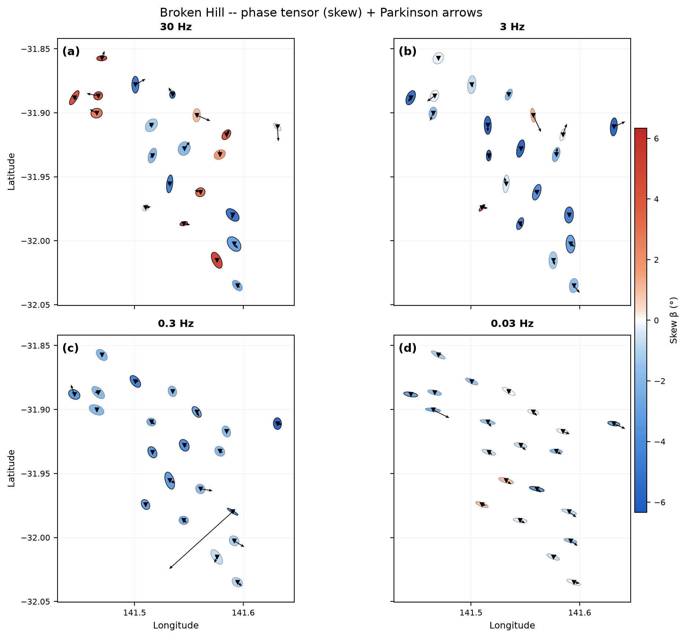
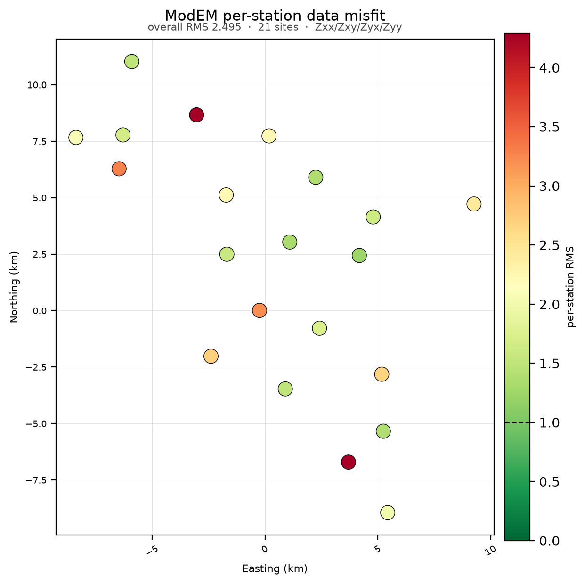
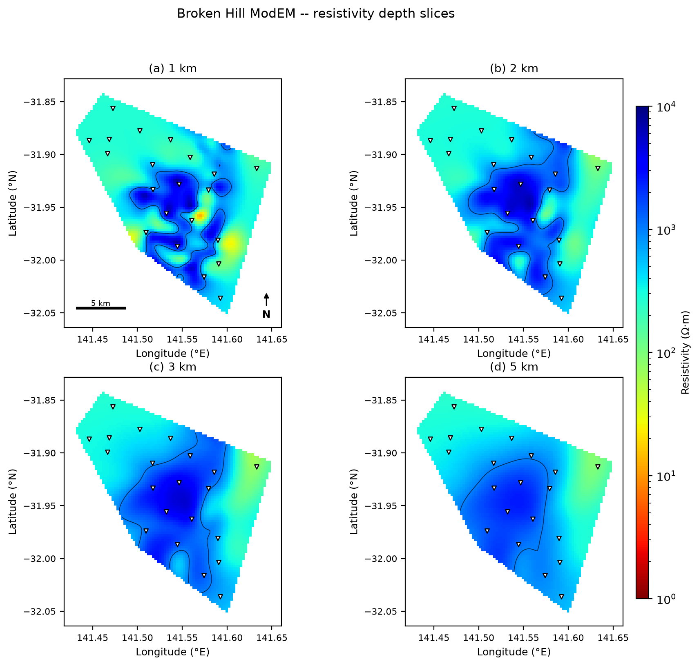
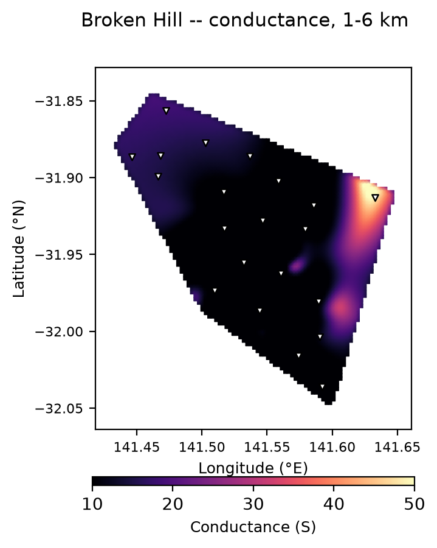
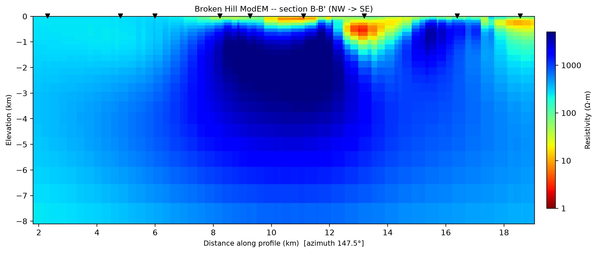

.. _tutorial_model_broken_hill_mt_3d:

Broken Hill: MT Field Data To A 3-D Resistivity Model
=====================================================

Every other tutorial in this section either stops at prepared inversion
input (:doc:`prepare_modem_inversion`) or runs a small synthetic or
profile-scale case. This one follows a single real magnetotelluric survey
all the way through: 21 wideband stations recorded over the world-class
Broken Hill Pb-Zn-Ag deposit (New South Wales, Australia), from the raw
EDI files, through dimensionality analysis and ModEM input construction,
to the **published 3-D inversion model** of AlQahtani et al. (2026) and
its geological interpretation.

The survey, the data, and the model were released open-access with the
paper. pyCSAMT bundles a working subset under ``data/MT/broken-hill``;
see that folder's ``README.md`` for the exact provenance and the
citations you must reproduce if you use the data (repeated under
`See Also`_ below).

What You Will Learn
-------------------

After this tutorial you should be able to:

- load a real EDI survey whose station identifiers are unset in the
  header, and understand why pyCSAMT still keeps the 21 soundings
  distinct;
- run :func:`~pycsamt.emtools.qc.station_confidence_table` and read the
  spread of composite confidence across a small wideband survey;
- decide between a 2-D and a 3-D inversion from
  :func:`~pycsamt.emtools.build_phase_tensor_table` and a
  multi-frequency phase-tensor map, rather than by assumption;
- build native ModEM 3-D input from the EDIs with
  :class:`~pycsamt.models.modem.InputBuilder`;
- load a completed ModEM run with
  :class:`~pycsamt.models.modem.InversionResult`, check how well the
  model fits the data, and render geo-referenced depth maps, a
  depth-integrated conductance map, and an arbitrary-azimuth vertical
  section;
- connect those figures back to the paper's central result -- a
  resistive upper crust hosting discrete shallow conductors on the ore
  horizon.

Starting Point
--------------

The bundled data lives under ``data/MT/broken-hill``:

``edis/``
    21 Phoenix ``EMpower`` EDI exports (``BH_1`` ... ``BH_21``), each
    carrying a full impedance tensor and a vertical-field
    (:term:`tipper`) transfer function.

``final-models/``
    The published ModEM inversion: ``BH_31.dat`` (the observed data with
    its real error floors), ``BH_31_NLCG_030.dat`` (the model response),
    ``BH_31_NLCG_030.res`` (residuals), and the recovered resistivity
    model ``BH_31_NLCG_030.rho`` (WS format).

Every path below is a plain string. To run this tutorial against your own
MT survey, replace ``data/MT/broken-hill/edis`` with your EDI directory;
the inversion-result section needs a completed ModEM run directory in
place of ``data/MT/broken-hill/final-models``.

.. code-block:: pycon
   :linenos:

   >>> from pathlib import Path

   >>> import matplotlib.pyplot as plt
   >>> import numpy as np

   >>> run_root = Path("runs/broken_hill")
   >>> run_root.mkdir(parents=True, exist_ok=True)
   >>> figure_dir = run_root / "figures"
   >>> figure_dir.mkdir(exist_ok=True)

Loading The Survey
------------------

:func:`pycsamt.api.read_edis` reads the directory into a survey object
whose ``.collection`` is the station container the rest of the workflow
uses.

.. code-block:: pycon
   :linenos:

   >>> from pycsamt.api import read_edis

   >>> survey = read_edis(
   ...     "data/MT/broken-hill/edis",
   ...     recursive=False,
   ...     progress=False,
   ... )
   >>> sites = survey.collection
   >>> print(len(sites))
   21

   >>> print(sorted(sites.stations())[:3])
   ['BH_10_imp_rev', 'BH_11_imp', 'BH_12_imp_rev']

Twenty-one stations, keyed by their file stems. That fallback matters
here: ``EMpower`` writes a literal ``DATAID=None`` into every ``>HEAD``
block -- the real station name lives only in ``>INFO`` and the filename
-- so a collection keyed on the header identifier alone would collapse
all 21 soundings onto a single ``"None"`` key. pyCSAMT treats the
placeholder as missing and falls back to the filename stem, which is why
``len(sites)`` is 21 and not 1.

Station Confidence
------------------

:func:`~pycsamt.emtools.qc.station_confidence_table` scores each sounding
on the smoothness, coverage, and internal consistency of its transfer
functions. The ``"composite"`` method blends those into one number in
``[0, 1]``; see :doc:`inspect_and_qc_survey` for the full breakdown.

.. code-block:: pycon
   :linenos:

   >>> from pycsamt.emtools.qc import station_confidence_table

   >>> confidence = station_confidence_table(sites, method="composite", api=True)
   >>> table = confidence.to_pandas(copy=True)
   >>> print(table[["station", "confidence", "coverage"]].head(5).to_string(index=False))
         station  confidence  coverage
   BH_10_imp_rev    0.856651       1.0
       BH_11_imp    0.739758       0.8
   BH_12_imp_rev    0.816676       1.0
   BH_13_imp_rev    0.815596       1.0
   BH_14_imp_rev    0.812210       1.0

   >>> print(round(table["confidence"].min(), 3),
   ...       round(table["confidence"].median(), 3),
   ...       round(table["confidence"].max(), 3))
   0.627 0.778 0.876

Composite confidence runs from 0.63 to 0.88 with a median of 0.78 --
tight for a real survey, and nothing near a rejection threshold. The one
station at ``coverage = 0.8`` (``BH_11``) simply has a shorter usable
band than the rest; that is worth noting before meshing but is not a
reason to drop the station. All 21 move forward.

Every station also carries geographic coordinates and a real tipper,
which is what makes the dimensionality and mapping steps below possible:

.. code-block:: pycon
   :linenos:

   >>> from pycsamt.emtools import ensure_sites

   >>> S = ensure_sites("data/MT/broken-hill/edis", recursive=False)
   >>> n_coord = sum(
   ...     1 for s in S
   ...     if s.coords and np.isfinite(s.coords[0]) and np.isfinite(s.coords[1])
   ... )
   >>> print(n_coord, "/", len(S))
   21 / 21

   >>> lats = np.array([s.coords[0] for s in S])
   >>> lons = np.array([s.coords[1] for s in S])
   >>> print(round(float(np.ptp(lats)), 3), round(float(np.ptp(lons)), 3))
   0.178 0.187

The survey spans about 0.18 degrees in each direction -- roughly 20 km
north-south by 18 km east-west at this latitude -- an areal deployment,
not a single line. That geometry is the first argument for a 3-D
inversion; the phase tensor is the second.

Is The Response 2-D Or 3-D?
---------------------------

A 2-D inversion assumes the subsurface can be described by a single
geoelectric strike, with no along-strike variation. The
:term:`phase tensor` tests that assumption directly: its skew angle
:math:`\beta` is a rotationally invariant measure of three-dimensionality
that is immune to galvanic :term:`static shift`, and
:math:`|\beta| \gtrsim 3^\circ` is the conventional threshold for calling
a response 3-D.

.. code-block:: pycon
   :linenos:

   >>> from pycsamt.emtools import build_phase_tensor_table

   >>> df = build_phase_tensor_table(S)
   >>> print(len(df), df["station"].nunique())
   1953 21

   >>> band = (df["period"] >= 1 / 1000) & (df["period"] <= 1 / 0.008)
   >>> frac_3d = (df.loc[band, "skew"].abs() > 3).mean()
   >>> print(round(float(frac_3d), 3))
   0.397

Across the 0.008-1000 Hz band that the published inversion uses, 40% of
all ``(station, period)`` cells exceed the 3-degree skew threshold. That
is far too much three-dimensionality to justify a 2-D inversion. The
:func:`~pycsamt.emtools.plot_phase_tensor_map_grid` view shows where and
at what frequency it concentrates:

.. code-block:: pycon
   :linenos:

   >>> from pycsamt.emtools import plot_phase_tensor_map_grid

   >>> fig = plot_phase_tensor_map_grid(
   ...     S,
   ...     frequencies=[30.0, 3.0, 0.3, 0.03],
   ...     c_by="skew",
   ...     tipper_convention="parkinson",
   ...     ellipse_scale=1.3,
   ...     station_labels="none",
   ...     ref_ellipse="none",
   ...     suptitle="Broken Hill -- phase tensor (skew) + Parkinson arrows",
   ...     recursive=False,
   ... )
   >>> fig.savefig(figure_dir / "phase_tensor_grid.png", dpi=200, bbox_inches="tight")

   Phase-tensor ellipses filled with skew :math:`\beta` (blue negative,
   red positive) and real induction arrows in the
   :term:`Parkinson convention`, at 30, 3, 0.3 and 0.03 Hz.

At 30 Hz -- shallowest -- the skew is a scatter of blue and red and the
ellipses are short and variably oriented: near-surface 3-D structure. By
0.03 Hz almost every ellipse is a similar pale blue and the long axes
have aligned NW-SE, so the deep section behaves as a coherent 2-D layer.
The induction arrows tell the same story: long at high frequency near the
western stations, short and consistent at low frequency. A shallow
section broken up by 3-D bodies over a simpler deep section is exactly
the case a 2-D inversion cannot represent -- and, as it turns out,
exactly the geology the paper describes.

Building ModEM 3-D Input
------------------------

:class:`~pycsamt.models.modem.ModEmConfig` holds every mesh, error-floor,
and inversion-control choice; :class:`~pycsamt.models.modem.InputBuilder`
turns it plus the sites into a native ModEM run directory. The
configuration below follows the reasoning in :doc:`prepare_modem_inversion`
-- a 250 m core cell to match the 2.5 km station spacing, a 50 m first
earth layer, a resistive 1000 :math:`\Omega\cdot\mathrm{m}` half-space
start because the region is known to be resistive, and the full impedance
tensor because a 3-D area survey cannot lean on a presumed strike.

.. code-block:: pycon
   :linenos:

   >>> from pycsamt.models.modem import ModEmConfig, InputBuilder

   >>> cfg = ModEmConfig(
   ...     mode="3d",
   ...     component_type="Full_Impedance",
   ...     error_floor_z=0.05,
   ...     initial_rho=1000.0,
   ...     n_airlayers=6,
   ...     cell_size_h=250.0,
   ...     cell_size_v_top=50.0,
   ...     depth_scale=1.1,
   ...     n_padding_xy=7,
   ...     nz=45,
   ...     smooth_x=0.3,
   ...     smooth_y=0.3,
   ...     smooth_z=0.3,
   ...     n_smooth_iter=2,
   ...     max_iterations=100,
   ...     target_rms=1.05,
   ...     binary_3d="Mod3DMT",
   ... )
   >>> workdir = run_root / "modem_input"
   >>> written = InputBuilder(config=cfg).build(sites, workdir=workdir)
   >>> print(sorted(p.name for p in workdir.iterdir()))
   ['control.inv', 'covariance.cov', 'data.dat', 'fwd_control.ctrl', 'm0.ws']

   >>> from pycsamt.models.modem import ModEmData

   >>> built = ModEmData.read(written["data"])
   >>> print(built.n_sites, built.n_periods)
   21 100

The builder keeps every frequency present in the EDI files -- 100 of them
here. A production run would decimate to roughly 7 per decade first
(:doc:`prepare_occam2d_inversion` shows
:class:`~pycsamt.stratagem.qc.FrequencyFilter` doing exactly that); the
published Broken Hill run used 24 periods over 0.003-333 s. Running
``Mod3DMT`` on ``workdir`` is an external step covered in
:doc:`run_classical_inversions`. The rest of this tutorial picks up from
the authors' completed run.

The Published Inversion
-----------------------

:class:`~pycsamt.models.modem.InversionResult` scans a run directory and
loads whatever it finds -- models, observed and predicted data,
covariance, control, and log.

.. code-block:: pycon
   :linenos:

   >>> from pycsamt.models.modem import InversionResult

   >>> result = InversionResult("data/MT/broken-hill/final-models")
   >>> print(result.mode, sorted(result.models))
   3d ['iter_0030']

   >>> model = result.model_final
   >>> print(model.shape)
   (55, 120, 129)

   >>> rho = model.rho_linear
   >>> print(tuple(int(v) for v in np.percentile(rho, [2, 50, 98])))
   (55, 247, 1858)

The recovered model is a 129 x 120 cell grid, 55 layers deep. Its
resistivity runs from about 55 :math:`\Omega\cdot\mathrm{m}` at the
conductive 2nd percentile to about 1860 :math:`\Omega\cdot\mathrm{m}` at
the resistive 98th, with a median near 250 -- a resistive model with a
conductive tail, the numeric signature of "mostly resistive crust with a
few discrete conductors".

Before interpreting the model, check that it actually fits the data.
:class:`~pycsamt.models.modem.plot.PlotMisfitMap` computes the
normalised root-mean-square misfit per station and overall.

.. code-block:: pycon
   :linenos:

   >>> from pycsamt.models.modem.plot import PlotMisfitMap

   >>> fig = PlotMisfitMap(
   ...     result=result,
   ...     use_lonlat=False,
   ...     show_line_labels=False,
   ... ).plot()
   >>> fig.savefig(figure_dir / "misfit_map.png", dpi=200, bbox_inches="tight")

   Per-station impedance misfit for the published model. The subtitle
   reports the overall RMS.

The overall impedance RMS is about 2.5, and most stations sit between 1.5
and 2.5 (green to pale yellow). Two stations reach RMS ~4 (dark red).
That is a real, honestly-not-converged inversion: RMS 2.5 is well above
the ideal target of 1.0, so absolute resistivity values and sharp
boundaries carry less weight than the broad-scale contrast between
resistive and conductive domains. No ModEM ``.log`` ships with the
published model, so the iteration-by-iteration RMS history is not
available; ``result.final_rms`` is ``nan`` for that reason.

Geo-Referenced Depth Maps
-------------------------

:class:`~pycsamt.models.modem.plot.PlotDepthMap` draws horizontal slices
as geographic maps. ModEM data files reduce longitude by 100 degrees
(the Broken Hill origin reads ``41.53481``), so the true value is passed
explicitly as ``origin_lon``.

.. code-block:: pycon
   :linenos:

   >>> from pycsamt.models.modem.plot import PlotDepthMap

   >>> origin = dict(origin_lat=-31.95556, origin_lon=141.53481)
   >>> fig = PlotDepthMap(
   ...     result,
   ...     depths={"(a) 1 km": 1000, "(b) 2 km": 2000,
   ...             "(c) 3 km": 3000, "(d) 5 km": 5000},
   ...     rho_range=(1, 10000),
   ...     mask_outside_hull=True,
   ...     contours=[1000],
   ...     scalebar=True,
   ...     north_arrow=True,
   ...     title="Broken Hill ModEM -- resistivity depth slices",
   ...     **origin,
   ... ).plot()
   >>> fig.savefig(figure_dir / "depth_slices.png", dpi=200, bbox_inches="tight")

   Resistivity at 1, 2, 3 and 5 km. ``mask_outside_hull=True`` blanks
   cells beyond the station convex hull; the black line is the
   1000 :math:`\Omega\cdot\mathrm{m}` contour.

The crust is resistive everywhere (blue, > 1000 :math:`\Omega\cdot\mathrm{m}`),
and the resistive core inside the 1000 :math:`\Omega\cdot\mathrm{m}`
contour grows with depth. At 1 km a handful of small conductive patches
(yellow, < 30 :math:`\Omega\cdot\mathrm{m}`) sit along the station line
in the centre of the survey; by 3 km they have faded. Shallow, discrete,
and shrinking downward -- consistent with mineralised horizons rather
than a deep-rooted conductor.

The most compact single view is a **conductance** map, the depth integral
of conductivity over a window,
:math:`S = \int_{z_1}^{z_2} \sigma \, dz`, in siemens.

.. code-block:: pycon
   :linenos:

   >>> fig = PlotDepthMap(
   ...     result,
   ...     quantity="conductance",
   ...     conductance_window=(1000, 6000),
   ...     render="gouraud",
   ...     cmap="magma",
   ...     norm="linear",
   ...     rho_range=(10, 50),
   ...     smooth_sigma=0.8,
   ...     mask_outside_hull=True,
   ...     station_color="white",
   ...     cbar_orientation="horizontal",
   ...     title="Broken Hill -- conductance, 1-6 km",
   ...     **origin,
   ... ).plot()
   >>> fig.savefig(figure_dir / "conductance.png", dpi=200, bbox_inches="tight")

   Conductance integrated over 1-6 km. ``render="gouraud"`` interpolates
   between cell centres for the smooth appearance used in published
   conductance maps.

The interior of the survey is resistive (dark, ~10 S). The conductive
anomalies (yellow, up to ~50 S) form an arc along the eastern and
south-eastern margin, over the mapped trace of the sulphide-bearing
Broken Hill Group. This is the map an MT mineral survey is usually
reduced to before it is overlaid on geology and potential-field data.

A Vertical Section
------------------

:class:`~pycsamt.models.modem.plot.PlotSection` in arbitrary-azimuth mode
cuts the model along any geographic line. A NW-SE cut runs across the
regional structural grain.

.. code-block:: pycon
   :linenos:

   >>> from pycsamt.models.modem.plot import PlotSection

   >>> fig = PlotSection(
   ...     result=result,
   ...     start_point=(-31.860, 141.490),
   ...     end_point=(-32.020, 141.610),
   ...     use_latlon=True,
   ...     origin_lat=-31.95556,
   ...     origin_lon=141.53481,
   ...     n_samples=320,
   ...     depth_max=8000.0,
   ...     rho_min=1.0,
   ...     rho_max=5000.0,
   ...     show_station_names=False,
   ...     station_tol=2500.0,
   ...     figsize=(11.5, 4.6),
   ...     title="Broken Hill ModEM -- section B-B' (NW -> SE)",
   ... ).plot()
   >>> fig.savefig(figure_dir / "section.png", dpi=200, bbox_inches="tight")

   NW-SE section across strike. ``depth_max=8000`` clips the featureless
   deep model the shallow survey does not constrain.

The section resolves what the depth maps only hint at: the conductors
(red/orange, < 10 :math:`\Omega\cdot\mathrm{m}`) are discrete bodies
confined to the top ~1.5 km of an otherwise uniformly resistive
(> 1000 :math:`\Omega\cdot\mathrm{m}`) crust. There is no conductive
pathway connecting them downward. Because the section is defined by
latitude and longitude it can be drawn along the exact trace of a mapped
geological cross-section for a one-to-one comparison -- which is how the
paper ties each conductor to a specific unit of the Broken Hill Group.

What The Model Means
--------------------

Read together, the figures reproduce the paper's central observation. The
Broken Hill mineral system -- one of the largest lead-zinc-silver
deposits ever found -- sits in a **predominantly resistive upper crust**.
The only conductive anomalies are small, shallow (< 3 km), and
spatially tied to the sulphide-rich Broken Hill Group, chiefly the Hores
Gneiss. Crucially, none of them connects downward to a lower-crustal
conductor.

That matters for exploration. The prevailing "source-to-sink" model
expects a major ore system to be underlain by a steep, crustal-scale
conductive pathway that once carried metal-bearing fluids. Broken Hill
does not preserve one: the authors argue it was severed during
granulite-facies metamorphism and later orogeny, leaving only the shallow
mineralised horizons behind. Had the deposit's geology been hidden under
sedimentary cover, an exploration program that chased large conductors
would have walked straight past it. A resistive MT signature is not, on
its own, evidence of a barren crust.

Reusing This With Your Own Data
-------------------------------

1. Point :func:`~pycsamt.api.read_edis` at your EDI directory. Check
   ``len(sites)`` against the file count -- if it collapses, your EDIs
   likely share a placeholder ``DATAID``, which pyCSAMT already works
   around by station filename.
2. Run :func:`~pycsamt.emtools.qc.station_confidence_table` and look at
   the low-confidence tail before meshing.
3. Use :func:`~pycsamt.emtools.build_phase_tensor_table` and
   :func:`~pycsamt.emtools.plot_phase_tensor_map_grid` to choose 2-D or
   3-D. High skew over a meaningful frequency range, or an areal station
   layout, both point to 3-D.
4. Build input with :class:`~pycsamt.models.modem.InputBuilder`, decimate
   the frequency band, and run ``Mod3DMT`` externally
   (:doc:`run_classical_inversions`).
5. Load the finished run with
   :class:`~pycsamt.models.modem.InversionResult`, check
   :class:`~pycsamt.models.modem.plot.PlotMisfitMap` first, and only then
   interpret :class:`~pycsamt.models.modem.plot.PlotDepthMap` and
   :class:`~pycsamt.models.modem.plot.PlotSection`.

See Also
--------

:doc:`prepare_modem_inversion`
    The full ``ModEmConfig``/``InputBuilder`` walkthrough, including how
    each mesh and error-floor number is justified from the data.
:doc:`run_classical_inversions`
    Compiling and running ``Mod3DMT`` (and Occam2D, MARE2DEM), and why
    most environments should treat the run step as a dry run.
:doc:`../user_guide/emtools/tensor`
    The phase-tensor toolkit in depth, including
    ``plot_phase_tensor_map_grid``.
:doc:`../user_guide/models/modem`
    The ModEM integration layer, ``PlotDepthMap``, and ``PlotSection``.
``data/MT/broken-hill/README.md``
    Full data provenance, the survey characteristics, and the required
    citations.

If you use the Broken Hill data or model, cite both the article and the
data release, given in full below.

.. dropdown:: Data and model citation
   :animate: fade-in
   :color: secondary

   AlQahtani, Y., Ozaydin, S., Chatzaras, V., Rey, P. F., & Passos, T.
   (2026). Why does the Broken Hill deposit sit in resistive crust?
   Magnetotelluric evidence for metamorphic decoupling of a world-class
   mineral system. *Journal of Geophysical Research: Solid Earth*,
   **131**, e2026JB035666. `<https://doi.org/10.1029/2026JB035666>`__

   AlQahtani, Y., Ozaydin, S., Chatzaras, V., Rey, P. F., & Passos, T.
   (2026). Open data for the article "Why does the Broken Hill deposit
   sit in resistive crust?". *Zenodo*.
   `<https://doi.org/10.5281/zenodo.21272106>`__

The survey was acquired by the University of Sydney; the authors
acknowledge the Wilyakali/Wiljagali people, Traditional Custodians of the
land on which it was recorded. The inversion used ModEM (Kelbert et al.,
2014, *Computers & Geosciences* 66, 40-53).
