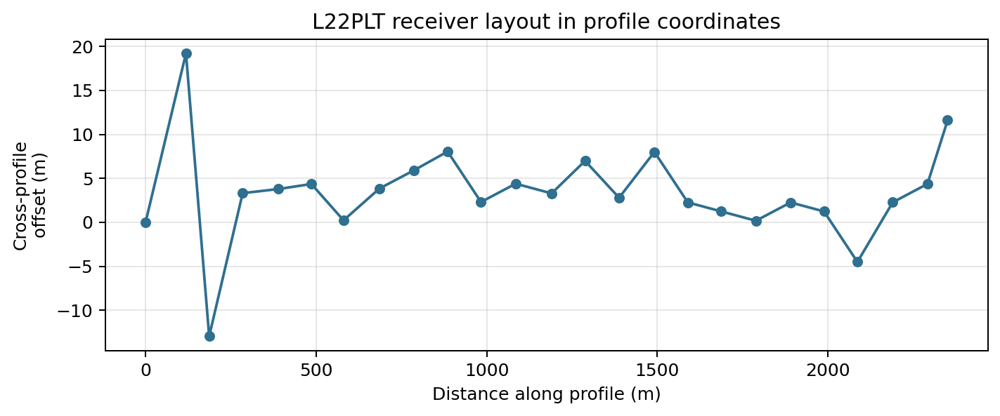
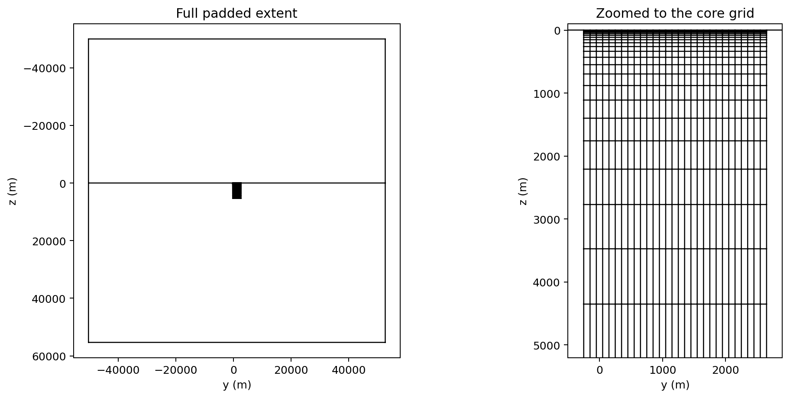

.. _tutorial_prepare_mare2dem_inversion:

Prepare A MARE2DEM Inversion
============================

The two previous tutorials prepared :term:`Occam2D` and :term:`ModEM` runs.
:term:`MARE2DEM` is the third classical engine pyCSAMT integrates, and its
practical entry point is different from both: rather than a mesh built
automatically from station spacing, MARE2DEM starts from a resistivity grid
and topology the user assembles explicitly, then triangulates through a
:term:`PSLG` ``.poly`` file. This tutorial builds that file set from a real
single-line AMT profile, the WILLY ``L22PLT`` line -- 25 stations bundled
with pyCSAMT, not synthetic data.

1. load and QC one AMT profile;
2. convert it to a native MARE2DEM ``.emdata`` file with
   :func:`~pycsamt.models.mare2dem.edi.make_mt_data_from_edi`, an EDI bridge
   that mirrors the ZMM path already documented for MARE2DEM;
3. reason about a starting resistivity grid from the line's own station
   spacing and apparent-resistivity range;
4. build the ``.poly``/``.resistivity``/``.settings`` files with
   :func:`~pycsamt.models.mare2dem.grid_to_m2d.grid_to_mare2dem`;
5. validate the native file set and inspect the triangulation boundary;
6. hand a dry-run command to an external MARE2DEM executable.

Like :doc:`prepare_occam2d_inversion` and :doc:`prepare_modem_inversion`,
this stops short of actually running MARE2DEM -- pyCSAMT does not vendor a
compiled binary, and this documentation build has none either. See
:doc:`run_classical_inversions` for what happens once a real executable is
available, and note up front that MARE2DEM is the one classical engine here
without CLI support: everything below is Python only.

What You Will Learn
-------------------

After this tutorial you should be able to:

- convert a real EDI profile into a MARE2DEM ``.emdata`` file with
  :func:`~pycsamt.models.mare2dem.edi.make_mt_data_from_edi`, and know how
  its station-name, TE/TM, and error-floor conventions map from the
  underlying EDI impedances;
- design a Y/Z resistivity grid whose cell size and padding are justified by
  the line's own station spacing and :term:`skin depth` range;
- turn that grid into a native MARE2DEM file set with
  :func:`~pycsamt.models.mare2dem.grid_to_m2d.grid_to_mare2dem`, and read
  back how many triangulation nodes, segments, and free/fixed regions it
  produced;
- recognize two real naming inconsistencies between ``grid_to_mare2dem``'s
  output and :class:`~pycsamt.models.mare2dem.config.Mare2DEMConfig` before
  they cause a failed run;
- inspect the ``.poly`` boundary at both the full padded extent and the
  zoomed-in core region, and know why the first view alone is misleading;
- build a dry-run :class:`~pycsamt.models.mare2dem.runner.Mare2DEMRunner`
  command for the file set prepared here.

When To Prepare A MARE2DEM Run
------------------------------

``L22PLT`` is a single profile line, the same kind of geometry
:doc:`prepare_occam2d_inversion` used for Occam2D. The choice between the two
engines for a profile-shaped survey is rarely about the data -- both read the
same impedances -- and mostly about what the deliverable needs to be:

* an Occam2D run gives a smooth, regularized rectangular-cell section;
* a MARE2DEM run gives an adaptive triangular-element section that can carry
  topography, bathymetry, and irregular boundaries explicitly, at the cost of
  managing an external MPI build and a genuine finite-element mesh instead of
  a rectangular grid.

:doc:`../user_guide/models/choosing_backend` frames MARE2DEM as the right
choice "when the native file set and engine-specific control are part of the
scientific workflow" -- true here as soon as the ``.poly`` geometry itself,
not only the inverted model, becomes something worth reviewing and
archiving.

Load And QC The Profile
-----------------------

Loading and QC follow the same path as the Occam2D and ModEM tutorials --
:func:`pycsamt.api.read_edis` followed by
:func:`pycsamt.emtools.qc.station_confidence_table` -- pointed at one WILLY
line directory this time.

.. code-block:: pycon
   :linenos:

   >>> from pathlib import Path

   >>> from pycsamt.api import read_edis
   >>> from pycsamt.emtools.qc import station_confidence_table

   >>> run_root = Path("runs")
   >>> run_root.mkdir(exist_ok=True)

   >>> survey = read_edis(
   ...     "data/AMT/WILLY_DATA/L22PLT",
   ...     recursive=False,
   ...     strict=False,
   ...     progress=False,
   ... )
   >>> sites = survey.collection
   >>> print(len(sites))
   25

   >>> confidence = station_confidence_table(sites, method="composite", api=True)
   >>> table = confidence.to_pandas(copy=True)
   >>> print(round(table["confidence"].min(), 4), round(table["confidence"].median(), 4),
   ...       round(table["confidence"].max(), 4))
   0.5419 0.6992 0.8087

Composite confidence spans 0.54 to 0.81 with a median of 0.70 -- close to the
``L18PLT`` numbers from :doc:`prepare_occam2d_inversion`, and, like that
line, nothing here forces a rejection before conversion.

Convert To Native MARE2DEM Data
-------------------------------

:func:`~pycsamt.models.mare2dem.edi.make_mt_data_from_edi` is the EDI-to-
MARE2DEM bridge: each EDI's impedance tensor becomes a
:class:`~pycsamt.models.mare2dem.zmm.ZMMStation` (TE from :math:`Z_{xy}`, TM
from :math:`Z_{yx}`), which then flows through the same profile-projection
and error-floor pipeline the ZMM path already uses. It accepts the same kind
of survey source as the Occam2D and ModEM builders -- the in-memory ``sites``
collection from above, not only a bare path.

.. code-block:: pycon
   :linenos:

   >>> from pycsamt.models.mare2dem.edi import make_mt_data_from_edi

   >>> workdir = run_root / "line22_mare2dem"
   >>> em = make_mt_data_from_edi(
   ...     sites,
   ...     workdir / "line22.emdata",
   ...     error_floor_te=0.05,
   ...     error_floor_tm=0.05,
   ... )
   >>> print(em.n_mt_receivers, em.n_mt_frequencies, em.n_data)
   25 53 5300

   >>> freqs = em.mt.frequencies
   >>> print(round(freqs.min(), 3), round(freqs.max(), 1))
   1.008 10400.0

5300 rows is exactly ``25 receivers x 53 frequencies x 4`` -- TE apparent
resistivity, TE phase, TM apparent resistivity, and TM phase per
station-frequency, with no tipper rows because this line's EDIs carry none.
The 5% error floors match the same order of magnitude used for Occam2D's
``error_floor_rho`` and ModEM's ``error_floor_z`` in the earlier tutorials.

Each receiver's position in ``em.mt.receivers`` is already profile-projected
-- column 0 is the cross-profile offset, column 1 the along-profile
distance -- from an automatically detected line orientation, not raw
latitude/longitude:

.. code-block:: pycon
   :linenos:

   >>> import numpy as np

   >>> receivers = em.mt.receivers
   >>> x_profile, y_profile = receivers[:, 0], receivers[:, 1]
   >>> print(round(y_profile.min(), 1), round(y_profile.max(), 1))
   0.0 2351.3
   >>> print(round(x_profile.min(), 1), round(x_profile.max(), 1))
   -13.0 19.2

A plot in these profile coordinates -- not equal-aspect, deliberately, so a
small deviation is still visible -- shows how close to a straight line the
real receivers actually fall:

.. code-block:: pycon
   :linenos:

   >>> import matplotlib.pyplot as plt

   >>> figure_dir = workdir / "figures"
   >>> figure_dir.mkdir(parents=True, exist_ok=True)

   >>> fig, ax = plt.subplots(figsize=(9.0, 3.2))
   >>> ax.plot(y_profile, x_profile, "o-", color="#2f6f8f", markersize=5)
   >>> xlab = ax.set_xlabel("Distance along profile (m)")
   >>> ylab = ax.set_ylabel("Cross-profile\noffset (m)")
   >>> title = ax.set_title("L22PLT receiver layout in profile coordinates")
   >>> ax.grid(True, alpha=0.3)
   >>> fig.savefig(figure_dir / "receiver_profile.png", dpi=180, bbox_inches="tight")

   25 receivers spread over 2351 m of profile distance. Most sit within
   about +-10 m of the profile line, well under 1% of the line length, but
   one adjacent pair near 100-200 m swings from +19 m to -13 m -- a real,
   single local kink rather than the two most distant stations, which
   actually sit back on-line at either end. The automatically detected line
   orientation is doing its job overall: this is a genuinely 2-D-appropriate
   profile, but that one kink is worth a field-note check before trusting a
   perfectly straight projection near those two stations.

Reason About The Starting Grid
------------------------------

Apparent resistivity across every TE and TM row on this line sets the same
kind of :term:`skin depth` argument used for the ModEM mesh in
:doc:`prepare_modem_inversion`:

.. code-block:: pycon
   :linenos:

   >>> data = em.data
   >>> rho_mask = np.isin(data[:, 0], [123, 125])
   >>> rho = 10.0 ** data[rho_mask, 4]
   >>> print(rho_mask.sum())
   2650
   >>> print(round(np.median(rho), 1), round(np.percentile(rho, 95), 1), round(rho.max(), 1))
   495.5 11571.4 113086.5

Type codes ``123``/``125`` are MARE2DEM's TE/TM log10-apparent-resistivity
rows, so ``10 ** data[rho_mask, 4]`` recovers linear :math:`\Omega\cdot`m
directly from the data block written above. The median, 495.5
:math:`\Omega\cdot\mathrm{m}`, is a reasonable homogeneous starting value.
The maximum, over 113000 :math:`\Omega\cdot\mathrm{m}`, is not: it is a
handful of noisy short-period rows at the resistive tail, not evidence of a
real 113 k\ :math:`\Omega\cdot\mathrm{m}` structure, so the 95th percentile
is the more defensible number for sizing how far the mesh needs to reach
rather than the true maximum.

.. code-block:: pycon
   :linenos:

   >>> from pycsamt.models.modem import skin_depth

   >>> rho_median = float(np.median(rho))
   >>> print(round(skin_depth(period=1.0 / freqs.max(), rho=rho_median), 1))
   109.9
   >>> print(round(skin_depth(period=1.0 / freqs.min(), rho=rho_median), 1))
   11158.8
   >>> print(round(skin_depth(period=1.0 / freqs.min(), rho=np.percentile(rho, 95)), 1))
   53924.0

The shortest-period skin depth at the median resistivity is about 110 m, and
the longest-period skin depth at the 95th-percentile resistivity is about
54 km. Those two numbers bound the vertical grid from both ends: cells near
the top need to be a small fraction of 110 m, and whatever sits beyond the
"core" grid needs to extend comfortably past 54 km before the model boundary
can be treated as electromagnetically transparent -- exactly the job
``grid_to_mare2dem``'s padding region does below.

.. code-block:: pycon
   :linenos:

   >>> y_c = np.arange(y_profile.min() - 200.0, y_profile.max() + 200.0 + 100.0, 100.0)
   >>> print(len(y_c), y_c.min(), y_c.max())
   29 -200.0 2600.0

   >>> z_top, growth, n_z = 10.0, 1.25, 22
   >>> z_c = [z_top / 2.0]
   >>> thickness = z_top
   >>> for _ in range(n_z - 1):
   ...     z_c.append(z_c[-1] + thickness / 2.0 + thickness * growth / 2.0)
   ...     thickness *= growth
   >>> z_c = np.array(z_c)
   >>> print(len(z_c), round(z_c.min(), 1), round(z_c.max(), 1))
   22 5.0 4838.9

29 horizontal cells at 100 m -- close to the average 98 m station spacing --
cover the line plus a 200 m margin on each side. 22 vertical cells growing by
a factor of 1.25 from a 5 m first cell centre reach a cell-centre depth of
about 4.8 km: well past the 110 m shallow skin depth many times over, and a
deliberately shallower "core" than the 54 km long-period skin depth --
consistent with normal 2.5-D practice, where the core grid resolves the
target depth range and a much larger fixed-resistivity padding region (added
next) absorbs the far-field boundary condition instead.

Build The Mesh And Starting Model
---------------------------------

:func:`~pycsamt.models.mare2dem.grid_to_m2d.grid_to_mare2dem` turns the
``Y``/``Z``/``Rho`` grid into the triangulation boundary (``.poly``), a
homogeneous starting model (``.resistivity``), and a ``.settings`` file in
one call.

.. code-block:: pycon
   :linenos:

   >>> from pycsamt.models.mare2dem.grid_to_m2d import grid_to_mare2dem

   >>> Y, Z = np.meshgrid(y_c, z_c)
   >>> Rho = np.full(Y.shape, rho_median)

   >>> files = grid_to_mare2dem(
   ...     Y, Z, Rho,
   ...     padding_y=50000.0,
   ...     padding_z=50000.0,
   ...     out_dir=workdir,
   ...     model_name="line22",
   ...     data_file="line22.emdata",
   ...     target_misfit=1.0,
   ...     max_iterations=100,
   ... )
   >>> for role, path in sorted(files.items()):
   ...     print(role, path.name)
   poly line22.poly
   resistivity line22.0.resistivity
   settings mare2dem.settings

Two of those three names deserve a second look before they surprise anyone.
``resistivity`` came back as ``line22.0.resistivity``, not ``line22.resistivity``
-- ``grid_to_mare2dem`` always numbers its output as iteration 0, the same
convention the bundled ``demo.0.resistivity``/``demo.6.resistivity`` samples
in :doc:`../user_guide/models/mare2dem` use for iteration snapshots. And
``settings`` came back as the literal ``mare2dem.settings`` regardless of
``model_name="line22"`` -- the function hard-codes that filename rather than
deriving it from the model stem.

50 km of padding in both directions is comfortably past the 54 km long-period
skin depth estimated above -- inspect the file contents to see exactly what
that padding produced:

.. code-block:: pycon
   :linenos:

   >>> from pycsamt.models.mare2dem.iotools.poly import read_poly
   >>> from pycsamt.models.mare2dem.iotools.resistivity import read_resistivity

   >>> poly = read_poly(files["poly"])
   >>> print(len(poly.nodes), len(poly.segments), len(poly.regions))
   696 1335 640

   >>> resistivity = read_resistivity(files["resistivity"])
   >>> free = np.asarray(resistivity.free_parameter).ravel()
   >>> print(int((free != 0).sum()), int((free == 0).sum()))
   638 2

638 of the 640 regions are :term:`free parameter`\ s -- the 22 x 29 grid
cells built above -- and exactly 2 are fixed: the air layer and the outer
ground-padding region ``grid_to_mare2dem`` adds automatically, both held at
a reference resistivity rather than inverted.

Inspect The Triangulation Boundary
----------------------------------

``plot_poly`` draws the PSLG geometry directly, exactly as
:doc:`../user_guide/models/mare2dem` uses it. Plotting the full extent first,
then zooming to the core, shows why the first view alone is misleading:

.. code-block:: pycon
   :linenos:

   >>> from pycsamt.models.mare2dem import plot_poly

   >>> fig, axes = plt.subplots(1, 2, figsize=(11.5, 5.0), constrained_layout=True)

   >>> plot_poly(files["poly"], ax=axes[0])
   >>> title_full = axes[0].set_title("Full padded extent")

   >>> plot_poly(files["poly"], ax=axes[1])
   >>> axes[1].set_xlim(-500, 2900)
   >>> axes[1].set_ylim(5200, -100)
   >>> title_zoom = axes[1].set_title("Zoomed to the core grid")

   >>> fig.savefig(figure_dir / "poly_mesh.png", dpi=180, bbox_inches="tight")

   Left: the full 100 km x 100 km padded extent -- the entire 2.35 km x
   4.8 km core survives only as a small dark mark near the middle. That is
   not a plotting mistake; it is the direct, visible consequence of needing
   50 km of padding on a 2.35 km line. Right: the same file, zoomed to the
   core region, showing the real 29-column, 22-row grid with cells
   thickening geometrically downward, exactly as built above. Always
   generate both views -- the full extent to confirm the padding reaches far
   enough, and the zoomed view to confirm the core survived the trip intact.

Validate The Native Files
-------------------------

``detect_file_type`` classifies MARE2DEM files by filename pattern, whether
or not they exist -- useful here because ``line22.0.resistivity`` and
``mare2dem.settings`` are exactly the kind of non-obvious names worth
double-checking.

.. code-block:: pycon
   :linenos:

   >>> from pycsamt.models.mare2dem import detect_file_type

   >>> emdata_path = workdir / "line22.emdata"
   >>> for path in (emdata_path, files["poly"], files["resistivity"], files["settings"]):
   ...     print(path.name, "->", detect_file_type(path))
   line22.emdata -> Mare2DEMFileType.EMDATA
   line22.poly -> Mare2DEMFileType.POLY
   line22.0.resistivity -> Mare2DEMFileType.RESISTIVITY
   mare2dem.settings -> Mare2DEMFileType.SETTINGS

All four files are recognized under their real, slightly inconsistent names
-- naming quirks are not the same problem as naming failures.

Hand Off To MARE2DEM
--------------------

:class:`~pycsamt.models.mare2dem.runner.Mare2DEMRunner` builds the exact
command an external ``MARE2DEM`` executable would need. Pass the model stem
directly here -- ``"line22"`` -- rather than
:attr:`Mare2DEMConfig.resistivity_stem`, which would incorrectly return
``"line22.0"`` if ``resistivity_file`` were set to the ``.0.resistivity``
name ``grid_to_mare2dem`` actually wrote.

.. code-block:: pycon
   :linenos:

   >>> from pycsamt.models.mare2dem import Mare2DEMConfig, Mare2DEMRunner

   >>> cfg = Mare2DEMConfig(
   ...     binary="MARE2DEM",
   ...     use_mpi=True,
   ...     n_procs=8,
   ...     mpi_command="mpirun",
   ... )
   >>> runner = Mare2DEMRunner(workdir, config=cfg)
   >>> print(runner.command("line22"))
   mpirun -np 8 MARE2DEM line22

There is no bundled MARE2DEM binary, so this is exactly what would run once
a compiled executable resolves through ``PATH``, ``<source_dir>/<binary>``,
or the platform user-data location -- see
:doc:`../user_guide/models/mare2dem` for ``SourceManager``, which can
download and build MARE2DEM given MPI Fortran/C tooling and Intel MKL, and
:doc:`run_classical_inversions` for the shared run/load recipe across all
three classical engines.

No CLI Support Yet
------------------

Unlike Occam2D and ModEM, MARE2DEM has no ``pycsamt invert`` command-group
support -- ``--solver`` only accepts ``occam2d`` or ``modem``. Everything in
this tutorial is Python-only for now; there is no CLI equivalent to fall
back on.

Preparation Checklist
---------------------

Before handing this directory to a real MARE2DEM executable, confirm that:

- the line's automatically detected orientation and profile projection look
  right -- plot cross-profile offset, not just trust it;
- ``initial_rho`` came from the line's own median apparent resistivity, not
  an arbitrary round number;
- the padded extent clears the longest-period :term:`skin depth` estimated
  from a defensible high percentile of observed resistivity, not the raw
  maximum;
- the core grid's first cell is a small fraction of the shortest-period skin
  depth;
- ``free_parameter`` correctly separates the real earth cells from the fixed
  air/padding regions;
- the resistivity file's actual name (``<model_name>.0.resistivity``) and
  the settings file's actual name (always ``mare2dem.settings``) are used
  consistently, not assumed from ``Mare2DEMConfig`` field names;
- the runner is given the real model stem explicitly, not
  ``cfg.resistivity_stem``, whenever the resistivity filename contains an
  iteration number;
- ``detect_file_type`` recognizes every file the run needs.

Troubleshooting
---------------

The resistivity filename has an unexpected ``.0.`` in it
    Expected. ``grid_to_mare2dem`` always writes ``<model_name>.0.resistivity``.
    Pass the plain model stem to ``runner.command``/``runner.run`` rather
    than relying on ``cfg.resistivity_stem``.

The settings filename ignored ``model_name``
    Expected. ``grid_to_mare2dem`` always writes ``mare2dem.settings``.
    Rename it after the call if a project convention needs a different name.

The full-extent ``.poly`` plot shows almost nothing
    Expected once padding is many times larger than the survey. Zoom to the
    core region -- ``ax.set_xlim``/``set_ylim`` after calling ``plot_poly``
    -- to inspect the actual grid.

The runner reports the MARE2DEM binary was not found
    Expected without a locally built executable. See
    :doc:`../user_guide/models/mare2dem`'s ``SourceManager`` section for
    download/build prerequisites (MPI Fortran/C tooling, Intel MKL).

``pycsamt invert build --solver mare2dem`` does not exist
    Correct -- use the Python API shown here; the CLI only wraps Occam2D and
    ModEM so far.

See Also
--------

:doc:`prepare_occam2d_inversion`
    The 2-D Occam2D counterpart to this tutorial, on a different WILLY line.

:doc:`prepare_modem_inversion`
    The 3-D ModEM counterpart, on the full five-line WILLY area survey.

:doc:`run_classical_inversions`
    Locating or building the MARE2DEM executable and running the files
    prepared here.

:doc:`../user_guide/models/mare2dem`
    Full MARE2DEM backend documentation, including CSEM data, merge/noise
    utilities, plotting, and result loading.

:doc:`../user_guide/models/choosing_backend`
    Deciding between Occam2D, ModEM, MARE2DEM, and other backends.

:ref:`inversion_concepts`
    Misfit, regularization, and inversion diagnostics referenced throughout
    this tutorial.

:doc:`../api/models`
    Generated API reference for the MARE2DEM objects used here.
