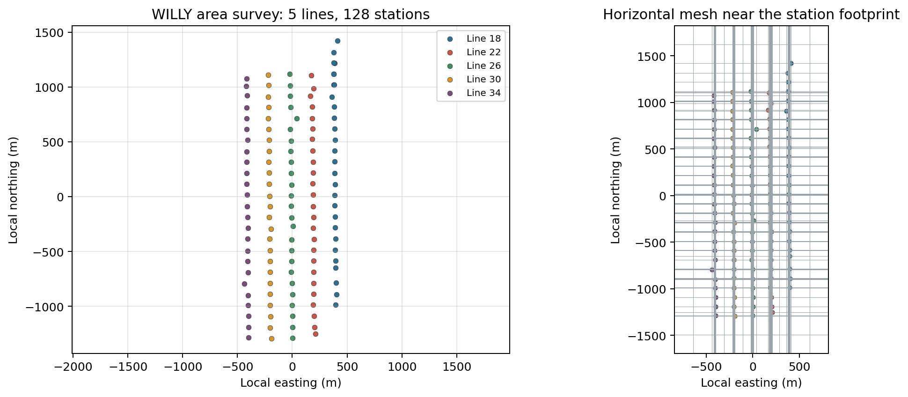
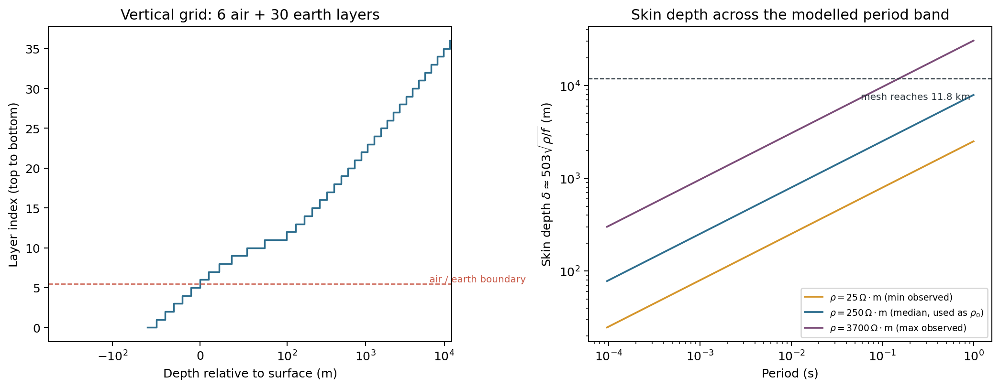
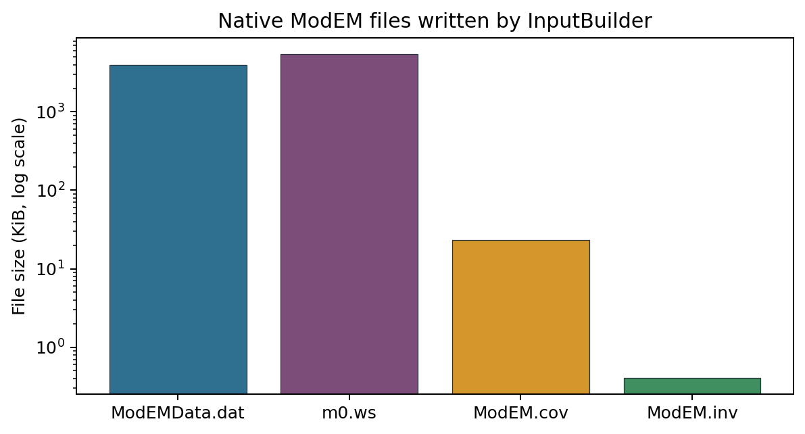

.. _tutorial_prepare_modem_inversion:

Prepare A ModEM Inversion
=========================

The previous tutorial built a 2-D :term:`Occam2D` run from a single AMT
profile. Many surveys are not single profiles, though: stations are laid out
over an area to resolve structure that also varies across strike, and a
smooth 2-D section along one line cannot represent that. This tutorial
prepares a 3-D :term:`ModEM` run for exactly that case, using the real
five-line WILLY AMT survey bundled with pyCSAMT. It follows the same
practical arc as the Occam2D tutorial, but the center of gravity is
different: building a defensible 3-D :term:`mesh` is most of the work, and
the native :term:`ModEM` file set follows once the mesh and data selection
are settled.

1. load and QC the full multi-line AMT survey;
2. choose a :class:`~pycsamt.models.modem.ModEmConfig` for a 3-D run, reasoning
   from the data's own frequency band and resistivity range rather than from
   defaults;
3. build the native data, model, :term:`covariance`, and control files with
   :class:`~pycsamt.models.modem.InputBuilder`;
4. inspect the resulting horizontal and vertical grids before trusting them;
5. validate the native file set and hand a dry-run command to an external
   :term:`ModEM` executable;
6. reproduce the same build from the CLI.

ModEM is an external inversion program, like Occam2D. pyCSAMT prepares,
validates, and can launch a run, but it does not ship a compiled ``Mod3DMT``
or ``Mod2DMT`` binary -- see :doc:`run_classical_inversions` once the files
built here are ready to hand off.

What You Will Learn
-------------------

After this tutorial you should be able to:

- decide when an area survey calls for a 3-D ModEM run rather than a 2-D
  profile inversion;
- build a :class:`~pycsamt.models.modem.ModEmConfig` whose horizontal cell
  size, padding, air layers, and depth growth are justified by the survey's
  own station spacing and :term:`skin depth` range, not copied from an
  example;
- build the full native file set with
  :class:`~pycsamt.models.modem.InputBuilder` and know which files are
  written for a 3-D run;
- read ``x_widths``/``y_widths``/``z_widths`` off the built model to check a
  mesh before it is sent anywhere near a solver;
- recognize which configuration fields actually control the 3-D horizontal
  grid and which ones do not, so tuning effort goes to the right knob;
- validate native ModEM files with ``detect_file_type`` and reproduce the
  same build from ``pycsamt invert build``.

When A 3-D ModEM Run Is The Right Preparation
---------------------------------------------

The WILLY dataset used here is not one profile: it is five parallel lines
(``18``, ``22``, ``26``, ``30``, ``34``), 128 stations in total, spread over
an area rather than strung along a single azimuth. That geometry is the
practical trigger for choosing :term:`ModEM` over :term:`Occam2D` --
:doc:`../user_guide/models/choosing_backend` frames the same decision as
"area survey or strong 3-D structure means ModEM; profile-scale MT/AMT/CSAMT
means Occam2D." A 2-D inversion of any single WILLY line would have to
ignore what the other four lines say about structure away from strike; a 3-D
ModEM run uses all five at once.

Load The Area Survey
--------------------

Loading and QC follow the same path as every earlier tutorial --
:func:`pycsamt.api.read_edis` followed by
:func:`pycsamt.emtools.qc.station_confidence_table` -- pointed at the parent
``WILLY_DATA`` folder instead of one line subfolder, with ``recursive=True``
so all five line directories are pulled in together.

.. code-block:: pycon
   :linenos:

   >>> from pathlib import Path

   >>> from pycsamt.api import read_edis
   >>> from pycsamt.emtools.qc import station_confidence_table

   >>> run_root = Path("runs")
   >>> run_root.mkdir(exist_ok=True)

   >>> survey = read_edis(
   ...     "data/AMT/WILLY_DATA",
   ...     recursive=True,
   ...     strict=False,
   ...     progress=False,
   ... )
   >>> sites = survey.collection
   >>> print(len(sites))
   128

   >>> confidence = station_confidence_table(sites, method="composite", api=True)
   >>> table = confidence.to_pandas(copy=True)
   >>> print(table[["station", "confidence", "coverage"]].head(5).to_string(index=False))
   station  confidence  coverage
   18-001A    0.709038       1.0
   18-002U    0.774634       1.0
   18-003A    0.713303       1.0
   18-004A    0.732182       1.0
   18-005U    0.771060       1.0

   >>> print(round(table["confidence"].min(), 4), round(table["confidence"].median(), 4),
   ...       round(table["confidence"].max(), 4))
   0.5042 0.6795 0.8119

Composite confidence spans 0.50 to 0.81 across the survey with a median of
0.68 -- lower and more scattered than the single-line ``L18PLT`` numbers in
:doc:`prepare_occam2d_inversion`, which is expected once four more lines with
their own noise conditions are folded in. Nothing here crosses a rejection
threshold, so the full 128-station set moves forward unfiltered; a real
project would still want to look at the low-confidence tail station by
station before committing to a production mesh.

Choose A ModEM 3-D Configuration
--------------------------------

:class:`~pycsamt.models.modem.ModEmConfig` is the same source-of-truth object
documented in :doc:`../user_guide/models/modem`. What changes between
projects is not which fields exist, but what values are defensible for
*this* survey -- and that means looking at the data before picking numbers.

The station footprint, read directly off the built data object further
down, is about 2715 m north-south by 852 m east-west: a long, narrow area,
not a square grid. The retained AMT band spans the EDIs' own native range,
1.0 Hz to 10400 Hz, and apparent resistivity across all 128 stations ranges
from about 25 to 3700 :math:`\Omega\cdot\mathrm{m}`, with a median near 250
:math:`\Omega\cdot\mathrm{m}`. That median is a reasonable
:term:`half-space` starting value: an inversion has to move away from
:math:`\rho_0` in either direction, and starting near the middle of the
observed range asks less of the early iterations than starting at either
extreme.

The :term:`skin depth` relation
:math:`\delta \approx 503\sqrt{\rho/f}` turns that resistivity range and
frequency band into concrete depth requirements. At the shortest period
(10400 Hz) and the median resistivity, :math:`\delta \approx 78\,\mathrm{m}`
-- so a 10 m first earth layer resolves the shallowest structure several
times over. At the longest period (1 Hz), :math:`\delta \approx 7958\,\mathrm{m}`
at 250 :math:`\Omega\cdot\mathrm{m}`, growing to roughly 30.6 km at the most
resistive stations. The mesh built below has to reach comfortably past that
number, not just past the median case.

.. code-block:: pycon
   :linenos:

   >>> from pycsamt.models.modem import ModEmConfig

   >>> cfg = ModEmConfig(
   ...     mode="3d",
   ...     component_type="Full_Impedance",
   ...     error_floor_z=0.05,
   ...     freq_min=1.0,
   ...     freq_max=10400.0,
   ...     initial_rho=250.0,
   ...     n_airlayers=6,
   ...     cell_size_h=100.0,
   ...     cell_size_v_top=10.0,
   ...     depth_scale=1.2,
   ...     n_padding_xy=7,
   ...     nz=30,
   ...     smooth_x=0.3,
   ...     smooth_y=0.3,
   ...     smooth_z=0.3,
   ...     n_smooth_iter=2,
   ...     max_iterations=100,
   ...     target_rms=1.05,
   ...     binary_3d="Mod3DMT",
   ...     use_mpi=True,
   ...     n_procs=16,
   ... )
   >>> workdir = run_root / "willy_modem_3d"
   >>> cfg.write_template(workdir / "modem_config.yml")

``component_type="Full_Impedance"`` keeps all four impedance components
rather than only the off-diagonal pair -- appropriate here because a
five-line area deployment cannot lean on a single presumed strike direction
the way a rotated 2-D profile can. ``error_floor_z=0.05`` is a 5% relative
error floor, the same order of magnitude used for the Occam2D
``error_floor_rho`` in the previous tutorial. ``nz=30`` earth layers growing
by ``depth_scale=1.2`` from a 10 m top cell is the vertical side of the skin
depth argument above; the horizontal side -- ``cell_size_h`` and
``n_padding_xy`` -- is worth checking against the built model rather than
taken on faith, which is exactly what the next two sections do.

Build The Native Input Set
--------------------------

:class:`~pycsamt.models.modem.InputBuilder` turns ``cfg`` and ``sites`` into
the standard 3-D file set in one call: observed data, a half-space starting
model, a covariance file, and an inversion-control file.

.. code-block:: pycon
   :linenos:

   >>> from pycsamt.models.modem import InputBuilder

   >>> builder = InputBuilder(config=cfg)
   >>> files = builder.build(
   ...     sites,
   ...     workdir=workdir,
   ...     data_filename="ModEMData.dat",
   ...     model_filename="m0.ws",
   ...     cov_filename="ModEM.cov",
   ...     ctrl_filename="ModEM.inv",
   ... )
   >>> for role, path in sorted(files.items()):
   ...     print(role, path.name)
   control ModEM.inv
   covariance ModEM.cov
   data ModEMData.dat
   model m0.ws

   >>> data, model = builder.data, builder.model
   >>> print(data.n_sites, data.n_periods, data.component_types)
   128 53 ['Full_Impedance']

All 53 native periods survive the ``freq_min``/``freq_max`` filter because
the retained band matches the EDIs' own recorded range -- no data was
trimmed here, only selected. ``builder.data``, ``builder.model``,
``builder.covariance``, and ``builder.control`` stay attached to the builder
for the inspection that follows.

Inspect The Horizontal Grid
---------------------------

``ModEmModel3D.halfspace`` (called internally by ``build``) derives the
horizontal station-zone grid from the *unique* station coordinates in
``data.x_coords``/``data.y_coords``, then adds ``n_padding_xy`` geometrically
growing cells on each side using ``cell_size_h`` as the seed width.

.. code-block:: pycon
   :linenos:

   >>> print(model.shape)  # (nz, ny, nx)
   (36, 95, 117)
   >>> print(model.n_air)
   6
   >>> print(round(model.x_nodes[-1]), round(model.y_nodes[-1]))
   53515 51652

A plan-view map of the stations, and the same footprint with the mesh drawn
on top, makes the station-zone/padding split concrete instead of abstract:

.. code-block:: pycon
   :linenos:

   >>> import matplotlib.pyplot as plt
   >>> import numpy as np

   >>> figure_dir = workdir / "figures"
   >>> figure_dir.mkdir(exist_ok=True)

   >>> line_colors = {
   ...     "18": "#2f6f8f", "22": "#c85745", "26": "#3f8f61",
   ...     "30": "#d5962c", "34": "#7c4d79",
   ... }
   >>> def line_code(name):
   ...     for part in name.split("-"):
   ...         if part in line_colors:
   ...             return part
   ...     return "?"

   >>> names = data.site_names
   >>> x, y = data.x_coords, data.y_coords  # local northing, easting (m)
   >>> codes = np.array([line_code(n) for n in names])

   >>> fig, axes = plt.subplots(1, 2, figsize=(11.5, 4.6), constrained_layout=True)
   >>> for code, color in line_colors.items():
   ...     mask = codes == code
   ...     axes[0].scatter(
   ...         y[mask], x[mask], s=18, color=color,
   ...         edgecolor="#27323a", linewidth=0.3, label=f"Line {code}",
   ...     )
   >>> title0 = axes[0].set_title("WILLY area survey: 5 lines, 128 stations")
   >>> xlab0 = axes[0].set_xlabel("Local easting (m)")
   >>> ylab0 = axes[0].set_ylabel("Local northing (m)")
   >>> axes[0].set_aspect("equal", adjustable="datalim")
   >>> leg0 = axes[0].legend(fontsize=8)
   >>> axes[0].grid(True, alpha=0.3)

   >>> x_nodes = model.x_nodes - model.x_nodes[0]
   >>> y_nodes = model.y_nodes - model.y_nodes[0]
   >>> x0 = x.min() - (x_nodes[-1] - (x.max() - x.min())) / 2.0
   >>> y0 = y.min() - (y_nodes[-1] - (y.max() - y.min())) / 2.0
   >>> x_nodes, y_nodes = x_nodes + x0, y_nodes + y0
   >>> window = 400.0
   >>> xlim = (x.min() - window, x.max() + window)
   >>> ylim = (y.min() - window, y.max() + window)
   >>> for xv in x_nodes[(x_nodes >= xlim[0]) & (x_nodes <= xlim[1])]:
   ...     axes[1].axhline(xv, color="#9aa4ab", linewidth=0.4)
   >>> for yv in y_nodes[(y_nodes >= ylim[0]) & (y_nodes <= ylim[1])]:
   ...     axes[1].axvline(yv, color="#9aa4ab", linewidth=0.4)
   >>> for code, color in line_colors.items():
   ...     mask = codes == code
   ...     axes[1].scatter(
   ...         y[mask], x[mask], s=14, color=color,
   ...         edgecolor="#27323a", linewidth=0.3,
   ...     )
   >>> axes[1].set_xlim(*ylim)
   >>> axes[1].set_ylim(*xlim)
   >>> axes[1].set_aspect("equal", adjustable="box")
   >>> title1 = axes[1].set_title("Horizontal mesh near the station footprint")
   >>> xlab1 = axes[1].set_xlabel("Local easting (m)")
   >>> ylab1 = axes[1].set_ylabel("Local northing (m)")

   >>> fig.savefig(figure_dir / "station_footprint.png", dpi=180, bbox_inches="tight")

   Left: all 128 stations across the five WILLY lines, in local
   north/east metres -- a footprint about 2.7 km long and well under 1 km
   wide. Right: the same stations with the horizontal mesh overlaid, zoomed
   to the station zone plus the first padding rings (the mesh keeps growing
   well past this window on every side). Most cells sit close to the nominal
   100 m width, but a handful come out much thinner where two stations from
   different lines happen to land at very similar northing or easting --
   worth a glance before a production run, since a very thin cell next to a
   100 m one is a sharp jump in the numerical grid.

The two mesh dimensions in ``model.shape`` -- ``ny=95`` and ``nx=117`` --
are worth checking against ``cfg.nx`` and ``cfg.ny``, because they will not
match:

.. code-block:: pycon
   :linenos:

   >>> from pycsamt.models.modem import ModEmData, ModEmModel3D

   >>> for nx_probe, ny_probe in ((5, 5), (500, 500)):
   ...     probe_cfg = ModEmConfig(
   ...         mode="3d", nx=nx_probe, ny=ny_probe,
   ...         cell_size_h=cfg.cell_size_h, n_padding_xy=cfg.n_padding_xy,
   ...         n_airlayers=cfg.n_airlayers, cell_size_v_top=cfg.cell_size_v_top,
   ...         depth_scale=cfg.depth_scale, nz=cfg.nz,
   ...         freq_min=cfg.freq_min, freq_max=cfg.freq_max,
   ...     )
   ...     probe_data = ModEmData.from_edi(sites, config=probe_cfg)
   ...     probe_model = ModEmModel3D.halfspace(probe_data, config=probe_cfg)
   ...     print(f"cfg.nx={nx_probe} cfg.ny={ny_probe} -> model.shape={probe_model.shape}")
   cfg.nx=5 cfg.ny=5 -> model.shape=(36, 95, 117)
   cfg.nx=500 cfg.ny=500 -> model.shape=(36, 95, 117)

The shape does not move. ``ModEmModel3D.halfspace`` never reads ``cfg.nx`` or
``cfg.ny`` when it builds the 3-D horizontal grid from station coordinates --
those two fields describe a *core cell count* that the current 3-D builder
does not apply. The two levers that do change ``nx``/``ny`` are
``cell_size_h`` (the nominal station-zone and padding seed width) and the
station coordinates themselves; ``pycsamt invert build`` reflects exactly
this split, since its ModEM options are ``--cell-size`` and ``--n-layers``
with no ``--nx``/``--ny`` flag at all. Size a 3-D ModEM horizontal grid by
choosing ``cell_size_h`` and then reading the resulting ``model.shape`` back,
rather than by setting ``nx``/``ny`` and expecting them to hold.

The total padded extent, 53.5 km by 51.7 km, looks disproportionate next to
a 2.7 km by 0.85 km station footprint, but that is what :term:`padding cells`
doubling in width on each of 7 rings do to a 100 m seed -- and it is not
excessive here, since the 30.6 km skin depth estimated above for the most
resistive stations needs padding to extend nearly that far before the
model's outer boundary can be treated as electromagnetically transparent.

Inspect The Vertical Grid And Skin Depth
----------------------------------------

The vertical grid is simpler to reason about because ``cfg.nz`` *is* the
number of earth layers used directly, with no equivalent surprise:

.. code-block:: pycon
   :linenos:

   >>> earth_depth = model.z_nodes[-1] - model.z_nodes[model.n_air]
   >>> print(round(model.z_widths[model.n_air], 1), round(model.z_widths[-1], 1))
   10.0 1978.1
   >>> print(round(earth_depth))
   11819

The layer thicknesses on their own do not say whether the grid is adequate;
laying them next to the skin depth curves computed above does:

.. code-block:: pycon
   :linenos:

   >>> from pycsamt.models.modem import skin_depth

   >>> fig, axes = plt.subplots(1, 2, figsize=(11.5, 4.4), constrained_layout=True)

   >>> z_nodes = model.z_nodes
   >>> depth = z_nodes - z_nodes[model.n_air]  # 0 at the surface
   >>> layer_index = np.arange(len(depth))
   >>> axes[0].step(depth, layer_index, where="post", color="#2f6f8f", linewidth=1.4)
   >>> axes[0].axhline(model.n_air - 0.5, color="#c85745", linewidth=1.0, linestyle="--")
   >>> boundary_text = axes[0].text(
   ...     depth[-1] * 0.5, model.n_air - 0.5, " air / earth boundary",
   ...     color="#c85745", fontsize=8, va="bottom",
   ... )
   >>> axes[0].set_xscale("symlog", linthresh=100)
   >>> xlab2 = axes[0].set_xlabel("Depth relative to surface (m)")
   >>> ylab2 = axes[0].set_ylabel("Layer index (top to bottom)")
   >>> title2 = axes[0].set_title(
   ...     f"Vertical grid: {model.n_air} air + {model.nz - model.n_air} earth layers"
   ... )

   >>> periods = data.periods
   >>> p_grid = np.geomspace(periods.min(), periods.max(), 200)
   >>> for rho, color, label in (
   ...     (25.0, "#d5962c", r"$\rho=25\,\Omega\cdot$m (min observed)"),
   ...     (250.0, "#2f6f8f", r"$\rho=250\,\Omega\cdot$m (median, used as $\rho_0$)"),
   ...     (3700.0, "#7c4d79", r"$\rho=3700\,\Omega\cdot$m (max observed)"),
   ... ):
   ...     deltas = [skin_depth(period=float(p), rho=rho) for p in p_grid]
   ...     axes[1].plot(p_grid, deltas, color=color, linewidth=1.5, label=label)
   >>> axes[1].axhline(earth_depth, color="#27323a", linewidth=0.9, linestyle="--")
   >>> depth_text = axes[1].text(
   ...     periods.max(), earth_depth * 0.72, f"mesh reaches {earth_depth / 1000.0:.1f} km ",
   ...     fontsize=8, color="#27323a", ha="right", va="top",
   ... )
   >>> axes[1].set_xscale("log")
   >>> axes[1].set_yscale("log")
   >>> xlab3 = axes[1].set_xlabel("Period (s)")
   >>> ylab3 = axes[1].set_ylabel(r"Skin depth $\delta \approx 503\sqrt{\rho/f}$ (m)")
   >>> title3 = axes[1].set_title("Skin depth across the modelled period band")
   >>> leg3 = axes[1].legend(fontsize=7.5, loc="lower right")

   >>> fig.savefig(figure_dir / "vertical_grid.png", dpi=180, bbox_inches="tight")

   Left: the vertical grid, air layers above the dashed boundary and 30
   earth layers below it, thickening geometrically from 10 m to nearly
   2 km at the base. Right: skin depth versus period for the minimum,
   median, and maximum apparent resistivity observed across the survey,
   with the mesh's 11.8 km earth-only depth marked by the dashed line. The
   mesh comfortably clears the skin depth curve for the median and most of
   the resistive stations across the whole retained period band, and only
   the very longest period at the single most resistive corner of the
   survey (the purple curve, upper right) approaches it -- exactly the kind
   of edge case worth another look before a production run rather than a
   reason to distrust the mesh.

Covariance And Control
----------------------

The 3-D build also derived a :term:`covariance` file and a
:term:`control file`, both read straight off ``cfg``.

.. code-block:: pycon
   :linenos:

   >>> cov, control = builder.covariance, builder.control
   >>> print(cov.nx_earth, cov.ny_earth, cov.nz_earth)
   117 95 30
   >>> print(cov.smooth_x[0], cov.smooth_y[0], cov.smooth_z, cov.n_smooth_iter)
   0.3 0.3 0.3 2
   >>> print(len(cov.mask_blocks), len(cov.exceptions))
   1 0

   >>> print(control.output_stem, control.initial_lambda, control.lambda_divisor)
   ModEM_out 10.0 100.0
   >>> print(control.target_rms, control.max_iterations)
   1.05 100

``cov.nz_earth`` equals ``cfg.nz`` exactly (30), because the covariance grid
is defined directly as the model's earth layers -- unlike the horizontal
count, there is no separate "core cell" field to disagree with it here. One
uniform mask block covers the whole earth volume with smoothing coefficient
0.3 in every direction and no exceptions; a project that expects a known
geological boundary would edit ``cov.mask_blocks``/``cov.exceptions`` before
writing, exactly as :doc:`../user_guide/models/modem` describes.

Validate The Native Files
-------------------------

``detect_file_type`` confirms that each file pyCSAMT wrote is recognized as
the :term:`native file` role it claims to be -- a cheap check before a
directory is copied anywhere near a cluster or a colleague.

.. code-block:: pycon
   :linenos:

   >>> from pycsamt.models.modem import detect_file_type

   >>> for role, path in sorted(files.items()):
   ...     print(path.name, "->", detect_file_type(path))
   ModEM.inv -> control
   ModEM.cov -> covariance
   ModEMData.dat -> data
   m0.ws -> model_3d

The recognized roles say nothing about relative size, so it is worth
plotting the four file sizes directly:

.. code-block:: pycon
   :linenos:

   >>> order = ["data", "model", "covariance", "control"]
   >>> sizes_kib = [files[role].stat().st_size / 1024.0 for role in order]

   >>> fig, ax = plt.subplots(figsize=(7.6, 3.8))
   >>> ax.bar(
   ...     [files[role].name for role in order],
   ...     sizes_kib,
   ...     color=["#2f6f8f", "#7c4d79", "#d5962c", "#3f8f61"],
   ...     edgecolor="#27323a",
   ...     linewidth=0.5,
   ... )
   >>> ax.set_yscale("log")
   >>> ylab4 = ax.set_ylabel("File size (KiB, log scale)")
   >>> title4 = ax.set_title("Native ModEM files written by InputBuilder")
   >>> fig.savefig(figure_dir / "native_file_sizes.png", dpi=180, bbox_inches="tight")

   The data file (about 3.9 MiB) and starting model (about 5.4 MiB) dwarf
   the covariance (about 23 KiB) and control (419 bytes) files by three to
   four orders of magnitude -- every station-period-component observation
   and every one of the 36 x 95 x 117 model cells is written out in full,
   while the covariance and control files only ever store one smoothing
   scheme and one set of solver settings.

Hand Off To ModEM
-----------------

:class:`~pycsamt.models.modem.ModEmRunner` builds the exact command an
external ``Mod3DMT`` executable would need, without starting anything:

.. code-block:: pycon
   :linenos:

   >>> from pycsamt.models.modem import ModEmRunner

   >>> runner = ModEmRunner(workdir, config=cfg)
   >>> command = runner.command("m0.ws", "ModEMData.dat", "ModEM.inv", covariance="ModEM.cov")
   >>> print(command)
   mpirun -np 16 Mod3DMT -I NLCG m0.ws ModEMData.dat ModEM.inv ModEM.cov

There is no bundled ``Mod3DMT`` binary, so this command is exactly what
would run once a compiled executable is on ``PATH`` or in ``workdir`` --
see :doc:`run_classical_inversions` for locating or building it, launching
it, and loading the finished run back with
:class:`~pycsamt.models.modem.InversionResult`.

CLI Equivalent
--------------

The same build reproduces from the command line, with ``--cell-size``
mapping to ``cell_size_h`` and ``--n-layers`` mapping to ``nz`` for a 3-D
ModEM build:

.. code-block:: bash
   :linenos:

   pycsamt invert build data/AMT/WILLY_DATA \
       --solver modem --modem-mode 3d \
       --freq 1:10400 --initial-rho 250 --n-layers 30 --cell-size 100 \
       --workdir runs/willy_modem_area_cli

Inspect the working directory the same way as in the previous tutorial:

.. code-block:: bash
   :linenos:

   pycsamt invert status runs/willy_modem_area_cli --solver modem

``invert status`` reports the same four files built above (data, model,
covariance, control), confirms the directory is ready to run, and shows
zero model files present -- nothing has actually been executed yet. The CLI's
ModEM options stop at ``--modem-mode``, ``--initial-rho``,
``--freq``, ``--n-layers``, and ``--cell-size`` -- there is no
``--n-padding``, ``--airlayers``, or ``--depth-scale`` flag. For anything
beyond that minimal set, build ``ModEmConfig`` in Python (or write it to a
``.yml`` template with ``cfg.write_template`` and load it back) rather than
expecting the CLI to expose every field.

Preparation Checklist
---------------------

Before handing this directory to a real ModEM executable, confirm that:

- all lines that belong to the same 3-D deployment were loaded together
  (``recursive=True`` over the whole area, not one line folder);
- ``component_type`` matches the survey's dimensionality assumptions --
  full impedance for an areal deployment, off-diagonal only when a strike
  rotation is trusted;
- ``initial_rho`` and the retained frequency band were chosen from the
  data's own resistivity and frequency range, not left at defaults;
- ``cell_size_h`` was chosen and then checked against the built
  ``model.shape``, ``x_widths``, and ``y_widths`` -- not against ``nx``/``ny``;
- the padded mesh extent clears the longest-period :term:`skin depth`
  estimated from the survey's own resistivity range;
- the vertical grid's first layer is well below the shortest-period skin
  depth and the total earth depth clears the longest-period one;
- covariance smoothing values and mask regions match any known geological
  boundaries, or are deliberately left uniform for a first trial;
- ``detect_file_type`` recognizes every file the run needs;
- the dry-run command names the intended executable, MPI process count, and
  file names.

Troubleshooting
---------------

Changing ``nx``/``ny`` did not change the mesh
    Expected for the 3-D builder. Change ``cell_size_h`` instead, then read
    ``model.shape`` back to see the effect.

The horizontal mesh has a few very thin cells
    Two stations from different lines can land at very similar northing or
    easting after coordinate conversion. Inspect ``model.x_widths`` and
    ``model.y_widths`` directly and decide whether to merge nearby stations
    or accept the thin cells.

The padded extent looks far larger than the survey
    Padding grows geometrically from ``cell_size_h`` over ``n_padding_xy``
    rings specifically so the mesh boundary sits several skin depths from
    the stations. Compare the padded extent with skin depth at the longest
    retained period before assuming it is oversized.

The covariance file has only one mask block
    That is the uniform default from ``ModEmCovariance.from_model``. Edit
    ``cov.mask_blocks`` and ``cov.exceptions`` before writing when a known
    geological boundary should smooth differently.

The runner reports the ModEM binary was not found
    Expected without a locally compiled ``Mod3DMT``/``Mod2DMT``. See
    :doc:`run_classical_inversions` for how the runner searches ``PATH``,
    the work directory, and local ``_source`` folders.

See Also
--------

:doc:`prepare_occam2d_inversion`
    The 2-D Occam2D counterpart to this tutorial.

:doc:`run_classical_inversions`
    Locating or building the ModEM executable and running the files
    prepared here.

:doc:`../user_guide/models/modem`
    Full ModEM backend documentation, including 2-D builds, plotting, and
    result loading.

:doc:`../user_guide/models/choosing_backend`
    Deciding between Occam2D, ModEM, MARE2DEM, and other backends.

:ref:`inversion_concepts`
    Misfit, regularization, and inversion diagnostics referenced throughout
    this tutorial.

:doc:`../api/models`
    Generated API reference for the ModEM objects used here.

:doc:`../cli/invert`
    Inversion CLI reference.
