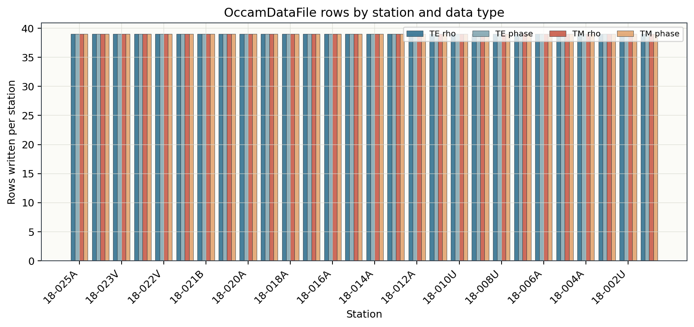
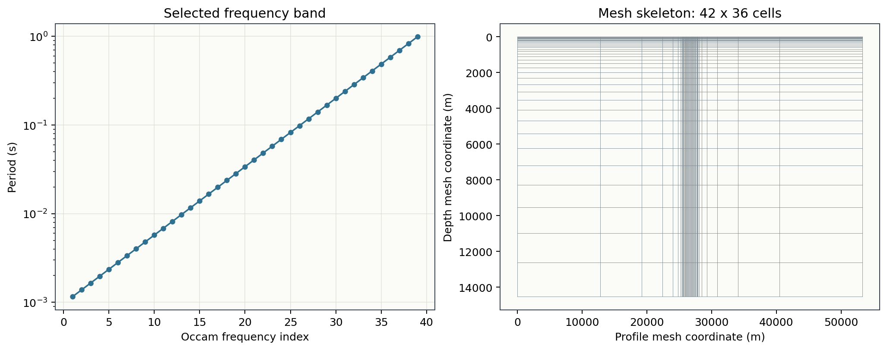
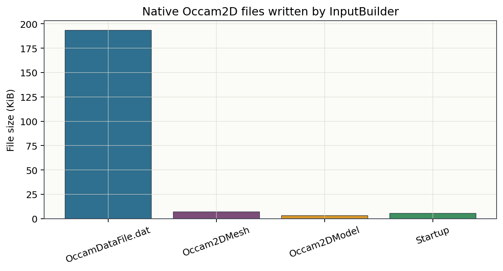

.. _tutorial_prepare_occam2d_inversion:

Prepare an Occam2D Inversion
============================

This tutorial shows how to prepare a 2-D Occam2D inversion from a cleaned EDI
survey. It follows the practical pyCSAMT v2 workflow:

1. load and inspect the EDI survey;
2. run QC and optional static-shift correction;
3. choose the data modes, frequency band, error floors, and mesh controls;
4. build native Occam2D input files;
5. validate the run directory before launching the external solver;
6. optionally run Occam2D and inspect the result.

Occam2D is an external inversion program. pyCSAMT can prepare, validate, run,
load, and plot the workflow files, but an actual inversion run requires a
compiled Occam2D executable.

What You Will Learn
-------------------

After this tutorial you should be able to:

- decide when Occam2D is an appropriate backend;
- prepare a corrected site collection for inversion;
- build the native Occam files with :class:`pycsamt.models.occam2d.InputBuilder`;
- understand the role of ``OccamDataFile.dat``, ``Occam2DMesh``,
  ``Occam2DModel``, and ``Startup``;
- use :class:`pycsamt.models.occam2d.OccamConfig` to control data selection,
  error floors, mesh geometry, and startup values;
- run the same preparation from the CLI;
- load finished Occam2D outputs with
  :class:`pycsamt.models.occam2d.InversionResult`.

When To Use Occam2D
-------------------

Occam2D is a good first production backend when:

- stations form a mostly 2-D profile;
- the geologic target is expected to vary mainly with profile distance and
  depth;
- the deliverable should be a smooth resistivity section;
- TE and TM apparent resistivity and phase curves are available;
- you want native Occam-style files that can be archived and reviewed.

Occam2D is not the best first choice when:

- the survey geometry is strongly 3-D;
- station coordinates are unreliable;
- source effects dominate the selected frequency band;
- only a few stations remain after QC;
- the target is a sharp blocky body that must be represented with hard
  boundaries rather than smooth gradients.

For backend choice, see :doc:`../user_guide/models/choosing_backend`.

Prepare the Survey
------------------

Start from the same EDI loading and QC path used in the previous tutorials.

.. code-block:: pycon
   :linenos:

   >>> from pathlib import Path

   >>> from pycsamt.api import read_edis
   >>> from pycsamt.emtools.qc import station_confidence_table

   >>> run_root = Path("runs")
   >>> run_root.mkdir(exist_ok=True)

   >>> survey = read_edis(
   ...     "data/AMT/WILLY_DATA/L18PLT",
   ...     recursive=False,
   ...     strict=False,
   ...     progress=False,
   ... )
   >>> sites = survey.collection

   >>> confidence = station_confidence_table(
   ...     sites,
   ...     method="composite",
   ...     api=True,
   ... )
   >>> print(confidence)
   station  confidence  coverage
   18-001A    0.709038       1.0
   18-002U    0.774634       1.0
   18-003A    0.713303       1.0
   18-004A    0.732182       1.0
   18-005U    0.771060       1.0

Do not prepare inversion files until station names, coordinates, frequency
coverage, and obvious quality problems have been checked. Occam2D will happily
invert a bad file set if the native files are syntactically valid.

Apply Optional Static-Shift Correction
--------------------------------------

If the QC review supports a static-shift correction, apply it to a copy of the
survey and keep the original data available.

.. code-block:: pycon
   :linenos:

   >>> from pycsamt.emtools.ss import correct_ss_ama

   >>> corrected = correct_ss_ama(
   ...     sites,
   ...     sort_by="name",
   ...     half_window=3,
   ...     weights="tri",
   ...     max_skew=None,
   ...     inplace=False,
   ...     recursive=False,
   ...     verbose=1,
   ... )

If static-shift evidence is weak, use ``sites`` directly for the first trial
and compare that model with a corrected run later.

The previous tutorial showed that ``L18PLT`` has high skew and large
exploratory static-shift factors. For a conservative first Occam2D input
build, it is often better to start from ``sites`` and keep the corrected copy
for a comparison run.

Choose an Occam Configuration
-----------------------------

``OccamConfig`` is the source-of-truth object for a native Occam2D run. It
controls data rows, error floors, mesh geometry, startup options, filenames,
and executable discovery.

.. code-block:: pycon
   :linenos:

   >>> from pycsamt.models.occam2d import OccamConfig

   >>> cfg = OccamConfig(
   ...     modes=["TE", "TM"],
   ...     freq_min=0.1,
   ...     freq_max=1000.0,
   ...     error_floor_rho=0.05,
   ...     error_floor_phase=0.5,
   ...     n_layers=32,
   ...     n_airlayers=4,
   ...     cell_size_horizontal=100.0,
   ...     cell_size_vertical_top=25.0,
   ...     depth_scale=1.15,
   ...     target_misfit=1.0,
   ...     max_iterations=80,
   ...     initial_rho=100.0,
   ...     data_file="OccamDataFile.dat",
   ...     mesh_file="Occam2DMesh",
   ...     model_file="Occam2DModel",
   ...     startup_file="Startup",
   ...     binary_name="Occam2D",
   ... )

Important options:

``modes``
    ``["TE"]``, ``["TM"]``, or ``["TE", "TM"]``. TE uses the ``Zxy``
    component and TM uses ``Zyx``. Each selected mode writes apparent
    resistivity and phase rows.

``freq_min`` and ``freq_max``
    Frequency limits in hertz. Use these to exclude unstable short-period or
    long-period bands before writing Occam data.

``error_floor_rho`` and ``error_floor_phase``
    Minimum data uncertainties. These are critical because Occam seeks a
    normalized misfit. Unrealistically small errors force the model to chase
    noise.

``n_layers`` and ``cell_size_horizontal``
    Main controls on mesh size and parameter count. Smaller cells and more
    layers increase detail but also increase runtime and non-uniqueness.

``target_misfit`` and ``max_iterations``
    Startup controls for the external solver.

Write the configuration next to the run so it can be reviewed later:

.. code-block:: pycon
   :linenos:

   >>> workdir = run_root / "L18PLT_occam2d_native"
   >>> workdir.mkdir(parents=True, exist_ok=True)

   >>> cfg.to_template(workdir / "occam2d.yml")

Build Native Occam2D Files
--------------------------

Use :class:`pycsamt.models.occam2d.InputBuilder` to write the four native input
files required before the external executable can run. For the tutorial
configuration, this writes a complete native input set:

.. code-block:: pycon
   :linenos:

   >>> from pycsamt.models.occam2d import InputBuilder

   >>> builder = InputBuilder(
   ...     sites,
   ...     workdir=workdir,
   ...     config=cfg,
   ...     verbose=1,
   ... )

   >>> builder.build(title="L18PLT pyCSAMT v2 Occam2D preparation")
   >>> print(builder.summary())
   InputBuilder summary
     workdir   : runs/L18PLT_occam2d_native
     sites     : 28
     freqs     : 39
     data pts  : 4368
     mesh      : 42 x 36 cells
     params    : 512
     modes     : ['TE', 'TM']

The build chain is:

1. ``OccamData.from_edi`` converts the site collection into Occam data rows.
2. ``OccamMesh.from_data`` builds a finite-element mesh from station offsets.
3. ``OccamModel.from_mesh`` maps mesh cells to inversion parameters.
4. ``OccamStartup.from_model`` writes the iteration-zero startup vector and
   inversion controls.

Expected files:

.. code-block:: text

   runs/L18PLT_occam2d_native/
     occam2d.yml
     OccamDataFile.dat
     Occam2DMesh
     Occam2DModel
     Startup

The figures in this tutorial are generated by
``docs/scripts/generate_tutorial_occam2d.py``. The first figure shows how the
selected TE/TM apparent-resistivity and phase rows are distributed by station.

Inspect the Built Objects
-------------------------

Before running the solver, inspect the generated data, mesh, model, and startup
objects.

.. code-block:: pycon
   :linenos:

   >>> print("sites:", builder.data.n_sites)
   sites: 28
   >>> print("frequencies:", builder.data.n_frequencies)
   frequencies: 39
   >>> print("data rows:", builder.data.n_data)
   data rows: 4368
   >>> print("mesh cells:", builder.mesh.n_xcells, "x", builder.mesh.n_zcells)
   mesh cells: 42 x 36
   >>> print("parameters:", builder.model.n_params)
   parameters: 512
   >>> print("startup file:", cfg.startup_file)
   startup file: Startup

The selected period band and mesh skeleton provide a quick visual audit before
you send the directory to an Occam2D executable:

If the number of data rows is unexpectedly small, check ``modes``,
``freq_min``, ``freq_max``, and station filtering. If the parameter count is
very large, increase ``cell_size_horizontal`` or reduce ``n_layers`` for the
first trial.

Validate File Types
-------------------

pyCSAMT can detect native Occam2D file types. Use this to catch path mistakes
before sending a run to a cluster or external workstation.

.. code-block:: pycon
   :linenos:

   >>> from pycsamt.models.occam2d.validation import detect_file_type

   >>> for filename in (
   ...     cfg.data_file,
   ...     cfg.mesh_file,
   ...     cfg.model_file,
   ...     cfg.startup_file,
   ... ):
   ...     path = workdir / filename
   ...     print(path.name, "->", detect_file_type(path))
   OccamDataFile.dat  -> data
   Occam2DMesh        -> mesh
   Occam2DModel       -> model
   Startup            -> startup

The data file is much larger than the mesh, model, and startup files because
it stores every selected station-frequency response row:

This does not prove the geophysics is correct, but it confirms that the native
files look like the expected Occam file classes.

Build a TM-Only First Trial
---------------------------

For many CSAMT and AMT profiles, a TM-only first run is easier to interpret
than a joint TE/TM run. Use a separate work directory for the experiment.

.. code-block:: pycon
   :linenos:

   >>> tm_workdir = run_root / "L18PLT_occam2d_tm"

   >>> tm_builder = InputBuilder(
   ...     sites,
   ...     workdir=tm_workdir,
   ...     config=OccamConfig(),
   ...     verbose=1,
   ... )

   >>> tm_builder.build(
   ...     modes=["TM"],
   ...     freq_min=0.2,
   ...     freq_max=500.0,
   ...     error_floor_rho=0.07,
   ...     error_floor_phase=1.0,
   ...     n_layers=28,
   ...     cell_size=150.0,
   ...     title="L18PLT TM-only Occam2D first trial",
   ... )

   >>> print(tm_builder.summary())
   InputBuilder summary
     workdir   : runs/L18PLT_occam2d_tm
     sites     : 28
     freqs     : 35
     data pts  : 1960
     mesh      : 42 x 33 cells
     params    : 448
     modes     : ['TM']

Keep each experiment in its own directory. Names such as
``L18PLT_occam2d_tm`` and ``L18PLT_occam2d_te_tm`` are much easier to audit
than repeatedly overwriting ``run01``.

Run Occam2D
-----------

When a compiled Occam2D executable is available, launch the solver with
:class:`pycsamt.models.occam2d.OccamRunner`.

.. code-block:: pycon
   :linenos:

   >>> from pycsamt.models.occam2d import OccamRunner

   >>> runner = OccamRunner(
   ...     workdir=workdir,
   ...     binary_path="/usr/local/bin/Occam2D",
   ...     startup_file=cfg.startup_file,
   ...     verbose=1,
   ... )

   >>> exit_code = runner.run(
   ...     max_iter=80,
   ...     target_misfit=1.0,
   ...     auto_compile=False,
   ... )
   >>> print("Occam2D exit code:", exit_code)

``OccamRunner`` does not build input files. It only runs a prepared directory.
If the executable is not available, stop after the build step and move the
native directory to the environment where Occam2D can run.

Load Finished Results
---------------------

After an external run completes, load the directory with
:class:`pycsamt.models.occam2d.InversionResult`.

.. code-block:: pycon
   :linenos:

   >>> from pycsamt.models.occam2d import InversionResult

   >>> result = InversionResult(workdir)

   >>> print("iteration files:", len(result.iter_files))
   >>> print("response files:", len(result.resp_files))
   >>> print("final RMS:", result.final_rms)
   >>> print("model grid:", None if result.rho_2d is None else result.rho_2d.shape)

``rho_2d`` stores log10 resistivity on the Occam mesh. Convert to ohm metres
only when you need physical resistivity values:

.. code-block:: pycon
   :linenos:

   >>> import numpy as np

   >>> if result.rho_2d is not None:
   ...     rho_ohm_m = 10.0 ** result.rho_2d
   ...     print(np.nanmin(rho_ohm_m), np.nanmax(rho_ohm_m))

Plot Model and Misfit
---------------------

Use the Occam plotting helpers after a completed run.

.. code-block:: pycon
   :linenos:

   >>> import matplotlib.pyplot as plt
   >>> from pycsamt.models.occam2d import PlotMisfit, PlotModel, PlotPseudo

   >>> figure_dir = workdir / "figures"
   >>> figure_dir.mkdir(exist_ok=True)

   >>> fig = PlotModel(result).plot()
   >>> fig.savefig(figure_dir / "occam2d_model.png", dpi=200, bbox_inches="tight")
   >>> plt.close(fig)

   >>> fig = PlotMisfit(result).plot()
   >>> fig.savefig(figure_dir / "occam2d_misfit.png", dpi=200, bbox_inches="tight")
   >>> plt.close(fig)

   >>> fig = PlotPseudo(result).plot()
   >>> fig.savefig(figure_dir / "occam2d_observed_pseudo.png", dpi=200, bbox_inches="tight")
   >>> plt.close(fig)

If a plot helper reports that a response, iteration, or log file is missing,
check that the external solver completed and that output files were written in
the same directory as the input files.

Backend-Neutral Preparation
---------------------------

The backend-neutral inversion API can prepare the same native files while
returning a common inversion result object. Keep ``run_external=False`` when
you only want to build and validate files.

.. code-block:: pycon
   :linenos:

   >>> from pycsamt.inversion import InversionConfig, run_inversion

   >>> inv_cfg = InversionConfig(
   ...     method="mt",
   ...     dimension="2d",
   ...     backend="occam2d",
   ...     data=sites,
   ...     workdir=run_root / "L18PLT_occam2d_workflow",
   ...     run_external=False,
   ...     error_floor=0.05,
   ...     phase_error=0.5,
   ...     backend_options={
   ...         "config": {
   ...             "modes": ["TE", "TM"],
   ...             "freq_min": 0.1,
   ...             "freq_max": 1000.0,
   ...             "n_layers": 32,
   ...             "target_misfit": 1.0,
   ...             "initial_rho": 100.0,
   ...         },
   ...     },
   ... )

   >>> workflow_result = run_inversion(inv_cfg)
   >>> print(workflow_result.status)
   >>> print(workflow_result.files)
   >>> print(workflow_result.warnings)

Use the native ``InputBuilder`` path when you want direct control over Occam2D
objects. Use the backend-neutral path when a larger application, agent, or
pipeline needs one interface for several inversion engines.

CLI Equivalent
--------------

Build Occam2D inputs from the command line:

.. code-block:: bash
   :linenos:

   pycsamt invert build data/AMT/WILLY_DATA/L18PLT \
       --solver occam2d \
       --workdir runs/L18PLT_occam2d_cli \
       --modes TE,TM \
       --freq 0.1:1000 \
       --error-floor-rho 0.05 \
       --error-floor-phase 0.5 \
       --n-layers 32 \
       --cell-size 100

Inspect the working directory:

.. code-block:: bash
   :linenos:

   pycsamt invert status runs/L18PLT_occam2d_cli
   pycsamt invert status runs/L18PLT_occam2d_cli --format json

Run the external solver when the executable is available:

.. code-block:: bash
   :linenos:

   pycsamt invert run runs/L18PLT_occam2d_cli \
       --solver occam2d \
       --max-iter 80 \
       --target-misfit 1.0

Summarize and plot results:

.. code-block:: bash
   :linenos:

   pycsamt invert results runs/L18PLT_occam2d_cli
   pycsamt invert plot model runs/L18PLT_occam2d_cli \
       --save runs/L18PLT_occam2d_cli/model.png \
       --dpi 200
   pycsamt invert plot misfit runs/L18PLT_occam2d_cli \
       --save runs/L18PLT_occam2d_cli/misfit.png \
       --dpi 200

Preparation Checklist
---------------------

Before launching a production Occam2D run, confirm that:

- EDI files have been loaded and validated;
- station order and coordinates are correct;
- QC and static-shift decisions are documented;
- TE/TM mode choice is intentional;
- frequency limits exclude noisy or source-affected bands;
- error floors are realistic;
- mesh size is reasonable for the station spacing and target depth;
- ``OccamDataFile.dat``, ``Occam2DMesh``, ``Occam2DModel``, and ``Startup``
  are present;
- the raw, corrected, and inversion-input directories are separate;
- the external Occam2D executable can be found in the run environment.

Troubleshooting
---------------

The data file has too few rows
    Check ``modes``, ``freq_min``, ``freq_max``, and whether the selected
    stations contain finite impedance values for the requested components.

The mesh is too large
    Increase ``cell_size_horizontal``, reduce ``n_layers``, or start with a
    narrower frequency band for the first trial.

The runner cannot find Occam2D
    Pass ``binary_path`` explicitly, place ``Occam2D`` in the run directory, or
    make sure the executable is on ``PATH``.

The RMS does not approach the target
    Revisit error floors, static-shift correction, bad stations, mode choice,
    and whether the structure is too 3-D for a 2-D smooth inversion.

The final model is too smooth
    That is often expected for Occam inversion. Compare residuals, try different
    error floors, and consider whether another backend is more appropriate for
    sharp boundaries.

See Also
--------

:doc:`read_edi_survey`
    Load input EDI files.

:doc:`inspect_and_qc_survey`
    Review data quality before inversion.

:doc:`correct_static_shift`
    Review static-shift correction.

:doc:`run_classical_inversions`
    Locating or building the Occam2D/ModEM/MARE2DEM binaries and running
    the files prepared here, alongside the other classical engines.

:doc:`../user_guide/models/occam2d`
    Full Occam2D backend documentation.

:doc:`../user_guide/models/choosing_backend`
    Decide between Occam2D, ModEM, MARE2DEM, and other engines.

:doc:`../api/inversion`
    Inversion API reference.

:doc:`../cli/invert`
    Inversion CLI reference.
