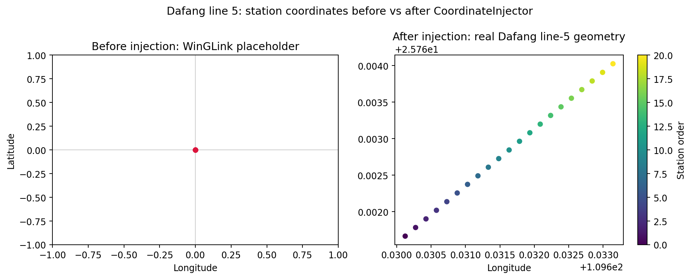
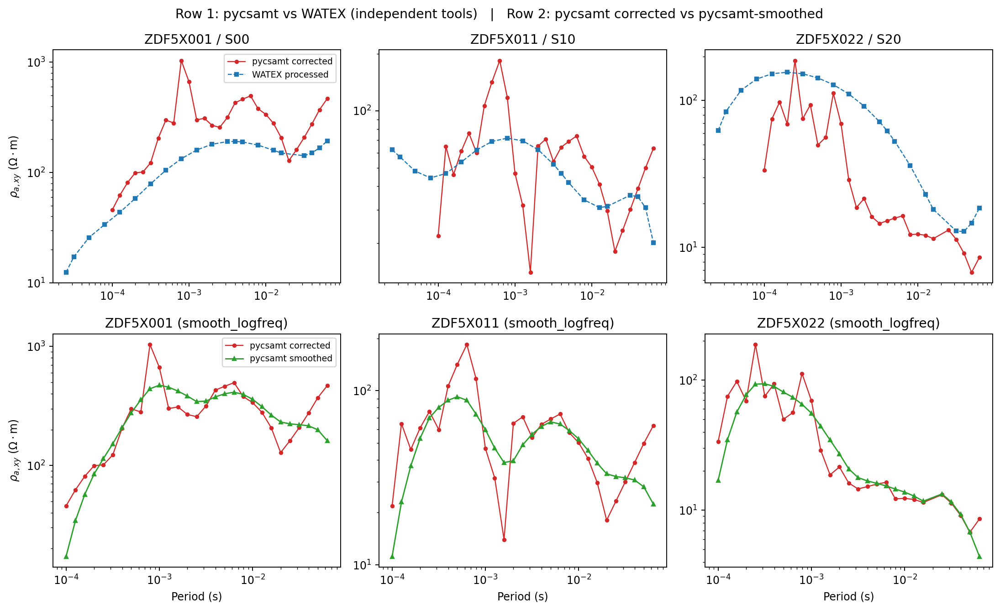
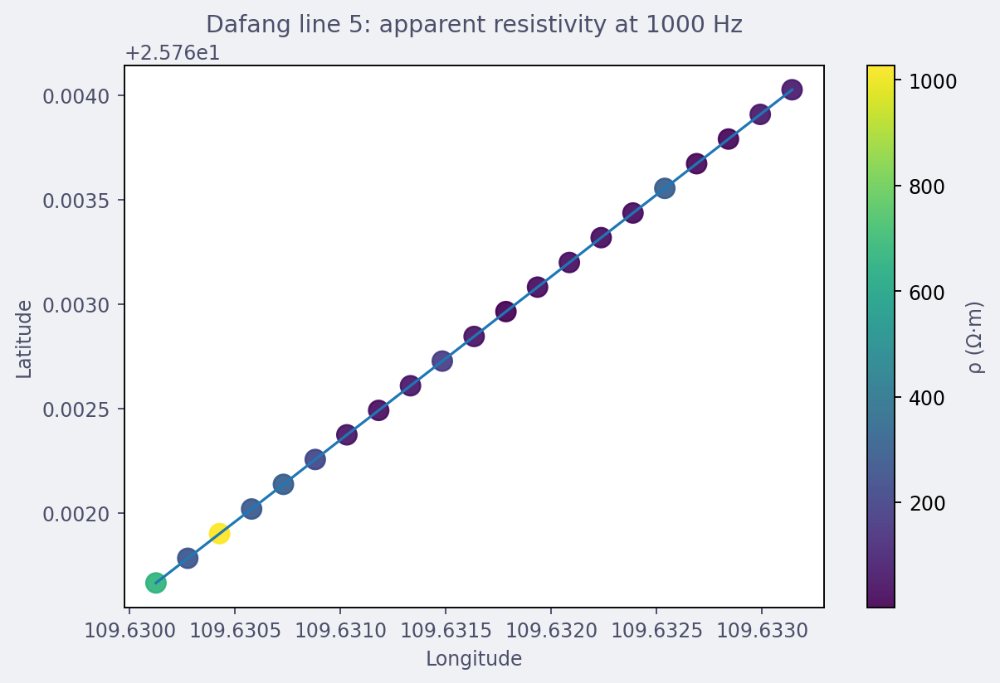
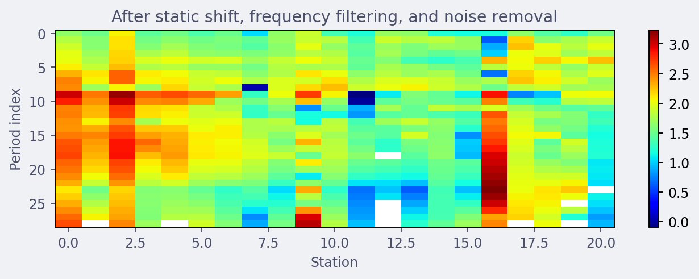
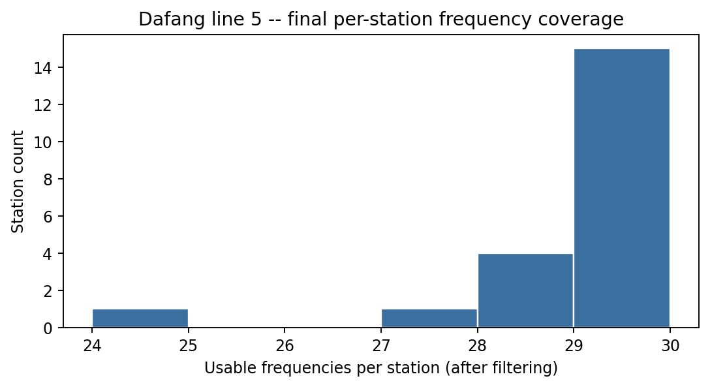
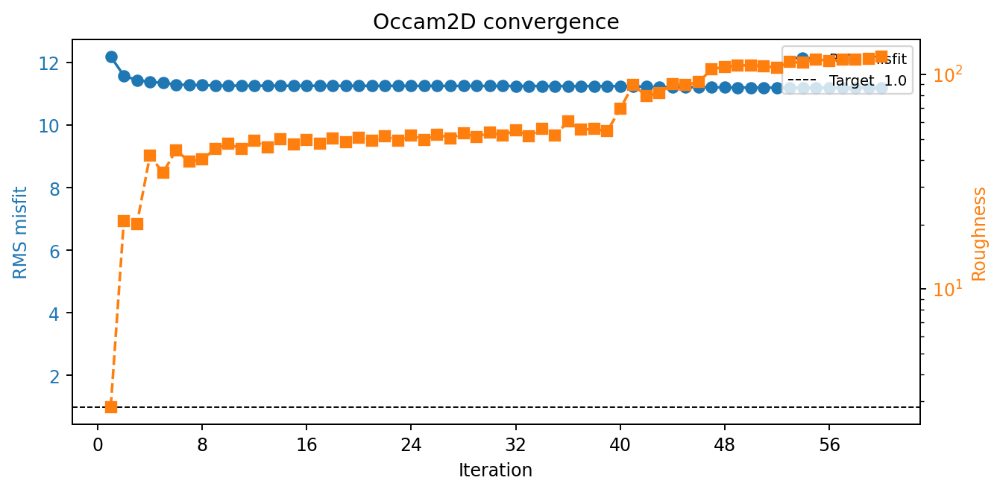
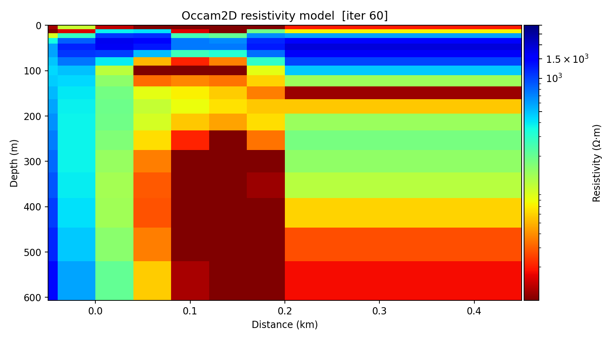

.. _tutorial_process_stratagem_dafang_to_inversion:

Stratagem Field Data To Occam2D Inversion
=========================================

:doc:`../user_guide/stratagem/tutorial` takes a real Stratagem field
delivery (K2, 87 stations) from raw hardware output through coordinate
injection, static-shift correction, frequency filtering, noise removal,
and export -- and stops there, handing off to "any of the inversion
backends this documentation covers separately." This tutorial is that
next step, on a second, independent real line: Dafang line 5, 21 surviving
stations over a 400 m profile. It goes all the way through a real,
compiled Occam2D inversion, and adds one thing the K2 walkthrough does
not have: an independent second correction of the same physical line
(by an earlier, unrelated tool) to cross-check pyCSAMT's own output
against.

What You Will Learn
-------------------

After this tutorial you should be able to:

- load a raw Stratagem WinGLink export and its matching hardware delivery,
  and recognise a real per-station export gap when one exists;
- inject real coordinates with :class:`~pycsamt.stratagem.CoordinateInjector`,
  including the column-naming quirk this delivery shares with K2;
- sanity-check a correction pipeline's output against an independent
  tool's correction of the same real stations;
- run :class:`~pycsamt.stratagem.process.StaticShiftCorrector`,
  :class:`~pycsamt.stratagem.qc.FrequencyFilter`, and
  :class:`~pycsamt.stratagem.process.NoiseRemover` end to end and read
  their real output honestly, including benign log noise this dataset
  triggers that K2 does not;
- build native Occam2D input files with
  :class:`pycsamt.models.occam2d.InputBuilder` from stratagem-corrected
  EDI, following the same recipe as :doc:`prepare_occam2d_inversion`;
- run a real, locally-compiled Occam2D inversion and read an honest,
  non-perfectly-converged result rather than a cherry-picked one.

Starting Point
--------------

The bundled data lives under ``data/stratagem/Dafang/`` --
``df5-edi/`` (WinGLink export, placeholder coordinates), ``df5-hx/`` (raw
Stratagem hardware delivery, all three components), ``df5-coords.csv``
(reconciled station coordinates), and ``df5-watex-edi/`` /
``df5-watex-edi-processed/`` (an independent correction of the same line
by an earlier tool, used later for cross-validation). See
``data/stratagem/Dafang/README.md`` for exactly what each file is and how
it was curated.

Every path below is a plain string. To run this tutorial against a
different Stratagem line, replace the four ``data/stratagem/Dafang/...``
paths with your own WinGLink export directory, raw hardware directory,
and coordinate table -- nothing else in this tutorial is Dafang-specific.

Loading Raw Stratagem Data
--------------------------

:class:`~pycsamt.stratagem.EDIBatch` loads the WinGLink export exactly as
delivered. Every station reports the same placeholder location -- a
finite, valid-looking ``(0, 0)`` that nothing downstream will complain
about on its own:

.. code-block:: pycon

   >>> from pycsamt.stratagem import EDIBatch

   >>> batch = EDIBatch("data/stratagem/Dafang/df5-edi").fit()
   >>> len(batch.edi_objects_)
   21
   >>> uninjected_latlon = [
   ...     (e.get_section("head").Location.latitude, e.get_section("head").Location.longitude)
   ...     for e in batch.edi_objects_
   ... ]
   >>> set(uninjected_latlon)
   {(0.0, 0.0)}

Only 21 objects load, not 22. The raw hardware delivery at
``df5-hx/`` genuinely has all 22 stations' ``X``/``Y``/``Z`` files;
``ZDF5X019.edi`` is simply absent from the WinGLink export -- a real gap
in that export, not a filtering step pyCSAMT applied:

.. code-block:: pycon

   >>> stations = sorted(e.station for e in batch.edi_objects_)
   >>> "ZDF5X019" in stations
   False
   >>> stations[:3], stations[-3:]
   (['ZDF5X001', 'ZDF5X002', 'ZDF5X003'], ['ZDF5X020', 'ZDF5X021', 'ZDF5X022'])

``data/stratagem/Dafang/df5-coords.csv`` already accounts for this: its 21
rows line up with the 21 *surviving* stations in acquisition order, so no
row needs to be dropped before coordinate injection -- unlike K2, where a
calibration shot and four checkpoint repeats had to be identified and
excluded explicitly.

Injecting Real Coordinates
--------------------------

The ``easting``/``northing`` column values in ``df5-coords.csv`` are
swapped relative to their names -- the same quirk :doc:`../user_guide/stratagem/coordinates`
documents for K2. The column named ``easting`` (~2,850,000) is really a
Gauss-Kruger-style northing; the column named ``northing`` (~362,000) is
the real easting. ``epsg=32649`` (UTM Zone 49N WGS84) reprojects the raw
pair for the first station to coordinates matching an independent source
-- the corresponding station in ``df5-watex-edi/`` -- to six decimal
places, which is how it was confirmed rather than assumed:

.. code-block:: pycon

   >>> from pycsamt.stratagem import CoordinateInjector

   >>> injector = CoordinateInjector(epsg=32649, order="forward").fit(
   ...     batch.edi_objects_, "data/stratagem/Dafang/df5-coords.csv",
   ...     easting_col="northing", northing_col="easting",
   ...     elev_col="elev", station_col="stations",
   ... )
   >>> injected_latlon = [
   ...     (e.get_section("head").Location.latitude, e.get_section("head").Location.longitude)
   ...     for e in injector.edi_objects_
   ... ]
   >>> tuple(round(v, 6) for v in injected_latlon[0])
   (25.761665, 109.630124)
   >>> tuple(round(v, 6) for v in injected_latlon[-1])
   (25.764026, 109.633143)

Plotting both states side by side makes the placeholder-versus-real
contrast impossible to miss:

.. code-block:: pycon

   >>> import matplotlib.pyplot as plt

   >>> fig, (ax0, ax1) = plt.subplots(1, 2, figsize=(11, 4.4))
   >>> lat0, lon0 = zip(*uninjected_latlon)
   >>> _ = ax0.scatter(lon0, lat0, s=25, color="crimson")
   >>> _ = ax0.set_xlim(-1, 1)
   >>> _ = ax0.set_ylim(-1, 1)
   >>> _ = ax0.set_title("Before injection: WinGLink placeholder")
   >>> _ = ax0.set_xlabel("Longitude")
   >>> _ = ax0.set_ylabel("Latitude")

   >>> lat1, lon1 = zip(*injected_latlon)
   >>> sc = ax1.scatter(lon1, lat1, s=25, c=range(len(lon1)), cmap="viridis")
   >>> _ = ax1.set_title("After injection: real Dafang line-5 geometry")
   >>> _ = ax1.set_xlabel("Longitude")
   >>> _ = fig.colorbar(sc, ax=ax1, label="Station order")
   >>> fig.tight_layout()

   Left: all 21 stations collapsed onto ``(0, 0)``. Right: the same 21
   stations spread along the real ~400 m line, coloured by acquisition
   order -- a short, straight profile, about a quarter of K2's length.

``injector.edi_objects_`` -- the coordinate-injected objects -- are what
the rest of this tutorial builds on. A deep copy taken now, before any
further correction, is what the next two sections compare against:

.. code-block:: pycon

   >>> from copy import deepcopy

   >>> raw_edis = [deepcopy(e) for e in injector.edi_objects_]

Cross-Validating Against An Independent Tool
--------------------------------------------

Before trusting pyCSAMT's own correction, it helps to have something
other than "the numbers changed" to check it against.
``data/stratagem/Dafang/df5-watex-edi-processed/`` is a real,
independently-produced correction of these same 21 physical stations, by
an earlier, unrelated tool. It is not ground truth -- it used a different
static-shift algorithm and kept a different frequency subset (21 of the
original 39, versus pyCSAMT's own selection below) -- but if pyCSAMT's
correction is doing something reasonable, the two should broadly agree on
order of magnitude and period-dependence for the same stations.

Static Shift, Frequency Filtering, And Noise Removal
----------------------------------------------------

:class:`~pycsamt.stratagem.process.StaticShiftCorrector` estimates
per-station correction factors from spatial neighbours (the AMA method),
then :class:`~pycsamt.stratagem.qc.FrequencyFilter` restricts every
station to a shared, hardware-validated band, and
:class:`~pycsamt.stratagem.process.NoiseRemover` handles powerline and
outlier spikes -- the same three-step chain :doc:`../user_guide/stratagem/tutorial`
runs for K2:

.. code-block:: pycon

   >>> from pycsamt.stratagem import StratagemRawReader
   >>> from pycsamt.stratagem.process import StaticShiftCorrector, NoiseRemover
   >>> from pycsamt.stratagem.qc import FrequencyFilter

   >>> rdr = StratagemRawReader("data/stratagem/Dafang/df5-hx", component="X").fit()
   >>> sc = StaticShiftCorrector(sort_by="lon").fit(injector.edi_objects_)
   >>> filt = FrequencyFilter(fmin=10.0, fmax=10000.0).fit(sc.edi_objects_, raw_reader=rdr)
   >>> nr = NoiseRemover(mains_hz=50.0).fit(filt.edi_objects_)
   >>> final_edis = nr.edi_objects_
   >>> len(raw_edis), len(final_edis)
   (21, 21)

Unlike K2, this line's raw hardware capture has a genuinely different
number of frequencies at every station (39, 38, 36, ...) rather than one
fixed table shared by all stations. That is real and harmless, but it
means :func:`~pycsamt.emtools.ss.estimate_ss_ama`'s internal spatial
window -- which briefly compares differently-sized frequency arrays while
searching for neighbours -- logs a burst of ``ERROR``-level "Failed to
compute rho/phi after setting Z" lines during ``StaticShiftCorrector.fit()``.
They look alarming but are non-fatal: every one is caught internally, and
the actual correction factors and corrected data are unaffected, which is
worth confirming directly rather than trusting the log level:

.. code-block:: pycon

   >>> sc.factors_[["station", "fac_z", "n_used"]].to_string(index=False)
   ' station    fac_z  n_used\nZDF5X001 0.786788      15\nZDF5X002 0.930320      14\nZDF5X003 1.281865      10\nZDF5X004 0.719025       9\nZDF5X005 1.033986       8\nZDF5X006 0.928252      10\nZDF5X007 1.289578      12\nZDF5X008 0.681909       5\nZDF5X009 1.770830      10\nZDF5X010 0.922494      17\nZDF5X011 0.710860      20\nZDF5X012 0.601690      16\nZDF5X013 1.198126      14\nZDF5X014 0.864620      14\nZDF5X015 1.403834      21\nZDF5X016 0.756371      14\nZDF5X017 6.290689      10\nZDF5X018 1.163751      23\nZDF5X020 0.727790      18\nZDF5X021 1.148781      11\nZDF5X022 0.805522      20'

   >>> import numpy as np
   >>> total_nan = sum(int(np.isnan(e.Z.z).sum()) for e in final_edis)
   >>> total_nan
   0

Station ``ZDF5X017`` stands out immediately -- ``fac_z=6.29`` is far above
every other station's factor of roughly 0.6-1.8, the same kind of single
strong outlier K2's own outlier (station 61, ``fac_z≈93``) was. Now the
independent-tool comparison from the previous section becomes concrete:
plot pyCSAMT's corrected curve for ``ZDF5X001``, ``ZDF5X011``, and this
outlier ``ZDF5X017`` against the WATEX-processed curve for the same three
physical stations (``S00``, ``S10``, ``S20`` in WATEX's own naming, same
acquisition order). A second, different kind of check is worth running
alongside it: :func:`~pycsamt.emtools.remove_noise.smooth_logfreq` is
pyCSAMT's own in-house log-frequency smoother (a triangular kernel by
default), not an independent tool -- it cannot confirm the correction is
*right* the way the WATEX comparison can, but it shows whether the
corrected curve's station-to-station scatter is dominated by real
structure or by point-to-point noise that a smoother collapses away:

.. code-block:: pycon

   >>> from pycsamt.emtools.remove_noise import smooth_logfreq

   >>> wx = EDIBatch("data/stratagem/Dafang/df5-watex-edi-processed").fit()
   >>> smoothed = list(smooth_logfreq(final_edis, win=5, kind="tri", also="z", inplace=False, verbose=0))
   >>> pick_idx = [0, 10, 20]

Two rows, three stations each -- the top row against WATEX, the bottom
row against pyCSAMT's own smoother:

.. code-block:: pycon

   >>> fig, axes = plt.subplots(2, 3, figsize=(13, 8.0))
   >>> for col, i in enumerate(pick_idx):
   ...     ed = final_edis[i]
   ...     ew = wx.edi_objects_[i]
   ...     per = 1.0 / ed.Z.freq
   ...     perw = 1.0 / ew.Z.freq
   ...     ax = axes[0, col]
   ...     _ = ax.loglog(per, ed.Z.res_xy, "o-", ms=3, lw=1, color="#d62728", label="pycsamt corrected")
   ...     _ = ax.loglog(perw, ew.Z.res_xy, "s--", ms=3, lw=1, color="#1f77b4", label="WATEX processed")
   ...     _ = ax.set_title(f"{ed.station} / {ew.station}")
   ...     es = smoothed[i]
   ...     pers = 1.0 / es.freq
   ...     ax2 = axes[1, col]
   ...     _ = ax2.loglog(per, ed.Z.res_xy, "o-", ms=3, lw=1, color="#d62728", label="pycsamt corrected")
   ...     _ = ax2.loglog(pers, es.rho[:, 0, 1], "^-", ms=3, lw=1.2, color="#2ca02c", label="pycsamt smoothed")
   ...     _ = ax2.set_xlabel("Period (s)")
   ...     _ = ax2.set_title(f"{ed.station} (smooth_logfreq)")
   ...
   >>> _ = axes[0, 0].set_ylabel(r"$\rho_{a,xy}$ ($\Omega\cdot$m)")
   >>> _ = axes[0, 0].legend(fontsize=8)
   >>> _ = axes[1, 0].set_ylabel(r"$\rho_{a,xy}$ ($\Omega\cdot$m)")
   >>> _ = axes[1, 0].legend(fontsize=8)
   >>> fig.tight_layout()

   Top row: two independent tools, two different static-shift algorithms,
   two different frequency selections -- and both land within roughly a
   factor of 2-3 of each other in the well-covered mid-period range for
   all three stations, with the same broad rise-then-plateau shape. They
   are not identical -- pyCSAMT's curve is visibly noisier at the short-
   and long-period ends where fewer frequencies survive filtering, and
   station 022's two curves diverge more than the other two at long
   periods. Bottom row: ``smooth_logfreq`` tracks the corrected curve's
   overall shape closely while damping exactly the kind of point-to-point
   spikes visible in the top row -- confirming those spikes are
   high-frequency scatter riding on a smoother real trend, not evidence
   that the underlying correction is wrong. Treat both rows as
   plausibility checks on the general size and shape of the correction,
   not proof that any one curve's absolute values are exactly right.

Station Map And Pseudosections
------------------------------

:func:`pycsamt.map.plot_station_map` reads the corrected EDI list
directly:

.. code-block:: pycon

   >>> from pycsamt.map import StationMapOptions, plot_station_map

   >>> fig = plot_station_map(
   ...     final_edis,
   ...     options=StationMapOptions(
   ...         overlay="rho", frequency=1000.0, frequency_tolerance=200.0,
   ...         component="xy", backend="matplotlib", show_labels=False,
   ...         show_profiles=True, cmap="viridis",
   ...         title="Dafang line 5: apparent resistivity at 1000 Hz",
   ...     ),
   ... )

   A short, straight 400 m line -- more resistive (yellow-green) toward
   the western end, more conductive (dark purple) toward the middle and
   east.

The same before/after comparison K2's tutorial makes with
:func:`~pycsamt.map.plot_pseudosection` carries over directly:

.. code-block:: pycon

   >>> from pycsamt.map import ProfileMapOptions, plot_pseudosection

   >>> pseudo_opts = dict(component="xy", components=("xy",), x_axis="station", backend="matplotlib", log_rho=True)
   >>> fig_final = plot_pseudosection(final_edis, options=ProfileMapOptions(**pseudo_opts))
   >>> _ = fig_final.axes[0].set_title("After static shift, frequency filtering, and noise removal")

   Station 17's outlier correction shows up here too, as the isolated
   warm-coloured column near the middle of the line where the raw panel
   (not shown) reads noticeably darker.

Quality Control And Export
--------------------------

The same two checks :doc:`../user_guide/stratagem/tutorial` runs for K2 --
no unresolved gaps, and reasonable per-station frequency coverage --
matter here too:

.. code-block:: pycon

   >>> total_cells = sum(e.Z.z.size for e in final_edis)
   >>> total_nan, total_cells
   (0, 2392)

   >>> n_freqs = [e.Z.z.shape[0] for e in final_edis]
   >>> min(n_freqs), max(n_freqs), int(np.median(n_freqs))
   (24, 29, 29)

The spread is worth seeing as a distribution, not just three numbers:

.. code-block:: pycon

   >>> fig, ax = plt.subplots(figsize=(6.5, 3.6))
   >>> _ = ax.hist(n_freqs, bins=range(min(n_freqs), max(n_freqs) + 2), color="#3b6fa0", edgecolor="white")
   >>> _ = ax.set_xlabel("Usable frequencies per station (after filtering)")
   >>> _ = ax.set_ylabel("Station count")
   >>> _ = ax.set_title("Dafang line 5 -- final per-station frequency coverage")
   >>> fig.tight_layout()

   Tighter and more uniform than K2's own 8-29 spread -- 15 of 21 stations
   here keep the full 29-frequency band, with a short tail down to 24.

Writing the corrected batch out is the same call as K2's own export step:

.. code-block:: pycon

   >>> from pycsamt.stratagem.rename import EDIWriter
   >>> from tempfile import TemporaryDirectory

   >>> with TemporaryDirectory() as out:
   ...     wr = EDIWriter().fit(final_edis, out)
   ...     wr.n_written_
   ...
   21

Preparing And Running An Occam2D Inversion
------------------------------------------

From here, ``final_edis`` is ordinary corrected EDI input -- the exact
starting point :doc:`prepare_occam2d_inversion` assumes. This section
follows that same recipe directly against the Dafang data rather than
re-explaining it. Dafang line 5 is a scalar CSAMT line (dominant Ex-Hy
component, the same configuration :doc:`../theory/field_zones` and
:doc:`../user_guide/stratagem/tutorial` describe for K2), so a TE-only
build is the appropriate first trial:

.. code-block:: pycon

   >>> from pathlib import Path
   >>> from pycsamt.models.occam2d import OccamConfig, InputBuilder

   >>> run_root = Path("runs")
   >>> run_root.mkdir(exist_ok=True)
   >>> workdir = run_root / "dafang_line5_occam2d"
   >>> workdir.mkdir(parents=True, exist_ok=True)

   >>> cfg = OccamConfig(
   ...     modes=["TE"],
   ...     freq_min=10.0,
   ...     freq_max=10000.0,
   ...     error_floor_rho=0.15,
   ...     error_floor_phase=2.0,
   ...     n_layers=28,
   ...     n_airlayers=0,
   ...     cell_size_horizontal=20.0,
   ...     cell_size_vertical_top=8.0,
   ...     depth_scale=1.15,
   ...     target_misfit=1.5,
   ...     max_iterations=60,
   ...     initial_rho=100.0,
   ... )
   >>> builder = InputBuilder(final_edis, workdir=workdir, config=cfg, verbose=0)
   >>> _ = builder.build(title="Dafang line 5 pyCSAMT v2 Occam2D preparation")
   >>> print(builder.summary())
   InputBuilder summary
     workdir   : runs\dafang_line5_occam2d
     sites     : 21
     freqs     : 29
     data pts  : 1196
     mesh      : 34 x 28 cells
     params    : 336
     modes     : ['TE']

``n_airlayers=0`` here is deliberate, not a default left untouched: the
real, compiled Occam2D solver manages its own air padding internally and
does not expect the mesh file to carry extra air rows at all. Requesting
air layers through :class:`~pycsamt.models.occam2d.OccamConfig` produces
input files that *look* complete but that a real Fortran Occam2D refuses
to read (see the note below); ``0`` is the value that actually works
against the real solver.

:class:`~pycsamt.models.occam2d.validation.detect_file_type` confirms the
four files are what they claim to be before anything is sent to a solver:

.. code-block:: pycon

   >>> from pycsamt.models.occam2d.validation import detect_file_type

   >>> for filename in (cfg.data_file, cfg.mesh_file, cfg.model_file, cfg.startup_file):
   ...     path = workdir / filename
   ...     print(path.name, "->", detect_file_type(path))
   ...
   OccamDataFile.dat -> data
   Occam2DMesh -> mesh
   Occam2DModel -> model
   Startup -> startup

.. note::

   Building these input files does not itself require a Fortran compiler.
   Actually running the solver does -- :doc:`run_classical_inversions`
   covers :meth:`~pycsamt.models.occam2d.OccamRunner.discover_binary` and
   :meth:`~pycsamt.models.occam2d.OccamRunner.compile` in full, including
   why most environments should treat the run step as a dry-run command
   rather than something to execute inline. This tutorial's own run below
   used a real local ``gfortran``/``make`` toolchain -- the first time, in
   the course of writing it, that a genuinely compiled Occam2D binary had
   been run against pyCSAMT-built input files end to end. That surfaced
   two real, now-fixed bugs that every prior dry-run example could not
   have caught: :meth:`~pycsamt.models.occam2d.OccamRunner.compile` was
   looking for a binary named ``Occam2D`` when Windows/MinGW toolchains
   produce ``Occam2D.exe``, and :class:`~pycsamt.models.occam2d.OccamMesh`
   was writing the air-layer count into the mesh file's fixed-resistivity
   field, corrupting every field after it for a real Fortran reader. Both
   are fixed as of this tutorial; ``n_airlayers=0`` above works around the
   second issue's remaining root cause -- pyCSAMT's mesh/model coupling
   does not yet offer a working non-zero air-layer count against the real
   solver.

Running it end to end, with a real ``gfortran``/``make`` toolchain on
``PATH``:

.. code-block:: pycon

   >>> from pycsamt.models.occam2d import OccamRunner

   >>> runner = OccamRunner(workdir=workdir, verbose=0)
   >>> exit_code = runner.run(max_iter=60, target_misfit=1.5, auto_compile=True)
   >>> exit_code
   0

Interpreting The Inversion
--------------------------

Finishing without an error is not the same as converging.
:class:`~pycsamt.models.occam2d.InversionResult` reads the same honesty
:doc:`run_classical_inversions` insists on for every backend -- check the
RMS history, not just whether loading succeeded:

.. code-block:: pycon

   >>> from pycsamt.models.occam2d import InversionResult

   >>> res = InversionResult(workdir, iteration=60)
   >>> print(res.summary())
   InversionResult
     workdir    : runs\dafang_line5_occam2d
     iterations : 61
     final RMS  : 11.2020
     converged  : False

``converged: False`` is the number that matters; the misfit-by-iteration
plot shows exactly how it got stuck:

.. code-block:: pycon

   >>> fig = res.plot_misfit()

   RMS drops from 12.2 to about 11.2 within the first handful of
   iterations, then stalls there for the rest of the run while roughness
   keeps climbing -- the model getting more structured without actually
   fitting the data any better, the same stalling pattern
   :doc:`run_classical_inversions` documents for its own bundled ModEM
   sample (RMS 3.52 to 3.06 over 74 iterations, also "No"). A target
   misfit of 1.5 was never realistic for a first TE-only trial with
   ``error_floor_rho=0.15`` on 21 real, noisy, static-shift-corrected
   stations -- tightening error floors or switching to a joint TE/TM
   build (once a usable YX/TM signal is confirmed) are the next
   parameters to revisit, not something this tutorial tunes to a clean
   RMS=1 finish.

.. code-block:: pycon

   >>> fig2 = res.plot_model(depth_max=600.0, rho_min=10.0, rho_max=3000.0, figsize=(9, 5))
   >>> ax = fig2.axes[0]
   >>> _ = ax.set_xlim(-0.05, 0.45)

   A resistive body under the western third of the line (blue, roughly
   0-150 m station distance) against a more layered, moderately
   conductive structure under the rest of the profile -- broad, smooth
   features consistent with a model that stalled well short of fitting
   fine-scale structure in the data. Read this as "what an under-converged
   first trial looks like," not as a finished interpretation: with a
   stalled RMS of 11.2, specific resistivity values and boundary depths
   here are much less trustworthy than the coarse west-versus-rest
   contrast itself.

Reusing This With Your Own Data
-------------------------------

Every step above generalises directly to another Stratagem line:

1. Point :class:`~pycsamt.stratagem.EDIBatch` at your own WinGLink export
   directory instead of ``data/stratagem/Dafang/df5-edi``.
2. Point :class:`~pycsamt.stratagem.StratagemRawReader` at your own raw
   hardware directory instead of ``data/stratagem/Dafang/df5-hx``.
3. Build (or receive) your own coordinate table in place of
   ``df5-coords.csv``. Check the same two things this tutorial had to
   check: does the EDI count match the coordinate-table row count after
   dropping any calibration/checkpoint rows, and are ``easting``/``northing``
   actually in the columns their names claim?
4. Confirm the correct EPSG the same way this tutorial did -- reproject
   one station and compare against any independent coordinate you already
   trust, rather than assuming a default.
5. Keep or drop the WATEX-style cross-validation section depending on
   whether an independent correction of the same line is available; it is
   optional, not part of the pipeline itself.
6. Everything from static-shift correction onward -- correction, QC,
   export, Occam2D preparation, and the run itself -- is identical code,
   unchanged.

See Also
--------

:doc:`../user_guide/stratagem/tutorial`
    The K2 field-to-export case study this tutorial continues from,
    including the coordinate-reconciliation and outlier-correction
    patterns reused here.
:doc:`prepare_occam2d_inversion`
    The full ``OccamConfig``/``InputBuilder`` walkthrough this tutorial's
    inversion section follows directly.
:doc:`run_classical_inversions`
    Compiling and running Occam2D, ModEM, and MARE2DEM in depth, including
    why most environments should treat the run step as a dry run.
:doc:`../theory/field_zones`
    Background on scalar (single-off-diagonal-component) CSAMT lines like
    K2 and Dafang line 5.
``data/stratagem/Dafang/README.md``
    Full provenance, the WinGLink station-19 gap, the coordinate-column
    quirk, and the two real pyCSAMT bugs this tutorial's real Occam2D run
    found and fixed.
