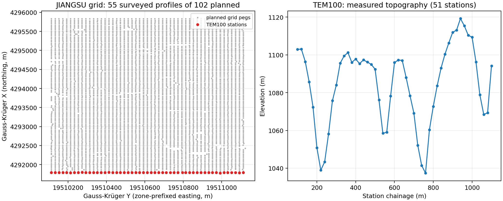
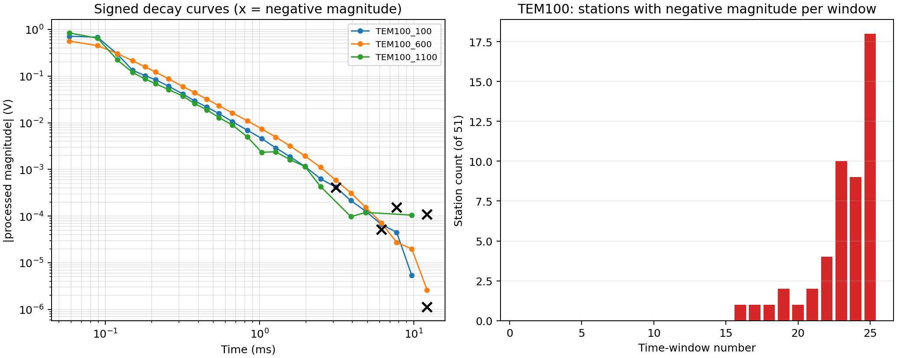
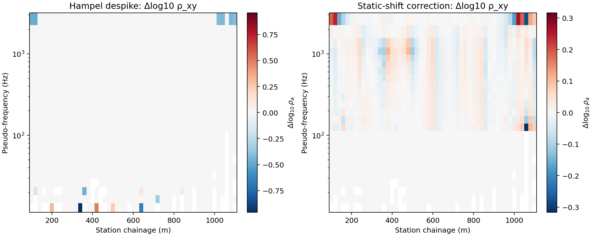
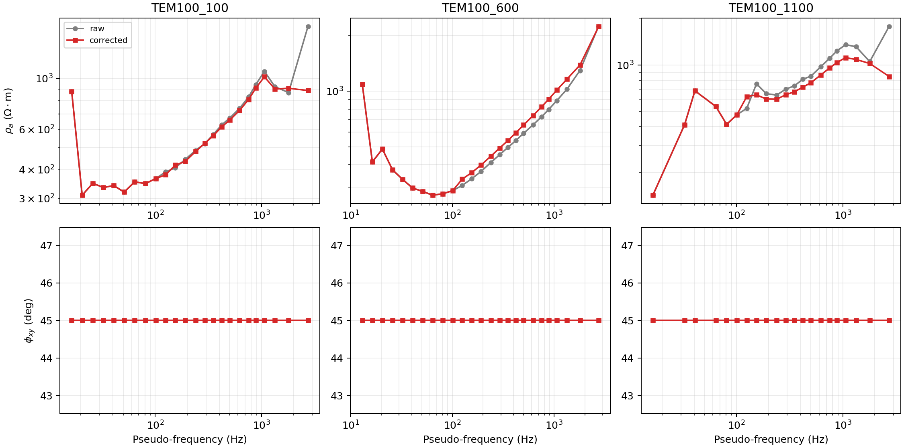
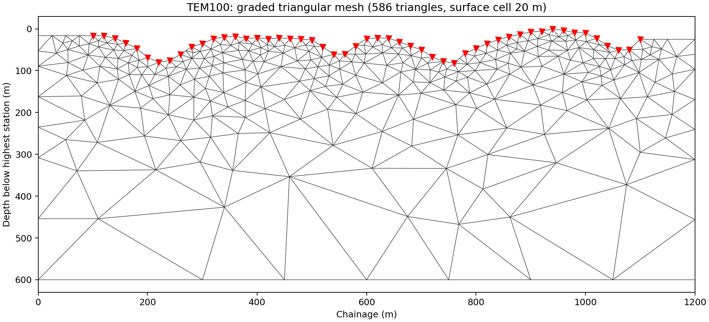
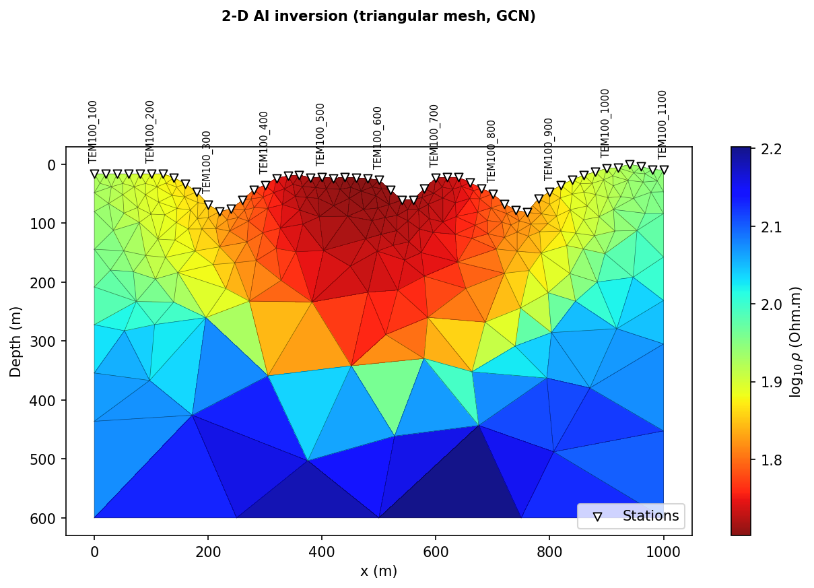

.. _tutorial_process_temavg_survey:

Process A TEMAVG Survey: TEM To Corrected EDI
==============================================

This tutorial walks a real :term:`TEM`/:term:`TDEM` survey from raw field
files to a reviewed, corrected :term:`EDI` collection with a real geographic
anchor, on to an inspectable 2-D triangular :term:`mesh`, and finally to a
real, gated Maxwell-physics AI inversion trained on that mesh: read the
bundled ``data/TEMAVG/JIANGSU`` :term:`TEMAVG file` folder, quality-control
the raw time-domain decay, resolve a geographic coordinate for the local
site grid with :mod:`pycsamt.gis`, transform to pseudo-frequency impedance
with :mod:`pycsamt.tdem`, apply the same :mod:`pycsamt.emtools` corrections
used for frequency-domain surveys, build/draw a real graded, topography-
draped mesh with :mod:`pycsamt.forward.maxwell` and :mod:`pycsamt.api.mesh`,
and train/gate ``Inv2DAgent(physics="mt2d_tri")`` on it, the same in-process
:class:`~pycsamt.forward.maxwell.tri_fem2d.TriFEM2DAdapter` path
:doc:`map_groundwater_geology_from_csamt` uses. The classical, external-binary
route -- :doc:`prepare_mare2dem_inversion`'s :term:`PSLG` triangulation --
stays out of scope here.

:doc:`../theory/tdem_basics` derives every formula used below (transient
diffusion, the late-time apparent-resistivity approximation, pseudo-frequency
conventions, and the noise/error-floor model); this page focuses on the
workflow decisions a real survey forces and does not re-derive that physics.

JIANGSU is a station grid, not one line: the coordinate table spans 102
planned 40 m-spaced profiles, but only 55 were actually surveyed and
processed into ``.AVG``/``.LOG``/``.Z`` file triplets. Every example below
works one representative profile, ``TEM100`` (51 stations, 20 m spacing, a
1000 m line), the same way :doc:`process_zonge_avg_k1_k2` works one line at a
time from a larger CSAMT/AMT survey.

Read the survey folder
-----------------------

:func:`~pycsamt.tdem.read_temavg_survey` parses every ``.AVG`` file in a
folder, groups companion ``.LOG`` and ``.Z`` files by stem, and looks for a
coordinate table using common filenames. The CLI reports the same summary
without writing any Python:

.. code-block:: console

   $ pycsamt tdem info data/TEMAVG/JIANGSU
   Survey root : data\TEMAVG\JIANGSU
   AVG files   : 55
     TEM100  (1275 records)
     TEM1020  (1275 records)
     TEM1060  (1275 records)
     ...
   Z files     : 55
   LOG files   : 55
   Coordinates : 5159 points  (with elevation)

Reading this survey's coordinate table, a legacy ``Coordinate of measuring
point.xls``, needs the optional ``xlrd`` dependency (``pip install
"pycsamt[docs]"`` or ``pip install xlrd``); without it the join is silently
skipped and this line reports ``none found`` instead of raising, so always
check it rather than assuming coordinates loaded.

.. code-block:: pycon

   >>> from pycsamt.tdem import read_temavg_survey
   >>> survey = read_temavg_survey("data/TEMAVG/JIANGSU")
   >>> survey.n_avg_files, survey.n_z_files, survey.n_log_files
   (55, 55, 55)
   >>> survey.coordinates.n_points
   5159
   >>> coords = survey.coordinates.to_dataframe()
   >>> coords.profile.nunique(), len(survey.avg_files)
   (102, 55)

Pick one profile and inspect its geometry
------------------------------------------

The file stem's numeric suffix is the profile id (``TEM100`` -> profile
``100``); within one file, TEMAVG's ``station`` column is the along-profile
chainage. ``TEM100`` is a genuine central-loop sounding: the ``Array``
metadata, the equal ``TXdx``/``TXdy``, and the ``mde`` sidecar's
``Line.Azimuth = 90`` all agree on an east-west, 360 m square transmitter
loop with the receiver at its centre.

.. code-block:: pycon

   >>> avg = survey.get("TEM100")
   >>> avg.metadata
   {'title': 'TEMAVG 7.77: "TEM100.FLD", Dated 21-07-04, Processed 24 Oct 24',
    'Array': 'In Loop (Central Loop)', 'TXramp': 450, 'TXdx': 360,
    'TXdy': 360, 'TXarea': 129600, 'RXarea': 10000}
   >>> len(avg.stations), avg.n_records
   (51, 1275)
   >>> avg.stations[0], avg.stations[-1]
   (100.0, 1100.0)
   >>> soundings = survey.to_soundings(stems=["TEM100"])
   >>> soundings[0].moment  # M = I * n_tx * A_tx
   1296000.0

.. code-dropdown:: ../../scripts/generate_tutorial_temavg_workflow.py
   :language: python
   :pyobject: make_survey_overview
   :linenos:
   :title: View the executed survey-map and topography figure code

   Left: 55 of 102 planned profiles were actually surveyed; ``TEM100`` (red)
   is the southernmost, running east-west along nearly constant Gauss-Krüger
   X (northing). Right: ``TEM100``'s 51 stations cross about 82 m of relief
   (1037-1119 m) over the 1000 m line -- real topography that a later
   inversion mesh needs to honour, not a flat-earth convenience.

Quality-control the raw time-domain decay before transforming
---------------------------------------------------------------

:doc:`../theory/tdem_basics` warns generically against "interpreting noisy
late gates" and "dropping sign information without documenting why."
``TEM100`` shows exactly the pattern that warning is about. TEMAVG's
``magnitude`` column is signed; a negative value at late time means the
stacked transient crossed zero, i.e. the signal has fallen into the noise
floor before that gate. The late-time formula only ever sees ``|dBdt|``, so
feeding a sign-flipped gate through it does not raise an error -- it silently
fabricates an apparent resistivity from noise.

.. code-block:: pycon

   >>> import numpy as np
   >>> mag = np.array([rec.magnitude for rec in avg.records])
   >>> win = np.array([rec.window for rec in avg.records])
   >>> pct = np.array([rec.percent_magnitude for rec in avg.records])
   >>> int((mag < 0).sum()), len(mag)
   (49, 1275)
   >>> round(float(pct.max()), 1)  # the %Mag column alone never flags these
   18.0
   >>> [(w, int(((win == w) & (mag < 0)).sum())) for w in range(20, 26)]
   [(20, 1), (21, 2), (22, 4), (23, 10), (24, 9), (25, 18)]

The percent-magnitude column -- the closest thing TEMAVG provides to a
native error estimate -- never exceeds 18% anywhere in this file, so a
threshold on it alone would not catch a single one of these 49 rows. Only
the sign is diagnostic here, and it grows sharply at the last three windows:
by window 25 (the latest gate, 12.2 ms), 18 of 51 stations have gone
negative.

.. code-dropdown:: ../../scripts/generate_tutorial_temavg_workflow.py
   :language: python
   :pyobject: make_time_domain_qc
   :linenos:
   :title: View the executed decay-curve and per-window QC figure code

   Left: three representative stations follow the expected power-law decay
   for four decades before the marked (x) gates flip sign near the noise
   floor. Right: sign reversals are essentially absent before window 16 and
   climb steeply after window 21 -- a station-dependent, not a fixed-window,
   effect.

The decision applied throughout the rest of this page is to drop each
station's own negative-magnitude gates before transforming, rather than
applying a single blanket window cutoff to every station or, worse, silently
``abs()``-ing them into the late-time formula:

.. code-dropdown:: ../../scripts/generate_tutorial_temavg_workflow.py
   :language: python
   :pyobject: drop_noise_floor_gates
   :linenos:
   :title: View the noise-floor gate-drop function

.. code-block:: pycon

   >>> from docs.scripts.generate_tutorial_temavg_workflow import drop_noise_floor_gates
   >>> cleaned = [drop_noise_floor_gates(s)[0] for s in soundings]
   >>> n_dropped = sum(drop_noise_floor_gates(s)[1] for s in soundings)
   >>> n_dropped, sum(s.n_gates for s in soundings)
   (49, 1275)
   >>> min(s.n_gates for s in cleaned), max(s.n_gates for s in cleaned)
   (15, 25)

One station loses 10 of its 25 gates this way; most lose zero or one. This
trims the deepest nominal sensitivity where the trimming happens (dropping
gate 25 removes the lowest pseudo-frequency point specifically), a real
trade-off against keeping fabricated late-time values -- not a free QC step.

Determine a geographic anchor for the local site grid
---------------------------------------------------------

The coordinate table carries two coordinate pairs per station: a local
``x``/``y`` (the small numbers used so far, ~100 m scale, matching station
chainage) and a projected ``gauss_x``/``gauss_y`` pair in the millions --
Chinese Gauss-Krüger convention, with the zone number folded into
``gauss_y`` as a ``zone * 1,000,000`` prefix. Neither is geographic
lat/lon, and unlike :doc:`process_zonge_avg_k1_k2`'s K1/K2 lines (whose
EPSG:32649 provenance was already known), no CRS is documented for this
survey. It has to be inferred, and checked, before it is used.

.. code-block:: pycon

   >>> y = coords.gauss_y.iloc[0]
   >>> zone = int(y // 1_000_000)
   >>> zone  # embedded in every gauss_y value
   19

pyCSAMT registers this zone under several historical and modern Chinese
datums; ``CGCS2000 / Gauss-Kruger zone 19`` (EPSG:4497) is the current
standard one:

.. code-block:: pycon

   >>> from pycsamt.gis.utils import epsg_project
   >>> lon, lat = epsg_project(y, coords.gauss_x.iloc[0], 4497, 4326)
   >>> round(lon, 4), round(lat, 4)
   (111.1163, 38.7593)

That coordinate is not in Jiangsu -- it is roughly 38.8°N, 111.1°E, near
the Shanxi/Shaanxi border, about 8 degrees of latitude (nearly 900 km)
north of Jiangsu province (30.75-35.2°N). Zone 19 itself only fixes the
*column* of longitude (108-114°E per its EPSG area of use); the northing
value fixes latitude independent of which zone-19 CRS is chosen, and every
CGCS2000/Xian80/Beijing54 zone-19 candidate lands in the same place. The
survey's elevations (1037-1119 m) are equally inconsistent with Jiangsu's
real topography, a mostly flat coastal plain rarely above a few hundred
metres. Both independent checks point the same way: ``gauss_x``/``gauss_y``
reads as a **local site grid with an arbitrary large false origin** --
common practice for Chinese mineral-exploration TEM contractors, and not
unusual when a crew has no RTK tie to the national datum on site -- rather
than true national Gauss-Krüger coordinates. The "JIANGSU" folder name is
provenance for the delivery, not evidence for this specific claim.

This is exactly the kind of gap this documentation build does not paper
over by default. Here it is used anyway, because a geographic anchor is more
useful for the mesh and manifest work below than none, provided it is
labelled for what it is: an explicit best-effort guess, not a verified
survey location.

.. code-dropdown:: ../../scripts/generate_tutorial_temavg_workflow.py
   :language: python
   :pyobject: attach_geographic_coords
   :linenos:
   :title: View the executed coordinate-projection code

.. code-block:: pycon

   >>> from docs.scripts.generate_tutorial_temavg_workflow import attach_geographic_coords
   >>> _ = attach_geographic_coords(soundings, survey)  # mutates in place
   >>> soundings[0].x, soundings[0].y  # now lon, lat -- not local metres
   (111.11634836490072, 38.75930206136827)

Transform to frequency domain and write EDI
----------------------------------------------

:class:`~pycsamt.tdem.TEMtoEDI` wraps :class:`~pycsamt.tdem.LateTimeTransform`
(used here; :class:`~pycsamt.tdem.FourierTransform` needs a captured
transmitter waveform, which this AVG file does not carry, exactly the
limitation :doc:`../theory/tdem_basics` documents) and writes one synthetic
EDI per station. Because only ``Hz`` was measured, every EDI carries a single
independent transfer function: :math:`Z_{xx}=Z_{yy}=0` and
:math:`Z_{yx}=-Z_{xy}`, with phase fixed at the default homogeneous
:math:`45^\circ` rather than measured -- the same single-component
limitation :doc:`process_zonge_avg_k1_k2` documents for the Ex-Hy-only K1/K2
lines, here even more synthetic since even :math:`Z_{xy}` itself is derived
from one decay curve rather than an independently recorded electric channel.

.. code-dropdown:: ../../scripts/generate_tutorial_temavg_workflow.py
   :language: python
   :pyobject: convert_profile_to_edi
   :linenos:
   :title: View the executed clean -> transform -> write -> reload code

.. code-block:: pycon

   >>> from docs.scripts.generate_tutorial_temavg_workflow import convert_profile_to_edi, RESULTS
   >>> raw_sites, stats = convert_profile_to_edi(soundings, RESULTS / "edi_raw" / "TEM100")
   >>> stats
   {'n_dropped_total': 49, 'n_gates_in': 1275, 'n_written': 51,
    'n_reloaded': 51, 'n_gates_out_min': 15, 'n_gates_out_max': 25}
   >>> raw_sites[0].coords  # (lat, lon, elev), real now, not NaN
   (38.759302777777776, 111.11634722222222, 1102.9537)

The CLI equivalent for a full survey folder (or, with ``--stems``, one
profile) is:

.. code-block:: console

   $ pycsamt tdem convert data/TEMAVG/JIANGSU --stems TEM100 --dry-run
   Dry run — 51 sounding(s) would be converted:
     TEM100_100
     TEM100_120
     TEM100_140
     ...
     TEM100_1080
     TEM100_1100

   $ pycsamt tdem convert data/TEMAVG/JIANGSU --stems TEM100 \
       --output-dir results/process_temavg_survey/edi_raw/TEM100

The CLI path above skips the coordinate-projection step, so it writes
``HEAD`` with the raw local ``x``/``y`` from the coordinate table; those
values are outside geographic bounds (``y`` up to 1100), so ``TEMtoEDI``
leaves ``LAT``/``LONG`` unset rather than writing an invalid geographic
coordinate, and records the local values as an ``INFO`` note instead. The
Python path above is what actually gets a (best-effort) geographic
coordinate into ``HEAD``, because it runs
:func:`attach_geographic_coords` first.

One further detail of this write/reload round trip is worth stating
explicitly: ``Site.rho``/``Site.phase`` reload correctly because
``TEMtoEDI`` builds :math:`|Z_{xy}|` with pyCSAMT's own field-unit EDI
convention, :math:`|Z|=\sqrt{5f\rho_a}` (the same one
:meth:`pycsamt.z.resphase.ResPhase.compute_resistivity_phase` uses to read
resistivity back out) -- not the SI convention
:math:`|Z|=\sqrt{\rho_a\omega\mu_0}`, which shares the same
:doc:`../theory/tdem_basics` late-time derivation but is not what the rest of
pyCSAMT's EDI stack expects when it reads ``Z`` back off disk.

Correct the EDI collection
----------------------------

The same single-component limitation from the previous section rules out
phase-tensor, skew, and strike diagnostics here for the same reason
:doc:`process_zonge_avg_k1_k2` gives for K1/K2: :math:`\operatorname{Re}\mathbf
Z` is singular with only one measured off-diagonal entry. What *is*
applicable is the same two-stage frequency-domain conditioning used there:
a Hampel despike in magnitude/phase space, then the Torres-Verdín-Bostick
Hanning spatial filter for static shift, this time over the real 20 m
station spacing.

.. code-dropdown:: ../../scripts/generate_tutorial_temavg_workflow.py
   :language: python
   :pyobject: make_edi_processing
   :linenos:
   :title: View the executed Hampel + static-shift correction code

.. code-block:: pycon

   >>> from docs.scripts.generate_tutorial_temavg_workflow import make_edi_processing
   >>> _, despiked, corrected, proc_stats = make_edi_processing(raw_sites)
   >>> proc_stats
   {'hampel_cells_changed': 16, 'hampel_cells_total': 1226,
    'static_median_abs_log10': 0.0044, 'static_max_abs_log10': 0.3164}

The despike changed 16 of 1226 frequency-station cells -- sparse, as
expected for outlier detection on an otherwise smooth curve. The static-shift
correction is far gentler here than the 0.21-0.36 log10-decade median shifts
found for the K1/K2 field CSAMT lines: a median of 0.0044 decades. This is
not proof the correction was unnecessary; a synthetic tensor built from one
smoothly-varying Hz decay per station is, by construction, spatially smoother
than an independently measured field line, and no independent static-shift
diagnostic (a co-located sounding, or a second measured component) exists
here to validate the correction either way. It is applied to demonstrate the
workflow, not because it has been independently confirmed against geology.

   Left: Hampel changes are isolated single cells, concentrated at the
   noisiest late-time (low pseudo-frequency) row. Right: the static-shift
   correction is broad but small through the profile interior, and largest
   at both ends -- the expected edge effect of a finite 200 m Hanning window
   with no stations beyond the profile to average against.

Compare raw and corrected responses at three stations
---------------------------------------------------------

.. code-dropdown:: ../../scripts/generate_tutorial_temavg_workflow.py
   :language: python
   :pyobject: make_response_panels
   :linenos:
   :title: View the executed three-station comparison figure code

   Top row: apparent resistivity retains its overall shape after correction,
   with the largest changes at the highest and lowest pseudo-frequencies --
   consistent with the noise-floor gates trimmed earlier and the Hanning
   window edge effect. Bottom row: phase is flat at exactly
   :math:`45^\circ` for every station, raw and corrected alike. That is not
   a finding; it is ``phase_mode="homogeneous"`` by construction, and
   neither correction touches phase since both only rescale :math:`|Z|` by a
   real positive factor. Plotting it here makes that limitation visible
   instead of hiding it behind an unlabeled flat line.

What this profile cannot support
------------------------------------

Being explicit about scope here matters as much as the corrections
themselves:

* **No tensor diagnostics.** Phase tensor, skew, and geoelectric strike all
  need a non-singular :math:`\mathbf Z`; this survey measured one component.
* **No Fourier transform.** ``TEM100``'s AVG file carries no captured
  transmitter waveform, so :class:`~pycsamt.tdem.FourierTransform`'s
  waveform-deconvolution advantage over the late-time approximation is not
  available without first supplying an external waveform model.
* **No independent static-shift validation.** The correction in the previous
  section is a documented processing choice, not a confirmed fit to
  geology -- there is no second sounding or component at any station to
  check it against.
* **No source-effect screening.** :func:`~pycsamt.emtools.classify_field_zones`
  and :func:`~pycsamt.emtools.detect_source_overprint` need a measured
  transmitter-to-receiver offset; a central-loop TEM survey with the receiver
  at the loop centre has no such offset to supply.
* **No verified geographic coordinates.** The ``HEAD`` ``LAT``/``LONG`` now
  carry a real value, but it is the explicit best-effort guess from the
  section above, not a confirmed survey location -- treat any map or
  distance computed from it accordingly.

Write the corrected collection and a coordinate manifest
-------------------------------------------------------------

.. code-dropdown:: ../../scripts/generate_tutorial_temavg_workflow.py
   :language: python
   :pyobject: write_manifest
   :linenos:
   :title: View the executed manifest-writing code

.. code-block:: pycon

   >>> from docs.scripts.generate_tutorial_temavg_workflow import write_manifest
   >>> out_dir, paths = write_manifest(corrected)
   >>> len(paths)
   51

Now that :func:`attach_geographic_coords` has run, ``lat``/``lon``/``elev``
all come out real, finite values -- not ``NaN`` -- because they are read
straight from each site's ``HEAD``, which the write/reload step above
already populated:

.. code-block:: pycon

   >>> import pandas as pd
   >>> manifest = pd.read_csv(out_dir / "manifest.csv")
   >>> manifest[["station", "lat", "lon", "elev", "chainage"]].head(2)
        station        lat         lon       elev  chainage
   0  TEM100_100  38.759303  111.116347  1102.9537       NaN
   1  TEM100_120  38.759303  111.116578  1103.0357       NaN

``chainage`` alone is still ``NaN``: :func:`~pycsamt.site.export.write_sites`
reads it from an explicit ``ed.chainage`` attribute that nothing in this
pipeline sets, independent of whether lat/lon are known. The along-profile
distance used below for the mesh comes directly from each station's name
suffix instead, which for this survey already *is* physical chainage in
metres (confirmed back in "Pick one profile and inspect its geometry").

Build and view the 2-D triangular mesh
-------------------------------------------

This is the point :doc:`prepare_mare2dem_inversion` and
:doc:`../api_guide/mesh` pick up from -- an unstructured triangular mesh
graded around real station positions and draped on real topography, built
here with :func:`~pycsamt.forward.maxwell.tri_mesh_gen.build_graded_tri_mesh`
and drawn with :func:`~pycsamt.api.mesh.draw_tri_mesh`. Handing it to
MARE2DEM is still out of scope for this page, but actually solving on it is
not -- the next section trains a real AI inversion directly on this mesh.

The finest cell size at each station is set from this profile's own skin
depth at its highest measured pseudo-frequency, not a fixed constant:

.. math::

   \delta \approx 503\sqrt{\rho_a / f}

.. code-dropdown:: ../../scripts/generate_tutorial_temavg_workflow.py
   :language: python
   :pyobject: make_mesh
   :linenos:
   :title: View the executed mesh-building and drawing code

.. code-block:: pycon

   >>> from docs.scripts.generate_tutorial_temavg_workflow import make_mesh
   >>> target, mesh, mesh_stats = make_mesh(corrected)
   >>> mesh_stats
   {'n_nodes': 334, 'n_triangles': 586, 'surface_cell_m': 20.0,
    'skin_depth_m_at_fmax': 453.5, 'freq_max_hz': 2729.0,
    'x_range_m': (0.0, 1200.0), 'z_range_m': (0.0, 600.0)}

   586 triangles honour the real elevation profile from the first figure
   (the same double-valley shape) and grade from a 20 m surface cell near
   the 51 station markers out to 600 m depth. 20 m follows directly from the
   median apparent resistivity at this profile's highest frequency
   (2729 Hz): a ~454 m skin depth, and the "~0.03-0.05 skin depths at the
   first layer" sizing guidance :func:`build_graded_tri_mesh
   <pycsamt.forward.maxwell.tri_mesh_gen.build_graded_tri_mesh>` documents
   for :class:`~pycsamt.forward.maxwell.tri_fem2d.TriFEM2DAdapter` accuracy.
   600 m depth is a demonstration choice, comfortably below the 82 m of
   surface relief, not a resolved investigation depth for this survey.

Train And Gate A Maxwell AI Inversion
-------------------------------------

``Inv2DAgent(physics="mt2d_tri")`` trains a graph-convolutional network
directly on this mesh's own triangle-adjacency graph, solving each synthetic
training realization with a real forward operator
(:class:`~pycsamt.forward.maxwell.tri_fem2d.TriFEM2DAdapter`, no external
binary), the same in-process path :doc:`map_groundwater_geology_from_csamt`
uses for Tongkeng. Training needs one shared frequency band across every
station; gate-dropping in the QC section above did not remove the same
gates everywhere, so the 51 stations do not all carry the same 25-point grid
any more -- restrict to what they still share:

.. code-block:: pycon

   >>> from pycsamt.site.edit import select_freq_all
   >>> usable = select_freq_all(corrected, fmin=125.0)
   >>> [len(s.freq) for s in usable][:3], len(usable)
   ([15, 15, 15], 51)

125.0-2729.0 Hz, 15 of the original 25 frequencies, survives at every
station -- the ten lowest-frequency (latest-time, deepest-sensitivity)
gates are exactly the ones the earlier noise-floor QC trimmed unevenly
station to station.

.. code-dropdown:: ../../scripts/generate_tutorial_temavg_workflow.py
   :language: python
   :pyobject: run_ai_inversion
   :linenos:
   :title: View the executed training, gating, and figure-copy code

100 training realizations at up to 100 epochs, with validation-based early
stopping (``patience=15``) rather than a fixed epoch count -- a real step up
from the 40-realization/10-station teaching-scale run
:doc:`map_groundwater_geology_from_csamt` uses, though still far from a
production configuration:

.. code-block:: pycon

   >>> from docs.scripts.generate_tutorial_temavg_workflow import run_ai_inversion
   >>> result = run_ai_inversion(corrected)
   >>> result.status, result.data["pred_triangles"]["mesh"].n_triangles
   ('success', 486)
   >>> result.data["epochs_completed"]
   29

Early stopping cut training off at epoch 29 of the 100 requested, not
because of a crash or a fixed budget -- validation loss stopped improving
for 15 consecutive epochs after its best point and training restored that
best checkpoint rather than the final one:

.. code-block:: pycon

   >>> h = result.data["training_history"]
   >>> round(h["train_loss"][0], 4), round(h["train_loss"][-1], 4)
   (0.9852, 0.5994)
   >>> round(h["val_loss"][0], 4), round(h["val_loss"][-1], 4)
   (2.4569, 2.1756)
   >>> round(result.data["best_validation_loss"], 4)
   1.253

Training loss falls steadily throughout, the model keeps fitting its own
training realizations better every epoch, exactly as expected. Validation
loss does not track it down the same way, which is the entire reason
``patience`` exists: a model still being rewarded on training data while
stalling (or worsening) on held-out data is the definition of starting to
overfit, and the checkpoint this run actually kept is from the epoch where
validation loss was lowest, not epoch 29's.

   The direct per-triangle ``log10(resistivity)`` prediction. Station labels
   thin to every fifth one (11 of 51) to stay legible -- the same
   :class:`~pycsamt.api.station.StationAxisStyle` thinning every other
   station-axis figure in this documentation set uses, not a special case
   for this line. A broad, resistive core sits under the shallow saddle
   near the profile centre, more conductive toward both ends at depth --
   plausible in general shape, but see the gate immediately below before
   reading anything more specific into it.

Gate The Result Before Interpretation
---------------------------------------

The same fixed-in-advance thresholds
:doc:`map_groundwater_geology_from_csamt` uses, checked against this run's
actual held-out recovery:

.. code-block:: pycon

   >>> recovery = result.data["mt2d_tri_recovery"]
   >>> round(recovery["rmse"], 4), round(recovery["r2"], 4), recovery["n_samples"]
   (0.5499, -0.2143, 10)
   >>> recovery_pass = recovery["rmse"] <= 0.25 and recovery["r2"] >= 0.60
   >>> enough_test_models = recovery["n_samples"] >= 20
   >>> promote = recovery_pass and enough_test_models
   >>> promote
   False

A negative :math:`R^2` means this run does not reconstruct held-out geology
any better than predicting the training mean would -- a real, informative
failure, not close to passing, even with early stopping doing its job and
2.5x Tongkeng's teaching-scale realization count. It is a genuine
improvement over an otherwise-identical run this page's own draft made
before the station-label fix below (RMSE 0.673, :math:`R^2=-0.831`, 21
epochs) -- and that gap, from nothing but a different random initialization
under the same ``seed=0``, is the same known GCN reproducibility gap
:doc:`../user_guide/ai_inversion/agents` documents for ``Inv3DAgent``:
seeding narrows run-to-run variation, it does not eliminate it. Treat
today's numbers as one representative run, and the specific station-marker
fix below as the reason this page's figure is legible at all, not as
evidence this configuration is close to production-ready.

100 realizations, 51 stations, and 15 frequencies is real progress over a
ten-station teaching example, but a production run needs the same scale-up
:doc:`map_groundwater_geology_from_csamt` recommends and found genuinely
hard to get right: hundreds of realizations, multiple seeds, and
validation-based early stopping applied *consistently* rather than as an
afterthought -- that tutorial's own ``--production`` run, which disabled
early stopping, made results dramatically worse, not better.

A Real Station-Label Bug, Found By Running This At 51 Stations
-------------------------------------------------------------------

``Inv2DAgent``'s ``mt2d_tri`` figure code labels every station by name
above its marker. That is legible for Tongkeng's 10 stations, and was
tested only at that scale before this page: at TEM100's 51, the labels
collided into unreadable clutter and ran straight through the figure title.
The fix draws only a thinned subset of labels --
:class:`~pycsamt.api.station.StationAxisStyle`'s own ``label_indices``
logic, already used for every other station-axis figure in this
documentation set, just not wired into this one until now -- and moves the
title clear of them with a real points-based ``pad`` rather than an
axes-fraction margin, because :class:`~pycsamt.api.plot.PlotConfig`'s
default ``bbox_inches="tight"`` crops empty margin away at save time and
silently undid a first attempt at the fix. Both the figure above and
:doc:`map_groundwater_geology_from_csamt`'s own ``csamt_ai2d_tri_section.png``
were regenerated with the corrected code.

Before feeding the corrected collection or this mesh into
:doc:`prepare_mare2dem_inversion`, remember that the geographic anchor is
still the labelled best-effort guess from earlier on this page, not a
confirmed survey location -- the mesh itself is in local chainage metres and
is unaffected by that uncertainty, but any step that needs true geographic
coordinates (a basemap, a distance to a known feature) is not. MARE2DEM's
``.emdata`` conversion and the resistivity-grid design that becomes its own
triangulated mesh are exactly where that tutorial picks up.
