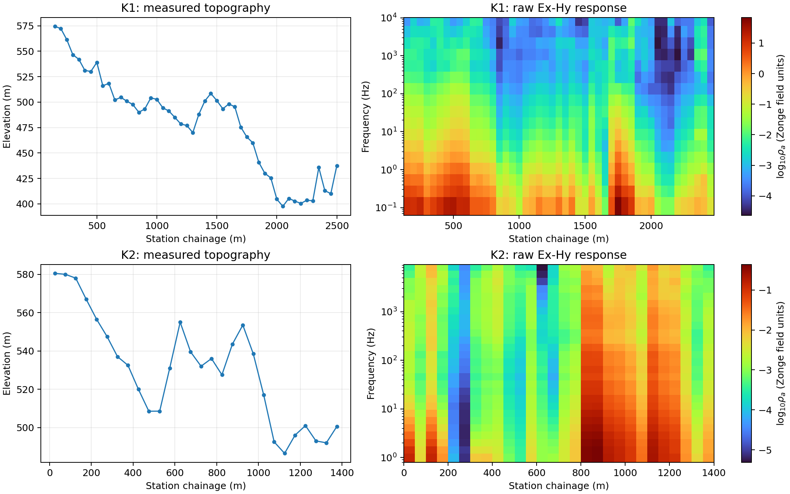
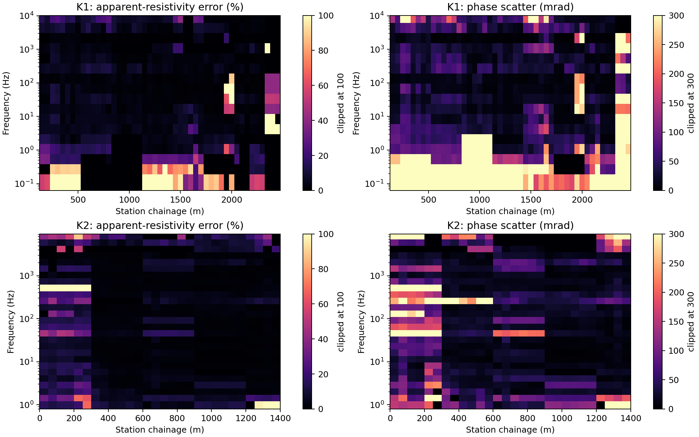
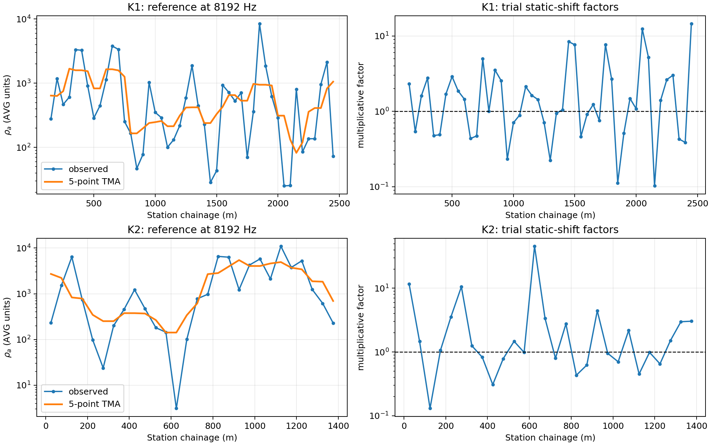
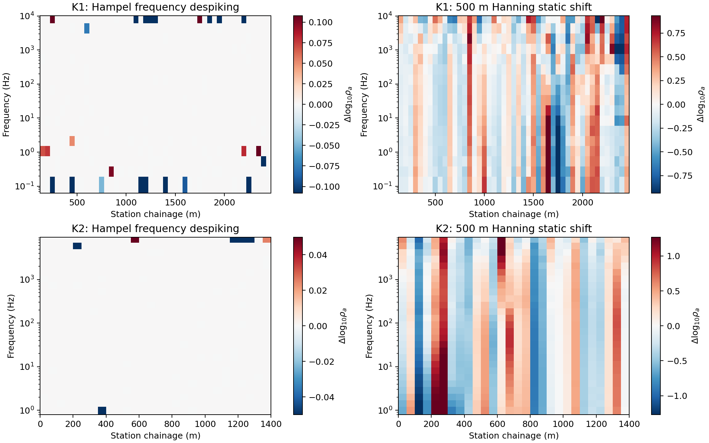
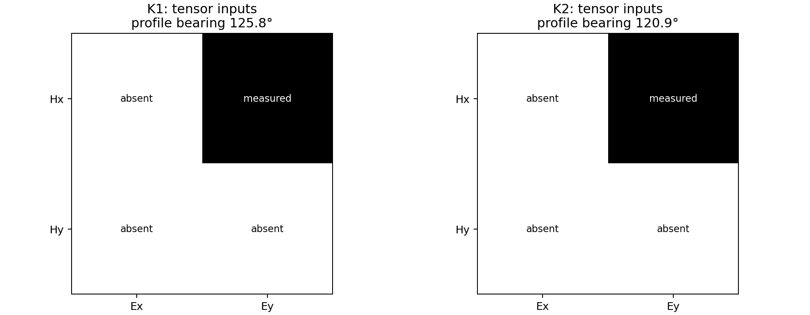
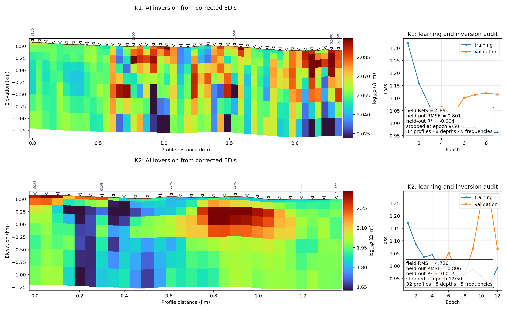

.. _tutorial_zonge_avg_k1_k2:

Process Zonge AVG Lines K1 and K2
=================================

This case study begins with the two bundled :term:`AVG file` surveys and ends
with reproducible classical- and AI-inversion recipes. K1 is a legacy
47-station line; K2 is a modern 28-station line. Their companion ``.stn``
files supply WGS84 / UTM Zone 49N coordinates and measured elevations. The
examples use repository-relative paths and write every derived product below
``results/zonge_avg_tutorial``; the source data are never modified.

The page concentrates on work that earlier tutorials do not repeat:
legacy/modern Zonge parsing, K2 receiver-midpoint geometry, coordinate-safe
AVG-to-EDI conversion, CSAMT source-effect screening, confidence-gated
frequency editing, and the boundary between a scalar-line Occam2D baseline
and AI inversion. Follow :doc:`prepare_occam2d_inversion` for native-file
details, :doc:`run_classical_inversions` for result loading, and
:doc:`ai_inversion_from_corrected_edis` for the full AI validation audit.

Read the field files before converting them
-------------------------------------------

:class:`~pycsamt.zonge.avg.AVG` normalizes both Zonge encodings into the same
tidy representation. Missing values remain missing; they are not silently
interpolated at read time.

.. code-block:: pycon

   >>> from pycsamt.zonge import AVG
   >>> for line in ("K1", "K2"):
   ...     avg = AVG.from_file(f"data/avg/{line}.AVG")
   ...     z, freq, station = avg.to_tensor(var="z")
   ...     print(line, z.shape, len(freq), station.min(), station.max())
   K1 (47, 17, 2, 2) 17 150.0 2450.0
   K2 (28, 27, 2, 2) 27 25.0 1375.0

Both files contain only Ex-Hy, represented as :math:`Z_{xy}`. A zero
:math:`Z_{yx}` used to complete a :math:`2\times2` storage array is not a
second measurement. Consequently tensor skew, Groom--Bailey decomposition,
strike rotation, and joint TE/TM inversion are scientifically unavailable.
A function accepting the array shape does not imply that the required field
components were measured.

For angular frequency :math:`\omega=2\pi f`, the usual SI definitions are

.. math::

   \rho_a(f) = \frac{|Z_{xy}(f)|^2}{\mu_0\omega}, \qquad
   \phi(f) = \operatorname{atan2}(\Im Z_{xy},\Re Z_{xy}).

The files retain the historical Zonge field-unit impedance convention. Do
not rescale values by eye: preserve the parser's unit metadata and compare
exported EDI responses against AVG. :doc:`../theory/impedance_tensor`
derives the unit distinction.

Attach and reconcile station geometry
-------------------------------------

K1 measurements and ``K1.stn`` share chainages. K2 is subtler:
observations are at 25, 75, 125, ... m, while ``K2.stn`` stores the 0, 50,
100, ... m survey pegs. The observed locations are :term:`receiver midpoint`
positions, so equality matching would leave every K2 EDI at zero longitude
and latitude. Linear interpolation is justified because every midpoint lies
between measured pegs; the executable example rejects extrapolation.

.. code-dropdown:: ../../scripts/generate_tutorial_zonge_avg_workflow.py
   :language: python
   :pyobject: load_line
   :linenos:
   :title: View exact-match and midpoint-coordinate preparation

.. code-block:: pycon

   >>> from docs.scripts.generate_tutorial_zonge_avg_workflow import load_line
   >>> k1, k1_edis = load_line("K1")
   >>> k2, k2_edis = load_line("K2")
   >>> for name, avg, edis in (("K1", k1, k1_edis), ("K2", k2, k2_edis)):
   ...     head = edis[0].get_section("head")
   ...     print(name, len(edis), round(head.lat, 5), round(head.long, 5), head.elev)
   K1 47 26.0524 113.48716 574.5
   K2 28 25.59628 110.77275 580.5

``add_topography`` preserves projected coordinates and elevation;
``convert_coords(to="ll", inplace=True)`` creates the geographic columns
that :class:`~pycsamt.transformers.AVGtoEDI` writes into EDI ``HEAD`` and
``DEFINEMEAS``. EPSG:32649 is this dataset's provenance, not a universal
default. Use the field crew's verified CRS for another survey.

   K1 crosses about 177 m of relief over 2.3 km; K2 crosses about 94 m over
   1.35 km after midpoint interpolation. Broad structure persists through
   adjacent frequencies, whereas isolated cells and edge bands need QC.
   Frequency increases upward, placing the shallow-sensitive high-frequency
   response at the top and the deeper-sensitive low-frequency response at the
   bottom; frequency is a sensitivity scale, not a literal depth coordinate.
   Colours are raw Zonge field-unit responses, not a resistivity model.

Preview coordinate-bearing EDI serialization
--------------------------------------------

This early write/read round trip verifies the transformer and coordinates; it
does not yet nominate the inversion input. Write each line separately and
fail if any station cannot be serialized.

.. code-block:: pycon

   >>> from pathlib import Path
   >>> root = Path("results/zonge_avg_tutorial")
   >>> for name, collection in (("K1", k1_edis), ("K2", k2_edis)):
   ...     report = collection.export(root / "edi_raw" / name)
   ...     if report["failed"]:
   ...         raise RuntimeError(report["failed"])
   ...     print(name, len(report["successful"]), "EDI files")
   K1 47 EDI files
   K2 28 EDI files

Read the files back rather than trusting only in-memory objects. ``lines`` is
the immutable raw-EDI control mapping used below:

.. code-block:: pycon

   >>> from pycsamt.emtools import ensure_sites
   >>> lines = {
   ...     name: ensure_sites(root / "edi_raw" / name, recursive=False).ordered()
   ...     for name in ("K1", "K2")
   ... }
   >>> [(name, len(sites)) for name, sites in lines.items()]
   [('K1', 47), ('K2', 28)]

Compare first and last EDI coordinates with ``topo.frame`` and confirm every
latitude, longitude, elevation, frequency, and complex :math:`Z_{xy}` value
is finite wherever AVG was finite. :doc:`../user_guide/transformers`
explains the lower-level naming, unit, and section-writing contracts.

Choose processing from evidence
-------------------------------

Begin with native AVG QC because it retains ``%Rho``, phase scatter, and
electric/magnetic errors that a reduced EDI may not preserve:

.. code-block:: console

   pycsamt avg validate data/avg/K1.AVG --top 15
   pycsamt avg validate data/avg/K2.AVG --top 15
   pycsamt avg stations data/avg/K2.AVG --stn-file data/avg/K2.stn

The figure below was computed directly from all 1,555 AVG rows. It is more
informative than a generic full-tensor confidence score because these scalar
files have no measured :math:`Z_{yx}`. Such a score would incorrectly treat
the absent component as an off-diagonal mismatch.

   K1 has median ``%Rho=3.0`` and median phase scatter ``34.4 mrad``;
   its 90th percentiles rise to ``29.22%`` and ``545.2 mrad``. K2 has
   medians ``2.5%`` and ``22.1 mrad`` and 90th percentiles ``17.15%`` and
   ``152.9 mrad``. The long-period/high-scatter patches and isolated vertical
   bands should be reviewed before any global frequency rejection. Values are
   clipped only for display; the calculations retain their full magnitude.

.. code-dropdown:: ../../scripts/generate_tutorial_zonge_avg_workflow.py
   :language: python
   :pyobject: make_native_qc
   :linenos:
   :title: View the executed native-QC figure code

This supports a scalar-safe mask based on the recorded uncertainties. Keep
the original rows and attach a reason rather than deleting them immediately:

.. code-block:: pycon

   >>> import numpy as np
   >>> reviewed_avg = {}
   >>> for name in ("K1", "K2"):
   ...     avg = AVG.from_file(f"data/avg/{name}.AVG")
   ...     frame = avg.df.copy()
   ...     frame["review_reason"] = ""
   ...     bad_rho = frame["pc_rho"].gt(50.0)
   ...     bad_phase = frame["s_phz"].gt(300.0)
   ...     frame.loc[bad_rho, "review_reason"] += "rho_error>50%;"
   ...     frame.loc[bad_phase, "review_reason"] += "phase_scatter>300mrad;"
   ...     reviewed_avg[name] = frame
   ...     print(name, "review rows:", int((bad_rho | bad_phase).sum()))
   K1 review rows: 139
   K2 review rows: 38

The thresholds are explicit first-pass gates, not automatic truth. Review
curves at the flagged station-frequency pairs and revise them with field
notes. :func:`~pycsamt.emtools.frequency.edit_frequencies_by_confidence` is
appropriate for genuine two-component MT data, but its off-diagonal term is
not an admissible decision rule for these Ex-Hy-only lines.

Run and inspect a static-shift trial
~~~~~~~~~~~~~~~~~~~~~~~~~~~~~~~~~~~

:class:`~pycsamt.zonge.processing.ASTATIC` can execute Zonge-style spatial
filtering before EDI export. The following trial was run on fresh copies of
both AVG objects, using the highest shared frequency and a five-station
:term:`trimmed moving average`. It never mutates the bundled files.

.. code-block:: pycon

   >>> from pycsamt.zonge.processing import ASTATIC
   >>> trials = {}
   >>> for name in ("K1", "K2"):
   ...     raw = AVG.from_file(f"data/avg/{name}.AVG")
   ...     ref = float(raw.df.freq.max())
   ...     proc = ASTATIC().read(raw)
   ...     shifts = proc.correct_static_shift(
   ...         reference_freq=ref, filter_method="tma",
   ...         window_size=5, update_components=True,
   ...     )
   ...     trials[name] = (proc.avg, shifts)
   ...     print(
   ...         name, ref,
   ...         round(float(shifts.shift_factor.min()), 3),
   ...         round(float(shifts.shift_factor.max()), 3),
   ...         round(float(shifts.shift_factor.median()), 3),
   ...     )
   K1 8192.0 0.102 14.507 1.403
   K2 8192.0 0.13 45.665 1.157

   The trial does not justify accepting the correction. K1 factors span
   about 0.10--14.51 and K2 spans 0.13--45.67; the latter is driven partly by
   the 625 m station's very small reference-frequency response. Median
   absolute changes are 0.327 and 0.271 log10 decades respectively. Factors
   this extreme say that the chosen high-frequency reference is unstable or
   strongly structured, not automatically that geology-free static shift has
   been isolated. Compare reference frequencies and window sizes, inspect
   native errors, and retain the raw line as the Occam2D control run.

.. code-dropdown:: ../../scripts/generate_tutorial_zonge_avg_workflow.py
   :language: python
   :pyobject: make_static_shift_diagnostics
   :linenos:
   :title: View the executed static-shift trial and plotting code

Capacitive-coupling correction is not run because the method requires
measured electrode contact resistance, setup length, and wire capacitance;
none is present in the bundled files. Supplying convenient constants would
produce an image, but not a reproducible correction.

The Zonge decision is therefore explicit: neither the extreme 8192 Hz static
trial nor an undocumented capacitive correction is accepted. The selected
AVG product for both lines is the coordinate-attached, otherwise unmodified
AVG object already transformed and round-trip checked above. This is not a
failure to process; it is a processing decision supported by the captured
diagnostics. ``lines`` now becomes the starting point for applicable EDI
conditioning.

Screen controlled-source effects without inventing geometry
~~~~~~~~~~~~~~~~~~~~~~~~~~~~~~~~~~~~~~~~~~~~~~~~~~~~~~~~~~~~

Two additional :mod:`pycsamt.emtools` diagnostics are relevant, but cannot
be executed honestly from these four files alone. With skin depth
:math:`\delta_B\simeq356\sqrt{\rho_a/f}` m and source distance :math:`r`, the
dimensionless :math:`|kr|\propto r/\delta_B` separates near, transition, and
far fields. :func:`~pycsamt.emtools.fieldzone.classify_field_zones` and
:func:`~pycsamt.emtools.source_effects.detect_source_overprint` require the
surveyed transmitter-to-receiver offsets. Supply them from the field record;
never infer them from receiver chainage:

.. code-block:: pycon

   >>> from pycsamt.emtools import classify_field_zones, detect_source_overprint
   >>> # Define from the external transmitter survey before running this block.
   >>> source_offsets_m = {s.name: measured_offset[s.name] for s in lines["K1"]}
   >>> zones = classify_field_zones(lines["K1"], source_offset=source_offsets_m)
   >>> overprint = detect_source_overprint(
   ...     lines["K1"], source_offset=source_offsets_m
   ... )

``measured_offset`` is deliberately undefined: bundled AVG/STN files lack
defensible transmitter coordinates. A source-effect figure or correction
without that observation would be fabricated. Do not use tensor-only
anisotropy, skew, strike, or off-diagonal consistency on these inputs either.

Process the converted EDIs and export the inversion input
~~~~~~~~~~~~~~~~~~~~~~~~~~~~~~~~~~~~~~~~~~~~~~~~~~~~~~~~~

The accepted, executable EDI sequence is deliberately short and compatible
with the one measured Ex-Hy component:

#. a frequency-domain :term:`Hampel filter` in magnitude/phase space detects
   isolated response spikes without smoothing every datum;
#. the Torres--Verdín--Bostick Hanning spatial correction estimates static
   shift from :math:`Z_{xy}` only, over a 500 m window;
#. corrected EDIs and a coordinate manifest are written, reloaded, and counted
   before either inversion sees them.

.. code-block:: pycon

   >>> from pycsamt.emtools import correct_static_shift, hampel_filter_freq
   >>> from pycsamt.site.export import write_sites
   >>> corrected_lines = {}
   >>> for name, raw_sites in lines.items():
   ...     despiked = hampel_filter_freq(
   ...         raw_sites, win=2, nsig=3.0, on="z",
   ...         domain="magphase", inplace=False,
   ...     )
   ...     corrected = correct_static_shift(
   ...         despiked, window_m=500.0, spacing_m=50.0,
   ...         comp="xy", inplace=False,
   ...     )
   ...     out = root / "edi_corrected" / name
   ...     paths = write_sites(
   ...         corrected, out, exist_ok=True,
   ...         manifest_csv=out / "manifest.csv",
   ...     )
   ...     corrected_lines[name] = ensure_sites(out).ordered()
   ...     print(name, len(paths), len(corrected_lines[name]))
   K1 47 47
   K2 28 28

The code was executed through the reusable generator. Hampel despiking changed
25 K1 station-frequency cells and 7 K2 cells; its median absolute change is
zero because most observations are deliberately preserved. The following
panels show every change introduced by each operation rather than only the
more attractive corrected response.

   Frequency despiking is sparse, concentrated at isolated edge-band cells.
   The spatial correction is much broader: median absolute changes are 0.213
   log10 decades for K1 and 0.358 for K2, with some stations exceeding one
   decade. That scale requires a sensitivity run with wider windows and an
   uncorrected control inversion. The files are technically valid corrected
   EDIs, but processing provenance—not the filename—determines whether they
   are acceptable for interpretation.

.. code-dropdown:: ../../scripts/generate_tutorial_zonge_avg_workflow.py
   :language: python
   :pyobject: make_edi_processing
   :linenos:
   :title: View the complete executed EDI processing, export, reload, and plotting code

From this point onward, ``corrected_lines`` is the sole input mapping used by
the inversion examples. Keep ``lines`` unchanged for raw-versus-corrected
control runs.

Compare station responses before tensor diagnostics
~~~~~~~~~~~~~~~~~~~~~~~~~~~~~~~~~~~~~~~~~~~~~~~~~~~

A line-wide change map can hide a poor curve at one receiver. The public
one-dimensional plotting API therefore checks the first, middle, and last
station of each line. ``raw=True`` deliberately selects the black raw-data
style and draws the imported uncertainty bars; ``raw=False`` uses the normal
pyCSAMT component style for the corrected values.

.. code-block:: pycon

   >>> from pycsamt.emtools import plot_raw_sites_1d
   >>> for name in ("K1", "K2"):
   ...     station_names = [site.station for site in lines[name]]
   ...     selected = [station_names[0], station_names[len(station_names)//2],
   ...                 station_names[-1]]
   ...     raw_figure = plot_raw_sites_1d(
   ...         lines[name], stations=selected, components=("xy",),
   ...         raw=True, show_error_bars=True, ncols_groups=3,
   ...     )
   ...     corrected_figure = plot_raw_sites_1d(
   ...         corrected_lines[name], stations=selected, components=("xy",),
   ...         raw=False, show_error_bars=True, ncols_groups=3,
   ...     )
   ...     print(name, selected)
   K1 ['S150', 'S1300', 'S2450']
   K2 ['S025', 'S725', 'S1375']

.. grid:: 1 1 2 2
   :gutter: 2

   .. grid-item::

      .. image:: ../images/tutorials/zonge_avg_workflow/k1_three_station_raw_rho_phase.png
         :alt: Raw apparent resistivity and phase with error bars at three K1 stations.
         :width: 100%

   .. grid-item::

      .. image:: ../images/tutorials/zonge_avg_workflow/k1_three_station_corrected_rho_phase.png
         :alt: Corrected apparent resistivity and phase at the same three K1 stations.
         :width: 100%

   .. grid-item::

      .. image:: ../images/tutorials/zonge_avg_workflow/k2_three_station_raw_rho_phase.png
         :alt: Raw apparent resistivity and phase with error bars at three K2 stations.
         :width: 100%

   .. grid-item::

      .. image:: ../images/tutorials/zonge_avg_workflow/k2_three_station_corrected_rho_phase.png
         :alt: Corrected apparent resistivity and phase at the same three K2 stations.
         :width: 100%

The end stations expose the strongest phase wrapping and the largest reported
resistivity errors. The corrected curves retain their broad period trends,
while isolated spikes and station-wise level offsets change. This is the
expected signature of the chosen two-stage processing; a correction that
instead erased a broad phase transition would be grounds to reject it.

.. code-dropdown:: ../../scripts/generate_tutorial_zonge_avg_workflow.py
   :language: python
   :pyobject: make_response_panels
   :linenos:
   :title: View the executed three-station response plotting code

Decide whether phase-tensor rotation is supported
~~~~~~~~~~~~~~~~~~~~~~~~~~~~~~~~~~~~~~~~~~~~~~~~~

The :term:`phase tensor` is not computed element by element. It requires the
complete complex :term:`impedance tensor`,

.. math::

   \boldsymbol{\Phi}(\omega)
   =[\operatorname{Re}\mathbf Z(\omega)]^{-1}
     \operatorname{Im}\mathbf Z(\omega).

Thus the real part must be an invertible 2x2 matrix. K1 and K2 measured only
Ex--Hy, stored as :math:`Z_{xy}`. The other three EDI cells are storage zeros,
not observations, so :math:`\operatorname{Re}\mathbf Z` is singular. A phase
ellipse, tensor skew, or :term:`geoelectric strike` calculated from it would
be fabricated.

.. code-block:: pycon

   >>> # Captured while auditing the converted EDI collections.
   >>> for name, bearing, measured in tensor_audit:
   ...     print(f"{name}: measured components {measured}/4; profile bearing {bearing:.1f} deg")
   K1: measured components 1/4; profile bearing 125.8 deg
   K2: measured components 1/4; profile bearing 120.9 deg

   Both lines contain only the Ex--Hy transfer function. Their similar
   southeast profile bearings describe acquisition direction, not subsurface
   lineament direction; no impedance rotation is justified for these data.

When a future survey supplies all four measured components, the corresponding
emtools workflow is:

.. code-block:: pycon

   >>> from pycsamt.emtools import (
   ...     estimate_strike_consensus, plot_phase_tensor_strip_grid,
   ...     plot_strike_analysis, rotate_to_strike,
   ... )
   >>> full_tensor_lines = {"K1": k1_full, "K2": k2_full}  # measured XX, XY, YX, YY
   >>> ellipse_stations = {
   ...     name: [site.station for site in sites][::max(1, len(sites)//6)]
   ...     for name, sites in full_tensor_lines.items()
   ... }
   >>> all_full_tensor_sites = list(k1_full) + list(k2_full)
   >>> fig = plot_phase_tensor_strip_grid(
   ...     all_full_tensor_sites, profiles=ellipse_stations,
   ... )
   >>> for name, sites in full_tensor_lines.items():
   ...     strike = estimate_strike_consensus(sites, band=(0.01, 10.0))
   ...     strike_fig = plot_strike_analysis(sites, method="consensus")
   ...     rotated = rotate_to_strike(
   ...         sites, method="consensus", band=(0.01, 10.0), inplace=False,
   ...     )
   ...     write_sites(rotated, root / "edi_rotated" / name, exist_ok=True)

Inspect ellipse coherence, skew, strike ambiguity, and frequency stability
before accepting that rotation. For the bundled K1/K2 realization the decision
is instead **do not rotate**: proceed with the measured :math:`Z_{xy}` as a
single-mode baseline and carry the missing-tensor limitation into the
interpretation.

.. code-dropdown:: ../../scripts/generate_tutorial_zonge_avg_workflow.py
   :language: python
   :pyobject: make_tensor_prerequisite_audit
   :linenos:
   :title: View the executed tensor-prerequisite and profile-bearing audit

Prepare the classical Occam2D baseline
--------------------------------------

Occam2D minimizes a regularized objective such as

.. math::

   \Phi(m;\lambda)=\|W_d[d-F(m)]\|_2^2
   +\lambda^2\|W_m(m-m_{\rm ref})\|_2^2,

where :math:`d` is reviewed data, :math:`F(m)` the forward response,
:math:`W_d` inverse uncertainty, and :math:`W_m` model roughness. An
:term:`error floor` prevents noise from receiving excessive weight. Since
K1/K2 contain only :math:`Z_{xy}`, build TE-only; TE+TM would imply data that
do not exist.

.. code-block:: pycon

   >>> from pycsamt.models.occam2d import OccamConfig, InputBuilder
   >>> for name, sites in corrected_lines.items():
   ...     workdir = root / "occam2d" / name
   ...     cfg = OccamConfig(
   ...         modes=["TE"], error_floor_rho=0.07,
   ...         error_floor_phase=1.0, n_layers=32,
   ...         cell_size_horizontal=50.0, cell_size_vertical_top=20.0,
   ...         target_misfit=1.0, max_iterations=80, initial_rho=100.0,
   ...     )
   ...     cfg.to_template(workdir / "occam2d.yml")
   ...     builder = InputBuilder(sites, workdir=workdir, config=cfg, verbose=1)
   ...     builder.build(title=f"{name} Zonge AVG TE Occam2D baseline")
   ...     print(name, builder.summary())

The floors are transparent starting values and must be compared with AVG
uncertainties. Review all four native files as shown in
:ref:`tutorial_prepare_occam2d_inversion` before launching anything.

Compile and run on the user's machine
-------------------------------------

pyCSAMT integrates source; it does not ship a compiled binary. Prerequisites
and platform notes are at :ref:`occam2d_compilation` in
:doc:`../user_guide/models/compilation`:

.. code-block:: console

   pycsamt build occam2d --auto-install -y
   pycsamt build occam2d --status

After validating each directory, launch explicitly:

.. code-block:: pycon

   >>> from pycsamt.models.occam2d import OccamRunner
   >>> binary = "/absolute/path/to/Occam2D"  # Occam2D.exe on Windows
   >>> for name in ("K1", "K2"):
   ...     runner = OccamRunner(
   ...         workdir=root / "occam2d" / name, binary_path=binary,
   ...         startup_file="Startup", verbose=1,
   ...     )
   ...     code = runner.run(max_iter=80, target_misfit=1.0, auto_compile=False)
   ...     if code != 0:
   ...         raise RuntimeError(f"{name}: Occam2D exit code {code}")

No K1/K2 inversion result is claimed here because no external binary was
invoked. Once run, inspect RMS, roughness, residuals, and mesh sensitivity
with :doc:`run_classical_inversions`; a colourful section is not validation.

Train an AI counterpart, not a replacement baseline
----------------------------------------------------

Build a :term:`geological prior` and Maxwell dataset whose extent, sampling,
frequency band, depth, and resistivity support are recorded per line. K1 and
K2 must be trained independently because they have different station counts
and spatial support. The executed tutorial realization uses each line's
corrected EDIs, 32 independent 2-D Maxwell profiles, five frequencies, eight depth
cells, and at most 50 epochs with validation early stopping. This is stronger
than a one-line smoke test and checks
both complete data contracts, but remains an audit-sized training budget.

.. code-block:: pycon

   >>> from docs.scripts.generate_tutorial_zonge_avg_workflow import make_ai_two_line
   >>> path, ai_results = make_ai_two_line(corrected_lines)
   >>> for name, result in ai_results.items():
   ...     recovery = result.data["mt2d_recovery"]
   ...     epochs_run = len(result.data["inverter"]._history["train_loss"])
   ...     print(name, result.status, round(result.data["rms_global"], 3),
   ...           round(recovery["rmse"], 3), round(recovery["r2"], 3),
   ...           epochs_run)
   K1 success 4.891 0.801 -0.004 9
   K2 success 4.726 0.806 -0.017 12

The learning objective combines supervised error and spatial regularizers,

.. math::

   \mathcal L=\mathcal L_{\rm data}
   +\lambda_x\|\nabla_xm\|_1+\lambda_z\|\nabla_zm\|_1
   +\lambda_{\rm TV}\operatorname{TV}(m).

   Each row uses columns one and two for the inversion section and column
   three for its learning and inversion audit. The shared topography renderer
   places station markers and selected station labels above the measured
   surface. Fifty is an upper bound rather than a target: ``patience=8`` stops
   a line when validation loss has not improved for eight consecutive epochs
   and restores the best validation checkpoint. With 32 profiles per line,
   K1 stopped after 9 epochs and K2 after 12. This prevents the falling
   training loss and rising validation loss seen when all 50 epochs were
   forced. Increasing the profile count alone did not improve held-out
   recovery: both :math:`R^2` values remain approximately zero. The remaining
   problem is therefore not merely sample count; the synthetic resistivity
   prior, noise model, frequency support, and Maxwell-to-field domain match
   need improvement. Early stopping limits damage but cannot repair an
   unrepresentative training distribution.
   Apparent coloured bodies still require acceptable field residuals and
   held-out recovery before they can be interpreted as geology.

.. code-dropdown:: ../../scripts/generate_tutorial_zonge_avg_workflow.py
   :language: python
   :pyobject: make_ai_two_line
   :linenos:
   :title: View the executed two-line Maxwell training, topography, and audit code

For a production experiment, enlarge the independently generated training,
validation, and test partitions, cache their Maxwell solutions, repeat
several seeds, and stop only from validation evidence. Archive learning
curves, held-out recovery, seeds, dataset configuration, checkpoint, field
RMS, and the Occam2D comparison. The fuller reusable workflow is:

.. code-dropdown:: ../../scripts/generate_tutorial_ai_inversion.py
   :language: python
   :pyobject: make_inv2d_topography
   :linenos:
   :title: View training diagnostics and topography-draped result plotting

Do not pool K1 and K2 merely to improve the displayed loss: that risks
:term:`data leakage` and hides :term:`domain shift`. A topographic drape
positions a prediction below measured elevation; it does not make the
Maxwell mesh topographic. The limitations and failure example in
:doc:`ai_inversion_from_corrected_edis` are required before interpretation.

Before comparing paths, retain source hashes, EPSG, interpolation rule, EDI
inventory, native QC, frequency decisions, source offsets, Occam compiler
and configuration, AI configuration and seeds, software version, and every
diagnostic. Both paths must use the same reviewed EDI data and topography.
