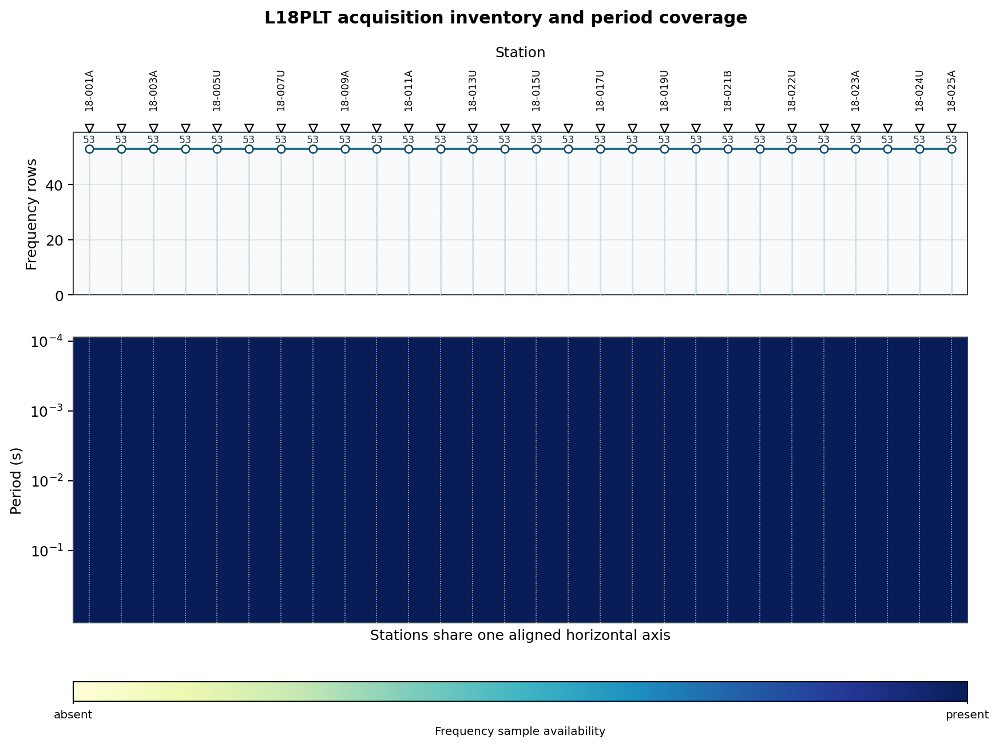
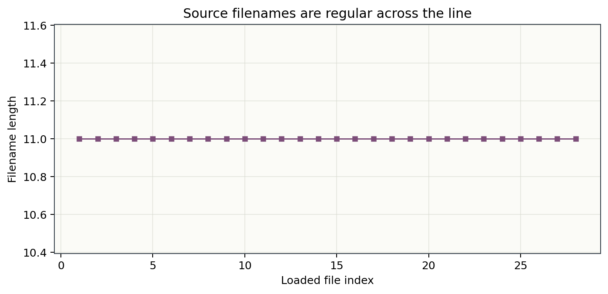
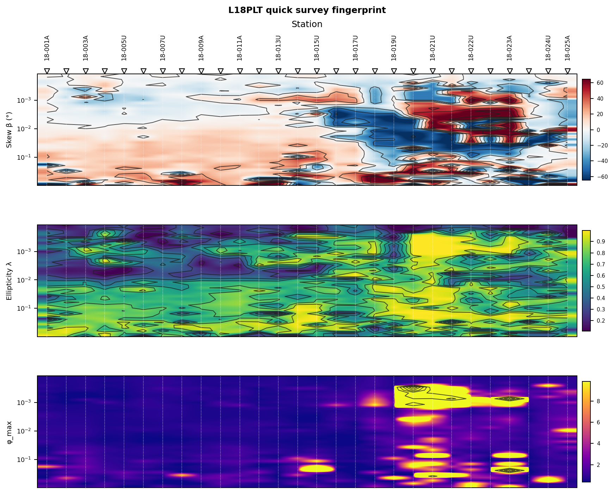

.. _tutorial_read_edi_survey:

Read an EDI Survey
==================

This tutorial is the first practical step in most pyCSAMT workflows. It shows
how to read one EDI file, a line directory, or a recursive survey tree, then
turn the result into a station inventory that can be inspected, saved, passed
to quality control, or used by downstream processing.

The goal is simple:

*load the survey once, verify what was found, and keep a clean object for the
next processing step.*

What You Will Learn
-------------------

After this tutorial you should be able to:

- read EDI files through the public :func:`pycsamt.api.read_edis` API
- understand the returned ``APISurvey`` object
- inspect station names, paths, frequency counts, and section availability
- convert the survey summary to a pandas dataframe
- handle recoverable parser errors during first inspection
- choose a duplicate-station policy
- run equivalent command-line inspection commands
- decide whether the survey is ready for QC, static-shift correction, or
  inversion preparation

Input Layouts
-------------

``read_edis`` accepts a single file, a directory, a glob-like path, or a
sequence of sources. The examples below use the bundled WILLY ``L18PLT`` line:

.. code-block:: text

   data/AMT/WILLY_DATA/L18PLT

Replace that path with your own EDI directory when you repeat the workflow. A
common field layout is one folder per line:

.. code-block:: text

   data/AMT/WILLY_DATA/
       L18PLT/
         18-001A.edi
         18-002U.edi
         18-003A.edi
       L22PLT/
         22-001A.edi
         22-002U.edi

If you pass ``data/AMT/WILLY_DATA`` with ``recursive=True``, pyCSAMT scans the
line folders and reads every ``.edi`` file it can discover.

For a flat directory, the layout can be simpler:

.. code-block:: text

   data/
     edis/
       S001.edi
       S002.edi
       S003.edi

The same API call works for both layouts.

Read a Survey Directory
-----------------------

Use :func:`pycsamt.api.read_edis` for the public v2 API. During first
inspection, ``strict=False`` is usually the best choice because it keeps
reading the remaining stations when one file has a recoverable issue.

.. code-block:: pycon

   >>> from pycsamt.api import read_edis
   >>> survey = read_edis(
   ...     "data/AMT/WILLY_DATA/L18PLT",
   ...     recursive=False,
   ...     strict=False,
   ...     on_dup="replace",
   ...     progress=False,
   ... )
   >>> print(survey)
   APISurvey: edi_survey
   sites: 28
   stations: 23-18-001A, 23-18-002U, 23-18-003A, 23-18-004A, 23-18-005U, 23-18-006A, 23-18-007U, 23-18-008U, ...
   source: data/AMT/WILLY_DATA/L18PLT

The returned object is an ``APISurvey``. It is a friendly public facade over
the lower-level EDI collection. It keeps the high-level workflow readable while
still exposing the raw collection when you need advanced operations. The
``23-`` prefix on every station name is the EDI ``DATAID`` field
(``23-18-001A``, encoding the 2023 acquisition year), reported as-is rather
than trimmed -- worth knowing before matching these names against a
QC or confidence table keyed on the plain ``18-001A`` form.

.. code-block:: pycon

   >>> from pathlib import Path
   >>> print(survey.n_sites)
   28
   >>> print(survey.stations[:5])
   ['23-18-001A', '23-18-002U', '23-18-003A', '23-18-004A', '23-18-005U']
   >>> print([Path(p).name for p in survey.paths[:5]])
   ['18-001A.edi', '18-002U.edi', '18-003A.edi', '18-004A.edi', '18-005U.edi']
   >>> collection = survey.collection
   >>> same_collection = survey.to_collection()
   >>> collection is same_collection
   True

``survey.paths`` itself returns fully-resolved absolute filesystem paths, not
bare filenames -- ``Path(p).name`` is applied above to keep the printed
list short and portable across machines; use the raw ``survey.paths`` value
when you need the actual location on disk. ``survey.collection`` and
``survey.to_collection()`` return the identical ``EDICollection`` object, not
just the same type -- ``to_collection()`` is a convenience alias, not a
fresh copy, and is the type used by many lower-level EDI, site, editing, and
QC helpers.

Read One EDI File
-----------------

For a single EDI file, use :func:`pycsamt.api.read_edi` when you want the raw
``EDIFile`` object directly:

.. code-block:: pycon

   >>> from pycsamt.api import read_edi
   >>> edi = read_edi("data/AMT/WILLY_DATA/L18PLT/18-001A.edi")
   >>> print(edi.station)
   23-18-001A

If you want the same ``APISurvey`` interface used by the rest of this tutorial,
read the file with ``read_edis`` instead:

.. code-block:: pycon

   >>> survey1 = read_edis(
   ...     "data/AMT/WILLY_DATA/L18PLT/18-001A.edi",
   ...     recursive=False,
   ...     progress=False,
   ... )
   >>> print(survey1.n_sites)
   1
   >>> print(survey1.summary())
   APIFrame: edi_survey_summary
   kind: edi.summary
   shape: 1 rows x 6 columns
   columns: station, path, n_freq, tipper, spectra, ts
   numeric: 1 columns
   missing: 0.0%
   source: data/AMT/WILLY_DATA/L18PLT/18-001A.edi

This is useful when you are writing reusable code that should accept either one
file or many files.

Build a Station Inventory
-------------------------

The fastest survey inventory is ``survey.summary()``. It returns an
``APIFrame`` with a compact station-level table.

.. code-block:: pycon

   >>> summary = survey.summary()
   >>> print(summary)
   APIFrame: edi_survey_summary
   kind: edi.summary
   shape: 28 rows x 6 columns
   columns: station, path, n_freq, tipper, spectra, ts
   numeric: 1 columns
   missing: 0.0%
   source: data/AMT/WILLY_DATA/L18PLT
   >>> inventory = summary.to_pandas(copy=True)
   >>> compact = inventory.copy()
   >>> compact["path"] = compact["path"].map(lambda value: Path(value).name)
   >>> print(compact.head(5).to_string(index=False))
      station        path  n_freq  tipper  spectra    ts
   23-18-001A 18-001A.edi      53   False    False False
   23-18-002U 18-002U.edi      53   False    False False
   23-18-003A 18-003A.edi      53   False    False False
   23-18-004A 18-004A.edi      53   False    False False
   23-18-005U 18-005U.edi      53   False    False False

The figures in this tutorial are generated by
``docs/scripts/generate_tutorial_read_edi.py``. This overview shows that every
loaded station has 53 impedance-frequency rows and that the bundled line does
not include tipper, spectra, or time-series sections:

Both panels confirm the same two facts visually: the top panel's markers sit
on a flat line at ``53`` for every one of the 28 stations (no station lost
frequencies during acquisition or parsing), and the bottom panel is solid
dark blue across the whole period range for every station (every frequency
sample is present, not just counted). A ragged top line or a mottled bottom
panel would be the visual signal to investigate specific stations before
moving on, rather than a uniform coverage problem.

The default columns are:

``station``
    Station name inferred from the EDI file.

``path``
    Source file path.

``n_freq``
    Number of frequency rows read from the impedance section.

``tipper``
    Whether non-empty tipper data are available.

``spectra``
    Whether a spectra section was parsed.

``ts``
    Whether a time-series section was parsed.

For a focused table, request the columns you want:

.. code-block:: pycon

   >>> station_table = survey.summary(
   ...     fields=["station", "n_freq", "tipper", "path"],
   ... )
   >>> focused = station_table.to_pandas(copy=True)
   >>> focused["path"] = focused["path"].map(lambda value: Path(value).name)
   >>> print(focused.head(3).to_string(index=False))
      station  n_freq  tipper        path
   23-18-001A      53   False 18-001A.edi
   23-18-002U      53   False 18-002U.edi
   23-18-003A      53   False 18-003A.edi

Save the inventory for a field notebook, spreadsheet review, or processing
report:

.. code-block:: pycon

   >>> inventory.to_csv("survey_inventory.csv", index=False)

Inspect Stations Programmatically
---------------------------------

The ``APISurvey`` object behaves like a small collection. You can iterate over
loaded EDI objects, select one by name, or access a station by index.

.. code-block:: pycon

   >>> for i, edi in enumerate(survey):
   ...     if i >= 3:
   ...         break
   ...     print(edi.station, Path(edi.path).name)
   23-18-001A 18-001A.edi
   23-18-002U 18-002U.edi
   23-18-003A 18-003A.edi
   >>> first = survey[0]
   >>> type(first).__name__, first.station
   ('EDIFile', '23-18-001A')
   >>> station = survey.stations[0]
   >>> selected = survey.get_site(station)
   >>> selected.station == first.station
   True

Dropping the ``if i >= 3: break`` guard iterates over all 28 stations
instead of just the first three shown here. ``first`` is a real ``EDIFile``,
the underlying EDI object, and its ``station`` is still ``23-18-001A`` --
the DATAID-derived name is consistent at every level of the API, not just
at the survey-table level. ``get_site``
accepts the common identifiers used by the collection resolver, including
station names and file stems, and ``selected`` above resolves to the exact
same station as ``first``.

``get_site`` returns ``None`` by default when a station cannot be resolved,
rather than raising:

.. code-block:: pycon

   >>> maybe_site = survey.get_site("S999")
   >>> maybe_site is None
   True
   >>> if maybe_site is None:
   ...     print("Station not found")
   Station not found

Handle Parser Errors
--------------------

EDI files from different acquisition or processing software can vary in
metadata style. For a first pass, keep ``strict=False`` and inspect parser
errors after loading:

.. code-block:: pycon

   >>> errors = survey.errors()
   >>> print(f"{len(errors)} read error(s)")
   0 read error(s)
   >>> for path, exc in errors[:10]:
   ...     print(path, type(exc).__name__, exc)

The bundled line reads without parser errors, so the second loop above
prints nothing -- on a survey with real parser issues, each line would show
the offending file path, the exception class, and its message, which is
usually enough to tell a recoverable metadata quirk apart from a file that
needs re-export.

Use ``strict=True`` in automated validation jobs when the workflow should fail
as soon as one EDI cannot be read:

.. code-block:: pycon

   >>> strict_survey = read_edis(
   ...     "data/AMT/WILLY_DATA/L18PLT",
   ...     recursive=False,
   ...     strict=True,
   ...     progress=False,
   ... )
   >>> strict_survey.n_sites
   28

This stricter mode is useful before committing data to a project archive or
before running a batch inversion pipeline. On this clean bundled line, both
modes load the same 28 stations; the difference only shows up on a survey
with a genuinely broken file.

Choose a Duplicate Policy
-------------------------

Station names should normally be unique inside one survey or line. When two EDI
files resolve to the same station name, ``on_dup`` controls which object is kept
in the returned survey:

``on_dup="replace"``
    Keep the last station discovered for that name. This is the default and is
    useful when a later file is the corrected version.

``on_dup="keep"``
    Keep the first station discovered for that name. This is useful when the
    directory contains temporary exports that should not override the original
    file.

Example:

.. code-block:: pycon

   >>> multi_line = read_edis(
   ...     "data/AMT/WILLY_DATA",
   ...     recursive=True,
   ...     on_dup="keep",
   ...     progress=False,
   ... )
   >>> len(multi_line.stations)
   128
   >>> multi_line.stations[:5]
   ['23-18-001A', '23-18-002U', '23-18-003A', '23-18-004A', '23-18-005U']
   >>> multi_line.stations[-3:]
   ['23-34-023U', '23-34-024U', '23-34-025A']

``data/AMT/WILLY_DATA`` contains five line folders (``L18PLT``, ``L22PLT``,
``L26PLT``, ``L30PLT``, ``L34PLT``), and this recursive read finds all 128
stations across them, distinguished by their line-number prefix
(``18-``, ``22-``, ``26-``, ``30-``, ``34-``). No station name collides
across lines here, so ``on_dup="keep"`` never actually has to choose between
two files -- but on a project where two exports genuinely share a station
name, this is exactly the setting that decides which file wins. If
duplicate names are unexpected, inspect the source paths and fix the station
metadata or file selection before continuing.

Control Progress Output
-----------------------

The ``progress`` argument is intended for both notebooks and scripts:

.. code-block:: pycon

   >>> interactive = read_edis("data/AMT/WILLY_DATA/L18PLT", progress="auto")
   >>> quiet = read_edis("data/AMT/WILLY_DATA/L18PLT", progress=False)
   >>> always_show = read_edis("data/AMT/WILLY_DATA/L18PLT", progress=True)
   >>> interactive.n_sites, quiet.n_sites, always_show.n_sites
   (28, 28, 28)

``progress`` only changes whether a progress indicator is written to the
console while reading; it never changes which stations are loaded. Use
``progress=False`` in tests, scheduled jobs, and log files. Use
``progress="auto"`` during interactive survey inspection.

Read Several Sources
--------------------

You can pass several folders or files at once. This is helpful when a project
has separate field folders but you want one in-memory survey for inspection.

.. code-block:: pycon

   >>> two_lines = read_edis(
   ...     [
   ...         "data/AMT/WILLY_DATA/L18PLT",
   ...         "data/AMT/WILLY_DATA/L22PLT",
   ...     ],
   ...     recursive=True,
   ...     on_dup="replace",
   ... )
   >>> print(two_lines.summary())
   APIFrame: edi_survey_summary
   kind: edi.summary
   shape: 53 rows x 6 columns
   columns: station, path, n_freq, tipper, spectra, ts
   numeric: 1 columns
   missing: 0.0%
   source: ['data/AMT/WILLY_DATA/L18PLT', 'data/AMT/WILLY_DATA/L22PLT']

The merged survey has 53 rows -- the full 28 from ``L18PLT`` plus 25 from
``L22PLT``, so no station names collided between the two lines. Individual
files can be mixed into the same list alongside folders (for example a
single stray ``.edi`` recovered separately from the rest of a line); the
list form and the loading behaviour are identical whether every entry is a
folder or some entries are single files.

Before moving into QC, a quick filename regularity check can catch mixed
exports or accidental files:

Every one of L18PLT's 28 filenames is exactly 11 characters
(``18-001A.edi``, ``18-002U.edi``, ...), so the plotted line is perfectly
flat. A single station with a differently formatted filename -- a longer
name, a missing zero-pad, an extra suffix from a re-export -- would show up
as a visible spike, which is often the fastest way to notice that one file
in a folder came from a different acquisition batch or software export than
the rest.

Keep this merged survey only when the stations belong to the same processing
context. For inversion preparation, line identity and profile geometry often
matter, so many projects keep one survey object per line.

Use the CLI for Quick Checks
----------------------------

The command-line interface is useful before opening Python or when you want a
small report in a shell workflow.

Show a compact metadata summary:

.. code-block:: bash
   :linenos:

   pycsamt edi info data/AMT/WILLY_DATA/L18PLT
   pycsamt edi info data/AMT/WILLY_DATA/L18PLT --top 10
   pycsamt edi info data/AMT/WILLY_DATA/L18PLT --format csv

Show station coordinates:

.. code-block:: bash
   :linenos:

   pycsamt edi stations data/AMT/WILLY_DATA/L18PLT
   pycsamt edi stations data/AMT/WILLY_DATA/L18PLT --sort-by lat
   pycsamt edi stations data/AMT/WILLY_DATA/L18PLT --pattern "18-*" --format csv

Validate EDI structure:

.. code-block:: bash
   :linenos:

   pycsamt edi validate data/AMT/WILLY_DATA/L18PLT
   pycsamt edi validate data/AMT/WILLY_DATA/L18PLT --no-deep
   pycsamt edi validate data/AMT/WILLY_DATA/L18PLT --format json

Estimate profile geometry when a directory represents one survey line:

.. code-block:: bash
   :linenos:

   pycsamt edi profile data/AMT/WILLY_DATA/L18PLT
   pycsamt edi profile data/AMT/WILLY_DATA/L18PLT --bearing-method linear --distances

These commands complement the Python API. Use the CLI for fast inspection; use
Python when you need reusable processing, filtering, plotting, or export logic.

Move to QC
----------

After reading the survey, the next step is normally a quality-control table.
The ``survey.collection`` object can be passed directly to the QC helpers:

.. code-block:: pycon

   >>> from pycsamt.emtools.qc import build_qc_table
   >>> qc = build_qc_table(
   ...     survey.collection,
   ...     include_skew=True,
   ...     recursive=False,
   ...     api=True,
   ... )
   >>> qc_df = qc.to_pandas(copy=True)
   >>> qc_df.to_csv("survey_qc.csv", index=False)

The QC tutorial (:doc:`inspect_and_qc_survey`) explains how to interpret this
table and decide which stations need review.

If you want one more visual check before QC, a survey fingerprint compresses
phase-tensor behavior across stations and periods:

The three panels (skew, ellipticity, and maximum phase) all show the same
break partway along the profile: stations from ``18-001A`` to roughly
``18-017U`` are comparatively calm (pale, low-contrast skew; muted
ellipticity), while stations from about ``18-019U`` onward turn visibly
noisier -- strong alternating red/blue skew patches and bright yellow
ellipticity and ``phi_max`` streaks concentrated at short periods. That is
not a coincidence: ``18-017U``, ``18-021U``, ``18-021B``, and ``18-022U``
are exactly the stations :doc:`inspect_and_qc_survey` flags as low-confidence
using an entirely different, non-visual method (tensor consistency,
diagonal leakage, and spatial coherence scores). Seeing the same stations
stand out in a quick phase-tensor image and in a numeric confidence table is
a useful cross-check -- neither view depends on the other, so agreement
between them is real evidence, not a restatement of the same calculation.

Troubleshooting
---------------

No stations were loaded
    Check that the source path exists, that files use the ``.edi`` extension,
    and that ``recursive=True`` is enabled when EDI files are inside line
    subdirectories.

The station count is smaller than the number of files
    Some files may share the same station name. Inspect ``survey.paths`` and
    review ``on_dup``. Use unique station names before final processing.

The reader reports errors but still returns a survey
    This is expected with ``strict=False``. Review ``survey.errors()`` and
    decide whether the affected files can be ignored, repaired, or re-exported.

The summary has fewer columns than expected
    ``survey.summary()`` is intentionally lightweight. Use EDI station,
    profile, site, QC, or plotting tools for richer diagnostics.

The CLI and Python show different station order
    Directory traversal and sorting options can affect display order. Use the
    CLI ``--sort-by`` options or sort the pandas dataframe explicitly when
    order matters.

Next Steps
----------

- Run quality-control tables with :doc:`inspect_and_qc_survey`.
- Compare two lines before reusing one QC config with
  :doc:`compare_survey_lines_for_qc`.
- Correct static shift with :doc:`correct_static_shift`.
- Prepare inversion files with :doc:`prepare_occam2d_inversion`.

See Also
--------

:doc:`../getting_started/data_formats`
    Supported data layouts and file-format expectations.

:doc:`../user_guide/data_loading`
    Data loading concepts and reader selection.

:doc:`../cli/edi`
    EDI command reference.

:doc:`../api/api`
    Public API reference.
