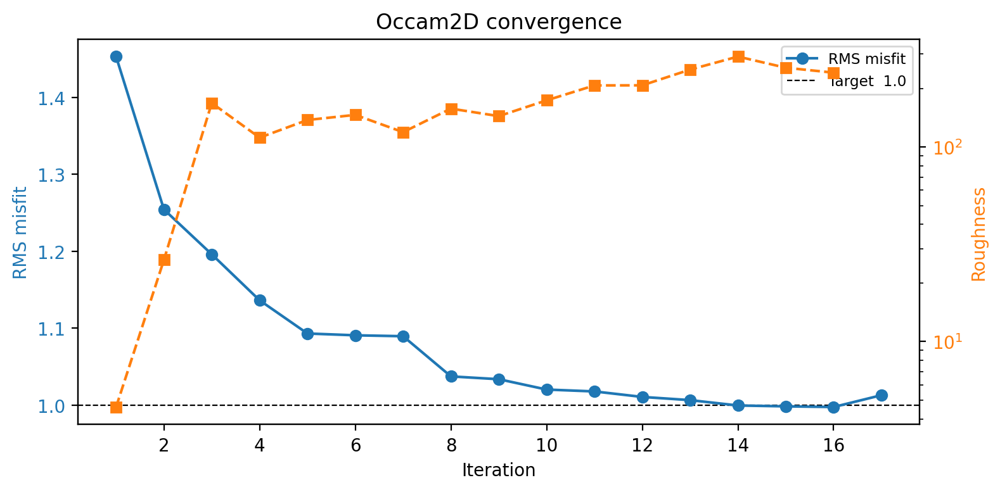
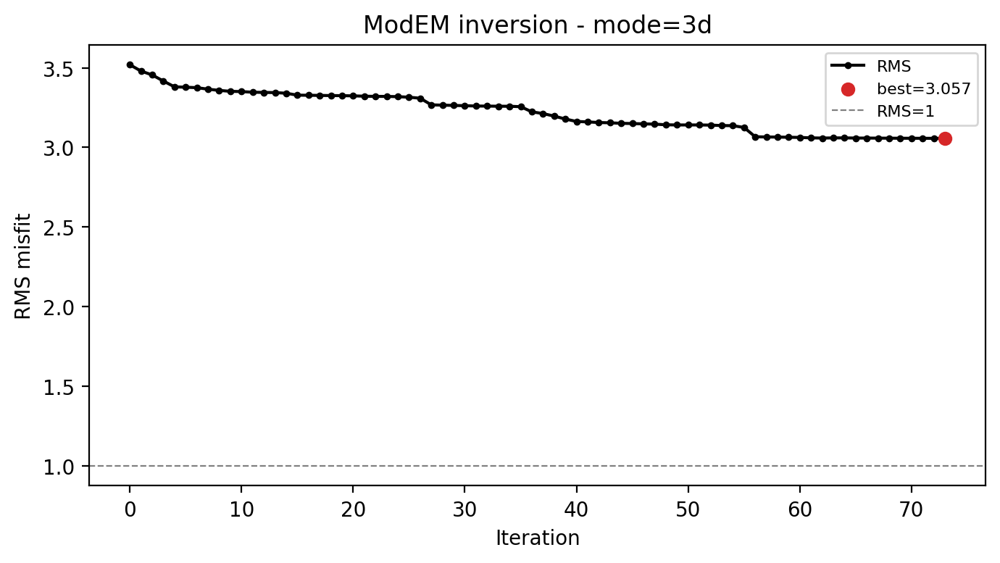
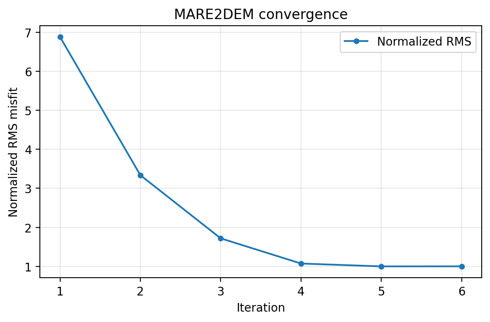

.. _tutorial_run_classical_inversions:

Run Classical Inversions: Occam2D, ModEM, and MARE2DEM
========================================================

The previous tutorials build native input files for a classical engine --
:doc:`prepare_occam2d_inversion` for Occam2D and
:doc:`map_porphyry_mineralization_from_noisy_amt` for both Occam2D and
ModEM. This tutorial picks up right after that point. It is deliberately
engine-agnostic: the run step is the same three-part recipe for Occam2D,
ModEM, and MARE2DEM --

1. locate or build the external binary;
2. build (and inspect) the exact command pyCSAMT would launch, then run it
   locally or hand it to a cluster scheduler;
3. load the finished run back into pyCSAMT once it completes.

None of the three engines ships a pre-compiled binary with pyCSAMT, and this
documentation build has none either -- every "run" call below is either a
dry-run command string or shown commented out, exactly as in the
user-guide backend pages this tutorial draws on. What actually did run to
produce the numbers here are three genuinely finished, bundled sample runs,
loaded at the end to compare how differently three real classical
inversions can converge.

What You Will Learn
--------------------

After this tutorial you should be able to:

- name the config, builder, runner, and result classes for each of the three
  classical engines and see how closely they mirror each other;
- explain how each runner locates or builds its executable, and what
  pyCSAMT can and cannot do about a missing binary;
- build a dry-run command for Occam2D, ModEM, and MARE2DEM from the same
  configuration object that built the input files;
- decide when to run locally through pyCSAMT versus handing a prepared
  directory to an external job scheduler;
- run Occam2D or ModEM through the ``pycsamt invert`` CLI, and know that
  MARE2DEM currently requires the Python API instead;
- load finished runs from all three engines and read their convergence
  state side by side.

Where Each Backend Stands
--------------------------

.. list-table::
   :header-rows: 1
   :widths: 16 17 17 17 17 16

   * - Engine
     - Config
     - Builder / Runner
     - Result loader
     - Bundled source
     - MPI
   * - :doc:`../user_guide/models/occam2d`
     - ``OccamConfig``
     - ``InputBuilder`` / ``OccamRunner``
     - ``InversionResult``
     - Yes -- Fortran source under ``pycsamt/models/occam2d/_source``,
       compiled with ``auto_compile=True``.
     - No
   * - :doc:`../user_guide/models/modem`
     - ``ModEmConfig``
     - ``InputBuilder`` / ``ModEmRunner``
     - ``InversionResult``
     - No -- ``Mod2DMT``/``Mod3DMT`` must be supplied externally.
     - Yes
   * - :doc:`../user_guide/models/mare2dem`
     - ``Mare2DEMConfig``
     - ``InputBuilder`` / ``Mare2DEMRunner``
     - ``InversionResult``
     - Not bundled, but ``SourceManager`` can download and build it.
     - Yes

The three ``InputBuilder`` and ``InversionResult`` names above are genuinely
different classes that happen to share a name -- always import them from
their own engine subpackage (``pycsamt.models.occam2d``,
``pycsamt.models.modem``, or ``pycsamt.models.mare2dem``), never from a
shared top-level path.

Recap: Prepared Native Inputs
-------------------------------

This tutorial assumes native files already exist. The quickest way to get
there for each engine, reusing the same bundled ``L18PLT`` AMT line and
MARE2DEM synthetic sample documented in the engine pages:

.. code-block:: pycon
   :linenos:

   >>> from pycsamt.site import Sites
   >>> sites = Sites.from_any("data/AMT/WILLY_DATA/L18PLT")

   >>> # Occam2D -- see prepare_occam2d_inversion for the full walkthrough
   >>> from pycsamt.models.occam2d import InputBuilder as OccamBuilder, OccamConfig
   >>> occam_cfg = OccamConfig(
   ...     modes=["TE", "TM"],
   ...     freq_min=0.1,
   ...     freq_max=1000.0,
   ...     error_floor_rho=0.05,
   ...     error_floor_phase=0.5,
   ...     n_layers=32,
   ...     cell_size_horizontal=100.0,
   ... )
   >>> occam_builder = OccamBuilder(sites, workdir="runs/willy_occam2d_run", config=occam_cfg)
   >>> occam_builder.build(title="WILLY L18PLT Occam2D run")
   >>> print(occam_builder.summary())
   InputBuilder summary
     workdir   : runs/willy_occam2d_run
     sites     : 28
     freqs     : 39
     data pts  : 4368
     mesh      : 42 x 36 cells
     params    : 512
     modes     : ['TE', 'TM']

   >>> # ModEM -- see prepare_modem_inversion for the full mesh-building walkthrough
   >>> from pycsamt.models.modem import InputBuilder as ModEmBuilder, ModEmConfig
   >>> modem_cfg = ModEmConfig(
   ...     mode="3d",
   ...     component_type="Full_Impedance",
   ...     initial_rho=100.0,
   ...     nx=28, ny=28, nz=38,
   ...     n_airlayers=5,
   ...     cell_size_h=500.0,
   ...     cell_size_v_top=10.0,
   ...     depth_scale=1.18,
   ...     n_padding_xy=8,
   ...     smooth_x=0.2, smooth_y=0.2, smooth_z=0.1,
   ...     n_smooth_iter=2,
   ... )
   >>> modem_builder = ModEmBuilder(config=modem_cfg)
   >>> modem_files = modem_builder.build(
   ...     sites,
   ...     workdir="runs/willy_modem_run",
   ...     data_filename=modem_cfg.data_file,
   ...     model_filename="m0.ws",
   ...     cov_filename=modem_cfg.covariance_file,
   ...     ctrl_filename=modem_cfg.control_file,
   ... )
   >>> print(sorted(modem_files))
   ['control', 'covariance', 'data', 'model']

   >>> # MARE2DEM -- see prepare_mare2dem_inversion for the full mesh-building walkthrough
   >>> from pycsamt.models.mare2dem import InputBuilder as Mare2DEMBuilder, Mare2DEMConfig
   >>> mare_cfg = Mare2DEMConfig(
   ...     initial_rho=10.0,
   ...     max_iterations=120,
   ...     target_rms=1.0,
   ...     data_file="line12.emdata",
   ...     resistivity_file="line12.resistivity",
   ...     settings_file="line12.settings",
   ... )
   >>> mare_builder = Mare2DEMBuilder(config=mare_cfg)
   >>> mare_files = mare_builder.build(
   ...     "data/mare2dem/demo_mt_inversion/demo_mt_synth.emdata",
   ...     workdir="runs/willy_mare2dem_run",
   ... )
   >>> print(sorted(f.name for f in mare_files.values()))
   ['line12.emdata', 'line12.resistivity', 'line12.settings']

Three unrelated backends, the same three-step shape: build a config, hand it
to an ``InputBuilder``, get back a dictionary of written file paths.

Locate Or Build The Binary
-----------------------------

Occam2D
~~~~~~~~~

``OccamRunner`` looks for the binary in this order: an explicit
``binary_path``, ``Occam2D``/``Occam2D.exe`` inside the run directory, the
executable on ``PATH``, then -- only with ``auto_compile=True`` -- the
bundled Fortran source under ``pycsamt/models/occam2d/_source``, built with
``make`` and a compiler such as ``gfortran``.

.. code-block:: pycon
   :linenos:

   >>> from pycsamt.models.occam2d import OccamRunner

   >>> runner = OccamRunner(workdir="runs/willy_occam2d_run", verbose=1)
   >>> try:
   ...     runner.discover_binary(auto_compile=False)
   ... except FileNotFoundError as exc:
   ...     print(str(exc).splitlines()[0])
   Occam2D binary not found.  Compile it manually:

Occam2D is the one engine here that pyCSAMT can attempt to build for you --
set ``auto_compile=True`` once ``gfortran``/``make`` are available, rather
than searching for a pre-built executable.

ModEM
~~~~~~~

pyCSAMT never bundles or builds ModEM. ``ModEmRunner`` only searches
``PATH``, the run directory, and local ``_source/2D``/``_source/3D``
subdirectories for a binary the user compiled elsewhere.

.. code-block:: pycon
   :linenos:

   >>> from pycsamt.models.modem import ModEmRunner

   >>> runner = ModEmRunner("runs/willy_modem_run", config=modem_cfg)
   >>> command = runner.command("m0.ws", "ModEMData.dat", "ModEM.inv", covariance="ModEM.cov")
   >>> print(command)
   Mod3DMT -I NLCG m0.ws ModEMData.dat ModEM.inv ModEM.cov

MARE2DEM
~~~~~~~~~~

MARE2DEM is the most involved of the three: no binary is bundled, but
``SourceManager`` can download the source and build it, provided MPI
Fortran/C tooling and Intel MKL/ScaLAPACK/BLACS are available on the
machine.

.. code-block:: pycon
   :linenos:

   >>> from pycsamt.models.mare2dem import Mare2DEMConfig, SourceManager

   >>> source_cfg = Mare2DEMConfig(source_dir="/opt/mare2dem/source")
   >>> source = SourceManager(config=source_cfg, verbose=1)
   >>> source.print_status()
   MARE2DEM SourceManager status
   ────────────────────────────────────────
     source_dir  : /opt/mare2dem/source
     downloaded  : False
     built       : False
     binary      : (not found)
     FC compiler : mpifort
     CC compiler : mpicc
     MKLROOT     : (not found — required)

   >>> # source.download(method="auto")
   >>> # source.build(clean_first=False)

Run ``print_status()`` before ``download``/``build`` on any new machine --
it is a cheap way to confirm compiler and MKL prerequisites before spending
time on a full source build.

Build The Command, Then Run
------------------------------

Every runner exposes a ``command()`` (or equivalent dry-run) method that
returns the exact string it would execute, without starting a subprocess.
Inspect it before running anything, especially with MPI involved.

.. list-table::
   :header-rows: 1
   :widths: 20 80

   * - Engine
     - Dry-run command example
   * - Occam2D
     - ``runner.run(max_iter=80, target_misfit=1.0)`` patches the startup
       file in place, then launches ``Occam2D`` against it. There is no
       separate ``command()`` preview -- inspect the patched ``Startup``
       file instead.
   * - ModEM
     - ``runner.command("m0.ws", "ModEMData.dat", "ModEM.inv",
       covariance="ModEM.cov")`` -> ``Mod3DMT -I NLCG m0.ws ModEMData.dat
       ModEM.inv ModEM.cov``, or ``mpirun -np N Mod3DMT ...`` with
       ``cfg.use_mpi = True``.
   * - MARE2DEM
     - ``runner.command(cfg.resistivity_stem)`` -> ``mpirun -np 8 MARE2DEM
       line12``.

Running locally through pyCSAMT is a thin :func:`subprocess.run` wrapper
around that same command -- shown here commented out, since none of these
binaries exist in this environment:

.. code-block:: pycon
   :linenos:

   >>> # Occam2D
   >>> # exit_code = OccamRunner("runs/willy_occam2d_run").run(
   >>> #     max_iter=80, target_misfit=1.0, auto_compile=False,
   >>> # )

   >>> # ModEM
   >>> # result = ModEmRunner("runs/willy_modem_run", config=modem_cfg).run(
   >>> #     "m0.ws", "ModEMData.dat", "ModEM.inv", covariance="ModEM.cov",
   >>> #     timeout=24 * 3600, load_result=True,
   >>> # )

   >>> # MARE2DEM
   >>> # result = Mare2DEMRunner("runs/willy_mare2dem_run", config=mare_cfg).run(
   >>> #     mare_cfg.resistivity_stem, use_mpi=True, n_procs=16,
   >>> #     timeout=None, load_result=True,
   >>> # )

.. warning::

   Every one of these runners is a subprocess wrapper around an external,
   independently developed executable. It cannot make a physically poor
   mesh, wrong component selection, or inconsistent coordinate system
   valid. Treat the printed command as a reproducibility aid, not a
   scientific approval stamp.

Running Externally Or On A Cluster
-------------------------------------

All three engines are equally happy to be run outside Python entirely --
this is often the right call for production 3-D ModEM or MARE2DEM runs,
where realistic runtimes make the ``run()`` wrapper's blocking
:func:`subprocess.run` call impractical.

1. Build and validate the native directory locally with the matching
   ``InputBuilder``.
2. Print the dry-run command (``runner.command(...)`` for ModEM/MARE2DEM,
   the patched ``Startup`` file for Occam2D) and record it, together with
   the pyCSAMT version, compiler/MPI context, and configuration file, in
   the run's :term:`provenance manifest`.
3. Copy the run directory to the target machine or cluster, and submit
   that same command through the job scheduler instead of through
   ``runner.run()``.
4. Once the scheduler reports completion, load the directory with the
   matching ``InversionResult`` -- it works identically whether the run
   happened locally or on a remote cluster, since it only reads files
   from the finished directory.

``OccamRunner`` and ``Mare2DEMRunner`` also expose asynchronous execution
(``run_async`` / polling via ``is_running`` and ``wait``) for scripts that
need to launch a run and continue doing other work locally, as an
alternative to a scheduler.

CLI Equivalent
----------------

The ``pycsamt invert`` command group currently wraps Occam2D and ModEM;
MARE2DEM has no CLI support yet, so use the Python API above for it.

.. code-block:: bash
   :linenos:

   pycsamt invert build data/AMT/WILLY_DATA/L18PLT \
       --solver occam2d --workdir runs/willy_occam2d_cli \
       --modes TE,TM --freq 0.1:1000 --n-layers 32

   pycsamt invert run runs/willy_occam2d_cli --solver occam2d
   pycsamt invert status runs/willy_occam2d_cli --solver occam2d
   pycsamt invert results runs/willy_occam2d_cli

.. code-block:: bash
   :linenos:

   pycsamt invert build data/AMT/WILLY_DATA/L18PLT \
       --solver modem --modem-mode 3d --initial-rho 100 \
       --workdir runs/willy_modem_cli

   pycsamt invert run runs/willy_modem_cli --solver modem --async
   pycsamt invert status runs/willy_modem_cli --solver modem

``invert run`` never rebuilds input files -- it only launches the solver
already sitting in the given work directory, detected from file signatures
such as ``Occam2DMesh`` or ``ModEMData.dat``, or supplied explicitly with
``--solver``. See :doc:`../cli/invert` for the full option reference.

Load And Compare Finished Runs
----------------------------------

Loading is where the three engines look most alike, and it is also where
their real-world behavior diverges the most. Rather than fabricate a
converged run for each engine, load the three genuinely finished samples
already bundled with pyCSAMT and documented in the engine pages:

.. code-block:: pycon
   :linenos:

   >>> from pycsamt.models.occam2d import InversionResult as OccamResult
   >>> from pycsamt.models.modem import InversionResult as ModEmResult
   >>> from pycsamt.models.mare2dem import InversionResult as Mare2DEMResult

   >>> occam = OccamResult("data/occam2D", iteration=17)
   >>> modem = ModEmResult("data/modem/willy_27freq_watex_line02_sample")
   >>> mare = Mare2DEMResult("data/mare2dem/demo_mt_inversion")

Loading each one is nearly identical across engines; reading them back
correctly is not. ``occam.final_rms`` (0.9977) is read straight from the
``.iter`` file the directory scan happens to find, while the table below
uses the *log*'s final entry (1.0131) instead -- the two numbers are
independent records of the same run and are expected to differ slightly,
exactly as :doc:`../user_guide/models/occam2d` explains. And
``mare.model`` here resolves to ``demo.0.resistivity`` -- the *starting*
half-space, not the converged iteration 6 model -- because
``"demo.0"`` sorts before ``"demo.6"`` in the directory scan; load
``demo.6.resistivity`` explicitly with ``read_resistivity`` when the
final model is what is actually needed, per
:doc:`../user_guide/models/mare2dem`.

.. list-table::
   :header-rows: 1
   :widths: 20 20 20 20 20

   * - Engine
     - Iterations
     - Final RMS
     - Best iteration
     - Converged?
   * - Occam2D
     - 17
     - 1.0131
     - 16 (RMS 0.9977)
     - Yes
   * - ModEM
     - 74
     - 3.0572
     - 73 (same as final)
     - No -- stalled well above target 1.0
   * - MARE2DEM
     - 6
     - 1.002
     - 6 (same as final)
     - Yes

These numbers come straight from :doc:`../user_guide/models/occam2d`'s
``OccamLog`` example, :doc:`../user_guide/models/modem`'s
``InversionResult``/``ModEmLog`` examples, and
:doc:`../user_guide/models/mare2dem`'s ``InversionResult``/``Mare2DEMLog``
examples. The spread is the point: three real classical inversions, on
different survey geometries and engines, converged completely differently
-- one cleanly, one not at all, one very quickly. Loading a result is never
itself evidence of a good inversion; only the RMS history and best iteration
are.

   Occam2D's bundled sample: RMS drops from 1.4528 to 1.0131 over 17
   iterations and stays close to target.

   ModEM's bundled sample: RMS falls from 3.52 to only 3.06 over 74
   iterations, with two long flat stretches -- the run stopped, but did not
   converge.

   MARE2DEM's bundled sample: RMS drops from 6.9 to 1.0 in just 6
   iterations -- the fastest of the three, on its own data and mesh.

None of this ranks the engines against each other -- these are three
different surveys, meshes, and data types, not a controlled comparison.
The lesson is what to check after *any* classical run: RMS history, best
iteration versus final iteration, and whether the run actually reached its
target, not just whether ``InversionResult`` loaded without an error.

Pre-Run Checklist
--------------------

Before submitting any of the three engines:

- the dry-run command points to the intended executable, files, and MPI
  process count;
- the configuration file used to build the inputs is saved next to the run
  directory;
- station coordinates, frequency band, and component selection have been
  reviewed, not just accepted from defaults;
- old output files from a previous experiment are not sitting in the same
  directory;
- pyCSAMT version, compiler, and MPI/module context are recorded in the
  run's provenance manifest.

The full engine-specific checklists -- mesh padding, covariance smoothing,
error floors, and so on -- are in each engine's own user-guide page; this
list is only the part that is common to launching all three.

Common Mistakes
------------------

The runner reports the binary was not found
    Expected without a compiled executable. For Occam2D, either pass
    ``binary_path`` explicitly or set ``auto_compile=True``. For ModEM and
    MARE2DEM, compile the engine externally (``SourceManager`` can do this
    for MARE2DEM) and confirm it is on ``PATH`` or in the run directory.

The CLI says the solver could not be detected
    Pass ``--solver occam2d`` or ``--solver modem`` explicitly rather than
    relying on file-signature detection, especially in a directory that
    mixes files from more than one engine or experiment.

A finished run's RMS never approached the target
    That is a real, valid ``InversionResult`` -- the bundled ModEM sample
    above is exactly this case. Loading successfully is not the same as
    converging; check the RMS history before trusting the model.

MARE2DEM was expected to work through the CLI
    It does not yet. Use ``Mare2DEMConfig``, ``InputBuilder``, and
    ``Mare2DEMRunner`` directly from Python instead of ``pycsamt invert``.

See Also
----------

:doc:`prepare_occam2d_inversion`
    Full Occam2D preparation walkthrough.

:doc:`prepare_modem_inversion`
    Full 3-D ModEM preparation and mesh-building walkthrough.

:doc:`prepare_mare2dem_inversion`
    Full MARE2DEM preparation and mesh-building walkthrough.

:doc:`map_porphyry_mineralization_from_noisy_amt`
    A combined Occam2D/ModEM preparation case study on a real noisy AMT
    survey.

:doc:`../user_guide/models/occam2d`
    Full Occam2D backend documentation, including plotting and QC.

:doc:`../user_guide/models/modem`
    Full ModEM backend documentation, including plotting and QC.

:doc:`../user_guide/models/mare2dem`
    Full MARE2DEM backend documentation, including source management and QC.

:doc:`../user_guide/models/choosing_backend`
    Deciding between Occam2D, ModEM, MARE2DEM, and AI inversion.

:doc:`../cli/invert`
    Inversion CLI reference for Occam2D and ModEM.
